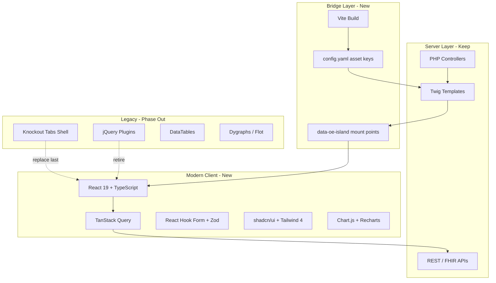

# OpenEMR Frontend Modernization Plan (2026)

> **Status:** In progress — **New Clinic module islands shipped (June 2026)** · **Date:** 2026-06-15 (updated 2026-06-28)  
> **Scope:** Frameworks, build tooling, charts, design system, and phased migration strategy  
> **Design system source:** [ui-ux-pro-max](../../.cursor/skills/ui-ux-pro-max/) — persisted at [`design-system/openemr-2026/MASTER.md`](../../design-system/openemr-2026/MASTER.md)

---

## Executive Summary

OpenEMR’s frontend is a **mature, layered legacy stack** (PHP views + Twig, Knockout shell, jQuery, Bootstrap 4, Gulp/SASS) with **three chart libraries** and **~1,000 interface PHP files**. A 2026-ready UI cannot be achieved with a single framework swap.

**Recommended strategy:** **Strangler-fig modernization** — keep PHP/Twig as the server rendering layer, introduce a **Vite + React 19 + TypeScript** “modern shell” for new and high-traffic surfaces, unify **charts and data tables**, adopt a **token-based accessible design system**, and retire legacy libraries incrementally.

**New Clinic (`oe-module-new-clinic`) — implemented June 2026:** All role desks and hub pages render via **React islands** (`frontend/` workspace, 16 Vite entries, Vitest). Legacy module desk jQuery was removed; PHP/Twig still owns auth, ACL, and page shell.

| Dimension | Today (core OpenEMR) | New Clinic module (shipped) | 2026 Target (platform-wide) |
|-----------|----------------------|----------------------------|----------------------------|
| App shell | Knockout.js + iframes (`main/tabs`) | T1 PHP/Twig shell + React islands | React shell (or hybrid) with route-based panels |
| CSS | Bootstrap 4.6 + 74 SCSS theme files + Gulp | Bootstrap 4 chrome + island BEM + tokens | Design tokens + Tailwind 4 + Bootstrap 5 bridge |
| Build | Gulp 4 (themes/assets only) | **Vite 8** (`frontend/` → module `assets/modern/`) | Vite (app bundles) + Gulp (themes, transitional) |
| Desk / queue UI | jQuery + Knockout | **React 19 + TypeScript** | Same pattern extended to other modules |
| Charts | Chart.js 4, Dygraphs, Flot | Stock deep links unchanged | **Chart.js 4** + **Recharts** dashboards |
| Tables | DataTables.net + jQuery | Custom React tables / queue cards | TanStack Table + shadcn DataTable pattern |
| Forms | jQuery Validation, validate.js, LForms | React forms in islands; stock encounter forms via deep link | React Hook Form + Zod (new UI); LForms retained for FHIR |
| Icons | Font Awesome 6 | FA in shell; Lucide optional in islands | Lucide React (new) + FA (legacy bridge) |
| i18n | i18next (partial) + PHP `xl()` | PHP `xl()` + React props from Twig | i18next + ICU messages shared PHP/JS |
| Browser targets | IE 8+ in `browserslist` (core) | Evergreen only (`frontend/package.json`) | Evergreen only |

---

## 1. Current State Audit

### 1.1 Repository footprint

| Asset | Count / location | Notes |
|-------|------------------|-------|
| Interface PHP | ~1,008 files | Primary UI controllers |
| Twig templates | ~269 files | Modern template path (forms, portal, clinical notes) |
| Interface JS | ~137 files | Mostly vanilla jQuery / Knockout view models |
| SCSS themes | 74 files under `interface/themes/` | Color themes, tabs, patient modules |
| TypeScript/React (first-party) | **`frontend/` workspace** | New Clinic: 16 Vite island entries, Vitest; core OpenEMR still 0 SPA source |

### 1.2 Core technology stack (from `package.json` + `CLAUDE.md`)

```
PHP 8.2+  →  Twig 3.x (modern) / Smarty 4.5 (legacy)
           →  Header::setupHeader() + config/config.yaml (asset registry)

JavaScript: jQuery 3.7 · Angular 1.8 · Knockout 3.5 · Backbone 1.6
CSS:        Bootstrap 4.6 · Bootswatch · PureCSS · Font Awesome 6
Build:      Gulp 4 · dart-sass · PostCSS · napa (legacy zip deps)
Test:       Jest 29 (minimal JS coverage)
```

### 1.3 Application shell architecture

The primary clinician experience is **`interface/main/tabs/main.php`**:

- **Knockout.js** view models (`application_view_model.js`, `tabs_view_model.js`, `patient_data_view_model.js`)
- **Tab + iframe** pattern for nearly all workflows
- Assets loaded via `Header::setupHeader(['knockout', 'tabs-theme', 'i18next', 'hotkeys', ...])`
- Symfony events (`ScriptFilterEvent`, `StyleFilterEvent`) allow modules to inject assets

This shell is the **highest-risk migration surface** — it touches session tokens, ACL, telemetry, and every downstream screen.

### 1.4 Asset loading model

`src/Core/Header.php` reads **`config/config.yaml`** and emits `<script>` / `<link>` tags. Key properties:

- Declarative asset keys (`chart`, `dygraphs`, `datatables`, `knockout`, etc.)
- Module extensibility via event dispatcher
- Twig helper: `{{ includeAsset() }}`
- Smarty legacy: `{headerTemplate}`

Any new framework must **integrate with this registry** (or provide a parallel `frontend/` package whose built files are registered in `config.yaml`).

### 1.5 Charting landscape (fragmented)

| Library | Version | Primary use cases | Files / signals |
|---------|---------|-------------------|-----------------|
| **Dygraphs** | vendored (`modified/dygraphs-2-0-0`) | Vitals trends, lab data, track-anything, encounter trends | `vitals.html.twig`, `labdata.php`, `trend_form.php`, `track_anything/` |
| **Chart.js** | 4.5.1 | Eye exam VA/IOP graphs | `eye_mag_functions.php` |
| **Flot** | 4.2.6 | DICOM viewer plots | `library/js/dwv/gui/plot.js` |
| **Growth charts** | Static CSS/PDF pages | Pediatric vitals | `interface/forms/vitals/growthchart/` |

**Problems:**

- Three APIs, three theming models, three i18n paths (`dygraphs.js.php` for month names)
- Dygraphs is unmaintained-feeling; Flot is legacy jQuery-era
- Chart.js is modern but only used in one specialty module
- No shared clinical chart primitives (reference ranges, units, date zoom, colorblind patterns)

### 1.6 UI library inventory (selected)

| Category | Library | 2026 assessment |
|----------|---------|-----------------|
| Rich text | CKEditor 5, Summernote | Keep CKEditor 5; retire Summernote over time |
| Tables | DataTables.net | Replace in new UI with TanStack Table |
| Select | Select2 | Replace with Radix/shadcn Combobox |
| Date/time | jquery-datetimepicker, Moment | Move to `date-fns` + accessible date picker |
| DnD | SortableJS, interactjs | Retain where needed; prefer dnd-kit in React |
| Imaging | dwv, Konva, magic-wand | Keep domain-specific; wrap in React islands |
| FHIR forms | LForms (NLM) | **Retain** — required for questionnaire assessments |
| PDF | jsPDF | Evaluate `@react-pdf/renderer` for new reports only |
| Validation | jquery-validation, validate.js | Zod schemas at API boundary + RHF |

### 1.7 Theming

- **74 SCSS files** compiled by Gulp into `public/themes/`
- Bootstrap 4 variables in `interface/themes/default-variables.scss` (`$blue: #007bff`, etc.)
- Multiple color themes: `style_light`, `style_dark`, `style_manila`, `style_solar`, `style_forest_green`, `style_cobalt_blue`
- `oe-` prefixed Bootstrap overrides in `interface/themes/oe-bootstrap.scss`
- RTL support via `oemr-rtl.scss`, `directional.scss`

### 1.8 Portal

Patient portal (`portal/`, `templates/portal/`) is **Twig-forward** with legacy Savant/PHP in `portal/patient/fwk/`. Portal should follow the **same modern component library** as staff UI for consistency, deployed as a separate Vite entry (`portal.tsx`).

### 1.9 What is already moving in the right direction

- **Twig adoption** for newer forms (clinical notes, observation, newpatient, vitals)
- **Chart.js 4** already in dependencies
- **CKEditor 5**, **i18next**, **DOMPurify** are modern
- **Symfony events** for module asset injection
- **REST/FHIR APIs** (`/api/`, FHIR) can back a SPA data layer
- **New Clinic React islands** — `frontend/` + [`FRONTEND_MODULE_GUIDE.md`](../FRONTEND_MODULE_GUIDE.md) (desks + hubs shipped June 2026)
- Internal PRDs (e.g. `NEW_CLINIC_V1_PRD.md`) originally deferred new frameworks in V1 — **module UI has since migrated to React islands** while core OpenEMR tab shell remains legacy
- **New Clinic V1 UI/UX:** [`NEW_CLINIC_V1_UI_UX_DESIGN_PLAN.md`](./NEW_CLINIC_V1_UI_UX_DESIGN_PLAN.md) **(v2.0.0)** — Bootstrap 4 page chrome + React island components; tokens via `frontend/src/core/tokens.css`; module-scoped shadcn migration plan in §9

### 1.10 New Clinic module — current UI stack (June 2026)

The New Clinic module (`oe-module-new-clinic`) is the **first production consumer** of the Vite + React island pattern:

| Area | Implementation |
|------|----------------|
| App shell | T1 PHP/Twig top bar + module nav (`shell.js` for nav/role switch only) |
| Role desks, Visit Board, Front Desk | React islands — `frontend/src/islands/*-desk/`, `visit-board/` |
| Hubs (admin, comms, registry, reports, chart depth, bill ops, lab ops, MRD) | React islands behind **product** flags (`enable_bill_ops`, etc.) |
| AJAX / auth | PHP `public/ajax.php` + `oeFetch` (CSRF-aware) from React |
| Design tokens | `frontend/src/core/tokens.css` + module SCSS for shell |
| Build / test | `npm run frontend:build` · Vitest · Playwright smoke + golden-path E2E |

**Authoritative docs:** [FRONTEND_MODULE_GUIDE.md](../FRONTEND_MODULE_GUIDE.md) · [UI/UX Design Plan](./NEW_CLINIC_V1_UI_UX_DESIGN_PLAN.md) · [PAGE_DESIGNS](./NEW_CLINIC_V1_PAGE_DESIGNS.md)

Legacy module desk jQuery was **removed** (w50react). Stock OpenEMR deep-link pages (encounter, Rx, lab results) remain core jQuery/Knockout with optional legacy patient context strip injection.

---

## 2. Design System (ui-ux-pro-max)

Generated with:

```bash
python .cursor/skills/ui-ux-pro-max/scripts/search.py \
  "healthcare EMR EHR clinical dashboard professional accessible" \
  --design-system --persist -p "OpenEMR 2026"
```

Persisted master file: **`design-system/openemr-2026/MASTER.md`**

### 2.1 Style direction: Accessible & Ethical

Healthcare UIs must prioritize **WCAG AAA-oriented patterns** over visual trend-chasing:

- 16px+ body text, 4.5:1+ contrast
- Visible 3–4px focus rings
- Keyboard navigation, skip links, ARIA labels
- `prefers-reduced-motion` respected
- 44×44px minimum touch targets
- **Avoid:** neon palettes, motion-heavy animations, “AI purple/pink” gradients

### 2.2 Color palette (map to CSS tokens)

| Role | Hex | Suggested token | Maps from current |
|------|-----|-----------------|-------------------|
| Primary | `#0891B2` | `--oe-primary` | Replace `$cyan` / primary blue |
| Secondary | `#22D3EE` | `--oe-secondary` | Accent highlights |
| CTA / Success | `#059669` | `--oe-cta` | Clinical “go” actions |
| Background | `#ECFEFF` | `--oe-bg` | Light clinical wash |
| Text | `#164E63` | `--oe-text` | Body copy |

**Dark mode:** derive from `style_dark` theme using same hue family at lower luminance (not pure gray-on-black).

### 2.3 Typography

| Role | Font | Rationale |
|------|------|-----------|
| Headings | **Figtree** | Clean, medical, professional |
| Body | **Noto Sans** | Excellent i18n glyph coverage |

```css
@import url('https://fonts.googleapis.com/css2?family=Figtree:wght@300;400;500;600;700&family=Noto+Sans:wght@300;400;500;700&display=swap');
```

**Note:** For air-gapped installs, ship WOFF2 files in `public/assets/fonts/` and drop Google Fonts CDN.

### 2.4 Icons

| Context | Choice |
|---------|--------|
| New React UI | **Lucide** (consistent 24×24 SVG) |
| Legacy PHP/Twig | Font Awesome 6 during bridge |
| **Do not** | Emoji as icons |

### 2.5 UX guidelines (clinical-specific)

From ui-ux-pro-max domain searches:

| Area | Guideline |
|------|-----------|
| **Tables** | `overflow-x-auto` on mobile; card layout for patient lists on small screens |
| **Forms** | Validate on blur; clear required indicators; loading → success/error on submit |
| **Charts** | Line charts for vitals trends; pattern overlays for colorblind users; distinguish actual vs forecast |
| **Real-time** | Streaming vitals: provide pause control; no flashing without user control |

### 2.6 Page-level overrides

When building a specific surface, add:

```
design-system/openemr-2026/pages/<page>.md
```

Page rules **override** `MASTER.md` (e.g. `pages/vitals-dashboard.md`, `pages/portal-home.md`).

---

## 3. Recommended 2026 Target Stack

### 3.1 Architecture: Strangler Fig + Islands



**Principles:**

1. **PHP + Twig remain** the authority for auth, CSRF, ACL, and initial HTML.
2. **New interactivity** ships as Vite-built **islands** mounted into Twig via `<div id="oe-app-..." data-props="...">`.
3. **No big-bang rewrite** of `main/tabs` until islands prove stable.
4. **Modules** (`interface/modules/custom_modules/`) get their own Vite entries — same pattern as core.

### 3.2 Framework choice: React 19 + TypeScript

| Option | Verdict |
|--------|---------|
| **React 19 + TS** | **Recommended** — largest healthcare/FHIR ecosystem, shadcn/ui, TanStack, mature hiring pool |
| Vue 3 + TS | Viable for modules; avoid splitting core across two frameworks |
| Angular (new) | Poor fit with existing Angular 1.8 — would add a third Angular generation |
| Svelte | Excellent DX but smaller clinical ecosystem |
| Full SPA (Next.js) | Rejected — fights OpenEMR’s PHP session model and iframe history |

### 3.3 UI component library: shadcn/ui + Tailwind CSS 4

> **New Clinic-specific cutover:** The phased migration of New Clinic's shipped React islands from BEM (`oe-nc-*`) to shadcn primitives is detailed in [NEW_CLINIC_V1_UI_UX_DESIGN_PLAN §9](./NEW_CLINIC_V1_UI_UX_DESIGN_PLAN.md#9-shadcnui-migration-plan) (Phase A tokens → Phase B drop-in wrappers → Phase C behavior-bearing primitives → Phase D composites/greenfield → Phase E retire BEM). That doc is the source of truth for module shadcn work; this section gives the platform-wide rationale.

Why shadcn (per ui-ux-pro-max stack guidance):

- **DataTable** = TanStack Table + accessible table primitives
- **Chart** = Recharts wrapper with consistent theming
- **Form** = React Hook Form integration
- **Blocks** = dashboard/login scaffolding (`npx shadcn@latest add dashboard-01`)
- Components are **copied into the repo** (no opaque npm UI black box) — good for GPL project

Tailwind coexists with legacy Bootstrap during migration:

- New islands: Tailwind + shadcn
- Legacy pages: Bootstrap 4 → 5 upgrade path
- Shared **CSS variables** bridge both (`--oe-primary` consumed by both BS and Tailwind config)

### 3.4 State & data

| Concern | Library |
|---------|---------|
| Server state | **TanStack Query v5** (cache, retry, polling for queues) |
| Client UI state | React `useState` / `useReducer`; **Zustand** only if needed |
| Forms | **React Hook Form** + **Zod** |
| URL state | `nuqs` or React Router (inside islands only) |

Data access:

- Prefer existing **REST** (`/api/`) and **FHIR** endpoints
- Session-authenticated `fetch` with CSRF headers for staff UI
- OAuth2 for external/mobile clients (already supported)

### 3.5 Build tooling

| Tool | Role |
|------|------|
| **Vite 6** | Bundle React islands, tree-shaking, HMR |
| **TypeScript 5.x** | Strict mode for `frontend/` |
| **Gulp 4** (transitional) | Existing SCSS theme compilation |
| **PostCSS** | Tailwind + autoprefixer |
| **ESLint 9** + **Prettier** | Already started; extend for TS/React |
| **Vitest** + **Testing Library** | Unit/component tests for new UI |
| **Playwright** | E2E (extend existing suite) |

Proposed monorepo layout:

```
frontend/
  package.json              # separate from root or workspace
  vite.config.ts
  tsconfig.json
  src/
    core/                   # design tokens, api client, i18n
    components/             # shadcn + OpenEMR composites
    charts/                 # unified chart primitives
    islands/                # mount helpers
    apps/
      shell/                # future tab shell
      patient-chart/        # demographics, vitals, labs
      portal/               # patient portal widgets
      admin/                # config dashboards
  dist/                     # built assets → public/assets/modern/
```

Register built files in `config/config.yaml`:

```yaml
oe-modern:
    basePath: '%assets_static_relative%/modern/'
    script: patient-chart.js
    link: patient-chart.css
```

### 3.6 CSS strategy

**Phase A — Tokens (low risk)**

Add `interface/themes/tokens/_openemr-2026.scss` with CSS variables from design system; import in all themes.

**Phase B — Bootstrap 5**

- Upgrade BS 4.6 → 5.3+ (breaking: jQuery plugin rewrites, data attribute changes)
- Use Bootstrap’s CSS variables mode where possible
- Update `datatables.net-bs4` → `datatables.net-bs5` **or** skip by moving to TanStack Table

**Phase C — Tailwind for new code only**

- Prefix utilities `tw-` if collision fear is high (optional)
- `@tailwindcss/vite` plugin

### 3.7 Browser support modernization

Current `browserslist` includes **IE ≥ 8** — remove in Phase 0:

```json
"browserslist": [
  "last 2 Chrome versions",
  "last 2 Firefox versions",
  "last 2 Safari versions",
  "last 2 Edge versions"
]
```

---

## 4. Chart Modernization Strategy

### 4.1 Target: two libraries, one design language

| Use case | Library | Wrapper |
|----------|---------|---------|
| Clinical time-series (vitals, labs, flowsheets) | **Chart.js 4** | `@openemr/charts` internal package |
| Dashboards, admin analytics, composition charts | **Recharts** via shadcn `Chart` | Dashboard islands |
| DICOM / pixel plots | **Flot** → evaluate **Chart.js scatter** or keep Flot isolated | dwv only |
| Real-time monitoring (future) | Chart.js streaming plugin or **uPlot** | Vitals bedside mode |

**Retire:** Dygraphs (migrate), Flot (isolate then replace).

### 4.2 Shared chart primitives (`frontend/src/charts/`)

Build once, use everywhere:

```typescript
// Conceptual API
<ClinicalTrendChart
  series={[{ label: 'BP Systolic', unit: 'mmHg', data, refRange: [90, 120] }]}
  xAxis="time"
  onRangeSelect={(from, to) => ...}
  locale={i18n.language}
  colorblindSafe
/>
```

Features to implement:

| Feature | Priority | Notes |
|---------|----------|-------|
| Time axis with zoom/pan | P0 | Replace dygraphs interaction model |
| Reference range bands | P0 | BP, glucose, pediatric percentiles |
| Multi-series + legend | P0 | Labs panel |
| i18n month/day labels | P0 | Port logic from `dygraphs.js.php` |
| Colorblind-safe palettes | P0 | ui-ux-pro-max: pattern overlays |
| Export PNG/PDF | P1 | Clinical documentation |
| Print stylesheet | P1 | Matches `style_pdf.scss` |
| Real-time append | P2 | Queue monitors, bedside vitals |
| FHIR Observation mapping | P2 | Align with FHIR R4 value types |

### 4.3 Migration map

| Current surface | Today | Migration |
|-----------------|-------|-----------|
| Vitals graph (`vitals.html.twig`) | Dygraphs | Chart.js `ClinicalTrendChart` island |
| Lab trends (`labdata.php`) | Dygraphs | Same component, lab API adapter |
| Encounter trends (`trend_form.php`) | Dygraphs | Same |
| Track anything (`track_anything/`) | Dygraphs | Same |
| Eye mag IOP/VA (`eye_mag_functions.php`) | Chart.js 4 | Refactor to shared wrapper |
| DICOM (`dwv/gui/plot.js`) | Flot | Phase 3 — lowest priority |
| Growth charts | Static PDF/CSS | Keep; optional Chart.js percentile curves later |

### 4.4 Chart theming

Bind chart colors to design tokens:

```javascript
const chartTheme = {
  primary: 'hsl(var(--oe-primary))',
  grid: 'hsl(var(--oe-border))',
  text: 'hsl(var(--oe-text))',
  refRange: 'hsla(var(--oe-cta), 0.15)',
};
```

Support **light/dark** via `style_light` / `style_dark` theme class on `<html>`.

---

## 5. Phased Roadmap

### Phase 0 — Foundation (Q2 2026, ~6–8 weeks)

**Goal:** Tooling and tokens without user-visible breakage.

| Task | Output |
|------|--------|
| Create `frontend/` Vite workspace | Build pipeline CI job |
| Add design tokens SCSS + CSS variables | All themes import tokens |
| Update `browserslist` | Drop IE |
| Add `oe-modern` asset keys to `config.yaml` | Header can load Vite bundles |
| Island mount helper (`mountOpenEMRIsland()`) | Twig macro |
| ESLint/Prettier/TS strict for `frontend/` | Lint in CI |
| Document module pattern for Vite entries | `Documentation/FRONTEND_MODULE_GUIDE.md` |

**Success criteria:** Empty React island loads inside a Twig template in Docker dev.

### Phase 1 — High-value islands (Q3 2026, ~10–12 weeks)

**Goal:** Modern UX where clinicians spend time — **without touching Knockout shell**.

| Surface | Rationale |
|---------|-----------|
| Vitals trend chart | Dygraphs replacement, visible win |
| Lab results trend | Same chart primitive |
| Patient summary widgets | Cards, allergies, problems |
| Portal home cards | Patient-facing polish |
| Admin dashboard (telemetry, system stats) | Low ACL risk |

Deliverables:

- `@openemr/charts` package
- shadcn DataTable prototype for patient search
- i18n bridge: export PHP translation keys to JSON for i18next

### Phase 2 — Forms & tables (Q4 2026, ~12 weeks)

| Task | Notes |
|------|-------|
| New patient form sections as React islands | Twig shells remain |
| Replace DataTables on 2–3 heaviest list views | Scheduling, patient finder |
| Select2 → Combobox | Staged per page |
| Moment → date-fns | Align with chartjs-adapter-date-fns |
| Bootstrap 4 → 5 spike | Fix breaking changes in themes |

### Phase 3 — Shell modernization (2027 H1, high risk)

| Task | Notes |
|------|-------|
| Prototype React tab shell behind feature flag | `global.enable_modern_shell` |
| Replace iframe tabs with fetch + React Router routes | Preserve ACL per route |
| Knockout view models → React context | Parallel run both shells |
| Module menus via JSON API | Already partially event-driven |

**Do not start Phase 3 until Phase 1 charts and Phase 2 tables are stable in production.**

### Phase 4 — Legacy retirement (2027 H2+)

| Retire | When |
|--------|------|
| Dygraphs | After all trend surfaces migrated |
| Flot | After dwv evaluation |
| Angular 1.8 | Audit usage; likely minimal |
| Knockout | After shell migration |
| jQuery plugins | Last — remove with shell |
| Gulp for themes | After Tailwind token migration complete |
| Summernote | After CKEditor coverage confirmed |

---

## 6. Integration Patterns

### 6.1 Twig + React island

```twig
{# templates/components/oe_island.html.twig #}
<div
  id="oe-island-{{ name }}"
  data-island="{{ name }}"
  data-props="{{ props|json_encode|e('html_attr') }}"
></div>
{{ includeAsset(['oe-modern-' ~ name]) }}
```

```typescript
// frontend/src/islands/vitals-chart.tsx
import { mountIsland } from '@/core/mount';
import { VitalsChart } from '@/apps/patient-chart/VitalsChart';

mountIsland('vitals-chart', VitalsChart);
```

### 6.2 CSRF + session fetch wrapper

```typescript
export async function oeFetch(path: string, init?: RequestInit) {
  const csrf = document.querySelector('meta[name="csrf-token"]')?.getAttribute('content');
  return fetch(path, {
    ...init,
    headers: {
      'Content-Type': 'application/json',
      ...(csrf ? { 'X-CSRF-Token': csrf } : {}),
      ...init?.headers,
    },
    credentials: 'same-origin',
  });
}
```

### 6.3 Module development

Custom modules (`oe-module-*`) should:

1. Add `frontend/` or `public/js/src/` with their own Vite entry
2. Register assets via `ScriptFilterEvent` **or** `config.yaml` module section
3. Follow design system page override if module has distinct UX

---

## 7. Testing & Quality

| Layer | Tool | Target |
|-------|------|--------|
| Chart unit tests | Vitest | Data adapters, ref range logic |
| Component tests | Testing Library | Forms, tables, a11y |
| Visual regression | Playwright screenshots | Vitals chart, portal home |
| a11y | axe-core in Playwright | WCAG 2.2 AA minimum |
| PHP integration | Existing PHPUnit | Controllers still serve Twig |
| Bundle size | Vite rollup visualizer | < 200KB gzip per island |

**Pre-delivery checklist** (from ui-ux-pro-max): see `design-system/openemr-2026/MASTER.md` § Pre-Delivery Checklist.

---

## 8. Risks & Mitigations

| Risk | Impact | Mitigation |
|------|--------|------------|
| Knockout shell rewrite breaks workflows | High | Feature flag; parallel shells; iframe fallback |
| Bootstrap 5 breaks 74 theme files | High | Incremental; visual regression suite |
| GPL compatibility with shadcn (MIT) | Low | MIT compatible with GPL; document attribution |
| Air-gapped sites block CDN fonts | Medium | Self-host Noto Sans + Figtree WOFF2 |
| i18n fragmentation (PHP + JS) | Medium | Translation export pipeline |
| Module ecosystem divergence | Medium | Standard module frontend guide + shared `@openemr/ui` package |
| Clinical validation / FDA context | Variable | Chart changes need clinical review; no diagnostic claims |
| Performance on low-end hardware | Medium | Code-split islands; lazy load charts |

---

## 9. What NOT to do

1. **Do not** replace PHP with a full JavaScript SPA framework for the entire app.
2. **Do not** introduce a second modern framework (stick to React).
3. **Do not** migrate the tab shell first — highest risk, lowest early value.
4. **Do not** remove jQuery until dependent plugins are gone.
5. **Do not** adopt motion-heavy UI or low-contrast “modern” aesthetics — healthcare requires Accessible & Ethical patterns.
6. **Do not** block LForms / FHIR questionnaire flows — wrap, don’t rewrite.

---

## 10. Success Metrics (2026)

| Metric | Baseline | Target |
|--------|----------|--------|
| Chart libraries in active use | 3 | 1 (+ Recharts for admin only) |
| First-party TypeScript coverage | 0% | 30% of new UI code |
| Lighthouse Accessibility (portal home) | TBD | ≥ 90 |
| Patient chart load (p95) | TBD | No regression vs baseline |
| Mobile-usable clinical lists | Poor | Horizontal scroll + card mode |
| Browser support | IE8+ | Evergreen |
| Developer onboarding for UI | Gulp + legacy docs | `frontend/README.md` + Storybook |

---

## 11. Immediate Next Steps

1. **Review & approve** this plan with core maintainers (scope Phase 0 only for first PR).
2. **Create** `frontend/` scaffold PR: Vite + React + one hello-world island in a Twig template.
3. **Add** `design-system/openemr-2026/pages/vitals-dashboard.md` with chart-specific overrides.
4. **Spike** Dygraphs → Chart.js migration on vitals screen (feature flag).
5. **Update** `browserslist` and document supported browsers in `CONTRIBUTING.md`.

---

## Appendix A — Dependency upgrade matrix

| Package | Current | Target | Action |
|---------|---------|--------|--------|
| bootstrap | 4.6.2 | 5.3.x | Phase 2 upgrade |
| jquery | 3.7.1 | remove (eventual) | Phase 4 |
| knockout | 3.5.1 | remove | Phase 3–4 |
| angular | 1.8.3 | remove | Audit → retire |
| chart.js | 4.5.1 | 4.x latest | Keep, centralize |
| dygraphs | vendored | remove | Migrate Phase 1 |
| flot | 4.2.6 | remove/isolate | Phase 3–4 |
| datatables.net | 1.13.11 | remove (new UI) | TanStack Table |
| moment | 2.30.1 | date-fns | Phase 2 |
| select2 | 4.0.13 | Radix Combobox | Phase 2 |
| gulp | 4.0.2 | keep → reduce | Transitional |
| jest | 29.7.0 | vitest (frontend) | Phase 0 |
| i18next | 24.2.3 | keep | Extend coverage |

## Appendix B — ui-ux-pro-max commands reference

```bash
# Regenerate design system
python .cursor/skills/ui-ux-pro-max/scripts/search.py \
  "healthcare EMR dashboard" --design-system --persist -p "OpenEMR 2026"

# Chart guidance
python .cursor/skills/ui-ux-pro-max/scripts/search.py \
  "clinical vitals trends" --domain chart

# UX guidelines
python .cursor/skills/ui-ux-pro-max/scripts/search.py \
  "healthcare accessibility forms tables" --domain ux

# shadcn implementation patterns
python .cursor/skills/ui-ux-pro-max/scripts/search.py \
  "dashboard clinical forms data tables" --stack shadcn
```

## Appendix C — Key file references

| File | Purpose |
|------|---------|
| `package.json` | Legacy npm dependencies |
| `gulpfile.js` | Theme/asset build |
| `config/config.yaml` | Asset registry for Header |
| `src/Core/Header.php` | Script/style injection |
| `interface/main/tabs/main.php` | Knockout application shell |
| `interface/themes/` | SCSS themes |
| `library/js/xl/dygraphs.js.php` | Dygraphs i18n bridge |
| `design-system/openemr-2026/MASTER.md` | 2026 design system |

---

*This document is a proposal. Implementation requires community review, phased PRs, and clinical workflow validation before production rollout.*
