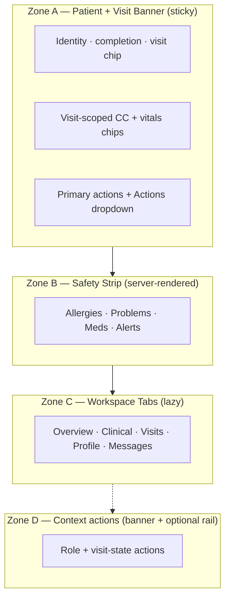

# Medical Record Dashboard — Redesign Specification (v0.2)

| Field | Value |
|-------|--------|
| **Document version** | 0.2.36 |
| **Status** | Draft for review |
| **Companion to** | [NEW_CLINIC_V1_PRD.md](./NEW_CLINIC_V1_PRD.md) (v1.20.47), [NEW_CLINIC_V1_USER_WORKFLOWS.md](./NEW_CLINIC_V1_USER_WORKFLOWS.md) (v1.9.47), [NEW_CLINIC_V1_PAGE_DESIGNS.md](./NEW_CLINIC_V1_PAGE_DESIGNS.md) (v0.6.47), [NEW_CLINIC_V1_MEDICAL_HISTORY_BACKGROUND_REDESIGN.md](./done/NEW_CLINIC_V1_MEDICAL_HISTORY_BACKGROUND_REDESIGN.md) (v0.1.1), [NEW_CLINIC_V1_SCHEDULING_REDESIGN.md](./done/NEW_CLINIC_V1_SCHEDULING_REDESIGN.md) (v0.2.3), [NEW_CLINIC_V1_PATIENT_CHART_DEPTH_REDESIGN.md](./done/NEW_CLINIC_V1_PATIENT_CHART_DEPTH_REDESIGN.md) (v0.1.15), [NEW_CLINIC_V1_PATIENT_REFERRALS_LETTERS_REDESIGN.md](./NEW_CLINIC_V1_PATIENT_REFERRALS_LETTERS_REDESIGN.md) (v0.1.1), [NEW_CLINIC_V1_LAB_OPERATIONS_REDESIGN.md](./done/NEW_CLINIC_V1_LAB_OPERATIONS_REDESIGN.md) (v0.1.8), [NEW_CLINIC_V1_PHARMACY_OPERATIONS_REDESIGN.md](./done/NEW_CLINIC_V1_PHARMACY_OPERATIONS_REDESIGN.md) (v0.1.8), [NEW_CLINIC_V1_BILLING_AR_BACKOFFICE_REDESIGN.md](./done/NEW_CLINIC_V1_BILLING_AR_BACKOFFICE_REDESIGN.md) (v0.1.3) |
| **Audience** | Product, design, clinical leads, implementers, QA |
| **Core target** | `interface/patient_file/summary/demographics.php` (page id `core.mrd`) |
| **Implementation** | Design only — no code in this document |

---

## Table of contents

1. [Purpose & positioning](#1-purpose--positioning)
2. [Problems with stock OpenEMR MRD](#2-problems-with-stock-openemr-mrd)
3. [Design goals & principles](#3-design-goals--principles)
4. [Locked v0.1 decisions](#4-locked-v01-decisions)
5. [Information architecture — four zones](#5-information-architecture--four-zones)
6. [Zone A — Patient + visit banner](#6-zone-a--patient--visit-banner)
7. [Zone B — Safety strip](#7-zone-b--safety-strip)
8. [Zone C — Workspace tabs (5 tabs)](#8-zone-c--workspace-tabs-5-tabs)
9. [Zone D — Actions (banner-first hybrid)](#9-zone-d--actions-banner-first-hybrid)
10. [Role defaults & visit-state matrix](#10-role-defaults--visit-state-matrix)
11. [Completion, duplicates, pediatric DOB](#11-completion-duplicates-pediatric-dob)
12. [Insurance & cash treatment](#12-insurance--cash-treatment)
13. [Responsive layout](#13-responsive-layout)
14. [States & empty cases](#14-states--empty-cases)
15. [Migration map — stock cards → new homes](#15-migration-map--stock-cards--new-homes)
16. [Performance & extensibility](#16-performance--extensibility)
17. [Acceptance criteria](#17-acceptance-criteria)
18. [Out of scope (v0.1)](#18-out-of-scope-v01)
19. [Open questions](#19-open-questions)
20. [Document history](#20-document-history)

---

## 1. Purpose & positioning

### 1.1 What we are redesigning

The **Medical Record Dashboard (MRD)** is OpenEMR’s default patient chart summary (`demographics.php`, heading *Medical Record Dashboard*, page id `core.mrd`). Today it shows 25+ collapsible widgets in a two-column layout with parallel AJAX fragment loads.

### 1.2 Role in New Clinic V1

| Layer | Purpose | Primary users |
|-------|---------|---------------|
| **New Clinic role desks** (Front Desk, Triage, Doctor Desk, etc.) | Daily OPD operations — queues, next actions, golden path | All clinic roles |
| **Visit Board** | Who is waiting, in what stage | All clinic roles (read-mostly) |
| **Redesigned MRD** | **Full chart** — depth on demand, compliance, admin | Secondary path; admin; complex cases |

The PRD treats the MRD as **orchestrated core depth**, not the clinic operating system:

- Front Desk **M1a-F08**: “Open full chart” is a **secondary** link.
- Doctor Desk **M4-F02**: summary fields live on the **desk card**; MRD is not the consult home.
- Cashier workflow stays on **Cashier** screen; MRD shows completion context only when opened.
- **Encounter lifecycle:** MRD does **not** create encounters and does **not** require session bind (PRD Appendix F, D-M4-NAV-1b). Encounter is created at Front Desk **Start visit** only.
- **Doctor on encounter:** Blank **`form_encounter.provider_id`** before **Take patient** is **expected** (vitals may exist); banner does not treat as error (PRD §6.1e, D41).
- **Same-day visits:** Banner shows the **active (unfinished)** visit only; **Visits** tab lists **all** today’s encounters/visits when patient returned multiple times (PRD §6.5.0, D40).
- **Concurrent access:** MRD has **no clinical-form locking** — multiple staff may open the same chart; queue ownership stays on role desks (PRD §6.1c, Appendix G).
- **Supervisory consult:** MRD shows read-only **Supervising: Dr {name}** chip on visit banner when `form_encounter.supervisor_id` set; supervisor reviews via chart — does not Take patient. Editing supervisor is on **Doctor Desk combobox** (PRD §6.1d, PAGE_DESIGNS §4.12) — not on MRD in V1.

```text
Golden path (daily):  Role desk → Visit Board → core deep links
Full chart (depth):   Open full chart → Redesigned MRD
```

### 1.3 What this redesign does not replace

- Visit Board (M2)
- Front Desk search / Registration form (M1b) — [FRONT_DESK_REGISTRATION](./done/NEW_CLINIC_V1_FRONT_DESK_REGISTRATION_REDESIGN.md)
- Doctor Desk queue (M4)
- Cashier payment queue (M5)
- Core encounter editor, procedure order, Rx UI, fee sheet

---

## 2. Problems with stock OpenEMR MRD

| # | Problem | Impact on private OPD |
|---|---------|----------------------|
| P1 | **Information overload** — 25+ cards, no task focus | Staff hunt instead of act |
| P2 | **Patient-centric, not visit-centric** — no FSM / queue awareness | Cannot answer “where is this patient in today’s flow?” |
| P3 | **Role-blind** — same chart for reception, doctor, cashier | Violates “tasks over menus” (PRD §3.3) |
| P4 | **US insurance bias** — billing widget, insurer balances | Wrong mental model for cash clinic (PRD §19) |
| P5 | **No completion score or chokepoint UI** | Cannot support 70% billing gate (PRD §10) |
| P6 | **Scattered clinical summary** — vitals, CC, meds in separate cards | Doctor scrolls before consult (conflicts M4-F02) |
| P7 | **Chatty load** — 10+ parallel AJAX fragments on open | Slow on shared tablets at front desk |
| P8 | **Desktop-first** — `col-md-8` / `col-md-4` dense layout | Poor at triage/cashier breakpoints (PRD §2.2) |
| P9 | **Monolithic controller** — ~2,000-line `demographics.php` | Hard to extend without forking core behavior |

---

## 3. Design goals & principles

### 3.1 Goals

| ID | Goal | Measurable indicator |
|----|------|----------------------|
| MRD-G1 | Safety above the fold | Allergies visible without scroll on viewport ≥ 360px |
| MRD-G2 | Visit context when module installed | Active `new_visit` state + queue # in sticky banner |
| MRD-G3 | Role-appropriate emphasis | Default tab + primary banner action match role (§10) |
| MRD-G4 | Consult-ready Overview | Doctor sees CC + today’s vitals + allergies without scrolling (aligns M4-F02) |
| MRD-G5 | Cashier-ready Profile | Completion % + balance visible when visit is `ready_for_payment` |
| MRD-G6 | Faster first paint | Server-render banner + safety strip; ≤1 lazy tab fetch on open |
| MRD-G7 | Stock fallback | Works when New Clinic module not installed (no visit chip; generic actions) |

### 3.2 Principles

1. **Patient + visit context, always visible** — sticky banner.
2. **Safety before depth** — allergies, problems, meds, alerts above the fold.
3. **One question per zone** — Who? What’s wrong? What’s happening today?
4. **Progressive disclosure** — summary default; depth on tab switch.
5. **Role-aware emphasis, not role-restricted data** — same data; different defaults and actions.
6. **Visit-state reactive** — banner and actions adapt to `new_visit.state`.
7. **Cash truth** — balance due in clinic currency; no insurance balance prominence.
8. **Destructive actions gated** — delete, overrides, close-without-charge require confirm + reason + ACL.

---

## 4. Locked v0.1 decisions

Decisions confirmed in product review (2026-06-07):

| # | Question | **Locked answer** |
|---|----------|-------------------|
| D-MRD-1 | Tab count & structure | **5 tabs** — Overview · Clinical · Visits · Profile · Messages. Documents folded into Profile. Admin removed from tab bar (⋯ overflow, ACL-gated). |
| D-MRD-2 | Rail vs inline actions | **Banner-first hybrid** — 2–3 primary buttons + **Actions ▾** dropdown. Optional right rail ≥1200px only, collapsed by default on tablet. Mobile → bottom action sheet. |
| D-MRD-3 | Vitals in banner | **Yes, visit-scoped** — show BP/T/HR chips when vitals exist for today’s encounter; amber “No vitals today” when visit active but none; hidden when no active visit. Chief complaint one-liner when present. |
| D-MRD-4 | Insurance UI | **Hide entirely** when `enable_insurance = false` (default V1 cash clinic). When enabled: collapsed subsection under Profile → Coverage. NHIS membership = simple Profile field only (not billing workflow). |
| D-MRD-5 | Horizontal patient nav | **Hide** for Clinic roles; **⋯** → Classic patient menu (O-MRD-1 closed) |
| D-MRD-6 | T1 shell on MRD | **Yes** when module installed (O-MRD-2 closed) |
| D-MRD-7 | Implementation path | Theme + module overlay V1; optional core PR V1.1 (O-MRD-3 closed) |
| D-MRD-8 | Timeline vs tabs | **Timelines are supplementary, not primary nav.** D-MRD-1 **5-tab IA** + role desks + Visit Board Kanban remain primary. Activity feeds live **inside** Overview and Visits tabs — never a single scroll-the-whole-chart timeline replacing tabs. |
| D-MRD-9 | Event enum (closed) | Single canonical `event_type` vocabulary in **§8.6** — audit drawer, Visits expand, and activity feed share IDs; display titles differ per surface. **No** parallel names (`visit_started` vs `visit_created`). |
| D-MRD-10 | Clinical tab layout (closed) | **§8.9** — **seven core sections (1–7)** with stable anchor IDs; sections **8–10** conditional (LBF, external care, PRO); stock **History & Lifestyle** → **Background**; encounter forms → **This visit**; past visit **View documentation** → core encounter forms; PMH duplication rule in PRD **§6.1h** (D49) |
| D-MRD-11 | Wrong patient on chart (closed) | Zone A sticky identity per PRD **§6.1i**; cancel while chart open → blocking banner (same as desks); chart navigation to new `pid` = full reload — no silent pid swap |
| D-MRD-12 | Legacy chart overlay (V1.2-CTX) | When `enable_legacy_patient_context_overlay` = 1 — mini identity strip on stock `patient_file/*` per T1-F18 ([LEGACY_CHART_CONTEXT](./done/NEW_CLINIC_V1_LEGACY_CHART_CONTEXT_REDESIGN.md)); does not replace Zone A on redesigned MRD |
| D-MRD-13 | Open full chart landing tab (closed) | **Role default tab** per **§10.1** / **§16.3** — never the stock 25-card dashboard layout. Hosts may pass explicit `?tab=` (e.g. reception → Profile). Generic **Open full chart** without `?tab=` resolves role default server-side. |

---

## 5. Information architecture — four zones



### 5.1 Desktop wireframe (≥1200px)

```text
┌────────────────────────────────────────────────────────────────────────────┐
│  ZONE A — STICKY BANNER                                                    │
│  [Photo] Akua Mensah · MRN 00482 · F · 34y · DOB 1991-02-14               │
│          ●●●●●●●○○○ 72% complete                                           │
│          🟢 Visit · Ready for doctor · Queue #14 · Started 09:12           │
│          CC: Headache 3 days                                               │
│          BP 142/91 · T 37.4 · HR 88                                        │
│          [Open encounter]  [Order labs]  [Actions ▾]              [⋯]     │
├────────────────────────────────────────────────────────────────────────────┤
│  ZONE B — SAFETY STRIP                                                     │
│  ┌─Allergies──┐ ┌─Problems─┐ ┌─Medications┐ ┌─Alerts──────┐               │
│  │ Penicillin⚠│ │ HTN      │ │ Amlodipine │ │ 1 due       │               │
│  └────────────┘ └──────────┘ └────────────┘ └─────────────┘               │
├──────────────────────────────────────────────────────┬─────────────────────┤
│  ZONE C — TABS                                       │  ZONE D (optional)  │
│  [Overview*] [Clinical] [Visits] [Profile] [Messages]│  Rail mirrors       │
│  ─────────────────────────────────────────────       │  Actions ▾ when     │
│  (active tab content — lazy loaded once)             │  viewport ≥1200px   │
└──────────────────────────────────────────────────────┴─────────────────────┘
```

`*` = default tab varies by role (§10).

---

## 6. Zone A — Patient + visit banner

**Component:** Reuse module [`patient-context-banner` Tier 1](./NEW_CLINIC_V1_PAGE_DESIGNS.md#411-patient-context-banner-component-patient-context-banner) via `PatientPreviewDto` (M0-F20). MRD adds Zone B safety strip (four cards) below the banner — not embedded in the Twig partial.

Sticky full-width banner. Replaces today’s scattered header, horizontal patient nav emphasis, and inline alerts.

| Element | Source / rule |
|---------|---------------|
| Photo / initials | Documents category; placeholder if none |
| Name · MRN (`pubpid`) · sex · age · DOB | **Estimated DOB** badge when `dob_estimated=1` (PRD DOB-F07) |
| Completion ring | `new_patient_completion.score`; red &lt;40, amber 40–69, green ≥70; hidden at 100% |
| Active visit chip | `new_visit.state` + `queue_number`; click → Visit Board filtered to patient; absent if no **unfinished** visit today |
| **Today’s visit count** | When patient has **>1 visit today**, subtle “Visit 2 of 2 today” or “2 visits today” on chip row; finished visits not shown on banner — see **Visits** tab |
| Visit badges on chip | **URGENT** when `is_urgent=1`; **Skipped triage** when visit reached doctor queue without triage (see USER_WORKFLOWS §12.2); **Direct lab** when `service_profile=lab_direct`; **Pharmacy walk-in** when `service_profile=pharmacy_walkin`; **Referral on file** when `referral_document_id` set (inbound — D34); **Referral issued** when active `encounter_id` has outbound `LBTref` / `new_referral_meta` for today (success token — D-REF-5); **Referred to OPD** when prior same-day pharmacy visit closed with `rx_required_refer_to_opd` (informational) (PRD §6.8.6, D34); **Supervising: Dr {name}** when `form_encounter.supervisor_id` set and visit active (PRD §6.1d, read-only on MRD) |
| Critical badges | Severe allergy, deceased, pediatric DOB rule, active override flag |
| Chief complaint | One line from `new_visit.chief_complaint` when visit active (§6.1f, D43) — **not** encounter SOAP in V1 |
| Vitals chips | Today’s vitals for current encounter (D-MRD-3); `BP · HR · T · SpO₂ · RR` when captured; red **Vitals abnormal** when thresholds breached (M3-F14) |
| Primary actions | 2–3 role + state buttons (§9) |
| **Actions ▾** | Secondary actions dropdown |
| **⋯** overflow | Admin-only: ledger, transactions, delete patient (ACL-gated) |
| Help | Existing `medical_dashboard_help.php` |

### 6.1 Vitals chips (visit-scoped)

| Condition | Banner shows |
|-----------|--------------|
| Active visit + vitals recorded today | `BP 142/91 · HR 88 · T 37.4 · SpO₂ 97 · RR 16` (include only captured fields) — tap opens vitals form **on MRD only** (role-desk banner chips are display-only in V1; deep links V1.1-OPS §6.3) |
| Active visit + vitals + threshold breach | Above + red **Vitals abnormal** chip with breach summary (informational) |
| Active visit + no vitals today | Amber chip: `No vitals today` — tap → record vitals (nurse/doctor ACL) |
| No active visit | No vitals row |

### 6.3 Banner deep links (V1.1 — P1)

When `enable_banner_mrd_deep_links` = 1 (V1.1-OPS slice), tapping banner chips on role desks opens MRD in a **new tab** at the matching anchor:

| Banner chip | MRD target |
|-------------|------------|
| Severe allergies / allergy count | Clinical tab — allergies section |
| Active meds (+N more) | Clinical tab — medications |
| Problems count | Clinical tab — problems |
| Results ready / lab ordered | Clinical tab — labs |
| Vitals abnormal | Clinical tab — `#clinical-vitals` |
| **Pregnant** (V1.1-OPS) | Clinical tab — problems or L3; optional banner chip when config ON |
| **Background / PMH** | Clinical tab — `#clinical-background` |

V1 pilot: chips are **display-only** on desks; staff use **Open full chart** → Overview or Clinical. Deep links are optional polish — not pilot-blocking (PRD §6.1g, NG15).

### 6.2 Visit chip colors (semantic)

| State group | Chip treatment |
|-------------|----------------|
| `waiting`, `in_triage` | Blue + queue # |
| `ready_for_doctor` | Amber + queue # |
| `with_doctor` | Green + queue # |
| `ready_for_lab`, `in_lab`, `lab_complete` | Teal |
| `ready_for_pharmacy`, `in_pharmacy`, `pharmacy_complete` | Purple |
| `ready_for_payment` | Purple + **Balance due: XX** when charges exist |
| Active visit + doctor ACL `new_chart_depth_finance_summary` | Optional read-only chip: **Visit charges: XX** when visit is clinical (`with_doctor`, lab/pharmacy states) — same AR read; no receipt # (D-FIN-8) |
| `completed`, `cancelled`, `closed_unpaid` | Grey + terminal label / reason |

When New Clinic module is **not** installed: visit chip hidden; banner shows identity + completion only (if module provides completion elsewhere, else omit ring).

---

## 7. Zone B — Safety strip

Four equal cards, **server-rendered in first response** (no AJAX). Desktop: one row. Mobile: 2×2 grid.

| Card | Data source | Display rule |
|------|-------------|--------------|
| **Allergies** | `AllergyIntoleranceService` | Severe first; **“None known”** is a valid L3 value |
| **Active problems** | `PatientIssuesService` | Top 5 active; “+N more” → Clinical tab |
| **Active medications** | `PatientIssuesService` / `prescriptions` | Top 5; eRx-aware |
| **Priority alerts** | CDR (if enabled) + module flags | Count due/overdue; tap → Messages or Overview |

Each card: **title · count · up to 5 items · “View all” link**.

Respects existing `hide_dashboard_cards` global — map legacy keys to strip + tab (§15).

---

## 8. Zone C — Workspace tabs (5 tabs)

Only the **active tab** loads content (lazy fetch, cache in DOM). Tab choice persists per user. Deep-linkable: `?tab=clinical`.

| Tab | Staff mental model | Contents | Default role |
|-----|-------------------|----------|--------------|
| **Overview** | “What’s going on *today*?” | Encounter summary, open orders, recent activity (90d), **unsigned encounters (action required)**, clinical reminders detail | Nurse, Doctor |
| **Clinical** | “What’s their medical picture?” | **§8.9** — Background, problems, allergies, meds, immunizations, labs, vitals trends, **This visit** forms, LBF/tracks; **Referrals strip** when outbound letters exist (§8.10) | Lab, Pharmacy (scroll to section) |
| **Visits** | “When have they been here?” | Future / recurring / past appointments, **today’s visit timeline (all encounters/queue #s when multiple same day)**, recalls, advance directives | Reception (secondary) |
| **Profile** | “Who are they — are they complete?” | Demographics, **completion checklist** (L1–L4, aligned with [FRONT_DESK_REGISTRATION](./done/NEW_CLINIC_V1_FRONT_DESK_REGISTRATION_REDESIGN.md)), NHIS/ID, region+district, portal, **Documents & ID** (photos, scans, amendments, disclosures), **Payments strip** (§8.10) | Reception, Cashier |
| **Messages** | “Who said what?” | Care team, patient-scoped `pnotes`, patient reminders, eRx panel (if enabled) — **not** the clinic-wide [COM hub](./done/NEW_CLINIC_V1_COMMUNICATIONS_HUB_REDESIGN.md) inbox | Doctor (secondary) |

**COM vs MRD Messages (closed):** Use **Communications Hub** for staff inbox across all patients; use **MRD Messages tab** for this patient’s chart-scoped notes and reminders. See [COMMUNICATIONS §1](./done/NEW_CLINIC_V1_COMMUNICATIONS_HUB_REDESIGN.md#1-purpose--positioning).

**Navigation rule (D-MRD-8):** Staff land on a **tab** (or role desk), not an infinite chart timeline. Chronological feeds are **sections within tabs** — see §8.3–§8.5.

### 8.1 Admin & ledger (not a tab)

| Item | Location |
|------|----------|
| Ledger / balance detail | **⋯** overflow → “View ledger” |
| Transactions | **⋯** overflow (ACL `patients` / `trans`) |
| Delete patient | **⋯** overflow (admin super + global) |
| External data | **⋯** overflow or Clinical tab footer |

### 8.2 Horizontal patient nav (legacy)

Stock OpenEMR patient menu (Dashboard, History, Report, Documents, …) is **de-emphasized**:

- **V1 New Clinic roles (T1-F06):** When redesigned MRD is chart host (B7), **hide** horizontal nav items **History** and **Assessments (SDOH)** for `new_clinic` roles via menu restrict — content lives in Clinical **Background** (§8.9, **T1-F20**) and **This visit** + core encounter. **Dashboard** replaced by MRD itself. **Ledger**, **Report**, **Transactions** hidden **per Chart Depth sub-flag** when `enable_chart_depth` = 1 (D-EXP-6) — not all at once at CDa alone.
- **Power users / admin:** full menu still reachable via **⋯** → “Classic patient menu” — includes legacy **History** editor and **Report** for encounter summaries not yet replicated in MRD.

### 8.3 Overview tab — layout (T1-F15)

Lazy-loaded once per MRD session. Server returns HTML shell + JSON for dynamic blocks.

```text
┌─ Overview ─────────────────────────────────────────────────────────────┐
│ A. Today’s encounter summary (when active visit)                       │
│ B. Action required — unsigned documentation + open orders              │
│ C. Recent activity feed (90d, paginated)                               │
│ D. Clinical reminders detail (when CDR enabled)                        │
└────────────────────────────────────────────────────────────────────────┘
```

| Block | When shown | Primary interaction |
|-------|------------|-------------------|
| **A. Today’s encounter** | Active `new_visit` today | Read-only summary: queue #, state, CC, vitals chip, assigned doctor — links to Visit Board filtered |
| **B. Action required** | Unsigned encounter and/or open lab/Rx orders | Row action → core screen or Clinical tab anchor (§8.4.3) — **deduped from feed** (§8.3.1) |
| **C. Recent activity** | Always (may be empty) | Mixed inline expand + tab navigation (§8.4) — excludes rows duplicated in B |
| **D. Reminders** | When reminders exist | Expand inline list; **View all** → Messages or reminder detail |

#### 8.3.1 Attention stack — Block B vs activity feed (dedup)

**Problem:** Block **B** and feed block **C** can show the same fact twice (unsigned chart, open lab order).

**Rule:** Block **B** owns **action-required** items for the **active visit**. Feed **C** suppresses duplicate semantics:

| Condition in Block B | Suppress from feed C |
|----------------------|----------------------|
| Active visit encounter **unsigned** | No `encounter_signed` row for that visit; unsigned state visible only in B (+ banner chip) |
| **Open lab order(s)** on active encounter | No `lab_ordered` for same `procedure_order_id` while order open |
| **Open Rx** on active encounter | No `rx_prescribed` for same prescription id while active |
| Item appears in B | Same `event_type` + `visit_id` + entity id within **24h** — show in B only |

**After resolution** (signed, order completed, visit terminal): corresponding events **may** appear in feed as history.

**Default tap rule (all feed rows):** **Least disruptive first** — expand inline when expand panel is sufficient; navigate only when §8.4.4 requires tab/core jump.

### 8.4 Recent activity feed (Overview)

**Purpose:** Answer *“What happened recently?”* without replacing Clinical tab depth or Messages threads.

#### 8.4.1 Scope & initial load

| Parameter | V1 default | Config (optional V1.1-OPS) |
|-----------|------------|----------------------------|
| Time window | **90 days** from today | `mrd_activity_feed_days` (default `90`) |
| Initial rows | **25** newest events | `mrd_activity_feed_page_size` (default `25`) |
| Load more | +25 per click | Same page size |
| Sort | **Newest first** | — |
| Source | Aggregated read model `PatientActivityFeedService` (M0-F27) — merges audit log, encounter hooks, vitals/lab/Rx/payment events | — |
| Max lookback (hard cap) | **365 days** — Load more stops with message *“Older history — use Visits tab”* | — |

**Exclude from feed:** Full SOAP/note text, **`pnotes` / message thread bodies** (Messages tab + COM hub), document PDFs, insurance EDI — link out instead. **`message_sent` / reminder posted** events are **out of scope** for V1 feed.

#### 8.4.2 Event types

Normative **`event_type`** values and display rules: **§8.6** (canonical enum). Do not introduce parallel names in implementation.

#### 8.4.3 Row template

Each row:

```text
[icon]  Title · subtitle (actor · relative time)     [badge?]  [chevron?]
        └─ optional inline expand panel (max 3 lines + actions)
```

| Field | Rule |
|-------|------|
| Icon | Semantic per `event_type` — never color-only (T1-F08) |
| Badge | e.g. **Abnormal**, **Unsigned**, **Override** when applicable |
| Timestamp | Relative in list (“2h ago”); absolute on expand/hover |

#### 8.4.4 Inline expand vs navigate (closed)

Uses canonical `event_type` from **§8.6**.

| `event_type` | Default tap | Secondary action |
|--------------|-------------|------------------|
| `vitals_saved` | **Expand inline** — show captured values | **Open vitals** → Clinical tab `#clinical-vitals` |
| `state_changed` | **Expand inline** — from/to, actor, time, skip-triage subtitle when set; terminal states (`closed_unpaid`, etc.) same pattern | **View on Visit Board** → filtered board + drawer |
| `routing_confirmed` | **Expand inline** — lab/Rx/payment flags | — |
| `lab_result_ready` | **Expand inline** — result summary line | **Open labs** → Clinical tab `#clinical-labs` |
| `visit_created`, `visit_cancelled` | **Expand inline** — visit metadata | **View on Visit Board** |
| `lab_ordered`, `rx_prescribed` | **Navigate** → Clinical tab `#clinical-labs` / `#clinical-meds` | — |
| `encounter_signed` | **Expand inline** — signer + time | **Open encounter** → core (same tab) when ACL |
| `encounter_document_saved` | **Expand inline** — form title + author (V1.1-OPS) | **View documentation** → encounter forms for `encounter_id` |
| `payment_posted` | **Navigate** → Profile tab **Payments strip** → **View payment history** when `enable_chart_depth_finance` = 1 **and** user has `new_chart_depth_finance` (D-FIN-12); otherwise **expand inline only** (standing **⋯ View ledger** affordance remains on the Profile overflow per §8.1 / PRD §5.6.1, not on this feed row) | Expand inline — receipt #, amount, cashier |
| `lab_complete`, `pharmacy_complete` | **Expand inline** | **Open in role desk** when visit still active |
| `completion_override`, `esign_override` | **Expand inline** — reason required | — |
| `hard_assigned` | **Expand inline** | — (V1.2) |

**Never full-screen MRD** for feed rows — either **accordion expand** or **tab switch / core deep link**. Full chart tab stays mounted.

### 8.5 Visits tab — timeline & pagination (T1-F15)

**Purpose:** Answer *“When have they been here?”* — scheduling + attendance history, not clinical document depth.

#### 8.5.1 Sections (top to bottom)

| Section | Content | Initial load |
|---------|---------|--------------|
| **Future appointments** | Next **90 days** from S1/`pc_events` | All in window (cap display at 50; “View calendar” → S1) |
| **Today’s visit timeline** | All `new_visit` + linked `form_encounter` rows **today** — queue #, state, type, times | **All today** (typically ≤5) |
| **Recalls due** | `medex_recalls` | Active recalls only |
| **Past visits** | Finished visits + historical encounters | **20** most recent; **Load more** +20 |
| **Advance directives** | If documented | Single fetch |

#### 8.5.2 Today’s visit timeline row

When multiple visits same day (PRD §6.5.0):

```text
Visit #14 · OPD · completed 11:42   [View on Visit Board]
Visit #18 · Lab-direct · in_lab 14:05   [Open in Lab Desk]
```

Click row → **Visits tab stays open**; secondary action opens Visit Board **Tier 1 modal** then optional audit drawer or role desk — not full-screen chart replace.

#### 8.5.3 Past visits pagination

| Parameter | V1 default |
|-----------|------------|
| Initial page size | **20** visits |
| Load more | +20 per click |
| Sort | **Most recent first** |
| API | `GET mrd.visits_list?pid=&offset=&limit=` |

Each past visit row: date · type · provider · terminal state · queue # (if module visit) · **Expand inline** for last **5** audit events (same types as Visit Board §7.8.7 / PAGE_DESIGNS).

**Do not** auto-load full encounter chart on row click — expand inline or **Open encounter** action to core.

#### 8.5.4 Inline expand vs navigate (Visits tab)

| Interaction | Behavior |
|-------------|----------|
| Row expand chevron | Inline panel: CC, vitals one-liner, **last 5 audit events**, receipt link if paid |
| **View documentation** | Core encounter **forms list** / encounter report for row’s `encounter_id` (same tab) — SOAP, LBF, questionnaires bound to that visit (**not** operational audit only) |
| **Open encounter** | Core encounter summary (same tab) — fullscreen on mobile |
| **Open full chart** (from row) | N/A — already on MRD |
| Appointment row | **Expand inline** — time, provider, status; **Open in S1** → scheduling lens |

### 8.6 Canonical event enum (MRD + Visit Board + feed)

**Closed (D-MRD-9).** One `event_type` string everywhere in JSON/API. UI titles may differ.

| `event_type` | Audit drawer / Visits expand (max 5) | Activity feed | Feed/list title | Primary source |
|--------------|--------------------------------------|---------------|-----------------|----------------|
| `visit_created` | Yes | Yes | Visit started · Queue #{n} | `new_visit` insert / Start visit |
| `state_changed` | Yes | Yes | {from} → {to} | `new_visit.state_changed`; **`skip_triage=1`** → subtitle on row, not separate type |
| `routing_confirmed` | Yes | Yes | Consult routing confirmed | `new_visit.routing_confirmed` |
| `visit_cancelled` | Yes | Yes | Visit cancelled | Cancel modal + reason |
| `hard_assigned` | Yes (V1.2) | Yes | Assigned: Dr {name} | `new_visit.hard_assigned` |
| `vitals_saved` | No | Yes | Vitals recorded | `EncounterService::insertVital` |
| `lab_ordered` | No | Yes | Lab order placed | `procedure_order` |
| `lab_result_ready` | No | Yes | Lab result ready | Core lab status |
| `rx_prescribed` | No | Yes | Prescription written | Core Rx |
| `pharmacy_dispensed` | No | Yes | Medication dispensed | `pharmacy_ops.dispensed` / M13-F02 (V1.1-PHARM) |
| `encounter_signed` | No | Yes | Documentation signed | E-Sign log |
| `encounter_document_saved` | No | Yes (V1.1-OPS) | Clinical note saved | `forms` insert on encounter (SOAP/LBF/questionnaire) — **no note body in feed**; expand shows formdir + author + time |
| `lab_complete` | No | Yes | Lab complete | Lab complete action |
| `pharmacy_complete` | No | Yes | Pharmacy complete | Pharmacy complete action |
| `payment_posted` | No | Yes | Payment posted | Cashier / AR |
| `completion_override` | No | Yes | Profile override at billing | `new_completion_override_log` |
| `esign_override` | No | Yes | Unsigned handoff override | `new_visit.esign_override` |

**Audit drawer payload:** `AuditTimelineItemDto[]` — max **5** rows, audit-eligible types only (`visit_created`, `state_changed`, `routing_confirmed`, `visit_cancelled`, `hard_assigned`).

**Feed payload:** `ActivityFeedItemDto[]` — all types in table where feed = Yes; subject to §8.3.1 dedup.

### 8.7 AJAX / DTO contracts (T1-F15, M0-F27)

Normative envelope: [PAGE_DESIGNS §6](./NEW_CLINIC_V1_PAGE_DESIGNS.md#6-ajax-response-envelope).

| Action | Request | Response |
|--------|---------|----------|
| `mrd.get_overview` | `{ pid }` | `{ blocks: { today_encounter?, action_required[], reminders? }, feed: { items[], has_more, next_offset } }` |
| `mrd.activity_feed` | `{ pid, offset?, limit?, visit_id? }` | `{ items: ActivityFeedItemDto[], has_more, next_offset }` — `visit_id` filters feed (Visit Board **View full history**) |
| `mrd.visits_list` | `{ pid, offset?, limit? }` | `{ today: VisitTimelineRowDto[], past: VisitTimelineRowDto[], has_more, next_offset }` |
| `mrd.profile_payments_summary` | `{ pid, visit_id? }` | `{ balance_due_amount?, last_receipt?: { id, at, cashier }, payments_strip_label }` — Profile tab strip (M11-F07); see §8.10 |
| `mrd.clinical_referrals_strip` | `{ pid, encounter_id? }` | `{ items: [{ transaction_id, label, status, occurred_at }], has_active_draft? }` — Clinical tab strip (M11-F08); see §8.10 |
| `mrd.clinical_labs_summary` | `{ pid, encounter_id? }` | `{ pending_count, last_result?: { label, value, at }, has_trends? }` — Clinical labs strip (M12); see §8.10.3 |
| `mrd.clinical_meds_summary` | `{ pid, encounter_id? }` | `{ undispensed_count, last_dispense?: { drug_label, qty, at }, has_history? }` — Clinical meds strip (M13); see §8.10.5 |
| `mrd.clinical_section` | `{ pid, section: 'background' }` | `{ lines: [...], sdoh_chips?: [...], editor_url, anchor }` — Clinical tab Background read summary (T1-F20); alias `mrd.background_summary`; prefer `mrd.clinical_section` (MEDICAL_HISTORY_BACKGROUND §7.4, PAGE_DESIGNS §4.14) |

**`VisitTimelineRowDto`** (past/today rows):

| Field | Notes |
|-------|-------|
| `visit_id`, `encounter_id`, `date`, `type`, `provider`, `state`, `queue_number` | Display |
| `chief_complaint`, `vitals_one_liner` | Expand panel |
| `documentation_url` | Core encounter forms entry for **View documentation** (§8.5.4) |
| `audit_timeline` | Last 5 `AuditTimelineItemDto` on expand |

**`ActivityFeedItemDto`** (extends shared base):

| Field | Type | Notes |
|-------|------|-------|
| `event_type` | string | §8.6 canonical |
| `event_id` | string | Stable dedup key `{type}:{visit_id}:{entity_id}` |
| `visit_id` | int? | Null for legacy-only rows |
| `encounter_id` | int? | |
| `occurred_at` | ISO8601 | |
| `actor_display_name` | string | |
| `title` | string | Localized feed title |
| `subtitle` | string? | Actor · relative time precomputed optional |
| `expand_payload` | object? | Type-specific JSON for inline panel |
| `primary_action` | `{ label, kind: expand \| tab \| core \| board \| ledger, target? }` | §8.4.4 |
| `badges` | string[] | e.g. `abnormal`, `override` |

**`AuditTimelineItemDto`:** `event_type`, `occurred_at`, `actor_display_name`, `summary` (one line), optional `metadata` (`from_state`, `to_state`, `skip_triage`, `reason` truncated).

**Clinical tab anchors (stable IDs):** `#clinical-background`, `#clinical-allergies`, `#clinical-problems`, `#clinical-meds`, `#clinical-immunizations`, `#clinical-labs`, `#clinical-vitals`, `#clinical-encounter-forms`, `#clinical-lbf` — used by feed navigate actions, Visits **View documentation**, and V1.1 banner deep links (§6.3).

**Refresh:** When MRD Overview tab visible and active visit exists, soft poll **`mrd.get_overview`** every **60s** (pause when tab hidden) — updates blocks A/B and prepends new feed rows without full reload.

### 8.8 Module absent & legacy encounters

| Scenario | Overview feed | Visits tab | Audit drawer |
|----------|---------------|------------|--------------|
| **Module not installed** | Last **90d** `form_encounter` rows only — title *Encounter · {date}*; no queue # | Past encounters paginated 20/page; no `new_visit` timeline | N/A |
| **Module installed, encounter without `new_visit`** | Feed row `legacy_encounter` (internal) mapped to `state_changed` display *Legacy encounter* | Row badge **Legacy**; expand shows date + provider only; **Open encounter** only | Empty audit — link *Full chart history* |
| **Normal module visit** | Full §8.6 feed | Full §8.5 timeline | Full §8.6 audit subset |

### 8.9 Clinical tab — layout & anchors (D-MRD-10)

**Purpose:** Answer *“What’s their medical picture?”* — longitudinal lists + background history + encounter assessments. Normative taxonomy: PRD **§6.1h** (D49). Build spec: [PAGE_DESIGNS §4.14](./NEW_CLINIC_V1_PAGE_DESIGNS.md#414-mrd-clinical-tab--build-spec-t1-f16-d-mrd-10). **Background detail:** [MEDICAL_HISTORY_BACKGROUND](./done/NEW_CLINIC_V1_MEDICAL_HISTORY_BACKGROUND_REDESIGN.md).

**Section count:** **Seven core sections (1–7)** always specced for B7; sections **8–10** render when clinic config enables LBF/tracks, external care (V1.2), or Easipro PRO.

Lazy-loaded on first activation of **Clinical** tab; sections may stream independently (one fetch per section acceptable V1).

```text
┌─ Clinical ─────────────────────────────────────────────────────────────┐
│ 1. Background (#clinical-background)                                   │
│ 2. Problems (#clinical-problems)                                       │
│ 3. Allergies (#clinical-allergies)                                     │
│ 4. Medications (#clinical-meds)                                        │
│ 5. Immunizations (#clinical-immunizations)                             │
│ 6. Labs & vitals trends (#clinical-labs · #clinical-vitals)             │
│ 7. This visit (#clinical-encounter-forms) — active encounter only      │
│ 8. Layout forms & tracks (#clinical-lbf) — clinic-configured LBF       │
│ 9. Care elsewhere (#clinical-external) — V1.2 when M11 external ON     │
│ 10. Assessments PRO (#clinical-assessments) — when easipro_enable      │
└────────────────────────────────────────────────────────────────────────┘
```

| # | Section | Anchor | Data source | Notes |
|---|---------|--------|-------------|-------|
| 1 | **Background** | `#clinical-background` | **`history_data`** via **T1-F20** read summary service (not stock `history.php` iframe); SDOH chips when enabled | Family, social, PMH narrative — **not** visit assessments. **Edit** opens stock **History editor** `history_full.php` (ACL `patients` med); **Back to chart** when `return=clinical-background`. Build: [MEDICAL_HISTORY_BACKGROUND](./done/NEW_CLINIC_V1_MEDICAL_HISTORY_BACKGROUND_REDESIGN.md) |
| 2 | **Problems** | `#clinical-problems` | `PatientIssuesService` / `lists` `medical_problem` | Structured active + resolved; links to core issue editor |
| 3 | **Allergies** | `#clinical-allergies` | `AllergyIntoleranceService` | Includes **None known** row |
| 4 | **Medications** | `#clinical-meds` | Rx / `lists` | eRx-aware; when `enable_pharm_ops` = 1: **Meds strip** §8.10.5 |
| 5 | **Immunizations** | `#clinical-immunizations` | Core immunization API | Not on safety strip V1 |
| 6 | **Labs & vitals** | `#clinical-labs`, `#clinical-vitals` | Core lab + vitals history (`labdata.php`) | Trends; today’s vitals on banner when visit active. When `enable_lab_ops` = 1: **Labs strip** §8.10.3. When `enable_pharm_ops` = 1: **Meds strip** §8.10.5. [LAB_OPERATIONS](./done/NEW_CLINIC_V1_LAB_OPERATIONS_REDESIGN.md) · [PHARMACY_OPERATIONS](./done/NEW_CLINIC_V1_PHARMACY_OPERATIONS_REDESIGN.md). |
| 7 | **This visit** | `#clinical-encounter-forms` | `forms` for active `encounter_id` | SOAP, vitals form row, procedure orders, LBF, `questionnaire_assessments` — **encounter-scoped only**. Hidden when no active visit today. When ACL `new_chart_depth_finance_summary`: read-only **Charges total** line above forms (D-FIN-8). Primary action: **Open encounter** → M17 hub when `enable_clinical_doc_hub` = 1; else `encounter_top.php` (PAGE_DESIGNS §7.30, DOC-6) |
| 8 | **LBF & tracks** | `#clinical-lbf` | Layout-based forms, Track anything | Clinic-configured; preserve `SectionEvent('primary')` hooks |
| 9 | **Care elsewhere** | `#clinical-external` | `new_external_care` + stock `external_*` import (M11-F10) | Hidden unless `enable_chart_depth_external = 1` (V1.2). Build spec: [PAGE_DESIGNS §7.16](./NEW_CLINIC_V1_PAGE_DESIGNS.md#716-chart-depthexternalphp--care-elsewhere). |
| 10 | **Assessments (PRO)** | `#clinical-assessments` | Easipro / cached scores when `easipro_enable = 1` | Hidden when Easipro OFF; V2 local LBF alternative per Chart Depth §12.3. |

**PMH rule:** Do not duplicate active problem-list rows as unstructured PMH in Background without clinical reason (PRD §6.1h).

**Stock cards migrated here:** see §15 (`card_history`, immunizations, etc.).

### 8.10 MRD host summary strips (Chart Depth entry)

**Purpose:** Surface Chart Depth ([M11](./done/NEW_CLINIC_V1_PATIENT_CHART_DEPTH_REDESIGN.md)) from MRD tabs without a sixth tab (D-CD-1). Build spec: [PAGE_DESIGNS §4.19](./NEW_CLINIC_V1_PAGE_DESIGNS.md#419-mrd-host-summary-strips-m11). Full panels: [§7.13–§7.16](./NEW_CLINIC_V1_PAGE_DESIGNS.md#713-chart-depthpaymentsphp--payment-history).

#### 8.10.1 Profile — Payments strip

Lazy-fetch on Profile tab activation via `mrd.profile_payments_summary`.

```text
┌─ Payments ──────────────────────────────────────────────────────────────┐
│ Balance due: 0.00  ·  Last receipt #1042 · 18/06/2026               │
│ [ View payment history ]  → chart-depth/payments.php (slide-over)         │
└─────────────────────────────────────────────────────────────────────────┘
```

| State | Display |
|-------|---------|
| Visit `ready_for_payment` + balance &gt; 0 | Warning token; balance from core AR |
| No receipts | *No payments on file* + **View payment history** when ACL `new_chart_depth_finance` |
| User lacks `new_chart_depth_finance` | Strip shows balance only (when visit `ready_for_payment`); **View payment history** CTA hidden — D-FIN-12 |
| Flags OFF | Strip hidden; **⋯ View ledger** → stock or wrapper (PRD §5.6.1) |

#### 8.10.2 Clinical — Referrals strip

Shown when `enable_chart_depth_referral` = 1 **and** ≥1 outbound referral (`LBTref`) exists for **active encounter** or draft in session; **hidden when `enable_chart_depth_referral` = 0** (PATIENT_REFERRALS_LETTERS §8.7, M11-F08). Fetch: `mrd.clinical_referrals_strip`.

```text
┌─ Referrals ─────────────────────────────────────────────────────────────┐
│ → Regional Cardiology Clinic · Draft              [ Open referrals ]           │
└─────────────────────────────────────────────────────────────────────────┘
```

**Create referral** on **This visit** (§8.9 #7) when visit active + ACL `new_chart_depth_referral`.

#### 8.10.3 Clinical — Labs strip (M12 entry)

When `enable_lab_ops` = 1. Lazy-fetch: `mrd.clinical_labs_summary`. Product: [M12](./NEW_CLINIC_V1_PRD.md#module-m12--lab-operations-hub) · [LAB_OPERATIONS](./done/NEW_CLINIC_V1_LAB_OPERATIONS_REDESIGN.md).

```text
┌─ Labs ──────────────────────────────────────────────────────────────────┐
│ 2 tests pending on today's visit · Last: Hb 11.1 g/dL (22/06/2026)       │
│ [ Open in Lab Ops ]  [ View trends ]  → #clinical-labs                   │
└─────────────────────────────────────────────────────────────────────────┘
```

| State | Display |
|-------|---------|
| Pending on active encounter | Warning token + count |
| All released | Last result summary line |
| Hub OFF | Strip hidden |

#### 8.10.4 Visits — Chart Depth row actions

| Row action | When | Target |
|------------|------|--------|
| **Export visit summary** | `enable_chart_depth_export` = 1 | `chart-depth/export.php?preset=visit_summary&encounter_id=` ([PAGE_DESIGNS §7.15](./NEW_CLINIC_V1_PAGE_DESIGNS.md#715-chart-depthexportphp--clinical-export)) |
| **Referrals for this visit** | `enable_chart_depth_referral` = 1 | `chart-depth/referrals.php?pid=&encounter_id=` filtered ([PAGE_DESIGNS §7.14](./NEW_CLINIC_V1_PAGE_DESIGNS.md#714-chart-depthreferralsphp--referrals--letters); [PATIENT_REFERRALS_LETTERS](./NEW_CLINIC_V1_PATIENT_REFERRALS_LETTERS_REDESIGN.md)) |

Past/today visit row expand shows applicable secondary actions; requires `new_chart_depth_export` / `new_chart_depth_referral` respectively for each CTA.

#### 8.10.5 Clinical — Meds strip (M13 entry)

When `enable_pharm_ops` = 1. Lazy-fetch: `mrd.clinical_meds_summary`. Product: [M13](./NEW_CLINIC_V1_PRD.md#module-m13--pharmacy-operations-hub) · [PHARMACY_OPERATIONS](./done/NEW_CLINIC_V1_PHARMACY_OPERATIONS_REDESIGN.md).

```text
┌─ Medications ──────────────────────────────────────────────────────────────────┐
│ 1 Rx pending dispense on today's visit · Last: Amoxicillin 500 mg (22/06/2026) │
│ [ Open in Pharm Ops ]  [ View meds ]  → #clinical-meds                         │
└────────────────────────────────────────────────────────────────────────────────┘
```

| State | Display |
|-------|---------|
| Undispensed on active encounter | Warning token + count |
| All dispensed | Last dispense summary line |
| Hub OFF | Strip hidden |

---

## 9. Zone D — Actions (banner-first hybrid)

### 9.1 Pattern

| Breakpoint | Actions UI |
|------------|------------|
| All sizes | **2–3 primary banner buttons** + **Actions ▾** dropdown |
| ≥ 1200px | Optional **right rail** mirrors dropdown; **collapsed by default** on 992–1199px |
| &lt; 768px | **Floating Actions** → bottom sheet (same items as dropdown) |

**Rule:** The most common **next action per role at this visit state** is always a visible banner button, never only inside a menu.

### 9.2 Primary button by role (default)

| Role | Primary button (typical) | In Actions ▾ |
|------|--------------------------|----------------|
| Reception | Start visit / Edit profile | Pick visit type (OPD / Lab-only / Pharmacy when ancillary ON); Print queue slip, **Urgent** toggle, **Skip to doctor** (ACL), Open Visit Board |
| Nurse | Record vitals | Send to doctor, **Start visit at triage** (when no active visit — confirm modal), Open Overview |
| Doctor | Open encounter | Order labs, Prescribe, **Sign documentation**, Complete consult (disabled until signed) |
| Lab | Open orders | Enter results, Lab complete |
| Pharmacy | Dispense / Open Rx | Pharmacy complete |
| Cashier | Take payment | Override completion (ACL), View charges |
| Admin | Open encounter (context) | All actions + ledger |

Full matrix by visit state: §10.2.

---

## 10. Role defaults & visit-state matrix

### 10.1 Default tab on open

**Normative (D-MRD-13):** When **Open full chart** is used without an explicit `?tab=`, server applies this table. Hosts may override via §16.3 deep links.

| Role | Default tab |
|------|-------------|
| Reception | Profile |
| Nurse | Overview |
| Doctor | Overview |
| Lab | Clinical (labs section) |
| Pharmacy | Clinical (meds section) |
| Cashier | Profile |
| Admin / Manager | Overview |

### 10.2 Banner primary action by visit state

| `new_visit.state` | Reception | Nurse | Doctor | Lab | Pharmacy | Cashier |
|-------------------|-----------|-------|--------|-----|----------|---------|
| *(no visit)* | Start visit | Start visit at triage *(confirm modal; opens Triage path — prefer Triage desk)* | — | — | — | — |
| `waiting` | Skip to doctor (ACL) | Record vitals | — | — | — | — |
| `in_triage` | — | Record vitals | — | — | — | — |
| `ready_for_doctor` | — | — | Take patient → Open encounter | — | — | — |
| `with_doctor` | — | — | Open encounter → **Sign** when unsigned | — | — | — |
| `ready_for_lab` / `in_lab` | — | — | — | Open orders / **Lab intake** (lab-direct) | — | — |
| `ready_for_pharmacy` / `in_pharmacy` | — | — | — | — | Dispense / **Walk-in triage** | — |
| `ready_for_payment` | — | — | — | — | — | Take payment |
| `cancelled` | — | Banner: visit cancelled (read-only) | Banner: visit cancelled | Banner: visit cancelled | Banner: visit cancelled | Banner: visit cancelled |
| Other terminal (`completed`, `closed_unpaid`) | — | — | — | — | — | — |

Role desks remain the **preferred** place for queue actions (Take patient, Complete consult, Lab complete). MRD actions are **shortcuts** when staff opened full chart from search or deep link.

When a visit is **`cancelled`** while full chart is open, Zone A shows a blocking banner (actor + reason); primary actions disabled — same interrupt rule as Triage desk (PRD M3-F10, USER_WORKFLOWS §12.2.3).

**Wrong patient prevention (§6.1i, D-MRD-11):** Zone A is the chart’s identity anchor — name · MRN · DOB always sticky. Navigating to a different patient (`?pid=` change) performs a **full page load** — never silent in-place pid swap. If staff opened chart from desk in a new tab, desk banner and chart Zone A must show the **same patient**; desk remains authoritative for queue actions.

**V1.2 legacy overlay (T1-F18, D-MRD-12):** When module installed and `enable_legacy_patient_context_overlay` = 1, stock horizontal nav / Finder paths to `patient_file/*` show compact strip (name · MRN · active visit chip) — does not replace full Zone A on redesigned MRD.

---

## 11. Completion, duplicates, pediatric DOB

Aligned with PRD §10, USER_WORKFLOWS §10, and [FRONT_DESK_REGISTRATION](./done/NEW_CLINIC_V1_FRONT_DESK_REGISTRATION_REDESIGN.md) four-section form.

| Signal | UI | Behavior |
|--------|-----|----------|
| **Completion ring** | Banner | Tap → Profile tab → checklist with missing L1–L4 fields |
| **Billing block** | Cashier primary / rail | If score &lt; 70% and visit `ready_for_payment`: block Take payment; show override path (`new_billing_skip_completion` + reason) |
| **Duplicate hint** | Banner badge | If dup candidates exist for `pid`: “Possible duplicate of MRN X” → core merge review (no auto-merge, PRD NG12) |
| **Pediatric DOB** | Banner alert (Zone A — same chip as role desks) | Age &lt; `pediatric_exact_dob_age` + `dob_estimated=1`: “Exact DOB required before payment” — shown on **all clinical desks** P0 (DOB-F06); cashier block even if score ≥ 70% |
| **Unsigned documentation** | Banner alert + Overview list | When active visit encounter unsigned: **Signed** / **Unsigned** chip per config — red **Unsigned — sign before complete** when `require_esign_before_complete_consult` = 1; amber **Unsigned — payment blocked** when config = 0 (D42, PAGE_DESIGNS §4.11.2). **Complete consult** from MRD respects same config rule. Links to core E-Sign (PRD §6.1.1) |

---

## 12. Insurance & cash treatment

| Config | MRD behavior |
|--------|--------------|
| `enable_insurance = false` (V1 cash clinic default) | **No insurance UI** — section absent, not collapsed empty |
| `enable_insurance = true` | Profile → **Coverage** subsection, collapsed by default |
| NHIS membership (V1 attribute) | Profile field: member Y/N + optional number — not a billing workflow |
| Cash balance | Banner when `ready_for_payment`: **Balance due:** amount via `formatMoney()` (M6-F27, D-REG-3) |

Stock billing widget “Insurance balance due” is **removed** from default Profile/Overview; full ledger only via **⋯** for authorized users.

---

## 13. Responsive layout

| Width | Layout |
|-------|--------|
| ≥ 1200px | Four zones; optional expanded rail |
| 992–1199px | Rail → drawer; safety 2×2 |
| 768–991px | Tabs full width; Actions drawer |
| &lt; 768px | Compact banner pill; safety stacked; tab bar horizontal scroll; Actions bottom sheet |

Touch targets ≥ 44px. No hover-only interactions (T1-F08).

---

## 14. States & empty cases

| State | Behavior |
|-------|----------|
| **Loading** | Banner + safety skeletons; active tab shimmer |
| **No active visit** | Grey chip optional; no vitals row; Reception “Start visit” primary |
| **No allergies recorded** | Safety card: “No allergies recorded” + Add (counts as incomplete L3) |
| **Empty tab** | Friendly empty state + next-action button |
| **ACL denied** | Card not rendered (match stock behavior) |
| **Deceased** | Grey banner; read-only; date of death shown |
| **Hidden card (global)** | Respect `hide_dashboard_cards`; map to new zone (§15) |

---

## 15. Migration map — stock cards → new homes

| Stock MRD card / widget | New home |
|-------------------------|----------|
| Allergies | Safety strip + Clinical |
| Medical problems | Safety strip + Clinical |
| Medications / Prescriptions / eRx | Safety strip + Clinical + Messages (eRx) |
| Demographics | Profile |
| Billing widget | Profile summary (cash) + ⋯ ledger |
| Insurance | Profile → Coverage (if enabled) |
| Messages (`pnotes`) | Messages |
| Patient reminders | Safety (count) + Messages |
| Disclosures | Profile → Documents & ID |
| Amendments | Profile → Documents & ID |
| Labs | Clinical |
| Vitals + LBF forms | Clinical + banner chips (today) |
| History & Lifestyle | Clinical → **Background** (§8.9) |
| Immunizations | Clinical → **Immunizations** |
| Reports (encounter summary) | Visits **View documentation** + **⋯** Classic → Report |
| Care team | Messages |
| Care experience / treatment preferences | Profile |
| Portal | Profile + Messages |
| ID card / photos | Profile → Documents & ID |
| Advance directives | Visits |
| Clinical reminders | Safety (count) + Overview |
| Appointments / recurring / past | Visits |
| Recall | Visits |
| Track anything | Clinical |
| Delete patient | ⋯ overflow (Admin) |

Legacy `hide_dashboard_cards` keys (e.g. `card_allergies`, `card_lab`) continue to hide the corresponding content in its new home.

---

## 16. Performance & extensibility

### 16.1 Load strategy

| Content | Strategy |
|---------|----------|
| Banner + safety strip | Server-render in first HTML response |
| Active tab | Single lazy fetch on first visit to tab; cached |
| Overview activity feed | First **25** rows within **90d**; load-more AJAX |
| Visits past list | First **20** visits; load-more AJAX |
| Inactive tabs | Fetch on first activation only |
| Stock parallel fragments | **Not** fired on initial load |

Target: ≤1 network round-trip for meaningful content above the fold.

### 16.2 Extension points (preserve)

| Mechanism | Maps to |
|-----------|---------|
| `SectionEvent('primary')` | Clinical tab injection |
| `SectionEvent('secondary')` | Messages tab injection |
| `CardRenderEvent` | Per-card prepend/append in tab body |
| `ViewEvent` / `RenderEvent` | Banner hooks, tab top/bottom |
| `oe-module-dashboard-context` | Optional filter of strip + tab cards by care context |

### 16.3 Deep links from New Clinic module

| From | URL pattern (illustrative) |
|------|----------------------------|
| Front Desk M1a-F08 | `demographics.php?set_pid={pid}&tab=profile` |
| Doctor Desk | `demographics.php?set_pid={pid}&tab=overview` |
| Cashier (completion) | `demographics.php?set_pid={pid}&tab=profile` |
| Lab / Pharmacy | `demographics.php?set_pid={pid}&tab=clinical` |

Query params `tab` and optional `role` set defaults without separate code paths. When **`?tab=` is omitted**, server applies **role default** from **§10.1** (D-MRD-13) — not hard-coded Overview for all roles.

---

## 17. Acceptance criteria

Build is acceptable when:

1. Doctor + visit `ready_for_doctor` or `with_doctor`: CC, today’s vitals (or amber missing), allergies, active meds visible **without scrolling** on 768px width.
2. Cashier + visit `ready_for_payment`: completion %, balance, Take payment or block + override path visible **without scrolling**.
3. Reception + no visit: identity + Start visit visible **without scrolling**.
4. Allergies visible above fold on viewport ≥ 360px.
5. Tab switch ≤ 250ms perceived (content may stream).
6. `hide_dashboard_cards` global still suppresses mapped content.
7. New Clinic module absent: no JS errors; visit chip hidden; generic chart actions work.
8. `enable_insurance = false`: zero insurance UI elements rendered.
9. Overview activity feed loads **25** rows max initially within **90d**; **Load more** appends next 25 (§8.4).
10. Visits tab past list loads **20** rows initially; **Load more** appends next 20 (§8.5).
11. Activity row types match §8.6; tap behavior matches §8.4.4 (inline expand vs tab/core navigation).
12. No single full-page timeline replaces D-MRD-1 tab bar (D-MRD-8).
13. Block **B** dedup: unsigned/open-order rows absent from feed when shown in action-required block (§8.3.1).
14. `mrd.activity_feed?visit_id=` returns only that visit’s events (M2-F12 deep link).
15. Canonical `event_type` strings match §8.6 in drawer + feed JSON (D-MRD-9).
16. Clinical tab renders §8.9 sections with anchor IDs; Background renders **T1-F20** summary from `history_data` (not stock History read page iframe); **Edit history** opens `history_full.php` when ACL allows.
17. Visits past row **View documentation** opens encounter forms for correct `encounter_id` (test **42**).
18. **This visit** section hidden when no active encounter today; lists only forms for active `encounter_id`.

---

## 18. Out of scope (v0.1)

- Final color tokens (owned by T1 theme)
- Custom icon set beyond existing FontAwesome
- Tab reorder per clinic (future M6 setting)
- New clinical widgets (sparkline trends in banner, etc.)
- Replacing core `demographics_full.php` edit form
- Patient portal redesign
- Offline / PWA chart

**Chart depth (separate spec — not built inside MRD tabs):** The following remain **out of MRD v0.2** by design (D-CD-1). They are specified in [NEW_CLINIC_V1_PATIENT_CHART_DEPTH_REDESIGN.md](./done/NEW_CLINIC_V1_PATIENT_CHART_DEPTH_REDESIGN.md) (v0.1.7) with wireframes in [PAGE_DESIGNS §7.13–§7.16](./NEW_CLINIC_V1_PAGE_DESIGNS.md#713-chart-depthpaymentsphp--payment-history):

| Capability | Chart Depth section | PAGE_DESIGNS |
|------------|---------------------|--------------|
| Patient ledger / payment history & receipt reprint | [PATIENT_PAYMENT_HISTORY](./done/NEW_CLINIC_V1_PATIENT_PAYMENT_HISTORY_REDESIGN.md) · [CHART_DEPTH §9](./done/NEW_CLINIC_V1_PATIENT_CHART_DEPTH_REDESIGN.md#9-financial--visit-charges--patient-ledger) | [§7.13](./NEW_CLINIC_V1_PAGE_DESIGNS.md#713-chart-depthpaymentsphp--payment-history) |
| Referrals & letters (outbound) | [PATIENT_REFERRALS_LETTERS](./NEW_CLINIC_V1_PATIENT_REFERRALS_LETTERS_REDESIGN.md) · [CHART_DEPTH §10](./done/NEW_CLINIC_V1_PATIENT_CHART_DEPTH_REDESIGN.md#10-referrals-transactions--correspondence) | [§7.14](./NEW_CLINIC_V1_PAGE_DESIGNS.md#714-chart-depthreferralsphp--referrals--letters) |
| Clinical export / visit summary PDF | [§11 Reports](./done/NEW_CLINIC_V1_PATIENT_CHART_DEPTH_REDESIGN.md#11-clinical-reports--record-export) | [§7.15](./NEW_CLINIC_V1_PAGE_DESIGNS.md#715-chart-depthexportphp--clinical-export) |
| PRO / Easipro | [§12 PRO](./done/NEW_CLINIC_V1_PATIENT_CHART_DEPTH_REDESIGN.md#12-patient-reported-outcomes-pro) | Clinical `#clinical-assessments` (§8.9 #10) |
| External care / outside encounters | [§13 External data](./done/NEW_CLINIC_V1_PATIENT_CHART_DEPTH_REDESIGN.md#13-external-data--care-outside-the-clinic) | [§7.16](./NEW_CLINIC_V1_PAGE_DESIGNS.md#716-chart-depthexternalphp--care-elsewhere) · `#clinical-external` |

MRD provides **summary strips** (Profile payments, Clinical referrals) and **⋯ overflow** routes into Chart Depth — not full implementations.

---

## 19. Open questions

| # | Question | Owner | **Resolved (v0.2.1)** |
|---|----------|-------|------------------------|
| O-MRD-1 | Keep stock horizontal patient nav visible or hide entirely for Clinic roles? | Product | **Closed (D-MRD-5):** Hide for users with any `new_clinic` role; **⋯** → “Classic patient menu” for power users |
| O-MRD-2 | Should MRD inherit T1 top bar (clinic name, active role) when opened from module? | Design | **Closed (D-MRD-6):** Yes — T1 shell wraps chart when module installed (T1-F04) |
| O-MRD-3 | Implement as core PR to OpenEMR or module overlay + theme? | Engineering | **Closed (D-MRD-7):** **Theme + events + module routes first** for V1; optional upstream core PR in V1.1 — ensures clinicians slipping into legacy menus still get banner when opened via **Open full chart** from module |

**Open full chart entry (D-MRD-13):** Lands on **role default tab** per **§10.1** / **§16.3** — never the stock 25-card dashboard. Explicit `?tab=` per host overrides default. Normative link contract: [PAGE_DESIGNS §4.11.3](./NEW_CLINIC_V1_PAGE_DESIGNS.md#4113-open-full-chart-link-all-hosts).

---

## 20. Document history

| Version | Date | Changes |
|---------|------|---------|
| 0.2.36 | 2026-06-24 | **Consistency audit fixes** — §8.4.4 `payment_posted` feed row reduced to 2-tier per **D-FIN-12** (removed non-canonical `acct`/`rep` "View ledger" middle tier); §8.10.2 Referrals strip now gated on `enable_chart_depth_referral` (C4); §8.7 registered `mrd.clinical_section`/`mrd.background_summary` AJAX action (G2); §8 reordered so §8.1–§8.2 precede §8.3 and §8.10.4 precedes §8.10.5 (numbering inversion fixed) |
| 0.2.35 | 2026-06-24 | **Referrals audit closure** — §6.2 **Referral issued** Zone A chip; §8.10.4 Visits **Referrals for this visit** row action; PRD v1.20.47 / PATIENT_REFERRALS_LETTERS v0.1.1 |
| 0.2.34 | 2026-06-24 | **Payment history audit closure** — §6.2 doctor **Visit charges** chip (D-FIN-8); §8.4.4 `payment_posted` ACL gate (D-FIN-12); §8.10.1 strip CTA hidden without finance ACL; PRD v1.20.45 / PATIENT_PAYMENT_HISTORY v0.1.1 |
| 0.2.33 | 2026-06-24 | **Payment history spec** — §18 cross-ref PATIENT_PAYMENT_HISTORY; PRD v1.20.44 |
| 0.2.32 | 2026-06-24 | **Export audit closure** — §8.2 per-sub-flag Ledger/Report/Transactions hide (D-EXP-6); PRD v1.20.43 / PATIENT_CLINICAL_EXPORT v0.1.1 |
| 0.2.31 | 2026-06-24 | **Medical history audit closure** — §8.2 T1-F06 History/SDOH nav hide; §8.9 T1-F20 Background read + `history_full.php` edit; §17 item 16; PRD v1.20.41 / MEDICAL_HISTORY v0.1.1 |
| 0.2.30 | 2026-06-24 | **Audit closure** — D-MRD-13 role-default landing tab; D-MRD-10 seven core + three conditional sections; COM vs MRD Messages cross-ref; §16.3 / §19 / §8.9 aligned with PAGE_DESIGNS §4.11.3 |
| 0.2.29 | 2026-06-22 | **M17 clinical doc trilogy** — §8.9 **This visit** Open → M17 hub when `enable_clinical_doc_hub` = 1; PRD v1.20.35 / CLINICAL_DOCUMENTATION v0.1.2 / PAGE_DESIGNS §7.30 |
| 0.2.28 | 2026-06-22 | Hygiene pass — §18 Chart Depth ref v0.1.7; companion sync PRD v1.20.29 |
| 0.2.27 | 2026-06-22 | Companion version sync — PRD v1.20.28; Chart Depth v0.1.5; Billing v0.1.2; PAGE_DESIGNS v0.6.33 |
| 0.2.26 | 2026-06-22 | **D-REG-3** — §12 balance due via `formatMoney()`; companion version sync; PRD v1.20.24 |
| 0.2.25 | 2026-06-22 | Pharmacy audit pass — companion version sync; PRD v1.20.22 / Pharm Ops v0.1.5 / PAGE_DESIGNS v0.6.30 |
| 0.2.24 | 2026-06-22 | Pharmacy Operations integration — `pharmacy_dispensed` §8.6; **§8.10.5** Clinical meds strip + `mrd.clinical_meds_summary`; PRD v1.20.19 / Pharm Ops v0.1.1 |
| 0.2.23 | 2026-06-22 | Lab Operations integration — §8.9 #6 M12 cross-link; **§8.10.3** Clinical labs strip + `mrd.clinical_labs_summary`; export → §8.10.4; PRD v1.20.16 / Lab Ops v0.1.2 |
| 0.2.22 | 2026-06-22 | Chart Depth audit — §8.4 `payment_posted` → payment history strip; §8.9 **F10** care elsewhere + **#10 PRO** anchor; §18 → §7.15–§7.16; Chart Depth v0.1.3 |
| 0.2.21 | 2026-06-22 | **§8.10** MRD host strips (payments, referrals, export action); `mrd.profile_payments_summary` + `mrd.clinical_referrals_strip` in §8.7; Profile/Clinical tab rows; **§8.9** `#clinical-external` (V1.2); PRD M11 **D61** |
| 0.2.20 | 2026-06-22 | §18 Chart Depth cross-links (ledger, referrals, export, PRO, external); docs in `Documentation/NewClinic/` |
| 0.2.19 | 2026-06-17 | **D-MRD-12** legacy overlay T1-F18; §10 V1.2 cross-ref; PRD v1.20.7 §6.1j D54 |
| 0.2.18 | 2026-06-17 | **D-MRD-11** wrong patient on chart; §10 cancel banner + §6.1i cross-ref; PRD v1.20.6 D50 / test 43 |
| 0.2.17 | 2026-06-18 | **D-MRD-10** §8.9 Clinical layout + anchors; History → Background; Visits **View documentation**; `encounter_document_saved` feed (V1.1-OPS); §15 migration; test **42**; PRD v1.20.5 §6.1h D49 |
| 0.2.16 | 2026-06-18 | **D-MRD-9** canonical §8.6 enum; §8.3.1 attention dedup; §8.7 AJAX/DTO; §8.8 legacy/module-off; Clinical anchors; PRD v1.20.4 tests 39–41 |
| 0.2.15 | 2026-06-18 | **D-MRD-8** timeline supplementary; **§8.3–§8.6** Overview activity feed (90d/25), Visits pagination (20), event types, inline vs navigate; T1-F15; PRD v1.20.3 |
| 0.2.14 | 2026-06-18 | §11 unsigned alert config-aware (D42); pediatric DOB aligned to clinical desks P0; PRD v1.20.2 D46 |
| 0.2.13 | 2026-06-18 | §6.1 MRD-only vitals tap vs desk display-only; PRD `enable_banner_mrd_deep_links`; PRD v1.20.1 |
| 0.2.12 | 2026-06-17 | §6.1 SpO₂/RR + abnormal vitals chip; CC visit field only; **§6.3** banner → MRD deep links (V1.1 P1); PRD v1.20.0 §6.1g |
| 0.2.11 | 2026-06-18 | §1.2 doctor-on-encounter + same-day visits; §6 banner today count; §8 Visits tab multi-encounter today; PRD v1.18.9 §6.1e / §6.5.0 |
| 0.2.10 | 2026-06-18 | §6 visit badge **Supervising** chip (read-only); §1.2 desk combobox is edit path; PRD v1.18.8 |
| 0.2.9 | 2026-06-18 | §1.2 supervisory consult banner chip; PRD v1.18.6 §6.1d |
| 0.2.8 | 2026-06-18 | §1.2 concurrent access — MRD no clinical locking; PRD v1.18.5 §6.1c + Appendix G |
| 0.2.7 | 2026-06-18 | §1.2 encounter lifecycle — MRD no bind; PRD v1.18.4 §6.1b + Appendix F |
| 0.2.6 | 2026-06-18 | PRD v1.18.3 release slice naming (V1.1-ANC) |
| 0.2.5 | 2026-06-18 | **Referred to OPD** / no-doctor pharmacy informational chips on visit banner; PRD v1.18.2 |
| 0.2.4 | 2026-06-18 | Cashier shortcut uses profile E-Sign (`assertProfileSigned`); PRD v1.18.1 §6.1.1 |
| 0.2.3 | 2026-06-18 | **§6.8 Ancillary:** visit chip badges (Direct lab, Pharmacy walk-in, Referral on file); banner actions for lab-direct / pharmacy walk-in; PRD v1.18.0 D33–D35 |
| 0.2.2 | 2026-06-18 | **E-Sign required:** §9.2/§10.2/§11 unsigned documentation signals; PRD v1.17.4 §6.1.1 |
| 0.2.1 | 2026-06-17 | Zone A references `patient-context-banner` + M0 DTOs; O-MRD-1–3 closed (D-MRD-5–7); Open full chart → Overview; PRD v1.17.0 |

---

*For product requirements and ACL integration, see [NEW_CLINIC_V1_PRD.md](./NEW_CLINIC_V1_PRD.md) §5.2, §6.1b–§6.1e, Appendix F–G, §10.5, §19, T1-F09–F15. For staff behavior, see [NEW_CLINIC_V1_USER_WORKFLOWS.md](./NEW_CLINIC_V1_USER_WORKFLOWS.md) §8.3, §12.2, §17.*
