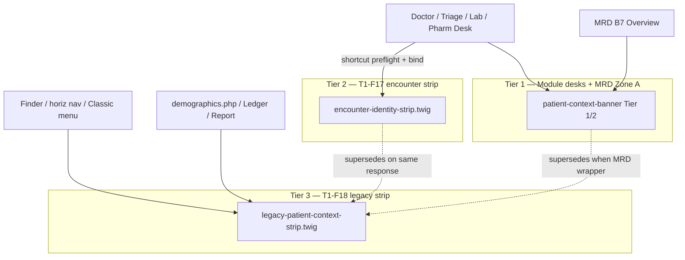

# Legacy Chart Patient Context — Redesign Specification

| Field | Value |
|-------|--------|
| **Document version** | 0.1.2 |
| **Status** | Draft for review — **T1-F18/F19** (D54, D-CTX-1–10); **V1.2-CTX** slice; **trilogy integrated** PRD v1.20.38 |
| **Companion to** | [NEW_CLINIC_V1_PRD.md](./NEW_CLINIC_V1_PRD.md) (v1.20.38), [NEW_CLINIC_V1_PAGE_DESIGNS.md](./NEW_CLINIC_V1_PAGE_DESIGNS.md) (v0.6.42), [NEW_CLINIC_V1_USER_WORKFLOWS.md](./NEW_CLINIC_V1_USER_WORKFLOWS.md) (v1.9.42), [MEDICAL_RECORD_DASHBOARD_REDESIGN.md](./MEDICAL_RECORD_DASHBOARD_REDESIGN.md) (v0.2.28), [NEW_CLINIC_V1_PATIENT_CHART_DEPTH_REDESIGN.md](./NEW_CLINIC_V1_PATIENT_CHART_DEPTH_REDESIGN.md) (v0.1.7), [FRONTEND_2026_MODERNIZATION_PLAN.md](./FRONTEND_2026_MODERNIZATION_PLAN.md) |
| **Audience** | Product, design, clinical leads, implementers, QA, trainers |
| **Scope** | **Visit-aware patient identity** on **stock OpenEMR chart surfaces** (`patient_file/*`, legacy ledger/report paths) when staff open chart outside module desks — Finder, horizontal patient nav, Classic menu overflow — until **MRD Zone A (B7)** replaces the stock dashboard for Clinic roles |
| **Implementation** | Design spec only — no code in this document |
| **Primary market** | Private outpatient clinics — **West Africa** (Ghana launch region) |

---

## Table of contents

1. [Purpose & positioning](#1-purpose--positioning)
2. [Gap analysis — what PRD already covers](#2-gap-analysis--what-prd-already-covers)
3. [Current-state snapshot (stock OpenEMR)](#3-current-state-snapshot-stock-openemr)
4. [Pain points by surface](#4-pain-points-by-surface)
5. [UI/UX principles for legacy chart context](#5-uiux-principles-for-legacy-chart-context)
6. [How leading EHRs address these needs](#6-how-leading-ehrs-address-these-needs)
7. [West Africa & Ghana context](#7-west-africa--ghana-context)
8. [Three-tier identity architecture](#8-three-tier-identity-architecture)
9. [Component — legacy patient context strip (T1-F18)](#9-component--legacy-patient-context-strip-t1-f18)
10. [Shared device session warning (T1-F19)](#10-shared-device-session-warning-t1-f19)
11. [Injection strategy & allowlist](#11-injection-strategy--allowlist)
12. [Wireframes by entry path](#12-wireframes-by-entry-path)
13. [Navigation, ACL & config](#13-navigation-acl--config)
14. [Data model, APIs & services](#14-data-model-apis--services)
15. [Phasing & PRD alignment](#15-phasing--prd-alignment)
16. [Acceptance criteria](#16-acceptance-criteria)
17. [Closed decisions](#17-closed-decisions)
18. [Document history](#18-document-history)
19. [Appendix A — Allowlisted paths catalog](#appendix-a--allowlisted-paths-catalog)
20. [Appendix B — Ghana clinic scenarios](#appendix-b--ghana-clinic-scenarios)
21. [Appendix C — Competitive reference matrix](#appendix-c--competitive-reference-matrix)
22. [Appendix D — Relationship to MRD, Chart Depth, T1-F17](#appendix-d--relationship-to-mrd-chart-depth-t1-f17)
23. [Appendix E — Audit resolution log (v0.1.1)](#appendix-e--audit-resolution-log-v011)

---

## 1. Purpose & positioning

### 1.1 What this document is for

New Clinic V1 invests heavily in **module desks** (Front Desk, Triage, Doctor Desk, …) and the redesigned **MRD** full chart. Each module surface carries a normative **`patient-context-banner`** (PAGE_DESIGNS §4.11) — name, MRN, allergies, vitals, queue #, visit state.

**Stock OpenEMR** does not know about `new_visit`. When a doctor opens **Dashboard**, **Ledger**, or **Report** via:

- legacy **Finder** (`dynamic_finder.php`),
- horizontal **patient menu** tabs inside the Knockout shell,
- **⋯ Classic patient menu** overflow (pilot interim per PRD §5.6.1),

…there is **no visit context strip** and **no queue #** — only scattered demographics cards and a minimal `dashboard_header`.

PRD **T1-F18** (`enable_legacy_patient_context_overlay`) closes this gap for V1.2. PRD **§5.6.1** also allows the overlay **optionally during pilot week 1–4** while B7 MRD is pending — staff live on stock `demographics.php` + horizontal nav.

This spec **expands** the one-line PRD requirement into a implementable design: pain points, UI contract, injection mechanics, Ghana constraints, and pairing with **T1-F19** shared-device session warning.

### 1.2 Problem statement

> Dr. Adjei finishes a consult on Doctor Desk for **Akua Mensah · Queue #14**. A locum asks him to “check the ledger” for yesterday’s patient. He uses **Finder**, opens **Kwame Owusu**, and posts a note — still thinking he is on Akua because the stock header only shows a small name link buried under ten horizontal tabs. The nurse at the shared PC still has Akua’s vitals form half-filled. No banner tells either clinician which **attendance today** is active.

### 1.3 Positioning vs other surfaces

| Surface | Identity tier | Visit awareness | Bind encounter? |
|---------|---------------|-----------------|-----------------|
| **Module desks** | Full banner Tier 1/2 (§4.11) | Queue # + FSM state | Yes — per §4.13 on clinical shortcuts |
| **MRD Zone A (B7)** | Full banner + safety strip | Same as desks | No — `pid` only, new tab |
| **Core shortcuts** (encounter forms, labs) | **T1-F17** encounter strip | Queue # + encounter # + Back to desk | Yes — preflight bound |
| **Stock chart pages** (this spec) | **T1-F18** legacy strip | Today’s active visit chip when exists | **No** — informational |
| **Visit Board wall (D22)** | Initials only | Queue # | N/A |

**Training one-liner:** *Desk banner = who you are treating now. Chart strip = who this old page belongs to — and whether they are still in the building today.*

**Design decision (closed — D-CTX-1):** **Server-side Twig injection only** — same pattern as T1-F17 (D51). No iframe `postMessage`, no client-only AJAX banner that can drift from server truth.

---

## 2. Gap analysis — what PRD already covers

| Capability | PRD / companions (today) | T1-F18 gap |
|------------|--------------------------|------------|
| Wrong patient three anchors (§6.1i) | Role pill + desk banner + visit-scoped writes + stock chart row when overlay ON | Overlay OFF during pilot = partial anchor — M6 recommends ON |
| Core encounter identity strip (T1-F17, D51) | Allowlisted shortcut URLs after preflight | Does **not** cover `demographics.php`, History, Ledger |
| MRD Zone A (D-MRD-11) | Sticky identity when B7 ships | Pilot uses stock dashboard — **no Zone A** |
| Open full chart (D-M4-NAV-1b) | New tab, `pid` only, no bind | Stock tab still lacks visit chip |
| Front Desk search (M1a) | Retires Finder for reception | Doctors / managers still use Finder |
| Chart Depth (M11) | Slide-over panels with banner when enabled | Pilot: Classic menu → stock PHP pages |
| MENU_RESTRICT (M0-F08) | Hides US billing menus | Does **not** add visit context to remaining chart tabs |
| T1-F06 | De-emphasize horizontal nav for Clinic roles | **Hides** noise — does **not** add context |
| Test **43** sub-cases | T1-F17, desks, cashier (**h–m** only) | Slice tests **CTX-1–CTX-5** (`@new-clinic-v12-ctx`) — **not** test 43l (43l = `stale_row` in PRD §16.1) |

**Conclusion:** T1-F17 fixes **bound encounter** pages. MRD fixes **redesigned chart**. T1-F18 fixes the **long tail of stock PHP** during pilot and for power users after B7.

---

## 3. Current-state snapshot (stock OpenEMR)

### 3.1 Application shell

Source: [FRONTEND_2026_MODERNIZATION_PLAN.md](./FRONTEND_2026_MODERNIZATION_PLAN.md) §1.3.

```text
interface/main/tabs/main.php
  └─ Knockout.js tab + iframe pattern
       └─ patient_file/*.php loads inside iframe
            └─ dashboard_header.php → patient/dashboard_header.html.twig (minimal: {{ pageHeading }})
            └─ PatientMenuRole::displayHorizNavBarMenu() — 10+ tabs
```

Every horizontal nav click calls `top.restoreSession()` — session `pid` follows the chart, but **staff mental model** does not update when multiple tabs or Finder paths are open.

### 3.2 Horizontal patient menu

Source: `interface/main/tabs/menu/menus/patient_menus/standard.json`

```text
Dashboard | History | Assessments (SDOH) | Report | Documents |
Transactions | Issues | Ledger | External Data | PRO | Modules
```

Each item loads a **full PHP page** with repeated header + nav. No shared component ties **today’s `new_visit`** to the chrome.

### 3.3 Demographics dashboard

Source: `interface/patient_file/summary/demographics.php`

| Property | Behavior |
|----------|----------|
| **Patient switch** | `?set_pid=` calls `setpid()` — silent session change |
| **Header** | `RenderEvent::EVENT_SECTION_LIST_RENDER_TOP` then `dashboard_header.php` |
| **Nav** | Horizontal bar immediately below header |
| **Clinical cards** | Allergies, problems, meds in Bootstrap columns — not a sticky identity anchor |
| **Visit state** | **None** — no `new_visit` query |

### 3.4 Other high-traffic legacy paths

| Path | Staff use (Ghana clinic) | Visit awareness today |
|------|--------------------------|----------------------|
| `patient_file/report/patient_report.php` | Employer letter, export PDF | None |
| `reports/pat_ledger.php` | Payment history (pilot until M11) | None |
| `patient_file/transaction/*` | Referral letters (pilot until M11) | None |
| `patient_file/history/history.php` | PMH narrative | None |
| `patient_file/summary/labdata.php` | Past labs (also T1-F17 when from desk shortcut) | Strip only on **desk shortcut** path |
| `main/finder/dynamic_finder.php` | Power-user search | None until patient opened |

### 3.5 Stock vs New Clinic target

| Aspect | Stock | New Clinic target (T1-F18) |
|--------|-------|----------------------------|
| Patient identity | Page title / small link | **Sticky strip** — name · MRN · photo |
| Today’s attendance | Not shown | **Active visit chip** when unfinished visit exists |
| Queue # | Not shown | On visit chip when `new_visit.queue_number` set |
| Allergies | Card below fold | **Severe allergy** chip on strip (max 2 + tooltip) |
| Wrong-patient recovery | None | Link **Return to {Desk}** when sessionStorage has desk visit |
| Module off | 100% legacy | **No strip** — feature-flag rule (PRD §5.6.1) |

---

## 4. Pain points by surface

### 4.1 Cross-cutting (all legacy chart pages)

| Pain | Who feels it | Impact |
|------|--------------|--------|
| **No visit awareness** | Doctor, nurse, cashier | Staff cannot see **queue #** or **ready for payment** on stock pages |
| **Banner vs plain header** | Everyone | Module desk shows Tier 1 banner; stock page shows cards — **wrong-patient risk** (PRD §6.1i gap) |
| **Iframe + multi-tab** | Doctor on shared PC | Knockout tab A = Doctor Desk; tab B = Ledger for another patient — no cross-tab warning until T1-F19 |
| **Menu archaeology** | Locum, manager | 10+ horizontal tabs; training says “use MRD” but pilot uses **Dashboard** |
| **setpid silent switch** | Reception power users | URL changes patient without confirm — overlay must **full reload** on pid change |
| **Desktop tables** | Nurse on tablet | Ledger/report horizontal scroll; strip must be **sticky** not scrolled away |
| **US insurance vocabulary** | Cashier | Empty payer columns on ledger — looks broken (Chart Depth §4.2) |
| **Duplicate context** | After B7 | MRD Zone A + stock page if user forces Classic menu — need **suppression rule** |

### 4.2 Entry path — Finder / global search

| Pain | Ghana/West Africa impact |
|------|--------------------------|
| Reception retired Finder (M1a) but **clinical staff did not** | Saturday surge — doctor uses `#anySearchBox` habit from old installs |
| Finder shows **MRN column** far right | Wide table on 1366×768 clinic PC — name confused with similar surnames (§6.1j M0-F35 on desks only today) |
| Open patient → Dashboard | No queue # — doctor assumes patient not in clinic |

### 4.3 Entry path — horizontal patient nav

| Pain | Impact |
|------|--------|
| **Dashboard → Ledger → Report** journey | Identity in page title only — easy to forget between tabs |
| **History vs Assessments** | Two PMH paths (Chart Depth §4.1) — neither shows visit |
| **Issues vs Clinical tab on MRD** | After B7, Classic menu still opens stock **Issues** — duplicate IA |

### 4.4 Entry path — Open full chart (new tab)

| Pain | Impact |
|------|--------|
| Desk stays on patient A; chart tab on patient B | Allowed by design (D-M4-NAV-1b) — but stock chart does not remind “you have active consult on desk” |
| Pilot: lands on `demographics.php` not MRD Overview | **No Zone A** — T1-F18 is the only module chrome on chart |

### 4.5 Clinical shortcuts without strip (gap if misconfigured)

| Pain | Impact |
|------|--------|
| Staff bookmark core URL | Bypasses `*_shortcut_preflight` — no T1-F17 strip |
| Pharmacy opens **Rx list** (pid-only) | By design no bind — **needs T1-F18** not T1-F17 |

### 4.6 Management & training

| Pain | Impact |
|------|--------|
| Trainer says “read the banner” | Stock chart has no banner — G12 drill incomplete for Finder path |
| Admin enables module mid-pilot | Staff mix old Finder habit with new desks |

---

## 5. UI/UX principles for legacy chart context

Aligned with PRD §10, PAGE_DESIGNS §4.11, MRD §3, and Chart Depth §5.

| # | Principle | Application to T1-F18 |
|---|-----------|----------------------|
| P1 | **Identity is infrastructure** | Strip is **always visible** (sticky), not a dismissible toast |
| P2 | **Progressive disclosure** | Legacy strip is **Tier L1** compact — not full desk banner; expand via **Open full chart** / MRD |
| P3 | **Visit-scoped when relevant** | Show **today’s unfinished visit** chip; hide when no visit or terminal state |
| P4 | **Do not fake bind** | Strip is **informational** on stock pages — does not set `$_SESSION['encounter']` |
| P5 | **Server truth** | `PatientContextService::preview(pid)` — same DTO family as desks |
| P6 | **Consistent vocabulary** | Reuse FSM state labels from Visit Board — not raw enum strings |
| P7 | **Color + text + icon** | Per T1-F08 — never color alone (allergy, URGENT) |
| P8 | **Ghana shared device** | Pair with T1-F19 on **desk return** — strip alone is insufficient for session mismatch |
| P9 | **Print and paper** | Queue # on strip matches **paper ticket** and Visit Board |
| P10 | **Respect feature flag** | Module off or config `0` → **zero** injected markup (PRD §5.6.1) |
| P11 | **Do not duplicate T1-F17** | Pages with encounter strip **exclude** T1-F18 (Appendix D) |
| P12 | **Suppress when MRD Zone A present** | B7 wrapper routes — Zone A is authoritative |

### 5.1 Strip tier definition (normative)

| Tier | Name | Fields | Surfaces |
|------|------|--------|----------|
| **L0** | Off | — | Config `0` or module disabled |
| **L1** | Identity | Photo/initials · name · sex · age · **MRN** · estimated DOB badge | **Minimum** when overlay ON |
| **L2** | + Visit | L1 + active visit chip (state + queue #) + URGENT badge | **Default when `enable_legacy_patient_context_overlay` = 1** |
| **L2+** | + Safety (optional config) | L2 + severe allergy chips (max 2) | `enable_legacy_strip_clinical_chips` = 1 (proposed §13) |
| **L3** | Desk recovery | L2 + **Return to {Desk}** when `sessionStorage` visit `pid` **≠** chart `pid` | When `enable_legacy_strip_desk_return` = 1 |

**PRD alignment:** D54 specifies “name · MRN · active visit chip” = **L2**. L2+ is optional V1.2 polish.

### 5.2 Sticky layout rules

```text
┌─ Knockout iframe top ─────────────────────────────────────────┐
│ [T1 TopBar if module route — N/A on stock patient_file]      │
├─ LEGACY PATIENT CONTEXT STRIP (sticky, z-index above nav) ─────┤
│  [Photo] Akua Mensah · F · 34y · MRN 00482 · DOB 14 Feb 1991 │
│  🟢 Ready for doctor · Queue #14 · Started 09:12              │
│  (⚠ Penicillin — only when enable_legacy_strip_clinical_chips) │
│                              [ Return to Doctor Desk ] (L3)    │
├─ stock dashboard_header (page title — de-emphasized) ────────┤
├─ horizontal patient nav (de-emphasized for Clinic roles) ──┤
│  … page content …                                             │
└───────────────────────────────────────────────────────────────┘
```

| Viewport | Rule |
|----------|------|
| ≥768px | Strip single row; visit chip right-aligned; allergy chips inline |
| ≤767px | Strip wraps to 2 rows; queue # remains visible — **never truncate MRN** |
| Print | Strip hidden (`@media print`) — ledger/report print layouts unchanged |

---

## 6. How leading EHRs address these needs

| Pattern | Epic (Hyperspace) | Cerner PowerChart | athenaOne | Bahmni / OpenMRS 3 | Helium Health (Africa SaaS) | **New Clinic T1-F18** |
|---------|-------------------|-------------------|-----------|---------------------|----------------------------|------------------------|
| **Persistent patient ribbon** | Yes — name, MRN, DOB, photo | Yes | Patient context bar | Patient header in SPA | Patient banner on modules | **Legacy strip** on stock PHP |
| **Active encounter/visit** | “Open encounter” chip | Active visit indicator | Appointment context | Visit UUID on registration | Visit ID | **`new_visit` chip** |
| **Separate chart vs workflow** | Storyboard vs Chart Review | Chart vs PowerNote | Exam vs Chart | Clinical vs registration apps | Desk vs patient chart | **Desk banner vs chart strip** (§6.1g) |
| **Wrong-patient guard** | Break-the-glass + header lock | Patient confirm on switch | Similar-name alert | Identifier scan | Name + MRN on payment | **T1-F19** + G12 drill |
| **Legacy screen wrap** | Hyperspace web components | — | Limited | Bahmni apps wrap OpenMRS | Partial | **Symfony response inject** |
| **Shared workstation** | Forced re-auth timers | Context switch log | — | — | Common in clinics | **sessionStorage + T1-F19** |
| **LMIC walk-in heavy** | — | — | — | Visit at registration desk | Phone booking weak | Queue # on strip |

**Takeaway:** Top EHRs **never** leave legacy chart pages without a patient ribbon. T1-F18 is the **minimum viable ribbon** for OpenEMR’s strangler-fig path — not a replacement for MRD Zone A.

---

## 7. West Africa & Ghana context

### 7.1 Operational realities

| Factor | Design response |
|--------|-----------------|
| **Shared clinic PCs** (2–4 staff per desk) | T1-F19 blocking banner on desk `pageshow` when session ≠ last desk visit |
| **Locum / weekend doctors** | Strip must work on **Finder path** without module training |
| **High OPD volume (Saturday)** | Queue # visible on strip — matches paper ticket |
| **Similar surnames** (Mensah, Owusu, Asante) | **MRN always shown**; optional L2+ does not replace M0-F35 desk warning |
| **Paper ledger habits** | Staff open **Ledger** tab — strip confirms patient before scrolling 500 rows |
| **Pilot before B7** | §5.6.1 interim — overlay **recommended ON** for clinical roles |
| **3G / intermittent** | Server-rendered strip — no client fetch required for initial paint |
| **Cash clinic** | No insurance on strip; balance due stays on Cashier/MRD not legacy ledger |
| **Power users** | Classic menu retained — strip follows into stock pages |
| **English UI V1** | State labels via `xl()` — Twi voice optional V2 |

### 7.2 Roles most affected

| Role | Legacy chart entry | Priority |
|------|-------------------|----------|
| **Doctor** | Open full chart, Finder, Issues, lab history | **P0** |
| **Nurse / Triage** | History, vitals history, Documents | **P0** |
| **Cashier / manager** | Ledger (pilot), Report | **P1** |
| **Reception** | Should use M1a — strip still helps when forced to stock | **P1** |
| **Pharmacy** | Stock Rx list (pid-only) | **P0** — no T1-F17 |

### 7.3 Training additions (USER_WORKFLOWS §17.7)

Extend existing row **Legacy / Finder paths**:

> When overlay ON: read **mini strip** at top of stock chart — name, MRN, queue #. If strip ≠ desk banner, **stop** and switch patient. Prefer module desks; use Finder only when trained.

**Ghana scenario tagline:** *“The strip on the old page is the patient on the old page — not the patient you were thinking about.”*

---

## 8. Three-tier identity architecture



| Question | Tier 1 | T1-F17 | T1-F18 |
|----------|--------|--------|--------|
| **When?** | Module active pane / MRD | After desk shortcut bind | Stock chart pages |
| **DTO** | `PatientPreviewDto` / `ActiveConsultDto` | Bound visit + encounter | `PatientPreviewDto` |
| **Queue #** | Yes | Yes | Yes (if visit today) |
| **Encounter #** | Tier 2 | Yes | No |
| **Back to desk** | N/A | Yes | Optional L3 |
| **Binds session** | On switch per §4.15 | Yes | **Never** |

---

## 9. Component — legacy patient context strip (T1-F18)

### 9.1 Twig partial

| Property | Value |
|----------|-------|
| **Partial** | `templates/partials/legacy-patient-context-strip.twig` |
| **CSS** | `public/css/new-clinic-legacy-strip.css` (registered via T1 asset bundle) |
| **Host attribute** | `data-host="legacy_chart"` on root element |
| **ARIA** | `role="region"` · `aria-label="{{ 'Patient context'|xlt }}"` |

### 9.2 Field matrix

| Field | Source | Display rule |
|-------|--------|--------------|
| Photo / initials | Documents / placeholder | Same as §4.11 |
| Name · sex · age · MRN · DOB | `patient_data` | **Estimated DOB** badge when `dob_estimated=1` |
| Active visit chip | `new_visit` today **unfinished** | State label + queue #; **hidden** when no unfinished visit |
| URGENT / Skipped triage | `new_visit` flags | Outline badges on chip |
| Terminal visit today | `cancelled` / `completed` / `closed_unpaid` | **No chip** (PRD: chip when **unfinished** visit exists); optional grey **Visit ended** only when `enable_legacy_strip_terminal_chip` = 1 (V1.2.1 polish — default OFF) |
| Same-day second visit (§6.5.0) | Latest unfinished visit wins | After visit 1 `completed`, strip shows visit 2 queue # |
| Severe allergies (L2+ config) | `AllergyIntoleranceService` | Max 2 chips + “+N” tooltip — priority 1 from §4.11.5 |
| Return link (L3) | `sessionStorage` + role map | **Return to {Desk}** when stored visit `pid` ≠ chart `pid`; does not auto-bind |

### 9.3 Explicit non-goals (strip does NOT)

- Replace MRD Zone A or desk banner
- Bind `$_SESSION['encounter']` on page load
- Enable FSM actions (Take patient, Complete consult) — link to desk only
- Show full vitals row (doctor should use desk or MRD Clinical)
- Inject into **Visit Board wall** profile (D22 initials only)
- Run when `oe-module-new-clinic` disabled

### 9.4 Wireframe — default L2

```text
┌─ Legacy patient context (sticky) ────────────────────────────────────────────┐
│ [◉] Akua Mensah  ·  F  ·  34y  ·  MRN 00482  ·  DOB 14 Feb 1991            │
│     🟢 Ready for doctor  ·  Queue #14  ·  Started 09:12        [ Open MRD ↗ ] │
└────────────────────────────────────────────────────────────────────────────┘
```

**Open MRD ↗:** `target="_blank"` module MRD Overview when B7 live; until B7, **hidden** or label **Open dashboard** (same tab) per pilot config.

### 9.5 Interaction — patient switch on stock page

| Event | Behavior |
|-------|----------|
| User opens different patient via Finder / `set_pid` | Full page reload; strip recomputed server-side |
| User navigates horizontal nav (same pid) | Strip **unchanged** — no AJAX patch |
| Multiple unfinished visits same day | Show **Pick visit** tooltip listing queue #s — default = visit with latest `started_at` + link “View all today” (V1.2.1 polish) |

---

## 10. Shared device session warning (T1-F19)

Bundled in D54 — documented here for pairing with T1-F18.

### 10.1 Purpose

When a clinician returns to a **module desk** after opening stock chart in another tab, `$_SESSION['pid']` may reflect the chart patient while desk `sessionStorage` still references the desk visit.

### 10.2 Trigger

| Property | Value |
|----------|-------|
| Config | `enable_shared_device_session_warning` = 1 |
| When | **Module desk** `pageshow` (and `visibilitychange` → visible) — Front Desk **excluded** |
| Condition | Desk `sessionStorage` active `visit_id` **set** AND mismatch vs session (see key table) |

**`sessionStorage` keys (normative — PRD §6.1j):**

| Desk | Key | Mismatch rule |
|------|-----|---------------|
| Doctor | `doctor_desk_active_visit_id` | `$_SESSION['pid']` **or** `encounter` ≠ visit |
| Triage | `triage_desk_active_visit_id` | same |
| Lab | `lab_desk_active_visit_id` | same |
| Pharmacy | `pharmacy_desk_active_visit_id` | same |
| Cashier | `cashier_desk_active_visit_id` | **`$_SESSION['pid']` only** (§4.13 no bind) |
| Front Desk | — | **No T1-F19** |

**Cashier note:** Compare resolved visit `pid` to session `pid` only — encounter bind never applies on Cashier desk.

### 10.3 UI

```text
┌─ Blocking banner (desk) ─────────────────────────────────────────────────────┐
│ ⚠ Browser session is on another patient.                                       │
│    Desk visit: Akua Mensah · Queue #14                                        │
│    Session patient: Kwame Owusu · MRN 00107                                   │
│    [ Restore encounter session ]    [ Return to queue ]                        │
└───────────────────────────────────────────────────────────────────────────────┘
```

| Action | Behavior |
|--------|----------|
| **Restore encounter session** | `POST restore_encounter_session { visit_id }` → `bindForVisit` → reload desk |
| **Return to queue** | Clear active pane + `sessionStorage` desk key |

**Scope:** Desks only — **not** injected on stock chart pages. T1-F18 strip provides **context**; T1-F19 provides **blocking recovery** on desk.

---

## 11. Injection strategy & allowlist

### 11.1 Mechanism (closed — mirrors T1-F17)

| Step | Detail |
|------|--------|
| 1 | `LegacyChartContextSubscriber` — **primary:** `RenderEvent::EVENT_SECTION_LIST_RENDER_TOP` where present (`demographics.php`, etc.) |
| 2 | **Fallback:** module response filter on allowlisted paths without RenderEvent |
| 3 | Match request path against **allowlist** (Appendix A) |
| 4 | Verify `enable_legacy_patient_context_overlay` = 1, module enabled, user has any `new_clinic` role |
| 5 | Skip if response already contains `encounter-identity-strip` or MRD `patient-context-banner` |
| 6 | Load `PatientContextService::preview($pid, $actorUserId, 'legacy_chart')` — includes unfinished visit chip via M0-F20 |
| 7 | Inject strip **above** `dashboard_header` / horizontal nav |

**Bookmark bypass:** Allowlisted core URLs opened **without** `*_shortcut_preflight` (e.g. bookmarked `load_form.php`) receive **T1-F18** when overlay ON — not T1-F17.

### 11.2 Exclusion rules

| Condition | Skip T1-F18 |
|-----------|-------------|
| Module disabled | Always |
| Config `enable_legacy_patient_context_overlay` = 0 | Always |
| User lacks `new_clinic` role mapping | Always — admin sees stock UI |
| Path on T1-F17 allowlist with active bind | T1-F17 wins |
| Request served by MRD module wrapper (B7) | Zone A wins |
| `patient_file/encounter/*` with encounter session from desk | T1-F17 wins |
| Bookmarked core URL without preflight on allowlist | **T1-F18** applies (CTX-4) |
| `dynamic_finder.php` | **No strip** — strip appears on first **patient** page after selection |
| Print/PDF export requests (`?pdf=1`, etc.) | No strip |
| Multi-facility | Visit chip scoped to actor **facility_id** (same as Visit Board) |

### 11.3 Performance

| Rule | Target |
|------|--------|
| Preview query | Reuse M0 `PatientContextService` — single round-trip; cache in request attribute |
| Injection | &lt; 5ms Twig render — no extra HTTP |
| Asset weight | &lt; 8KB CSS gzip |

---

## 12. Wireframes by entry path

### 12.1 Finder → Dashboard (pilot path)

```text
[ Finder row double-click ]
        ↓
┌─ demographics.php ───────────────────────────────────────────────────────────┐
│ LEGACY STRIP: Kwame Owusu · MRN 00107 · No active visit today                 │
│ ─── stock title: Dashboard ─────────────────────────────────────────────────  │
│ Dashboard | History | Report | … | Ledger                                       │
│ (allergy / problem cards…)                                                    │
└──────────────────────────────────────────────────────────────────────────────┘
```

### 12.2 Doctor Desk → Open full chart (new tab) — B7 pending

```text
Tab 1: Doctor Desk — banner Akua · Q#14
Tab 2: stock demographics — STRIP: Akua · Q#14  (matches)
```

### 12.3 Doctor Desk → Finder mistake

```text
Tab 1: Doctor Desk — banner Akua · Q#14  (sessionStorage visit_id)
Tab 2: stock Ledger — STRIP: Kwame · Q#22
User returns Tab 1 → T1-F19 blocking banner (if enabled)
```

### 12.4 Pharmacy — Rx list (pid-only)

```text
┌─ legacy strip ───────────────────────────────────────────────────────────────┐
│ Yaa Serwaa · MRN 00201 · 🟣 In pharmacy · Queue #8                            │
├─ stock Rx list ──────────────────────────────────────────────────────────────┤
```

No T1-F17 — strip is the only visit context.

---

## 13. Navigation, ACL & config

### 13.1 Config keys

| Key | Default | F-ID | Behavior |
|-----|---------|------|----------|
| `enable_legacy_patient_context_overlay` | `0` | T1-F18 | Master switch — L2 strip |
| `enable_shared_device_session_warning` | `0` | T1-F19 | Desk session mismatch banner |
| `enable_legacy_strip_clinical_chips` | `0` | T1-F18b | L2+ severe allergy chips on strip |
| `enable_legacy_strip_desk_return` | `1` | T1-F18c | L3 Return to desk when sessionStorage visit `pid` ≠ chart `pid` |

**M6 cash clinic profile (recommended):** set `enable_legacy_patient_context_overlay` = **1** for pilot week 1–4 when clinical roles use Classic menu (PRD §5.6.1 optional).

### 13.2 ACL

| Action | ACL |
|--------|-----|
| See strip | Any user with `new_clinic` role mapping |
| Return to desk link | Same role that owns desk (`new_doctor`, `new_nurse`, …) |
| Open MRD from strip | `patients` / `demo` |

No new ACL resource required — uses existing role mapping.

### 13.3 Relationship to T1-F06 / MENU_RESTRICT

- T1-F06 **hides** horizontal nav emphasis — strip **adds** identity without restoring menu clutter
- MENU_RESTRICT does not block strip injection on remaining allowed pages

---

## 14. Data model, APIs & services

### 14.1 No new tables

Strip reads existing `patient_data`, `new_visit`, `lists` (allergies) — same as M0-F20.

### 14.2 Service reuse

| Method | Use |
|--------|-----|
| `PatientContextService::preview(pid, actorUserId, 'legacy_chart')` | Build strip DTO — **includes** active unfinished visit chip (M0-F20); no separate visit query |

### 14.3 Optional audit (V1.2.1)

| Event | When |
|-------|------|
| `legacy_chart_context.rendered` | Debug flag only — **not** production audit default (volume) |

Wrong-patient incidents continue to use existing `visit.cancel` / interrupt audits.

---

## 15. Phasing & PRD alignment

| Phase | Deliverable | Notes |
|-------|-------------|-------|
| **P0 pilot** (B0–B5, B7 pending) | T1-F18 optional per §5.6.1 | **Recommended ON** for Ghana shared devices |
| **B7 MRD** | Zone A on module chart; T1-F18 **suppressed** on MRD routes | Classic menu paths still need strip |
| **V1.2-CTX** | T1-F18 + T1-F19 closed; tests **CTX-1–CTX-5** | PRD slice; `@new-clinic-v12-ctx` |
| **V1.2.1** | Multi-visit picker on strip; optional `enable_legacy_strip_terminal_chip` | Polish |
| **V3** | React shell replaces iframe — strip becomes layout slot | FRONTEND_2026 Phase 4 |

### 15.1 PRD feature IDs

| ID | Summary |
|----|---------|
| **T1-F17** | Encounter identity strip — P0 closed D51 |
| **T1-F18** | Legacy patient context overlay — P1 **V1.2-CTX** (optional pilot §5.6.1) |
| **T1-F18b/c** | Optional allergy chips + desk return link |
| **T1-F19** | Shared device session warning — P1 **V1.2-CTX** |

### 15.2 Trilogy integration (closed — PRD v1.20.38)

- §6.1i stock chart identity row + §6.1j T1-F18/F19 detail
- PAGE_DESIGNS §4.11.8 + §4.15
- USER_WORKFLOWS §17.7 + G12 drill row
- **§21.1z** acceptance + **§17.4.12** enable checklist + **CTX-1–CTX-5** in §16.1.1 post-V1 traceability

---

## 16. Acceptance criteria

### 16.1 Functional

- [ ] When `enable_legacy_patient_context_overlay` = 1, allowlisted stock pages show **sticky strip** with name · MRN · active visit chip when visit exists.
- [ ] When config = 0 or module off, **no** strip markup or CSS on stock pages.
- [ ] T1-F17 pages **never** show duplicate strips.
- [ ] MRD B7 pages show Zone A **without** T1-F18 duplicate.
- [ ] `set_pid` / Finder open reloads strip for new patient.
- [ ] Same-day second visit shows **new** queue # on strip after visit 1 completed (test **43h** alignment).
- [ ] Strip **does not** call `bindForVisit` on render.
- [ ] Pharmacy Rx list (pid-only) shows visit chip when patient in `in_pharmacy`.

### 16.2 T1-F19

- [ ] When enabled, desk `pageshow` with session mismatch shows **blocking banner** before saves.
- [ ] **Restore encounter session** succeeds and clears banner.
- [ ] **Return to queue** clears pane without binding wrong pid.

### 16.3 UX / Ghana

- [ ] MRN visible without horizontal scroll at 360px width.
- [ ] Queue # matches Visit Board and paper ticket format.
- [ ] Strip passes contrast WCAG AA on T1 tokens.
- [ ] Print view hides strip.

### 16.4 Tests (`@new-clinic-v12-ctx`)

| Test | Description |
|------|-------------|
| **CTX-1** | Overlay ON — `demographics.php` sticky strip: name · MRN · unfinished visit chip |
| **CTX-2** | Overlay OFF — no strip markup/CSS on stock chart |
| **CTX-3** | T1-F17 page — encounter strip only; no duplicate T1-F18 |
| **CTX-4** | Bookmarked `load_form.php` without preflight — T1-F18 when overlay ON |
| **CTX-5** | T1-F19 ON — desk tab after Finder switch shows banner; Restore clears; Cashier **pid-only** |

**Note:** PRD mandatory test **43(l)** is **`stale_row`** on `complete_consult` — **not** legacy overlay.

---

## 17. Closed decisions

| ID | Decision |
|----|----------|
| **D-CTX-1** | **Server-side Twig injection only** — no postMessage primary |
| **D-CTX-2** | **Three-tier identity** — desk/MRD banner · T1-F17 · T1-F18 (§8) |
| **D-CTX-3** | Legacy strip is **informational** — never binds encounter on load |
| **D-CTX-4** | Strip sits **above** `dashboard_header` and horizontal nav |
| **D-CTX-5** | **Suppress** T1-F18 when MRD Zone A or T1-F17 already on response |
| **D-CTX-6** | T1-F19 applies to **module desks only**; strip is context not blocker |
| **D-CTX-7** | Pilot may enable overlay early (PRD §5.6.1) — M6 profile recommends ON |
| **D-CTX-8** | Reuse `PatientPreviewDto` — no parallel DTO type |
| **D-CTX-9** | **No FSM actions** on strip — desk remains authoritative for queue |
| **D-CTX-10** | Finder retirement for **reception only** — clinical Finder paths stay in scope |

---

## 18. Document history

| Version | Date | Changes |
|---------|------|---------|
| 0.1.2 | 2026-06-22 | **Audit closure** — PRD v1.20.38 §16.1.1 traceability, **§21.1z**, **§17.4.12**; V1.2.1 terminal chip deferred in PRD §6.1j |
| 0.1.1 | 2026-06-22 | **Audit pass** — CTX-1–CTX-5 (not 43l); sessionStorage keys; Cashier pid-only T1-F19; bookmark → T1-F18; Chart Depth redirect conflict fixed; trilogy PRD v1.20.37; Appendix E |
| 0.1.0 | 2026-06-22 | Initial comprehensive spec — pain points, UI/UX, EHR patterns, Ghana context, T1-F18/F19 design, injection allowlist, phasing |

---

## Appendix A — Allowlisted paths catalog

**Include** when path matches and exclusions (§11.2) pass:

| Category | Paths |
|----------|-------|
| **Summary** | `patient_file/summary/demographics.php`, `stats_full.php`, `labdata.php` (when not T1-F17 response), `pnotes_full.php`, `disclosure_full.php` |
| **History** | `patient_file/history/history.php`, `history_full.php`, `history_sdoh_widget.php` — see [MEDICAL_HISTORY_BACKGROUND §9](./NEW_CLINIC_V1_MEDICAL_HISTORY_BACKGROUND_REDESIGN.md#9-legacy-overlay-on-stock-chart--boundary-module-plain-english) for plain-English behavior on these pages |
| **Report** | `patient_file/report/patient_report.php` — see [PATIENT_CLINICAL_EXPORT §9](./NEW_CLINIC_V1_PATIENT_CLINICAL_EXPORT_REDESIGN.md#9-legacy-overlay-on-stock-chart--report-pages-plain-english) |
| **Transactions** | `patient_file/transaction/transactions.php`, `add_transaction.php` |
| **Issues** | `patient_file/summary/stats.php` and issues list paths |
| **Documents** | `patient_file/summary/documents.php` (if distinct) |
| **Ledger** | `reports/pat_ledger.php` — see [PATIENT_PAYMENT_HISTORY §9](./NEW_CLINIC_V1_PATIENT_PAYMENT_HISTORY_REDESIGN.md#9-legacy-overlay-on-stock-chart--ledger-pages-plain-english) |
| **External** | `reports/external_data.php` |
| **PRO** | `easipro/pro.php` (when menu visible) |
| **Reminders** | `patient_file/reminder/*.php` |
| **Rx list (pid-only)** | `controller.php?prescription&list&id={pid}` |
| **Bookmarked forms** | `load_form.php`, `view_form.php` when opened **without** preflight (CTX-4) |

**Not allowlisted:** `main/finder/dynamic_finder.php` — strip appears on first patient page after row open.

**Exclude always:**

- `interface/modules/custom_modules/oe-module-new-clinic/public/*`
- T1-F17 responses after successful preflight bind (PAGE_DESIGNS §4.13, §7.30.6)
- `encounter/encounter_top.php` when T1-F17 strip present
- Admin/setup scripts, AJAX fragments, PDF exports

**Maintenance:** New stock pages added to Classic menu → update allowlist in same PR as MENU change.

---

## Appendix B — Ghana clinic scenarios

### B.1 Saturday shared doctor PC

| Step | System |
|------|--------|
| 1 | Dr. A has Akua on Doctor Desk (`with_doctor`) |
| 2 | Dr. B opens Finder on same PC for Kwame’s ledger |
| 3 | Strip shows Kwame · no visit / different queue |
| 4 | Dr. A returns to desk tab → T1-F19 banner (if ON) |
| 5 | Dr. A taps **Restore encounter session** → back to Akua |

### B.2 Locum — only trained on stock OpenEMR

| Step | System |
|------|--------|
| 1 | Locum uses horizontal nav **Ledger** from Dashboard |
| 2 | Strip shows patient + **Ready for payment** chip |
| 3 | Locum sends patient to Cashier with queue # visible — no Visit Board training required |

### B.3 Pilot week 2 — B7 not shipped

| Step | System |
|------|--------|
| 1 | Trainer: “Open full chart” lands `demographics.php` |
| 2 | T1-F18 ON → strip replaces need for “imagine the banner” |
| 3 | Classic menu → Ledger still has strip |

### B.4 Same-day return visit

| Step | System |
|------|--------|
| 1 | Visit 1 completed 10:00 |
| 2 | Visit 2 started 14:00 — queue #18 |
| 3 | Doctor opens stock Issues tab — strip shows **Q#18** not Q#12 |

### B.5 Pharmacy pid-only Rx list

| Step | System |
|------|--------|
| 1 | Patient `in_pharmacy` — dispense from desk |
| 2 | Tech opens stock Rx list in second tab |
| 3 | Strip shows **In pharmacy · Q#8** — confirms correct patient |

---

## Appendix C — Competitive reference matrix

| Capability | Epic | athena | Bahmni | Helium | OpenEMR stock | **T1-F18** |
|------------|------|--------|--------|--------|---------------|------------|
| Sticky patient ribbon on all chart pages | ✅ | ✅ | ✅ | ✅ | ❌ | ✅ (module ON) |
| Visit/queue on ribbon | ✅ | ✅ | ✅ | ✅ | ❌ | ✅ |
| Legacy screen injection | Web components | Partial | SPA shell | Native | ❌ | ✅ Twig inject |
| Shared workstation recovery | ✅ | Limited | — | ✅ | ❌ | ✅ T1-F19 |
| Wrong-patient drill | ✅ | ✅ | — | ✅ | ❌ | ✅ G12 + strip |

---

## Appendix D — Relationship to MRD, Chart Depth, T1-F17

```text
Staff intent                    Primary surface              Identity chrome
─────────────────────────────────────────────────────────────────────────────
"Who is next in queue?"         Doctor Desk                  Tier 1/2 banner
"Document this encounter"       Core form via shortcut       T1-F17 strip
"What happened before?"       MRD Clinical / Visits        Zone A banner
"Show me old ledger"           Classic → pat_ledger.php     T1-F18 strip
"Fix charges from Tuesday"     M14 Billing Ops (V1.2)       M14 hub banner
"Referral letter"              M11 Chart Depth (V1.1)       Depth panel banner
```

| Document | Relationship |
|----------|--------------|
| **MRD** | D-MRD-12 — T1-F18 until Zone A on all chart routes; Classic menu still needs strip |
| **Chart Depth** | P5 identity anchor — depth panels use full banner; **T1-F18 injects on stock URLs** in parallel when overlay ON; M11 routes replace menus when `enable_chart_depth` ON — not a redirect of T1-F18 |
| **T1-F17** | Encounter-bound subset — **never duplicate** on same response |
| **Clinical Doc Hub (M17)** | Hub routes use T1-F17; not T1-F18 |
| **Front Desk Search (M1a)** | Retires Finder for reception — does not remove T1-F18 for clinical Finder |

**Long-term:** FRONTEND_2026 React shell provides a single **layout slot** for patient context across PHP and modern bundles — T1-F18 migrates from response injection to shell slot without changing field contract.

---

## Appendix E — Audit resolution log (v0.1.1)

| ID | Issue | Resolution |
|----|-------|------------|
| **X-CTX-1** | Test **43l** collision (`stale_row` in PRD) | Slice tests **CTX-1–CTX-5** + `@new-clinic-v12-ctx` |
| **X-CTX-2** | PAGE_DESIGNS §10.2 implied T1-F18 on desks | **T1-F18** stock chart only; **T1-F19** desks only |
| **X-CTX-3** | Chart Depth §15.1 redirect vs inject | Independent mechanisms documented |
| **X-CTX-4** | Phasing V1.2 vs pilot optional | **V1.2-CTX** slice + §5.6.1 pilot optional; M6 recommends ON |
| **X-CTX-5** | D54 closed vs proposed D-CTX | **D-CTX-1–10** in PRD; T1-F18b/c config keys |
| **X-CTX-6** | §6.1i missing stock chart row | Added PRD §6.1i identity row |
| **X-CTX-7** | Terminal visit chip vs PRD | Unfinished visit only; terminal chip optional V1.2.1 |
| **X-CTX-8** | L3 Return logic typo | When sessionStorage visit `pid` ≠ chart `pid` |
| **X-CTX-9** | Generic `{desk}_active_visit_id` | Normative per-desk keys in PRD §6.1j |
| **X-CTX-10** | Cashier T1-F19 encounter compare | **Pid-only** for Cashier |
| **X-CTX-11** | Rx list not on allowlist | `controller.php?prescription&list` added |
| **X-CTX-12** | Bookmark bypass gap | T1-F18 on bookmarked allowlisted URLs (CTX-4) |
| **G-CTX-01** | `VisitQueryService::unfinishedToday` | Removed — `preview()` includes visit chip |
| **G-CTX-02** | No injection subscriber doc | `LegacyChartContextSubscriber` in PRD §6.1j |
| **G-CTX-03** | No CI tag | `@new-clinic-v12-ctx` |
| **G-CTX-04** | Finder page strip | Explicit: strip on first patient page, not Finder grid |
| **G-CTX-05** | Multi-facility | Visit chip scoped to actor `facility_id` |
| **C-CTX-01** | Wireframe showed allergies by default | L2+ only when `enable_legacy_strip_clinical_chips` |
| **C-CTX-02** | No §4.11.8 | Added PAGE_DESIGNS §4.11.8 |
| **C-CTX-03** | “Outside module desks” ambiguous | Means not module desk chrome; includes chart from Open full chart new tab |
| **G-CTX-06** | No §16.1.1 post-V1 traceability row | **CTX-1–CTX-5** in PRD §16.1.1 post-V1 table |
| **G-CTX-07** | No acceptance §21.1z / enable §17.4.12 | PRD **§21.1z** + **§17.4.12** added |
| **G-CTX-08** | `enable_legacy_strip_terminal_chip` only in spec | Deferred V1.2.1 — noted in PRD §6.1j, not config table until ship |
