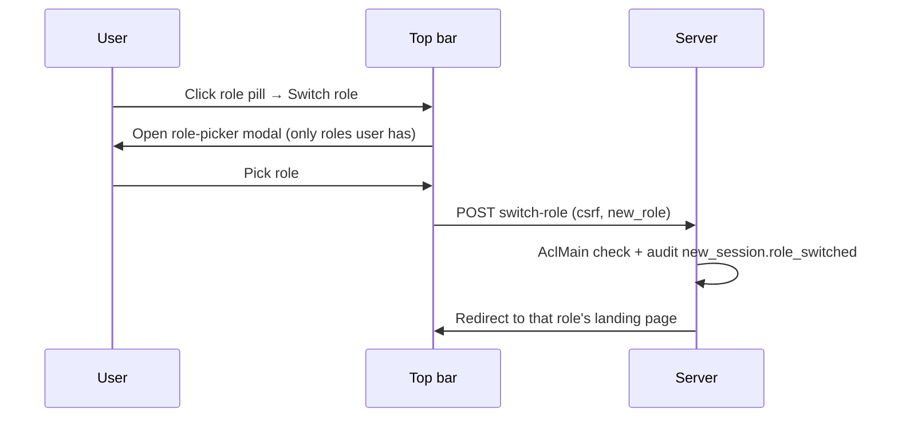
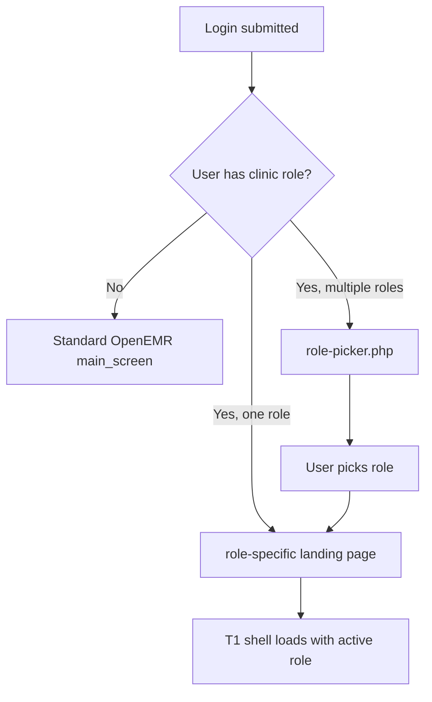
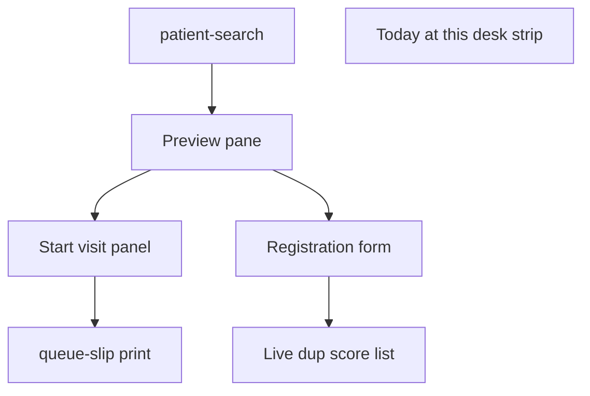
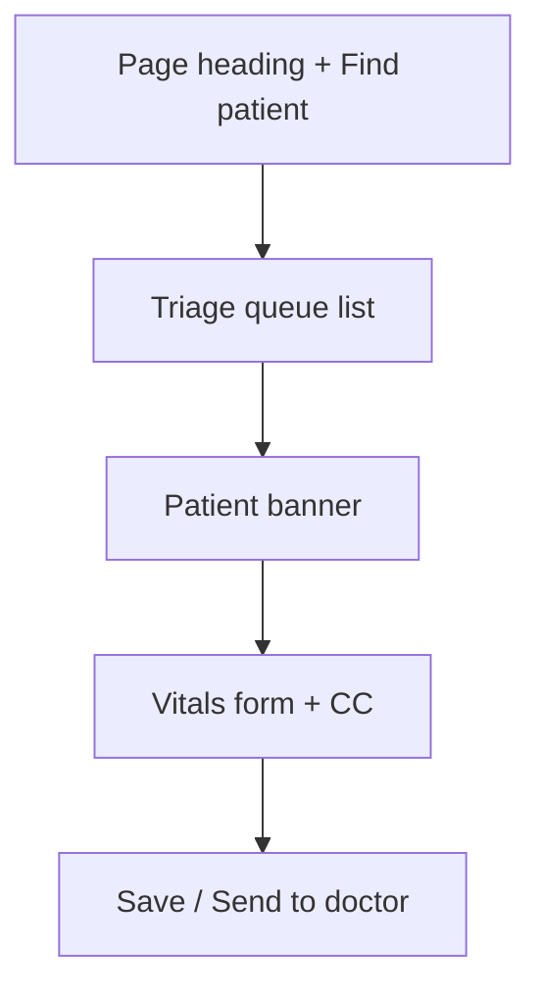
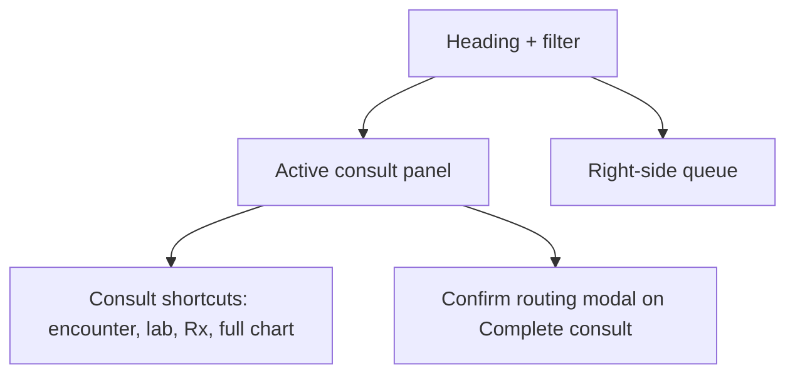
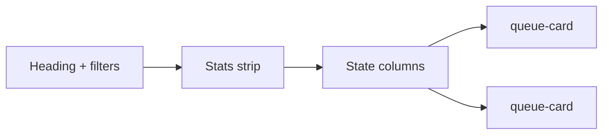

# New Clinic V1 — Page Designs

| Field | Value |
|-------|-------|
| Document version | 0.6.51 |
| Status | Draft for review — aligned to PRD v1.20.50; **M1b Registration form** approved; companion specs COM + M1a **approved Phase 1**; Chart Depth §7.13–§7.16; Lab Ops §7.17–§7.20; Pharm Ops §7.21–§7.24; Bill Ops §7.25–§7.26; Admin Hub §7.27–§7.28; Report Hub §7.29; Clinical Doc Hub §7.30; Queue Bridge Hub §7.31; **Patient Registry** §7.32; **T1-F18 legacy strip** §4.11.8; M7 §7.10.18–7.10.20; **V1.1-PRINT-RX** §7.4.7 / §7.6.14 |
| Companion to | [NEW_CLINIC_V1_PRD.md](./NEW_CLINIC_V1_PRD.md) (v1.20.49), [NEW_CLINIC_V1_USER_WORKFLOWS.md](./NEW_CLINIC_V1_USER_WORKFLOWS.md) (v1.9.49), [NEW_CLINIC_V1_UI_UX_DESIGN_PLAN.md](./NEW_CLINIC_V1_UI_UX_DESIGN_PLAN.md) (v1.0.0), [NEW_CLINIC_V1_LEGACY_CHART_CONTEXT_REDESIGN.md](./done/NEW_CLINIC_V1_LEGACY_CHART_CONTEXT_REDESIGN.md) (v0.1.2), [MEDICAL_RECORD_DASHBOARD_REDESIGN.md](./done/MEDICAL_RECORD_DASHBOARD_REDESIGN.md) (v0.2.36), [NEW_CLINIC_V1_MEDICAL_HISTORY_BACKGROUND_REDESIGN.md](./done/NEW_CLINIC_V1_MEDICAL_HISTORY_BACKGROUND_REDESIGN.md) (v0.1.1), [NEW_CLINIC_V1_SCHEDULING_REDESIGN.md](./done/NEW_CLINIC_V1_SCHEDULING_REDESIGN.md) (v0.2.6), [NEW_CLINIC_V1_SCHEDULING_QUEUE_BOUNDARY_REDESIGN.md](./done/NEW_CLINIC_V1_SCHEDULING_QUEUE_BOUNDARY_REDESIGN.md) (v0.1.3), [NEW_CLINIC_V1_COMMUNICATIONS_HUB_REDESIGN.md](./done/NEW_CLINIC_V1_COMMUNICATIONS_HUB_REDESIGN.md) (v1.0.3), [NEW_CLINIC_V1_PATIENT_REGISTRY_REDESIGN.md](./done/NEW_CLINIC_V1_PATIENT_REGISTRY_REDESIGN.md) (v0.2.1), [NEW_CLINIC_V1_PATIENT_REFERRALS_LETTERS_REDESIGN.md](./done/NEW_CLINIC_V1_PATIENT_REFERRALS_LETTERS_REDESIGN.md) (v0.1.2), [NEW_CLINIC_V1_FRONT_DESK_SEARCH_REDESIGN.md](./done/NEW_CLINIC_V1_FRONT_DESK_SEARCH_REDESIGN.md) (v1.0.9), [NEW_CLINIC_V1_FRONT_DESK_REGISTRATION_REDESIGN.md](./done/NEW_CLINIC_V1_FRONT_DESK_REGISTRATION_REDESIGN.md) (v1.0.0), [NEW_CLINIC_V1_PATIENT_CHART_DEPTH_REDESIGN.md](./done/NEW_CLINIC_V1_PATIENT_CHART_DEPTH_REDESIGN.md) (v0.1.15), [NEW_CLINIC_V1_LAB_OPERATIONS_REDESIGN.md](./done/NEW_CLINIC_V1_LAB_OPERATIONS_REDESIGN.md) (v0.1.9), [NEW_CLINIC_V1_PHARMACY_OPERATIONS_REDESIGN.md](./done/NEW_CLINIC_V1_PHARMACY_OPERATIONS_REDESIGN.md) (v0.1.9), [NEW_CLINIC_V1_BILLING_AR_BACKOFFICE_REDESIGN.md](./done/NEW_CLINIC_V1_BILLING_AR_BACKOFFICE_REDESIGN.md) (v0.1.3), [NEW_CLINIC_V1_ADMIN_CONFIGURATION_REDESIGN.md](./done/NEW_CLINIC_V1_ADMIN_CONFIGURATION_REDESIGN.md) (v0.1.4), [NEW_CLINIC_V1_REPORTING_OPERATIONS_REDESIGN.md](./done/NEW_CLINIC_V1_REPORTING_OPERATIONS_REDESIGN.md) (v0.1.3) |
| Audience | Product, design, frontend engineers, QA |
| Purpose | Page-level build spec for New Clinic pages and chart-depth panels — wireframes, components, state behavior, AJAX contracts, acceptance — design only, no code |
| Module status | `oe-module-new-clinic` not yet built. This document is the page-level build spec, complementing PRD §7.4 (module skeleton) and §M0–M7 (functional requirements) |

---

## Table of contents

1. [How to use this doc](#1-how-to-use-this-doc)
2. [Top bar and shell (T1)](#2-top-bar-and-shell-t1)
3. [Routing and login](#3-routing-and-login)
4. [Shared components](#4-shared-components)
5. [Queue contract — sort, refresh, locking](#5-queue-contract--sort-refresh-locking)
6. [AJAX response envelope](#6-ajax-response-envelope)
7. Page designs
   - [7.1 role-picker.php](#71-role-pickerphp)
   - [7.2 front-desk.php — Reception](#72-front-deskphp--reception)
   - [7.3 triage.php — Nurse](#73-triagephp--nurse)
   - [7.4 doctor.php — Doctor Desk](#74-doctorphp--doctor-desk)
   - [7.5 lab.php — Lab Desk](#75-labphp--lab-desk)
   - [7.6 pharmacy.php — Pharmacy Desk](#76-pharmacyphp--pharmacy-desk)
   - [7.7 cashier.php — Cashier](#77-cashierphp--cashier)
   - [7.8 visit-board.php — Visit Board](#78-visit-boardphp--visit-board)
   - [7.9 admin.php — Clinic Admin](#79-adminphp--clinic-admin)
   - [7.10 reports.php — Daily Reports](#710-reportsphp--daily-reports)
   - [7.11 scheduling.php — Scheduling & Flow](#711-schedulingphp--scheduling--flow)
   - [7.12 messages.php — Communications Hub](#712-messagesphp--communications-hub)
   - [7.13 chart-depth/payments.php — Payment history](#713-chart-depthpaymentsphp--payment-history)
   - [7.14 chart-depth/referrals.php — Referrals & letters](#714-chart-depthreferralsphp--referrals--letters)
   - [7.15 chart-depth/export.php — Clinical export](#715-chart-depthexportphp--clinical-export)
   - [7.16 chart-depth/external.php — Care elsewhere](#716-chart-depthexternalphp--care-elsewhere)
   - [7.17 lab-ops/index.php — Lab Operations Hub](#717-lab-opsindexphp--lab-operations-hub)
   - [7.18 lab-ops/results.php — Result entry](#718-lab-opsresultsphp--result-entry)
   - [7.19 lab-ops/setup.php — Lab setup wizard](#719-lab-opssetupphp--lab-setup-wizard)
   - [7.20 lab-ops/lis.php — LIS dashboard](#720-lab-opslisphp--lis-dashboard)
   - [7.21 pharm-ops/index.php — Pharmacy Operations Hub](#721-pharm-opsindexphp--pharmacy-operations-hub)
   - [7.22 pharm-ops/dispense.php — Dispense façade](#722-pharm-opsdispensephp--dispense-façade)
   - [7.23 pharm-ops/receive.php — Receive stock](#723-pharm-opsreceivephp--receive-stock)
   - [7.24 pharm-ops/setup.php — Pharmacy setup wizard](#724-pharm-opssetupphp--pharmacy-setup-wizard)
   - [7.25 bill-ops/index.php — Billing Back Office Hub](#725-bill-opsindexphp--billing-back-office-hub)
   - [7.26 bill-ops/correct.php — Charge correction slide-over](#726-bill-opscorrectphp--charge-correction-slide-over)
   - [7.27 admin-hub/index.php — Admin Operations Hub](#727-admin-hubindexphp--admin-operations-hub)
   - [7.28 admin-hub/people.php — Add staff wizard](#728-admin-hubpeoplephp--add-staff-wizard)
   - [7.29 report-hub/index.php — Reporting Operations Hub](#729-report-hubindexphp--reporting-operations-hub)
   - [7.30 clinical-doc/index.php — Clinical Documentation Hub](#730-clinical-docindexphp--clinical-documentation-hub)
   - [7.31 queue-bridge/index.php — Queue Bridge Hub](#731-queue-bridgeindexphp--queue-bridge-hub)
   - [7.32 patient-registry.php — Patient Registry](#732-patient-registryphp--patient-registry)
8. [Mobile and tablet patterns](#8-mobile-and-tablet-patterns)
9. [Accessibility](#9-accessibility)
10. [Cross-page acceptance matrix](#10-cross-page-acceptance-matrix)
11. [Open questions](#11-open-questions)
12. [Document history](#12-document-history)

---

## 1. How to use this doc

This document defines **what each New Clinic page looks like and how it behaves**. It is the bridge between:

| Companion doc | Tells you |
|---|---|
| [PRD](./NEW_CLINIC_V1_PRD.md) | Modules, requirements (M-IDs), data model, ACL, integration |
| [User Workflows](./NEW_CLINIC_V1_USER_WORKFLOWS.md) | Who does what in what order, frameworks, exceptions |
| [UI/UX Design Plan](./NEW_CLINIC_V1_UI_UX_DESIGN_PLAN.md) | Cross-cutting principles, tokens, component catalog, module map |
| [MRD Redesign](./done/MEDICAL_RECORD_DASHBOARD_REDESIGN.md) | Full chart depth view |
| [Chart Depth](./done/NEW_CLINIC_V1_PATIENT_CHART_DEPTH_REDESIGN.md) | Ledger, referrals, export — beyond MRD tabs |
| **This doc** | Page-level UI, components, state behavior, AJAX, acceptance |

When in doubt, the **PRD wins** for requirements; **this doc wins** for visual layout.

### 1.1 Conventions used here

- **Wireframes** are ASCII boxes plus Mermaid component trees — not pixel-perfect mocks.
- **State** in tables refers to `new_visit.state` (PRD §6.5 FSM).
- **ACL** keys use the prefix `new_clinic` (e.g. `aclCheckCore('new_clinic', 'reception')`); module-defined keys (PRD §4.4) use the `new_*` prefix.
- **F-IDs** in the right margin link back to PRD functional requirements.
- **No code** — patterns referenced (CSRF, Twig, services) are defined in PRD §7 and exemplified by `oe-module-dashboard-context` and `oe-module-dorn`.

### 1.2 Reading order

| If you are… | Read |
|---|---|
| Frontend engineer building Front Desk | §2 → §4 → §5 → §6 → §7.2 |
| Designer iterating on Visit Board | §2 → §4 → §7.8 |
| QA writing E2E tests | §5 → §10 |
| Product reviewing scope | §1 → §7.x summaries → §11 |

---

## 2. Top bar and shell (T1)

Every New Clinic page (except the login form) is wrapped in the **T1 shell** (PRD §T1). The shell is server-rendered as the first byte of the response (no AJAX flash).

### 2.1 Layout

```text
┌──────────────────────────────────────────────────────────────────────────────┐
│ [Clinic logo]  Clinic name · Facility    │ [Role badge] Akua — Nurse  [⌄]    │
│  ──────────                              │  Switch role · Logout              │
│  Today: Tue 09 Jun 2026  ·  09:14        │                                    │
├──────────────────────────────────────────────────────────────────────────────┤
│ [ Front Desk ] [ Triage ] [ Doctor ] [ Lab ] [ Pharmacy ] [ Cashier ]        │
│ [ Visit Board ] [ Reports ] [ Admin ]                                        │
├──────────────────────────────────────────────────────────────────────────────┤
│ Queue stats:  Waiting 4  ·  Triage 2  ·  Doctor 3  ·  Pay 1  ·  Done 12      │
└──────────────────────────────────────────────────────────────────────────────┘
```

| Region | Content | Source |
|---|---|---|
| Brand strip (left) | Clinic logo + name; facility name when `login_into_facility` ON | M6 config + `$_SESSION['facilityId']` |
| Active-role pill (right) | Avatar/initials, **first name — role label**, dropdown caret | `users.username` + active session role |
| Dropdown items | Switch role, My profile, Logout | Switch logs `new_session.role_switched` |
| Module nav strip | Tabs visible to user’s ACL only; the active tab is highlighted | M0-F02 menu items |
| Queue stats strip | Live counts per state (auto-refresh 30s) | `VisitQueueService::getCounts()` |

### 2.2 Active-role pill (shared device safety)

| Property | Behavior |
|---|---|
| Visible | All pages, all viewport widths (collapses to icon only ≤ 480px) |
| Color | Role-specific accent (Reception teal, Nurse blue, Doctor green, Lab amber, Pharmacy purple, Cashier orange, Admin grey) |
| Click target | Opens dropdown — Switch role, Profile, Logout |
| Confirm modals | Sensitive actions (payment, override, queue bypass, cancel) repeat the role label in the modal header |

### 2.3 Switch role flow



### 2.4 Page heading area

Below the strips, every page renders a **page heading** with:

- Page title (e.g. **Front Desk**)
- Right-aligned **Refresh** + **last updated** timestamp
- Optional contextual button (e.g. **Add new patient** on Front Desk)

### 2.5 Empty/loading/error shell behavior

| Condition | Shell behavior |
|---|---|
| ACL fail on direct URL | Render shell + centered “Access denied” card; no menu items they cannot use |
| Module disabled | Top bar hidden; user sees stock OpenEMR shell instead |
| Stale session | Standard `top.restoreSession()` keep-alive; token expiry → redirect to login |
| Server 5xx during page load | Shell renders + error card with **Reload** button |

### 2.6 Mobile and tablet

- ≥ 992px: full strip as above.
- 768–991px: nav strip becomes horizontal scroll; queue stats compress to icons.
- ≤ 767px: nav collapses into hamburger menu; role pill and clinic name remain visible.
- Switch-role and Logout always one tap from any width.

---

## 3. Routing and login

### 3.1 Standard OpenEMR login is unchanged

User authenticates via `interface/login/login.php`. The module does **not** patch core login.

### 3.2 App selection (PRD §11.3)

The module installs **`list_options.list_id = 'apps'`** rows on Module Manager Install:

| Option ID | Title (target URL) | Visible to |
|---|---|---|
| `clinic_reception` | `interface/modules/custom_modules/oe-module-new-clinic/public/front-desk.php` | Users in `new_reception` group |
| `clinic_nurse` | `…/triage.php` | `new_nurse` |
| `clinic_doctor` | `…/doctor.php` | `new_doctor` |
| `clinic_lab` | `…/lab.php` | `new_lab` |
| `clinic_pharmacy` | `…/pharmacy.php` | `new_pharmacy` |
| `clinic_cashier` | `…/cashier.php` | `new_cashier` |
| `clinic_admin` | `…/admin.php` | `new_admin` |
| `clinic_picker` | `…/role-picker.php` | Users in 2+ clinic groups |
| `clinic_reports` | `…/reports.php` | `new_admin`, manager |

When `auto_redirect_clinic_app = 1` (default) and the user has **exactly one** clinic group, that user’s **default app** is set to their role’s URL — login redirects straight to the role desk.

Users with **zero** clinic groups follow normal OpenEMR behavior (main_screen.php).

### 3.3 Routing decision tree



### 3.4 Mid-session role switch

`role-picker.php` is also reused as a modal partial when the user clicks **Switch role** in the top bar — same component, different mount.

---

## 4. Shared components

These reusable parts are used across many pages. Each is one Twig partial under `templates/partials/`.

### 4.1 Patient search (component `patient-search`)

**Full M1a spec:** [FRONT_DESK_SEARCH_REDESIGN](./done/NEW_CLINIC_V1_FRONT_DESK_SEARCH_REDESIGN.md) — ranking algorithm, API (`patients.search`, `patients.preview`), facility scope, embed matrix.

Used on: Front Desk (primary), Triage (auto-start path), Cashier (lookup by name), Admin patient ops.

**Preview pane:** renders [`patient-context-banner` §4.11](./NEW_CLINIC_V1_PAGE_DESIGNS.md#411-patient-context-banner-component-patient-context-banner) Tier 1 via `patients.preview` → `PatientPreviewDto` (M0-F20).

```text
┌──────────────────────────────────────────────────────────────────────────┐
│ 🔍  [ Search by name, phone, NHIS, National ID, MRN ]            [ × ]   │
├──────────────────────────────────────────────────────────────────────────┤
│  Results (top 8)                          │  Right preview pane          │
│  ─────────────────────                    │  ─────────────────────       │
│  • Akua Mensah   F 34   0244 *** 9921     │  Photo / initials            │
│    MRN 00123 · ✅ 90% · Last visit 12 Apr │  Akua Mensah · F · 34        │
│  • Kwame Owusu   M 41   0501 *** 0044     │  MRN 00123 · 0244 *** 9921   │
│    MRN 00456 · ⚠ 55% · Last visit 1 Mar   │  Allergies: Penicillin       │
│  …                                         │  Completion 90% ▓▓▓▓▓░       │
│                                            │  [ Start visit ]             │
│  No match? → [ + Add new patient ]        │  [ Open full chart ]         │
└──────────────────────────────────────────────────────────────────────────┘
```

| Property | Behavior |
|---|---|
| Input focus | Auto-focus on page load (Front Desk); on click for other pages |
| Debounce | 250ms after last keystroke (PRD M1a-F02) |
| Min chars | 2 |
| UI result limit | **8** rows displayed |
| Server score pool | **25** candidates scored; top 8 returned (FRONT_DESK_SEARCH §5) |
| G7 accuracy | Known patient must appear in **top 5** |
| Field weights | Name, phone (any), NHIS, National ID, internal MRN (`pubpid`) — phone normalized server-side |
| Facility scope | Filtered by `$_SESSION['facilityId']` when `login_into_facility` ON (M1a-F12) |
| Selection | Single-click row → preview pane updates; double-click → primary action for current role |
| Keyboard | ↑/↓ to navigate rows, Enter to select, Esc to clear |
| Empty | After 250ms with no results: “No match. Try phone or NHIS, or add new patient.” |
| Latency target | ≤ 1.5s for 10k-patient DB |

#### 4.1.1 Result row content

| Field | Format |
|---|---|
| Name | Full name (last, first per locale) |
| Sex | F / M / O / ? |
| Age | Computed from DOB; **estimated** badge if `dob_estimated=1` |
| Phone | Masked: `0244 *** 9921` (full only on hover for users with `patients` view) |
| MRN | `pubpid` |
| Completion | Color-coded ring + % |
| Last visit | “12 Apr” (relative if < 30 days) |
| Active visit chip | If patient has `new_visit` today: state + queue # + role-color badge |
| Scheduled chips (gated) | **Appointment today** and/or **Recall due** — only when Scheduled integration is ON (§4.1.4) |

#### 4.1.2 Right preview pane

- Photo / initials (Documents category “patient photo”).
- Identity block.
- **Safety strip mini**: top severe allergy + active problem count (read-only; full chart for depth).
- Completion ring + nearest missing-field hint.
- **Primary action** — varies by role (Reception: Start visit; Nurse: Start triage; Cashier: Open payment).

#### 4.1.3 Registration form (M1b)

When user clicks **+ Register patient** (no search match) or **Edit profile** on an existing patient, the right pane shows the **4-section registration accordion** — normative detail in [FRONT_DESK_REGISTRATION](./done/NEW_CLINIC_V1_FRONT_DESK_REGISTRATION_REDESIGN.md).

| Section | Title | Create gate | Completion gate |
|---------|-------|-------------|-----------------|
| 1 | Basic info | **Required to create** | — |
| 2 | Contact & identity | — | DOB exact, address, region+district, emergency contact |
| 3 | Clinical & demographics | Optional at desk | Allergies documented or NKDA |
| 4 | Admin & insurance | Optional at desk | NHIS fields when type = NHIS |

Live duplicate scoring runs on Section 1 fields; results pinned below Section 1. Buttons: **Save**, **Save and Start visit** (Reception), **Cancel**.

#### 4.1.4 Scheduled chips (gated — Calendar & Recalls)

Rendered **only** when `enable_scheduled_integration` is ON **and** core `disable_calendar` is OFF (PRD §6.7, M6-F14). When the toggle is OFF these chips never appear and the search behaves exactly as the walk-in baseline.

| Chip | Source | Render rule | Click action |
|---|---|---|---|
| **Appointment today** | `openemr_postcalendar_events` | Show if a today appointment exists with `pc_eventStatus = 1` AND `pc_apptstatus NOT IN ('*','%','x')`, facility-scoped (`?`/No-show is **kept** — patient may still arrive) | When chip visible, Start visit panel uses **Start visit & check in** (§7.2.6, M0-F16) |
| **Recall due** | `medex_recalls` (`r_pid`) | Show if a recall is due/overdue for this patient | Opens **S1 Recall Worklist** lens filtered to patient — safe recall writes only via S1 (PRD §6.7.3 H1) |

Chips never block the walk-in **Start visit** flow when no appointment is linked.

### 4.2 Queue card (component `queue-card`)

Used on: Visit Board, Triage queue, Doctor Desk queue, Lab Desk queue, Pharmacy Desk queue, Cashier queue.

```text
┌────────────────────────────────────────┐
│ #14   ⚡URGENT                         │
│ Akua Mensah · F 34                     │
│ Wait 18m · OPD                         │
│ ─────                                  │
│ CC: Headache 3 days                    │
│ ──                                     │
│ Vitals today  ·  Skipped triage        │
│ ─────                                  │
│ [ Primary action ]   [ ⋯ ]             │
└────────────────────────────────────────┘
```

| Element | Source / rule |
|---|---|
| Queue # | `new_visit.queue_number` |
| Urgent badge | `is_urgent=1`; amber chip with lightning glyph |
| Skipped triage badge | Visit reached `ready_for_doctor` directly; tooltip = actor + time + reason |
| Suggested provider chip | When `assigned_provider_id` set and state = `ready_for_doctor`: “Appt: Dr. {name}” or “Suggested: Dr. {name}” (§5.6; not a reservation) |
| Routing suggests chip | When `routing_suggested_provider_id` set (V1.1b): “Routing suggests: Dr. {name}” — informational only |
| Assigned doctor chip | When `hard_assigned_provider_id` set (V1.2): “Assigned: Dr. {name}” — Take patient blocked for others |
| Cancelled banner | Replaces all controls when state = `cancelled`; reason shown |
| Photo / initials | Same source as patient-search |
| Wait time | Now − `state_entered_at` (live ticking once per minute; updates on refresh) |
| Visit type | `new_visit_type` label |
| CC | One line, truncate at 80 chars; tooltip shows full |
| Vitals chip | Today’s vitals or amber **No vitals today** |
| Primary action | Role + state lookup (see §5 in each page section) |
| Overflow ⋯ | Open full chart, View on Visit Board, Cancel visit (ACL) |
| Stale-row badge | When optimistic-lock fails, card shows red **Stale** badge until next refresh (PRD M0-F04) |

#### 4.2.1 Card states

| Card state | When | Visual |
|---|---|---|
| Idle | Visit in queue, not selected | Default |
| Active | Currently being acted on by this user | Solid colored left border + spinner |
| Locked-by-other | Another user has the patient open (Take patient / Start triage pressed first) | Muted + tooltip “In use by Dr Mensah since 09:14” |
| **Claim lost (passive)** | Visit claimed by another actor; this user only **highlighted** card (no POST yet) — poll **`claim_lost: true`** (M0-F36, D56) | Grey/muted card + tooltip *“{Role} {name} took this patient at {time}”* — **no desk interrupt** until active pane or POST |
| Stale | `row_version` mismatch on last **non-claim** action | Red **Stale** badge + Refresh hint — maps to **`stale_row`**, not **`taken_elsewhere`** |
| Cancelled | `state = cancelled` | Strikethrough name + reason banner |

### 4.3 Visit chip (component `visit-chip`)

Compact in-line summary used in patient-search rows, full-chart banner, and reports.

| State group | Color | Label |
|---|---|---|
| `waiting`, `in_triage` | Blue | “Waiting #14” / “In triage #14” |
| `ready_for_doctor` | Amber | “For doctor #14” |
| `with_doctor` | Green | “In consult #14” |
| `ready_for_lab`, `in_lab`, `lab_complete` | Teal | per state |
| `ready_for_pharmacy`, `in_pharmacy`, `pharmacy_complete` | Purple | per state |
| `ready_for_payment` | Purple | “To pay #14” |
| `completed` | Grey | “Done #14” |
| `closed_unpaid` | Dark grey | “Unpaid (closed)” |
| `cancelled` | Red | “Cancelled” |

Click → opens Visit Board filtered to this patient (PRD M2-F04).

### 4.4 Confirm-routing modal (component `confirm-routing`)

Used on: Doctor Desk after **Complete consult** (PRD M4-F10).

```text
┌── Confirm routing ──────────────────────────────┐
│ Active role: Doctor — Dr. Mensah                │
├─────────────────────────────────────────────────┤
│ Patient: Akua Mensah · MRN 00123                │
│ Encounter: 2026-06-09 · #18                     │
│ Documentation: ✅ Signed by Dr. Mensah 09:42    │
│              — or —                             │
│ Documentation: ⚠ Unsigned — sign in encounter   │
├─────────────────────────────────────────────────┤
│ System detected:                                │
│   ☑  Lab orders placed       → Ready for lab    │
│   ☐  Prescription written    → Ready for pharm  │
│   ☐  Neither                 → Ready for pay    │
│                                                 │
│ Override (manual):                              │
│   [ ] Lab needed                                │
│   [ ] Rx pending                                │
│   [ ] No lab/Rx — go to pay                     │
│                                                 │
│ Notes (optional): ___________________________   │
├─────────────────────────────────────────────────┤
│            [ Cancel ]   [ Confirm and route ]   │
└─────────────────────────────────────────────────┘
```

- Auto-detected boxes pre-checked from `procedure_order` and Rx scans (M4-F08/F09).
- If doctor changes any checkbox, `routing_method = manual_overridden`; else `auto_detected`.
- Confirm fires `new_visit.routing_confirmed` audit event.
- Routes to next state per PRD §6.5.

| Rule | Detail |
|------|--------|
| **Confirm and route** | **Disabled** when `encounter_signed = false` **and** `require_esign_before_complete_consult` = 1 (PRD §6.1.1, M4-F10). When config = 0: enabled with amber **Unsigned — payment blocked** warning row (workflow — not clinical red) |
| **Complete consult** (desk button) | Same rule as **Confirm and route** — respects `require_esign_before_complete_consult` (M4-F25) |
| Unsigned helper | When config = 1: red **Unsigned — sign before complete** + link **Open encounter to sign**. When config = 0: amber **Unsigned — payment blocked** + same link |
| Override | **Complete unsigned** (danger) only when actor has `new_esign_skip_complete` — reason modal (min 10 chars) |
| Signed state | Green **Signed** row shows signer name + datetime from core E-Sign log |

Server re-validates via `EncounterSignService::assertConsultSigned()` on submit **only when** `require_esign_before_complete_consult` = 1 (M4-F26).

### 4.5 Cancel-visit modal (component `cancel-visit`)

Used on: Visit Board, Front Desk, Cashier, Admin.

```text
┌── Cancel visit ────────────────────────────────┐
│ Active role: Reception lead                     │
├─────────────────────────────────────────────────┤
│ Patient: Akua Mensah · MRN 00123                │
│ Current state: in_triage  ·  Queue #14          │
├─────────────────────────────────────────────────┤
│ Reason (required):                              │
│   ( ) Patient left                              │
│   ( ) Wrong patient selected                    │
│   ( ) Awaiting documents                        │
│   ( ) Duplicate visit                           │
│   ( ) Other (specify below)                     │
│ Notes: _____________________________________    │
├─────────────────────────────────────────────────┤
│  [ Keep visit ]                [ Cancel visit ] │
└─────────────────────────────────────────────────┘
```

- ACL: `new_visit_cancel`.
- Submits FSM transition to `cancelled` (PRD §6.5); writes `cancel_reason`, `cancelled_at`.
- Triggers cross-screen interrupt (§4.7).
- Audit: `new_visit.cancelled`.

### 4.6 Stale-visit toast / interrupt banner (component `visit-interrupt`)

Used on: every role desk when the open patient’s state changes from elsewhere, or when this desk **loses a claim race**.

```text
┌── ⚠ Patient taken elsewhere ───────────────────┐
│ Dr Kwame Asante took this patient at 09:14.     │
│ Queue #14 · Akua Mensah · MRN 00123             │
│                                                 │
│            [ Return to queue ]                  │
└─────────────────────────────────────────────────┘
```

```text
┌── ⚠ Visit cancelled ───────────────────────────┐
│ This visit was cancelled by Reception lead     │
│ at 09:21. Reason: Wrong patient selected.       │
│                                                 │
│            [ Return to queue ]                  │
└─────────────────────────────────────────────────┘
```

- Appears as a non-dismissible top banner over the work area.
- All save buttons disabled until **Return to queue** is clicked.
- Triggered by polling response or failed claim action that includes `interrupt: { type, actor, reason, visit_id, patient_display }`.
- Poll may also return per-visit **`claim_lost: true`** (M0-F36) — updates card chrome only; fires **`taken_elsewhere` interrupt** when `sessionStorage.{desk}_active_visit_id` matches the lost visit (active pane open).

| Interrupt type | When | Primary copy |
|---|---|---|
| **`taken_elsewhere`** | Another clinician **claimed** this visit first — concurrent **`take_patient`**, **`start_triage`**, **`take_lab`**, **`take_pharmacy`** loser; visit already `with_doctor` / `in_triage` / `in_lab` / `in_pharmacy` for another actor | *“{Role} {name} took this patient at {time}.”* — **always** includes patient name + MRN + queue # |
| `cancelled` | Visit cancelled (incl. reason **Wrong patient selected**) | *“This visit was cancelled by {actor}…”* |
| `stale_row` | Local `row_version` is older than server on **non-claim** actions (Complete consult, Send to doctor, save vitals after interrupt cleared, …) | Stale toast on card **or** interrupt when active pane open |
| `module_disabled` | Module disabled mid-session | Module-off message |

**`taken_elsewhere` vs stale toast (D50 / D56):**

| Action failed | HTTP / poll | UI |
|---------------|-------------|-----|
| **`take_patient`** / **`start_triage`** / role **Take** — another actor won | **409** claim failure **or** active-pane poll | **`taken_elsewhere` interrupt** on desk (tests **31**, **43**) |
| Same claim loss — user **highlighted only**, no active pane | Poll **`claim_lost: true`** (M0-F36) | Grey card + tooltip — **not** desk interrupt |
| **`complete_consult`**, **`send_to_doctor`**, payment, … — `row_version` mismatch | **409** `stale_visit` | **Stale-visit toast** / **`stale_row` interrupt** — **never** `taken_elsewhere` |

**Code review gate:** PRD **§16.1.1** Q1–Q7 must pass before merge.

**Return to queue:** clears active pane, clears `sessionStorage.{desk}_active_visit_id`, re-enables queue; does **not** auto-select next patient.

### 4.7 Queue slip print (component `queue-slip`)

Used on: Front Desk, Cashier (receipt is a separate component).

- 80mm thermal CSS via `@media print`.
- Browser print dialog (no server-side PDF in V1).
- Content: clinic name, queue #, patient name (or initials if anonymized), visit type, arrival time, “Please wait at: ___”.
- Optional QR code linking to a patient-readable status URL — V1.1.

### 4.8 Completion banner (component `completion-banner`)

Used on: every page that displays a patient with `< 100%` completion.

| Score | Color | Banner text |
|---|---|---|
| `< 40` | Red | “Profile incomplete — 35%. Tap to add missing info.” |
| `40–69` | Amber | “Profile 55% — please complete soon.” |
| `≥ 70` | Light amber/grey | “Profile 80% — almost there.” |
| `100` | Hidden | — |

Click → opens checklist (PRD M1c) inline. Banner does **not** block work except at chokepoints (PRD §M1.7).

### 4.9 Empty / loading / error patterns (shared)

| State | Pattern |
|---|---|
| Loading first paint | Skeleton cards with shimmer; max 1.2s before showing data or “still loading…” |
| Loading on refresh | Subtle spinner on Refresh button; existing data stays |
| Empty queue | Illustration + role-specific message (e.g. nurse: “Triage queue clear — when reception starts a visit, patients appear here.”) |
| API 5xx | Inline alert + Retry; data not cleared |
| API 401 | `top.restoreSession()`; if fails, redirect to login |
| API 403 | Inline “Access denied for this action” + role pill flashes |
| API 409 (stale row) | Stale-visit toast (§4.6) |

### 4.10 Top bar role pill mini-component

(See §2.2; listed here for completeness so it appears on every component map.)

### 4.11 Patient context banner (component `patient-context-banner`)

**Normative contract** for patient identity, safety, and visit context across module surfaces. Prevents drift between Front Desk preview, Triage, Doctor Desk, and MRD Zone A.

**Twig:** `templates/partials/patient-context-banner.twig`

**PHP DTOs (M0):** `OpenEMR\Modules\NewClinic\Dto\PatientPreviewDto` (Tier 1), `ActiveConsultDto` extends preview (Tier 2). Built by `PatientContextService` (M0-F20/F21).

**Consumers:**

| Surface | Tier | Twig props |
|---------|------|------------|
| Front Desk search preview (§4.1) | 1 | `host: front-desk`, `show_actions: true` |
| Triage active patient (§7.3.6) | 1 | `host: triage` |
| Doctor Desk active consult (§7.4.6) | 2 | `host: doctor`, `show_consult_shortcuts: true` |
| MRD Zone A sticky banner | 1 + safety strip | `host: mrd`, `show_safety_strip: false` (Zone B separate) |

#### 4.11.1 Field matrix — Tier 1 (always on banner)

Required on every consumer unless `show_tier: 1` is explicitly disabled for a host (never on clinical desks).

| Field | Source | Display rule |
|-------|--------|--------------|
| Photo / initials | Documents category | Placeholder if none |
| Name · sex · age · MRN · DOB | `patient_data` | **Estimated DOB** badge when `dob_estimated=1` |
| Primary phone | `patient_data` | Masked on desks; full on hover with `patients` view ACL |
| Completion ring | `PatientCompletionService` | Hidden at 100%; click → Profile checklist |
| Severe allergies | `AllergyIntoleranceService` | Chip(s); always visible — never tab-only |
| **Allergies undocumented** | `lists` allergy rows | Amber **Allergies not documented** when no allergy rows **and** no documented “None known” (M0-F20, M4-F31) — clinical desks only |
| **Pediatric exact DOB** | `patient_data` + DOB-F06 | Amber **Exact DOB required before payment** when age &lt; `pediatric_exact_dob_age` and `dob_estimated=1` — **P0 on all clinical desks** (reception preview, triage, doctor) |
| Active visit chip | `new_visit` | State + queue #; absent if no active visit today |
| Visit badges | `new_visit` flags | **URGENT**, **Skipped triage** when set |
| **Skip triage + no vitals** | `new_visit.skip_triage` + vitals snapshot | Full-width amber row **No nurse vitals — record vitals or open chart** when both true (M4-F31) — doctor Tier 2; triage/reception show **No vitals today** only |
| Vitals today | Today’s encounter vitals | `BP · HR · T · SpO₂ · RR` + **Pain** when captured OR amber **No vitals today** when visit active; **red Vitals abnormal** chip when `vitals_abnormal_today` (M3-F14, thresholds §7.3.8); tooltip lists **`vitals_breach_list`** values (M4-F30) |
| **Repeat vitals today** | `form_vitals` history | Amber chip **Vitals recorded {time} by {actor}** when second set saved same day (M3-F15) — doctor banner after nurse re-save |
| Chief complaint | `new_visit.chief_complaint` (§6.1f, D43) | **Tier 1** one-liner when non-empty; em dash when empty; **not** read from encounter SOAP in V1 |
| Appointment / recall chips | S1 read APIs | When `enable_scheduled_integration` ON |

#### 4.11.2 Field matrix — Tier 2 (doctor active consult + MRD consult mode)

Added when `tier >= 2` or `dto instanceof ActiveConsultDto`.

| Field | Source | Display rule |
|-------|--------|--------------|
| Chief complaint (Tier 2 repeat) | `new_visit.chief_complaint` | Same as Tier 1 when `tier >= 2` — doctor panel may show CC in summary row below banner when set |
| Active meds (top 3) | `PatientIssuesService` / Rx | “+N more” → Clinical tab (V1.1: banner deep link to MRD Clinical — §4.11.3) |
| Active problems count | `PatientIssuesService` | Count + top 1 label optional |
| Encounter # · started | `form_encounter` | Required when `with_doctor` |
| Routing chips | Visit flags + core polls | Lab ordered, Rx pending, **Results ready** (M4-F11) |
| **Documentation signed** | `EncounterSignService` via M0-F24 | When signed: green **Signed** + check icon. When unsigned **and** `require_esign_before_complete_consult` = 1: red **Unsigned — sign before complete** + icon. When unsigned **and** config = 0: amber **Unsigned — payment blocked** + icon (workflow — not clinical alarm). **Complete consult** disabled when unsigned **only if** config = 1 (M4-F25). After reopen on signed visit: chip **stays Signed** (§4.18, §6.1l) |
| **Supervising provider** | `form_encounter.supervisor_id` | Chip **Supervising: Dr {name}** when set; absent when null (M4-F28) |
| Primary banner action | Role + visit state | See [MRD §10.2](./done/MEDICAL_RECORD_DASHBOARD_REDESIGN.md#102-banner-primary-action-by-visit-state) / USER_WORKFLOWS §12.2.5 |

#### 4.11.3 Open full chart link (all hosts)

| Property | Value |
|----------|-------|
| Label | `Open full chart` (`xlt`) |
| Target | Redesigned **full patient chart** (module route when T1 wraps MRD). **Default tab = role default** per [MRD §10.1](./done/MEDICAL_RECORD_DASHBOARD_REDESIGN.md#101-default-tab-on-open) (D-MRD-13): reception/cashier → Profile; nurse/doctor/admin → Overview; lab/pharmacy → Clinical. Hosts may pass explicit `?tab=` (e.g. M1a-F08 → `tab=profile`). **Never** the stock 25-card dashboard layout. |
| Window | **`target="_blank"`** `rel="noopener noreferrer"` — **required** (D-M4-NAV-1b) |
| Session | `pid` only — **no** encounter session bind; desk tab stays on Doctor Desk |
| Events | **Do not** fire `EVENT_LEFT_DOCTOR_DESK` on chart open |
| Training | *“Desk answers what next? Chart answers what happened before?”* — [USER_WORKFLOWS §17.0h](./NEW_CLINIC_V1_USER_WORKFLOWS.md#170h-clinical-decision-at-the-desk) |

**V1.1 (P1 — not pilot-blocking):** Banner chip taps deep-link to MRD tab anchors — allergies → `#clinical-allergies`, meds → `#clinical-meds`, problems → `#clinical-problems`, labs → `#clinical-labs`, background → `#clinical-background`, vitals → `#clinical-vitals` ([MRD §6.3](./done/MEDICAL_RECORD_DASHBOARD_REDESIGN.md#63-banner-deep-links-v11--p1), [§4.14](./NEW_CLINIC_V1_PAGE_DESIGNS.md#414-mrd-clinical-tab--build-spec-t1-f16-d-mrd-10)).

**Doctor Desk:** Opening full chart while `with_doctor` must **not** replace the desk in the same tab.

#### 4.11.4 AJAX / service

| Method | Returns |
|--------|---------|
| `PatientContextService::preview(pid, actorUserId, context)` | `PatientPreviewDto` — used by `patients.preview` (M1a) |
| `PatientContextService::activeConsult(visitId, actorUserId)` | `ActiveConsultDto` — used by `select_patient` / `take_patient` on Triage and Doctor Desk |

#### 4.11.5 Alert priority stack (clinical vs workflow)

When multiple chips compete for banner space, render in this **priority order** (left → right, first row before wrap). **Never use color alone** — each chip includes icon + text (T1-F08).

| Priority | Chip / row | Class | Blocks consult? |
|----------|------------|-------|-----------------|
| 1 | Severe allergy chip(s) | Clinical — red | No |
| 2 | **Allergies not documented** | Clinical — amber | No |
| 3 | **Exact DOB required before payment** (pediatric rule) | Clinical/billing — amber | No at consult; blocks payment |
| 4 | **No nurse vitals** compound row (skip triage + no vitals) | Clinical — amber full-width | No |
| 5 | **Vitals abnormal** (+ tooltip breach list) | Clinical — red | No |
| 6 | **No vitals today** | Clinical — amber | No |
| 7 | **URGENT** / **Skipped triage** visit badges | Operational — orange outline | No |
| 8 | **Unsigned** (workflow styling per §4.11.2) | Workflow — amber or red per config | Only when config = 1 |
| 9 | **Repeat vitals today** | Informational — amber | No |
| 10 | Routing / supervising / appointment / recall / allergy count (V1.1) | Informational | No |

**Overflow:** When &gt; **6** chips would render on one row, pin priorities **1–5** and collapse remainder into **+N alerts** tooltip listing full stack in priority order.

#### 4.11.6 Viewport budget — no-scroll zones (M4-F29)

| Surface | Viewport | No-scroll zone | May scroll below |
|---------|----------|----------------|------------------|
| **Doctor Desk** after Take patient | **≥768px** (incl. ≥1200px desktop) | **`patient-context-banner` only** — Tier 1 + Tier 2 per §6.1g | Supervising combobox (§4.12), consult shortcuts, secondary actions |
| **Doctor Desk** mobile | ≤767px | Sticky **Complete consult** bar always visible | Banner block may scroll (M4-F21) |
| **Nurse triage** active patient | ≥768px | Tier 1 banner + **required vitals fields** (BP, pulse, temp, weight per M6 config) | Optional fields, notes, action panel footer |
| **Reception** search preview | ≥768px | Tier 1 preview pane | Start visit / Registration form panel (unless M1a-F13 pinned preview ON) |
| **Visit Board** detail modal | ≥768px viewport | **Tier 1 banner only** inside modal (§4.16) | Visit summary row + footer actions below banner |

**QA hook (G11):** When all §6.1g consult-ready fields render inside the banner viewport at 768px, set `data-consult-ready="true"` on `#patient-context-banner` (M4-F32).

#### 4.11.7 Vitals abnormal tooltip (M4-F30)

| Property | Rule |
|----------|------|
| Trigger | Hover or tap on **Vitals abnormal** chip |
| Content | Comma-separated list from `ActiveConsultDto.vitals_breach_list` (e.g. `BP 188/112, SpO₂ 91%`) — not generic text alone |
| Source | M3-F14 evaluates PAGE_DESIGNS §7.3.8 thresholds after each vitals save |

**V1.1-OPS (optional):** M6-configurable vitals thresholds (`vitals_threshold_*` keys); default values remain §7.3.8 until changed.

#### 4.11.8 Legacy patient context strip (T1-F18 — D54)

**Normative contract** for visit-aware identity on **stock OpenEMR chart** pages when staff use Finder, horizontal patient nav, or Classic menu — not module desk chrome. Full spec: [LEGACY_CHART_CONTEXT_REDESIGN.md](./done/NEW_CLINIC_V1_LEGACY_CHART_CONTEXT_REDESIGN.md).

**Twig:** `templates/partials/legacy-patient-context-strip.twig`

**DTO:** `PatientContextService::preview(pid, actorUserId, 'legacy_chart')` — same M0-F20 model; **no** `bindForVisit` on render.

| Property | Value |
|----------|-------|
| Host | `data-host="legacy_chart"` |
| Position | Sticky **above** `dashboard_header` and horizontal nav |
| Default fields (L2) | Photo/initials · name · sex · age · MRN · DOB · **unfinished** visit chip (state + queue #) |
| Optional L2+ | Severe allergy chips when `enable_legacy_strip_clinical_chips` = 1 |
| Optional L3 | **Return to {Desk}** when `enable_legacy_strip_desk_return` = 1 and `sessionStorage` visit `pid` ≠ chart `pid` |
| **Open MRD ↗** | Allowed on strip (unlike T1-F17 which hides it) — new tab when B7 live |
| Suppressed when | Module off; config `0`; T1-F17 strip on response; MRD Zone A present |
| Bookmark bypass | Core URL without preflight → **T1-F18** (not T1-F17) when allowlisted |

**T1-F19 (desks only):** Shared-device blocking banner — see §4.15; **not** rendered on stock chart pages.

### 4.12 Provider search combobox (component `provider-search-combobox`)

**Normative contract** for selecting a **doctor at this facility** by name — used for **Supervising provider** (V1, §6.1d) and **Assign doctor** (V1.2 hard assignment, §7.4.5b).

**Twig:** `templates/partials/provider-search-combobox.twig`

**JS:** `public/assets/js/provider-search-combobox.js` — debounced search, keyboard navigation, ARIA combobox pattern.

```text
┌─ Supervising provider ─────────────────────────────────┐
│ [ 🔍 Search doctors…                          ▾ ] [×] │
│   Dr Kwame Asante — General Practice                  │  ← selected
│   Default from your profile — change if needed today  │  ← when prefill
│   List everyone consulted in the encounter note.      │  ← helper
└────────────────────────────────────────────────────────┘
```

| Property | Behavior |
|----------|----------|
| **Label** | **Supervising provider** (`xlt`) — not “Supervisor” alone |
| **Placeholder** | `Search doctors…` |
| **Data source** | `providers.search` (§7.4.11) — `{ q, facility_id, exclude_user_id, limit: 20 }` |
| **Debounce** | 200ms after typing; min 0 chars shows top N on focus |
| **Exclude** | Consulting doctor (`assigned_provider_id` / actor) — cannot supervise own visit |
| **Options row** | `display_name` + optional specialty subtitle |
| **None / clear** | Explicit **None** at top of list + `[×]` clears selection → `supervisor_id: null` |
| **Prefill** | On Take patient, server sets encounter supervisor from profile when blank; combobox shows selected + hint *“Default from your profile”* |
| **Save** | On select or clear → `POST encounters.set_supervisor` `{ visit_id, supervisor_id \| null }`; spinner on control; toast on error |
| **Disabled** | When visit state ≠ `with_doctor` or actor ≠ `assigned_provider_id` (read-only chip only) |
| **Mobile** | Full width above consult shortcuts (§7.4.14); min 44px tap height |
| **a11y** | `role="combobox"`, `aria-expanded`, `aria-activedescendant`; ↑↓ navigate, Enter select, Esc close |

**Consumers:**

| Host | Field | Notes |
|------|-------|-------|
| Doctor Desk active panel (§7.4.6) | Supervising provider | Primary V1 path |
| Triage **Send to doctor** modal (§7.4.5b) | Assign doctor | V1.2 when `enable_hard_provider_assignment` |
| Front Desk assign doctor (M1d-F08) | Assign doctor | V1.2 — same component |

### 4.13 Encounter session binding (shared — M0-F22)

**Normative contract** for all desks that open **stock OpenEMR clinical screens**. Staff lifecycle: PRD [§6.1b](./NEW_CLINIC_V1_PRD.md#61b-encounter-lifecycle--anchor) · [Appendix F](./NEW_CLINIC_V1_PRD.md#appendix-f--encounter-requirements-matrix-p0).

OpenEMR core PHP pages read `$_SESSION['pid']` and `$_SESSION['encounter']`. The module **owns** binding when staff leave a New Clinic desk for core UI.

**Service:** `EncounterSessionService` (M0-F22)

| Method | When called | Behavior |
|--------|-------------|----------|
| `bindForVisit(visit_id, actor_user_id)` | See per-desk table below | Load `new_visit`; verify ACL + facility + `encounter` NOT NULL; set session `pid` + `encounter`; audit `encounter_session.bound` |
| `assertBound(visit_id)` | Inside every `*_shortcut_preflight` | Throws `EncounterSessionMismatchException` if session ≠ visit |
| `restore(visit_id, actor_user_id)` | **Restore encounter session** banner (all desks) | Same as `bindForVisit`; toast *“Encounter session restored”* |

#### Per-desk bind + preflight

| Desk | Bind on | Preflight action | Visit state gate |
|------|---------|------------------|----------------|
| **Triage** (M3) | Open patient / before vitals save | No preflight — inline bind before `insertVital` | `waiting`, `in_triage` |
| **Doctor** (M4) | `take_patient`; before consult shortcuts | `consult_shortcut_preflight` | `with_doctor` + actor = `assigned_provider_id` |
| **Lab** (M8) | `take_lab`; before core lab links | `lab_shortcut_preflight` | `in_lab` |
| **Pharmacy** (M9) | `take_pharmacy`; before encounter-scoped dispense | `pharmacy_shortcut_preflight` | `in_pharmacy` |
| **Cashier** (M5) | **Never** | **No** — `CashCheckoutService` resolves `new_visit.encounter` from `visit_id` server-side (Appendix F) |
| **MRD / full chart** | **Never** | **No** — `pid` only, new tab (D-M4-NAV-1b) |

#### Shared preflight failure codes

| Check | Failure code |
|-------|--------------|
| Visit exists, actor authorized, facility scope | `403` / `404` |
| Visit in expected state for desk (see table) | `409 visit_not_active_for_role` |
| `new_visit.encounter` NOT NULL | `409 no_encounter_on_visit` |
| `form_encounter` row exists for `(pid, encounter)` | `404 encounter_not_found` |
| Session pid/encounter ≠ visit | `409 encounter_session_mismatch` + `can_restore: true` |

On mismatch, show blocking banner — role shortcuts disabled until **`restore_encounter_session`** succeeds (shared endpoint, M4-F20).

#### Session on patient switch (§4.15)

| Event | Session behavior |
|-------|------------------|
| Triage / Doctor / Lab / Pharmacy selects new **`visit_id`** | Call **`bindForVisit(new_visit_id)`** before any save or core shortcut |
| Doctor **Take patient** success | Re-bind; audit `encounter_session.bound` |
| Cashier selects visit | **No bind** — server resolves encounter from `visit_id` |
| MRD / Open full chart | **No bind** — new tab `pid` only |
| Shared device — last action wins | Prior user's bind is overwritten; **never** assume session matches desk without preflight |

#### Redirect URLs (server-built only)

| Desk | `shortcut` | `redirect_url` (examples) |
|------|------------|---------------------------|
| Doctor | `encounter` | `…/encounter/encounter_top.php` |
| Doctor | `encounter_hub` | `…/public/clinical-doc/index.php` (when `enable_clinical_doc_hub` = 1) |
| Doctor | `form:{formdir}` | `…/load_form.php?formname={formdir}` |
| Doctor | `lab` | `…/load_form.php?formname=procedure_order` |
| Doctor | `rx` | core Rx per globals |
| Lab | `orders` | `…/load_form.php?formname=procedure_order` |
| Lab | `results` | `…/orders/orders_results.php` |
| Lab | `labdata` | `…/patient_file/summary/labdata.php` |
| Pharmacy | `rx_list` | pid-scoped Rx list — **no bind** |
| Pharmacy | `dispense` | `drug_inventory.php` / in-house dispense — **bind required** |

**Client pattern (Doctor, Lab, Pharmacy):**

1. `POST {desk}_shortcut_preflight` `{ visit_id, shortcut }`
2. On success → `window.location = data.redirect_url`
3. On `409 encounter_session_mismatch` → blocking banner + **Restore encounter session**
4. Persist `sessionStorage.{desk}_active_visit_id` before same-tab navigation (Doctor: §7.4.7d)

**Mandatory tests:** PRD §16.1 tests **25–27**, **32**, **35–37**.

### 4.14 MRD Clinical tab — build spec (T1-F16, D-MRD-10)

**Host:** `demographics.php?tab=clinical` (MRD Zone C). Normative IA: [MRD §8.9](./done/MEDICAL_RECORD_DASHBOARD_REDESIGN.md#89-clinical-tab--layout--anchors-d-mrd-10) · taxonomy [PRD §6.1h](./NEW_CLINIC_V1_PRD.md#61h-longitudinal-chart-taxonomy--history-vs-assessments).

**Purpose:** Single build spec for longitudinal **Background** + structured lists + **This visit** assessments — closes History vs Assessments gap. Full background spec: [MEDICAL_HISTORY_BACKGROUND](./done/NEW_CLINIC_V1_MEDICAL_HISTORY_BACKGROUND_REDESIGN.md).

**Section count:** **Seven core sections (1–7)** required for B7; sections **8–10** conditional (LBF/tracks always when configured; external care V1.2; PRO when Easipro ON).

#### Section layout (top → bottom)

Each section: `<section id="{anchor}">` + sticky subnav jump links on `≥992px`.

| Order | Section | Anchor | Implementation |
|-------|---------|--------|----------------|
| 1 | Background | `#clinical-background` | **T1-F20** read-only summary from `history_data` (not stock `history.php` iframe) + SDOH chips when enabled ([Chart Depth §14.1](./done/NEW_CLINIC_V1_PATIENT_CHART_DEPTH_REDESIGN.md#141-sdoh), [MEDICAL_HISTORY_BACKGROUND §7](./done/NEW_CLINIC_V1_MEDICAL_HISTORY_BACKGROUND_REDESIGN.md#7-background-read-panel--build-spec-t1-f20)) + **Edit history** → stock **History editor** `history_full.php` (V1) or T1-wrapped editor (**T1-F20b**, V1.1-HIST-WRAP); same tab; pass `return=clinical-background` for **Back to chart** → `#clinical-background` |
| 2 | Problems | `#clinical-problems` | Stock issues widget / `PatientIssuesService` |
| 3 | Allergies | `#clinical-allergies` | Stock allergies widget |
| 4 | Medications | `#clinical-meds` | Prescriptions + active med list |
| 5 | Immunizations | `#clinical-immunizations` | Stock immunization widget |
| 6 | Labs & vitals | `#clinical-labs`, `#clinical-vitals` | Stock lab + vitals trend widgets (may be one accordion with two anchors) |
| 7 | **This visit** | `#clinical-encounter-forms` | Table of `forms` rows for **active** `encounter_id` only: formdir, date, author, signed chip; row tap → hub card when `enable_clinical_doc_hub` = 1 else core form; **Open encounter** primary when visit active |
| 8 | LBF & tracks | `#clinical-lbf` | Preserve `SectionEvent('primary')` + Track anything |
| 9 | Care elsewhere | `#clinical-external` | `new_external_care` + stock import — V1.2 / `enable_chart_depth_external` (§7.16) |
| 10 | Assessments (PRO) | `#clinical-assessments` | Easipro when `easipro_enable = 1`; hidden otherwise (Chart Depth §12) |

**Referrals strip (M11-F08):** Above section 7 when outbound referrals exist — [§4.19](./NEW_CLINIC_V1_PAGE_DESIGNS.md#419-mrd-host-summary-strips-m11).

**When no active visit today:** hide section 7; show empty state *“No active visit — assessments appear when a visit is open.”*

#### Visits tab — **View documentation** (MRD §8.5.4)

Past/today visit row secondary action:

| Property | Value |
|----------|-------|
| Label | `View documentation` (`xlt`) |
| Target | `encounter_top.php` or `forms.php?encounter={id}` for row’s `encounter_id`; when `enable_clinical_doc_hub` = 1 → M17 hub card via `clinical_doc.open_form` |
| Window | Same tab (MRD stays mounted in back stack) or new tab on mobile — product default: **same tab** |

#### Edit history — return path (T1-F20 / D-HIST-4)

| Property | Value |
|----------|-------|
| **Edit target (V1)** | Stock **History editor** — `patient_file/history/history_full.php` (read-only view is `history.php`; not used for MRD edit) |
| **Query param** | `return=clinical-background` on editor URL when launched from MRD |
| **After save** | Module injects **Back to chart** in editor header (Symfony event) → `demographics.php?tab=clinical#clinical-background` same tab |
| **V1.1 wrap** | When `enable_history_editor_wrap` = 1 (**T1-F20b**): T1 top bar + **Back to chart**; stock horizontal nav de-emphasized — [MEDICAL_HISTORY §8](./done/NEW_CLINIC_V1_MEDICAL_HISTORY_BACKGROUND_REDESIGN.md#8-history-editor-path--stock-v1-wrapped-v11) |

#### AJAX (optional lazy sections)

| Action | Request | Response |
|--------|---------|----------|
| `mrd.clinical_section` | `{ pid, section: background \| problems \| … \| encounter_forms }` | When `section: background`: `{ sections: [{ id, title, lines[], empty }], sdoh_chips?, last_updated?, editor_url, anchor: 'clinical-background' }` — same DTO as dedicated `mrd.background_summary` (alias). Other sections: `{ html_fragment \| dto, anchor }` |

May batch sections 2–6 in one fetch V1; section 7 refetches when active visit changes (60s poll on Overview may trigger invalidate). Background may inline on first Clinical tab load V1 — separate fetch preferred for refresh-after-edit.

#### Acceptance

- [ ] All §8.9 anchors present and deep-linkable (`?tab=clinical#clinical-allergies`).
- [ ] Background renders **T1-F20** summary from `history_data` without iframe of stock `history.php`.
- [ ] **Edit history** opens stock **History editor** (`history_full.php`) when ACL allows; **Back to chart** returns to `#clinical-background` after save when `return=clinical-background`.
- [ ] **This visit** lists only forms for active encounter; hidden when no active visit.
- [ ] Visits **View documentation** opens correct encounter forms (test **42**).
- [ ] PMH duplication trainer rule documented in clinic SOP (PRD §6.1h).

---

### 4.19 MRD host summary strips (M11)

**Host:** MRD Profile and Clinical tabs (`demographics.php?tab=profile|clinical`). Normative: [MRD §8.10](./done/MEDICAL_RECORD_DASHBOARD_REDESIGN.md#810-mrd-host-summary-strips-chart-depth-entry) · product [M11](./NEW_CLINIC_V1_PRD.md#module-m11--chart-depth).

#### Profile — Payments strip

| Property | Value |
|----------|-------|
| Fetch | `mrd.profile_payments_summary` on Profile tab first activation |
| ACL | Read: `new_chart_depth` or cashier; **View payment history** requires `new_chart_depth_finance` |
| Primary CTA | **View payment history** → §7.13 slide-over |

```text
┌─ Payments ──────────────────────────────────────────────────────────────┐
│ Balance due: 0.00  ·  Last receipt #1042 · 18/06/2026               │
│ [ View payment history ]                                                  │
└─────────────────────────────────────────────────────────────────────────┘
```

When `enable_chart_depth_finance` = 0: strip **hidden**; balance due remains on Zone A banner when visit `ready_for_payment`.

#### Clinical — Referrals strip

| Property | Value |
|----------|-------|
| Fetch | `mrd.clinical_referrals_strip` when Clinical tab activates |
| Shown when | ≥1 outbound `LBTref` for active `encounter_id` OR draft in wizard session |
| Read strip | `new_chart_depth` |
| **Open referrals** / **Create referral** | `new_chart_depth_referral` (D-REF-12) |
| Primary CTA | **Open referrals** → §7.14 |

Placed **above** §4.14 section 7 (**This visit**). **Create referral** button inside **This visit** when visit active.

#### Clinical — Labs strip (M12)

| Property | Value |
|----------|-------|
| Fetch | `mrd.clinical_labs_summary` when Clinical tab activates |
| Shown when | `enable_lab_ops` = 1 AND (pending orders on active encounter OR recent results) |
| CTAs | **Open in Lab Ops** → §7.17; **View trends** → `#clinical-labs` |

Normative: [MRD §8.10.3](./done/MEDICAL_RECORD_DASHBOARD_REDESIGN.md#8103-clinical--labs-strip-m12-entry) · [M12](./NEW_CLINIC_V1_PRD.md#module-m12--lab-operations-hub).

```text
┌─ Labs ──────────────────────────────────────────────────────────────────┐
│ 2 tests pending · Last: Hb 11.1 g/dL (22/06/2026)                        │
│ [ Open in Lab Ops ]  [ View trends ]                                     │
└─────────────────────────────────────────────────────────────────────────┘
```

#### Acceptance

- [ ] Strips load without blocking Profile/Clinical main content (skeleton OK).
- [ ] CTAs open Chart Depth slide-over on ≥768px; full page on mobile.
- [ ] Strips hidden when all `enable_chart_depth_*` OFF (pilot interim per PRD §5.6.1).
- [ ] Labs strip hidden when `enable_lab_ops` = 0.

#### Clinical — Meds strip (M13)

| Property | Value |
|----------|-------|
| Fetch | `mrd.clinical_meds_summary` when Clinical tab activates |
| Shown when | `enable_pharm_ops` = 1 AND (undispensed Rx on active encounter OR recent dispense) |
| CTAs | **Open in Pharm Ops** → §7.21; **View meds** → `#clinical-meds` |

Normative: [MRD §8.10.5](./done/MEDICAL_RECORD_DASHBOARD_REDESIGN.md#8105-clinical--meds-strip-m13-entry) · [M13](./NEW_CLINIC_V1_PRD.md#module-m13--pharmacy-operations-hub).

```text
┌─ Medications ───────────────────────────────────────────────────────────┐
│ 1 Rx pending dispense · Last: Amoxicillin 500 mg (22/06/2026)           │
│ [ Open in Pharm Ops ]  [ View meds ]                                     │
└─────────────────────────────────────────────────────────────────────────┘
```

- [ ] Meds strip hidden when `enable_pharm_ops` = 0.

---

### 4.15 Patient switch contract — wrong patient prevention (D50)

**Normative contract** for switching the active patient on a desk without wrong-patient writes. PRD anchor: [§6.1i](./NEW_CLINIC_V1_PRD.md#61i-wrong-patient-prevention).

**Client rule (all desks):** replace active pane from **full server payload** — never patch banner chips locally (§7.4.7c).

#### Confirm-before-switch modals

| Host | Dirty condition | Modal |
|------|-----------------|-------|
| **Front Desk** (M1a-F14) | Start visit panel edited (visit type, urgent, CC, assign doctor) | *“Discard changes and switch to {name} · MRN {id}?”* |
| **Front Desk** (M1a-F14b) | Registration form has unsaved fields | Same confirm pattern as M1a-F14 |
| **Triage** (M3-F16) | Vitals form or CC has unsaved edits | *“Discard unsaved vitals for {current} and open {new} · MRN {id}?”* |
| **Doctor** | Active `with_doctor` consult exists | **No switch via queue** — Take disabled until **Complete consult** or **Release patient** (M4-F33) |

When not dirty: switch immediately — no extra confirm (identity always visible in banner).

#### Per-desk switch matrix

| Desk | Select new patient | Clears | Session |
|------|-------------------|--------|---------|
| Front Desk | Search result | Preview + Start visit panel | None |
| Triage | Queue card / Find patient / `select_patient` | Vitals form | **`bindForVisit`** |
| Doctor | **Take patient** only (one active consult) | Prior active panel on Complete/Release | **`bindForVisit`** |
| Lab / Pharmacy | Take on queue card | Prior active panel | **`bindForVisit`** |
| Cashier | Payment queue row | Charges table | None |
| MRD | Navigate to new `pid` | Tab cache | None |

#### Core encounter identity strip (T1-F17 — D51)

**Closed implementation:** **server-side Twig partial only** — not iframe/postMessage primary.

| Property | Value |
|----------|-------|
| Partial | `templates/partials/encounter-identity-strip.twig` |
| Injection | Module event subscriber on allowlisted core responses after `*_shortcut_preflight` bind |
| Allowlist | §4.13 redirect table — `encounter_top.php`, `load_form.php`, `clinical-doc/*`, `orders_results.php`, `labdata.php`, dispense paths |
| Fields | Name · MRN · queue # · encounter # · **Back to {Desk}** |
| Hidden | MRD, pid-only Rx list, Open full chart new tab |

**Bookmark / deep link without preflight:** When staff open allowlisted core URLs directly (not via `*_shortcut_preflight`), inject **T1-F18** legacy strip instead — see §4.11.8.

#### Cashier search — visit_id resolution (M1a-F15 — D51)

| `ready_for_payment` count | UI |
|---------------------------|-----|
| 0 | Preview only — *“Not in payment queue”* |
| 1 | `cashier.select_visit { visit_id }` |
| >1 | **Pick visit** modal (queue #, type, started, total hint) |
| Non-payment active visit | Visit chip only — no charges panel |

**Never** post payment from `pid` alone — server 409 `visit_required_for_payment`.

#### Cashier terminal modal identity (M5-F16 — D52)

Shared modal header block on **every** terminal cashier action:

```text
Patient: Akua Mensah · MRN 00123 · Queue #14
```

Applies to: **Take payment** (M5-F15), **Mark left unpaid**, **Close without charge**, **Override completion**, **Discount** (when non-zero), **E-Sign skip** at payment.

**Take payment** confirm (M5-F15) — full modal:

```text
┌── Confirm payment ─────────────────────────────┐
│ Active role: Cashier                            │
├─────────────────────────────────────────────────┤
│ Patient: Akua Mensah · MRN 00123 · Queue #14    │
│ Total due: 160.00                           │
│ Cash received: 200.00 · Change 40.00    │
├─────────────────────────────────────────────────┤
│  [ Cancel ]              [ Confirm payment ]    │
└─────────────────────────────────────────────────┘
```

#### Faster queue interrupts (V1.1-OPS — M0-F34)

When `enable_faster_queue_interrupts` = 1:

| Trigger | Poll |
|---------|------|
| Tab visible | Every **10s** (configurable 10–30s in M6) |
| Tab hidden | Paused |
| `visibilitychange` → visible | **Immediate** poll |
| Own claim actions | Immediate (unchanged) |

#### Similar surname warning (V1.1-OPS — M0-F35)

When `enable_similar_surname_queue_warning` = 1: queue cards show amber **Same surname today** when normalized `lname` matches another card in today's facility queue.

#### Shared device session warning (V1.2-CTX — T1-F19)

When `enable_shared_device_session_warning` = 1: on **module desk** `pageshow`, if desk `sessionStorage` active `visit_id` set **and** session patient ≠ that visit → blocking banner before saves; **Restore encounter session** or **Return to queue**. **Scope: module desks only** — not stock chart pages (T1-F18 strip is informational there).

**`sessionStorage` keys (normative):** `doctor_desk_active_visit_id`, `triage_desk_active_visit_id`, `lab_desk_active_visit_id`, `pharmacy_desk_active_visit_id`, `cashier_desk_active_visit_id`. **Cashier:** compare resolved visit **`pid`** to `$_SESSION['pid']` only (§7.7.4a no encounter bind).

#### Legacy strip on stock chart (V1.2-CTX — T1-F18)

When `enable_legacy_patient_context_overlay` = 1: allowlisted stock chart pages show §4.11.8 strip — name · MRN · unfinished visit chip. **Not** on module desk panes or MRD Zone A routes.

#### Acceptance

- [ ] Concurrent **Take patient** loser shows **`taken_elsewhere`** interrupt with taker name + patient identity (tests **31**, **43**).
- [ ] Concurrent **`start_triage`** loser shows **`taken_elsewhere`** with nurse copy (test **43b2**).
- [ ] **`stale_visit`** on non-claim actions maps to **`stale_row`** only — PRD **§16.1.1** Q3–Q5.
- [ ] Highlight-only loser: poll **`claim_lost`** greys card without desk interrupt (M0-F36, test **43m**).
- [ ] Doctor cannot Take second patient while `with_doctor` (M4-F33).
- [ ] Triage / Front Desk / Registration form dirty-switch modals (M3-F16, M1a-F14, M1a-F14b).
- [ ] Cashier confirm modal before post (M5-F15).
- [ ] Cashier terminal modals repeat identity (M5-F16).
- [ ] Cashier search resolves **visit_id** (M1a-F15).
- [ ] Registration form dirty switch (M1a-F14b).
- [ ] Core shortcut shows **server-injected** identity strip (T1-F17, D51).

---

### 4.16 Visit detail modal (component `visit-detail-modal`)

**Normative contract** for Visit Board row selection (PRD **M2-F13**, **D57**). Wrong-patient gate: staff must read **full Tier 1 identity** before navigating to a role desk from the floor view.

**When:** user clicks a Visit Board **queue-card** body or primary action (not wall profile).

**Not:** a full-page navigation; not a wide right-side drawer as the first surface.

```text
┌── Visit #14 — In triage ────────────────────────────────┐
│ ┌─ patient-context-banner (Tier 1, host: visit_board) ─┐ │
│ │ Akua Mensah · F · 34y · MRN 00123 · DOB 12 Mar 1991  │ │
│ │ ⚠ Penicillin · CC: Headache 3 days · Vitals today    │ │
│ └───────────────────────────────────────────────────────┘ │
│ OPD · Started 09:02 · Wait 18m · Dr hint: unassigned      │
│ [ URGENT ] [ Skipped triage ]                             │
├───────────────────────────────────────────────────────────┤
│  [ Open in Triage ]   [ Open full chart ]   [ Cancel ]    │
│  [ More details… ]                                        │
└───────────────────────────────────────────────────────────┘
```

| Property | Rule |
|----------|------|
| Size | **Small centered modal** — max-width **480px** (`sm` dialog); full-width with margin on ≤767px |
| ARIA | `role="dialog"` · `aria-modal="true"` · focus trap until Close |
| Banner | **Required** — shared partial [`patient-context-banner` §4.11](./NEW_CLINIC_V1_PAGE_DESIGNS.md#411-patient-context-banner-component-patient-context-banner) **Tier 1 only** (`tier: 1`, `host: visit_board`) via `PatientPreviewDto` from `get_visit_detail.preview` |
| Data source | `POST get_visit_detail { visit_id }` → `{ preview, visit_summary, actions[], audit_timeline[] }` |
| Visit summary | State label · queue # · visit type · started · wait · provider hint · operational badges (URGENT, Skipped triage, ancillary) |
| Footer — primary | Role + state lookup from §7.8.6 (e.g. **Open in Triage**, **Open in Doctor Desk**) — same as former card primary action |
| Footer — secondary | **Open full chart** (MRD Overview new tab) · **Cancel visit** (ACL, opens §4.5 modal) |
| **More details…** | Opens **Visit detail drawer** (§7.8.7) — audit timeline + extended badges; modal stays open behind drawer or closes per implementer (prefer drawer overlays modal) |
| Close | **×** / **Esc** / backdrop click — no navigation |
| Wall profile | **Disabled** — `?profile=wall` cards have no click-to-modal (M2-F11) |

**Wrong-patient alignment (§6.1i):** Modal repeats **Patient · MRN · Queue #** in dialog title or subtitle when banner is loading; never navigate to role desk until Tier 1 banner has rendered.

#### 4.16.1 Acceptance

- [ ] Row select opens modal, not direct desk navigation (M2-F13).
- [ ] `#patient-context-banner` Tier 1 fields match §4.11.1 matrix for `host: visit_board`.
- [ ] Tier 1 visible without vertical scroll at **768px** modal width (§4.11.6).
- [ ] Primary footer action matches §7.8.6 role/state table (M2-F04).
- [ ] **More details** opens audit drawer with last 5 events (M2-F12).
- [ ] Wall profile: no modal on card click (M2-F11).

---

### 4.17 Medication safety modals (shared partials)

**Normative contract** for medication override / acknowledgment flows (PRD **§6.1k**, **D59**). Reused across Doctor Desk and Pharmacy Desk — not page-specific chrome.

#### 4.17.1 Allergy cross-check acknowledge (`med-safety-allergy-ack-modal`)

**When:** pharmacist clicks amber allergy cross-check chip (§7.6.5) → **Acknowledge & continue**.

```text
┌── Allergy cross-check ──────────────────────────────────┐
│ ⚠ Amoxicillin may match documented allergy: Penicillin   │
│                                                          │
│ This does NOT replace documenting allergies on chart.    │
│ Pharmacy complete still requires allergy or “None known”. │
│                                                          │
│ Reason for proceeding (required, ≥10 chars):             │
│ [________________________________________________]       │
│                                                          │
│        [ Cancel ]              [ Acknowledge & continue ] │
└──────────────────────────────────────────────────────────┘
```

| Property | Rule |
|----------|------|
| Reason | **Required** · min **10** chars · trimmed |
| Submit | `POST dismiss_allergy_warning` (§7.6.7) |
| Audit | `new_visit.pharmacy_allergy_ack` (M9-F14) |
| Block? | **No** — does not bypass §6.8.7b documentation gate |

#### 4.17.2 Pediatric estimated DOB Prescribe ack (`med-safety-pediatric-dob-modal`)

**When:** doctor clicks **Prescribe** and age &lt; `pediatric_exact_dob_age` with `dob_estimated` = 1 (M4-F34).

```text
┌── Exact date of birth recommended ──────────────────────┐
│ Patient is under 5 with an estimated date of birth.      │
│ Exact DOB improves dosing and billing safety.            │
│                                                          │
│ [ Capture exact DOB ]          (primary — opens DOB edit) │
│                                                          │
│ Reason to prescribe without exact DOB (≥10 chars):       │
│ [________________________________________________]       │
│                                                          │
│        [ Cancel ]              [ Acknowledge & prescribe ]│
└──────────────────────────────────────────────────────────┘
```

| Property | Rule |
|----------|------|
| Primary CTA | **Capture exact DOB** — preferred path; clears `dob_estimated` when saved |
| Secondary | `new_rx_pediatric_estimated_ack` + reason → then `consult_shortcut_preflight` for Rx |
| Billing | DOB-F06 payment block unchanged if exact DOB not captured |

#### 4.17.3 External Rx override (`med-safety-external-rx-override-modal`)

**When:** **Pharmacy complete** with `external_rx_dispensed` and validation fails (missing prescriber, invalid date) — user has `new_pharmacy_external_rx_override` ACL.

| Field | Inline validation | Override |
|-------|-------------------|----------|
| Prescriber name | Required · ≥2 chars | Override + reason |
| Prescriber reg/ID | Required unless override | Same |
| Rx date | Not future; ≤ `external_rx_max_age_days` | Same |

#### 4.17.4 Acceptance

- [ ] Allergy ack modal blocks submit until reason ≥10 chars (M9-F14).
- [ ] Pediatric Prescribe ack shows before core Rx when estimated DOB (M4-F34).
- [ ] External Rx inline errors on walk-in panel; override modal requires reason (M9-F15).
- [ ] No silent dismiss of allergy cross-check chip.

---

### 4.18 Signed documentation UX (§6.1l)

**When:** profile-appropriate form is E-Signed with `lock_esign_individual=1` (default Appendix E).

| Surface | Signed + locked behavior |
|---------|-------------------------|
| **Documentation signed** banner chip | Green **Signed** + signer + datetime |
| **Open encounter** shortcut | Core encounter forms — edit control **Locked** (stock OpenEMR) |
| **Confirm routing / Complete consult** | Uses `encounter_signed` from DTO — unchanged after reopen if signature intact |
| **Reopen consult** (§7.4.10) | Banner **Signed** chip **stays green**; helper row: *“Note is locked — use Order lab / Prescribe for late orders; manager unlock in core to edit text.”* |
| **Order lab / Prescribe** after reopen | **Enabled** when session bound — pragmatic path (D60) |

**Paid visit (`completed`):** **Reopen consult** hidden; no module path to unlock note.

#### 4.18.1 Acceptance

- [ ] Post E-Sign, Open encounter shows Locked edit (test **44**).
- [ ] Reopen consult does not reset Signed chip or enable note edit (M4-F35).
- [ ] Reopen helper text visible when `encounter_signed=true` (§6.1l).

---

## 5. Queue contract — sort, refresh, locking

Every queue UI (Visit Board columns, Triage list, Doctor list, Lab list, Pharmacy list, Cashier list) reads from **one** service: `VisitQueueService::getQueue()` (PRD M0-F14). This is the single source of truth — there is no per-page query.

### 5.1 Filters supported

| Filter | Type | Notes |
|---|---|---|
| `date` | YYYY-MM-DD | Defaults to today (clinic TZ) |
| `state` | enum or array | Required for role queues |
| `facility_id` | int | Defaults to session facility |
| `assigned_provider_id` | int | Appointment hint at check-in **or** doctor who **Take patient** (always updated on take); used by Doctor Desk **Me** filter and Visit Board doctor dropdown |
| `hard_assigned_provider_id` | int | **V1.2** — hard assignment when `enable_hard_provider_assignment` = 1 (§6.5.3) |
| `is_urgent` | bool | Optional UI filter |
| `pid` | int | Single patient (Visit Board “filter to patient”) |
| `q` | string | Free text — name / queue # |

### 5.2 Sort order (every queue uses the same)

1. `is_urgent DESC`
2. `queue_number ASC`
3. `started_at ASC`

### 5.3 Refresh

| Trigger | Behavior |
|---|---|
| Page load | Server-render initial data |
| Auto | Every **30 seconds** poll (PRD M2-F02). Pause when tab hidden, resume on focus |
| Manual | **Refresh** button in page heading; flashes when new rows arrive |
| After action | Fire-and-forget refresh on success; show optimistic local update |

**Doctor Desk exception:** uses hybrid refresh per [§7.4.7c](#747c-refresh-strategy-normative--m4-f22) — immediate **active consult summary**; **30s poll** for waiting queue (plus immediate queue after own actions).

V1 does not use WebSocket. Live sockets are V1.1 (PRD §3 risks).

### 5.4 Optimistic locking (PRD M0-F04)

Every action that calls `transition()` carries the `row_version` it last saw. On mismatch:

1. Server returns 409 with current state + version.
2. UI shows **Stale-visit toast** (§4.6) over the affected card.
3. Card refreshes from response payload.
4. User re-issues action against the new state if still applicable.

### 5.5 “In use” soft hold (UI only — PRD §6.1c, D38)

**Authority:** FSM + `assigned_provider_id` — **not** this display. Normative matrix: [Appendix G](./NEW_CLINIC_V1_PRD.md#appendix-g--concurrent-access-matrix-p0).

| Property | Behavior |
|---|---|
| Source | `getQueue()` (M0-F14) derives `held_by_user_id`, `held_at` from `assigned_provider_id` + current state + last `state_log` entry — **not stored in schema** |
| When set | States `with_doctor`, `in_triage`, `in_lab`, `in_pharmacy` |
| Display | Card muted + tooltip *“In consult with Dr Mensah since 09:14”* (role-appropriate label for nurse/lab/pharmacy) |
| Take patient button | **Hidden or disabled** when state = `with_doctor` and actor ≠ `assigned_provider_id` |
| Expiry | UI treats hold as stale after **30 minutes** without state change — card un-mutes; **FSM unchanged** |
| **Continue anyway** modal | Shown only when user clicks a **non-claiming** action on a muted card (e.g. **Open full chart**, view detail). Copy: *“Patient is with Dr Mensah. Open chart for reference only?”* — **Never** shown for Take patient, Complete consult, Lab complete, Pharmacy complete, or consult shortcuts |
| Server | **Never** rejects clinical saves based on soft hold |

**Explicit V1 non-goals:** no `with_doctor` takeover via modal; no DB lock; no second doctor Take after first claim succeeds.

### 5.6 Multi-doctor queue semantics (PRD §6.5.1–§6.5.4)

| Topic | Behavior |
|---|---|
| Nurse **Send to doctor** | No doctor picker unless `enable_hard_provider_assignment` = 1 (§6.5.3, M3-F13) |
| `assigned_provider_id` | Appointment hint at check-in; set to taker on **Take patient** |
| `routing_suggested_provider_id` | **V1.1b** advisory; skipped when hard-assigned |
| `hard_assigned_provider_id` | **V1.2** nurse/reception hard lock (§6.5.3) |
| Doctor Desk **All** | Every `ready_for_doctor` visit — always visible |
| Doctor Desk **Me** | Unassigned **or** user matches hint / suggestion / hard-assign per active config |
| **Take patient** | Allowed from **`ready_for_doctor` only** (§5.5, M0-F17); blocked once `with_doctor` for another doctor; blocked for wrong doctor when hard-assign ON unless override ACL |
| Queue card chips | Routing suggests / Appt / **Assigned** (§5.5) |
| **Taking patients** OFF | Excluded from suggestions & notify; Take patient still allowed |
| **Patient ready** notify | **V1.2** in-app toast when `enable_doctor_ready_notify` = 1 |
| Visit Board filter | Provider dropdown dims cards when `enable_multi_doctor_filters` = 1 (M2-F05) |
| Hard block | **Only** V1.2 + `hard_assigned_provider_id` ≠ actor without override |

---

## 6. AJAX response envelope

All module AJAX endpoints (`public/ajax.php` → `Controller::handleRequest()`) return JSON.

### 6.1 Success shape

```text
{
  "success": true,
  "data": { ... },
  "meta": { "row_version": 12, "request_id": "abc123" }
}
```

### 6.2 Error shape

```text
{
  "success": false,
  "error": {
    "code": "stale_visit",
    "message": "Visit was updated by another user, refresh to continue",
    "details": { "current_state": "ready_for_doctor", "current_row_version": 13 }
  }
}
```

### 6.3 Standard error codes

| Code | HTTP | Meaning |
|---|---|---|
| `csrf_invalid` | 400 | CSRF token check failed |
| `validation` | 400 | Field-level validation failed (`details.errors`) |
| `unauthorized` | 401 | Session expired |
| `forbidden` | 403 | ACL check failed |
| `not_found` | 404 | Patient / visit not found |
| `conflict_active_visit` | 409 | Patient already has active visit today |
| `stale_visit` | 409 | Optimistic lock failure on **non-claim** action → UI **`stale_row`** only |
| `visit_not_takeable` | 409 | Claim action lost — map to **`taken_elsewhere` interrupt**, not `stale_row` |
| `rate_limited` | 429 | Too many requests |
| `server` | 500 | Unhandled — logged with request id |

### 6.4 Common conventions

- `csrf_token_form` is required on every POST (PRD §13.1).
- All endpoints accept JSON or `application/x-www-form-urlencoded`.
- `pid` is the legacy integer patient id (PRD §11.4); UUIDs only for FHIR-shaped endpoints.
- Localized strings come from server (xl/xlt) — clients pass language ID in headers.
- `request_id` is a UUID echoed back; used in error reports.
- Idempotency: write endpoints accept optional `client_request_id` (PRD M5-F06b, generalized).

---

## 7.1 role-picker.php

### 7.1.1 Purpose

Let users with **two or more** clinic roles choose the role for this session. Also reused as a modal for **Switch role** mid-session.

### 7.1.2 URL, ACL, app entry

| Field | Value |
|---|---|
| URL | `…/public/role-picker.php` |
| ACL | Authenticated session; user must have ≥ 1 clinic group |
| App entry | `clinic_picker` (auto-default for users with 2+ groups) |
| Direct link allowed | Yes — top bar Switch role link |

### 7.1.3 Layout

```text
┌──────────────────────────────────────────────────────────────────────────┐
│ Acme Family Clinic — Tema branch                          09 Jun · 09:14 │
├──────────────────────────────────────────────────────────────────────────┤
│  Welcome, Akua. Pick your role for this session.                         │
│                                                                          │
│   ┌──────────────┐ ┌──────────────┐ ┌──────────────┐ ┌──────────────┐    │
│   │  ❤ Reception │ │  ⛑ Nurse     │ │  💊 Cashier  │ │  ⚙ Admin     │    │
│   │              │ │ (last used)  │ │              │ │              │    │
│   │  Front Desk  │ │ Triage       │ │ Payments     │ │ Config       │    │
│   └──────────────┘ └──────────────┘ └──────────────┘ └──────────────┘    │
│                                                                          │
│  Tip: top bar always shows the active role. Use Switch role to change.   │
│                                                                          │
│  [ Logout ]                                                              │
└──────────────────────────────────────────────────────────────────────────┘
```

### 7.1.4 Components

| Component | Purpose |
|---|---|
| Greeting line | Personalize with first name; show clinic + facility |
| Role tile | One per group user belongs to; large tap target |
| “Last used” marker | Pre-highlight tile of last session role, but **do not auto-submit** (PRD §4.3.1) |
| Tip text | One line explaining the active-role pill |
| Logout link | Always visible — useful for shared devices |

### 7.1.5 State-driven behavior

| Condition | Behavior |
|---|---|
| User has only 1 role | Page **never reached**; redirect to that role’s landing |
| User has 0 roles | Redirect to standard OpenEMR home; show inline message “No clinic role assigned — contact admin.” |
| Module disabled mid-session | Redirect to OpenEMR home with banner |

### 7.1.6 Actions

| Action | Result |
|---|---|
| Click role tile | POST `/ajax.php?action=switch_role` with `{role}` → audit `new_session.role_switched` → redirect to that role’s URL |
| Click Logout | OpenEMR logout |
| Keyboard | Tab navigates tiles; Enter selects |

### 7.1.7 AJAX endpoints

| Action | Request | Response |
|---|---|---|
| `switch_role` | `{role: 'new_nurse'}` | `{success, data: {redirect_url}}` |

### 7.1.8 Empty / error states

| State | Handling |
|---|---|
| Picked role no longer assigned (config changed) | Inline error + reload tiles |
| Network error | Inline alert; tiles still tappable |

### 7.1.9 Mobile and tablet

- Tiles wrap to single column ≤ 480px.
- Logout pinned to bottom-right on mobile.
- Tap target ≥ 44×44 px.

### 7.1.10 Acceptance

- [ ] Multi-role user sees picker every login (PRD §4.3.1 “choice persistence”).
- [ ] Last-used role pre-highlighted but not auto-submitted.
- [ ] Picking a role redirects within 1 click.
- [ ] Audit event `new_session.role_switched` written with `from`, `to`, `user_id`.
- [ ] Single-role user never sees this page.

---

## 7.2 front-desk.php — Reception

### 7.2.1 Purpose

The **single most used** screen. Reception finds or creates a patient in seconds, runs duplicate prevention, and starts a visit with a queue number. Maps to PRD M1 in full (M1a Search, M1b Registration form, M1c Profile completion, M1d Start visit).

### 7.2.2 URL, ACL, app entry

| Field | Value |
|---|---|
| URL | `…/public/front-desk.php` |
| ACL | `aclCheckCore('new_clinic', 'reception')` |
| App entry | `clinic_reception` (default app for `new_reception` group) |
| Sub-actions | Skip to doctor (`new_skip_triage`), Cancel visit (`new_visit_cancel`), Override dup (`new_create_despite_dup`) |

### 7.2.3 Layout

```text
┌─ TopBar (T1) ───────────────────────────────────────────────────────────────┐
├─ Page heading: Front Desk                            [ ⟳ Refresh · 09:14 ] ─┤
├─────────────────────────────────────────────────────────────────────────────┤
│ ┌──────────────────────────────────────┐ ┌──────────────────────────────┐  │
│ │ 🔍 Search                              │ │ Right pane (preview / Reg   │  │
│ │ [ name, phone, NHIS, NID, MRN  ⤵ ]    │ │  form / Edit profile)        │  │
│ │ ──────────────────                     │ │                              │  │
│ │ Akua Mensah  F 34 · 0244 *** 9921     │ │ See §4.1.2 + §7.2.5          │  │
│ │   MRN 00123 · ✅ 90% · Last 12 Apr    │ │                              │  │
│ │ Kwame Owusu  M 41 · 0501 *** 0044     │ │                              │  │
│ │   MRN 00456 · ⚠ 55% · Last 1 Mar      │ │                              │  │
│ │ ...                                    │ │                              │  │
│ │                                        │ │                              │  │
│ │ No match? → [ + Register patient ]     │ │                              │  │
│ └──────────────────────────────────────┘ └──────────────────────────────┘  │
├─────────────────────────────────────────────────────────────────────────────┤
│ Today at this desk:                                                         │
│  Visits I started: 12   ·   Currently waiting in clinic: 4                  │
│  Last 5 starts:  Akua Mensah #14 (waiting) · Kwame Owusu #13 (in_triage) ...│
└─────────────────────────────────────────────────────────────────────────────┘
```



### 7.2.4 Components

| Component | From | Notes |
|---|---|---|
| Patient search | §4.1 | Auto-focus on load |
| Right pane — preview | §4.1.2 + §4.11 | `patient-context-banner` Tier 1 via `PatientPreviewDto` (SpO₂/RR, CC when set, abnormal vitals chip) |
| **Pinned preview** (V1.1-OPS) | M1a-F13 | When `enable_pinned_reception_preview` = 1: preview stays mounted when Registration form / Start visit opens |
| **Search switch guard** | M1a-F14 / F14b | Start visit or Registration form dirty → confirm before new preview |
| Right pane — Registration form | §4.1.3 · [FRONT_DESK_REGISTRATION](./done/NEW_CLINIC_V1_FRONT_DESK_REGISTRATION_REDESIGN.md) | When user clicks + Register patient |
| Right pane — Edit profile | new (this page) | Inline L2–L4 capture for revisit gate |
| Start visit panel | new (this page) | Visit type, urgent toggle, optional reason for visit (M1d-F12), primary CTA |
| Queue slip print | §4.7 | Browser print dialog |
| Today-at-this-desk strip | new (this page) | Personal stats; resets at midnight |
| Cancel-visit modal | §4.5 | Reception lead only |

### 7.2.5 Right pane — preview default

When a search result is selected, the right pane shows:

| Section | Content |
|---|---|
| Identity | Photo, name, sex, age, MRN, primary phone (masked) |
| Safety strip mini | Allergies (severe first), problems count |
| Completion | Ring + biggest missing field |
| Active visit chip | If today’s visit exists: state + queue # + actor |
| Scheduled chips (gated) | **Appointment today** / **Recall due** when Scheduled integration is ON (§4.1.4); recall chip opens S1 Worklist |
| Last visit | Date, provider, top complaint |
| **Today’s visits** | When patient had **more than one visit today**, show compact list: queue #, type, state (finished visits greyed); highlights **open** visit if any (PRD §6.5.0) |
| Primary action panel | See 7.2.6 |
| Secondary actions | **Edit profile**, **Open full chart**, **Cancel today’s visit** (ACL) |

### 7.2.6 Primary action panel (state-driven)

```text
┌─ Start visit ──────────────────────────────────┐
│ Visit type:  [ OPD General  ⌄ ]  ← default from │
│              appointment pc_catid when linked     │
│              When ancillary ON (V1.1): also       │
│              Lab-only walk-in, Pharmacy walk-in │
│              (hint: “Lab-only — skips doctor”)  │
│ ☐ Urgent (sorts to top of queues)              │
│                                                │
│ Reason for visit (optional, ≤500 char):        │
│ [________________________________________]     │
│   → saves to chief complaint on visit row      │
│                                                │
│ Optional (lab-direct, D34):                    │
│   [ Upload referral ]  — not required by default│
│                                                │
│ Returning patient gate:                        │
│   ⚠ Profile 65% — below billing threshold      │
│   Pick a path:                                 │
│   ( ) Complete profile now → opens Edit pane   │
│   ( ) Manager override (reason required)       │
│   ( ) Patient fetches documents → hold/cancel  │
│                                                │
│ [ Start visit & check in ]  ← when appt chip   │
│ [ Start visit ]             ← walk-in only     │
│ [ Skip to doctor (ACL) ]                       │
└────────────────────────────────────────────────┘
```

| Patient state | Primary action | Secondary |
|---|---|---|
| New (just created) | Start visit | — |
| Returning, ≥ threshold | Start visit (or **Start visit & check in** if appt chip) | Skip to doctor |
| Returning, < threshold | Three paths radio (above) | — |
| Has **unfinished** visit today | Open visit on Visit Board | Cancel visit; **Start visit** disabled until prior visit terminal (§6.5.0) |
| Prior visit **finished** today (paid, cancelled, closed unpaid, etc.) | **Start visit** (new queue # + encounter) | Today’s visits mini-list shows completed rows |
| Active visit in **`waiting`** only (wrong type) | **Cancel visit** (`wrong_visit_type`) → **Start visit** with correct type (M1d-F11, §6.8.3a) | — |

When **Appointment today** chip is visible and Scheduled integration is ON, the primary CTA is **Start visit & check in** — one click runs M0-F16: encounter + `new_visit` + `@` Arrived (PRD §6.7.5, D19). Visit type defaults from appointment `pc_catid` (D20); reception may override before confirm among **`full_opd` types only** (§6.8.10). **Walk-in Start visit** (no chip) may offer ancillary types when enabled (§6.8.7a). Reception **does not** split OTC vs Rx for pharmacy walk-in (D35). For a recurring appointment (`pc_recurrtype != 0`) the visit starts but the appointment is **not** auto-marked. Show toast per PRD §6.7.9. This is the only place New Clinic writes appointment status; it never reads it back.

**Visit type dropdown filter (M1d-F09, M6-F22):** hide `lab_direct` when `enable_lab_role` = 0; hide `pharmacy_walkin` when `enable_pharmacy_role` = 0; hide all ancillary when `enable_ancillary_services` = 0.

**Recurring chip tooltip:** “Recurring booking — today's visit starts normally; the series is not marked arrived automatically.”

When `enable_queue_bridge` = 1, show **arrival advisor** strip (M18-F11a) above buttons — plain-language reminder to use **Start visit & check in**. If EX-01 already exists for patient, **block** plain **Start visit** with link to Queue Bridge (M18-F11b, §7.31).

#### 7.2.6a Skip to doctor (ACL)

Visible only when user has `new_skip_triage`. Opens a confirm modal:

```text
┌── Skip triage ─────────────────────────────────┐
│ Active role: Reception lead                     │
├─────────────────────────────────────────────────┤
│ Patient: Akua Mensah · MRN 00123                │
│ Sends visit straight to doctor queue.           │
│                                                 │
│ Reason (optional):                              │
│   ( ) Returning follow-up                       │
│   ( ) Patient refused triage                    │
│   ( ) Clinic minimal mode                       │
│   ( ) Other: ______________________________     │
├─────────────────────────────────────────────────┤
│  [ Cancel ]                       [ Skip ]      │
└─────────────────────────────────────────────────┘
```

Audit: `new_visit.state_changed { from: waiting, to: ready_for_doctor, skip_triage: 1, reason }`.

#### 7.2.6b Search selection switch (M1a-F14)

When user selects a **different** search result while Start visit panel has unsaved edits:

1. Modal: *“Discard changes and switch to {name} · MRN {id}?”*
2. **Cancel** — keep current patient + form
3. **Switch** — replace preview (`patients.preview`); reset Start visit panel to defaults for new patient

When Start visit panel is pristine: switch immediately — preview always shows `patient-context-banner` Tier 1.

#### 7.2.6c Registration form selection switch (M1a-F14b)

When Registration form has **any unsaved field** (any section), selecting another search result opens the same confirm modal as §7.2.6b. On **Switch**: close form without commit; load new preview.

### 7.2.7 Registration form (PRD M1b)

Layout: see §4.1.3 and [FRONT_DESK_REGISTRATION](./done/NEW_CLINIC_V1_FRONT_DESK_REGISTRATION_REDESIGN.md). Reception-specific extras:

| Element | Behavior |
|---|---|
| Live dup-score panel (footer) | Up to 3 candidates with photo + completion + last visit |
| Score 0–9 | No warning; create allowed |
| Score 10–16 | Yellow banner + checkbox **“Different patient — confirmed”** required |
| Score ≥ 17 | Red banner; **Save** disabled; **Use existing patient** primary; **Create anyway** visible only to ACL `new_create_despite_dup` (with reason field) |
| Save button | **Save and Start visit** (single click) is the default; **Save only** is secondary |

### 7.2.8 Today-at-this-desk strip

| Field | Source |
|---|---|
| Visits I started today | `new_visit` filtered by `created_by = me`, `visit_date = today` |
| Currently waiting | All today’s visits in `waiting` |
| Last 5 starts | Mini list of the latest 5 with state + queue # |

### 7.2.9 AJAX endpoints

| Action | Request | Response |
|---|---|---|
| `patients.search` | POST `{ q, limit?: 8 }` | `{ patients: [...], total_scored, server_timing_ms }` — [FRONT_DESK_SEARCH §12.1](./done/NEW_CLINIC_V1_FRONT_DESK_SEARCH_REDESIGN.md#121-post-patientssearch) |
| `patients.preview` | POST `{ pid }` | Preview pane DTO — §12.2 |
| `patients.dup_check` | `{section_1_fields}` | `{score, candidates}` |
| `patients.create` / `patients.update` | Sectioned payload per [FRONT_DESK_REGISTRATION §14](./done/NEW_CLINIC_V1_FRONT_DESK_REGISTRATION_REDESIGN.md#14-ajax-api-contracts) + `dup_override?` + `dup_reason?` + `client_request_id` | `{pid, completion}` |
| `start_visit` | `{pid, visit_type_id, is_urgent, override?, override_reason?}` | `{visit_id, queue_number, encounter}` |
| `skip_triage` | `{visit_id, row_version, reason?}` | `{visit_id, row_version, state}` |
| `cancel_visit` | `{visit_id, row_version, reason}` | `{visit_id, state: cancelled}` |
| `update_profile` | `{pid, fields}` | `{completion}` |

### 7.2.10 Empty / loading / error states

| State | Pattern |
|---|---|
| Page first load | Search input focused; preview empty with “Search to begin” illustration |
| Search no results | “No match. Try phone or NHIS, or [ + Register patient ].” |
| Registration validation fail | Field-level inline messages; first error focused |
| Dup block ≥ 17 without ACL | Red banner + suggested existing patient — “Use existing patient” opens that patient in preview |
| Start visit conflict (unfinished visit exists) | Banner: “Patient already has visit #14 today (in_triage). Open it?” → button → Visit Board filtered; **Start visit** disabled until that visit is finished (PRD §6.5.0, M0-F05) |
| Concurrent start (409 conflict) | Stale toast + refresh preview with current visit |

### 7.2.11 Cross-screen interrupts

| Trigger | Behavior |
|---|---|
| Cancel issued elsewhere on this preview’s patient | Visit chip changes to “Cancelled”; primary action restored to Start visit (new visit) |
| Active visit moved by nurse/doctor while reception is on preview | Active visit chip auto-updates on next refresh |

### 7.2.12 Mobile and tablet

- ≥ 992px: side-by-side as drawn.
- 768–991px: search collapses above preview (tabs).
- ≤ 767px: full-screen search; preview opens as bottom sheet on row select.
- Registration form: one section per step on ≤ 767px.
- Print queue slip works on Android Chrome and iPad Safari (browser dialog).

### 7.2.13 Acceptance

- [ ] Search returns ≤ 1.5s for 10k-patient DB with 2+ chars (M1a-F02).
- [ ] Section 1 registration committed after dup check (M1 acceptance).
- [ ] Dup ≥ 17 blocks creation; override path requires `new_create_despite_dup` + reason.
- [ ] Returning < threshold: three paths visible; manager override audited.
- [ ] Start visit creates `form_encounter` + `forms` row + `new_visit` in one transaction (M1d-F01).
- [ ] Queue # assigned and unique per facility/date even when slip not printed (M1d-F02).
- [ ] Skip to doctor available only with ACL; lands in `ready_for_doctor` (not `with_doctor`).
- [ ] Urgent toggle does not change state but is set on `new_visit.is_urgent`.
- [ ] Optional **Reason for visit** saves to `new_visit.chief_complaint` and appears on banner Tier 1 when set (M1d-F12, D45).
- [ ] **Reception viewport @768px:** Tier 1 preview visible without vertical scroll when Start visit panel closed; pediatric DOB + allergies undocumented chips when applicable (§4.11.6).
- [ ] Top bar role pill reads “Reception” throughout the session.

---

## 7.3 triage.php — Nurse

### 7.3.1 Purpose

Single-screen nurse workflow: pick from `waiting`, take vitals, send to doctor. Maps to PRD M3 in full and USER_WORKFLOWS §8.2 + §12.2 (auto-start at triage, cancel interrupt).

### 7.3.2 URL, ACL, app entry

| Field | Value |
|---|---|
| URL | `…/public/triage.php` |
| ACL | `aclCheckCore('new_clinic', 'triage')` |
| App entry | `clinic_nurse` |
| Sub-actions | Auto-start visit (M0-F15), Cancel visit (read-only on this page; ACL-gated elsewhere) |

### 7.3.3 Layout (master-detail)

```text
┌─ TopBar (T1) ───────────────────────────────────────────────────────────────┐
├─ Triage                  [ + Find patient ]  [ ⟳ Refresh · 09:14 ]          │
├──────────────────┬──────────────────────────────────────────────────────────┤
│ Queue            │  Active patient                                          │
│ ───────────      │  ────────────────                                        │
│ ⚡#14 Akua M.   │  Banner: Akua Mensah · F 34 · MRN 00123                  │
│  18m · Waiting   │  Completion 90% · Severe allergy: Penicillin            │
│                  │  Active visit #14 · waiting · OPD                        │
│ #15 Kwame O.     │ ┌───── Vitals ───────────────────────────────┐           │
│  9m · Waiting    │ │ BP   ___ / ___                              │           │
│                  │ │ Pulse  ___      Temp  ___ °C               │           │
│ #16 Akosua A.    │ │ SpO2   ___ %   Weight ___ kg               │           │
│  4m · in_triage  │ │ Height ___ cm  Resp.  ___                  │           │
│  (you)           │ │                                            │           │
│                  │ │ Chief complaint (optional, 500 chars):     │           │
│ ──── Empty ────  │ │  ____________________________________      │           │
│ Triage clear     │ │                                            │           │
│ Skipped triage   │ │ Last vitals today? — none                  │           │
│ patients are     │ │                                            │           │
│ on Visit Board   │ │ ⚠ BP outside threshold (warning only)      │           │
│ → Doctor.        │ └────────────────────────────────────────────┘           │
│                  │ [ Save vitals ]   [ Send to doctor ]   [ ⋯ ]             │
└──────────────────┴──────────────────────────────────────────────────────────┘
```



### 7.3.4 Components

| Component | From | Notes |
|---|---|---|
| Patient banner | new (this page) | Slimmer than MRD banner; identity + completion + safety + visit chip |
| Vitals form | new (this page) | Bound to `EncounterService::insertVital` (M3-F05) |
| Triage queue list | new (this page) | Uses queue contract §5; cards are `queue-card` (§4.2) |
| Find patient drawer | §4.1 (search) | Auto-start gate |
| Confirm modal — auto-start | new (this page) | §7.3.7 |
| Visit interrupt banner | §4.6 | Cancel / **`taken_elsewhere`** / stale (M3-F10) |

### 7.3.5 Triage queue list

Lists visits with `state IN ('waiting', 'in_triage')` for today + this facility, using queue contract sort.

| Card variant | Difference |
|---|---|
| `waiting` | Default; primary CTA pill on hover: **Start triage** |
| `in_triage` (mine) | Solid blue border; subtitle “In triage with you” |
| `in_triage` (other nurse) | Muted; tooltip “In triage with Nurse Yaa since 09:11” |
| Urgent | Lightning glyph + amber background tint |

Empty state hint at the bottom (M3-F11): “Patients sent **Skipped triage** appear on Visit Board → Doctor, not here.”

### 7.3.6 Patient banner

**Component:** [`patient-context-banner` §4.11](./NEW_CLINIC_V1_PAGE_DESIGNS.md#411-patient-context-banner-component-patient-context-banner) **Tier 1** (`host: triage`). Do not duplicate field lists here — implement via shared partial + `PatientPreviewDto`.

| Host-specific behavior | Value |
|------------------------|-------|
| Primary action | **Start triage** / **Save vitals** / **Send to doctor** per §7.3.9 (not in banner partial — action panel) |
| Completion click | Opens Profile checklist drawer (inline on Triage) |

### 7.3.7 Find patient and auto-start (USER_WORKFLOWS §12.2.2)

```text
[ + Find patient ]  →  Search drawer (§4.1)  →  pick patient
        │
        ├─ Has active visit today  →  Open in active patient pane (state may be waiting)
        ├─ No active visit          →  Confirm modal:
        │       ┌── Start visit at triage ─────────────┐
        │       │ Active role: Nurse                    │
        │       │ Patient: Akua Mensah · MRN 00123      │
        │       │ No visit was started at Front Desk.   │
        │       │ Start one now and begin triage?       │
        │       │ Visit type: [ OPD General  ⌄ ]        │
        │       │ ☐ Urgent                              │
        │       │ [ Cancel ]   [ Start and triage ]     │
        │       └───────────────────────────────────────┘
        └─ Patient already in another active visit  →  inline error
```

Confirm calls `VisitQueueService::startVisitAtTriage()` (M0-F15): single transaction creates encounter + `new_visit` at `in_triage`; audit `auto_started_at_triage`.

**Switch while another patient active (M3-F16):** If vitals form dirty, confirm before replacing active pane (§4.15). On switch: `select_patient` + **`bindForVisit`**.

### 7.3.8 Vitals form (M3-F03)

| Field | Required by default | Threshold warning |
|---|---|---|
| Systolic / diastolic BP | yes | adult: <90 or >180 sys; <60 or >110 dia |
| Pulse | yes | <50 or >120 |
| Temperature (°C) | yes | <35 or >38.5 |
| Weight (kg) | yes | — |
| Height (cm) | yes (first visit only) | — |
| SpO2 (%) | yes | <94 |
| Respiratory rate | optional | <10 or >24 |
| Pain score (0–10) | optional | — | Included in banner vitals snapshot when captured (M3-F15) |
| Notes | optional | — |

Required fields are configurable in M6 (M3-F03 “configurable required fields”).

| Behavior | Detail |
|---|---|
| Out-of-range | Amber banner with warning text on triage form; **does not block** save; sets `vitals_abnormal_today` on DTO → **red Vitals abnormal** chip on `patient-context-banner` (M3-F14, M4-F30) |
| Repeat vitals same day | Warning chip “Vitals already recorded today at 09:01 by Nurse Yaa” + diff button on triage form; after second save, **Repeat vitals today** chip on doctor banner (M3-F15) |
| Save | Calls `EncounterService::insertVital`; on success updates today’s vitals chip |
| Encounter required | Save disabled until visit exists (M3-F05) — never possible after auto-start |
| Field validation | Numeric ranges; required-field highlighting on blur |

### 7.3.9 Action panel

| Button | Visible when | Action |
|---|---|---|
| Start triage | Patient state = `waiting` | Transition `waiting → in_triage`; start hold |
| Save vitals | State = `in_triage` | Persist via VitalsService; stay on patient |
| Send to doctor | State = `in_triage` | Transition `in_triage → ready_for_doctor` (**shared pool** — no doctor picker unless `enable_hard_provider_assignment` = 1; PRD §6.5.1/§6.5.3, M3-F12/F13); clear active patient → next in queue |
| Open full chart | Always | Opens redesigned full chart in **new tab** at **role default tab** per §4.11.3 (D-MRD-13) — nurse/doctor → Overview; reception → Profile; lab/pharmacy → Clinical |
| ⋯ | Always | View on Visit Board, Print vitals, Cancel visit (ACL only) |

### 7.3.10 Cross-screen interrupts

| Trigger | Behavior |
|---|---|
| Visit cancelled by another role | Visit interrupt banner (§4.6); save buttons disabled; **Return to queue** clears active patient |
| Visit moved by another nurse | If the nurse holding it changes (rare), show muted state + tooltip on the queue card; vitals form stays editable for current holder until next refresh |
| Patient skipped to doctor by reception while in nurse view | Banner: “Reception sent this patient straight to doctor — return to queue?” |

### 7.3.11 AJAX endpoints

| Action | Request | Response |
|---|---|---|
| `get_triage_queue` | `{date, facility_id}` | `{visits: [queue-card], counts}` |
| `select_patient` | `{visit_id}` | full active-patient payload |
| `start_triage` | `{visit_id, row_version}` | `{visit_id, row_version, state}` |
| `save_vitals` | `{visit_id, encounter, vitals, cc?}` | `{vitals_id, last_vitals_today}` |
| `send_to_doctor` | `{visit_id, row_version}` | `{visit_id, row_version, state: ready_for_doctor}` |
| `auto_start_at_triage` | `{pid, visit_type_id, is_urgent}` | `{visit_id, queue_number}` |

### 7.3.12 Empty / loading / error states

| State | Pattern |
|---|---|
| Empty queue | Friendly illustration; “Triage queue clear. New visits appear within 30s.” + skip-triage hint |
| Vitals API fail | Inline alert; form values preserved |
| Out-of-range vitals | Amber banner; saved when user confirms |
| Save while encounter missing | “No active encounter — start a visit first” (should not occur after auto-start) |
| Concurrent take | If another nurse **Start triage** first: loser POST → **`taken_elsewhere` interrupt** if active pane open — *“Nurse {name} started triage first.”*; highlight-only loser → poll **`claim_lost`** greys card (M0-F36) |

### 7.3.13 Mobile and tablet

This page is **explicitly designed for tablets** at the triage station.

| Width | Layout |
|---|---|
| ≥ 1024px | Side-by-side queue + active patient |
| 768–1023px | Tabs: Queue, Active |
| ≤ 767px | One-patient full-screen wizard (M3-F08): banner → vitals form → action sticky bar |

Vitals form on small screens uses 4-column grid for numeric fields with large 44×44 px steppers, BP keeps two side-by-side fields.

### 7.3.14 Acceptance

- [ ] Queue lists only `waiting` and `in_triage` for today + facility (M3-F01).
- [ ] Start triage transitions to `in_triage` with optimistic lock (M3-F02).
- [ ] Save vitals delegates to `EncounterService::insertVital` and writes `form_vitals` + `forms` row (M3-F05).
- [ ] Block save when no encounter (M3-F05).
- [ ] Out-of-range vitals show warning banner on triage form; after save, **red Vitals abnormal** chip on shared banner (M3-F14, M4-F30).
- [ ] Send to doctor → `ready_for_doctor` (not `with_doctor`); **no** doctor picker on Triage (M3-F06, M3-F12).
- [ ] Repeat-same-day vitals warning on triage form; **Repeat vitals today** chip on doctor banner after second save (M3-F15).
- [ ] **Nurse viewport @768px:** Tier 1 banner + required vitals fields (BP, pulse, temp, weight) visible without vertical scroll (§4.11.6).
- [ ] Auto-start at triage modal opens when patient has no active visit; audit `auto_started_at_triage` (M3-F09, M0-F15).
- [ ] Cancel during open vitals shows blocking banner; save disabled (M3-F10, USER_WORKFLOWS §12.2.3).
- [ ] Empty-state hint about Skipped triage shown (M3-F11).
- [ ] Mobile wizard scrolls within one viewport per step.

---

## 7.4 doctor.php — Doctor Desk

### 7.4.1 Purpose

Doctor’s daily working list. Take patients from `ready_for_doctor`, jump into the **core** OpenEMR encounter, complete consult with the **Confirm routing** modal. Maps to PRD M4 in full.

### 7.4.2 URL, ACL, app entry

| Field | Value |
|---|---|
| URL | `…/public/doctor.php` |
| ACL | `aclCheckCore('new_clinic', 'doctor')` |
| App entry | `clinic_doctor` |
| Sub-actions | Reopen consult (`new_visit_reopen`), Skip queue (`new_visit_skip_queue` — when also a lab/pharmacy bypass authorized role), Cancel (rare) |

### 7.4.3 Layout

```text
┌─ TopBar (T1) ───────────────────────────────────────────────────────────────┐
├─ Doctor Desk          Filter: [ All me  ⌄ ]  [ ⟳ Refresh · 09:14 ]          │
├─────────────────────────────────────────────────────────────────────────────┤
│ Active consult                                       My queue (4 waiting)   │
│ ─────────────────────────────────────────────────    ──────────────────     │
│ Akua Mensah · F 34 · MRN 00123                       ⚡#15 Kwame O. 9m      │
│ Encounter #18 · started 09:11 by you                 #16 Akosua A.   6m     │
│  Safety: Penicillin · BP 142/91 (today)              #17 Yaw B.      4m     │
│ ┌── Consult shortcuts ───────────────────────────┐   #18 Maa N.      2m     │
│ │ [ Open encounter (core) ]                      │   ─── Done today (12) ── │
│ │ [ Order lab (procedure_order) ]                │                          │
│ │ [ Prescribe (Rx) ]                             │                          │
│ │ [ Open full chart ]                            │                          │
│ └────────────────────────────────────────────────┘                          │
│                                                                             │
│ [ Reopen consult (ACL) ]   [ Complete consult ]                             │
└─────────────────────────────────────────────────────────────────────────────┘
```



### 7.4.4 Components

| Component | From | Notes |
|---|---|---|
| Doctor queue list | new (this page) | `state = ready_for_doctor` (PRD §6.5 contract) |
| Active consult panel | new (this page) | Shown when doctor has `with_doctor` for this user |
| Consult shortcuts | new (this page) | Deep links to core OpenEMR (encounter, procedure_order, Rx) |
| Confirm-routing modal | §4.4 | On Complete consult |
| Reopen-consult modal | new (this page) | M4 §6.4a |
| Visit interrupt banner | §4.6 | Cancel / **`taken_elsewhere`** / stale |
| Done-today list | new (this page) | Collapsible — last 10 with completion time |

### 7.4.5 Queue contract (PRD §6.5 “Doctor Desk queue contract” + §6.5.1)

- The queue lists **`ready_for_doctor` only** (waiting list).
- `with_doctor` is **never** in the waiting list — it is the active consult panel.
- Filter **All / Me** (M4-F12):
  - **All** — every `ready_for_doctor` visit at this facility.
  - **Me** — `assigned_provider_id` IS NULL **or** = current user (unassigned walk-ins + my scheduled hints).
- Default filter: **`me`** when `enable_multi_doctor_filters` = 1; else **`all`**.
- Cards with `routing_suggested_provider_id` show chip **Routing suggests: {name}** (V1.1b, M4-F15).
- While actor has **`with_doctor`** visit assigned to them, **Take patient** on all other queue cards is **disabled** — tooltip *“Complete or release your current patient first.”* (M4-F33, §4.15).
- Cards with `assigned_provider_id` from appointment show **Appt: {name}** when it differs from routing suggestion.
- Skipped-triage badge appears on cards that were auto-routed via `new_skip_triage`.

### 7.4.5a On-duty roster & Taking patients (V1.1a — PRD §6.5.2)

Visible when `enable_doctor_roster` = 1. Collapsible panel beside queue (desktop) or drawer (mobile).

```
┌─ On duty today ─────────────────────────────────────┐
│ Dr. Mensah    ● Taking   load 3.2   last take 12m   │
│ Dr. Owusu     ○ Paused   —         (dimmed row)     │
│ Dr. Adjei     ● Taking   load 1.8   last take 4m    │
└─────────────────────────────────────────────────────┘
```

| Control | Behavior |
|---------|----------|
| **Taking patients** toggle (top bar) | Persists `new_doctor_availability`; default ON on first open each day |
| OFF state | Row dimmed; label “Paused — not taking”; excluded from routing suggestions |
| OFF + Take patient | **Allowed** — no block; optional soft confirm if `require_override_reason` = 1 and visit suggested for another doctor |
| Load score | Shown per doctor when advisory routing ON; tooltip explains formula (PRD §6.5.2) |

### 7.4.5b Hard assignment & override (V1.2 — PRD §6.5.3)

When `enable_hard_provider_assignment` = 1:

| UI | Behavior |
|----|----------|
| Triage **Send to doctor** modal | Optional/required **Assign doctor** — [`provider-search-combobox` §4.12](#412-provider-search-combobox-component-provider-search-combobox) (facility doctors with `new_doctor`) |
| Front Desk visit card | **Assign doctor** action (M1d-F08) |
| Queue chip | **Assigned: Dr. {name}** |
| **Take patient** (wrong doctor) | 409 `assigned_to_other`; modal **Take anyway** if `new_take_assigned_override` — reason required (min 10 chars) |
| Reception lead | **Reassign doctor** on queue card while `ready_for_doctor` |

### 7.4.5c Patient ready notification (V1.2 — PRD §6.5.4)

When `enable_doctor_ready_notify` = 1:

| UI | Behavior |
|----|----------|
| Doctor Desk toast | “{Patient} is ready for you” — dismissible; links to queue card |
| Queue badge | Increment **New** count on filter **Me** until doctor opens queue |
| Web Push (V1.2b) | Same text when `enable_doctor_ready_web_push` = 1 and permission granted |
| Shared device | No Web Push token; in-app only |

### 7.4.6 Active consult panel

**Viewport (§4.11.6):** The **no-scroll budget** applies to **`patient-context-banner` Tier 2 only**. Supervising combobox, consult shortcuts, and secondary actions **may scroll** below the banner on all viewports ≥768px.

| Section | Content |
|---|---|
| Banner | [`patient-context-banner` §4.11](./NEW_CLINIC_V1_PAGE_DESIGNS.md#411-patient-context-banner-component-patient-context-banner) **Tier 2** (`host: doctor`, `ActiveConsultDto`) — identity, completion, safety, visit chip, **CC on Tier 1 when set**, meds, vitals (SpO₂/RR when captured), abnormal vitals chip, routing chips, **Supervising** chip when set |
| **Supervising provider** | [`provider-search-combobox` §4.12](#412-provider-search-combobox-component-provider-search-combobox) — searchable doctor picker; auto-save to `form_encounter.supervisor_id` (M4-F28, PRD §6.1d) |
| Encounter summary | Included in Tier 2 DTO (encounter #, started time) |
| Consult shortcuts | Buttons that open core OpenEMR pages with `pid` + `encounter` set in session/URL |
| Routing flags | Read-only chips on banner; refreshed on queue poll |
| Notes (V1) | None — full notes live in core encounter |
| Actions | Reopen consult (when applicable), **Complete consult** (respects `require_esign_before_complete_consult` — M4-F25) |

**Supervising provider UX (§6.1d):**

```text
┌─ Active consult ───────────────────────────────────────┐
│ [patient-context-banner Tier 2]                        │
├────────────────────────────────────────────────────────┤
│ Supervising provider  [ Search doctors…           ▾ ]  │
│                       Dr Kwame Asante                  │
│   Default from your profile — change if needed today   │
│   List everyone consulted in the encounter note.       │
├────────────────────────────────────────────────────────┤
│ [ Open encounter ] [ Order lab ] [ Prescribe ] …       │
└────────────────────────────────────────────────────────┘
```

| Rule | Detail |
|------|--------|
| Visible when | `with_doctor` and actor = `assigned_provider_id` |
| Read-only when | Another doctor’s visit on Visit Board view — chip only, no combobox |
| Multiple advisers | One primary in combobox; **all names in SOAP** |
| Core fallback | Fee sheet / encounter **Supervising** dropdown still works — desk combobox is golden path |

### 7.4.7 Consult shortcuts (deep links)

| Button (desk label) | Opens (plain English) | Tab | Return path |
|---------------------|----------------------|-----|-------------|
| **Open encounter** | Core **encounter editor** | Same | Browser **Back** → Doctor Desk (§7.4.7d) |
| **Order lab** | Core **lab order form** | Same | Browser **Back** → Doctor Desk |
| **Prescribe** | Core **prescribing screen** | Same | Browser **Back** → Doctor Desk; **M4-F34** pediatric estimated DOB ack modal (§4.17.2) before preflight when applicable; when `enable_pharm_ops` = 1, Rx list shows read-only **In stock / Low / Out** badge per drug (**M4-F39**) |
| **Print Rx** | PDF for community pharmacy (`pharm_ops.rx_print_pdf`) | **New tab** | Close PDF tab — desk stays open; gate `enable_rx_print` = 1 (M4-F38, D-PHARM-4); **no** hub or inventory required |
| **Open full chart** | Redesigned **full patient chart** at **role default tab** (§4.11.3, D-MRD-13) | **New tab** | Close chart tab or switch tabs — desk stays open (§7.4.7d) |

V1 does **not** embed core in iframes. Clinical shortcuts use **same-tab** navigation (fullscreen on mobile — §7.4.14). **Do not** add “Return to Doctor Desk” inside stock core pages in V1.

**Client flow (clinical shortcuts only — not Open full chart):**

1. Persist recovery state in `sessionStorage` (§7.4.7d): `doctor_desk_active_visit_id`, optional `doctor_desk_scroll_y`, `doctor_desk_left_via` = `encounter`|`lab`|`rx`
2. `POST consult_shortcut_preflight` `{ visit_id, shortcut }`
3. On success → `window.location = data.redirect_url` (server-built; never client-constructed)
4. On `409 encounter_session_mismatch` → show §7.4.12 recovery banner with **Restore encounter session**

**Open full chart flow (all hosts — §4.11.3):**

1. `window.open(chart_url, '_blank', 'noopener,noreferrer')` — **never** `window.location` for chart from Doctor Desk
2. **Do not** fire `EVENT_LEFT_DOCTOR_DESK` — desk tab never unloaded

### 7.4.7d Navigation model — locked (D-M4-NAV-1)

Product decision (2026-06-17). Implements return-from-core without patching stock OpenEMR save/cancel flows.

| ID | Decision | V1 rule |
|----|----------|---------|
| **D-M4-NAV-1a** | Clinical shortcuts return path | **Same tab** + **browser Back** (or mobile system back) → Doctor Desk reloads → `pageshow` → §7.4.7b–c refresh. **No** core-side redirect to a fixed Doctor Desk URL. **No** `history.back()` from module while on core. **No** iframe embed. |
| **D-M4-NAV-1b** | Full chart | **New tab only** (`target="_blank"`). Desk queue + active consult remain mounted. Chart does not require encounter session bind. |
| **D-M4-NAV-1c** | Recovery before leave | Before same-tab navigate to core, set `sessionStorage.doctor_desk_active_visit_id` = `visit_id`. On Doctor Desk `pageshow` (incl. bfcache `event.persisted`), if key matches current consult, run §7.4.7b refresh even when landing via bookmark. |
| **D-M4-NAV-1d** | Rejected patterns | Core “Done → redirect to `doctor.php`”; programmatic Back from core after save; same-tab full chart during active `with_doctor` consult. |

**Why not fixed return URL from core:** Lab order, prescribing, and encounter editor are legacy screens the module does not own. Patching each save path is high risk and upgrade-fragile. Back + session bind + immediate refresh is sufficient for V1.

### 7.4.6b Pediatric Prescribe acknowledgment (M4-F34)

**When:** doctor clicks **Prescribe** on active consult and `PatientPreviewDto` reports age &lt; `pediatric_exact_dob_age` with `dob_estimated` = 1.

| Step | Behavior |
|------|----------|
| 1 | Intercept **Prescribe** click — show §4.17.2 modal **before** `consult_shortcut_preflight` |
| 2a | **Capture exact DOB** → inline DOB editor or MRD demographics link; on save with exact DOB, retry Prescribe without ack |
| 2b | **Acknowledge & prescribe** → reason ≥10 chars; audit `new_visit.rx_pediatric_estimated_ack`; then normal preflight → core Rx |
| Block? | **No** at Rx save — payment still blocked by DOB-F06 until exact DOB or billing override |

**Edge cases (accepted V1):**

| Situation | Behavior |
|-----------|----------|
| Core redirect chain; Back skips Doctor Desk | User opens Doctor Desk from menu or ⟳ Refresh; `sessionStorage` visit id restores active consult |
| Doctor opens core manually in second tab | Out of golden path; no `EVENT_LEFT_DOCTOR_DESK` |
| `pageshow` from bfcache (iOS Safari) | Treat like return — run §7.4.7b if `doctor_desk_active_visit_id` set |
| Work done in core but visit still `with_doctor` | Expected — **Complete consult** on desk ends queue step; core save ≠ consult complete |

### 7.4.7a Encounter session binding — Doctor Desk (implements §4.13)

**Shared contract:** [§4.13](./NEW_CLINIC_V1_PAGE_DESIGNS.md#413-encounter-session-binding-shared--m0-f22) · PRD [Appendix F](./NEW_CLINIC_V1_PRD.md#appendix-f--encounter-requirements-matrix-p0).

OpenEMR core clinical pages read `$_SESSION['pid']` and `$_SESSION['encounter']` (PRD §11.4). Doctor Desk uses **`consult_shortcut_preflight`** and **`restore_encounter_session`** (M4-F18–F20).

**Service:** `EncounterSessionService` (M0-F22) — see §4.13 for method table.

| Method | When called (Doctor Desk) | Behavior |
|--------|---------------------------|----------|
| `bindForVisit(visit_id, actor_user_id)` | `take_patient` success; `restore_encounter_session`; before consult shortcuts | §4.13 |
| `assertBound(visit_id)` | Inside `consult_shortcut_preflight` | Throws on session mismatch |
| `restore(visit_id, actor_user_id)` | User clicks **Restore encounter session** | Re-enables consult shortcuts |

**Pre-flight checks (`consult_shortcut_preflight`):**

| Check | Failure code |
|-------|--------------|
| Visit exists, actor authorized, facility scope | `403` / `404` |
| `new_visit.state === 'with_doctor'` and `assigned_provider_id` = actor (or override ACL) | `409 visit_not_active_for_doctor` |
| `new_visit.encounter` NOT NULL | `409 no_encounter_on_visit` |
| `form_encounter` row exists for `(pid, encounter)` | `404 encounter_not_found` |
| `$_SESSION['pid']` === visit pid AND `$_SESSION['encounter']` === visit encounter | `409 encounter_session_mismatch` + `can_restore: true` |

On mismatch, UI shows blocking banner (§7.4.12) — consult shortcuts disabled until restore succeeds.

**Redirect URLs (server-built, never trust client):**

| `shortcut` | `redirect_url` |
|------------|----------------|
| `encounter` | `…/encounter/encounter_top.php` (or M17 when hub ON — M4-F41) |
| `encounter_hub` | `…/public/clinical-doc/index.php` |
| `form:{formdir}` | `…/load_form.php?formname={formdir}` |
| `lab` | `…/load_form.php?formname=procedure_order` |
| `rx` | core Rx entry per globals (`eRx` on/off) |

### 7.4.7b Core round-trip refresh contract

When the doctor returns from **stock OpenEMR clinical screens** (core encounter editor, lab order form, prescribing screen) via back navigation, `pageshow`, or tab `focus` on Doctor Desk:

| Step | Behavior |
|------|----------|
| 1 | Fire `EVENT_LEFT_DOCTOR_DESK` in `doctor.js` |
| 2 | **Immediate** `POST refresh_active_consult` `{ visit_id }` — per §7.4.7c; do not wait for queue poll |
| 3 | Server rebuilds full **active consult summary** (`ActiveConsultDto`): identity, vitals today, routing chips (`lab_ordered`, `rx_pending`, `results_ready`), **`new_visit.chief_complaint`** (§6.1f — unchanged by encounter SOAP in V1) |
| 4 | Re-run `EncounterSessionService::assertBound(visit_id)` — if fail, show recovery banner |
| 5 | If return followed a **lab** or **Rx** shortcut and routing chips unchanged vs snapshot, **retry** step 3 at +500ms and +1500ms (max 2 retries — §7.4.7c) |
| 6 | **Do not** refresh waiting queue on every focus — queue uses §7.4.7c poll + post-action rules |

| Data changed in core | Visible on desk after step 3 |
|----------------------|------------------------------|
| Lab order saved | **Lab ordered** chip true |
| Prescription / encounter meds saved | **Rx pending** chip true |
| Vitals saved | Vitals chips updated |
| Chief complaint in visit row | CC one-liner from `new_visit.chief_complaint` only (D43) |
| Encounter note signed | **Unsigned → Signed:** enable **Complete consult**; update **Documentation signed** chip; refresh `encounter_signed` on DTO (M4-F25) |
| Encounter note still unsigned | **Complete consult** stays disabled; red chip persists |

### 7.4.7c Refresh strategy (normative — M4-F22)

Doctor Desk uses **two refresh models**. Do not use one model for everything.

```text
┌─────────────────────────────────────────────────────────────────┐
│  ACTIVE CONSULT SUMMARY (patient you are with)                   │
│  • Immediate — return from core, after own desk actions         │
│  • Debounced — max 1 request per 2s per tab                     │
│  • Paused while Confirm routing / Reopen modals open            │
└─────────────────────────────────────────────────────────────────┘

┌─────────────────────────────────────────────────────────────────┐
│  WAITING QUEUE (other patients)                                 │
│  • 30s poll — passive awareness of nurse/reception changes      │
│  • Paused when browser tab hidden (`document.hidden`)           │
│  • Immediate queue fetch after own: take, complete, release     │
│  • Manual ⟳ Refresh — always fetches queue + active (if any)    │
└─────────────────────────────────────────────────────────────────┘
```

#### A. Active consult summary — immediate

| Trigger | Endpoint | Notes |
|---------|----------|-------|
| Return from core (§7.4.7b) | `refresh_active_consult` | Full DTO replace; no partial merge |
| After `take_patient`, `reopen_consult`, `restore_encounter_session` | Use response payload; optional `refresh_active_consult` if payload stale | Prefer action response |
| After `complete_consult` | Clear active panel from response | No refresh needed |
| Manual **⟳ Refresh** | `refresh_active_consult` if `visit_id` active | Plus queue (below) |
| Tab `focus` / `pageshow` | `refresh_active_consult` **only if** active `visit_id` in `sessionStorage` | **Not** full queue refresh |

**Debounce:** `doctor.js` coalesces `refresh_active_consult` to **max 1 call per 2 seconds** per tab.

**Pause:** While **Confirm routing** or **Reopen consult** modal is open, skip auto refresh; run once on modal close if `dirty_from_core` flag set.

**Client rule:** Replace active panel from server response — never patch individual chips in V1.

#### B. Waiting queue — poll + targeted immediate

| Trigger | Endpoint | Notes |
|---------|----------|-------|
| Auto poll | `get_doctor_queue` | Every **30s** (M2-F02); default; M6 may set 15–60s |
| Tab hidden | — | Poll **paused**; resume on visible + one immediate `get_doctor_queue` |
| After `take_patient`, `complete_consult`, `release_patient` | `get_doctor_queue` | Immediate; debounce max 1 per 3s |
| Manual **⟳ Refresh** | `get_doctor_queue` + active if applicable | User-initiated; no debounce |
| Tab focus alone | — | **Does not** fetch queue (avoids load spikes) |

**Why poll remains:** Nurse **send to doctor**, reception **cancel**, and another doctor **take patient** do not fire events on this browser. V1 has no WebSocket (V1.1).

#### C. Read-after-write retry (return from core)

Core clinical screens are outside the module; DB commit may lag behind browser back.

| Condition | Action |
|-----------|--------|
| Return from **lab order form** or **prescribing screen** | Snapshot `lab_ordered` / `rx_pending` before leaving desk |
| After first `refresh_active_consult`, flags unchanged but user was on lab/Rx screen | Retry at **+500ms** and **+1500ms** (max **2** retries) |
| Visit no longer `with_doctor` or 409 | Stop retries |
| Flags change | Stop retries early |

#### D. Rate limiting (SEC06 extension)

| Endpoint | Default limit |
|----------|---------------|
| `refresh_active_consult` | 60 req/min/user |
| `get_doctor_queue` | 30 req/min/user (poll + manual combined) |

Exceeded → HTTP 429; client keeps last good data (§4.9).

#### E. V1.1 (explicitly not V1)

Server-push (WebSocket/SSE) for `ready_for_doctor` arrivals and visit cancel — replaces reliance on poll for cross-role events only; does not remove §7.4.7b immediate active refresh.

### 7.4.8 Take patient

```mermaid
sequenceDiagram
    participant D as Doctor
    participant Q as Queue
    participant S as Server

    D->>Q: Click queue card → Take patient
    Q->>S: POST take_patient {visit_id, row_version}
    S->>S: Check ACL + lock + transition ready_for_doctor → with_doctor only
    alt state ≠ ready_for_doctor
        S->>Q: 409 visit_not_takeable
    end
    S->>S: If assigned_provider_id NULL → set to actor; sync encounter provider_id (M0-F17)
    S->>S: EncounterSessionService::bindForVisit — set session pid + encounter (M4-F18)
    S->>S: Audit take_mode: accepted_suggestion | manual_override; was_suggested_for
    S->>Q: Return active consult payload
    Q->>D: Active panel populated; queue removes card
```

If two doctors press at the same time from `ready_for_doctor`, first transition wins; second receives 409 `visit_not_takeable` + **`taken_elsewhere` visit-interrupt** on Doctor Desk — *“Dr {name} took this patient at {time}”* with patient name + MRN + queue #; **Return to queue** clears any partial active state (§4.6, M4-F33, test **31**).

Once `with_doctor`, **Take patient is unavailable** to other doctors — muted card per §5.5; no “Continue anyway” bypass.

When hard-assigned to another doctor: 409 `assigned_to_other` unless override flow completes.

**Supervisory consult (§6.1d):** Active consult panel includes **Supervising provider** searchable combobox (§4.12); banner chip when set. Consulting doctor documents in encounter; supervising provider uses **Open full chart** — no second Take patient.

### 7.4.9 Complete consult (M4-F10)

Click → when `encounter_signed = false` **and** `require_esign_before_complete_consult` = 1, **Complete consult** does not open modal — toast *“Sign consultation documentation in the encounter before completing.”* with **Open encounter** action. When config = 0: modal opens with unsigned warning row.

When signed, click → opens **Confirm routing** modal (§4.4) pre-populated with detected lab/Rx flags and **Documentation signed** status. On confirm:

- Server calls `EncounterSignService::assertConsultSigned()` — 409 `encounter_unsigned` if race/lost sign.
- Single FSM transition: `with_doctor` → next per §6.5.
- `routing_method = auto_detected` if no boxes changed; else `manual_overridden`.
- Card removed from active panel; appears under Done today.
- Audit `new_visit.routing_confirmed` (PRD §9.2).

### 7.4.10 Reopen consult (PRD §6.4a, §6.1l)

Visible when:

- Visit state ∈ `ready_for_lab`, `ready_for_pharmacy`, `ready_for_payment`, `lab_complete`, `pharmacy_complete`.
- User has `new_visit_reopen` (own encounter unless admin).
- **Not** visible from `completed` or `cancelled`.

Modal asks for reason (free text required, min 10 chars). On save, transition back to `with_doctor`; audit `new_visit.reopened` with `reverse=1`.

**Pragmatic signed-note rule (D60):**

| If consult already E-Signed | UI behavior |
|-----------------------------|-------------|
| Banner | **Signed** chip unchanged |
| **Open encounter** | Still routes to core — note **Locked** |
| **Order lab / Prescribe** | **Enabled** — primary reopen intent |
| Helper (amber) | *“Consult note is locked. Add orders below, or ask manager to unlock note in core to edit text.”* |

Reopen **does not** call core unlock or void signature.

### 7.4.11 AJAX endpoints

| Action | Request | Response |
|---|---|---|
| `get_doctor_queue` | `{date, facility, scope:'all'/'me'}` | `{visits, counts, roster?}` |
| `set_taking_patients` | `{taking_patients: 0\|1}` | `{taking_patients, updated_at}` |
| `reassign_routing_suggestion` | `{visit_id, provider_id?, reason}` | `{visit_id, routing_suggested_provider_id}` — reception lead / admin |
| `hard_assign_provider` | `{visit_id, provider_id, reason?}` | `{visit_id, hard_assigned_provider_id}` |
| `take_assigned_override` | `{visit_id, row_version, reason}` | active consult payload |
| `take_patient` | `{visit_id, row_version}` | active consult payload; **includes** `session_bound: true` |
| `consult_shortcut_preflight` | `{visit_id, shortcut}` | `{ ok: true, redirect_url }` or 409 |
| `restore_encounter_session` | `{visit_id}` | `{ session_bound: true }` |
| `refresh_active_consult` | `{visit_id}` | full `ActiveConsultDto` (§7.4.7b) — includes `supervisor_id`, `supervisor_display_name` |
| `providers.search` | `{ q?, facility_id?, exclude_user_id?, limit? }` | `{ providers: [{ id, display_name, specialty? }] }` — §4.12 combobox |
| `encounters.set_supervisor` | `{ visit_id, supervisor_id \| null }` | `{ supervisor_id, supervisor_display_name }`; audit `encounter.supervisor_set` |
| `complete_consult` | `{visit_id, row_version, lab_flag, rx_flag, manual_override?, notes?}` | `{visit_id, new_state, routing_method}` |
| `reopen_consult` | `{visit_id, row_version, reason}` | `{visit_id, new_state: with_doctor}` |
| `release_patient` | `{visit_id, row_version, reason?}` | put back to `ready_for_doctor` (rare; ACL: own only) |

### 7.4.12 Empty / loading / error states

| State | Pattern |
|---|---|
| Empty queue | “No patients ready. New `ready_for_doctor` will appear within 30s.” |
| Active panel without consult | “Pick a patient from the queue.” |
| 409 on Take patient | Stale toast + refresh queue |
| Stale on Complete consult | Toast + reload active panel |
| 409 `encounter_unsigned` on Complete consult | When `require_esign_before_complete_consult` = 1: modal *“Documentation must be signed before handoff.”* Primary: **Open encounter**; secondary: **Override** if ACL (M4-F26). When config = 0: not returned — payment gate still applies at cashier |
| Encounter session lost / mismatch | Blocking banner: *“Encounter session lost — core tools need an active encounter.”* Primary: **Restore encounter session** (M4-F20); shortcuts disabled until success |
| Pre-flight 409 `visit_not_active_for_doctor` | Toast + refresh queue; clear active panel if visit moved |

### 7.4.13 Cross-screen interrupts

| Trigger | Behavior |
|---|---|
| Patient cancelled mid-consult | Visit interrupt banner; Complete/Reopen disabled |
| Lab/Rx saved in core while doctor still on core screen | No desk update until return; on return §7.4.7b **immediate** active refresh + §7.4.7c retry |
| Return from core clinical screen | §7.4.7b — immediate **active consult summary**; queue unchanged unless poll due or post-action |
| Nurse sends patient / reception cancels (other roles) | Waiting queue updates on **next 30s poll** or manual ⟳ (V1); not on tab focus |
| Doctor changes — admin reassigns | Active panel cleared if reassigned away |

### 7.4.14 Mobile and tablet (M4-F21)

Doctor Desk is **desktop-first** but must support tablet portrait and phone for ward rounds and roomless clinics. Pattern mirrors Triage §7.3.13 wizard — not a shrunken desktop layout.

#### Breakpoints

| Width | Layout |
|-------|--------|
| ≥ 1200px | Active panel left, queue right (§7.4.3) |
| 768–1199px | Tabs: **Queue** \| **Active** |
| ≤ 767px | **Mobile consult wizard** (below) |

#### Mobile consult wizard (≤767px)

```text
┌─────────────────────────────────────────┐
│ [← Queue]  Doctor Desk    [ ⟳ ]        │  ← queue opens sheet
├─────────────────────────────────────────┤
│ patient-context-banner (Tier 2)       │  step 1 — scroll OK on ≤767px; consult-ready at 768px+ (M4-F29)
├─────────────────────────────────────────┤
│ Supervising provider [Search…    ▾]     │  step 1b — §4.12
├─────────────────────────────────────────┤
│ CONSULT SHORTCUTS (2×2 grid, 48×48 min) │
│ [ Open encounter ] [ Order lab    ]     │  step 2
│ [ Prescribe      ] [ Full chart ↗ ]     │  Full chart = new tab only
├─────────────────────────────────────────┤
│ (sticky bottom bar — safe-area inset)   │
│ [ Complete consult ]  [ Actions ▾ ]     │  step 3 — disabled when unsigned **only if** config = 1 (M4-F25)
└─────────────────────────────────────────┘
```

| Element | Spec |
|---------|------|
| Queue access | Floating **Queue** button top-left OR bottom sheet; shows count badge |
| Touch targets | All shortcut buttons **min 48×48px**; 8px gap; labels below icons |
| Sticky bar | `position: sticky; bottom: 0` — **Complete consult** primary (full width 60%); **Actions ▾** secondary |
| Scroll | Banner + shortcuts scroll; sticky bar never scrolls away |
| Core clinical UX | **Fullscreen core** in **same tab** — core **encounter editor**, **lab order form**, or **prescribing screen** replaces module shell; no iframe. Return via **browser Back** (D-M4-NAV-1a); restore scroll from `sessionStorage.doctor_desk_scroll_y` |
| Pre-flight on tap | Each shortcut runs `consult_shortcut_preflight` before navigate — spinner on button; persist `sessionStorage` per §7.4.7d |
| Return refresh | §7.4.7b–c immediate active consult refresh; wizard restores Active tab |
| Open full chart | **New tab only** on mobile — never same-tab (D-M4-NAV-1b) |

**Not on mobile V1:** split active+queue side-by-side; optional right rail; on-duty roster (collapse to **Actions ▾** only when `enable_doctor_roster`).

### 7.4.15 Acceptance

- [ ] Queue defaults to `ready_for_doctor` only (M4-F01, PRD §6.5).
- [ ] Take patient transitions to `with_doctor` with optimistic lock (M4-F03).
- [ ] Active panel refuses to render `ready_for_doctor` items (only `with_doctor` for current user).
- [ ] Complete consult opens Confirm routing modal with auto-detected flags (M4-F10).
- [ ] **Complete consult** respects `require_esign_before_complete_consult`: disabled when unsigned **only if** config = 1; enabled with unsigned chip when config = 0 (M4-F25).
- [ ] Confirm routing modal **Confirm and route** follows same config rule (M4-F10).
- [ ] `complete_consult` returns 409 `encounter_unsigned` when config = 1 and unsigned; succeeds when config = 0 (M4-F26).
- [ ] `routing_method` set to `manual_overridden` only when checkboxes diverge from detection.
- [ ] Reopen consult requires ACL + reason; allowed source states match PRD §6.4a; not allowed from `completed`/`cancelled`.
- [ ] Reopen on signed visit: **Signed** chip persists; note stays Locked; lab/Rx shortcuts work (M4-F35, §4.18).
- [ ] Cancel during active consult shows blocking banner.
- [ ] Doctor filter (Me vs All) honors `assigned_provider_id` + `routing_suggested_provider_id` semantics (M4-F12, §6.5.1–§6.5.2).
- [ ] Take patient sets `assigned_provider_id` when NULL (M4-F06, M0-F17); never blocked by suggestion mismatch.
- [ ] Taking patients OFF: dimmed on roster, excluded from suggestions, Take patient still works (M4-F13).
- [ ] Advisory routing chip + optional queue sort when `enable_advisory_routing` = 1 (M4-F15).
- [ ] Hard assignment: assign on Triage/Front Desk when config ON; Take blocked + override flow (M4-F16).
- [ ] Patient ready in-app notify when `enable_doctor_ready_notify` = 1 (M4-F17).
- [ ] **Results ready** badge appears when core lab reports complete for encounter; hidden when `enable_lab_role` OFF (M4-F11).
- [ ] **Core round-trip:** Take patient → core **lab order form** → return → **immediate** `lab_ordered` chip true (≤2s, incl. §7.4.7c retry); not dependent on 30s poll (M4-F08; PRD test **24**).
- [ ] **Refresh strategy:** active consult immediate on return; waiting queue on 30s poll + post-action; focus does not spam queue (§7.4.7c; M4-F22).
- [ ] **Read-after-write retry:** lab order saved in core → chip appears within 2s even if first refresh races DB (§7.4.7c C).
- [ ] **Open full chart** from Doctor Desk opens redesigned MRD at **role default tab** (doctor → Overview), not legacy card stack (`§4.11.3`, D-MRD-13).
- [ ] **Session bind:** `take_patient` sets `$_SESSION['pid']` + `$_SESSION['encounter']` to visit values (M4-F18; PRD test **25**).
- [ ] **Pre-flight:** consult shortcut blocked when session mismatch; returns 409 + `can_restore` (M4-F19; test **26–27**).
- [ ] **Restore:** **Restore encounter session** re-binds and re-enables shortcuts without full page reload (M4-F20).
- [ ] **Round-trip refresh:** return from core triggers immediate active consult refresh per §7.4.7b–c (not queue poll).
- [ ] **Mobile wizard:** ≤767px shows sticky **Complete consult** bar, 48px shortcut grid, fullscreen core navigation (M4-F21).
- [ ] **Navigation (D-M4-NAV-1):** clinical shortcuts same-tab + Back; full chart **new tab only**; `sessionStorage` visit id before leave; no `EVENT_LEFT_DOCTOR_DESK` on chart open (M4-F23).
- [ ] **Supervising provider combobox:** searchable list; profile prefill on Take; select/clear auto-saves; actor excluded; banner chip updates; helper text for multiple advisers (M4-F28, §4.12; PRD test **33**).
- [ ] **Consult-ready panel:** after Take patient, **`patient-context-banner`** (Tier 1 + Tier 2) shows §6.1g fields **without vertical scroll at 768px+**; combobox + shortcuts **may** scroll below; vitals include SpO₂/RR/Pain when captured; CC on Tier 1 when set; red abnormal vitals chip + breach tooltip; compound **No nurse vitals** row when skip triage + no vitals (M4-F29/F30/F31; PRD test **38**, G11).
- [ ] **`data-consult-ready="true"`** when banner viewport check passes at 768px (M4-F32).

---

## 7.5 lab.php — Lab Desk

### 7.5.1 Purpose

Active only when `enable_lab_role = ON`. Lab tech queue: take patients from `ready_for_lab`, do specimen/result work in **core** OpenEMR, mark complete or skip to payment. Maps to PRD M8.

### 7.5.2 URL, ACL, app entry

| Field | Value |
|---|---|
| URL | `…/public/lab.php` |
| ACL | `aclCheckCore('new_clinic', 'lab')` |
| App entry | `clinic_lab` |
| Sub-actions | Skip to payment (`new_visit_skip_queue`), Cancel (rare; ACL elsewhere) |

### 7.5.3 Layout

```text
┌─ TopBar (T1) ───────────────────────────────────────────────────────────────┐
├─ Lab Desk                                       [ ⟳ Refresh · 09:14 ]       │
├──────────────────┬──────────────────────────────────────────────────────────┤
│ Queue            │  Active patient                                          │
│ ───────────      │  ────────────────                                        │
│ ⚡#15 Kwame O.  │  Banner (identity + safety + visit chip ready_for_lab)   │
│  ready_for_lab   │  ┌── Lab orders for this visit ──────────────────┐       │
│  for 12m         │  │ #1 CBC — pending                              │       │
│                  │  │ #2 Malaria smear — pending                    │       │
│ #16 Akosua A.    │  └─────────────────────────────────────────────────┘    │
│  in_lab (you)    │  [ Open core orders/results ]                            │
│                  │                                                          │
│ Empty hint       │  Status panel:                                           │
│  Skipped lab     │   ( ) Specimen collected                                 │
│  patients are    │   ( ) Sample sent                                        │
│  on Visit Board  │   ( ) Results entered in core                            │
│  → Pharmacy/Pay  │                                                          │
│                  │  [ Take patient ]   [ Lab complete ]                     │
│                  │  [ Skip to payment (ACL) ]                               │
└──────────────────┴──────────────────────────────────────────────────────────┘
```

### 7.5.4 Components

| Component | From | Notes |
|---|---|---|
| Lab queue list | new (this page) | `state IN ('ready_for_lab','in_lab')` |
| Lab orders summary | new (this page) | Reads `procedure_order` for today’s encounter |
| Status panel | new (this page) | UI hints — not a separate FSM; final source of truth is core results |
| Skip to payment modal | shared | Reason required (PRD §6.4c) |
| Visit interrupt banner | §4.6 | Cancel intercept |

### 7.5.5 Lab orders summary

Reads procedure_order rows for the encounter (V1 sees status as `pending`/`in_progress`/`complete` from core). Each row links to core results page in a new tab.

| Status | Visual |
|---|---|
| pending | Grey |
| in_progress | Blue |
| complete | Green |
| cancelled (rare) | Strike-through |

V1 does **not** create or edit orders here — doctor creates, lab uses core.

**Lab-direct walk-in (V1.1 — `service_profile = lab_direct`):** When visit has **Direct lab** badge, show **Lab intake panel** (M8-F08): authorized user may create `procedure_order` on this encounter (ACL `new_lab_order_intake`); optional **Referral on file** viewer; **Lab complete** blocked until lab intake note E-Signed (PRD §6.8.4–§6.8.5).

### 7.5.6 Actions

| Button | When | Action |
|---|---|---|
| Take patient | Selected card in `ready_for_lab` | Transition → `in_lab`; soft hold |
| Lab complete | State = `in_lab` | Transition → `lab_complete` (system auto-routes to `ready_for_pharmacy` or `ready_for_payment` per §6.5); **blocked** if lab-direct intake unsigned (M8-F09) |
| Skip to payment | State = `ready_for_lab` or `in_lab` (ACL) | Modal reason → transition → `ready_for_payment`; audit `new_visit.queue_skipped` |
| Open core orders | Always | `lab_shortcut_preflight` → deep link to OpenEMR procedure_order / results (§4.13, §7.5.6a) |

### 7.5.6a Encounter session binding — Lab Desk (implements §4.13)

Lab techs open **core** lab screens — same wrong-patient risk as Doctor Desk if session is stale.

| Step | Behavior |
|------|----------|
| 1 | **`take_lab`** success → `EncounterSessionService::bindForVisit(visit_id)`; response includes `session_bound: true` |
| 2 | Before **Open core orders/results** → `POST lab_shortcut_preflight` `{ visit_id, shortcut }` |
| 3 | On success → same-tab `window.location = redirect_url` |
| 4 | On `409 encounter_session_mismatch` → blocking banner: *“Encounter session lost — lab tools need the correct visit.”* Primary: **Restore encounter session** |
| 5 | `restore_encounter_session` re-enables lab shortcuts (shared endpoint, M4-F20) |

**State gate:** visit must be `in_lab` and actor must have taken patient (or ACL lab lead).

**Acceptance:** mandatory test **32** (lab + doctor parallel bind); test **25–27** pattern applies to `lab_shortcut_preflight`.

### 7.5.7 Skip to payment modal (PRD §6.4c)

```text
┌── Skip lab queue ──────────────────────────────┐
│ Active role: Lab                                │
├─────────────────────────────────────────────────┤
│ Patient: Kwame Owusu · MRN 00456                │
│ Sends visit to payment, bypassing lab.          │
│                                                 │
│ Reason (required):                              │
│   ( ) External lab — patient using outside lab  │
│   ( ) Patient declined / fasting required       │
│   ( ) Queue overload — manager approved         │
│   ( ) Other: ______________________________     │
├─────────────────────────────────────────────────┤
│  [ Cancel ]                       [ Skip ]      │
└─────────────────────────────────────────────────┘
```

### 7.5.8 AJAX endpoints

| Action | Request | Response |
|---|---|---|
| `get_lab_queue` | `{date, facility}` | `{visits, counts}` |
| `take_lab` | `{visit_id, row_version}` | active payload; **`session_bound: true`** |
| `lab_shortcut_preflight` | `{visit_id, shortcut}` | `{ ok, redirect_url }` or 409 |
| `restore_encounter_session` | `{visit_id}` | `{ session_bound: true }` — shared §4.13 |
| `lab_complete` | `{visit_id, row_version}` | `{visit_id, new_state}` |
| `skip_lab_to_pay` | `{visit_id, row_version, reason}` | `{visit_id, new_state: ready_for_payment}` |

### 7.5.9 Empty / loading / error states

| State | Pattern |
|---|---|
| Empty queue | “No lab work pending. New `ready_for_lab` patients appear within 30s.” |
| Lab role disabled in config | Page hidden from menu; direct URL → 403 with banner pointing to admin |
| Skip without reason | Modal validation; Skip button disabled |
| Stale on complete | Toast + refresh; if state already advanced, banner explains |
| Encounter session lost / mismatch | Same banner pattern as Doctor Desk §7.4.12 — **Restore encounter session** before core links |

### 7.5.10 Cross-screen interrupts

| Trigger | Behavior |
|---|---|
| Doctor reopens consult | Visit returns to `with_doctor`; lab card disappears + toast “Sent back to doctor” |
| Cancel | Interrupt banner |

### 7.5.11 Mobile and tablet

| Width | Layout |
|---|---|
| ≥ 1024px | Side-by-side queue + active panel |
| 768–1023px | Tabs |
| ≤ 767px | Sheet for active patient; queue floating button |

Often used at a bench station — tablet form factor recommended.

### 7.5.12 Acceptance

- [ ] Page absent from menu when `enable_lab_role = OFF`.
- [ ] Queue lists `ready_for_lab` and `in_lab` only.
- [ ] Take → `in_lab`; Complete → `lab_complete` then auto-route per §6.5.
- [ ] Skip to payment requires ACL + reason; audit emitted (PRD §6.4c).
- [ ] Doctor reopen sends visit back; lab UI updates.
- [ ] **Session bind:** Take patient binds session; `lab_shortcut_preflight` blocks on mismatch; **Restore encounter session** works (§7.5.6a, M8-F10).

### 7.5.13 V1.1-LAB enhancements (`enable_lab_ops` = 1)

When Lab Operations Hub is ON, Lab Desk gains M8-F11–F15 — queue unchanged; ops tools prefer M12 façade.

| Delta | Behavior |
|-------|----------|
| **Enter results** (M8-F11) | Primary CTA opens `lab-ops/results.php` slide-over; **Advanced → stock results** in overflow |
| Order badges (M8-F12) | Each order line: **In-house** / **Send-out** chip from `new_lab_order_meta.fulfillment` |
| Pending count (M8-F13) | Queue card subtitle: *“2 results unreleased”* from `procedure_report.review_status` |
| Critical banner (M8-F14) | Active panel red strip when unreleased abnormal for visit (M12-F10 = post-release notify, P2) |
| Print requisition (M8-F15) | Visible on send-out lines → `lab_ops.requisition_pdf` |

```text
│ #1 CBC — pending          [ In-house ]     [ Enter results ]              │
│ #2 LFT panel — pending    [ Send-out ]     [ Print requisition ]          │
```

**Regression:** when `enable_lab_ops` = 0, layout matches §7.5.3 (stock core link only).

---

## 7.6 pharmacy.php — Pharmacy Desk

### 7.6.1 Purpose

Active only when `enable_pharmacy_role = ON`. Pharmacist queue: take patients from `ready_for_pharmacy`, dispense via core Rx/inventory, mark complete or skip. Maps to PRD M9.

### 7.6.2 URL, ACL, app entry

| Field | Value |
|---|---|
| URL | `…/public/pharmacy.php` |
| ACL | `aclCheckCore('new_clinic', 'pharmacy')` |
| App entry | `clinic_pharmacy` |
| Sub-actions | Skip to payment (`new_visit_skip_queue`) |

### 7.6.3 Layout

Mirror of Lab Desk with pharmacy-specific content. (Pattern is identical — small differences below.)

```text
┌─ TopBar (T1) ───────────────────────────────────────────────────────────────┐
├─ Pharmacy Desk                                  [ ⟳ Refresh · 09:14 ]       │
├──────────────────┬──────────────────────────────────────────────────────────┤
│ Queue            │  Active patient                                          │
│  ready_for_      │  Banner (identity + allergies highlighted!)              │
│  pharmacy        │  ┌── Prescriptions for this visit ─────────────────┐     │
│  in_pharmacy     │  │ Amoxicillin 500mg PO TID 7 days  — to dispense   │     │
│                  │  │ Paracetamol 500mg PRN            — to dispense   │     │
│                  │  └────────────────────────────────────────────────────────┘
│                  │  [ Open core Rx / dispense ]                             │
│                  │                                                          │
│                  │  Allergy cross-check chip (auto):                        │
│                  │   ⚠ Penicillin — Amoxicillin in this Rx is a derivative.│
│                  │                                                          │
│                  │  [ Take patient ]   [ Pharmacy complete ]                │
│                  │  [ Skip to payment (ACL) ]                               │
└──────────────────┴──────────────────────────────────────────────────────────┘
```

**Pharmacy walk-in triage (V1.1 — `service_profile = pharmacy_walkin`):** Replace Rx-only empty state with **Pharmacist triage panel** (M9-F07):

```text
┌── Pharmacist assessment ───────────────────────┐
│ What does the patient need? (pharmacist decides)  │
│                                                │
│ [ Dispense OTC / allowed without Rx ]          │
│ [ External paper Rx — scan & transcribe ]      │
│   Prescriber: [________] *  Reg/ID: [________] *        │
│   Rx date: [____-__-__] *  (required for external path) │
│ [ Needs prescription — send to reception OPD ]          │
│ [ No doctor on duty — advise return later ]             │
│ [ Patient declined OPD — turn away ]           │
│                                                │
│ ⚠ Allergies: not documented — complete before  │
│   dispense (allergy or “None known”)           │
│ Pharmacy service note: [ open form ]           │
│ E-Sign required before Pharmacy complete       │
└────────────────────────────────────────────────┘
```

**Allergy gate (M9-F11):** **Pharmacy complete** disabled until ≥1 `lists` allergy row (including “None known”). Allergy cross-check chip (§7.6.5) is **warn + ack with reason** — does **not** satisfy documentation gate.

**External Rx validation (M9-F15):** When outcome = `external_rx_dispensed`, prescriber name, reg/ID, and Rx date are **required** before **Pharmacy complete** — inline errors on empty/invalid fields; manager may use §4.17.3 override with reason.

**Undispensed Rx gate (M9-F21):** When `inhouse_pharmacy` ≠ 0 and encounter has undispensed `prescriptions`, **Pharmacy complete** returns **409** `rx_undispensed`. Modal:

```text
┌─ Undispensed prescriptions ─────────────────────────────────────┐
│ 1 prescription on this visit has not been dispensed.            │
│ [ Open Dispense ]  [ Override & complete ] (ACL + reason ≥10)   │
└─────────────────────────────────────────────────────────────────┘
```

Audit: `pharmacy_ops.complete_with_undispensed` when override used. **Skip to payment** with reason remains alternate path (D-PHARM-5).

Reception never sees OTC vs Rx choice at Start visit (D35).

### 7.6.4 Components

| Component | From | Notes |
|---|---|---|
| Pharmacy queue list | new (this page) | `state IN ('ready_for_pharmacy','in_pharmacy')` |
| Rx summary | new (this page) | Reads core medication list / Rx for today’s encounter |
| Allergy cross-check chip | new (this page) | Compares Rx to documented allergies; warning only (no diagnosis) |
| Skip to payment modal | shared | Reason required |

### 7.6.5 Allergy cross-check chip (clinical safety)

| Source | `lists` table allergies for `pid` |
|---|---|
| Match | Substring or known class match (penicillin → amoxicillin etc., curated list) |
| Display | Amber chip; click → expand explanation |
| Dismiss? | **Acknowledge & continue** only — opens §4.17.1 modal; reason **≥10 chars** required (M9-F14) |
| Block? | **No** — pharmacist can still dispense after ack. **Does not** replace allergy documentation (§6.8.7b). |
| Audit | `new_visit.pharmacy_allergy_ack` with `visit_id`, `drug`, `allergy_matched`, `reason`, `actor` |

### 7.6.6 Actions

| Button | When | Action |
|---|---|---|
| Take patient | `ready_for_pharmacy` | → `in_pharmacy`, soft hold |
| Pharmacy complete | `in_pharmacy` | → `pharmacy_complete` (auto → `ready_for_payment`); blocked until pharmacy service note E-Signed **and** §6.8.7b allergy documented (M9-F08, M9-F11); when `inhouse_pharmacy` ≠ 0, blocked if undispensed Rx on encounter (**M9-F21**) |
| Sell OTC | `enable_pharm_ops` = 1 | Opens M13-F04 counter sale slide-over — **no** `prescriptions` row; **not** on hub worklist |
| Refer to OPD | Walk-in triage panel | Close visit `rx_required_refer_to_opd`; no dispense; prompt patient to reception (M9-F09) |
| Patient declined | Walk-in triage panel | Close visit `rx_required_patient_declined` per config (M9-F10) |
| Skip to payment | `ready_for_pharmacy` or `in_pharmacy` | Modal reason → `ready_for_payment` |
| Open core Rx | Always | **Rx list** (pid-only, no bind) or **dispense** via `pharmacy_shortcut_preflight` when encounter-scoped (§4.13, §7.6.6a) |
| Print patient Rx | `enable_rx_print` = 1 | **M9-F20** → `pharm_ops.rx_print_pdf` (new tab); hub may be OFF; Type A send-out |

### 7.6.6a Encounter session binding — Pharmacy Desk (implements §4.13)

Same pattern as Lab Desk §7.5.6a.

| Step | Behavior |
|------|----------|
| 1 | **`take_pharm`** → `bindForVisit`; `session_bound: true` in response |
| 2 | **Open core Rx / dispense** — pid-only Rx list: no preflight; **dispense** / inventory: `pharmacy_shortcut_preflight` |
| 3 | On `409 encounter_session_mismatch` → blocking banner + **Restore encounter session** (M9-F13) |

### 7.6.7 AJAX endpoints

| Action | Request | Response |
|---|---|---|
| `get_pharm_queue` | `{date, facility}` | `{visits, counts}` |
| `take_pharm` | `{visit_id, row_version}` | active payload; **`session_bound: true`** |
| `pharmacy_shortcut_preflight` | `{visit_id, shortcut}` | `{ ok, redirect_url }` or 409 |
| `restore_encounter_session` | `{visit_id}` | shared §4.13 |
| `pharm_complete` | `{visit_id, row_version}` | `{visit_id, new_state}` or **409** `rx_undispensed` (M9-F21) |
| `skip_pharm_to_pay` | `{visit_id, row_version, reason}` | `{visit_id, new_state: ready_for_payment}` |
| `dismiss_allergy_warning` | `{visit_id, drug, allergy_matched, reason}` — reason **≥10 chars** | `{ok}`; audit `pharmacy_allergy_ack` (M9-F14) |

### 7.6.8 Empty / loading / error states

Same pattern as Lab Desk. Add: when no Rx exists for the visit (e.g. routing override), show inline message and offer **Skip to payment** with reason **“No prescription”**.

### 7.6.9 Cross-screen interrupts

Same pattern as Lab Desk. Doctor reopen returns to `with_doctor`.

### 7.6.10 Mobile and tablet

Same pattern as Lab Desk; tablets common at dispensing counter.

### 7.6.11 Acceptance

- [ ] Page absent when `enable_pharmacy_role = OFF`.
- [ ] Queue lists `ready_for_pharmacy` and `in_pharmacy` only.
- [ ] Take → `in_pharmacy`; Complete → `pharmacy_complete` then auto-route to `ready_for_payment`.
- [ ] Skip to payment requires ACL + reason; audit emitted.
- [ ] Allergy cross-check chip requires **ack + reason**; dispense is **not** blocked by chip alone (M9-F14).
- [ ] **Pharmacy complete** blocked until allergy documented on walk-in dispense paths (M9-F11).
- [ ] External Rx path validates prescriber + date; override modal for authorized roles (M9-F15).
- [ ] Doctor reopen returns visit to `with_doctor`; pharmacy UI updates.
- [ ] **Pharmacy complete** blocked when undispensed Rx on in-house encounter (M9-F21, PHARM-9).
- [ ] **Sell OTC** toolbar works without hub worklist row (M13-F04, PHARM-10).
- [ ] **Session bind:** dispense path uses `pharmacy_shortcut_preflight`; **Restore encounter session** works (§7.6.6a, M9-F13).

### 7.6.13 V1.1-PHARM enhancements (`enable_pharm_ops` = 1)

When Pharmacy Operations Hub is ON, Pharmacy Desk gains M9-F16–F21 — queue unchanged; ops tools prefer M13 façade.

| Delta | Behavior |
|-------|----------|
| **Dispense** (M9-F16) | Primary CTA opens `pharm-ops/dispense.php` slide-over; **Advanced → stock Rx edit** in overflow |
| QOH badges (M9-F17) | Each Rx line: **In stock** / **Low** / **Out** from aggregate `drug_inventory.on_hand` |
| Undispensed gate (M9-F21) | **Pharmacy complete** blocked when undispensed Rx on in-house encounter; §4.17-style override modal |
| Undispensed count (M9-F18) | Queue card subtitle: *“1 Rx undispensed”* from `prescriptions` + dispensation count |
| Partial dispense (M13-F14) | Rx lines show `partial (dispensed/ordered)` when short stock dispensed |
| Sell OTC (M13-F04) | Toolbar CTA on Pharmacy Desk + hub — counter sale without Rx row; not on pending worklist |
| Expiry warning (M9-F19) | Active panel amber strip when FEFO lot within `pharm_expiry_warn_days` (P2) |

**Regression:** when `enable_pharm_ops` = 0, layout matches §7.6.3 (stock core Rx link only).

### 7.6.14 V1.1-PRINT-RX — Print Rx (`enable_rx_print` = 1)

**Independent of §7.6.13** — works when `enable_pharm_ops` = 0 and `inhouse_pharmacy` = 0 (Type A). **D-PHARM-4.**

| Delta | Behavior |
|-------|----------|
| Print patient Rx (M9-F20) | Secondary CTA on active panel when ≥1 Rx on encounter; opens PDF in **new tab** via `pharm_ops.rx_print_pdf` |
| Doctor path | **M4-F38** **Print Rx** on Doctor Desk (§7.4.7) — same PDF backend |
| Paper pad | UI helper text: *“Paper prescription pad is still valid — system print is for chart record and reprint.”* |

```text
│ Amoxicillin 500mg TID — documented          [ Print patient Rx ]        │
```

**Acceptance:** PHARM-8 with hub OFF; audit `pharmacy_ops.rx_printed`.

---

## 7.7 cashier.php — Cashier

### 7.7.1 Purpose

Take payment, print receipt, close visit. Enforces completion gate (PRD §M1.7) and pediatric DOB rule (PRD DOB-F06). Maps to PRD M5 in full.

### 7.7.2 URL, ACL, app entry

| Field | Value |
|---|---|
| URL | `…/public/cashier.php` |
| ACL | `aclCheckCore('new_clinic', 'cashier')` |
| App entry | `clinic_cashier` |
| Sub-actions | Override completion (`new_billing_skip_completion`), Discount (`new_discount`), Mark unpaid (`new_visit_mark_outstanding`), Close without charge (`new_close_without_charge`), Reprint receipt (`new_receipt_reprint`) |

### 7.7.3 Layout

```text
┌─ TopBar (T1) ───────────────────────────────────────────────────────────────┐
├─ Cashier   Today: 4,820 · 38 receipts        [ ⟳ Refresh · 09:14 ]      │
├──────────────────┬──────────────────────────────────────────────────────────┤
│ Payment queue    │  Active visit                                            │
│ ───────────────  │  ────────────────                                        │
│ #14 Akua M.      │  Banner: identity + completion + active visit chip       │
│  ready_for_pay   │  ⚠ Profile 65% — billing blocked unless override          │
│  20m             │                                                          │
│                  │  ┌── Charges ──────────────────────────────────────┐    │
│ #11 Yaw B.       │  │ REG  Registration              20.00         │    │
│  closed_unpaid   │  │ CONS Consultation              100.00        │    │
│                  │  │ LAB-CBC CBC                    40.00         │    │
│ ──── Done ─────  │  │ ───                                              │    │
│ #10 Maa N. paid  │  │ Subtotal                       160.00        │    │
│ #09 Ato R. paid  │  │ Discount (ACL)  [ ___ ]        0.00         │    │
│                  │  │ Total                          160.00        │    │
│                  │  └─────────────────────────────────────────────────┘    │
│                  │  ┌── Take payment ────────────────────────────────┐     │
│                  │  │ Cash received: [_______]                    │     │
│                  │  │ Change due:    ____                        │     │
│                  │  │ Receipt note (optional): _____________________   │     │
│                  │  └─────────────────────────────────────────────────┘    │
│                  │  [ Take payment ]   [ Override completion (ACL) ]        │
│                  │  [ Mark left unpaid ]  [ Close without charge ]          │
└──────────────────┴──────────────────────────────────────────────────────────┘
```

### 7.7.4 Components

| Component | From | Notes |
|---|---|---|
| Payment queue | new (this page) | `state = ready_for_payment` (today) |
| Done strip | new (this page) | Last 5 paid + closed_unpaid (collapsible) |
| Active visit banner | shared | Identity + completion + visit chip |
| Charges table | new (this page) | Reads/writes via core fee sheet (PRD §M5.2) |
| Discount control | new (this page) | ACL `new_discount`; reason if non-zero |
| Take payment panel | new (this page) | Cash only V1 |
| Override completion modal | shared | `new_billing_skip_completion` |
| Mark unpaid modal | new (this page) | `new_visit_mark_outstanding` |
| Close without charge modal | new (this page) | `new_close_without_charge` |
| Receipt component | new (this page) | 80mm thermal CSS, browser print |

### 7.7.4b Cashier patient search embed (M1a-F15)

Lookup only — **never** bypass payment queue.

```text
[ Search patient ]  →  pick result
        │
        ├─ 0 ready_for_payment today  →  preview + “Not in payment queue”
        ├─ 1 ready_for_payment          →  select_visit(visit_id) — same as queue click
        ├─ >1 ready_for_payment        →  Pick visit modal (queue #, type, time, total)
        └─ active visit not ready     →  chip only — no charges panel
```

### 7.7.4a Encounter resolution — no session bind (Appendix F)

Cashier **never** calls `EncounterSessionService::bindForVisit`. Wrong-patient risk is mitigated by **visit-scoped UI**:

| Rule | Behavior |
|------|----------|
| Queue key | Staff select a **`visit_id`** from `ready_for_payment` — not free-text patient search for payment |
| Server checkout | `CashCheckoutService` loads `new_visit.encounter` from `visit_id` — writes fee sheet + AR against that encounter only |
| Banner | Shows identity + queue # + visit chip from selected visit |
| Core fee sheet link (M5-F10) | When `enable_bill_ops` = 1 → M14-F01 (**Billing back office** / §7.26); when OFF → stock fee sheet deep link (admin power-user); not golden path |

**Training:** *“Cashier pays the visit on screen — not whoever is in the browser session.”*

### 7.7.5 Charges table

| Column | Source |
|---|---|
| Code | `codes` table |
| Description | Code description (xl) |
| Qty | core fee sheet line |
| Unit price | Fee schedule for this visit type / facility (PRD M6) |
| Amount | computed |

| Behavior | Detail |
|---|---|
| Edit qty | Inline +/- buttons |
| Add line | Button opens code search modal |
| Remove line | Inline trash; soft delete on save |
| Live total | Recomputes on any change |
| **Fee hints (V1.1)** | On visit select, pre-populate rows from `new_visit_type.cashier_fee_hint_ids` (M5-F14, M6-F23); badge *Suggested from visit type*; cashier may edit/add/remove before post |
| Save | Persists to core fee sheet for this encounter (M5-F02) |

### 7.7.6 Take payment

| Step | Behavior |
|------|----------|
| 1 | Staff clicks **Take payment** — server-side gates run (completion, pediatric DOB, E-Sign) |
| 2 | **Confirm payment modal** opens (M5-F15) — **Patient · MRN · Queue # · Total · Cash / Change** |
| 3 | **Confirm payment** → idempotent submit with `client_request_id` (M5-F06b) |

| Field | Validation |
|---|---|
| Cash received | ≥ total (no partial in V1, PRD §6.4 “Partial payment: not supported”) |
| Discount | Only if ACL + reason; recorded as `discount_total` (M5-F03) |
| Receipt note | Free text, ≤ 200 chars |

On **Confirm payment** submit:

1. Idempotent submit with `client_request_id` (M5-F06b).
2. Server posts payment via core `payments`/`ar_activity` PP path (PRD §M5.2).
3. Allocates concurrency-safe receipt number from `new_receipt_counter` (PRD §M5.3).
4. Transitions visit to `completed`.
5. Triggers receipt print.

### 7.7.7 Completion gate

When patient completion `< completion_required_for_billing` (default 70):

- **Take payment** is disabled.
- Banner: “Billing blocked — completion 65%. Either complete profile, or use override.”
- Inline link **Edit profile** opens drawer to fix L2/L3 fields.
- **Override completion** button (ACL `new_billing_skip_completion`) opens reason-required modal (M5-F16 — **Patient · MRN · Queue #** in body); on confirm, payment is enabled and `new_patient.completion_override` audit emitted.

Pediatric DOB rule (PRD DOB-F06): if age `< pediatric_exact_dob_age` and `dob_estimated=1`, blocked even at ≥ 70%; same override path with structured reason.

### 7.7.7a E-Sign gate (profile-aware — M5-F06c)

Before **Take payment**, server calls `EncounterSignService::assertProfileSigned(visit_id)`:

| `service_profile` | Block message (example) |
|---|---|
| `full_opd` | *Consultation not signed — contact doctor* |
| `lab_direct` | *Lab intake not signed — contact lab* |
| `pharmacy_walkin` | *Pharmacy service note not signed — contact pharmacy* |

Override: ACL `new_esign_skip_complete` + mandatory reason → audit `new_visit.esign_override` with `chokepoint=payment`.

### 7.7.8 Mark left unpaid

Modal:

```text
┌── Mark left unpaid ────────────────────────────┐
│ Active role: Cashier lead                       │
├─────────────────────────────────────────────────┤
│ Patient: Yaw Boateng · MRN 00789 · Queue #11        │
│ Total due: 160.00                           │
│                                                 │
│ Reason (required):                              │
│   ( ) Patient walked out                        │
│   ( ) Promised to return                        │
│   ( ) Family member to pay                      │
│   ( ) Other: ______________________________     │
├─────────────────────────────────────────────────┤
│  [ Cancel ]              [ Mark left unpaid ]   │
└─────────────────────────────────────────────────┘
```

Transition `ready_for_payment → closed_unpaid` (PRD §6.4d). Audit `new_visit.left_unpaid`. Visit drops from queue; appears on M7-F14 unpaid report.

### 7.7.9 Close without charge

Modal asks for reason (e.g. courtesy visit). Zero-fee close (`closed_no_charge=1`) → `completed`; receipt prints **No charge** variant; excluded from M7-F10 reconciliation.

### 7.7.10 Receipt component

| Element | Content |
|---|---|
| Header | Clinic name + facility + tagline |
| Receipt # | From counter |
| Date/time | clinic TZ |
| Cashier | Active session role |
| Patient | Name + MRN (or anonymized) |
| Lines | Code, qty, amount (xl labels) |
| Total / Cash / Change | |
| Footer | Queue # + “Powered by OpenEMR” |
| Print | 80mm CSS; browser dialog |
| Reprint | ACL `new_receipt_reprint`; audit `new_receipt.reprinted` |

### 7.7.11 AJAX endpoints

| Action | Request | Response |
|---|---|---|
| `get_payment_queue` | `{date, facility}` | `{visits, totals_today}` |
| `select_visit` | `{visit_id}` | `{banner, charges, totals, completion}` — **only** key for checkout |
| `cashier.resolve_search` | `{pid}` | `{preview, ready_for_payment_visits: [{visit_id, queue_number, …}]}` — no charges until `select_visit` |
| `update_charges` | `{visit_id, lines}` | `{charges, totals}` |
| `take_payment` | `{visit_id, cash, discount?, discount_reason?, note?, client_request_id}` | `{receipt_no, visit_state: completed}` |
| `override_completion` | `{visit_id, reason}` | `{ok}` |
| `mark_left_unpaid` | `{visit_id, reason, row_version}` | `{visit_state: closed_unpaid}` |
| `close_without_charge` | `{visit_id, reason, row_version}` | `{visit_state: completed, closed_no_charge: true}` |
| `reprint_receipt` | `{receipt_no}` | `{html}` |

### 7.7.12 Empty / loading / error states

| State | Pattern |
|---|---|
| Empty queue | “No payments pending. New `ready_for_payment` visits appear within 30s.” |
| Cash less than total | Field error + button disabled |
| Connectivity drop mid-checkout | Same `client_request_id` retried; never double-charge (M5-F06b) |
| Stale row | Toast + refresh; if visit already completed, banner explains |
| Override without ACL | 403 with role-specific suggestion |

### 7.7.13 Cross-screen interrupts

| Trigger | Behavior |
|---|---|
| Doctor reopens consult | Visit leaves payment queue; toast “Sent back to doctor — charges will update” |
| Cancel | Interrupt banner; payment disabled |

### 7.7.14 Mobile and tablet

- ≥ 1024px: side-by-side queue + active.
- 768–1023px: tabs.
- ≤ 767px: full-screen active visit; queue button.
- Receipt print works on Android Chrome with thermal driver via Bluetooth/WiFi printer.

### 7.7.15 Acceptance

- [ ] Queue lists `ready_for_payment` only (today, facility).
- [ ] Charges round-trip to core fee sheet (PRD §M5.2).
- [ ] Take payment posts via core AR (`billing`, `ar_activity` PP, `payments`).
- [ ] Receipt # is unique and sequential per facility/day (PRD §M5.3).
- [ ] Idempotent submit prevents double charge on retry (M5-F06b).
- [ ] Completion < 70% blocks payment without override; override requires ACL + reason; audited.
- [ ] Pediatric estimated DOB blocks payment even ≥ 70%; override audited.
- [ ] Mark left unpaid → `closed_unpaid`; appears on unpaid report.
- [ ] Close without charge → `completed` with `closed_no_charge=1`; reconciliation excludes it.
- [ ] Reprint requires ACL + audit.
- [ ] **No partial payment** — Take payment disabled until tender ≥ total (D-BILL-2); no split checkout UI.
- [ ] **M5-F10:** Advanced billing opens §7.26 when `enable_bill_ops` = 1; stock fee sheet when OFF.

---

## 7.8 visit-board.php — Visit Board

### 7.8.1 Purpose

Shared, read-mostly Kanban view of today’s OPD visits. Lets every role see the floor. Most exception cases are visible here first (URGENT, Skipped triage, Cancelled). Maps to PRD M2 in full and USER_WORKFLOWS §6.1, §12.2.

### 7.8.2 URL, ACL, app entry

| Field | Value |
|---|---|
| URL | `…/public/visit-board.php` |
| ACL | `aclCheckCore('new_clinic', 'visit_board')` (read for all clinic roles) |
| App entry | Not a default landing page; reachable via menu |
| Sub-actions | Cancel visit (`new_visit_cancel`), Click → role desk |

### 7.8.3 Layout

```text
┌─ TopBar (T1) ───────────────────────────────────────────────────────────────┐
├─ Visit Board       Today  09 Jun 2026   [ Filter: doctor / urgent / search ]│
│                                                  [ ⟳ Refresh · 09:14 ]      │
├─────────────────────────────────────────────────────────────────────────────┤
│  Header strip (live counts):                                                │
│   Waiting 4 · Triage 2 · Doctor 3 · Lab 1 · Pharmacy 1 · Pay 2 · Done 12   │
├─────────────────────────────────────────────────────────────────────────────┤
│  Waiting (4)    Triage (2)    Doctor (3)    Lab (1)   Pharmacy (1)  Pay (2)│
│  ┌─────────┐    ┌─────────┐   ┌─────────┐   ┌────┐   ┌─────────┐  ┌──────┐│
│  │ ⚡ #14  │    │ #16     │   │ #11     │   │#15 │   │ #12     │  │ #10  ││
│  │ Akua M. │    │ Akosua  │   │ Yaw B.  │   │ Kw.│   │ Maa N.  │  │ Ato  ││
│  │ 18m     │    │ 9m      │   │ 22m     │   │12m │   │ 7m      │  │ 30m  ││
│  └─────────┘    └─────────┘   │ Skipped │   └────┘   └─────────┘  └──────┘│
│  …              …             │ triage  │   …       …             …      │
│                                └─────────┘                                 │
│                                                                            │
│  ──────── Cancelled today (2) — collapsible (manager view) ─────────       │
│  #07 Akwasi K. cancelled 08:42 — Wrong patient                             │
│  #04 Esi D.   cancelled 08:11 — Awaiting documents                         │
└─────────────────────────────────────────────────────────────────────────────┘
```



### 7.8.4 Components

| Component | From | Notes |
|---|---|---|
| Stats strip | shared | Live counts; click → scroll to column |
| Filter bar | new (this page) | Doctor (M2-F05), Urgent toggle, free-text search |
| State columns | new (this page) | Hide Lab/Pharmacy when disabled (M2-F01) |
| Queue card | §4.2 | Role-state primary action |
| Cancelled-today section | new (this page) | Collapsible, manager view (M2-F10) |
| Cancel visit modal | §4.5 | ACL `new_visit_cancel` |
| Visit detail modal | §4.16 | **Small centered modal** on card click — Tier 1 required (M2-F13) |
| Visit detail drawer | §7.8.7 | Right-side drawer from modal **More details** — audit timeline |

### 7.8.5 Columns

| Column | States included | Hide rule |
|---|---|---|
| Waiting | `waiting` | — |
| Triage | `in_triage` | Hide if `enable_triage = OFF` AND zero rows |
| Doctor | `ready_for_doctor`, `with_doctor` | — |
| Lab | `ready_for_lab`, `in_lab`, `lab_complete` | Hide if `enable_lab_role = OFF` |
| Pharmacy | `ready_for_pharmacy`, `in_pharmacy`, `pharmacy_complete` | Hide if `enable_pharmacy_role = OFF` |
| Payment | `ready_for_payment` | — |
| Done | `completed` (today) | Collapsible to count only |

`closed_unpaid` and `cancelled` do **not** appear in active columns. They are visible in collapsible sections at the bottom (manager view).

### 7.8.6 Card primary action by role + state

| State \\ Role | Reception | Nurse | Doctor | Lab | Pharmacy | Cashier |
|---|---|---|---|---|---|---|
| `waiting` | Edit visit / Cancel | Open in Triage | — | — | — | — |
| `in_triage` | — | Open in Triage | — | — | — | — |
| `ready_for_doctor` | — | — | Open in Doctor Desk | — | — | — |
| `with_doctor` | — | — | Open in Doctor Desk (own) | — | — | — |
| `ready_for_lab`/`in_lab` | — | — | — | Open in Lab Desk | — | — |
| `ready_for_pharmacy`/`in_pharmacy` | — | — | — | — | Open in Pharmacy | — |
| `ready_for_payment` | — | — | — | — | — | Open in Cashier |
| `completed` / `closed_unpaid` | View | View | View | View | View | View |

Click card body **or** card primary action → opens **Visit detail modal** (§4.16) with **`patient-context-banner` Tier 1** — role desk navigation only from modal footer. **No drag-drop** for nurse/doctor (M2-F08).

### 7.8.7 Visit detail drawer

Opens from the right side when user clicks **More details…** in the Visit detail modal (§4.16). **Not** the first surface on row select.

| Section | Content |
|---|---|
| Banner | **Do not duplicate** — Tier 1 already shown in modal; drawer header shows **Queue # · state** only |
| Visit summary | State + queue # + visit type + started + provider |
| Badges | URGENT, Skipped triage, **Direct lab**, **Pharmacy walk-in**, **Referral on file**, Estimated DOB, Override flags |
| Vitals chip (today) | If captured |
| Chief complaint | If captured |
| Audit timeline | Last **5** operational events per [MRD §8.6](./done/MEDICAL_RECORD_DASHBOARD_REDESIGN.md#86-audit-timeline--shared-contract-mrd--visit-board): `visit_created`, `state_changed` (incl. skip-triage subtitle), `routing_confirmed`, `visit_cancelled`, optional `hard_assigned` (V1.2). **Not** clinical note text — **View full history** → MRD Overview `?tab=overview&visit_id=` (M2-F12); payload `AuditTimelineItemDto[]` per [MRD §8.7](./done/MEDICAL_RECORD_DASHBOARD_REDESIGN.md#87-ajax--dto-contracts-t1-f15-m0-f27) |
| Actions | *(in modal footer — §4.16)* drawer shows **Close drawer** + **View full history** only |

### 7.8.8 Filters

| Filter | Behavior |
|---|---|
| Doctor | Dropdown of providers; cards in Doctor column **dim** if `assigned_provider_id` ≠ selected provider (M2-F05). Unassigned walk-ins (`NULL`) stay full brightness. Hidden when `enable_multi_doctor_filters` = 0 |
| Urgent | Toggle; non-urgent cards dim |
| Search | Free text on name / queue # / MRN; live filter |
| Filter to patient | When deep-linked from MRD visit chip; only that patient |

### 7.8.9 Real-time refresh

- 30s auto-refresh (M2-F02), pause on tab hidden.
- Refresh button flashes when new data arrives.
- Soft reorder on refresh (no flicker): cards animate into new positions.

### 7.8.10 AJAX endpoints

| Action | Request | Response |
|---|---|---|
| `get_visit_board` | `{date, facility, filters?}` | `{columns: {state: [cards]}, counts, last_updated}` |
| `get_visit_detail` | `{visit_id}` | `{ preview: PatientPreviewDto, visit_summary, actions[], audit_timeline: AuditTimelineItemDto[] }` (max 5 audit rows, §8.6) |
| `cancel_visit` | `{visit_id, row_version, reason}` | `{visit_id, state: cancelled}` |

### 7.8.11 Empty / loading / error states

| State | Pattern |
|---|---|
| Empty board (start of day) | “No active visits today. Reception starts visits at the Front Desk.” |
| All-clear (mid-day, all done) | Confetti illustration optional; “Floor clear.” |
| Filter returns nothing | “No matches for current filter.” |
| Stale on cancel | Toast; refresh column |

### 7.8.12 Cross-screen interrupts

This is the screen that **shows** interrupts globally. It does not need its own — but cards reflect:

- URGENT badge.
- Skipped triage badge.
- Stale-row red marker.
- “In use by …” tooltip.
- Cancellation removes from active columns + adds to bottom section.

### 7.8.13 Mobile and tablet

| Width | Layout |
|---|---|
| ≥ 1280px | All columns side-by-side (horizontal scroll if needed) |
| 768–1279px | 3 columns visible at a time, horizontal scroll |
| ≤ 767px | Single-column accordion: tap state header to expand |

Stats strip stays sticky at top on all widths. The Visit Board is most useful at the front desk on a wall display — see §8.4.

### 7.8.14 Acceptance

- [ ] Columns hide correctly when lab/pharmacy disabled (M2-F01).
- [ ] Auto-refresh every 30s; manual refresh works (M2-F02).
- [ ] Card content matches `queue-card` spec (§4.2) (M2-F03).
- [ ] Click card → **Tier 1 modal** opens; role action from modal footer only (M2-F04, M2-F13, §4.16).
- [ ] URGENT badge visible on `is_urgent` (M2-F06).
- [ ] **Skipped triage** badge with tooltip on cards reaching `ready_for_doctor` via skip (M2-F09).
- [ ] No drag-drop for nurse/doctor (M2-F08).
- [ ] Cancel visit modal works (M2-F07); audit emitted.
- [ ] Cancelled-today section collapsible for manager view (M2-F10).
- [ ] Filter to patient (deep link from MRD) works (PRD §10.5 visit chip).
- [ ] Visit detail **modal** shows shared **`patient-context-banner` Tier 1** without scroll at 768px (M2-F13, §4.16).
- [ ] Visit detail drawer audit timeline shows last **5** events per MRD §8.6; **View full history** opens MRD Overview with `visit_id` filter (M2-F12); canonical enum only (D-MRD-9, test **41**).
- [ ] `?profile=wall`: read-only, privacy on by default, Now serving banner (M2-F11, D22).

---

## 7.9 admin.php — Clinic Admin

### 7.9.1 Purpose

One-stop config screen for clinic owner / IT. Fee schedule, role toggles, visit types, completion thresholds, queue settings, reconciliation. Maps to PRD M6.

### 7.9.2 URL, ACL, app entry

| Field | Value |
|---|---|
| URL | `…/public/admin.php` |
| ACL | `aclCheckCore('new_clinic', 'admin')` (`new_clinic_config_admin`) + core `admin/super` |
| App entry | `clinic_admin` |
| Sub-actions | All edits write `new_config.changed` audit |

### 7.9.3 Layout (tabs)

```text
┌─ TopBar (T1) ───────────────────────────────────────────────────────────────┐
├─ Clinic Admin                                    [ Run reconciliation ]     │
├─────────────────────────────────────────────────────────────────────────────┤
│ [ Clinic ] [ Roles & ACL ] [ Visit types ] [ Fees ] [ Queue ] [ Receipts ]  │
│ [ Completion ] [ Reports config ] [ Cron / jobs ] [ About ]                 │
├─────────────────────────────────────────────────────────────────────────────┤
│ Tab body — see §7.9.4 onwards                                               │
└─────────────────────────────────────────────────────────────────────────────┘
```

### 7.9.4 Tab — Clinic

| Field | Source |
|---|---|
| Clinic name | M6 config (used in T1 brand strip) |
| Co-branding line | M6 config |
| Logo upload | Documents / static URL |
| Default visit type | M6 config |
| Time zone | M6 config (`clinic_tz`) |
| **Currency code** | M6 `currency_code` — ISO 4217 (e.g. GHS, NGN, XOF, USD) |
| **Currency symbol** | M6 `currency_symbol` — display only (e.g. `GH₵`, `₦`); syncs `gbl_currency_symbol` |
| **Decimal places** | M6 `currency_decimals` (default 2) |
| **Symbol position** | M6 `currency_symbol_position` — `before` \| `after` |
| Receipt header / footer text | M6 config |

**On save:** audit `new_config.currency_changed`; all desks re-read config on next page load (no hot-swap mid-payment). **Changing currency does not convert existing fee schedule values** — manager reviews prices.

**Wireframes:** amounts show as numbers; prefix/suffix from `formatMoney()` (D-REG-3).

### 7.9.5 Tab — Roles and ACL

| Section | Behavior |
|---|---|
| Role membership | Read-only summary of users in each `new_*` group; deep link to core user admin |
| Module ACL inventory | Table of PRD §4.4 keys with current group assignments; edit opens core ACL editor |
| Skip-triage / cancel ACL | Quick toggles with reasoning text |

V1 does **not** rebuild OpenEMR ACL editor — provides a clear summary and link.

### 7.9.6 Tab — Visit types

| Field | Notes |
|---|---|
| List of visit types | Each maps to a calendar `pc_catid` (M6-F02) |
| Add type | Opens drawer: name, code, default duration, default fees, default class_code (`AMB` typical) |
| Edit / archive | Standard CRUD |
| Default for Front Desk | One marked default |

### 7.9.7 Tab — Fees

Fee schedule (M6-F01). Read/write under `new_fee_schedule_admin`.

| Column | Notes |
|---|---|
| Code | from `codes` |
| Description | xl |
| Default price (clinic currency) | Editable |
| Visible in cashier | Toggle |
| Discount-eligible | Toggle |
| Last changed | Audit `new_config.fee_schedule_changed` |

Bulk import via CSV (V1.1).

### 7.9.8 Tab — Queue

| Field | Default | Notes |
|---|---|---|
| `enable_triage` | ON | When OFF, Triage page hidden + Start visit defaults to `ready_for_doctor` |
| `enable_lab_role` | OFF | |
| `enable_pharmacy_role` | OFF | |
| `inhouse_pharmacy` | OFF | Used by pharmacy module |
| `allow_multiple_visits_per_day` | ON (default) | §6.5.0 — multiple visits same day after prior visit finished; one unfinished visit at a time |
| `auto_redirect_clinic_app` | ON | §3.2 |
| Queue numbering prefix | none | (e.g. `T-`) |
| Queue slip on Start visit | ON | (PRD M5.4) |
| `auto_close_stale_visits_hours` | 0 | EOD auto-cancel (PRD §6.4e) |

### 7.9.9 Tab — Receipts

| Field | Notes |
|---|---|
| Receipt counter | Read-only sequence + reset (admin only, with reason) |
| Header / footer | Editable |
| Logo on receipt | Toggle |
| Print at start visit | `print_queue_slip_on_start_visit` |
| Print receipt format | 80mm (default) / A5 |

### 7.9.10 Tab — Completion

| Field | Default | Notes |
|---|---|---|
| Field weights (L1–L4) | per PRD M1.6 | Editable; sum should equal 100 |
| `completion_required_for_billing` | 70 | Numeric 0–100 |
| `enforce_completion_on_revisit` | ON | |
| `enforce_completion_on_rx` | OFF | V1 |
| `pediatric_exact_dob_age` | 5 | |

### 7.9.11 Tab — Reports config

| Field | Notes |
|---|---|
| Reconciliation tolerance | `reconciliation_tolerance` default 0.01 |
| Reports facility scope | All / current |
| EOD dashboard alert hours | hours before manager warning |

### 7.9.11a Tab — Modules (post-pilot slices)

| Field | Default | Notes |
|---|---|---|
| `enable_patient_registry` | OFF | M6-F19 — **V1.1-REG**; exposes **Clinic → Patient Registry**; hides `fin0` for **reception only** (PRD §19.8) |
| `registry_redirect_global_search` | OFF | When ON + registry ON: reception `#anySearchBox` → Front Desk `?q=` |

### 7.9.12 Tab — Cron / jobs

Shows status of scheduled jobs (M0-F13):

| Job | Last run | Status | Action |
|---|---|---|---|
| `bin/reconcile.php` | 09:00 today | ok | Run now |
| `bin/phone-backfill.php` | 02:00 today | ok | Run now |
| `bin/eod-sweep.php` | 23:00 yesterday | ok (or off) | Toggle |

Each row links to install instructions (CRON.md) and last log preview.

### 7.9.13 Tab — About

Module name, version, OpenEMR baseline, links to PRD/Workflows/MRD docs, license, “Powered by OpenEMR” line.

### 7.9.14 AJAX endpoints

| Action | Notes |
|---|---|
| `get_admin_config` | Returns merged config + tab data |
| `update_clinic` | Save Clinic tab |
| `update_roles_summary` | Refresh role membership |
| `crud_visit_type` | Add/edit/archive |
| `crud_fee` | Add/edit/archive |
| `update_queue_settings` | Save queue toggles |
| `update_receipts` | Save receipts settings |
| `update_completion` | Save completion settings (validates weight sum) |
| `update_reports` | Save reports config |
| `run_reconciliation_now` | Sync invoke; returns delta + status |

All writes audit `new_config.changed` with field-level diff.

### 7.9.15 Empty / loading / error states

| State | Pattern |
|---|---|
| First install | Tabs show defaults; banner: “Welcome — start with **Visit types** then **Fees**.” |
| Reconciliation warning | Status pill amber; tooltip with delta; click → reports |
| Validation fail (completion sum ≠ 100) | Inline error; Save disabled |
| Concurrent admin edit | Last-writer-wins with banner; advise refresh |

### 7.9.16 Cross-screen interrupts

Admin changes propagate at next page load on user screens (no live push). Toggling `enable_lab_role` to OFF hides Lab Desk on next refresh.

### 7.9.17 Mobile and tablet

Admin is desktop-first. Tabs collapse to dropdown ≤ 767px; tables become cards. Editing fee schedule on mobile is allowed but discouraged (warning banner).

### 7.9.18 Acceptance

- [ ] Only users with `new_admin` see this page; others get 403 with menu link removed.
- [ ] Visit types map to calendar `pc_catid` (M6-F02).
- [ ] Toggling lab/pharmacy hides corresponding pages on next refresh; running visits in those columns show a config-changed banner.
- [ ] Completion weights sum is validated.
- [ ] Run reconciliation now invokes the same service as cron (M0-F13).
- [ ] All field changes write audit `new_config.changed` with diff.
- [ ] Receipt counter reset is admin-only and audited with reason.

---

## 7.10 reports.php — Daily Reports

### 7.10.1 Purpose

Manager / owner view of the day. Cash, visits, EOD open visits, data quality, reconciliation. Maps to PRD M7.

### 7.10.2 URL, ACL, app entry

| Field | Value |
|---|---|
| URL | `…/public/reports.php` |
| ACL | `aclCheckCore('new_clinic', 'reports')` (`new_admin`, manager) |
| App entry | `clinic_reports` |
| Sub-actions | Cancel visit (`new_visit_cancel`), Mark unpaid (`new_visit_mark_outstanding`) — from EOD dashboard |

### 7.10.3 Layout (tabs)

```text
┌─ TopBar (T1) ───────────────────────────────────────────────────────────────┐
├─ Daily Reports        Date: [ 09 Jun 2026 ⌄ ]  [ Export CSV ]               │
├─────────────────────────────────────────────────────────────────────────────┤
│ [ Cash ] [ Visits ] [ EOD open ] [ Scheduling ] [ Data quality ] [ Reconciliation ] │
│ [ Overrides ] [ Queue bypass ] [ Pediatric DOB ] [ Unpaid ] [ Unsigned ]              │
│ [ Ancillary * ] [ Documentation integrity * ]                                       │
│ * Ancillary: visible when `enable_ancillary_services` = 1 (V1.1-ANC)                │
│ * Documentation integrity: visible when V1.1-OPS slice enabled                        │
├─────────────────────────────────────────────────────────────────────────────┤
│ Tab body                                                                    │
└─────────────────────────────────────────────────────────────────────────────┘
```

### 7.10.4 Tab — Cash (M7-F03)

| Section | Content |
|---|---|
| Header KPIs | Total collected, Receipts count, Discount total, Closed-no-charge count |
| Breakdown | By fee category (REG / CONS / LAB / PHARM / OTHER) |
| Table | Receipts list — receipt #, time, cashier, patient, total |
| Reprint | Cell action; ACL `new_receipt_reprint` |

Excludes `closed_no_charge` from totals; included in count column with marker.

### 7.10.5 Tab — Visits (M7-F02)

| KPI | Source |
|---|---|
| Started | count of `new_visit.started_at` today |
| Completed | count of `state = completed` |
| Cancelled | count of `state = cancelled` |
| Still open (now) | non-terminal count |
| Avg wait time | optional, V1.1 |

Mini chart of state distribution by hour (line/bar). Drill-down opens that subset on Visit Board (read-only filtered view).

### 7.10.5a Tab — Scheduling (M7-F16)

Manager view — **orthogonal** to Visits tab (PRD §6.7.8 #2). Hidden when `enable_scheduled_integration` OFF.

| Section | Content |
|---|---|
| Booked today / week | Count from `openemr_postcalendar_events` (facility-scoped) |
| Arrival funnel | Booked → `@` arrived → `?` no-show (same day or range) |
| Walk-in vs scheduled | `% new_visit` with `pc_eid` set vs null |
| Recall funnel | Due / booked (`produced_eid`) / completed at check-in |
| Overdue recalls | Count from `medex_recalls` |

Footer note: *“Scheduling counts appointments; Visits tab counts clinical queue — do not add them together.”*

When `enable_queue_bridge` = 1 (V1.1-BRIDGE):

| Section | Content |
|---|---|
| Exception summary | Count open EX-01 / EX-02 / EX-03 by severity |
| **View exceptions** | Deep-link → `queue-bridge/index.php` filtered today |
| EOD sweep export | CSV of open + resolved exceptions (M18-F10) |

### 7.10.6 Tab — EOD open (M7-F15)

```text
┌─ Open visits as of 17:30 ──────────────────────────────────────────────────┐
│ ⚠ Documentation gaps (unsigned)                                            │
│   With doctor + unsigned note          3    [View list]                    │
│   Ready for payment + unsigned         1    [View list]                    │
├─────────────────────────────────────────────────────────────────────────────┤
│ State                Count   Oldest age                                    │
│ waiting               1      6h 02m                                        │
│ in_triage             0      —                                             │
│ ready_for_doctor      2      4h 21m                                        │
│ ready_for_pharmacy    1      1h 50m                                        │
│ ready_for_payment     2      0h 30m                                        │
├─────────────────────────────────────────────────────────────────────────────┤
│ #  Patient        State              Started   Age                Actions  │
│ 14 Akua Mensah    ready_for_doctor   09:30     4h 21m  [Cancel] [Open VB]  │
│ ...                                                                         │
└─────────────────────────────────────────────────────────────────────────────┘
```

| Action | Behavior |
|---|---|
| Cancel | Opens cancel-visit modal (§4.5); reason logged |
| Mark unpaid | (only for `ready_for_payment`) — opens cashier modal (§7.7.8) |
| Open in Visit Board | Filter to that single visit |
| **View unsigned list** | Expands drill-down for cross-cut alert rows — patient, doctor, queue #, hours unsigned, link to encounter E-Sign |
| Bulk auto-close | Only if `auto_close_stale_visits_hours > 0`; manual button shows preview list |

### 7.10.7 Tab — Data quality (M7-F06–F09)

| Section | Content |
|---|---|
| Patients created today | Count + completion buckets (<40, 40–69, ≥70, 100) |
| Top creators | List by registering user with average completion |
| Stale-incomplete patients returning | List of patients < 70% who had a visit today |
| Duplicate prevention | Counts of dup events: blocked / warned / created anyway |

### 7.10.8 Tab — Reconciliation (M7-F10/F11)

| Section | Content |
|---|---|
| Today’s status | OK / Warning + delta |
| Last 30 runs | Table with status, delta, duration, trigger (cron / manual) |
| Manual run | Button → calls service (PRD §16.2) |
| Drill-down | List of receipts vs `payments` rows mismatched |

### 7.10.9 Tab — Overrides (M7-F08)

Lists every `new_patient.completion_override` for the day with actor, chokepoint, score before, reason. Filterable by chokepoint.

### 7.10.10 Tab — Queue bypass (M7-F12)

Lists `new_visit.queue_skipped` events: visit, from-state, queue skipped, actor, reason.

### 7.10.11 Tab — Pediatric DOB (M7-F13)

Lists pediatric (`age < pediatric_exact_dob_age`) overrides: patient, visit, reason, actor — to follow up in next visit.

### 7.10.12 Tab — Unpaid (M7-F14)

Lists `closed_unpaid` visits with patient, total, reason, cashier; filterable by date range.

### 7.10.13 AJAX endpoints

Normative action names per PRD §13.1 (`reports.*`). Legacy aliases in parentheses for migration only.

| Action | Returns |
|---|---|
| `reports.daily` (`get_reports_index`) | All KPIs for default date |
| `reports.cash` (`get_cash`) | Cash tab data |
| `reports.visits` (`get_visits_summary`) | Visits tab |
| `reports.eod_open` (`get_eod_open`) | EOD list + actions allowed |
| `reports.scheduling` | Scheduling funnel (M7-F16) |
| `reports.data_quality` (`get_data_quality`) | Tab data |
| `reports.reconciliation` (`get_reconciliation`) | Status + history |
| `reports.overrides` (`get_overrides`) | Override audit tab |
| `reports.queue_bypass` (`get_queue_bypass`) | Queue bypass tab |
| `reports.pediatric_dob` (`get_pediatric_dob`) | Pediatric DOB follow-up |
| `reports.unpaid` (`get_unpaid`) | Unpaid visits |
| `reports.unsigned` | Unsigned encounters (M7-F17) |
| `reports.ancillary` | Ancillary services (M7-F18) |
| `reports.documentation_integrity` | E-Sign + reopen + override (M7-F19) |
| `reports.export_csv` (`export_csv`) | Stream CSV of current tab |

### 7.10.14 Empty / loading / error states

| State | Pattern |
|---|---|
| Date with no activity | Friendly empty card per tab |
| Reconciliation never run | Pill grey + “Run reconciliation now” button |
| CSV export with > 50k rows | Confirm modal + background job (V1.1) |
| Restricted tab (manager-only) | 403 inline + role hint |

### 7.10.15 Cross-screen interrupts

Reports are read-mostly. Cancel/mark-unpaid actions on EOD tab share the same modals as Visit Board / Cashier — same audit events.

### 7.10.16 Mobile and tablet

| Width | Layout |
|---|---|
| ≥ 992px | Full tabs + tables |
| 768–991px | Tabs collapse to dropdown; tables horizontally scroll |
| ≤ 767px | KPI cards stacked; tables become card lists |

Best on desktop / tablet for managers reviewing at end of day.

### 7.10.17 Acceptance

- [ ] Date picker default = today; clinic TZ.
- [ ] Cash totals exclude `closed_no_charge` but show count.
- [ ] EOD open list refreshes every 30s when visible.
- [ ] Cancel from EOD writes same audit as elsewhere.
- [ ] Reconciliation run history is paginated and filterable.
- [ ] All tabs respect facility scope.
- [ ] Export CSV produces UTF-8 with BOM for Excel compatibility.
- [ ] No insurance / claim sections rendered (M7-F05).
- [ ] **Scheduling** tab hidden when `enable_scheduled_integration` OFF; shows funnel metrics without summing with Visits tab (M7-F16).
- [ ] **Unsigned** tab lists visits with unsigned documentation at handoff/payment; links to encounter (M7-F17, G10).
- [ ] **Ancillary** tab hidden when `enable_ancillary_services` OFF; CSV export includes profile + outcome columns (M7-F18).
- [ ] **Documentation integrity** tab distinguishes `esign_override` from amendment note (M7-F19).

### 7.10.18 Tab — Unsigned (M7-F17)

Table: visit, patient, doctor, visit state, hours since consult, profile/formdir; sort by hours desc. Links to encounter + Visit Board. Supports G10 compliance review. P0 — always visible to `new_admin`.

### 7.10.19 Tab — Ancillary (M7-F18)

Date-range picker (default today). Sections: (1) visit count by `service_profile`, (2) pharmacy outcome breakdown, (3) lab-direct without `referral_document_id`, (4) pharmacy→OPD same-day chains, (5) `wrong_visit_type` cancels. CSV via `reports.export_csv`. Visible when `enable_ancillary_services` = 1 (**V1.1-ANC**).

### 7.10.20 Tab — Documentation integrity (M7-F19)

Per visit/date: E-Sign events (`esign_signatures`), `new_visit.reopened`, `new_visit.esign_override` in **distinct columns**. Link to encounter signature log. CSV export. Visible when V1.1-OPS documentation features enabled.

---

## 7.11 scheduling.php — Scheduling & Flow

### 7.11.1 Purpose

Unified **Mode 2** shell for booking, appointment arrivals, and recall follow-up. Full lens detail: [SCHEDULING_REDESIGN](./done/NEW_CLINIC_V1_SCHEDULING_REDESIGN.md). Maps to PRD **S1** and USER_WORKFLOWS §8.1a–8.1b.

### 7.11.2 URL, ACL, app entry

| Item | Value |
|---|---|
| Route | `/interface/modules/custom_modules/oe-module-new-clinic/public/scheduling.php` |
| ACL | `new_clinic` → `reception` (and roles granted S1 access); core `patients appt` for writes |
| Menu | **Clinic → Scheduling & Flow** (hidden when `enable_scheduled_integration` OFF) |
| App entry | Optional second app tile for reception-heavy clinics |

### 7.11.3 Layout

```text
┌─ Shared filter bar ─────────────────────────────────────────────┐
│ Facility [⌄]  Provider [⌄]  Date [today ⌄]  [ Refresh ]         │
├─────────────────────────────────────────────────────────────────┤
│ [ Calendar ] [ Flow Board ] [ Recalls ]          + Book appt    │
├─────────────────────────────────────────────────────────────────┤
│                                                                 │
│  (active lens content — see SCHEDULING_REDESIGN §4–§8)          │
│                                                                 │
└─────────────────────────────────────────────────────────────────┘
```

### 7.11.4 Cross-links

| From | To |
|---|---|
| Recall row **Book** | Calendar booking sheet with `produced_eid` pre-filled |
| Flow Board **Check in** (inline) | Updates **schedule + tracker only** (Mode 2) — does **not** create `new_visit`. Clinical arrival = Front Desk **Start visit & check in** (D19). `@` without visit → **EX-01** when hub ON |
| Flow Board card (S1-F10) | When `enable_queue_bridge` = 1 and EX-01: chip **No clinical visit** + **Fix** → §7.31 |
| Patient chip anywhere | Module patient search / Front Desk deep link |

### 7.11.5 Acceptance

- [ ] Three tabs share filter bar state in URL query params (S1-F01).
- [ ] Booking creates event visible on Flow Board lens without legacy PostCalendar (§21.1f).
- [ ] Recall CRUD never calls `save_recall()` (H1).
- [ ] Hidden entirely when `enable_scheduled_integration` OFF.

---

## 7.12 messages.php — Communications Hub

### 7.12.1 Purpose

Staff **Messages** (`pnotes`) and **Dated Reminders** in one split-pane hub. Full lens detail: [COMMUNICATIONS_HUB_REDESIGN](./done/NEW_CLINIC_V1_COMMUNICATIONS_HUB_REDESIGN.md). Maps to PRD **COM** and USER_WORKFLOWS §8.1c.

### 7.12.2 URL, ACL, app entry

| Item | Value |
|---|---|
| Route | `/interface/main/messages/messages.php` (default `?form_active=1`) |
| ACL | `patients` → `notes` |
| Menu | Top menu **Messages** (label unchanged); page title **Communications** |
| Feature flag | `communications_hub_enable` — when off, legacy tabbed UI |
| Help | `Documentation/help_files/message_center_help.php` (updated Phase 1) |

### 7.12.3 Layout

```text
┌─ OemrUI: Communications ────────────────────────────────────────┐
│ [ Messages (n) ] [ Reminders (n) ]     🔍 Search   [Filters ▾] [↻] │
├─────────────────────────┬─────────────────────────────────────────┤
│ LIST (38–42%)           │ DETAIL (58–62%)                         │
│ message-row /           │ thread / compose / reminder detail /      │
│ reminder-row            │ empty state                             │
│ pagination              │                                         │
├─────────────────────────┴─────────────────────────────────────────┤
│ [ Compose ]  [ Delete ]  [ ⋯ More: Direct, SMS, Print ]           │
└───────────────────────────────────────────────────────────────────┘
```

**Mobile (`sm`/`xs`):** List full width; selecting row opens detail overlay with back button (§14 COMMUNICATIONS_HUB).

### 7.12.4 Shared components

| Component | Source | Notes |
|---|---|---|
| `filter_bar` | §9 COMMUNICATIONS_HUB | Activity: Active / Inactive / All activity; scope: My / All users (admin) |
| `message-row` | §9.1 | Unread dot, patient, type, status pill, date |
| `reminder-row` | §9.2 | Overdue / Today / Upcoming text labels (not color alone) |
| `status_pill` | §9.3 | Done, New, etc. |
| `empty_state` | §9.4 | Lens-specific CTA |
| AJAX envelope | §6 (this doc) | `{ success, data, error }` on all hub endpoints |

### 7.12.5 AJAX endpoints

| Endpoint | Method | Purpose |
|---|---|---|
| `ajax/messages_list.php` | GET | Paginated inbox |
| `ajax/message_detail.php` | GET | Thread + permissions |
| `ajax/message_action.php` | POST | Send, reply, done, delete, assign patient |
| `ajax/reminders_list.php` | GET | 30-day window list |
| `ajax/reminder_action.php` | POST | Mark completed |
| `ajax/hub_counts.php` | GET | Lens tab badges + debug counts |

### 7.12.6 Cross-links

| From | To |
|---|---|
| Patient name in row | Patient chart (`demographics.php` or MRD when available) |
| Overflow → PHI Direct | `trusted-messages.php` |
| Overflow → Send SMS | `messages.php?go=SMS_bot` (MedEx) |
| Linked documents/orders | Existing pnote relations |
| Header envelope | Same URL; combined badge unchanged Phase 1 |

### 7.12.7 Acceptance

- [ ] Split-pane Messages: list + detail without full reload (COM-F01).
- [ ] Split-pane Reminders with text urgency labels (COM-F02).
- [ ] Lens counts match `hub_counts.php` (COM-F03).
- [ ] Admin All users → read-only detail + banner (COM-F05).
- [ ] `communications_hub_enable=0` → legacy tabs (COM-F07).
- [ ] Envelope badge = `reminders_due_5d + messages_active` (COM-F08).
- [ ] No Recalls/SMS tabs when flag on; `?go=Recalls` still works (COM-F09).
- [ ] CSRF on POST; 403 for unauthorized detail (COM-F11).
- [ ] Mobile detail overlay + keyboard list nav (COM-F13).
- [ ] All strings `xl()` / `xlt()` (COM-F10).

---

## 7.13 chart-depth/payments.php — Payment history

### 7.13.1 Purpose

Per-patient **payment and charge timeline** in clinic currency — visit-scoped by default. Replaces stock `pat_ledger.php` for Clinic roles when `enable_chart_depth_finance = 1`. Full spec: [PATIENT_PAYMENT_HISTORY](./done/NEW_CLINIC_V1_PATIENT_PAYMENT_HISTORY_REDESIGN.md). Normative summary: [CHART_DEPTH §9](./done/NEW_CLINIC_V1_PATIENT_CHART_DEPTH_REDESIGN.md#9-financial--visit-charges--patient-ledger). Maps to **M11-F01–F02/F07/F12**.

**Staff question:** *“What has this patient paid and owed — for this visit or overall?”*

### 7.13.2 URL, ACL, entry points

| Field | Value |
|---|---|
| Route | `…/public/chart-depth/payments.php?pid={pid}&visit_id={optional}&encounter_id={optional}` |
| AJAX | `chart_depth.payments_list`, `chart_depth.receipt_reprint` |
| ACL | `new_chart_depth_finance` (full history + reprint); `new_chart_depth_finance_summary` (active visit charges only — doctor) |
| Shell | T1 when opened standalone; **slide-over** when opened from MRD Profile strip |
| Entry | MRD Profile → **Payments** strip → View payment history; Overview feed `payment_posted` → same when `enable_chart_depth_finance` = 1 **and** user has `new_chart_depth_finance` (D-FIN-12); Cashier active visit → **History** link (M11-F12); MRD ⋯ → View ledger (wrapper when flags OFF) |

### 7.13.3 Layout — desktop slide-over (≥768px)

```text
┌─ MRD Profile tab (dimmed behind) ─────────────────────────────────────────┐
│                                                                            │
│     ┌─ Payment history ─────────────────────────────────────── [ × ] ─┐   │
│     │ #patient-context-banner (sticky)                                 │   │
│     │ Filter: [ This visit ▾ ]  [ All visits ]  [ Date range… ]       │   │
│     ├──────────────────────────────────────────────────────────────────┤   │
│     │ SUMMARY (when filter = this visit)                               │   │
│     │   Charges      280.00                                        │   │
│     │   Paid         280.00                                        │   │
│     │   Balance         0.00                                        │   │
│     │   Receipt #1042 · 18/06/2026 14:32 · Akosua (Cashier)            │   │
│     │   [ Reprint receipt ]  [ Add correction ]*                         │   │
│     │   * when enable_bill_ops = 1 and ACL new_bill_ops_correct → §7.26 │   │
│     ├──────────────────────────────────────────────────────────────────┤   │
│     │ TIMELINE (newest first)                                          │   │
│     │   18/06/2026  Payment   280.00  Cash    Receipt #1042          │   │
│     │   18/06/2026  Charge    200.00  Consultation (OPD)           │   │
│     │   18/06/2026  Charge    80.00  FBC lab panel                │   │
│     │   03/06/2026  Payment   150.00  Cash    Receipt #0981          │   │
│     │   [ Load more ]  (+20 rows)                                      │   │
│     └──────────────────────────────────────────────────────────────────┘   │
└────────────────────────────────────────────────────────────────────────────┘
```

**Mobile (&lt;768px):** full-page route (not slide-over); sticky **Close** returns to MRD tab with `pid` preserved.

### 7.13.4 MRD Profile — Payments strip (host)

Embedded in MRD Profile tab (lazy fetch `mrd.profile_payments_summary`). **View payment history** CTA requires `new_chart_depth_finance` — hidden for users with balance-only visibility (D-FIN-12).

**Doctor charge summary (D-FIN-8):** Not on Profile strip — doctors see **Visit charges** on Zone A banner + **Charges total** line in Clinical **This visit** (`#clinical-encounter-forms`) when ACL `new_chart_depth_finance_summary`.

```text
┌─ Payments ──────────────────────────────────────────────────────────────┐
│ Balance due: 0.00  ·  Last receipt #1042 · 18/06/2026               │
│ [ View payment history ]                                                  │
└─────────────────────────────────────────────────────────────────────────┘
```

When visit `ready_for_payment` and balance &gt; 0: strip uses **warning** token and shows balance from banner AR read (PRD §12).

### 7.13.5 Components

| Component | ID / class | Behavior |
|---|---|---|
| `patient-context-banner` | §4.11 | Tier 1 always; confirm reprint modal repeats **Patient · MRN · Receipt # · Amount** (D-FIN-5) |
| `payment-filter-bar` | — | `this_visit` \| `all_visits` \| `date_range`; default `this_visit` when `visit_id` in URL |
| `payment-summary-card` | — | Hidden when filter = `all_visits` and no visit selected |
| `payment-timeline-row` | — | Icon by type: charge / payment / adjustment; adjustment rows only when ACL `new_cashier_lead`, `new_admin`, or `acct` / `rep` (D-FIN-11) |
| `receipt-reprint-btn` | — | ACL `new_chart_depth_finance`; audit `chart_depth.receipt_reprinted` |
| `add-correction-btn` | — | Visible when `enable_bill_ops` = 1 and ACL `new_bill_ops_correct`; opens §7.26 slide-over with `visit_id` |

### 7.13.6 AJAX — `chart_depth.payments_list`

Request:

```json
{ "pid": 42, "visit_id": 18, "encounter_id": null, "offset": 0, "limit": 20 }
```

Response (`data`):

```json
{
  "summary": {
    "charges_amount": "280.00",
    "paid_amount": "280.00",
    "balance_amount": "0.00",
    "last_receipt": { "id": 1042, "at": "2026-06-18T14:32:00+00:00", "cashier": "Akosua M." }
  },
  "rows": [
    {
      "occurred_at": "2026-06-18T14:32:00+00:00",
      "type": "payment",
      "label": "Cash payment",
      "amount": "280.00",
      "receipt_id": 1042,
      "visit_id": 18,
      "encounter_id": 901
    }
  ],
  "has_more": true,
  "next_offset": 20
}
```

**Rules:**

- All amounts string decimals, 2 dp, currency label from `currency_symbol` in UI (not in JSON field names).
- **No insurance payer columns** when `enable_insurance = false`.
- V1.1-OPS: payment row may show `method: "momo"` + `reference` when MoMo label used (PRD §23).
- Read-only — posting stays on Cashier (`CashCheckoutService`, PRD §M5.2).

### 7.13.7 Export handoff

**Visit summary PDF** is not generated on this page. Row action **Export visit summary** (when opened from Visits tab with `encounter_id`) deep-links to export preset flow (CHART_DEPTH §11) — V1.1-CDc.

### 7.13.8 Wrong-patient prevention

Reprint confirm modal body (required):

```text
Reprint receipt #1042?
Patient: Akua Mensah · MRN 00042
Amount: 280.00 · 18/06/2026
```

Same pattern as Cashier Take payment (M5-F15, §7.7.4).

### 7.13.9 Mobile and tablet

| Width | Behavior |
|---|---|
| ≥ 768px | Slide-over 480px width; MRD remains mounted |
| &lt; 768px | Full page; **Close** returns to MRD Profile tab (`demographics.php?tab=profile&pid={pid}` — B7 host per **D-MRD-13**) |
| Touch | Row min-height 44px; Reprint button full-width on `xs` |

### 7.13.10 Acceptance

- [ ] Cashier reprints receipt in ≤3 clicks from MRD Profile strip.
- [ ] Reprint confirm shows **Patient · MRN · Receipt # · Amount** (D-FIN-5).
- [ ] Doctor with `finance_summary` ACL sees visit charge total on Zone A + Clinical **This visit** — payment panel **403** (D-FIN-8).
- [ ] Timeline paginates 20 rows; Load more appends without full reload.
- [ ] First page ≤2s for one patient with &lt;500 rows (CD-1).
- [ ] Adjustment rows hidden unless `new_cashier_lead`, `new_admin`, or `acct` / `rep` (D-FIN-11).
- [ ] Zero insurance UI when `enable_insurance = false`.
- [ ] `chart_depth.receipt_reprinted` audit row on every reprint.
- [ ] **Add correction** hidden unless `enable_bill_ops` = 1 and ACL `new_bill_ops_correct`; opens §7.26 with visit pre-filled.
- [ ] Filter **This visit** uses `new_visit.encounter` when `visit_id` provided.

---

## 7.14 chart-depth/referrals.php — Referrals & letters

### 7.14.1 Purpose

Create, list, and print **outbound referral letters** and general correspondence linked to an encounter. Distinct from **inbound** referral scan (`referral_document_id` at Start visit — PRD D34). Full spec: [PATIENT_REFERRALS_LETTERS](./done/NEW_CLINIC_V1_PATIENT_REFERRALS_LETTERS_REDESIGN.md). Normative summary: [CHART_DEPTH §10](./done/NEW_CLINIC_V1_PATIENT_CHART_DEPTH_REDESIGN.md#10-referrals-transactions--correspondence).

**Staff question:** *“Write and print a referral for this consult.”*

### 7.14.2 URL, ACL, entry points

| Field | Value |
|---|---|
| Route | `…/public/chart-depth/referrals.php?pid={pid}&encounter_id={optional}` |
| AJAX | `chart_depth.referrals_list`, `chart_depth.referral_save`, `chart_depth.referral_print` |
| ACL | `new_chart_depth_referral` (create/edit/print/reprint); hub list read-only with `new_chart_depth` when referral ACL absent (D-REF-12) |
| Shell | T1 standalone; slide-over from MRD Clinical |
| Entry | MRD Clinical → **This visit** → Create referral; Clinical referrals strip; Visits row expand; ⋯ overflow |

### 7.14.3 Layout — list view

```text
┌─ Referrals & letters ─────────────────────────────────────────── [ × ] ─┐
│ #patient-context-banner                                                  │
│ Encounter: 18/06/2026 OPD · Dr. Mensah                                  │
│ [ + New referral ]  [ + New letter ]                                    │
├──────────────────────────────────────────────────────────────────────────┤
│ 18/06/2026  Referral  → Regional Teaching Hospital, Cardiology         │
│             Status: Printed · Dr. Mensah                                │
│             [ View ] [ Reprint ] [ Mark given ]                         │
│ 02/05/2026  Letter    → Employer fitness certificate                    │
│             Status: Given to patient                                    │
│             [ View ] [ Reprint ]                                        │
├──────────────────────────────────────────────────────────────────────────┤
│ Empty: "No referrals yet — [ Create referral from today's visit ]"       │
└──────────────────────────────────────────────────────────────────────────┘
```

**Inbound vs outbound chips (banner / Clinical strip):**

| Chip | Meaning | Color token |
|---|---|---|
| **Referral on file** | `new_visit.referral_document_id` set (uploaded scan) | Info |
| **Referral issued** | Outbound `LBTref` transaction for active encounter | Success |

### 7.14.4 Referral wizard (3 steps)

Replaces raw LBF editor for default type `LBTref`. Backend still writes `transactions` + `lbt_data` for stock compatibility.

```text
Step 1 — Destination
┌──────────────────────────────────────────────────────────────────────────┐
│ Facility name *     [ Regional Teaching Hospital        ▾ ]  (autocomplete)│
│ Department          [ Cardiology                          ]              │
│ Address / Phone     [ …                                 ]              │
│                                                    [ Cancel ] [ Next → ] │
└──────────────────────────────────────────────────────────────────────────┘

Step 2 — Clinical reason
┌──────────────────────────────────────────────────────────────────────────┐
│ Chief complaint     [ Chest pain × 2 days              ]  (prefill CC)   │
│ Diagnosis           [ ☑ Hypertension (problem list)    ]                 │
│ Summary *           [ textarea — reason for referral    ]                │
│ Recent labs         [ ☑ FBC 18/06/2026  ☐ Lipid panel  ]                 │
│                                                    [ ← Back ] [ Next → ] │
└──────────────────────────────────────────────────────────────────────────┘

Step 3 — Preview & print
┌──────────────────────────────────────────────────────────────────────────┐
│ [ A4 preview — clinic logo, letterhead, NHIS No. line if set ]           │
│ Doctor reg. no.     [ MDC/… optional per M6 config ]                     │
│                                                    [ ← Back ] [ Print ]  │
│                                                    [ Save draft ]        │
└──────────────────────────────────────────────────────────────────────────┘
```

### 7.14.5 Letter composer (shortcut)

**+ New letter** opens simplified `letter.php` flow:

1. Template picker (`sites/.../letter_templates`)
2. To / From fields with address book
3. Preview → Print / Save to Documents

### 7.14.6 MRD Clinical — Referrals strip

When `encounter_id` has ≥1 referral or draft:

```text
┌─ Referrals ─────────────────────────────────────────────────────────────┐
│ → Regional Cardiology Clinic · Draft                    [ Open referrals ]     │
└─────────────────────────────────────────────────────────────────────────┘
```

### 7.14.7 AJAX — `chart_depth.referral_save`

Request (wizard payload):

```json
{
  "pid": 42,
  "encounter_id": 901,
  "visit_id": 18,
  "destination_facility": "Regional Teaching Hospital",
  "destination_department": "Cardiology",
  "chief_complaint": "Chest pain × 2 days",
  "diagnosis_ids": [ 12 ],
  "summary": "…",
  "lab_procedure_ids": [ 44 ],
  "status": "draft"
}
```

Response:

```json
{
  "transaction_id": 556,
  "print_url": "/interface/modules/.../chart-depth/referral-print.php?transid=556",
  "status": "draft"
}
```

Audit: `chart_depth.referral_printed` on Print from step 3.

### 7.14.8 Wrong-patient prevention (print & reprint)

Reprint and wizard step 3 **Print** require confirm modal (D-REF-8):

```text
Print referral for Regional Teaching Hospital?
Patient: Akua Mensah · MRN 00042 · Encounter 18/06/2026
[ Cancel ]  [ Print ]
```

Same pattern as export confirm (§7.15.3) and Cashier M5-F15.

### 7.14.9 Regional defaults (M6)

| Config | Purpose |
|---|---|
| `referral_facility_seed_json` | Autocomplete: major hospitals + private labs |
| `referral_show_nhis_line` | Include patient NHIS No. on print when populated |
| `referral_doctor_reg_required` | Optional MDC registration on print |

### 7.14.10 Mobile and tablet

| Width | Behavior |
|---|---|
| ≥ 768px | Slide-over 720px for wizard step 3 preview |
| &lt; 768px | Wizard full-screen steps; preview scrolls vertically |
| Print | Browser print dialog; A4 CSS `@media print` |

### 7.14.11 Acceptance

- [ ] Doctor completes referral wizard in ≤5 required fields + preview.
- [ ] Print output includes clinic facility header from `facility` table.
- [ ] List shows referrals newest-first with encounter date.
- [ ] `LBTref` row round-trips to stock `print_referral.php` data model (`title` = `LBTref`).
- [ ] Inbound **Referral on file** chip ≠ outbound **Referral issued** chip (MRD Zone A).
- [ ] Create blocked without `encounter_id` when opened from **This visit** (D-REF-9).
- [ ] Print/reprint confirm **Patient · MRN · Encounter date** before POST (D-REF-8).
- [ ] Referral printable in ≤3 clicks from **This visit** (REF-7).
- [ ] Hub read-only without `new_chart_depth_referral` — no create/reprint CTAs (D-REF-12).
- [ ] Patient banner visible throughout wizard.

---

## 7.15 chart-depth/export.php — Clinical export

### 7.15.1 Purpose

Generate **patient-facing or handoff PDFs** without the stock checkbox wall (`patient_report.php`). Full spec: [PATIENT_CLINICAL_EXPORT](./done/NEW_CLINIC_V1_PATIENT_CLINICAL_EXPORT_REDESIGN.md). Normative summary: [CHART_DEPTH §11](./done/NEW_CLINIC_V1_PATIENT_CHART_DEPTH_REDESIGN.md#11-clinical-reports--record-export). Maps to **M11-F05–F06**.

### 7.15.2 URL, ACL, entry points

| Field | Value |
|---|---|
| Route | `…/public/chart-depth/export.php?pid={pid}&preset={preset}&encounter_id={optional}` |
| AJAX | `chart_depth.export` (POST) |
| ACL | `new_chart_depth_export` (Visit summary, Clinical summary, **Custom**); `new_chart_depth_export_full` (**Full chart** only); employer letter → `new_chart_depth_referral` when CDb ON (D-EXP-10) |
| Entry | MRD Visits row **Export visit summary**; Profile overflow; ⋯ **Export chart** |

### 7.15.3 Layout

```text
┌─ Export chart ────────────────────────────────────────────────── [ × ] ─┐
│ #patient-context-banner                                                  │
│ Preset: [ Visit summary ▾ ]                                            │
│   · Visit summary (default)                                              │
│   · Clinical summary                                                   │
│   · Employer / school letter → letter composer (CDb; D-EXP-10)           │
│   · Custom… (`new_chart_depth_export`)                                 │
│   · Full chart… (`new_chart_depth_export_full`; admin)                 │
│ Encounter: [ 18/06/2026 OPD ▾ ]  (required for visit summary)            │
│ Include:  ☑ Vitals  ☑ Medications  ☐ Notes (unsigned hidden)             │
│                                                                          │
│ ── Confirm before generate ──                                            │
│ Patient: Akua Mensah · MRN 00042 · Encounter 18/06/2026                │
│ [ Generate PDF ]  [ Print ]                                            │
└──────────────────────────────────────────────────────────────────────────┘
```

### 7.15.4 Preset rules

| Preset | Includes | Excludes (cash profile) |
|--------|----------|-------------------------|
| **Visit summary** | Demographics, CC, vitals, problems, allergies, meds, today's signed note | Insurance, CCR/CCD, billing detail |
| **Clinical summary** | Problems, allergies, meds, immunizations, last 3 visit dates | Full note bodies |
| **Employer / school letter** | Routes to CDb letter composer — not PDF in this panel | — |
| **Custom** | Checkbox panel (legacy power user) | Per selection |
| **Full chart** | All authorized sections | Admin only |

Unsigned encounter notes: **excluded by default**; include requires ACL + warning.

### 7.15.5 AJAX — `chart_depth.export`

Request: `{ preset, pid, encounter_id?, sections? }`  
Response: `{ pdf_url, audit_id }` — audit `chart_depth.export_generated`.

### 7.15.6 Acceptance

- [ ] Visit summary generates in ≤10s for one encounter.
- [ ] No insurance section when `enable_insurance = false`.
- [ ] Confirm shows Patient · MRN · Encounter date before POST (wrong-patient guard).
- [ ] Unsigned notes excluded by default; audit `chart_depth.export_generated`.
- [ ] Visits tab **Export visit summary** deep-links with `encounter_id` pre-filled.
- [ ] **Employer / school letter** opens letter composer when CDb ON; clear block when OFF (EXP-6).
- [ ] Horizontal **Report** hidden only when `enable_chart_depth_export` = 1 (EXP-5).

---

## 7.16 chart-depth/external.php — Care elsewhere

### 7.16.1 Purpose

Record and display care that happened **outside the clinic** (V1.2 / `enable_chart_depth_external`). Normative: [CHART_DEPTH §13](./done/NEW_CLINIC_V1_PATIENT_CHART_DEPTH_REDESIGN.md#13-external-data--care-outside-the-clinic).

### 7.16.2 Placement

Not a standalone daily page before V1.2 — embedded as **Clinical** section `#clinical-external` (collapsed when empty). **+ Record outside visit** opens modal or §7.16 full page on mobile.

| Field | Value |
|---|---|
| AJAX | `chart_depth.external_list`, `chart_depth.external_save` |
| ACL | `new_chart_depth` read; write with `new_chart_depth` + clinical `patients` med |

```text
┌─ Care elsewhere (#clinical-external) ────────────────────────────────────┐
│ 12/05/2026  Trust Hospital — Echocardiogram  [ document ]              │
│ [ + Record outside visit ]                                             │
└────────────────────────────────────────────────────────────────────────┘
```

### 7.16.3 Record modal fields

| Field | Required |
|-------|----------|
| Date | Yes |
| Facility name | Yes |
| Reason / summary | Yes |
| Link document | Optional upload |
| Link to outbound referral | Optional when `new_referral_meta` exists |

### 7.16.4 Data sources

| Source | Display |
|--------|---------|
| Manual entry | `new_external_care` table (V1.2) or documents category |
| Stock import | `external_encounters` / `external_procedures` when populated |

### 7.16.5 Acceptance

- [ ] Section hidden when empty and flag OFF.
- [ ] Manual row appears in Clinical tab without horizontal nav **External Data** item.
- [ ] Read-only list loads without external API.

---

## 7.17 lab-ops/index.php — Lab Operations Hub

### 7.17.1 Purpose

Clinic-wide **lab worklist** — every pending order today, not only patients at the bench. Normative product spec: [LAB_OPERATIONS §10](./done/NEW_CLINIC_V1_LAB_OPERATIONS_REDESIGN.md#10-lab-operations-hub-m12--worklists--manual-entry). Maps to **M12-F01** (V1.1-LAB); **M12-F07** adds **To review** tab in P2 only (D-LAB-3).

**Staff question:** *“What lab work exists across the clinic — and can I finish it without admin menus?”*

### 7.17.2 URL, ACL, entry points

| Field | Value |
|---|---|
| Route | `…/public/lab-ops/index.php` |
| AJAX | `lab_ops.worklist` |
| ACL | `new_lab_ops` |
| Shell | T1 full page |
| Entry | Clinic menu **Lab Operations**; Lab Desk overflow **Open ops hub**; MRD Clinical labs strip **Open in Lab Ops** |

Hidden when `enable_lab_ops` = 0 (direct URL → 403 + link to M8).

### 7.17.3 Layout — desktop

```text
┌─ TopBar (T1) ─────────────────────────────────────────────────────────────┐
├─ Lab Operations                              [ ⟳ Refresh · 09:14 ] [ ⚙ Setup ] │
├─────────────────────────────────────────────────────────────────────────────┤
│ [ Pending (14) ] [ In progress (3) ] [ Send-out (5) ]                          │
│ [ LIS ● ] (V1.2 — hidden when enable_lab_lis = 0)                             │
├─────────────────────────────────────────────────────────────────────────────┤
│ Filter: [ Today ▾ ] [ All ▾ ] [ In-house ▾ ] [ Urgent first ☑ ]             │
├─────────────────────────────────────────────────────────────────────────────┤
│ ⚡ Q#12  Akua M.   CBC, Malaria RDT   ordered 09:02   not collected  [⋯]      │
│    Q#15  Kwame O.  LFT panel         ordered 09:18   collected       [⋯]      │
│    —     Ama K.    Send-out: PCR     ordered 08:40   awaiting        [⋯]      │
└─────────────────────────────────────────────────────────────────────────────┘
```

### 7.17.4 Row actions

| Action | When | Behavior |
|--------|------|----------|
| **Open in Lab Desk** | Visit `ready_for_lab` / `in_lab` | Navigate `lab.php?visit_id=` |
| **Enter results** | ACL `new_lab_ops_enter` | Open §7.18 slide-over |
| **Mark collected** | Not yet collected | `lab_ops.specimen_collect` |
| **Print requisition** | Send-out line | `lab_ops.requisition_pdf` |
| **Open full chart** | Always | MRD `#clinical-labs` new tab |

### 7.17.5 AJAX — `lab_ops.worklist`

Request:

```json
{ "tab": "pending", "date": "2026-06-22", "facility_id": 1, "filters": { "fulfillment": "in_house", "urgent_first": true } }
```

Response row (abbreviated):

```json
{
  "rows": [{
    "procedure_order_id": 441,
    "pid": 123, "patient_label": "Akua M.", "mrn": "00123",
    "visit_id": 88, "queue_number": 12, "is_urgent": true,
    "tests": [{ "code": "CBC", "name": "Full blood count", "fulfillment": "in_house" }],
    "ordered_at": "2026-06-22T09:02:00",
    "collection_status": "not_collected",
    "pending_result_count": 2
  }]
}
```

### 7.17.6 Acceptance

- [ ] Page hidden when `enable_lab_ops` = OFF.
- [ ] **No To review tab** when M12-F07 not enabled (V1.1-LAB Model A, D-LAB-3).
- [ ] Pending tab lists all open orders for facility + date.
- [ ] Urgent visits sort first when filter ON.
- [ ] Row without active visit still appears (walk-away patient scenario).
- [ ] LIS tab hidden unless `enable_lab_lis` = 1.

---

## 7.18 lab-ops/results.php — Result entry

### 7.18.1 Purpose

Manual **result entry façade** over stock `procedure_report` / `procedure_result`. Maps to **M12-F02**, **M12-F03** (D-LAB-3: tech draft + lab lead release).

### 7.18.2 URL, ACL, entry

| Field | Value |
|---|---|
| Route | `…/public/lab-ops/results.php?procedure_order_id={id}` |
| AJAX | `lab_ops.result_get`, `lab_ops.result_save`, `lab_ops.result_release` |
| ACL read | `new_lab_ops` |
| ACL write | `new_lab_ops_enter`; release requires `new_lab_ops_release` |
| Shell | **Slide-over** from M8 or §7.17; full-page on mobile ≤767px |

### 7.18.3 Layout — slide-over

```text
┌─ Enter results — CBC ─────────────────────────────────────── [ × ] ─┐
│ #patient-context-banner (sticky)                                     │
│ Patient: Akua Mensah · MRN 00123 · Q#12 · Enc 22/06/2026             │
│ Collected: [ 22/06/2026 09:30 ]   Reported: [ 22/06/2026 10:15 ]      │
├──────────────────────────────────────────────────────────────────────┤
│ WBC    [ 7.2  ] ×10⁹/L    (4.0–11.0)                                 │
│ Hgb    [ 11.1 ] g/dL      (12.0–16.0)  ⚠ low                         │
│ … panel rows from procedure_type children …                          │
├──────────────────────────────────────────────────────────────────────┤
│ [ Save draft ]              [ Release to doctor ]  (lab lead ACL)     │
└──────────────────────────────────────────────────────────────────────┘
```

**Release** confirm modal repeats Patient · MRN · Test name.

### 7.18.4 Backend contract

- **Save draft** → INSERT/UPDATE `procedure_result`; audit `lab_ops.result_saved`; `review_status` remains unreleased.
- **Release** → sets `procedure_report.review_status` released; audit `lab_ops.result_released`; MRD Overview feed `lab_result_ready`; triggers M4-F11 **Results ready** poll.

### 7.18.5 Acceptance

- [ ] Panel rows match `procedure_type` result children for order code.
- [ ] Abnormal values show warning token before release.
- [ ] Release without `new_lab_ops_release` → 403.
- [ ] Session bind: uses `procedure_order.encounter_id` — banner shows correct patient even if opened from hub without M8 take.

---

## 7.19 lab-ops/setup.php — Lab setup wizard

### 7.19.1 Purpose

Guided **day-one lab config** for the launch region clinics — provider + panel import + fee map pointers. Maps to **M12-F06**.

### 7.19.2 URL, ACL

| Field | Value |
|---|---|
| Route | `…/public/lab-ops/setup.php` |
| AJAX | `lab_ops.panel_import` |
| ACL | `new_lab_ops_catalog` |
| Entry | §7.17 **⚙ Setup**; M6 **Lab setup** link when hub ON |

### 7.19.3 Wizard steps

| Step | UI | Backend |
|------|-----|---------|
| 1 Model | In-house / Send-out only / Hybrid | Sets default `fulfillment` on meta rows |
| 2 Provider | Clinic Lab name | INSERT `procedure_providers` |
| 3 Import panel | Upload CSV or **Use OPD Basic starter** | `lab_ops.panel_import` → `procedure_type` |
| 4 Fees | Table: test code → fee schedule line | Links to M6 (not auto-post) |
| 5 Smoke test | Link to test patient order | Manual verify checklist |

Default CSV: [samples/opd_lab_panel_starter.csv](./samples/opd_lab_panel_starter.csv) (PathGroup-compatible columns).

**Advanced:** footer link **Stock procedure provider edit** (super-admin HL7 fields — V1.2).

### 7.19.4 Acceptance

- [ ] Import ≥5 tests without stock `load_compendium.php` NPI allowlist.
- [ ] Re-import deactivates old codes (activity flag) — idempotent.
- [ ] Wizard accessible only with `new_lab_ops_catalog`.

---

## 7.20 lab-ops/lis.php — LIS dashboard

### 7.20.1 Purpose

Electronic lab interface status — **V1.2** / `enable_lab_lis` = 1. Wraps DORN when installed. Maps to **M12-F08**, **M12-F09**.

### 7.20.2 Placement

Embedded as **LIS** tab on §7.17 (not daily page for manual-only clinics).

| Field | Value |
|---|---|
| AJAX | `lab_ops.lis_status`, `lab_ops.lis_poll` |
| ACL | `new_lab_ops_lis` |

```text
┌─ LIS routes ────────────────────────────────────────────────────────────┐
│ Send-out · External Lab    last poll 10:42  ● OK    [ Poll now ]        │
│ DORN route #2              last poll 09:15  ⚠ 2 errors  [ View log ]    │
└─────────────────────────────────────────────────────────────────────────┘
```

### 7.20.3 Acceptance

- [ ] Tab hidden when `enable_lab_lis` = 0.
- [ ] Manual poll writes audit `lab_ops.lis_poll`.
- [ ] When DORN not installed, shows install link + stock HL7 runbook (PRD §17.4.4).

---

## 7.21 pharm-ops/index.php — Pharmacy Operations Hub

### 7.21.1 Purpose

Clinic-wide **dispense worklist** — every undispensed Rx today, not only patients at the counter. Normative product spec: [PHARMACY_OPERATIONS §10](./done/NEW_CLINIC_V1_PHARMACY_OPERATIONS_REDESIGN.md#10-pharmacy-operations-hub-m13--worklists--dispensing-façade). Maps to **M13-F01**, **M13-F07**.

**Staff question:** *“What must we dispense or receive across the clinic — without admin inventory menus?”*

### 7.21.2 URL, ACL, entry points

| Field | Value |
|---|---|
| Route | `…/public/pharm-ops/index.php` |
| AJAX | `pharm_ops.worklist` |
| ACL | `new_pharm_ops` |
| Shell | T1 full page |
| Entry | Clinic menu **Pharmacy Operations**; Pharmacy Desk overflow **Open ops hub**; MRD Clinical meds strip **Open in Pharm Ops** |

Hidden when `enable_pharm_ops` = 0 (direct URL → 403 + link to M9).

### 7.21.3 Layout — desktop

```text
┌─ TopBar (T1) ─────────────────────────────────────────────────────────────┐
├─ Pharmacy Operations                         [ ⟳ Refresh · 09:14 ] [ ⚙ Setup ] │
├─────────────────────────────────────────────────────────────────────────────┤
│ [ Pending dispense (9) ] [ Low stock (4) ] [ Receive ] [ Reports ] (P2)       │
│                              [ Sell OTC ]                                       │
├─────────────────────────────────────────────────────────────────────────────┤
│ Filter: [ Today ▾ ] [ Urgent first ☑ ]                                      │
├─────────────────────────────────────────────────────────────────────────────┤
│ ⚡ Q#7  Akua M.   Amoxicillin 500mg TID   ordered 10:02   not dispensed  [⋯]   │
│    Q#12 Kwame O.  Paracetamol 1g QID     partial (14/21)                  [⋯]   │
└─────────────────────────────────────────────────────────────────────────────┘
```

**Scope:** Pending tab = **prescription rows only** (M13-F01). OTC counter sales (M13-F04) use toolbar **Sell OTC** — **not** worklist rows (D-PHARM-6).

### 7.21.4 Row actions

| Action | When | Behavior |
|--------|------|----------|
| **Open in Pharmacy Desk** | Visit `ready_for_pharmacy` / `in_pharmacy` | Navigate `pharmacy.php?visit_id=` |
| **Dispense** | ACL `new_pharm_ops_dispense` | Open §7.22 slide-over |
| **Sell OTC** | ACL `new_pharm_ops_dispense` | M13-F04 counter sale slide-over — **not** a worklist row |
| **Receive stock** | Manager / lead | Navigate §7.23 |
| **Print Rx** | No in-house stock path | `pharm_ops.rx_print_pdf` |
| **Open full chart** | Always | MRD `#clinical-meds` new tab |

### 7.21.5 AJAX — `pharm_ops.worklist`

Request:

```json
{ "tab": "pending_dispense", "date": "2026-06-22", "facility_id": 1, "filters": { "urgent_first": true } }
```

Response row (abbreviated):

```json
{
  "rows": [{
    "prescription_id": 882,
    "pid": 123, "patient_label": "Akua M.", "mrn": "00123",
    "visit_id": 88, "queue_number": 7, "is_urgent": true,
    "drug_name": "Amoxicillin 500 mg",     "qty_ordered": 21,
    "qty_dispensed": 14,
    "dispense_status": "partial",
    "stock_status": "in_stock"
  }]
}
```

### 7.21.6 Acceptance

- [ ] Page hidden when `enable_pharm_ops` = OFF.
- [ ] Pending tab lists undispensed **prescription** rows only — no OTC walk-in rows (PHARM-10).
- [ ] **Sell OTC** toolbar creates `drug_sales` without worklist row.
- [ ] Urgent visits sort first when filter ON.
- [ ] Low-stock tab lists drugs at/below reorder_point (M13-F07).
- [ ] Reports tab hidden until V1.2-PHARM (M13-F08).

---

## 7.22 pharm-ops/dispense.php — Dispense façade

### 7.22.1 Purpose

Manual **dispense façade** over `DrugSalesService::sellDrug()`. Maps to **M13-F02**.

### 7.22.2 URL, ACL, entry

| Field | Value |
|---|---|
| Route | `…/public/pharm-ops/dispense.php?prescription_id={id}` |
| AJAX | `pharm_ops.dispense_get`, `pharm_ops.dispense_confirm` |
| ACL read | `new_pharm_ops` |
| ACL write | `new_pharm_ops_dispense` |
| Shell | **Slide-over** from M9 or §7.21; full-page on mobile ≤767px |

### 7.22.3 Layout — slide-over

```text
┌─ Dispense — Amoxicillin 500 mg ─────────────────────────────── [ × ] ─┐
│ #patient-context-banner (sticky)                                     │
│ Patient: Akua Mensah · MRN 00123 · Q#7 · Enc 22/06/2026               │
│ Prescribed: 500 mg PO TID × 7 days (21 caps)   Allergies: Penicillin ⚠ │
├──────────────────────────────────────────────────────────────────────┤
│ QOH: 240 caps   FEFO lot: BN2026A  exp 12/2026                        │
│ Dispense qty: [ 21 ]     Fee: [ 18.00 ]                         │
├──────────────────────────────────────────────────────────────────────┤
│ [ Cancel ]                              [ Confirm dispense ]            │
└──────────────────────────────────────────────────────────────────────┘
```

**Confirm** modal repeats Patient · MRN · Drug · Qty · Lot.

### 7.22.4 Backend contract

- **Confirm dispense** → `DrugSalesService::sellDrug()`; audit `pharmacy_ops.dispensed`; MRD feed `pharmacy_dispensed`.
- Allergy class match → M9-F14 ack flow if not already recorded.

### 7.22.5 Acceptance

- [ ] Out-of-stock blocks confirm with clear message (or partial qty when policy allows).
- [ ] Confirm without `new_pharm_ops_dispense` → 403.
- [ ] Fee pre-fills from `prices` / fee schedule; editable before confirm.

---

## 7.23 pharm-ops/receive.php — Receive stock

### 7.23.1 Purpose

**Purchase lot** entry façade. Maps to **M13-F05**.

| Field | Value |
|---|---|
| Route | `…/public/pharm-ops/receive.php` |
| AJAX | `pharm_ops.receive_save` |
| ACL | `new_pharm_ops_receive` |

Wizard steps: pick drug → lot # + expiry → qty + unit cost → optional invoice `document_id` → confirm.

### 7.23.2 Acceptance

- [ ] Writes purchase transaction (same as `add_edit_lot.php` type 2).
- [ ] Audit `pharmacy_ops.stock_received`.

---

## 7.24 pharm-ops/setup.php — Pharmacy setup wizard

Guided **day-one pharmacy config**. Maps to **M13-F06**.

| Step | Action |
|------|--------|
| 1 | Confirm `inhouse_pharmacy` level |
| 2 | Create default warehouse for facility |
| 3 | Import [OPD starter formulary CSV](./samples/opd_formulary_starter.csv) |
| 4 | Pointer to M6 fee mapping + `gbl_min_max_months` OFF (M6-F26) |

Entry: §7.21 **⚙ Setup**; M6 **Pharmacy setup** link when hub ON.

### 7.24.1 Acceptance

- [ ] Import creates ≥10 `drugs` + templates.
- [ ] Wizard blocked when `inhouse_pharmacy` = 0.

---

## 7.25 bill-ops/index.php — Billing Back Office Hub

### 7.25.1 Purpose

Clinic-wide **billing back office** — corrections, payment search, close-of-day, optional outstanding + insurance vault. Maps to **M14-F01–F06** (D-BILL-1). Full spec: [BILLING_AR §8](./done/NEW_CLINIC_V1_BILLING_AR_BACKOFFICE_REDESIGN.md#81-three-layer-money-model-closed--d-bill-1).

### 7.25.2 URL, ACL, entry points

| Field | Value |
|---|---|
| Route | `…/public/bill-ops/index.php` |
| Gate | `enable_bill_ops` = 1 |
| ACL hub | `new_bill_ops` → `new_cashier_lead`, `new_admin` |
| Menu | **Clinic → Billing back office** (manager / lead cashier) |
| Entry | M6 link when hub ON; M5-F10 **Advanced billing**; Daily Reports cross-link |

### 7.25.3 Layout — desktop

```text
┌─ TopBar (T1) ─────────────────────────────────────────────────────────────┐
├─ Billing back office                    [ ⟳ Refresh · 18:05 ]              │
├─────────────────────────────────────────────────────────────────────────────┤
│ [ Corrections ] [ Payments ] [ Close day ] [ Outstanding* ] [ Insurance** ] │
├─────────────────────────────────────────────────────────────────────────────┤
│  (active tab content — date-scoped or visit-scoped)                         │
│                                                                             │
│  Footer: Advanced → stock OpenEMR (fee sheet / billing report) ⚠          │
└─────────────────────────────────────────────────────────────────────────────┘
  * Outstanding tab when enable_bill_ops_outstanding = 1
 ** Insurance tab when enable_insurance = 1; ACL new_bill_ops_insurance
```

### 7.25.4 Tab behaviors

| Tab | F-ID | Primary AJAX | ACL write |
|-----|------|--------------|-----------|
| **Corrections** | M14-F01 | `bill_ops.visit_charges`, `bill_ops.charge_correct` | `new_bill_ops_correct` |
| **Payments** | M14-F02 | `bill_ops.payments_search`, `bill_ops.payment_reverse` | `new_bill_ops_payment` |
| **Close day** | M14-F03 | `bill_ops.daysheet` | `new_bill_ops_close` (export) |
| **Outstanding** | M14-F04 | `bill_ops.outstanding_list` | `new_bill_ops_outstanding` |
| **Insurance vault** | M14-F05 | — (gateway cards open stock URLs) | `new_bill_ops_insurance` |

**Close day tab** shows M7-F10 reconciliation status inline; **Run reconciliation now** deep-links to M7 report — same data as M7, operator workflow (O-BILL-4).

### 7.25.5 Payments tab wireframe

```text
┌─ Payments ─────────────────────────────────────────────────────────────┐
│ Search: [ Receipt # / MRN / name ]   Date [ Today ▾ ]  [ Search ]      │
├────────────────────────────────────────────────────────────────────────┤
│ #1042  18/06/2026  Kofi A.   280.00  Cash  Akosua   Visit #1042      │
├────────────────────────────────────────────────────────────────────────┤
│ DETAIL (selected)                                                       │
│   Linked: new_receipt.id=…  payments.id=…  ar_session.id=…             │
│   [ Reprint receipt ]  [ Reverse payment ] (reason required)             │
└────────────────────────────────────────────────────────────────────────┘
```

### 7.25.6 Acceptance

- [ ] Page hidden when `enable_bill_ops` = OFF.
- [ ] Clinic roles do not see stock Fees children when hub ON (M14-F06).
- [ ] All amounts via `formatMoney()` (D-REG-3).
- [ ] Outstanding tab hidden unless `enable_bill_ops_outstanding` = 1.
- [ ] Insurance vault hidden unless `enable_insurance` = 1.

---

## 7.26 bill-ops/correct.php — Charge correction slide-over

### 7.26.1 Purpose

Supervised **post-payment charge fix** without full fee sheet. Maps to **M14-F01**.

### 7.26.2 URL, ACL, entry

| Field | Value |
|---|---|
| Route | `…/public/bill-ops/correct.php?visit_id={id}` |
| AJAX | `bill_ops.visit_charges`, `bill_ops.charge_correct` |
| ACL | `new_bill_ops_correct` |
| Shell | **Slide-over** from §7.25 Corrections tab, M5-F10, or Chart Depth §7.13 **Add correction**; full-page on mobile ≤767px |

### 7.26.3 Layout — slide-over

```text
┌─ Charge correction — Visit #1042 ─────────────────────────── [ × ] ─┐
│ #patient-context-banner  State: completed · Paid 18/06/2026        │
├──────────────────────────────────────────────────────────────────────┤
│ EXISTING CHARGES (read-only)                                        │
│   Consultation OPD          200.00                                  │
│   FBC panel                  80.00                                  │
├──────────────────────────────────────────────────────────────────────┤
│ ADD LINE                                                            │
│   Fee schedule [ Injection — IM ▾ ]  Qty [1]  Price [ 25.00 ]      │
│   OR [ Advanced fee sheet → ] (admin only)                          │
├──────────────────────────────────────────────────────────────────────┤
│ REMOVE LINE (supervisor)                                            │
│   [ ] FBC panel  80.00  — requires reason                           │
├──────────────────────────────────────────────────────────────────────┤
│ Reason (required): [________________________________]               │
│ [ Cancel ]                                    [ Save correction ]     │
└──────────────────────────────────────────────────────────────────────┘
```

### 7.26.4 Acceptance

- [ ] Save without reason → validation error.
- [ ] Save writes `billing` via `BillingUtilities`; audit `bill_ops.charge_corrected`.
- [ ] Does not auto-reprint receipt — cashier uses M11 reprint or M5.
- [ ] When `bill_ops_reopen_on_correction` = 0, visit stays `completed` even if balance &gt; 0.

---

## 7.27 admin-hub/index.php — Admin Operations Hub

### 7.27.1 Purpose

Unified **admin & configuration** workspace for clinic owners — staff lifecycle, forms health, system status, and in-product **day-2 runbooks**. Embeds **M6 Clinic setup** (§7.9) as first lens. Maps to **M15-F01–F13** (D-ADMIN-1). Full spec: [ADMIN_CONFIGURATION](./done/NEW_CLINIC_V1_ADMIN_CONFIGURATION_REDESIGN.md).

### 7.27.2 URL, ACL, app entry

| Field | Value |
|---|---|
| Route | `…/public/admin-hub/index.php` |
| Gate | `enable_admin_hub` = 1 (**V1.1-ADMIN**; default OFF at install) |
| ACL hub | `new_admin_hub` → `new_admin` |
| App entry | `clinic_admin` — lands here when hub ON; else §7.9 `admin.php` |
| Menu | **Clinic → Admin & Configuration** (replaces stock Admin for `new_admin` — §19.4) |

### 7.27.3 Layout — desktop shell

```text
┌─ TopBar (T1) ───────────────────────────────────────────────────────────────┐
│ Admin & Configuration     Health: ● OK  │  Setup: 92%  │ [ Runbooks ]      │
├─────────────────────────────────────────────────────────────────────────────┤
│ [ Clinic setup ] [ People ] [ Forms ] [ System ] [ Runbooks ]               │
├─────────────────────────────────────────────────────────────────────────────┤
│ (active lens — see §7.27.4–§7.27.8)                                        │
├─────────────────────────────────────────────────────────────────────────────┤
│ Footer: Advanced → stock OpenEMR admin ⚠  ·  Documentation ↗               │
└─────────────────────────────────────────────────────────────────────────────┘
```

**Health chip (header):** aggregates backup last-run, reconciliation (`new_reconciliation_run`), cron heartbeat, disk free, PHP version — amber/red per [ADMIN_CONFIGURATION §8.3](./done/NEW_CLINIC_V1_ADMIN_CONFIGURATION_REDESIGN.md#84-health-summary-chip-header).

**Setup %:** weighted checklist M15-F11 — see PRD §21.1v ADMIN-1.

### 7.27.4 Lens — Clinic setup (M6 embed)

Loads §7.9 tab router in-place (no iframe) — same tabs: Clinic | Roles summary | Visit types | Fees | Queue | Receipts | Completion | Reports config | Cron | About.

| Behavior | Notes |
|---|---|
| First install | Banner: “Welcome — start with **Visit types** then **Fees**.” |
| Integrations row (P1) | Links to M12/M13 setup when `enable_lab_ops` / `enable_pharm_ops` ON |
| Pilot worksheet | Import §24.4 answers → auto-set Q4–Q9 keys (M6-UX-02) |

### 7.27.5 Lens — People

| Sub-tab | Content |
|---|---|
| **Staff** | Directory table — §7.28 wizard entry |
| **Address book** | Referral contacts — wraps `addrbook_list.php` |
| **Facilities** | When `login_into_facility` — user ↔ facility mapping |

```text
┌─ People ──────────────────────────────────────────────────────────────────┐
│ [ Staff ] [ Address book ] [ Facilities ]              [ + Add staff ]      │
├─────────────────────────────────────────────────────────────────────────────┤
│ 🔍 Search…    Role: [ All ▾ ]   Status: [ Active ▾ ]                        │
│ Name           Template      Desks           Last login    [⋯]              │
│ Akosua Mensah  Reception    Front Desk      Today 08:12   Edit · Deactivate │
└─────────────────────────────────────────────────────────────────────────────┘
```

Row **⋯:** Edit · Reset password · Deactivate · **View access summary** (M15-F04).

### 7.27.6 Lens — Forms

| Section | Purpose |
|---|---|
| **Clinic form bundle** | Status board: `soap`, `lab_intake`, `pharmacy_service`, `vitals` — install + E-Sign test links |
| **Registered forms** | Enable/disable — wraps `forms_admin.php` |
| **Advanced** | `edit_layout.php`, `edit_list.php` with warning banner |

Unlock signed note: **Runbooks** card RB-11 — not inline editor.

### 7.27.7 Lens — System

```text
┌─ System health ─────────────────────────────────────────────────────────────┐
│ ● All critical checks passed                          Last checked: 2 min ago │
├─────────────────────────────────────────────────────────────────────────────┤
│ ┌──────────────┐ ┌──────────────┐ ┌──────────────┐ ┌──────────────┐        │
│ │ Backup       │ │ Reconcile    │ │ Disk space   │ │ PHP 8.2      │        │
│ │ ● 1d ago     │ │ ● OK 23:55   │ │ ● 45% free   │ │ ● Supported  │        │
│ │ [Run now]    │ │ [Run now]    │ │              │ │              │        │
│ └──────────────┘ └──────────────┘ └──────────────┘ └──────────────┘        │
│ Sub-tabs: [ Overview ] [ Backup ] [ Logs ] [ Diagnostics ] [ API* ]          │
└─────────────────────────────────────────────────────────────────────────────┘
  * API tab hidden unless `rest_api` enabled
```

### 7.27.8 Lens — Runbooks

Searchable card grid RB-01–RB-20 — normative text [ADMIN_CONFIGURATION §14](./done/NEW_CLINIC_V1_ADMIN_CONFIGURATION_REDESIGN.md#14-day-2-admin-runbook-operational); trainer steps USER_WORKFLOWS §14.8.

| Card example | Deep link |
|---|---|
| RB-05 Add receptionist | Opens §7.28 wizard |
| RB-09 Update fees | M6 Fees tab |
| RB-11 Unlock signed note | Help modal + Advanced chart link |
| RB-13 Enable lab ops | M6 + PRD §17.4.4 |

### 7.27.9 AJAX endpoints

| Action | Audit event(s) | Notes |
|---|---|---|
| `admin_hub.health_status` | — | Health chips payload |
| `admin_hub.setup_progress` | `admin_hub.setup_step_completed` | Checklist % + rows |
| `admin_hub.staff_list` | — | Paginated directory |
| `admin_hub.staff_create` | `admin_hub.staff_created`, `admin_hub.role_template_applied` | Wizard save (§7.28) |
| `admin_hub.staff_deactivate` | `admin_hub.staff_deactivated` | Sets `active=0` |
| `admin_hub.staff_access_summary` | — | Effective ACL |
| `admin_hub.backup_run` | `admin_hub.backup_run` | Requires core `admin` super + `new_admin_hub_system` (D-ADMIN-2) |
| `admin_hub.runbook_search` | — | Filter RB cards |

All writes: CSRF + audit per PRD §13.1 / §4.4.

### 7.27.10 Mobile and tablet

| Width | Behavior |
|---|---|
| ≤ 767px | Lens tabs → dropdown; Runbooks full-width cards |
| People / Fees edit | Allowed with banner: “Use desktop for bulk fee edits” |

### 7.27.11 Acceptance

- [ ] `new_admin` only; clinical roles 403; menu cutover per §19.4 when hub ON.
- [ ] Clinic setup lens matches §7.9 acceptance (no duplicate editors).
- [ ] Health chip reflects backup + reconciliation truthfully.
- [ ] Runbooks lens lists RB-01–RB-20 with working deep links.
- [ ] Advanced footer opens stock Admin with warning banner.
- [ ] `enable_admin_hub` = 0 → stock Admin + §7.9 only (ADMIN-7 regression).
- [ ] Backup button disabled without core `admin` super; help text shown (D-ADMIN-2).

---

## 7.28 admin-hub/people.php — Add staff wizard

### 7.28.1 Purpose

Safe **5-minute staff onboarding** — role templates → `new_*` GACL groups (D-STAFF-1). Maps to **M15-F03**.

### 7.28.2 URL, ACL, shell

| Field | Value |
|---|---|
| Route | `…/public/admin-hub/people.php` (wizard mode) or slide-over from §7.27 |
| ACL | `new_admin_hub_people` + core `admin/users` |
| AJAX | `admin_hub.staff_create` |

### 7.28.3 Wizard steps

```text
Step 1 — Identity          Step 2 — Role           Step 3 — Review
┌─────────────────────┐    ┌─────────────────────┐   ┌─────────────────────┐
│ Full name           │    │ Template:           │   │ Akosua will:        │
│ Username            │    │ ○ Reception         │   │ ✓ Land on Front Desk│
│ Password / confirm  │    │ ○ Nurse             │   │ ✓ Start visits      │
│                     │    │ ○ Doctor            │   │ ✗ Post payments     │
│                     │    │ ○ Lab …             │   │ Groups: new_reception│
│                     │    │ ☐ Lead (solo bench) │   │ [ Save ] [ Back ]   │
└─────────────────────┘    └─────────────────────┘   └─────────────────────┘
```

**Templates:** Reception, Nurse, Doctor, Lab, Pharmacy, Cashier, Clinic admin — maps to PRD §4.2.1 + [ADMIN_CONFIGURATION §10.3](./done/NEW_CLINIC_V1_ADMIN_CONFIGURATION_REDESIGN.md#103-role-templates-v1).

**Guards:**

- Non-super cannot assign `Administrators` / super groups (parity with core).
- Warn if M6 `enable_lab_role` = 0 but Lab template selected.
- Block removing last `new_admin` user.

### 7.28.4 Acceptance

- [ ] Wizard completes in ≤5 fields for reception template.
- [ ] Saved user lands on correct desk app on next login (§11.3).
- [ ] Audit `admin_hub.staff_created` + `admin_hub.role_template_applied`.
- [ ] Deactivate sets `active=0` — does not delete row.

---

## 7.29 report-hub/index.php — Reporting Operations Hub

### 7.29.1 Purpose

Curated **periodic & compliance** reporting over stock OpenEMR Reports — embeds **M7** as **Today** lens. Full IA: [REPORTING_OPERATIONS spec](./done/NEW_CLINIC_V1_REPORTING_OPERATIONS_REDESIGN.md). Maps to PRD **M16** (V1.1-REP).

### 7.29.2 URL, ACL, app entry

| Field | Value |
|---|---|
| URL | `…/public/report-hub/index.php` |
| ACL | `aclCheckCore('new_clinic', 'new_reports_hub')` |
| App entry | `clinic_reporting` when `enable_report_hub` = 1 |
| Lens ACLs | `new_reports_clinical`, `new_reports_pharmacy`, `new_reports_financial`, `new_reports_public_health`, `new_reports_audit` |

### 7.29.3 Layout — desktop shell

```text
┌─ TopBar (T1) ───────────────────────────────────────────────────────────────┐
├─ Reporting Hub     Today cash: GHS …   Visits: …   [ Advanced (OpenEMR) ]   │
├─────────────────────────────────────────────────────────────────────────────┤
│ [ Today (M7) ] [ Clinical ] [ Pharmacy ] [ Financial ] [ Public health ] [ Audit ] │
├─────────────────────────────────────────────────────────────────────────────┤
│ Lens body — report cards with plain-language blurbs + date filters            │
│ Today lens: embeds §7.10 tabs (no duplicate editors)                          │
└─────────────────────────────────────────────────────────────────────────────┘
```

### 7.29.4 Lens notes

| Lens | Primary cards | Gate |
|---|---|---|
| Today | M7 embed (`reports.php` router) | M7 P0 |
| Clinical | Immunization, clinical cohort, link M7-F18 export | `new_reports_clinical` |
| Pharmacy | Destroyed drugs, inventory activity; link M13-F08 when ON | `enable_pharmacy_role`; D-REP-2 |
| Financial | Receipt analytics; link M14 daysheet when ON | `new_reports_financial` |
| Public health | OPD attendance templates, syndromic prep | `new_reports_public_health` |
| Audit | Override cross-link M7-F08; CQM/AMC when `report_hub_show_us_quality` = 1 | `new_reports_audit` |

### 7.29.5 AJAX endpoints

| Action | Purpose |
|---|---|
| `reports.hub_summary` | Header KPIs (today) |
| `reports.catalog` | Visible cards for role + flags |
| `reports.run` | Execute report by key |
| `reports.export` / `reports.export_status` | CSV/PDF + async poll |

### 7.29.6 Acceptance

- [ ] Hub OFF → stock Reports menu + M7 unchanged (REP-7).
- [ ] Hub ON → stock Reports hidden for clinic roles; Advanced footer works (REP-2).
- [ ] Export writes `report_hub_export_run` + audit `reports.export_run`.
- [ ] Export &gt; `report_hub_async_export_threshold` (default 5000) uses async job + poll (D-REP-4, REP-8).
- [ ] Stock report cards open via iframe/deep link unless P2 native (D-REP-6).
- [ ] CQM/AMC cards hidden when `report_hub_show_us_quality` = 0.
- [ ] M7 direct route remains reachable when hub ON (§19.5).

---

## 7.30 clinical-doc/index.php — Clinical Documentation Hub

### 7.30.1 Purpose

Curated **encounter documentation** over stock OpenEMR forms — replaces flat **Visit Forms** menu for clinic roles. Full IA: [CLINICAL_DOCUMENTATION spec](./done/NEW_CLINIC_V1_CLINICAL_DOCUMENTATION_REDESIGN.md). Maps to PRD **M17** (V1.1-DOC). **NG5:** wraps stock forms; no new SOAP engine.

### 7.30.2 URL, ACL, app entry

| Field | Value |
|---|---|
| URL | `…/public/clinical-doc/index.php` |
| ACL | `aclCheckCore('new_clinic', 'new_clinical_doc_hub')` |
| App entry | `clinic_documentation` when `enable_clinical_doc_hub` = 1 |
| Lens ACLs | `new_clinical_doc_consult`, `new_clinical_doc_screening`, `new_clinical_doc_nursing`, `new_clinical_doc_orders`, `new_clinical_doc_specialty` |

### 7.30.3 Layout — desktop shell

```text
┌─ TopBar (T1) ───────────────────────────────────────────────────────────────┐
├─ Clinical Documentation   Queue #12 · Mensah, Kofi · Enc #1842 · with_doctor │
│  ⚠ Unsigned consult — [ Open consult note ]  [ Sign ]   [ Advanced (stock) ] │
├─────────────────────────────────────────────────────────────────────────────┤
│ [ This visit ] [ Consult ] [ Screening* ] [ Nursing ] [ Orders ] [ More ▾ ]    │
├─────────────────────────────────────────────────────────────────────────────┤
│ Form cards — plain-language labels, sign status, Continue / Sign actions     │
│ * Screening tab when clinical_doc_show_screening = 1                         │
├─────────────────────────────────────────────────────────────────────────────┤
│ ← Back to Doctor Desk                                                        │
└─────────────────────────────────────────────────────────────────────────────┘
```

### 7.30.4 Lens notes

| Lens | Primary cards | Gate |
|---|---|---|
| This visit | Required + started forms; sign overview | M17-F02 |
| Consult | `consult_note_formdir` primary; **More note types** | `new_clinical_doc_consult` |
| Screening | PHQ-9, GAD-7 | `clinical_doc_show_screening` |
| Nursing | Vitals, clinical instructions | `new_clinical_doc_nursing` |
| Orders | Lab order, Rx, requisition, excuse note | `new_clinical_doc_orders`; M4-F36 when **V1.1-LAB-ORD** |
| Specialty | eye_mag, etc. | `clinical_doc_show_specialty` + pack JSON |

### 7.30.5 AJAX endpoints

| Action | Purpose |
|---|---|
| `clinical_doc.visit_summary` | Cards + sign status for visit |
| `clinical_doc.catalog` | Bundle-filtered form list |
| `clinical_doc.open_form` | Wraps `consult_shortcut_preflight` |
| `clinical_doc.sign_status` | Poll E-Sign state |

### 7.30.6 T1-F17 allowlist

Add `clinical-doc/*` routes and hub-opened `load_form.php` / `view_form.php` responses to §4.13 identity strip injection list.

### 7.30.7 Acceptance

- [ ] Hub OFF → Visit Forms + M4 legacy encounter unchanged (DOC-5, DOC-7).
- [ ] Hub ON → Visit Forms hidden; Advanced opens stock `forms.php` (DOC-2).
- [ ] ≤7 primary cards for `ghana_opd_v1`; one consult primary card (DOC-1, D-FORM-7).
- [ ] Card tap → `clinical_doc.open_form` → stock form same tab + identity strip (DOC-3).
- [ ] Unsigned consult → red header + M4-F40 chip (DOC-4).
- [ ] MRD **This visit** Open → hub when ON (DOC-6).
- [ ] Ghana OPD LBF wizard imports pack (DOC-8).
- [ ] Doctor Desk **Back** returns to queue context (§7.4.7d).

---

## 7.31 queue-bridge/index.php — Queue Bridge Hub

### 7.31.1 Purpose

Exception detection & **guided fixes** when **Scheduling & Flow** (Mode 2) and **Visit Board** (Mode 1) diverge — **not** bidirectional sync (**H3**). Full IA: [SCHEDULING_QUEUE_BOUNDARY spec](./done/NEW_CLINIC_V1_SCHEDULING_QUEUE_BOUNDARY_REDESIGN.md). Maps to PRD **M18** (V1.1-BRIDGE).

### 7.31.2 URL, ACL, app entry

| Field | Value |
|---|---|
| URL | `…/public/queue-bridge/index.php` |
| ACL | `aclCheckCore('new_clinic', 'new_queue_bridge')` |
| Resolve ACL | `new_queue_bridge_resolve` |
| Dismiss ACL | `new_queue_bridge_dismiss` — **reception_lead:** EX-03, EX-07; **admin:** EX-03–05, EX-07 (**D-BRIDGE-9**) |
| App entry | Sub-link under **Clinic → Scheduling & Flow → Exceptions** when `enable_queue_bridge` = 1 |
| Gate | Requires `enable_scheduled_integration` = 1 |

### 7.31.3 Layout — desktop shell

```text
┌─ TopBar (T1) ───────────────────────────────────────────────────────────────┐
├─ Queue Bridge — Today 11 Jun 2026                    [ Refresh ] [ Export ] │
│  ⚠ 3 need attention · 2 informational (recurring)                             │
├─────────────────────────────────────────────────────────────────────────────┤
│ [ Exceptions (3) ] [ Recurring info (2) ] [ Resolved today (5) ]              │
├─────────────────────────────────────────────────────────────────────────────┤
│  Kwame Owusu · Appt 09:00 · Arrived on schedule · No clinical visit (EX-01) │
│  [ Start visit & check in ]  [ Open Flow Board ]  [ Open Scheduling & Flow ] │
├─────────────────────────────────────────────────────────────────────────────┤
│  Akua Mensah · Queue #14 · Visit active · Appointment still Booked (EX-03)   │
│  [ Mark appointment arrived ]  [ Open Visit Board ]  [ Dismiss — walk-in OK ]│
└─────────────────────────────────────────────────────────────────────────────┘
```

### 7.31.4 Cross-surface chips

| Surface | When EX detected | UI |
|---|---|---|
| S1 Flow Board (S1-F10) | EX-01 | Card chip **No clinical visit** + **Fix** → hub row |
| Visit Board (M2-F14) | EX-03 / EX-04 | Badge **Appt not linked** or **Recurring info** |
| Front Desk (M18-F11a/b) | Chip visible | Arrival advisor strip; block plain Start when EX-01 |
| M7 Scheduling tab | Any open action rows | Footer summary + **View exceptions** (primary entry — **D-BRIDGE-10**) |

### 7.31.5 AJAX endpoints

| Action | Purpose |
|---|---|
| `queue_bridge.list` | Today's exceptions (max 50, paginated) |
| `queue_bridge.resolve` | Guided fix — M0-F16 or mark arrived |
| `queue_bridge.dismiss` | Dismiss with reason — server enforces EX code + role scope |
| `queue_bridge.link_appointment` | M18-F13 — link nearest Booked appt when visit exists without `pc_eid` |
| `queue_bridge.eod_summary` | M7 Scheduling tab embed |

### 7.31.6 Acceptance

- [ ] Hub OFF → no exception UI; M7-F16 funnel-only (BRIDGE-7).
- [ ] EX-01 listed with **Start visit & check in** action (BRIDGE-1).
- [ ] Resolve creates one visit + `@` when guard passes (BRIDGE-2).
- [ ] Walk-in without appt not listed (BRIDGE-3).
- [ ] EX-04 on informational tab only (BRIDGE-4).
- [ ] Scheduling + visit counts not summed in copy (BRIDGE-5).
- [ ] Every resolve writes audit snapshot (BRIDGE-6).
- [ ] Flow Board chip + Visit Board badge when hub ON.

---

## 7.32 patient-registry.php — Patient Registry

Full product spec: [PATIENT_REGISTRY_REDESIGN](./done/NEW_CLINIC_V1_PATIENT_REGISTRY_REDESIGN.md) (v0.2.1). **M10** cohort search — not daily Front Desk lookup ([FRONT_DESK_SEARCH](./done/NEW_CLINIC_V1_FRONT_DESK_SEARCH_REDESIGN.md)).

### 7.32.1 Purpose

Structured **“who matches these rules?”** search for clinical leads, nurses, and admins — demographics, conditions, visit state, exports. Replaces legacy **Finder** (`dynamic_finder.php`, `fin0`) for cohort use cases when `enable_patient_registry` = 1.

### 7.32.2 URL, ACL, app entry

| Property | Value |
|----------|-------|
| URL | `public/patient-registry.php` |
| Menu | **Clinic → Patient Registry** |
| Flag | `enable_patient_registry` (M6-F19, default **0**) |
| Page ACL | `new_registry` or `new_admin` |
| Core read | `patients` + `demo` |
| Clinical filters | `med` or `new_registry_clinical` |
| Export | `new_registry_export` | PR-2 — button hidden when ACL missing |

### 7.32.3 Layout — desktop (≥992px)

```text
┌─ T1 top bar ─────────────────────────────────────────────────────────────┐
│ Clinic ▾   Patient Registry                         [user] [role pill]      │
├────────────────────────────────────────────────────────────────────────────┤
│ H1: Patient Registry    [ Presets ▾ ] [ Export PR-2 ] [ ⟳ Refresh ]        │
├──────── filter rail 320px ────────┬──────────────── results ───────────────┤
│ ▾ Patient status                  │ 847 patients match · Active only ·     │
│   Record status [ Active only ▾ ] │ This clinic · sorted by Name ↑          │
│ ▾ Demographics                    │ [ Filter results…________________ ]    │
│   Age today [  ]–[  ]  Sex [Any▾] │ ┌────────────────────────────────────┐ │
│   Name [____]  MRN [____]         │ │ Name    Age Sex MRN  Compl%  ⋯    │ │
│   Phone [____]  NHIS [____]       │ │ Mensah… 34  F  00123  90%    ⋯    │ │
│   Reg date [__]–[__]              │ │ …                                  │ │
│   Completion % [__]–[__]           │ │                                    │ │
│   Active visit today [Any▾]        │ │                                    │ │
│ ▾ Clinical (PR-2)                 │ └────────────────────────────────────┘ │
│   Condition [________▾]           │ « 1–25 of 847 »  [25▾] per page          │
│   Confirm source [ Problem ▾ ]    │                                          │
│   Dx date [__]–[__]               │                                          │
│ ▾ Visit & schedule (PR-2)         │                                          │
│ [ Apply ]  [ Clear ]              │                                          │
└───────────────────────────────────┴──────────────────────────────────────────┘
```

**Filter rail:** collapsible sections; **Apply** required to run search (no live query on keystroke — D-COHORT-6).

**Results header:** shows `meta.filter_summary` from last successful `cohort.search`.

### 7.32.4 Components

| Component | Behavior |
|-----------|----------|
| `filter-panel` | Twig partial; serializes to `filters` JSON |
| `record-status-select` | Top of panel; default `active_only` |
| `confirmation-source-select` | Required when `condition_key` or `icd10_pattern` set |
| `preset-dropdown` | Loads `cohort.presets`; applies filter snapshot |
| `results-table` | Server-side sort + pagination |
| `export-modal` | Confirm **Row count · Filter summary** before `cohort.export` |
| `empty-state` | No Apply yet — instructional copy |
| `large-cohort-banner` | When `total` &gt; 10000 or export &gt; 5000 |

### 7.32.5 Row actions (⋯)

| Action | ACL | When |
|--------|-----|------|
| **Open full chart** | demo | Always |
| **Open MRD Overview** | demo | Always |
| **Start visit** | `new_reception` | PR-2; no active visit today |
| **Filter Visit Board** | `new_visit_board` | Deep-link `visit-board.php?pid=` |
| **Send SMS** | COM + phone | PR-3 |

### 7.32.6 Presets (built-in chips)

| Preset | Visible when |
|--------|--------------|
| In clinic now | PR-1 |
| Incomplete profiles | PR-1 |
| Malaria lab (90d) | PR-2 |
| Lost to follow-up | PR-2 |
| Ready for doctor today | PR-2 + multi-doctor |

### 7.32.7 AJAX endpoints

| Action | Request | Response |
|--------|---------|----------|
| `cohort.search` | `{ page, page_size, sort, filters }` | `{ rows[], total, meta }` |
| `cohort.export` | `{ filters, format: "csv" }` | CSV stream or `{ job_id }` |
| `cohort.presets` | — | `{ builtins[], saved[] }` |
| `cohort.saved_filter` | `{ id?, name, scope, filters }` | `{ ok, id }` or `{ ok: true }` on delete |

**Rate limits (SEC06):** `cohort.search` 20/min/user; `cohort.export` 5/min/user.

**`cohort.search` filters object (normative keys):**

```json
{
  "record_status": "active_only",
  "facility_scope": "current",
  "sex": "any",
  "age_today_min": null,
  "age_today_max": null,
  "age_at_diagnosis_min": null,
  "age_at_diagnosis_max": null,
  "name_contains": null,
  "mrn": null,
  "phone": null,
  "nhis": null,
  "national_id": null,
  "registration_date_from": null,
  "registration_date_to": null,
  "completion_min": null,
  "completion_max": null,
  "active_visit_today": null,
  "condition_key": null,
  "icd10_pattern": null,
  "confirmation_source": null,
  "problem_status": "active",
  "diagnosis_date_from": null,
  "diagnosis_date_to": null,
  "last_visit_from": null,
  "recall_due": null,
  "visit_state": null,
  "visit_type": null,
  "visit_date_from": null,
  "visit_date_to": null,
  "payment_status": null
}
```

**Row DTO:**

```json
{
  "pid": 123,
  "name": "Mensah, Akua",
  "sex": "F",
  "mrn": "00123",
  "phone_masked": "0244 *** 9921",
  "age_at_diagnosis": 14,
  "age_today": 15,
  "dob_estimated": false,
  "completion_pct": 90,
  "condition_summary": "Malaria (lab positive)",
  "index_diagnosis_date": "2025-03-12",
  "last_visit_date": "2026-04-12",
  "has_active_visit_today": false
}
```

### 7.32.8 Empty / loading / error states

| State | UI |
|-------|-----|
| Initial | Empty state + filter panel expanded |
| Loading | Skeleton rows; disable Apply |
| Zero results | Suggest widen filters |
| 403 | Full-page forbidden |
| `timeout` | Toast + suggest narrower dates |
| Export cap | Modal: “Export limited to 5,000 rows — refine filters” |

### 7.32.9 Mobile and tablet

| Width | Behavior |
|-------|----------|
| `md` | Filter rail → top accordion above results |
| `sm` | Results cards; filter accordion collapsed after first Apply |
| Export | Overflow ⋯ menu |

### 7.32.10 Finder cutover

Normative table: PRD **§19.8**. Summary when `enable_patient_registry` = 1:

| Item | Behavior |
|------|----------|
| Menu `fin0` | Hidden for **reception roles** only; clinical Finder retained (**D-CTX-10**) |
| `#anySearchBox` | Reception redirect to Front Desk when `registry_redirect_global_search` = 1 |
| Direct `dynamic_finder.php` | Break-glass for all roles |
| **Clinic → Patient Registry** | Added for clinical + admin |

### 7.32.11 Acceptance

- [ ] T1 shell; heading **Patient Registry** (REG-1).
- [ ] Record status default **Active patients only** (REG-2).
- [ ] Apply runs `cohort.search`; no PHI in URL (REG-3).
- [ ] Facility scope defaults **current** (REG-3).
- [ ] **Open full chart** from row (REG-4).
- [ ] `fin0` hidden for **reception** when flag ON; clinical Finder remains (REG-5).
- [ ] `new_registry.search` audit each Apply (REG-6).
- [ ] Export confirm + `new_registry.export` audit (REG-7).
- [ ] `cohort.saved_filter` CRUD (REG-8, PR-3).
- [ ] Confirmation source required when condition set (PR-2).
- [ ] Age at diagnosis uses index date not today (PR-2).

---

## 8. Mobile and tablet patterns

This section consolidates patterns that recur across role desks. Each page section above already lists per-page width behavior; this is the cross-cutting summary.

### 8.1 Breakpoints

| Name | Width | Typical device |
|---|---|---|
| `xl` | ≥ 1280px | Desktop, wide monitor |
| `lg` | 992–1279px | Smaller desktop, large tablet landscape |
| `md` | 768–991px | Tablet landscape, small laptop |
| `sm` | 481–767px | Tablet portrait, large phone |
| `xs` | ≤ 480px | Phone |

Targets: every page must remain usable at `sm`. `xs` is supported on focus pages (Triage, Cashier active visit, Visit Board).

### 8.2 Touch sizing

- Minimum tap target 44×44 px (WCAG 2.5.5 best practice).
- Primary CTA stays sticky to bottom on `sm`/`xs` for forms.
- Steppers replace narrow numeric fields on Triage vitals at `sm` and below.

### 8.3 Top bar behavior

| Width | Top bar |
|---|---|
| `xl`/`lg` | Full strip with module nav and queue stats |
| `md` | Module nav scrolls horizontally; queue stats compress to icons |
| `sm` | Hamburger menu; role pill remains visible (initials only at `xs`) |

### 8.4 Visit Board on a wall display (D22 — closed)

**Use Visit Board only.** Flow Board shows appointment check-in data (`patient_tracker`) — wrong audience, walk-ins absent, higher PHI exposure.

Common scenario: tablet on wall at front desk, public view. Implements M2-F11.

| Property | Behavior |
|---|---|
| Read-only mode | No primary actions on cards; **no visit detail modal** on card click (M2-F11) |
| Privacy mode toggle | Default **ON** on wall profile: last name → initial; phone hidden |
| Auto-zoom | Sized to landscape 1280×800; cards scale up |
| Always-on refresh | 30s; never sleeps |
| Header swap | Clinic name + **“Now serving #{queue_number}”** banner |
| URL | `visit-board.php?profile=wall` (V1); dedicated kiosk chrome deferred V1.1 |

### 8.5 Print

| Page | Print target |
|---|---|
| Front Desk → queue slip | 80mm thermal |
| Cashier → receipt | 80mm thermal |
| Reports → CSV | not paper-printed; advise PDF via browser when needed |

CSS uses `@media print` with the `.print-only`/`.no-print` classes; all module pages hide top bar and module nav under print.

### 8.6 Offline behavior

V1 is not offline-capable (PRD §13). When connectivity drops:

- Queue auto-refresh shows “Reconnecting…” banner.
- Inflight write requests carry `client_request_id` so retry never duplicates (M5-F06b).
- Receipts already issued are reprintable from local browser cache for 5 minutes.
- If offline > 60s, all save buttons disable with a banner and re-enable on reconnect.

---

## 9. Accessibility

Target: **WCAG 2.1 AA** (PRD T1-F08).

### 9.1 Color and contrast

| Token | Use | Min contrast |
|---|---|---|
| Body text | gray-900 on white | 4.5:1 |
| Secondary text | gray-700 | 4.5:1 |
| Primary action | white on `--primary` | 4.5:1 |
| Warning | dark text on amber | 4.5:1 |
| Status chips | role colors with min 3:1 against background |

State color is **never the only signal** — pair with text or icon (e.g. URGENT chip has both color and lightning glyph).

### 9.2 Keyboard

| Page | Required keyboard support |
|---|---|
| Front Desk | `/` focuses search; ↑/↓/Enter result navigation; Esc clears |
| Triage | Tab order = banner → vitals fields → Save → Send to doctor |
| Doctor Desk | `Space` on queue card = Take patient; `Esc` closes Confirm routing |
| Visit Board | `←/→` between columns; `Enter` opens **Visit detail modal** (Tier 1) |
| Cashier | Cash field auto-focused; `Enter` triggers Take payment when valid |
| Modals | Focus trap; first focusable on open; Esc closes (except cancel-visit which requires explicit close) |

### 9.3 Screen readers

- Every queue card has an `aria-label` summarizing patient, state, queue #, wait time, urgent.
- Live regions for queue updates (`aria-live=polite`) — only announce **new** rows, not full list.
- All icons have `aria-hidden=true` when paired with visible text; `aria-label` when alone.

### 9.4 Forms

- Required fields marked with `aria-required` and visible asterisk.
- Errors use `aria-describedby` pointing to inline message.
- Submit button is the **last** focusable element in a form group (after fields), not in a sticky bar (sticky bar is duplicate at `sm`/`xs`).

### 9.5 Internationalization

- All UI strings via `xl()`/`xlt()` (PRD §15.2 SEC08 rule).
- Date/time per facility TZ (PRD §11.5).
- Numbers per locale; amounts via `formatMoney()` from M6 `currency_code`, `currency_symbol`, `currency_decimals`, `currency_symbol_position` (D-REG-3).
- RTL not required in V1; CSS uses logical properties where convenient.

### 9.6 Motion and reduced motion

- Page-load skeletons use shimmer; respect `prefers-reduced-motion: reduce` (replace shimmer with static placeholder).
- Card reorder on refresh uses 200ms ease; falls back to instant when reduced motion.

---

## 10. Cross-page acceptance matrix

This is the consolidated QA checklist mapping every page to PRD F-IDs.

### 10.1 Per-page coverage

| Page | PRD module | F-IDs covered |
|---|---|---|
| 7.1 role-picker | T1, §11.3 | T1-F01–F03 |
| 7.2 front-desk | M1, M1d | M1a-F01–F13, M1b, M1c, M1d-F01–F12 |
| 7.3 triage | M3 | M3-F01–F15, M3-F04a |
| 7.4 doctor | M4 | M4-F01–F32 |
| 7.5 lab | M8 | M8-F01–F15 |
| 7.6 pharmacy | M9 | M9-F01–F21 |
| 7.17–7.20 lab-ops | M12 | M12-F01–F13; `lab_ops.*` |
| 7.21–7.24 pharm-ops | M13 | M13-F01–F13; `pharm_ops.*` |
| 7.25–7.26 bill-ops | M14 | M14-F01–F06; `bill_ops.*` |
| 7.27–7.28 admin-hub | M15 | M15-F01–F13; `admin_hub.*` |
| 7.7 cashier | M5 | M5-F01–F16 (incl. F10 routing, no partial pay) |
| 7.8 visit-board | M2 | M2-F01–F12 |
| 7.9 admin | M6 | M6-F01–F26 |
| 7.10 reports | M7 | M7-F01–F18 |
| 7.11 scheduling | S1 | S1-F01–F08 |
| 7.12 communications hub | COM | COM-F01–F14 |
| 7.13 chart-depth payments | M11 | Chart Depth §9; `chart_depth.payments_list`; **Add correction** → §7.26 when `enable_bill_ops` |
| 7.14 chart-depth referrals | M11 | Chart Depth §10; `chart_depth.referral_save`, `chart_depth.referral_print` |
| 7.15 chart-depth export | M11 | Chart Depth §11; `chart_depth.export` |
| 7.16 care elsewhere | M11 | Chart Depth §13; `chart_depth.external_*`; V1.2 `enable_chart_depth_external` |
| 4.19 MRD host strips | M11 | `mrd.profile_payments_summary`, `mrd.clinical_referrals_strip` |
| 4.19b MRD labs strip | M12 | `mrd.clinical_labs_summary` (MRD §8.10.3) |
| 4.19c MRD meds strip | M13 | `mrd.clinical_meds_summary` (MRD §8.10.5) |
| 7.30 clinical doc hub | M17 | CLINICAL_DOCUMENTATION §8; `clinical_doc.*` |
| 7.31 queue bridge | M18 | SCHEDULING_QUEUE_BOUNDARY §8–§12; `queue_bridge.*` |
| 7.32 patient registry | M10 | PATIENT_REGISTRY §6–§15; `cohort.*` |
| 4.1 patient-search (M1a) | M1a | M1a-F01–F12 — [FRONT_DESK_SEARCH](./done/NEW_CLINIC_V1_FRONT_DESK_SEARCH_REDESIGN.md) |

### 10.2 Cross-cutting behavior

| Behavior | Pages affected | Acceptance |
|---|---|---|
| Visit Board ↔ Triage exceptions | Front Desk, Triage, Doctor, Visit Board | Skip triage / Urgent / Auto-start / Cancel — all four scenarios pass per USER_WORKFLOWS §12.2 acceptance |
| Optimistic locking | All FSM-mutating actions | Stale toast appears + UI reloads on `row_version` mismatch |
| Active role pill | Every page | Visible everywhere; sensitive modals repeat role |
| Queue contract | Every queue UI | Same sort: urgent → queue # → started; same poll interval |
| Audit | Every state change | Event written matching PRD §9.2 |
| Idempotency | Cashier, Cancel | Same `client_request_id` retried produces single record |
| ACL | Every action | 403 path visible; menu hides items user lacks |
| i18n | All UI | All visible strings come from `xl()` family |
| Clinical decision at desk | Front Desk preview, Triage, Doctor Desk | Consult-ready banner passes §21.1j / test **38** at 768px; `data-consult-ready="true"` when viewport check passes (M4-F32); alert stack §4.11.5 |
| MRD timelines | Overview, Visits tab, Visit Board drawer | Activity feed 90d/25; Visits past 20/page; **View documentation** on past visits; Block B dedup MRD §8.3.1; Clinical §8.9 / §4.14; D-MRD-8 / D-MRD-9 / D-MRD-10; tests **39–42** |
| Longitudinal taxonomy | MRD Clinical Background + This visit | History vs Assessments PRD §6.1h; PMH rule; test **42** |
| Medication safety modals | §4.17 / PRD §6.1k | D59; M9-F14/F15; M4-F34; §17.2.3 drill |
| Signed record amendment | §4.18 / PRD §6.1l | D60; M4-F35; test **44**; §17.2.4 drill |
| Wrong patient prevention | All clinical desks + Cashier + core shortcuts + **Visit Board modal** | §4.15 / §4.16 / PRD §6.1i–§6.1j; D51–D57; test **43** incl. **h–k** |
| V1.1-OPS wrong-patient polish | Desks + Visit Board | M0-F34/F35; pinned preview; banner deep links |
| V1.2 legacy context | **T1-F18** on allowlisted stock chart URLs; **T1-F19** on module desks only | §4.11.8 / §4.15; CTX-1–CTX-5 |

### 10.3 End-to-end flows

| Flow | Pages | Expected |
|---|---|---|
| Full clinic day (PRD §21.1) | front-desk → triage → doctor → lab → pharmacy → cashier | All states traversed; receipt printed; reconciliation matches |
| Minimal clinic (PRD §21.1b) | front-desk (Skip to doctor) → doctor → cashier | No triage; lands `ready_for_doctor` not `with_doctor` |
| Cancel mid-triage (USER_WORKFLOWS §12.2.3) | front-desk (cancel) → triage (interrupt) | Triage form blocks; card removed from board |
| Auto-start at triage (USER_WORKFLOWS §12.2.2) | triage (find patient) → triage (vitals) → doctor | Visit Board Triage column shows card; audit `auto_started_at_triage` |
| Skip triage (USER_WORKFLOWS §12.2.1) | front-desk (skip) → doctor | Card on Doctor with **Skipped triage** badge; never on Triage |

---

## 11. Open questions

| # | Question | Owner | Default if unresolved |
|---|---|---|---|
| O-PD-1 | Should Visit Board support a separate **Wall Display** mode (privacy + zoom + auto-refresh, no actions)? | Product | **Closed (D22):** V1 ships wall profile on Visit Board (`?profile=wall`); dedicated fullscreen kiosk chrome V1.1 |
| O-PD-2 | Does Triage need a barcode scanner integration for queue slips? | Engineering | No — V1 uses search; V1.1 considers wedge-scanner input on search field |
| O-PD-3 | Should Cashier allow split tender (cash + mobile money) in V1? | Product | No — cash only V1; V1.1 adds tender types |
| O-PD-4 | Should Doctor Desk auto-take when only one `ready_for_doctor` exists? | Design | No — explicit click maintains the FSM contract |
| O-PD-5 | Should role-picker auto-submit if user picks the same role as last session? | Design | No — confirm click prevents stale defaults on shared devices (PRD §4.3.1) |
| O-PD-6 | Where does the manager EOD dashboard live — on Reports tab (M7-F15) or its own page? | Product | Reports tab (this doc §7.10.6); promotes to standalone page if usage > 1×/day per manager |
| O-PD-7 | Do we render full chart deep-link inside an iframe in role desks? | Engineering | No — opens in new tab; protects performance |
| O-PD-8 | Does Visit Board surface stuck encounters (no FSM movement > N hours)? | Product | Yes — amber outline at 2h; red at 4h; configurable |

---

## 12. Document history

| Version | Date | Changes |
|---------|------|---------|
| Version | Date | Changes |
|---------|------|---------|
| 0.6.50 | 2026-06-24 | **UI/UX plan integration** — §1 companion table adds [UI_UX_DESIGN_PLAN](./NEW_CLINIC_V1_UI_UX_DESIGN_PLAN.md); header companion versions synced post-audit (MRD v0.2.36, S1 v0.2.6, M18 v0.1.3, LAB/PHARM v0.1.9, ADMIN v0.1.4, M1a v1.0.8, REFERRALS v0.1.2) |
| 0.6.49 | 2026-06-24 | **M10 audit closure** — §7.32 reception-only `fin0` cutover; `cohort.saved_filter`; SEC06 limits; §7.9.11a module toggles; PRD v1.20.49 / PATIENT_REGISTRY v0.2.1 |
| 0.6.48 | 2026-06-24 | **Patient Registry (M10)** — §7.32 `patient-registry.php` wireframes, `cohort.*` AJAX, Finder cutover; PRD v1.20.48 / PATIENT_REGISTRY v0.2.0 |
| 0.6.47 | 2026-06-24 | **Referrals audit closure** — §4.19 referrals strip ACL (D-REF-12); §7.14 print confirm (D-REF-8), Mark given, REF-7; PRD v1.20.47 / PATIENT_REFERRALS_LETTERS v0.1.1 / MRD v0.2.35 |
| 0.6.46 | 2026-06-24 | **Export audit closure** — §7.15 ACL split Custom vs Full; employer letter preset; EXP-5/EXP-6 acceptance; PRD v1.20.43 / PATIENT_CLINICAL_EXPORT v0.1.1 |
| 0.6.45 | 2026-06-24 | **Medical history audit closure** — §4.14 T1-F20 summary, `history_full.php` edit, `return=clinical-background`, AJAX `mrd.clinical_section`; §7.3.9/§7.4.7 D-MRD-13 role-default landing; PRD v1.20.41 |
| 0.6.44 | 2026-06-24 | **B7 audit closure** — §4.11.3 role-default landing tab (D-MRD-13); §4.14 seven core + three conditional Clinical sections; SDOH in Background; PRD v1.20.40 / MRD v0.2.30 |
| 0.6.43 | 2026-06-22 | **M18 audit closure** — §7.31 remove Mark no-show; dismiss ACL D-BRIDGE-9; §7.11.4 Mode 2 check-in wording; M18-F11a/b; PRD v1.20.39 / SCHEDULING_QUEUE_BOUNDARY v0.1.2 / USER_WORKFLOWS v1.9.43 |
| 0.6.42 | 2026-06-22 | **T1-F18 legacy strip** — §4.11.8; §4.13 bookmark → T1-F18; §4.15 T1-F18/F19 + sessionStorage keys; §10.2 V1.2-CTX row; PRD v1.20.37 / LEGACY_CHART_CONTEXT v0.1.1 / USER_WORKFLOWS v1.9.42 |
| 0.6.41 | 2026-06-22 | **M18 queue bridge trilogy** — §7.31 Queue Bridge Hub; §7.10.5a exception footer; §7.2.6 arrival advisor; PRD v1.20.36 / SCHEDULING_QUEUE_BOUNDARY v0.1.1 / USER_WORKFLOWS §14.11 |
| 0.6.40 | 2026-06-22 | **M17 clinical doc trilogy** — §7.30 Clinical Documentation Hub; §4.13/§7.4.7 `encounter_hub` + `form:{formdir}`; MRD §4.14 hub links; PRD v1.20.35 / CLINICAL_DOCUMENTATION v0.1.2 / USER_WORKFLOWS §14.10 |
| 0.6.39 | 2026-06-22 | **REP closure** — §7.29 async export + iframe notes (D-REP-4/6); PRD v1.20.34 |
| 0.6.38 | 2026-06-22 | **M16 reporting audit** — §7.10.18–7.10.20 M7-F17–F19 tabs; §7.10.13 `reports.*` AJAX; §7.29 Report Hub shell; PRD v1.20.33 / REPORTING v0.1.1 |
| 0.6.37 | 2026-06-22 | **M15 audit closure** — §7.27.9 AJAX/audit mapping; backup ACL D-ADMIN-2; PRD v1.20.32 / ADMIN_CONFIGURATION v0.1.3 |
| 0.6.36 | 2026-06-22 | **M15 audit** — audit event family aligned with PRD §4.4; companion PRD v1.20.31 / ADMIN_CONFIGURATION v0.1.2 |
| 0.6.35 | 2026-06-22 | **M15 Admin Hub** — §7.27–§7.28 admin-hub shell + add-staff wizard; PRD v1.20.30 / ADMIN_CONFIGURATION v0.1.1 |
| 0.6.34 | 2026-06-22 | Hygiene pass — companion version sync PRD v1.20.29 |
| 0.6.33 | 2026-06-22 | Medium-gap pass — §7.7 M5-F10 routing + no partial pay; §7.13 M11 label; PRD v1.20.28 / Billing v0.1.2 |
| 0.6.32 | 2026-06-22 | **M14 integration** — §7.25–§7.26 bill-ops hub + charge correction; companion sync PRD v1.20.27 / Billing v0.1.1 |
| 0.6.31 | 2026-06-22 | **D-REG-3** admin currency — §7.9.4 M6 fields; `formatMoney()` in wireframes; PRD v1.20.23 |
| 0.6.30 | 2026-06-22 | Pharmacy audit pass — §7.6 M9-F21 undispensed modal; §7.6.13 partial/OTC; §7.21 prescription-only worklist + Sell OTC; §7.4.7 M4-F39; PRD v1.20.22 / Pharm v0.1.5 |
| 0.6.29 | 2026-06-22 | **D-PHARM-4** Type A print — §7.4.7 M4-F38; §7.6.14 V1.1-PRINT-RX; §7.6.13 hub-only deltas; PRD v1.20.20 / Pharm v0.1.3 |
| 0.6.28 | 2026-06-22 | Pharmacy Operations integration — §7.6.13 M9 deltas; §7.21–§7.24 pharm-ops hub/dispense/receive/setup; §4.19 meds strip; PRD v1.20.19 / Pharm Ops v0.1.1 / MRD v0.2.24 |
| 0.6.27 | 2026-06-22 | Lab audit fixes — §7.17 remove **To review** tab V1.1-LAB (D-LAB-3); §7.18 release feed; M12-F13 traceability; PRD v1.20.18 / Lab Ops v0.1.5 |
| 0.6.26 | 2026-06-22 | Lab Operations integration — §7.5.13 M8 deltas; §7.17–§7.20 lab-ops hub/results/setup/LIS; §10.1 M12 traceability; PRD v1.20.16 / Lab Ops v0.1.2 / MRD v0.2.23 |
| 0.6.51 | 2026-06-25 | **Q46** — §4.1.3 / §7.2 Registration form replaces Quick Add; [FRONT_DESK_REGISTRATION](./done/NEW_CLINIC_V1_FRONT_DESK_REGISTRATION_REDESIGN.md); PRD v1.20.50 |
| 0.6.24 | 2026-06-22 | **§4.19** MRD host strips; **§7.15–§7.16** export + care elsewhere; PRD M11 **D61**; audit gaps G1–G3 |
| 0.6.23 | 2026-06-22 | **§7.13–§7.14** Chart Depth wireframes — payment history slide-over + referral wizard; PRD/MRD cross-links; docs moved to `Documentation/NewClinic/` |
| 0.6.22 | 2026-06-17 | **§4.18** signed doc UX; §7.4.10 reopen pragmatic; banner Signed after reopen; PRD v1.20.12 **D60** / test **44** |
| 0.6.21 | 2026-06-17 | **§4.17** medication safety modals; §7.4.6b M4-F34; §7.6.5 ack+reason; §7.6.7 payload; external Rx validation; PRD v1.20.11 **D59** |
| 0.6.20 | 2026-06-17 | **§4.16** Visit detail modal (M2-F13, D57); §7.8.7 drawer secondary; §4.11.6 viewport; PRD v1.20.10 |
| 0.6.19 | 2026-06-17 | **D56** `claim_lost` poll card state §4.2.1; §4.6 interrupt matrix + §16.1.1 ref; nurse triage race; `visit_not_takeable` error code; PRD v1.20.10 |
| 0.6.18 | 2026-06-17 | **§6.1j** extensions D51–D54; T1-F17 server-only; §7.2.6c Quick Add; §7.7.4b cashier search; M5-F16 modals; M0-F34/F35; T1-F19; PRD v1.20.8 |
| 0.6.17 | 2026-06-17 | **§4.15** wrong patient prevention (D50); **`taken_elsewhere`** interrupt spec; M3-F16/M4-F33/M5-F15/T1-F17; §4.6/§4.13 switch + session; test **43**; PRD v1.20.6 §6.1i |
| 0.6.16 | 2026-06-18 | **§4.14** MRD Clinical tab (Background, This visit, anchors); Visits **View documentation**; §4.11.3 deep links; §10.2 taxonomy; PRD v1.20.5 §6.1h D49 / test 42 |
| 0.6.15 | 2026-06-18 | §7.8.7 audit DTO + `visit_id` deep link; §7.8.10 `get_visit_detail.audit_timeline`; §10.2 MRD dedup/API; PRD v1.20.4 D48 / tests 39–41 |
| 0.6.14 | 2026-06-18 | §7.8.7 audit timeline aligned to MRD §8.6; M2-F12 acceptance; PRD v1.20.3 D47 |
| 0.6.13 | 2026-06-18 | **§4.11.5–§4.11.7** alert stack, scroll budget, breach tooltip; undocumented allergies + pediatric DOB P0; skip-triage compound row; clinical vs workflow unsigned chips; pain + repeat vitals (M3-F15); nurse/reception viewport acceptance; M4-F31/F32; PRD v1.20.2 D46 |
| 0.6.12 | 2026-06-18 | E-Sign config-aware Complete consult (M4-F25/F26, §4.4); §7.3.14 M3-F14; §7.4.14 mobile scroll rule; §10.1 F-ID map; PRD v1.20.1 D42 |
| 0.6.11 | 2026-06-17 | **§4.11.1** SpO₂/RR vitals, CC Tier 1, abnormal vitals chip; §4.11.3 MRD deep links P1; §7.2.6 reason for visit; §7.3.8 → banner red chip; §7.4.6/§7.4.15 consult-ready (M4-F29); PRD v1.20.0 §6.1g |
| 0.6.10 | 2026-06-18 | **§4.13** shared encounter session bind; §7.5.6a Lab + §7.6.6a Pharmacy preflight/restore; §7.7.4a Cashier no-bind; §4.11.2 CC D43; PRD v1.19.1 tests 35–37 |
| 0.6.9 | 2026-06-18 | §7.10.6 EOD unsigned cross-cut alert rows (`with_doctor` + unsigned, `ready_for_payment` + unsigned); PRD v1.19.0 §6.4e M7-F15 |
| 0.6.8 | 2026-06-18 | §7.2.5 today’s visits list; §7.2.6/§7.2.10 unfinished vs finished same-day; config `allow_multiple_visits_per_day` default ON; PRD v1.18.9 §6.5.0 |
| 0.6.7 | 2026-06-18 | **§4.12** `provider-search-combobox`; §7.4.6 Supervising provider field; AJAX `providers.search` / `encounters.set_supervisor`; mobile §7.4.14; PRD v1.18.8 M4-F28 |
| 0.6.6 | 2026-06-18 | §7.4.8 supervisory consult chip; PRD v1.18.6 §6.1d |
| 0.6.5 | 2026-06-18 | **§5.5** soft hold rewrite — Continue anyway scope; Take disabled when `with_doctor`; §7.4.8 `visit_not_takeable`; PRD v1.18.5 §6.1c + Appendix G |
| 0.6.4 | 2026-06-18 | §7.4.7a links PRD §6.1b + Appendix F; PRD v1.18.4 encounter lifecycle |
| 0.6.3 | 2026-06-18 | Release slice naming V1.1-ANC (§7.2.6 ancillary, §7.6/§7.7); PRD v1.18.3 §20.1/§23.1 |
| 0.6.2 | 2026-06-18 | Gap closure: §7.2.6 wrong visit type cancel; §7.6 no-doctor pharmacy path; §7.7.5 fee hints (M5-F14); F-ID map M6-F23/M7-F18; PRD v1.18.2 |
| 0.6.1 | 2026-06-18 | Audit pass: §7.2.6 visit-type filter + check-in rule; §7.6 allergy gate + external Rx fields; PRD v1.18.1 |
| 0.6.0 | 2026-06-18 | **§6.8 Ancillary:** §7.2.6 Start visit types + referral upload; §7.5 lab-direct intake; §7.6 pharmacy walk-in triage; §7.8 badges; PRD v1.18.0 D33–D35 |
| 0.5.1 | 2026-06-18 | **E-Sign required:** §4.4 confirm-routing sign gate; §4.11.2 documentation chip; §7.4.9/§7.4.12/§7.4.15; PRD v1.17.4 §6.1.1 |
| 0.5.0 | 2026-06-17 | **§7.4.7d** navigation model D-M4-NAV-1 (same-tab Back vs new-tab chart); §4.11.3; M4-F23; PRD v1.17.3 |
| 0.4.9 | 2026-06-17 | **§7.4.7c** hybrid refresh strategy (immediate active + poll queue + retry); §7.4.13 aligned; M4-F22; PRD v1.17.2 |
| 0.4.8 | 2026-06-17 | §7.4.7a encounter session bind + preflight + restore; §7.4.7b round-trip refresh; §7.4.14 mobile consult wizard; M4-F18–F21; PRD v1.17.1 |
| 0.4.7 | 2026-06-17 | **§4.11** `patient-context-banner` + Tier 1/2 field matrix; M0 DTO contract; §7.3.6/§7.4.6 reference shared partial; §7.4.15 core round-trip acceptance; Open full chart → Overview; PRD v1.17.0 |
| 0.4.6 | 2026-06-16 | PRD v1.16.1 alignment; status line |
| 0.4.5 | 2026-06-16 | **§6.5.3–§6.5.4:** hard assignment + patient ready notify; §7.4.5b/c; PRD v1.16.0 |
| 0.4.4 | 2026-06-16 | **Advisory routing (PRD §6.5.2):** §5.6 dual chips; §7.4.5a roster + Taking patients toggle; §7.4.8 audit; AJAX; PRD v1.15.0 |
| 0.4.3 | 2026-06-15 | **Multi-doctor (PRD §6.5.1):** §5.6 queue semantics; queue-card suggested provider chip; §7.3.9/§7.4.5/§7.4.8 provider hint + Take patient; §7.8.8 filter; PRD v1.14.0 |
| 0.4.2 | 2026-06-15 | §4.1 aligned to FRONT_DESK_SEARCH v1.0.0 (8/25/5 limits, `patients.search` API); §7.2.9 action names |
| 0.4.1 | 2026-06-15 | **§7.12 messages.php — Communications Hub** (COM-F01–F14); PRD Module COM; COMMUNICATIONS_HUB v1.0.0 |
| 0.4.0 | 2026-06-11 | Pilot ops: M7-F16 Scheduling tab §7.10.5a; M4-F11 Results ready; M2-F11 wall profile §8.4; recurring copy §7.2.6; O-PD-1 closed; PRD v1.13.0 |
| 0.3.0 | 2026-06-11 | **D18–D21:** §4.1.4/§7.2.6 **Start visit & check in** (M0-F16); recall chip → S1 Worklist; new **§7.11 scheduling.php** shell; PRD v1.12.0, USER_WORKFLOWS v1.6.0 |
| 0.2.0 | 2026-06-10 | Scheduled integration (PRD §6.7): §4.1.4 gated appointment/recall chips on patient search (recall = deep-link only, H1); §7.2.5/§7.2.6 Front Desk **Check in from appointment** one-way `@`/Arrived, recurring-guarded. Aligned to PRD v1.9.2, USER_WORKFLOWS v1.4.0. |
| 0.1.0 | 2026-06-09 | Initial page design spec for the ten New Clinic pages. Aligned to PRD v1.8.0, USER_WORKFLOWS v1.3.0, MRD Redesign v0.2.0. |

---

*For requirements, data model, ACL keys, and OpenEMR integration, see [NEW_CLINIC_V1_PRD.md](./NEW_CLINIC_V1_PRD.md). For staff behavior and exception flows, see [NEW_CLINIC_V1_USER_WORKFLOWS.md](./NEW_CLINIC_V1_USER_WORKFLOWS.md). For the redesigned full chart, see [MEDICAL_RECORD_DASHBOARD_REDESIGN.md](./done/MEDICAL_RECORD_DASHBOARD_REDESIGN.md).*

