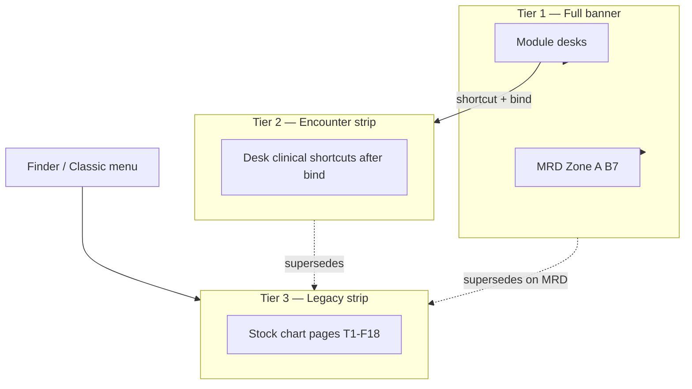

# Patient Dashboard (Full Chart) — MRD B7 Primary Redesign

| Field | Value |
|-------|--------|
| **Document version** | 0.1.1 |
| **Status** | Draft for review — **B7** build slice; integrates MRD v0.2.30 + Legacy Chart Context v0.1.2 |
| **Companion to** | [MEDICAL_RECORD_DASHBOARD_REDESIGN.md](./MEDICAL_RECORD_DASHBOARD_REDESIGN.md) (normative MRD IA), [NEW_CLINIC_V1_LEGACY_CHART_CONTEXT_REDESIGN.md](./done/NEW_CLINIC_V1_LEGACY_CHART_CONTEXT_REDESIGN.md) (stock chart boundary), [NEW_CLINIC_V1_MEDICAL_HISTORY_BACKGROUND_REDESIGN.md](./done/NEW_CLINIC_V1_MEDICAL_HISTORY_BACKGROUND_REDESIGN.md) (T1-F20 Background), [NEW_CLINIC_V1_PRD.md](./NEW_CLINIC_V1_PRD.md) (v1.20.41), [NEW_CLINIC_V1_PAGE_DESIGNS.md](./NEW_CLINIC_V1_PAGE_DESIGNS.md) (v0.6.45), [NEW_CLINIC_V1_PATIENT_CHART_DEPTH_REDESIGN.md](./done/NEW_CLINIC_V1_PATIENT_CHART_DEPTH_REDESIGN.md) (v0.1.9) |
| **Audience** | Product, design, clinical leads, trainers, implementers, QA |
| **Primary market** | Private outpatient clinics — **Ghana & West Africa** |
| **Build milestone** | **B7** — redesigned full patient chart replaces stock Medical Record Dashboard for Clinic roles |
| **Implementation** | Design + research synthesis — normative wireframes remain in companion specs |

---

## Table of contents

1. [Executive summary](#1-executive-summary)
2. [Research — OpenEMR patient dashboard pain points](#2-research--openemr-patient-dashboard-pain-points)
3. [Research — UI/UX principles for clinical charts](#3-research--uiux-principles-for-clinical-charts)
4. [Research — how leading EHR systems address chart UX](#4-research--how-leading-ehr-systems-address-chart-ux)
5. [Research — Ghana & West Africa operational context](#5-research--ghana--west-africa-operational-context)
6. [MRD B7 — comprehensive redesign summary](#6-mrd-b7--comprehensive-redesign-summary)
7. [MRD B7 — every major capability in plain English](#7-mrd-b7--every-major-capability-in-plain-english)
8. [Legacy overlay on stock chart — boundary module](#8-legacy-overlay-on-stock-chart--boundary-module)
9. [Legacy overlay — every function in plain English](#9-legacy-overlay--every-function-in-plain-english)
10. [Three-tier identity — how the pieces fit together](#10-three-tier-identity--how-the-pieces-fit-together)
11. [Phasing, acceptance & training](#11-phasing-acceptance--training)
12. [Document history](#12-document-history)

---

## 1. Executive summary

### 1.1 What B7 delivers

**B7** is the milestone where the redesigned **Medical Record Dashboard (MRD)** — the full patient chart — replaces stock OpenEMR’s default dashboard for New Clinic roles. It is the **depth layer**: staff open it when role desks and the patient-context banner are not enough to answer *“What happened before?”*

It is **not** the daily operating system. Front Desk, Triage, Doctor Desk, Lab, Pharmacy, and Cashier remain the golden path for queue work.

```text
Daily work:     Role desk → Visit Board → core shortcuts
Depth on demand: Open full chart → Redesigned MRD (B7)
Interim / legacy: Stock chart pages → Legacy patient context strip (T1-F18)
```

### 1.2 Why this document exists

Companion specs ([MRD](./MEDICAL_RECORD_DASHBOARD_REDESIGN.md), [Legacy Chart Context](./done/NEW_CLINIC_V1_LEGACY_CHART_CONTEXT_REDESIGN.md)) define **what to build**. This document adds:

- **Research synthesis** — validated pain points from stock OpenEMR, community feedback, and codebase audit
- **UI/UX and competitive patterns** — how top EHRs and Africa-focused products solve the same problems
- **Ghana / West Africa constraints** — shared devices, walk-in OPD, cash clinic, similar surnames, intermittent connectivity
- **Plain English glossary** — every major capability in MRD B7 and the legacy overlay boundary module, **without technical file names**, so trainers and clinical leads can review without reading PHP

### 1.3 Locked product decisions (carry forward)

| Decision | Answer |
|----------|--------|
| Tab count | **5 tabs** — Overview · Clinical · Visits · Profile · Messages |
| Layout | **Four zones** — sticky banner · safety strip · workspace tabs · banner-first actions |
| Visit awareness | Active **unfinished** visit on banner; all today’s visits on Visits tab |
| Insurance | **Hidden** when cash clinic (`enable_insurance = false`) |
| Role desks vs chart | Desks **push** consult-ready context; MRD is **pull** depth |
| Legacy stock pages | **T1-F18** strip until staff stop using Classic menu paths |
| Wrong patient | Sticky identity anchor; full reload on patient switch — never silent swap |
| **Open full chart landing** | **Role default tab** per MRD §10.1 (**D-MRD-13**) — never stock 25-card layout |

---

## 2. Research — OpenEMR patient dashboard pain points

Evidence from stock codebase audit, OpenEMR community threads, and third-party UX reviews (2025–2026).

### 2.1 Information architecture failures

| Pain | Evidence | Impact on private OPD (Ghana) |
|------|----------|-------------------------------|
| **Widget sprawl** | Stock dashboard loads **25+ collapsible cards** in two columns; each card may AJAX-load its body on expand | Doctor scrolls past billing and portal cards to find allergies before a 7-minute consult |
| **Clinical + admin mixed** | Community proposal to split “Clinical” vs “Demographic/Billing” tabs ([OpenEMR forum](https://community.open-emr.org/t/interface-improvements-patient-dashboard/26076)) | Reception and doctor share one screen mental model — wrong data prominence |
| **Parallel navigation systems** | Horizontal patient menu (10+ tabs) **plus** dashboard cards **plus** encounter forms | Locum trained on “Dashboard” never finds ledger without menu archaeology |
| **No task focus** | Cards are **patient-centric**, not **visit-centric** | Cannot answer *“Where is Akua in today’s queue?”* from the chart |
| **Dashboard Context Manager (DCM)** | OpenEMR 7.0.4+ hides widgets per “context” — **admin configuration**, not visit FSM | Helps clutter but does not add queue #, completion gate, or cash-clinic IA |

### 2.2 Performance and technical debt

| Pain | Evidence | Impact |
|------|----------|--------|
| **Chatty first load** | Stock dashboard fires **multiple parallel AJAX fragment loads** when cards expand (`lbf_fragment.php`, card loaders) | Slow first paint on **shared clinic tablets** and 3G backup links |
| **Monolithic controller** | Patient summary screen ~**2,000 lines** — demographics, billing, insurance, cards, events in one procedural file | Hard to extend without forking; New Clinic uses **module overlay + events** instead |
| **Iframe shell** | Knockout tab + iframe pattern ([FRONTEND_2026 plan](./FRONTEND_2026_MODERNIZATION_PLAN.md)) | Multi-tab wrong-patient risk; no shared patient ribbon across legacy pages |
| **Silent patient switch** | `set_pid` in URL changes session patient without confirm dialog | Reception opens Kwame’s ledger while doctor still thinks session is Akua |

### 2.3 US-centric and role-blind design

| Pain | Evidence | Ghana / cash clinic impact |
|------|----------|------------------------------|
| **Insurance prominence** | Billing widget, insurance card, payer columns on ledger | Empty or confusing columns — looks “broken” to cashier |
| **No completion score UI** | Completion exists in module layer but not on stock dashboard | Cannot support **70% profile gate** before payment |
| **Role-blind layout** | Same dashboard for reception, nurse, doctor, billing | Violates PRD **“tasks over menus”** — everyone hunts |
| **Scattered clinical summary** | Vitals, chief complaint, meds in **separate collapsed cards** | Conflicts with Doctor Desk rule: consult-ready fields **without scrolling** |

### 2.4 Safety and identity gaps

| Pain | Who suffers | Risk |
|------|-------------|------|
| **Allergies below fold** | Doctor, pharmacist | Penicillin reaction missed until scroll |
| **No sticky patient identity** | All roles on legacy pages | Wrong-patient orders on shared PC |
| **No visit chip on stock chart** | Doctor, nurse, pharmacy | Assumes patient not in building when they are in `ready_for_pharmacy` |
| **Alert via browser `alert()`** | Clinician | Allergy conflict popup is modal and easy to dismiss without context |

### 2.5 What upstream OpenEMR already tried

| Mitigation | Limitation for New Clinic |
|------------|---------------------------|
| **Hide dashboard cards** global | Hides widgets — does not restructure IA or add visit FSM |
| **Dashboard Context Manager** | Role/context widget sets — no `new_visit`, no banner reuse, no cash clinic defaults |
| **Card-based continuous scroll** | Better than pop-ups — still one long page, not tabbed task focus |
| **Event hooks** (`SectionEvent`, `CardRenderEvent`, `RenderEvent`) | **Extension point** New Clinic uses for overlay without core fork |

**Conclusion:** Stock OpenEMR optimizes for **US ambulatory breadth**. New Clinic B7 optimizes for **West African private OPD depth-on-demand** with visit-aware, role-defaulted, cash-truth chart IA.

---

## 3. Research — UI/UX principles for clinical charts

Aligned with PRD §3.3, MRD §3, Nielsen health UX patterns, and WHO digital health usability guidance for LMIC settings.

### 3.1 Core principles

| # | Principle | Plain language | B7 application |
|---|-----------|----------------|----------------|
| P1 | **Safety before depth** | Show what can harm the patient first | Zone B safety strip: allergies, problems, meds, alerts — **server-rendered**, no wait for AJAX |
| P2 | **One question per zone** | Each screen area answers one job | Zone A: *Who?* Zone B: *What must I not miss?* Tabs: *Today / History / Admin / Comms* |
| P3 | **Progressive disclosure** | Summary first; detail on intent | Lazy tabs; activity feed expands inline before jumping to full forms |
| P4 | **Recognition over recall** | Show queue # and state labels — don’t make staff remember enums | Visit chip uses same words as Visit Board (`Ready for doctor`, not `ready_for_doctor`) |
| P5 | **Consistency across surfaces** | Same patient looks the same on desk and chart | Reuse **patient-context-banner** DTO on MRD Zone A |
| P6 | **Role-aware defaults, not role-restricted data** | Doctor lands Overview; reception lands Profile — ACL still governs edits | §10 role default tab matrix (**D-MRD-13**) |
| P7 | **Error prevention > error recovery** | Sticky MRN; full reload on patient change; blocking cancel banner | D-MRD-11 wrong-patient rules |
| P8 | **Touch and shared device** | 44px targets; no hover-only; sticky chrome | Responsive rules §13 MRD spec; T1-F19 on desks |
| P9 | **Performance is UX** | First meaningful paint ≤1 round trip above fold | Banner + safety strip in first HTML; ≤1 lazy tab fetch on open |
| P10 | **Accessible semantics** | Icon + text + color for URGENT, allergies, unsigned | T1-F08 — never color alone |

### 3.2 Anti-patterns we explicitly reject

| Anti-pattern | Why it fails in Ghana OPD |
|--------------|---------------------------|
| **Infinite scroll timeline as primary nav** | Saturday surge — staff need tabs, not archaeology |
| **Insurance-first billing widget** | Cash clinic; balance due belongs on banner when `ready_for_payment` |
| **Chart as consult home** | Doctor Desk banner owns consult-ready fields; chart is second tab |
| **Client-only patient banner** | 3G — strip must be **server truth** on first paint |
| **Binding encounter when opening full chart** | Breaks desk session; chart opens **new tab, patient only** |

### 3.3 Consult-ready vs chart-depth taxonomy (PRD §6.1h)

| Kind of information | Changes how often? | Where staff expect it |
|---------------------|--------------------|------------------------|
| **Background** (family, social, PMH narrative) | Rarely | Clinical tab → Background |
| **Longitudinal lists** (problems, allergies, meds) | Between visits | Safety strip + Clinical tab |
| **Visit documentation** (SOAP, exam) | Per encounter | Clinical → **This visit**; past visits → Visits → View documentation |
| **Operational timeline** (queue moves, payments) | Intraday | Overview activity feed; Visits audit expand |

---

## 4. Research — how leading EHR systems address chart UX

Synthesis for product direction — not a feature parity checklist.

### 4.1 Pattern comparison

| Pattern | Epic Hyperspace | Cerner PowerChart | athenaOne | Bahmni / OpenMRS 3 | Helium Health (Africa SaaS) | **New Clinic B7 + legacy strip** |
|---------|-----------------|-------------------|-----------|---------------------|----------------------------|----------------------------------|
| **Persistent patient ribbon** | Storyboard header | Patient context bar | Context bar | SPA patient header | Module banner | Zone A banner + T1-F18 on legacy PHP |
| **Workflow vs chart split** | Storyboard vs Chart Review | PowerNote vs Chart | Exam vs Chart | Registration vs clinical apps | Desk vs chart | **Desks push; MRD pulls** |
| **Active visit indicator** | Open encounter chip | Active visit | Appointment context | Visit at registration | Visit ID on modules | `new_visit` chip + queue # |
| **Safety surfacing** | Allergy band | Critical alerts row | Problem/allergy summary | — | Allergy on banner | Zone B four-card strip |
| **Role-based landing** | Activity-specific | Role tabs | Specialty layouts | App-based roles | Role modules | Default tab by role |
| **Legacy wrap** | Web components in Hyperspace | — | Limited | Bahmni wraps OpenMRS | Partial native | Symfony inject strip (strangler-fig) |
| **Shared workstation guard** | Re-auth timers | Context switch log | — | — | Common in clinics | T1-F19 desk blocking banner |
| **Walk-in / queue culture** | US appointment-heavy | Mixed | Mixed | Strong at registration | Phone booking weak | Queue # on banner, paper slip parity |

### 4.2 Takeaways for B7

1. **Top systems never leave chart pages without a patient ribbon** — T1-F18 is minimum viable for stock PHP until B7 wraps all routes.
2. **Workflow surface ≠ chart** — Epic’s Storyboard maps to Doctor Desk; Chart Review maps to MRD Clinical / Visits.
3. **Africa-focused products emphasize visit ID and module banners** — queue # on strip matches Helium/Bahmni registration-to-clinical handoff.
4. **Progressive disclosure is universal** — summary strip + drill-down tabs beats 25 widgets.
5. **Wrong-patient guards combine header lock + session recovery** — T1-F19 on desk return, not just pretty headers.

---

## 5. Research — Ghana & West Africa operational context

### 5.1 Clinic realities that shape B7

| Factor | Typical pattern | Design response |
|--------|-----------------|-----------------|
| **Shared PCs** | 2–4 staff one desktop at front desk / doctor room | T1-F19 session mismatch banner on desk return |
| **Walk-in OPD volume** | Saturday peaks; appointment optional | Queue # on banner; Visits tab shows **all same-day visits** |
| **Cash payment** | Pay before exit; NHIS attribute not full claims workflow | Hide insurance UI; **Balance due** on banner when `ready_for_payment` |
| **Similar surnames** | Mensah, Owusu, Asante common | **MRN always visible**; never truncate MRN on mobile strip |
| **Estimated DOB** | Pediatric registration incomplete | **Estimated DOB** badge + payment block rule |
| **Locum / weekend doctors** | Trained on stock OpenEMR, not module desks | Legacy strip on Finder path; Classic menu retained under ⋯ |
| **Paper queue tickets** | Queue # written on paper slip | Chip matches Visit Board and slip format |
| **Intermittent connectivity** | 3G backup | Server-render banner; soft poll 60s only when Overview visible |
| **English UI V1** | Twi voice optional V2 | All labels via translation helper |
| **Profile completion culture** | Reception completes demographics over time | Completion ring on banner; Profile tab checklist |

### 5.2 Role-specific chart needs (Ghana private clinic)

| Role | Opens full chart when… | B7 default tab | Must see without scrolling |
|------|------------------------|----------------|----------------------------|
| **Reception** | Profile completion, duplicate review | Profile | Identity + Start visit |
| **Nurse** | Allergy detail, history | Overview | Allergies (safety strip) |
| **Doctor** | Past notes, trends, complex case | Overview | CC + vitals + allergies + meds (aligns M4-F02) |
| **Lab / pharmacy** | Historical results / Rx context | Clinical (labs or meds section) | Active orders strip when ops hub ON |
| **Cashier** | Completion %, balance dispute | Profile | Completion + balance when `ready_for_payment` |
| **Manager** | Audit, unsigned charts | Overview | Action required block |

### 5.3 Training one-liners (Ghana)

| Surface | One-liner |
|---------|-----------|
| **Doctor Desk** | *“The banner tells you who you are treating now.”* |
| **Full chart (B7)** | *“The chart tells you what happened before.”* |
| **Legacy stock page** | *“The strip on the old page is the patient on **this** page — not the patient you were thinking about.”* |
| **Desk vs chart tab** | *“Keep the desk tab; open chart in a **new tab**.”* |

---

## 6. MRD B7 — comprehensive redesign summary

Normative detail: [MEDICAL_RECORD_DASHBOARD_REDESIGN.md](./MEDICAL_RECORD_DASHBOARD_REDESIGN.md). This section is the **integrated blueprint**.

### 6.1 Four zones

```text
┌────────────────────────────────────────────────────────────────────────────┐
│  ZONE A — STICKY PATIENT + VISIT BANNER (reuse patient-context-banner)      │
│  Name · MRN · sex · age · DOB · completion · visit chip · CC · vitals      │
│  Primary actions (2–3) + Actions menu + overflow (Classic menu, ledger)   │
├────────────────────────────────────────────────────────────────────────────┤
│  ZONE B — SAFETY STRIP (four cards, first HTML response)                    │
│  Allergies · Problems · Medications · Priority alerts                       │
├────────────────────────────────────────────────────────────────────────────┤
│  ZONE C — FIVE WORKSPACE TABS (lazy load, deep-linkable ?tab=)             │
│  Overview · Clinical · Visits · Profile · Messages                          │
└────────────────────────────────────────────────────────────────────────────┘
```

### 6.2 Five tabs — staff mental models

| Tab | Question | Key contents |
|-----|----------|--------------|
| **Overview** | *What’s going on today?* | Today’s encounter summary · action required (unsigned, open orders) · 90-day activity feed |
| **Clinical** | *What’s their medical picture?* | Background · problems · allergies · meds · immunizations · labs/vitals trends · **This visit** forms |
| **Visits** | *When have they been here?* | Appointments · today’s timeline (multi-visit same day) · past visits · recalls · advance directives |
| **Profile** | *Who are they — are they complete?* | Demographics · completion checklist · documents · payments strip · NHIS field when enabled |
| **Messages** | *Who said what?* | Care team · notes · reminders · eRx panel |

### 6.3 What moves out of MRD (Chart Depth M11)

Ledger detail, referral letters, clinical export PDF, external care panels — **slide-over depth panels** linked from summary strips, not a sixth tab. See [Chart Depth spec](./done/NEW_CLINIC_V1_PATIENT_CHART_DEPTH_REDESIGN.md).

### 6.4 Visit-state reactive banner

Banner primary button changes with `new_visit.state` — e.g. doctor sees **Open encounter** when `with_doctor`; cashier sees **Take payment** when `ready_for_payment`. Role desks remain **preferred** for queue actions; MRD buttons are shortcuts.

---

## 7. MRD B7 — every major capability in plain English

Descriptions use **English names only** — no source code file references.

### 7.1 Shell and chrome

| Capability | What it does (plain English) |
|------------|------------------------------|
| **New Clinic theme shell** | Wraps the full chart in the same top bar and styling as module desks when the New Clinic module is installed. |
| **Sticky patient banner** | Always-visible header with photo, name, medical record number, age, sex, date of birth, and profile completion ring. |
| **Visit chip** | Shows today’s **unfinished** visit state (e.g. “Ready for doctor”) and queue number; hidden when patient has no active visit. |
| **Chief complaint line** | One-line summary from today’s visit registration — not copied from the doctor’s note in V1. |
| **Vitals chips** | Today’s blood pressure, pulse, temperature, etc. on the banner when recorded; amber “No vitals today” when visit active but none recorded. |
| **Safety strip** | Four summary cards below the banner: allergies, active problems, medications, and priority alerts — loaded immediately with the page. |
| **Actions menu** | Dropdown for secondary actions (print slip, open Visit Board, etc.); primary 2–3 buttons stay visible on the banner. |
| **Classic menu overflow** | Hidden path to stock horizontal patient menu for power users (ledger, legacy report) — de-emphasized, not removed. |

### 7.2 Overview tab capabilities

| Capability | What it does (plain English) |
|------------|------------------------------|
| **Today’s encounter block** | Read-only summary of the active visit: queue number, state, complaint, vitals, assigned doctor — links to Visit Board. |
| **Action required block** | Lists things needing attention now: unsigned documentation, open lab orders, open prescriptions — deduplicated from the activity feed. |
| **Recent activity feed** | Chronological list (90 days, 25 rows initially) of visit events: vitals saved, state changes, lab results, payments, etc. |
| **Inline expand** | Tap a feed row to see a short summary without leaving the chart. |
| **Smart navigation** | Some rows open Clinical tab sections; others open core encounter screens in the same tab. |
| **Soft refresh** | While Overview is visible and a visit is active, quietly refreshes every 60 seconds for new events. |

### 7.3 Clinical tab capabilities

| Capability | What it does (plain English) |
|------------|------------------------------|
| **Background section** | Family, social, and past medical history narrative — **T1-F20** read summary at `#clinical-background`; **Edit history** opens stock editor; detail [MEDICAL_HISTORY_BACKGROUND](./done/NEW_CLINIC_V1_MEDICAL_HISTORY_BACKGROUND_REDESIGN.md). |
| **Problems section** | Structured active and resolved problem list. |
| **Allergies section** | Allergy list including valid “None known” documentation. |
| **Medications section** | Active prescriptions and medication list. |
| **Immunizations section** | Vaccination history. |
| **Labs and vitals trends** | Historical results and vital sign trends — not just today’s values. |
| **This visit section** | Forms and orders tied to **today’s active encounter only** — SOAP, vitals form row, lab orders, questionnaires. |
| **Layout forms section** | Clinic-configured custom forms and “track anything” widgets. |
| **Labs summary strip** | When lab operations hub is on: pending test count and link to lab worklist. |
| **Meds summary strip** | When pharmacy operations hub is on: undispensed Rx count and link to pharmacy worklist. |
| **Referrals summary strip** | When outbound referral exists: draft or sent letter with link to referrals panel. |

### 7.4 Visits tab capabilities

| Capability | What it does (plain English) |
|------------|------------------------------|
| **Future appointments** | Next 90 days from scheduling. |
| **Today’s visit timeline** | All visits today with separate queue numbers when patient returned same day. |
| **Past visits list** | 20 most recent finished visits; load more in pages of 20. |
| **Inline audit expand** | Last five queue/audit events per visit row without opening full chart. |
| **View documentation** | Opens encounter forms list for that visit’s clinical note — not just operational audit. |
| **Export visit summary** | When chart depth export enabled: PDF summary for patient or employer — [PATIENT_CLINICAL_EXPORT](./done/NEW_CLINIC_V1_PATIENT_CLINICAL_EXPORT_REDESIGN.md) |

### 7.5 Profile and Messages tab capabilities

| Capability | What it does (plain English) |
|------------|------------------------------|
| **Demographics editor** | Core patient identity and contact fields. |
| **Completion checklist** | Shows missing profile levels L1–L4; explains billing gate at 70%. |
| **Documents and ID** | Photos, scans, disclosures, amendments. |
| **Payments strip** | Balance due and last receipt with link to full payment history panel. |
| **Coverage subsection** | Insurance fields only when insurance feature enabled — collapsed by default. |
| **Messages tab** | Staff notes, care team, patient reminders, e-prescribing panel when enabled — patient-scoped; clinic-wide inbox is [COM hub](./done/NEW_CLINIC_V1_COMMUNICATIONS_HUB_REDESIGN.md) |

### 7.6 Backend services (plain English)

| Service | What it does (plain English) |
|---------|------------------------------|
| **Patient preview builder** | Gathers identity, allergies, visit chip, vitals snapshot for banner — same data family as desks. |
| **Activity feed aggregator** | Merges audit log, vitals, labs, Rx, payments into one timeline with stable event types. |
| **Visits list provider** | Returns today’s and paginated past visit rows for the Visits tab. |
| **Overview composer** | Builds the three Overview blocks plus initial feed page in one request. |
| **Profile payments summary** | Lightweight balance and last receipt for the Profile payments strip. |
| **Clinical summary helpers** | Pending lab count, undispensed Rx count, referral draft status for summary strips. |

### 7.7 Gates and alerts on the chart

| Signal | What staff see | Why it matters (Ghana) |
|--------|----------------|------------------------|
| **Completion ring** | Percent complete; red under 40%, amber 40–69%, green 70%+ | Cashier payment gate |
| **Pediatric estimated DOB** | Amber alert on banner | Block payment until exact DOB for young children |
| **Unsigned documentation** | Red or amber chip per clinic config | Prevents “completed consult” confusion vs signed note |
| **Duplicate patient hint** | Badge linking to merge review | Similar names at registration |
| **Visit cancelled while chart open** | Blocking banner; actions disabled | Same rule as triage desk interrupt |
| **Balance due** | On visit chip when ready for payment | Cash truth without opening ledger |

---

## 8. Legacy overlay on stock chart — boundary module

### 8.1 What problem it solves

Until **B7** ships — and forever on **Classic menu** paths power users keep — staff open **stock OpenEMR chart pages** (old dashboard, ledger, report, history, prescription list). Those pages have **no visit awareness** and **no shared banner** with Doctor Desk.

The **legacy overlay boundary module** (PRD **T1-F18**, **T1-F19**, slice **V1.2-CTX**) injects a **compact patient identity strip** on allowlisted stock pages. It is the **third tier** of a three-tier identity architecture (desk banner → encounter strip → legacy strip).

### 8.2 Scope boundary

| In scope | Out of scope |
|----------|--------------|
| Stock patient chart PHP pages opened via Finder, horizontal nav, Classic menu | Module desk screens (they already have full banner) |
| Ledger, report, history, issues, documents, Rx list (patient-only) | Patient search grid itself (strip appears **after** patient selected) |
| Informational visit chip and optional allergy chips | Queue actions (Take patient, Complete consult) on strip |
| Pairing with desk session warning on return | Full MRD five-tab IA on stock dashboard |

### 8.3 Relationship to B7

| Phase | Stock dashboard | Redesigned MRD (B7) | Legacy strip |
|-------|-----------------|---------------------|--------------|
| Pilot week 1–4 (B7 pending) | Still default | Not live | **Recommended ON** for clinical roles |
| After B7 sign-off | Replaced for Clinic roles | Zone A full banner | Suppressed on MRD routes; still on Classic menu paths |
| Long term | Admin / power users only | Primary full chart | Shrinks as Chart Depth replaces ledger/report menus |

---

## 9. Legacy overlay — every function in plain English

This section explains **each function** in the legacy overlay boundary module using **everyday English names only**. Implementers map these to PRD feature IDs T1-F18, T1-F18b, T1-F18c, T1-F19.

### 9.1 Configuration and gates

| Function (plain English) | What it does |
|--------------------------|--------------|
| **Master overlay switch** | Clinic setting that turns the entire legacy strip on or off. When off, stock pages look exactly like stock OpenEMR. |
| **Clinical chips switch** | Optional setting to show up to two severe allergy warnings on the strip — not just name and visit. |
| **Desk return link switch** | Optional setting to show “Return to Doctor Desk” (or nurse/lab/pharmacy desk) when browser memory says you were treating a **different** patient on the desk. |
| **Shared device warning switch** | Separate setting for the **blocking banner on module desks** when you return from a chart tab that changed the session patient. |
| **Module installed check** | Strip never appears if New Clinic module is disabled — avoids half-modern UI. |
| **Clinic role check** | Only staff mapped to New Clinic roles see the strip; stock-only admins see unchanged legacy UI. |

### 9.2 Injection pipeline

| Function (plain English) | What it does |
|--------------------------|--------------|
| **Page render listener** | Watches when stock chart pages are about to display and decides whether to attach the strip. |
| **Allowlist matcher** | Compares the current page address against an approved list (dashboard, ledger, report, history, etc.). If not on the list, do nothing. |
| **Fallback response filter** | For pages that do not fire the standard render event, catches the HTML response and prepends the strip another way. |
| **Duplicate strip guard** | If the page already has the **encounter identity strip** (from a desk shortcut) or the **full MRD banner**, skip injecting the legacy strip — one ribbon only. |
| **Print and PDF guard** | Does not inject on print-friendly or PDF export requests — receipts and reports stay clean. |
| **Strip placement** | Inserts the strip **above** the old page title and horizontal patient menu so it stays visually primary. |

### 9.3 Data loading

| Function (plain English) | What it does |
|--------------------------|--------------|
| **Legacy chart preview builder** | Loads patient name, medical record number, demographics, photo, and **today’s unfinished visit** in one server call — same family as desk preview, tagged for legacy context. |
| **Unfinished visit resolver** | Finds whether this patient has an active visit today; picks latest started if multiple unfinished (same-day return visit). |
| **Allergy chip loader** | When clinical chips setting is on, fetches top severe allergies for the strip — max two visible plus “more” tooltip. |
| **Request-scoped cache** | Remembers preview data for the duration of one page request so repeated checks do not hit the database twice. |

### 9.4 Strip display component

| Function (plain English) | What it does |
|--------------------------|--------------|
| **Legacy context strip renderer** | Draws the sticky bar: photo or initials, name, sex, age, medical record number, date of birth, estimated-DOB badge when applicable. |
| **Visit chip renderer** | Shows colored chip with human-readable state (“In pharmacy”) and queue number; hides when no unfinished visit today. |
| **Urgent and skip-triage badges** | Small outline badges on the visit chip when flagged at registration or triage. |
| **Open full chart link** | Optional link on strip to open redesigned MRD in a new tab when B7 is live; until then may say “Open dashboard”. |
| **Return to desk link** | When desk memory patient ≠ chart patient, shows link back to the role desk — does **not** auto-switch session. |
| **Sticky layout styles** | CSS that keeps strip fixed at top while scrolling long ledger tables; hides strip when printing. |
| **Accessibility region** | Marks strip as a labeled landmark for screen readers (“Patient context”). |

### 9.5 Session and patient switch behavior

| Function (plain English) | What it does |
|--------------------------|--------------|
| **Patient switch reload** | When user opens a different patient via search or URL, full page reload recomputes strip — never silently patch wrong name. |
| **Horizontal nav unchanged** | Clicking Dashboard → Ledger → Report on **same patient** keeps strip stable — no flicker. |
| **No encounter bind on load** | Strip **never** sets the active encounter in session just by displaying — informational only. |
| **Facility scoping** | Visit chip respects the logged-in user’s clinic location — same rule as Visit Board. |

### 9.6 Shared device session warning (desk companion)

| Function (plain English) | What it does |
|--------------------------|--------------|
| **Desk return detector** | When user switches back to a module desk tab, checks if browser remembered an active visit but server session points at a different patient. |
| **Mismatch comparator (clinical desks)** | Compares session patient **and** encounter to the remembered visit — for doctor, triage, lab, pharmacy. |
| **Mismatch comparator (cashier)** | Compares **patient only** — cashier never binds encounter per product rules. |
| **Blocking banner renderer** | Full-width warning on desk: shows desk patient vs session patient with medical record numbers. |
| **Restore session action** | Button that re-binds server session to the desk visit and reloads — “put me back on Akua”. |
| **Return to queue action** | Button that clears active patient pane and desk memory without forcing wrong bind. |
| **Front desk exclusion** | Reception desk does not show this warning — different workflow (no long-lived consult bind). |

### 9.7 Restore session API (shared with desks)

| Function (plain English) | What it does |
|--------------------------|--------------|
| **Restore encounter session endpoint** | Server action that sets patient and encounter session to match a given visit ID after staff confirm. |
| **Visit bind validator** | Ensures actor is allowed to bind that visit, visit has an encounter, and visit is in expected state. |
| **Bind audit logger** | Records when session was restored for troubleshooting wrong-patient incidents. |

### 9.8 Exclusion and maintenance

| Function (plain English) | What it does |
|--------------------------|--------------|
| **Module route excluder** | Never injects on New Clinic module’s own modern pages. |
| **Encounter shortcut excluder** | Desk shortcuts that already ran preflight and show encounter strip win over legacy strip. |
| **MRD wrapper excluder** | When B7 serves chart through module wrapper with Zone A banner, legacy strip suppressed. |
| **Allowlist maintainer** | Process requirement: when Classic menu adds a new stock page, add it to allowlist in same change. |

### 9.9 What the legacy module deliberately does NOT do

| Not included | Reason |
|--------------|--------|
| Take patient / complete consult buttons | Queue actions stay on role desks — strip is context, not control |
| Full vitals row | Use desk banner or MRD Clinical |
| Bind encounter on page open | Would break desk + chart multi-tab workflow |
| Replace five-tab MRD | B7 owns full chart IA |
| Show on patient search grid | Strip appears on first chart page after selection |

---

## 10. Three-tier identity — how the pieces fit together



| Staff question | Where to look |
|----------------|---------------|
| *Who am I treating on the floor?* | Role desk banner |
| *Which encounter am I documenting?* | Encounter strip on shortcut forms |
| *Who belongs to this old ledger page?* | Legacy strip |
| *Full history and trends?* | MRD B7 Clinical / Visits |

**Wrong-patient recovery:** Read strip on stock page → if mismatch with desk, stop → return to desk tab → use **Restore session** if warning shows (T1-F19).

---

## 11. Phasing, acceptance & training

### 11.1 Build phasing

**Dependency:** Ship **M0** DTOs (`PatientContextService`, `PatientActivityFeedService`) before B7 — banner fields must not diverge across desks and MRD (PRD §7.5 B7 row).

| Phase | Deliverable |
|-------|-------------|
| **M0** | Patient preview DTO, activity feed service, AJAX contracts |
| **T1-F18** (optional pilot) | Legacy strip on allowlisted stock pages — **V1.2-CTX** slice; **recommended ON** during pilot when B7 pending; not the same as “post-pilot only” |
| **B7** | Full MRD four zones + five tabs + T1 shell |
| **V1.2-CTX** | T1-F18 + T1-F19 closed; automated tests CTX-1–CTX-5 |
| **V1.1-CD** | Chart Depth panels from MRD strips |

### 11.1a Pilot interim chart surfaces (before B7)

See also [USER_WORKFLOWS §17.1a](./NEW_CLINIC_V1_USER_WORKFLOWS.md#171a-pilot-interim--which-chart-surface-before-b7) and [PRD §5.6.1](./NEW_CLINIC_V1_PRD.md#561-interim-full-chart-pilot-week-1--before-b7-mrd-ships).

```text
Pilot week 1–4 (B7 pending):
  Role desk banner     → who you treat NOW
  Open full chart      → stock demographics (+ optional T1-F18 strip)
  ⋯ Classic menu       → ledger / report / transactions (pilot truth for money)
After B7:
  Open full chart      → redesigned MRD at role default tab (D-MRD-13)
```

### 11.2 B7 sign-off checklist

**MRD core (tests 39–42 — PRD §21.1k, §21.1l, §21.1aa):**

| Test | What to verify |
|------|----------------|
| **39** | Overview activity feed: 90d / 25 rows / canonical `event_type` / Block B dedup |
| **40** | Feed inline expand vs navigate per MRD §8.4.4 |
| **41** | Visits tab: 20/page pagination; today shows all same-day visits |
| **42** | Clinical §8.9 anchors; **T1-F20** Background summary; **Edit history** → `history_full.php`; **View documentation** opens correct encounter forms |
| **HIST-1–6** | Background read + editor return + nav hide — PRD §21.1aa |
| **EXP-1–6** | Patient clinical export / menu cutover — PRD §21.1ab |
| **FIN-1–6** | Patient payment history / Ledger — PRD §21.1ac |
| **REF-1–7** | Patient referrals & letters / Transactions — PRD §21.1ad |

**Legacy overlay (when T1-F18 enabled — PRD §21.1z, tests CTX-1–CTX-5):** sticky strip on stock pages; no duplicate with T1-F17; T1-F19 on desks.

**Highlights (MRD §17):**

1. Doctor + active visit: complaint, vitals (or missing alert), allergies, meds visible **without scrolling** at 768px width.
2. Cashier + `ready_for_payment`: completion %, balance, payment action visible without scrolling.
3. Allergies visible above fold at 360px width.
4. Five tabs remain primary nav — no infinite timeline replaces tabs.
5. Insurance UI absent when cash clinic config off.
6. Module absent: no JavaScript errors; generic chart still works.
7. **Open full chart** lands on **role default tab** (reception → Profile, doctor → Overview) — D-MRD-13.

Full normative checklists: [MRD §17](./MEDICAL_RECORD_DASHBOARD_REDESIGN.md#17-acceptance-criteria) · [LEGACY §16](./done/NEW_CLINIC_V1_LEGACY_CHART_CONTEXT_REDESIGN.md#16-acceptance-criteria) · PRD **§21.1k**, **§21.1l**, **§21.1aa**, **§21.1z**.

### 11.3 Trainer checklist (Ghana)

- [ ] Drill: desk banner vs chart strip vs encounter strip — three questions, three surfaces
- [ ] Drill G12 wrong-patient: Finder open while desk has active visit
- [ ] Saturday scenario: same PC, two doctors, T1-F19 restore
- [ ] Pilot interim: know which surface for ledger vs profile ([§11.1a](#111a-pilot-interim-chart-surfaces-before-b7))
- [ ] After B7: **Open full chart** lands on **role default tab** (not always Overview)
- [ ] COM hub vs MRD Messages tab ([USER_WORKFLOWS §17.3a](./NEW_CLINIC_V1_USER_WORKFLOWS.md#173a-com-hub-vs-mrd-messages-tab))
- [ ] Paper queue # matches strip and Visit Board

---

## 12. Document history

| Version | Date | Changes |
|---------|------|---------|
| 0.1.1 | 2026-06-24 | **Audit closure** — D-MRD-13; tests 39–42 + §21.1k/l/z sign-off checklist; §11.1a pilot interim; M0 dependency; V1.2-CTX phasing note; companion sync |
| 0.1.0 | 2026-06-24 | Initial comprehensive B7 research doc — OpenEMR pain points, UI/UX principles, EHR patterns, Ghana context, MRD + legacy overlay plain-English function glossary |

---

*Normative IA and wireframes: [MEDICAL_RECORD_DASHBOARD_REDESIGN.md](./MEDICAL_RECORD_DASHBOARD_REDESIGN.md) · Legacy boundary: [NEW_CLINIC_V1_LEGACY_CHART_CONTEXT_REDESIGN.md](./done/NEW_CLINIC_V1_LEGACY_CHART_CONTEXT_REDESIGN.md) · Product requirements: [NEW_CLINIC_V1_PRD.md](./NEW_CLINIC_V1_PRD.md) §5.6.1, §6.1g–§6.1j, B7, T1-F18/F19.*
