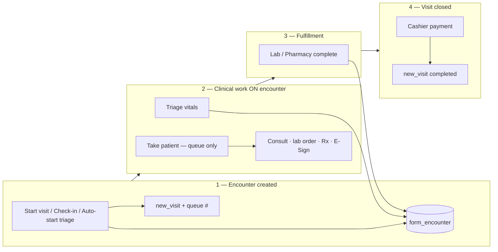
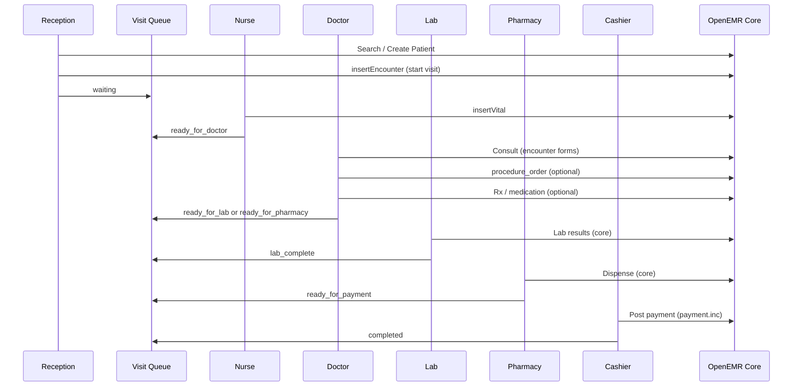
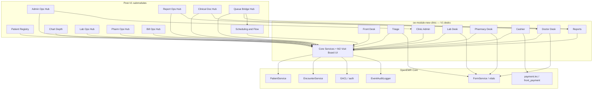

# Product Requirements Document (PRD)

## Private Clinic Experience — OpenEMR V1

| Field | Value |
|-------|--------|
| **Document version** | 1.20.50 |
| **Minimum OpenEMR** | 7.0.3+ (PHP 8.2+; see Q7 closed §24.1) |
| **V1 product name (user-facing)** | New Clinic |
| **Status** | Draft for review — **§5.6 implementation status matrix**; **[Implementation scorecard](./NEW_CLINIC_V1_IMPLEMENTATION_SCORECARD.md)** (living % tracker); Phase 1 companion specs approved for COM and M1a |
| **Product codename** | New Clinic Module Suite (NCMS) |
| **Working module prefix** | `oe-module-new-clinic` (+ related modules) |
| **Primary market** | Private outpatient clinics (V1 launch region: West Africa; expandable) |
| **Platform base** | OpenEMR 7.x (existing installation; no core fork) |
| **V1 billing model** | Cash only |
| **Target go-live** | TBD (pilot: 1 clinic) |

---

## Table of contents

1. [Executive summary](#1-executive-summary)
2. [Background & problem statement](#2-background--problem-statement) — [2.4 Patient registration problems](#24-patient-registration--search-problems)
3. [Goals, non-goals, and principles](#3-goals-non-goals-and-principles)
4. [Users, personas, and permissions](#4-users-personas-and-permissions)
5. [V1 product scope](#5-v1-product-scope) — [5.5 Two systems](#55-two-systems--staff-map--build-boundary) · [5.6 Implementation status](#56-implementation-status-matrix)
6. [End-to-end workflows](#6-end-to-end-workflows) — [6.1b Encounter lifecycle](#61b-encounter-lifecycle--anchor) · [6.1c Multi-user same encounter](#61c-multi-user-same-encounter) · [6.1d Supervisory consult](#61d-supervisory-consult) · [6.1e Doctor on the encounter](#61e-doctor-on-the-encounter) · [6.1f Chief complaint](#61f-chief-complaint) · [6.1g Clinical decision at the desk](#61g-clinical-decision-at-the-desk) · [6.1h Longitudinal taxonomy](#61h-longitudinal-chart-taxonomy--history-vs-assessments) · [6.1i Wrong patient prevention](#61i-wrong-patient-prevention) · [6.1j Wrong patient extensions](#61j-wrong-patient-prevention--extensions) · [6.1k Medication safety overrides](#61k-medication-safety--overrides--acknowledgments) · [6.1l Signed record amendment](#61l-signed-record-amendment) · [6.5.0 Same-day visits](#650-same-day-visits)
7. [Module architecture overview](#7-module-architecture-overview) — [7.4 Reference modules](#74-reference-implementation-in-codebase) · [7.5 Build order](#75-recommended-build-order)
8. [Module specifications](#8-module-specifications)
9. [Shared platform: visit queue & clinic configuration](#9-shared-platform-visit-queue--clinic-configuration)
10. [UI/UX system & theme redesign](#10-uiux-system--theme-redesign)
11. [OpenEMR integration matrix](#11-openemr-integration-matrix) — [11.1 Cash AR](#111-cash-payment--ar-normative) · [11.2 ACL](#112-acl-installation) · [11.3 Login](#113-post-login-redirect) · [11.4 IDs](#114-identifier-conventions) · [11.5 Multi-site](#115-multi-site--multi-facility) · [11.6 Deep links](#116-core-deep-link-acl-matrix)
12. [Data model](#12-data-model)
13. [APIs & extension points](#13-apis--extension-points)
14. [Regional localization & formatting](#14-regional-localization--formatting)
15. [Security, privacy, and audit](#15-security-privacy-and-audit)
16. [Non-functional requirements](#16-non-functional-requirements) — [16.1 Testing](#161-testing-strategy) · [16.2 Scheduled jobs](#162-scheduled-jobs-module-cron)
17. [Administration & clinic setup](#17-administration--clinic-setup) — [17.4 Module Manager runbook](#174-module-manager-runbook) · [17.4.8 Day-2 admin runbook](#1748-day-2-admin-runbook-m15) · [17.4.9 Day-2 reporting runbook](#1749-day-2-reporting-runbook-m16) · [17.4.10 Day-2 clinical documentation runbook](#17410-day-2-clinical-documentation-runbook-m17) · [17.4.11 Day-2 queue bridge runbook](#17411-day-2-queue-bridge-runbook-m18) · [17.4.12 Legacy chart context checklist](#17412-legacy-chart-context-checklist-v12-ctx--t1-f18f19)
18. [Reporting (V1)](#18-reporting-v1)
19. [What we hide / disable in core OpenEMR (V1)](#19-what-we-hide--disable-in-core-openemr-v1)
20. [Release plan & milestones](#20-release-plan--milestones) — [20.1 Post-pilot slices](#201-post-pilot-release-slices-v11-family--independent-ships)
21. [Acceptance criteria (V1 pilot)](#21-acceptance-criteria-v1-pilot)
22. [Risks, dependencies, and mitigations](#22-risks-dependencies-and-mitigations)
23. [Future phases (explicitly not V1)](#23-future-phases-explicitly-not-v1) — [23.1 V1.1 slice independence](#231-v11-slice-independence-closed)
24. [Open questions & decision log](#24-open-questions--decision-log) — [24.1 Closed](#241-closed-decisions) · [24.2 Open](#242-open-questions) · [24.3 Q10 rationale](#243-decision-rationale--q10-progressive-vs-full-form)
25. [Appendices](#25-appendices) — [Appendix F Encounter requirements](#appendix-f--encounter-requirements-matrix-p0) · [Appendix G Concurrent access](#appendix-g--concurrent-access-matrix-p0)

**Companion docs:**

- [NEW_CLINIC_V1_PAGE_DESIGNS.md](./NEW_CLINIC_V1_PAGE_DESIGNS.md) — page wireframes and acceptance (v0.6.44).
- [NEW_CLINIC_V1_USER_WORKFLOWS.md](./NEW_CLINIC_V1_USER_WORKFLOWS.md) — role playbooks, visual frameworks, and exception paths (v1.9.44).
- [MEDICAL_RECORD_DASHBOARD_REDESIGN.md](./MEDICAL_RECORD_DASHBOARD_REDESIGN.md) — full chart (MRD) IA, zones, tabs, activity feed, Clinical layout, and locked UX decisions (v0.2.30); visit banner shows active `new_visit` state only — no doctor routing.
- [NEW_CLINIC_V1_PATIENT_DASHBOARD_B7_PRIMARY_REDESIGN.md](./NEW_CLINIC_V1_PATIENT_DASHBOARD_B7_PRIMARY_REDESIGN.md) — **B7** MRD primary redesign research + legacy chart boundary plain-English glossary (v0.1.1); audit synthesis companion to MRD + LEGACY_CHART_CONTEXT.
- [NEW_CLINIC_V1_SCHEDULING_REDESIGN.md](./NEW_CLINIC_V1_SCHEDULING_REDESIGN.md) — Calendar, Flow Board, and Recalls UI/UX redesign + alignment (v0.2.3); implements §6.7 hard rules.
- [NEW_CLINIC_V1_COMMUNICATIONS_HUB_REDESIGN.md](./NEW_CLINIC_V1_COMMUNICATIONS_HUB_REDESIGN.md) — Staff Messages + Dated Reminders hub (v1.0.3, **approved Phase 1**); replaces legacy Message Center tabs; recalls remain S1.
- [NEW_CLINIC_V1_PATIENT_REGISTRY_REDESIGN.md](./NEW_CLINIC_V1_PATIENT_REGISTRY_REDESIGN.md) — Patient Registry cohort search (**Module M10**, v0.2.1); [PAGE_DESIGNS §7.32](./NEW_CLINIC_V1_PAGE_DESIGNS.md#732-patient-registryphp--patient-registry); replaces legacy Patient Finder; separate from Front Desk search.
- [NEW_CLINIC_V1_FRONT_DESK_SEARCH_REDESIGN.md](./NEW_CLINIC_V1_FRONT_DESK_SEARCH_REDESIGN.md) — Front Desk patient search (M1a, v1.0.7, **approved Phase 1**); `PatientSearchService` + `patient-search` component; preview via `PatientPreviewDto` / `patient-context-banner` (§5.6 implementation status).
- [NEW_CLINIC_V1_PATIENT_CHART_DEPTH_REDESIGN.md](./NEW_CLINIC_V1_PATIENT_CHART_DEPTH_REDESIGN.md) — **Module M11** Chart Depth (v0.1.12); payment history, referrals & letters, clinical export, external care — [PAGE_DESIGNS §7.13–§7.16](./NEW_CLINIC_V1_PAGE_DESIGNS.md#713-chart-depthpaymentsphp--payment-history); post-pilot **V1.1-CD** (§20.1).
- [NEW_CLINIC_V1_LAB_OPERATIONS_REDESIGN.md](./NEW_CLINIC_V1_LAB_OPERATIONS_REDESIGN.md) — **Module M12** Lab Operations Hub (v0.1.7); worklists, manual results, panels, send-out, LIS/DORN — [PAGE_DESIGNS §7.17–§7.20](./NEW_CLINIC_V1_PAGE_DESIGNS.md#717-lab-opsindexphp--lab-operations-hub); **V1.1-LAB** / **V1.1-LAB-ORD** (doctor panels) / **V1.2-LIS** (§20.1).
- [NEW_CLINIC_V1_PHARMACY_OPERATIONS_REDESIGN.md](./NEW_CLINIC_V1_PHARMACY_OPERATIONS_REDESIGN.md) — **Module M13** Pharmacy Operations Hub (v0.1.8); dispense worklists, stock receive, OPD starter formulary, OTC counter — [PAGE_DESIGNS §7.21–§7.24](./NEW_CLINIC_V1_PAGE_DESIGNS.md#721-pharm-opsindexphp--pharmacy-operations-hub); **V1.1-PRINT-RX** (Type A community-pharmacy PDF) / **V1.1-PHARM** / **V1.2-PHARM-RX** (doctor favorites) / **V3** supply chain (§20.1).
- [NEW_CLINIC_V1_BILLING_AR_BACKOFFICE_REDESIGN.md](./NEW_CLINIC_V1_BILLING_AR_BACKOFFICE_REDESIGN.md) — **Module M14** Billing Back Office Hub (v0.1.3); charge corrections, payment search, daysheet, outstanding balances, admin insurance vault — [PAGE_DESIGNS §7.25–§7.26](./NEW_CLINIC_V1_PAGE_DESIGNS.md#725-bill-opsindexphp--billing-back-office-hub); post-pilot **V1.2-BILL** (§20.1).
- [NEW_CLINIC_V1_ADMIN_CONFIGURATION_REDESIGN.md](./NEW_CLINIC_V1_ADMIN_CONFIGURATION_REDESIGN.md) — **Module M6 + M15** Admin Operations Hub (v0.1.3); clinic setup, people & access, forms, system health, day-2 runbooks — [PAGE_DESIGNS §7.27](./NEW_CLINIC_V1_PAGE_DESIGNS.md#727-admin-hubindexphp--admin-operations-hub); **V1.1-ADMIN** (§20.1).
- [NEW_CLINIC_V1_REPORTING_OPERATIONS_REDESIGN.md](./NEW_CLINIC_V1_REPORTING_OPERATIONS_REDESIGN.md) — **Module M7 + M16** Reporting Operations Hub (v0.1.2); daily ops + periodic/compliance façades over stock Reports — [PAGE_DESIGNS §7.10](./NEW_CLINIC_V1_PAGE_DESIGNS.md#710-reportsphp--daily-reports) + [§7.29](./NEW_CLINIC_V1_PAGE_DESIGNS.md#729-report-hubindexphp--reporting-operations-hub); **V1.1-REP** (§20.1); day-2 runbooks **RR-01–RR-12** (§17.4.9).
- [NEW_CLINIC_V1_CLINICAL_DOCUMENTATION_REDESIGN.md](./NEW_CLINIC_V1_CLINICAL_DOCUMENTATION_REDESIGN.md) — **Module M4 + M17** Clinical Documentation Hub (v0.1.2); curated encounter forms façade over stock `interface/forms/` — [PAGE_DESIGNS §7.30](./NEW_CLINIC_V1_PAGE_DESIGNS.md#730-clinical-docindexphp--clinical-documentation-hub); **V1.1-DOC** (§20.1); day-2 runbooks **DR-01–DR-08** (§17.4.10); respects **NG5**.
- [NEW_CLINIC_V1_SCHEDULING_QUEUE_BOUNDARY_REDESIGN.md](./NEW_CLINIC_V1_SCHEDULING_QUEUE_BOUNDARY_REDESIGN.md) — **Module M18** Queue Bridge Hub (v0.1.2); scheduling ↔ visit queue exception detection & guided fixes — [PAGE_DESIGNS §7.31](./NEW_CLINIC_V1_PAGE_DESIGNS.md#731-queue-bridgeindexphp--queue-bridge-hub); **V1.1-BRIDGE** (§20.1); day-2 runbooks **SQ-01–SQ-08** (§17.4.11); **H3** stands (no bidirectional sync).
- [NEW_CLINIC_V1_PATIENT_PAYMENT_HISTORY_REDESIGN.md](./NEW_CLINIC_V1_PATIENT_PAYMENT_HISTORY_REDESIGN.md) — **Patient payment history / Ledger** (v0.1.1); pilot **M11-F11** ledger wrapper · **V1.1-CDa** timeline + reprint · read-only core AR.
- [NEW_CLINIC_V1_PATIENT_REFERRALS_LETTERS_REDESIGN.md](./NEW_CLINIC_V1_PATIENT_REFERRALS_LETTERS_REDESIGN.md) — **Patient referrals & letters (Transactions)** (v0.1.1); pilot **M11-F11** transactions wrapper · **V1.1-CDb** wizard + list · inbound/outbound split (D34).
- [NEW_CLINIC_V1_PATIENT_CLINICAL_EXPORT_REDESIGN.md](./NEW_CLINIC_V1_PATIENT_CLINICAL_EXPORT_REDESIGN.md) — **Patient clinical export / Reports** (v0.1.1); pilot **M11-F11** stock wrapper · **V1.1-CDc** preset builder · menu cutover · distinct from M16.
- [NEW_CLINIC_V1_MEDICAL_HISTORY_BACKGROUND_REDESIGN.md](./NEW_CLINIC_V1_MEDICAL_HISTORY_BACKGROUND_REDESIGN.md) — **Clinical → Background** / History & Lifestyle (v0.1.1); read summary **T1-F20** · edit stock V1 · **T1-F20b** editor wrap · Ghana HIS pack **M6-F28** · legacy overlay on history pages.
- [NEW_CLINIC_V1_LEGACY_CHART_CONTEXT_REDESIGN.md](./NEW_CLINIC_V1_LEGACY_CHART_CONTEXT_REDESIGN.md) — **T1-F18/F19** legacy chart patient context (v0.1.2); visit-aware strip on stock `patient_file` — **V1.2-CTX** (optional pilot per §5.6.1); pairs with T1-F17 encounter strip; enable checklist **§17.4.12** / acceptance **§21.1z**.

---

## 1. Executive summary

### 1.1 What we are building

A **new private clinic layer** on top of OpenEMR, delivered primarily as **custom modules** and a **coordinated UI redesign**. V1 replaces the “one menu for everyone” experience with **role-based task dashboards** optimized for fast OPD (outpatient) workflows in private clinics, with **cash-only** checkout and receipts.

We are **not** rebuilding OpenEMR’s clinical engine, billing engine, or database from scratch. We are **orchestrating** existing capabilities behind simpler, role-specific interfaces and adding a thin **visit state** layer so staff always know who is waiting, with whom, and whether payment is complete.

**Encounter is the hub:** vitals, lab orders, prescriptions, and most charges require an active `form_encounter` created at **Start visit** (via `EncounterService::insertEncounter`). The module queue tracks operational state; clinical data stays in core tables. **Single reference:** [§6.1b Encounter lifecycle](#61b-encounter-lifecycle--anchor) + [Appendix F](#appendix-f--encounter-requirements-matrix-p0); concurrent access: [§6.1c](#61c-multi-user-same-encounter) + [Appendix G](#appendix-g--concurrent-access-matrix-p0).

**V1 roles (7 + admin):** Reception, Nurse, Doctor, **Lab**, **Pharmacy**, Cashier, and Clinic admin. Lab and Pharmacy are first-class roles when the clinic runs in-house lab or dispensary (configurable).

**Patient registration philosophy — Search-First + Progressive Capture + Enforced Completion:**

1. **Search first, always.** The default front-desk state is search, not a blank registration form. Registration appears only after “no match.”
2. **Progressive capture.** Level 1 (basic identity) creates the patient in under 10 seconds; Levels 2–4 are completed later.
3. **Duplicate prevention by design.** Real-time duplicate scoring (reusing OpenEMR’s existing `getDupScoreSQL()`) blocks accidental re-creation before insert, not after.
4. **Enforced completion at chokepoints.** A patient profile may be **incomplete** at creation but **must be completed** before key transitions — at minimum **before billing** (default threshold **70%**); before **returning visit** (default ON); **not** at Rx save in V1 (`enforce_completion_on_rx` = OFF). Overrides require ACL + reason (Q13).
5. **Clinical documentation attestation (E-Sign) is mandatory at payment.** Profile-appropriate documentation must be **E-Signed before cashier payment** (`assertProfileSigned` — §6.1.1, D32). Complete consult may proceed unsigned when worksheet row 10 = **No** (D42). Never substitute compliance for speed.
6. **Completion is measured, visible, and reportable.** A weighted completion score (0–100%) is shown on the patient banner and tracked in admin reports.

**Two systems, one product (closed — D17):** V1 ships **both** systems fully, not walk-in-only with optional chips:

| System | Staff question | Build |
|--------|----------------|-------|
| **Walk-in (today’s flow)** | “Who is in the clinic right now?” | M0–M9, M2 Visit Board, role desks — `new_visit` queue |
| **Schedule (planning + arrivals)** | “Who is booked / due back / checking in?” | **S1 Scheduling & Flow** — Calendar, Flow Board, Recalls redesign per [SCHEDULING_REDESIGN](./NEW_CLINIC_V1_SCHEDULING_REDESIGN.md) |

At the door, **every patient enters the walk-in system** (Start visit → Visit Board). The schedule system handles booking, follow-up, and appointment check-in; it does **not** replace Visit Board for live floor operations (§5.5, §6.7 H3).

### 1.2 Why this approach

| Factor | Implication |
|--------|-------------|
| OpenEMR legacy UI | High click cost; poor mobile layout |
| Coupled billing/clinical | Cannot “skin” billing away without behavior change |
| Private clinic reality | Cash, speed, small teams, shared devices |
| Target market context | Phone-first identity, admin-configurable currency, optional NHIS ref (not billed in V1) |
| Maintainability | Custom modules + events preserve upstream upgrades |

### 1.3 V1 outcome statement

> A private clinic in the target market can run a full outpatient day—**book appointments and work recalls**, register/find patient, triage, consult, optional lab/Rx via core screens, collect cash, print receipt, and review daily totals—**without using insurance/EDI menus**, in fewer clicks and with clearer queues than stock OpenEMR. Walk-in and scheduled patients share **one operational queue** (Visit Board); scheduling is a separate planning layer that feeds arrivals into that queue.

---

## 2. Background & problem statement

### 2.1 Market context (Private clinics)

Typical private OPD clinics (1–5 clinicians) face:

- **High patient volume** with **low admin staffing** (often 1 receptionist doing multiple jobs).
- **Cash settlement** at visit end (sometimes split: registration fee upfront, balance after consult).
- **Intermittent connectivity** and **shared desktop or tablet** at front desk.
- Staff trained on **task order**, not on **software menu trees**.
- Optional **NHIS membership** as patient attribute; **claims and credentialing** are a separate, heavier product (out of V1).

### 2.2 OpenEMR gaps (for this segment)

| Gap | Impact |
|-----|--------|
| US-centric billing UX | Confusing insurance, EDI, ERA, eligibility screens |
| Single mega-menu | Reception, nurse, doctor, cashier see similar navigation |
| Weak visit-state concept | Hard to answer “who is waiting for the doctor?” |
| Desktop-first layouts | Poor on phones/tablets at triage and cashier |
| No “golden path” | Critical actions buried under Patient → Encounter → Forms |
| Patient search not forgiving | Exact-match bias; slow on large DBs; queues at reception |
| Duplicate patients at create | Post-hoc merge only; fragmented records and clinical risk |

### 2.3 Problem statement

**Private clinic staff in the target market need a fast, role-aware outpatient system that supports cash workflows and clear patient queues, built on a proven EHR (OpenEMR), without the complexity of US insurance billing or a full platform rewrite.**

### 2.4 Patient registration & search problems

Front desk is the highest-traffic screen. In stock OpenEMR and typical clinic practice, three problems dominate:

#### 2.4.1 Slow, unforgiving patient search

- Search often requires **multiple fields** or exact-style matching.
- Performance degrades on **large patient lists**.
- Staff under queue pressure **skip search** and create a new record instead.

**Impact:** Longer queues, frustrated patients, and missed matches for returning patients.

#### 2.4.2 Duplicate patient creation

- **No strong duplicate detection at create time** (merge tools run after the fact).
- Users create **new patients** when an existing record would match on name, phone, or DOB.

**Impact:** Fragmented medical history, duplicate lab/Rx results, billing confusion, and **clinical risk** when allergies or conditions sit on the wrong chart.

#### 2.4.3 Overloaded registration form

- Too many **required fields upfront**; not aligned with “get the patient in the door first.”
- Records officers need **speed**; long forms are abandoned, rushed, or filled with placeholders.

**Impact:** Garbage data (`0000000000`, `Unknown`) or incomplete profiles that never get finished.

#### 2.4.4 Product response (V1)

These problems drive **Module M1 (Front Desk)** and the closed registration decisions in [§24.1](#241-closed-decisions):

| Problem | V1 approach |
|---------|-------------|
| Slow search | Search-first UI; fuzzy/phonetic + normalized phone (M1a) |
| Duplicates | Real-time `getDupScoreSQL()` before insert (M1.2) |
| Overloaded form | Four-section desk registration form (Q46); completion at billing 70% + banner (Q11) |

---

## 3. Goals, non-goals, and principles

### 3.1 Goals (V1)

| ID | Goal | Measurable indicator | Baseline measurement |
|----|------|----------------------|----------------------|
| G1 | Reduce clicks on golden path | ≥30% fewer navigations vs stock OpenEMR | Stock baseline measured in **week 0** of pilot using a fixed task script (10 tasks: search, register, start visit, vitals, consult, lab order, Rx, payment, receipt, daily report) recorded with a click-counter browser extension on three trained users; same script re-run in week 4 of pilot |
| G2 | Role-based home screens | 100% of pilot users land on role dashboard (7 roles when enabled), not default menu | Verified by login telemetry (`new_session.role_switched` and landing route) |
| G3 | Cash-only checkout | Zero insurance claim screens in role menus | Manual menu audit per role at end of week 1 |
| G4 | Visit visibility | Staff can see queue by stage in &lt;2 seconds | Visit Board page-load timing reported via browser performance API |
| G5 | Safe extension | No core fork; installable module; audit trail preserved | Code review checklist + clean Module Manager install/uninstall test |
| G6 | Pilot readiness | 1 clinic runs 2 weeks live on V1; staff training for **enabled roles** completed in **≤10 hours** total (curriculum §17.2; ~8h instruction if all roles + S1, ≤10h with practice buffer) | Training log signed by trainer |
| G7 | Patient search performance | First result &lt; 1.5s P95; correct returning patient surfaced in top 5 ≥ 95% of attempts | Server-side `server_timing_ms` on `ajax.php?action=patients.search`; "found-in-top-5" measured by `bin/benchmark-patient-search.php` (50 known patients) — see [FRONT_DESK_SEARCH_REDESIGN](./NEW_CLINIC_V1_FRONT_DESK_SEARCH_REDESIGN.md) §14 |
| G8 | Duplicate prevention | New-patient creations on returning patients reduced ≥ 80% vs stock OpenEMR baseline | Stock baseline = count of duplicate pairs detected by `manage_dup_patients.php` (score ≥ 17) created in the 4 weeks **before** module install. Pilot count = same query over the 4 weeks **after** install |
| G9 | Completion at chokepoints | 100% of completed visits have profile completion ≥ billing threshold **or** a logged billing override (Q13) at time of payment | M7-F08 completion-override report; sum of (completed visits with score ≥ 70) + (completed visits with override log entry) must equal total completed visits |
| G10 | Profile documentation signed | 100% of completed visits have E-Signed documentation for their **`service_profile`** (consult / lab intake / pharmacy service) **or** logged `new_esign_skip_complete` at handoff or payment | M7-F17 unsigned report; ancillary rows include profile + formdir |
| G11 | Consult-ready at Take patient | **Primary:** automated pass when `#patient-context-banner[data-consult-ready="true"]` at 768px after Take patient (M4-F32, test **38**). **Supplement:** ≥95% scripted human observation in week 4 pilot (3 doctors × 10 takes) — identity, severe allergies, vitals or **No vitals today**, CC when set, top 3 meds on banner without scroll | Test **38** + optional week-4 sampling |
| G12 | Wrong patient prevention | **Pilot week 1:** 100% of staff in enabled clinical roles complete **§17.2.2** signed drill + **§17.4.3** manual script (**6/6** pass on staging) before first live patient. **Go-live:** mandatory test **43** green in CI. **UAT:** zero cashier payments against wrong `visit_id` in scripted scenarios (trainer witnesses confirm-modal checks with correct Patient · MRN · Queue #) | §17.4.3 sign-off + test **43** + G12 worksheet |

**Baseline phase:** the pilot plan must include a **week 0** baseline week where the clinic runs on stock OpenEMR with telemetry only (no module). Skipping week 0 invalidates the G1, G7, and G8 deltas.

### 3.2 Non-goals (V1)

| ID | Non-goal |
|----|----------|
| NG1 | NHIS claims, pre-authorization, insurer APIs |
| NG2 | Credit accounts, aging, collections as **primary** workflow — **optional softening (closed D-BILL-6):** post-pilot **V1.2-BILL+** may enable M14-F04 simplified “owed to clinic” call list when `enable_bill_ops_outstanding` = 1; does **not** change M5 full-pay checkout or NG3 insurance backlog rules |
| NG3 | X12/EDI, ERA (835), 270/271 eligibility |
| NG4 | Inpatient (IPD), theatre, ward management |
| NG5 | Full replacement of all OpenEMR clinical forms |
| NG6 | Native offline-first mobile app with sync |
| NG7 | Multi-facility enterprise roll-out tooling |
| NG8 | National DHIMS2/MOH reporting integration |
| NG9 | Mobile money API integration (label-only optional) |
| NG10 | Free-text address geocoding / map pin |
| NG11 | National ID government validation (offline only, manual entry) |
| NG12 | Automated patient merge from duplicate score (manual merge only via core tool) |
| NG13 | ED triage scores (ESI 1–5), disposition automation, or “admit vs discharge” tooling — private OPD queue FSM is the acuity model (§6.1g) |
| NG14 | Embedded clinical decision support / drug reference APIs (UpToDate, etc.) — core Rx + allergy warnings only |
| NG15 | In-chart informational search (Kaiser-style “find statin in chart”) in V1 — deferred V1.1-OPS (§6.1g) |

### 3.3 Product principles

1. **Tasks over menus** — Show queues and next actions, not feature trees.
2. **Core for depth, module for speed** — New UI for frequent paths; deep link to core for complex clinical/billing actions until replaced.
3. **Cash truth** — If it’s not paid in V1, it’s “pending payment,” not “insurance pending.”
4. **One unfinished visit at a time** — A patient may have **many visits in one day**, but only **one open visit** on the queue at once (§6.5.0). Start the next visit after the previous one is finished.
5. **Fail safe clinically** — Never skip audit logs; never bypass ACL; never delete clinical data silently; **never reach payment with unsigned documentation** unless logged override (§6.1.1, G10).
6. **Region-ready** — Country config packs later; V1 ships launch-region defaults (currency, phone, timezone) with extension hooks.
7. **Desk registration form** — Search first; when no match, four-section accordion at Front Desk (Q46). Section 1 creates patient; Sections 2–4 complete profile before billing chokepoints. Normative: [FRONT_DESK_REGISTRATION](./NEW_CLINIC_V1_FRONT_DESK_REGISTRATION_REDESIGN.md).
8. **Documentation attestation before payment** — Profile-appropriate E-Sign is **always** required at **cashier payment** (`assertProfileSigned`). At **Complete consult**, E-Sign is required only when `require_esign_before_complete_consult` = 1 (pilot worksheet default **0** — D42). Lab complete / Pharmacy complete always require profile E-Sign (§6.1.1, D32).
9. **Desk answers “what next?”; chart answers “what happened before?”** — Role desks **push** consult-ready context via `patient-context-banner`; MRD is depth when push is insufficient (§6.1g). **Background vs assessments:** longitudinal facts in Clinical **Background** + `lists`; visit documentation in encounter forms / **This visit** (§6.1h). Do not require full chart open for routine OPD handoffs.

---

## 4. Users, personas, and permissions

### 4.1 Primary personas (V1)

#### Persona A — Reception / front desk (Ama)

- **Age/experience:** 20–35, variable computer literacy.
- **Devices:** Desktop or tablet at front desk.
- **Goals:** Search-first find in seconds; register new patient via 4-section desk form; start visit; tell patient where to wait.
- **Pain:** Slow search, duplicate patients, overloaded registration forms; unclear if patient already exists.

#### Persona B — Nurse / triage (Akua)

- **Devices:** Tablet or desktop at triage nook.
- **Goals:** Record vitals quickly; move patient to doctor queue.
- **Pain:** Hunting encounter and vitals form; no list of “who’s next.”

#### Persona C — Doctor (Dr. Mensah)

- **Devices:** Desktop in consult room (sometimes tablet).
- **Goals:** See today’s patients; document consult; order labs/Rx; mark consult complete.
- **Pain:** Menu diving; unsigned encounters slipping through to payment without attestation.

#### Persona D — Cashier (Kofi)

- **Devices:** Desktop at payment window.
- **Goals:** See who owes money; ensure profile meets completion rules (or logged override); enter cash; print receipt; close visit.
- **Pain:** US billing screens; fee sheet complexity; no “ready to pay” queue; incomplete demographics at checkout.

#### Persona E — Lab technician (Labik)

- **Devices:** Desktop at lab bench (sometimes shared with nurse station).
- **Goals:** See who needs specimen collection or result entry; complete lab work before patient pays.
- **Pain:** Hunting procedure orders across menus; no queue of “patients waiting for lab.”

#### Persona F — Pharmacy staff (Ama Pharm)

- **Devices:** Desktop at dispensary window.
- **Goals:** See prescriptions to fill; dispense and release patient to cashier.
- **Pain:** Rx buried under patient chart; no “ready to dispense” queue.

#### Persona G — Clinic manager / owner (optional V1)

- Uses **Cashier + Reports**; may also have admin rights.
- **Goals:** Daily revenue, patient count, unpaid visits.

### 4.2 Role → OpenEMR ACL mapping (V1)

| Clinic role | OpenEMR ACL group | Core ACL (typical) | Module access |
|------------|------------------------------|-------------------|---------------|
| Reception | `new_reception` | `patients` demo write; **`patients appt`** (read + write for S1 booking/check-in §6.7) | Front Desk, **Scheduling & Flow** (S1), Visit Board (read), Config (read) |
| Nurse | `new_nurse` | `encounters` notes write | Triage, Visit Board (read) |
| Doctor | `new_doctor` | `patients` med, `patients` rx, `patients` lab | Doctor Desk, core clinical deep links |
| Lab | `new_lab` | `patients` lab | Lab Desk, Visit Board (read) |
| Pharmacy | `new_pharmacy` | `patients` rx; `inventory` if in-house | Pharmacy Desk, Visit Board (read) |
| Cashier | `new_cashier` | `acct` bill write | Cashier, Receipts, Daily report |
| Clinic admin | `admin` or `new_admin` | `admin` super | All module config, fee schedule, users |

**Lead ACL groups (install default — D-STAFF-1):** `acl/acl_setup.php` **always** creates base desk groups **and** matching **`*_lead`** groups. Lead groups are **permission tiers**, not mandatory separate logins. See **§4.2.1**.

| Desk role | Base group (bench / daily) | Lead group (supervisor tier) |
|-----------|----------------------------|------------------------------|
| Reception | `new_reception` | `new_reception_lead` |
| Nurse | `new_nurse` | `new_nurse_lead` |
| Lab | `new_lab` | `new_lab_lead` |
| Pharmacy | `new_pharmacy` | `new_pharmacy_lead` |
| Cashier | `new_cashier` | `new_cashier_lead` |

**Rule:** `new_*_lead` groups grant **additional** module ACL keys (release, overrides, skip queue, etc.) on top of the base desk group. A user may belong to **one or both** groups for a desk (§4.2.1).

**Module ACLs (supplement core):**

| ACL key | Typical grantee | Purpose |
|---------|-----------------|--------|
| `new_create_despite_dup` | `new_reception_lead`, `new_admin` | Proceed with new patient when dup score ≥ 17 (logged) |
| `new_billing_skip_completion` | `new_admin`, `new_cashier_lead` | Override billing completion block (mandatory reason) |
| `new_revisit_skip_completion` | `new_admin` | Override revisit completion block |
| `new_rx_skip_completion` | Admin only (if strict Rx mode enabled later) | Override Rx completion block |

**Clinic configuration (M6):** toggles `enable_lab_role` and `enable_pharmacy_role`. If disabled, doctor orders lab/Rx via core only; visit may skip lab/pharmacy states and go straight to `ready_for_payment`.

**Rule:** New Clinic module screens **must** enforce ACL on every action via **`OpenEMR\Common\Acl\AclMain::aclCheckCore('new_clinic', $aco)`** (not legacy `acl_check()`). Hiding menu items is not sufficient.

### 4.2.1 Staff accounts & lead groups (D-STAFF-1)

**Purpose:** Clinics do not know staffing at install time. Ship **lead permission tiers** in ACL; create **minimal logins** at go-live; add split accounts only when a second person joins a bench.

#### Install (always)

`acl/acl_setup.php` creates **all** groups in §4.2 (base + `*_lead`). Default **ACO → group** mapping is in §4.4. Clinic admin assigns **users** to groups via **M15 People** lens when `enable_admin_hub` = 1, else core **User admin** — no code change when scope becomes clear.

#### Day-one account patterns

| Pattern | When | Lab example | Pharmacy example |
|---------|------|-------------|------------------|
| **A — Solo bench** (default) | One person at lab or pharmacy | User `lab01` → groups **`new_lab` + `new_lab_lead`** | User `pharm01` → **`new_pharmacy` + `new_pharmacy_lead`** |
| **B — Split bench** | Tech + supervisor | `lab_tech` → `new_lab` only; `lab_lead` → `new_lab` + `new_lab_lead` | `pharm_tech` → `new_pharmacy`; `pharm_lead` → `new_pharmacy` + `new_pharmacy_lead` |
| **C — Role disabled** | No in-house lab/pharmacy | No lab/pharmacy users | Doctor + print Rx only (Type A) |

**Do not** create unused `lab_lead` / `pharm_lead` **logins** on day one unless Pattern B applies. Lead **groups** exist; extra accounts wait until needed.

#### Recommended starter logins (unknown scope)

| Login | Groups (minimum) | Notes |
|-------|------------------|-------|
| `reception01` | `new_reception` (+ `new_reception_lead` if owner is front-desk lead) | May also hold `new_cashier` for multi-role picker |
| `nurse01` | `new_nurse` | + `new_nurse_lead` if triage supervisor |
| `doctor01` … | `new_doctor` | One account per consulting doctor |
| `lab01` | `new_lab` + `new_lab_lead` | Only if `enable_lab_role` = 1 |
| `pharm01` | `new_pharmacy` + `new_pharmacy_lead` | Only if `enable_pharmacy_role` = 1 |
| `cashier01` | `new_cashier` | + `new_cashier_lead` for completion/discount overrides |
| `clinic_admin` | `new_admin` | M6 fees/toggles; **M15** people/forms/system when `enable_admin_hub` = 1 (else stock Admin + M6); M7 reports |

**Manager / owner:** `new_admin` (or `admin`) — not a separate desk role. Daily Reports + EOD; may also hold `new_cashier_lead`.

#### Lead-only capabilities (why groups exist)

| Lead group | Extra keys vs base (summary) |
|------------|------------------------------|
| `new_lab_lead` | `new_lab_ops_release`, `new_lab_order_intake`, `new_start_ancillary_visit` |
| `new_pharmacy_lead` | `new_pharm_ops_receive`, `new_pharmacy_undispensed_override`, `new_pharmacy_external_rx_override`, `new_start_ancillary_visit` |
| `new_reception_lead` | `new_create_despite_dup`, `new_skip_triage`, `new_visit_cancel`, `new_visit_skip_queue`, `new_start_ancillary_visit`, `new_chart_depth_referral` |
| `new_nurse_lead` | `new_skip_triage` (with reception lead), `new_hard_assign_provider` (V1.2) |
| `new_cashier_lead` | `new_billing_skip_completion`, `new_discount`, `new_visit_mark_outstanding`, `new_close_without_charge`; when **V1.2-BILL** ON: `new_bill_ops`, `new_bill_ops_correct`, `new_bill_ops_payment` |

Normative runbook: **§17.4** step 6 · training: [USER_WORKFLOWS §14.1.1](./NEW_CLINIC_V1_USER_WORKFLOWS.md#1411-staff-accounts--acl-groups-d-staff-1).

### 4.3 Authentication & session (V1)

- Uses existing OpenEMR login (`interface/login/`).
- Post-login redirect: **role dashboard** (not `main_screen.php` tabs) when module enabled and user has exactly one Clinic role mapping.
- Multi-role users: show **role picker** (Reception / Nurse / Doctor / Lab / Pharmacy / Cashier) immediately after login.
- Shared device: prominent **Logout** on every New Clinic screen; session timeout respects global settings.
- **Active role visible:** top bar shows **current role label** (e.g. “Reception”) on every New Clinic screen so shared-device users always know which ACL context they are in. Sensitive actions (payment post, completion override, queue bypass) repeat the role in the confirm modal header.
- **V1 does not** implement PIN-per-action (future).

#### 4.3.1 Multi-role behaviour (V1)

| Concern | V1 rule |
|---------|---------|
| Choice persistence | Active role is stored in the session (not a per-user preference). On **next login** the role picker appears again. This avoids stale defaults on shared devices |
| Mid-session switch | A "Switch role" link in the top bar reopens the picker. Switching is logged as an audit event `new_session.role_switched (from, to, user_id)` |
| FSM authority | Only the **active session role** counts for ACL on FSM transitions. A user assigned both Reception and Cashier cannot post payment while their session role is Reception |
| Audit attribution | Every module action records `actor_user_id` **and** `actor_role` (active role at action time) so reports can answer "who did this acting in which capacity" |
| Default landing | Picker pre-selects the role used in the most recent session for that user, but always shows the picker (one click confirm) |

### 4.4 Consolidated ACL inventory (module)

All module-defined ACL keys, in one place. Install SQL creates these as a single ACL section `new_clinic` with permissions below. **`acl/acl_setup.php`** maps keys to **default groups** (§4.2, §4.2.1); clinic admin assigns users to groups post-install.

| ACL key | Default groups | Audit event emitted | Used by |
|---------|----------------|---------------------|---------|
| `new_create_despite_dup` | `new_reception_lead`, `new_admin` | `new_patient.dup_override` | M1.2 DUP-F05 |
| `new_billing_skip_completion` | `new_cashier_lead`, `new_admin` | `new_patient.completion_override` (chokepoint=billing) | M5-F06a, §M1.7 |
| `new_revisit_skip_completion` | `new_admin` | `new_patient.completion_override` (chokepoint=revisit) | §M1.7, §6.1 |
| `new_rx_skip_completion` | `new_admin` only | `new_patient.completion_override` (chokepoint=rx) | §M1.7 (only if `enforce_completion_on_rx` ON; OFF in V1) |
| `new_skip_triage` | `new_reception_lead`, `new_nurse_lead`, `new_admin` | `new_visit.state_changed` (with `skip_triage=1`) | §6.4 |
| `new_visit_reopen` | `new_doctor` (own encounter only), `new_admin` | `new_visit.reopened` | §6.4a |
| `new_visit_cancel` | `new_reception_lead`, `new_admin` | `new_visit.cancelled` | M2-F07 |
| `new_discount` | `new_cashier_lead`, `new_admin` | `new_payment.posted` (with `discount_total > 0`) | M5-F03 |
| `new_receipt_reprint` | `new_cashier`, `new_admin` | `new_receipt.reprinted` | M5-F09 |
| `new_fee_schedule_admin` | `new_admin` | `new_config.fee_schedule_changed` | M6-F01 |
| `new_clinic_config_admin` | `new_admin` | `new_config.changed` | M6 (all config writes) |
| `new_visit_skip_queue` | `new_doctor`, `new_reception_lead`, `new_admin` | `new_visit.queue_skipped` | §6.4c — bypass lab/pharmacy queue |
| `new_visit_mark_outstanding` | `new_cashier_lead`, `new_admin` | `new_visit.left_unpaid` | §6.4d — patient leaves without paying |
| `new_close_without_charge` | `new_cashier_lead`, `new_admin` | `new_payment.closed_no_charge` | §6.4d, M5-F12 — zero-charge visit close |
| `new_hard_assign_provider` | `new_reception_lead`, `new_nurse_lead`, `new_admin` | `new_visit.hard_assigned` | §6.5.3 — set `hard_assigned_provider_id` (V1.2) |
| `new_take_assigned_override` | `new_doctor`, `new_admin` | `new_visit.take_assigned_override` | §6.5.3 — take visit hard-assigned to another doctor |
| `new_esign_skip_complete` | `new_admin` | `new_visit.esign_override` | §6.1.1 — Complete consult / Lab complete / Pharmacy complete / payment when profile documentation unsigned (emergency only) |
| `new_start_ancillary_visit` | `new_reception`, `new_lab_lead`, `new_pharmacy_lead` | `new_visit.ancillary_started` | §6.8 — Start visit with `lab_direct` / `pharmacy_walkin` (V1.1) |
| `new_lab_order_intake` | `new_lab_lead`, `new_doctor` | — | §6.8.4 — `procedure_order` on lab-direct encounter (V1.1) |
| `new_pharmacy_walkin_dispense` | `new_pharmacy`, `new_pharmacy_lead` | `new_visit.pharmacy_outcome` | §6.8.3 — dispense + pharmacy complete (V1.1) |
| `new_pharmacy_refer_to_opd` | `new_pharmacy`, `new_pharmacy_lead` | `new_visit.pharmacy_outcome` | §6.8.3 — refer to OPD, no-doctor, or patient declined (V1.1) |
| `new_pharmacy_allergy_ack` | `new_pharmacy`, `new_pharmacy_lead` | `new_visit.pharmacy_allergy_ack` | §6.1k — acknowledge allergy cross-check chip with reason (M9-F14) |
| `new_pharmacy_external_rx_override` | `new_pharmacy_lead`, `new_admin` | `new_visit.pharmacy_external_rx_override` | §6.1k — dispense external Rx when prescriber metadata unverifiable (M9-F15) |
| `new_rx_pediatric_estimated_ack` | `new_doctor` | `new_visit.rx_pediatric_estimated_ack` | §6.1k — Prescribe when under-5 estimated DOB (M4-F34) |
| `new_rx_undocumented_allergy_override` | `new_admin` | `new_visit.rx_undocumented_allergy_override` | §6.1k — Prescribe when `require_allergies_for_rx` = 1 and allergies undocumented (emergency) |
| `new_chart_depth` | all clinical roles (read) | — | M11 — base access to Chart Depth panels |
| `new_chart_depth_finance` | `new_cashier`, `new_cashier_lead`, `new_admin` | `chart_depth.receipt_reprinted` | M11-F01–F02 — payment history + receipt reprint (V1.1-CDa) |
| `new_chart_depth_finance_summary` | `new_doctor` | — | M11 — active-visit charge summary only (no historical payments) |
| `new_chart_depth_referral` | `new_doctor`, `new_reception_lead`, `new_admin` | `chart_depth.referral_printed` | M11-F03–F04 — create/print referrals (V1.1-CDb) |
| `new_chart_depth_export` | `new_doctor`, `new_reception`, `new_admin` | `chart_depth.export_generated` | M11-F05 — visit/clinical summary PDF (V1.1-CDc) |
| `new_chart_depth_export_full` | `new_admin` | `chart_depth.export_generated` | M11-F06 — full chart export (V1.1-CDc) |
| `new_lab_ops` | `new_lab`, `new_lab_lead`, `new_doctor` (read), `new_admin` | — | M12 — access Lab Operations Hub worklists |
| `new_lab_ops_enter` | `new_lab`, `new_lab_lead` | `lab_ops.result_saved` | M12-F02 — enter/edit results (V1.1-LAB) |
| `new_lab_ops_release` | `new_lab_lead` | `lab_ops.result_released` | M12-F03 — release results to doctor |
| `new_lab_ops_catalog` | `new_admin` | `lab_ops.panel_imported` | M12-F06 — panel pack import / setup wizard |
| `new_lab_ops_lis` | `new_admin` | `lab_ops.lis_poll` | M12-F08/F09 — LIS route admin (V1.2-LIS) |
| `new_pharm_ops` | `new_pharmacy`, `new_pharmacy_lead`, `new_admin` | — | M13 — access Pharmacy Operations Hub |
| `new_pharm_ops_dispense` | `new_pharmacy`, `new_pharmacy_lead` | `pharmacy_ops.dispensed` | M13-F02 — dispense via façade (V1.1-PHARM) |
| `new_pharm_ops_receive` | `new_pharmacy_lead`, `new_admin` | `pharmacy_ops.stock_received` | M13-F05 — receive stock |
| `new_pharmacy_undispensed_override` | `new_pharmacy_lead`, `new_admin` | `pharmacy_ops.complete_with_undispensed` | M9-F21 — complete pharmacy with undispensed Rx on encounter |
| `new_pharm_ops_catalog` | `new_admin` | `pharmacy_ops.formulary_imported` | M13-F06 — formulary import / setup wizard |
| `new_bill_ops` | `new_cashier_lead`, `new_admin` | — | M14 — access Billing Back Office Hub (V1.2-BILL) |
| `new_bill_ops_correct` | `new_cashier_lead`, `new_admin` | `bill_ops.charge_corrected` | M14-F01 — post-payment charge corrections |
| `new_bill_ops_payment` | `new_cashier_lead`, `new_admin` | `bill_ops.payment_reversed` | M14-F02 — payment search / reverse |
| `new_bill_ops_close` | `new_admin` | `bill_ops.daysheet_exported` | M14-F03 — close day / daysheet export |
| `new_bill_ops_outstanding` | `new_admin` | `bill_ops.outstanding_note` | M14-F04 — outstanding balances list (optional) |
| `new_bill_ops_insurance` | `new_admin` | — | M14-F05 — insurance vault gateway |
| `new_admin_hub` | `new_admin` | — | M15 — access Admin Operations Hub shell |
| `new_admin_hub_people` | `new_admin` | `admin_hub.staff_created`, `admin_hub.staff_deactivated`, `admin_hub.role_template_applied` | M15-F02–F04 — staff directory + add-staff wizard |
| `new_admin_hub_forms` | `new_admin` | — | M15-F06 — form bundle status board |
| `new_admin_hub_system` | `new_admin` | `admin_hub.backup_run` | M15-F08–F09 — backup run + health dashboard; **manual backup** also requires core `admin` super until P2 (**D-ADMIN-2**) |
| `reports` | `new_admin` | `reports.daily` | M7 — Daily Reports access |
| `new_reports_hub` | `new_admin` | — | M16 — Reporting Operations Hub shell (V1.1-REP) |
| `new_reports_clinical` | `new_admin`, `new_nurse_lead` | `reports.export_run` | M16 clinical lens |
| `new_reports_pharmacy` | `new_pharmacy_lead`, `new_admin` | `reports.export_run` | M16 pharmacy compliance lens |
| `new_reports_financial` | `new_admin`, `new_cashier_lead` | `reports.export_run` | M16 financial analytics lens |
| `new_reports_public_health` | `new_admin` | `reports.export_run` | M16 public health prep lens |
| `new_reports_audit` | `new_admin` | — | M16 audit & quality lens |
| `new_clinical_doc_hub` | `new_doctor`, `new_admin` | — | M17 — Clinical Documentation Hub shell (V1.1-DOC) |
| `new_clinical_doc_consult` | `new_doctor` | `clinical_doc.form_opened` | M17 consult lens write |
| `new_clinical_doc_screening` | `new_doctor`, `new_nurse_lead` | `clinical_doc.form_opened` | M17 screening instruments |
| `new_clinical_doc_nursing` | `new_nurse`, `new_nurse_lead` | `clinical_doc.form_opened` | M17 nursing lens |
| `new_clinical_doc_orders` | `new_doctor` | `clinical_doc.form_opened` | M17 orders + Rx cards |
| `new_clinical_doc_specialty` | `new_doctor` | `clinical_doc.form_opened` | M17 specialty pack |
| `new_queue_bridge` | `new_reception_lead`, `new_admin` | — | M18 — Queue Bridge Hub shell (V1.1-BRIDGE) |
| `new_queue_bridge_resolve` | `new_reception_lead`, `new_admin` | `queue_bridge.resolve` | M18 guided fix actions |
| `new_queue_bridge_dismiss` | `new_reception_lead`, `new_admin` | `queue_bridge.dismiss` | M18 dismiss with reason — **reception_lead:** EX-03, EX-07 only; **admin:** EX-03, EX-04, EX-05, EX-07 (**D-BRIDGE-9**) |
| `new_registry` | `new_doctor`, `new_nurse_lead`, `new_admin` | — | M10 — access Patient Registry shell (V1.1-REG) |
| `new_registry_clinical` | `new_doctor`, `new_nurse_lead` | — | M10 — clinical filter groups (condition, ICD, labs) |
| `new_registry_export` | `new_nurse_lead`, `new_admin` | `new_registry.export` | M10 — CSV cohort export (PR-2) |
| `new_cohort_share_filter` | `new_nurse_lead`, `new_admin` | `new_registry.saved_filter` | M10 — save clinic-shared preset (PR-3) |

**Rule:** every module write path **must** check the ACL key, regardless of whether the menu item is hidden for the user's role. Hiding menus is a UX nicety, not a security boundary.

---

## 5. V1 product scope

### 5.1 In scope — modules & redesign packages

| # | Package | Type | Description |
|---|---------|------|-------------|
| M0 | **New Clinic Core** | Custom module | Visit queue, clinic config, shared services, APIs, install SQL |
| M1 | **Front Desk** | Submodule / routes in M0 | Search-first UI, registration form (M1b), profile completion (M1c), dup prevention, start visit |
| M2 | **Visit Board** | UI in M0 | Real-time queue by stage (all roles read; reception updates) |
| M3 | **Triage** | Submodule | Nurse queue + vitals + handoff |
| M4 | **Doctor Desk** | Submodule | Today’s list, consult complete, deep links |
| M5 | **Cashier** | Submodule | Pay queue, cash entry, receipt |
| M6 | **Clinic Admin** | Submodule | Fee schedule, visit types, module toggles |
| M7 | **Daily Reports** | Submodule | Cash summary, visit counts |
| M8 | **Lab Desk** | Submodule | Lab queue, result entry deep links, mark lab complete — **not** lab admin/LIS (see **M12**) |
| M9 | **Pharmacy Desk** | Submodule | Pharmacy queue, dispense deep links, mark pharmacy complete — **not** inventory/catalog (see **M13**) |
| M10 | **Patient Registry** | Submodule | Cohort search; replaces legacy Finder for structured queries (not daily Front Desk search); **V1.1-REG** post-M1a (§20.1) |
| **M11** | **Chart Depth** | Submodule (`public/chart-depth/`) | Payment history, referrals & letters, clinical export, external care — beyond MRD tabs; **V1.1-CD** post-pilot (§20.1) |
| **M12** | **Lab Operations Hub** | Submodule (`public/lab-ops/`) | Pending worklists, manual result entry, clinic panel packs, send-out, LIS/DORN wrap — beyond M8 queue; **V1.1-LAB** post-pilot (§20.1) |
| **M13** | **Pharmacy Operations Hub** | Submodule (`public/pharm-ops/`) | Pending dispense worklists, dispense/receive façades, OPD starter formulary — beyond M9 queue; **V1.1-PHARM** post-pilot (§20.1). **Print Rx** (Type A) is **V1.1-PRINT-RX** — not hub-gated (D-PHARM-4) |
| **M14** | **Billing Back Office Hub** | Submodule (`public/bill-ops/`) | Charge corrections, payment search/reverse, daysheet, optional outstanding + admin insurance vault — beyond M5 cash checkout; **V1.2-BILL** post-pilot (§20.1) |
| **M15** | **Admin Operations Hub** | Submodule (`public/admin-hub/`) | Unified admin shell — people & access, forms bundle, system health, in-product day-2 runbooks; wraps stock Admin surfaces + embeds **M6**; **V1.1-ADMIN** post-M6 P0 (§20.1) |
| **M16** | **Reporting Operations Hub** | Submodule (`public/report-hub/`) | Curated periodic/compliance reporting over stock OpenEMR Reports (~47 screens) + module KPI exports; **embeds M7** as Today lens; **V1.1-REP** post-M7 P0 (§20.1) |
| **M17** | **Clinical Documentation Hub** | Submodule (`public/clinical-doc/`) | Curated encounter documentation over stock forms (~35 packaged + LBF); **wraps M4** shortcuts; **V1.1-DOC** post-M4 P0 (§20.1); **NG5** — no form engine rewrite |
| **M18** | **Queue Bridge Hub** | Submodule (`public/queue-bridge/`) | Scheduling ↔ visit queue **exception** detection & guided one-way fixes; **embeds M7** scheduling tab footer; **V1.1-BRIDGE** post-S1-P2 + M0-F16 (§20.1); **H3** — no bidirectional sync |
| **COM** | **Communications Hub** | Core UI redesign | Staff messages (`pnotes`) + dated reminders split-pane hub; replaces legacy Message Center tabs |
| T1 | **New Theme & Shell** | Theme + menu overrides | Typography, colors, responsive layout, menu pruning |
| T2 | **Menu & globals profile** | Config documentation + installer | “Private cash clinic” globals preset |
| **S1** | **Scheduling & Flow** | Submodule / routes in M0 (`public/scheduling.php` + lenses) | Unified shell; **Calendar** redesign; **Flow Board** kanban; **Recall Worklist**; loop closure (recall → appointment → check-in → `new_visit`). Full spec: [SCHEDULING_REDESIGN](./NEW_CLINIC_V1_SCHEDULING_REDESIGN.md) |

### 5.5 Two systems — staff map & build boundary

**Mode 1 — Today’s flow (walk-in system)** — used by **all** patients being seen:

```text
Front Desk: find patient → Start visit → Visit Board + role desks → Cashier → done
```

**Mode 2 — Schedule system** — planning and arrivals **before / at the door**:

```text
Scheduling & Flow: Calendar (book) | Recalls (follow-up) | Flow Board (appointment arrivals)
        │
        └── patient arrives → Front Desk **Start visit & check in** (M0-F16 — one encounter)
                └── joins Mode 1 (same Visit Board)
```

| Rule | Detail |
|------|--------|
| One floor truth | **Visit Board** (`new_visit`) — not legacy Flow Board alone |
| Schedule ≠ second queue | Flow Board tracks **appointment** check-in/out; clinical flow stays in `new_visit` |
| No queue sync | §6.7 H3 — no bidirectional `new_visit` ↔ `patient_tracker` sync |
| Arrival bridge (D19–D20) | **Start visit & check in** — atomic M0-F16: encounter + `@` Arrived; visit type defaults from `pc_catid` (override allowed; fees at cashier) |

Clinics that want walk-in-only operation may set `enable_scheduled_integration` OFF (M6-F14); both systems are still **built and shipped** in V1.

### 5.2 In scope — core OpenEMR surfaces (orchestrate, do not rewrite)

| Surface | Core location / service | V1 treatment |
|---------|-------------------------|--------------|
| Patient search | `PatientService::getAll` (+ module SQL: SOUNDEX, normalized phone) | **Module search only** (not `dynamic_finder.php`); see M1a |
| Patient register | `PatientService::insert`, `PatientValidator`, **`updateDupScore($pid)`** | Section 1 create + Sections 2–4 update; `PatientCompletionService`; synthetic DOB if age-only |
| Profile completion | Module `new_patient_completion`, `new_patient_meta` | Banner, scoring, chokepoints; core demographics update for L2–4 |
| Duplicate prevention | `library/dupscore.inc.php` | Real-time at create; core `manage_dup_patients.php` for merge |
| **Start visit** | `EncounterService::insertEncounter($puuid, {pc_catid, class_code})` | Creates `form_encounter` + `forms` (`newpatient`); **required** before vitals/lab/Rx |
| Vitals | `VitalsService`, `EncounterService::insertVital`, `forms/vitals` | Triage: module UI calling service **or** deep link to vitals form |
| Consultation | `encounter_top.php` → `forms.php` | Doctor Desk deep link only |
| Lab order | `forms/procedure_order` (requires session `encounter`) | Doctor places order in core; **Lab role** gets queue + links to results/pending |
| Lab results | `interface/orders/orders_results.php`, `patient_file/summary/labdata.php` | Lab Desk deep links |
| Prescription / medication | Core Rx UI, `eRx.php` (optional), REST `POST .../medication` (lists) | Pharmacy Desk deep links; **no** new prescribing UI; `/api/prescription` is read-only |
| Billing / cash | `billing`, `ar_session`, `ar_activity` (PP), `payments` via `CashCheckoutService` (§M5.2) | Cashier UI; mirrors `front_payment.php` cash branch |
| Documents | `controller.php?document` | Out of golden path |
| Patient Flow Board (existing) | `patient_tracker.php`, `PatientTrackerService` | **Replaced in daily use by S1** Flow Board lens; legacy screen behind toggle until parity |
| Calendar (PostCalendar) | `openemr_postcalendar_events`, `AppointmentService` | **Replaced in daily use by S1** Calendar lens; legacy behind toggle |
| Recalls | `medex_recalls`, MedEx | **Replaced in daily use by S1** Recall Worklist; legacy Recall Board behind toggle; H1 (no demographic writes from module) |
| **Medical Record Dashboard** | `patient_file/summary/demographics.php` (`core.mrd`) | **Redesign** per [MRD spec](./MEDICAL_RECORD_DASHBOARD_REDESIGN.md) — secondary “full chart” path; visit-aware banner; 5-tab IA; not daily driver for Clinic roles |

### 5.3 Out of scope (V1)

See [Section 3.2](#32-non-goals-v1). Additionally: patient portal, telehealth, group therapy, **new** lab order form UI, **new** e-prescribing UI, standalone billing ledger bypassing OpenEMR AR.

**In scope when clinic enables it:** in-house drug inventory/dispense via core `interface/drugs/` (Pharmacy role links in; no full inventory redesign). Post-pilot **M13** Pharmacy Operations Hub (`enable_pharm_ops`) wraps stock screens without schema fork — see [PHARMACY_OPERATIONS](./NEW_CLINIC_V1_PHARMACY_OPERATIONS_REDESIGN.md).

### 5.4 Codebase integration principles (from architecture review)

1. **No parallel clinical database** — module stores visit state + receipt metadata; clinical rows stay in OpenEMR.
2. **Encounter required** — vitals, `procedure_order`, and charges need `pid` + `encounter` (session + `new_visit.encounter`).
3. **Lab/Rx during consult, billing after** — doctor orders in encounter; Lab/Pharmacy fulfill before `ready_for_payment`.
4. **`new_visit` queue vs `patient_tracker`** — module-owned queue for walk-in OPD; **no V1 sync** with Flow Board (§6.6).
5. **Cashier posts full AR** — `billing` + `ar_activity` (PP) + `payments` (§M5.2); not `frontPayment()` alone.
6. **Module conventions** — per-screen `public/*.php`, `AclMain::aclCheckCore`, `sql/install.sql`, `acl/acl_setup.php` (§7.1, §7.4).
7. **Multi-site** — all cron/scripts site-aware (§11.5).

### 5.6 Implementation status matrix

**Purpose:** Align product, QA, trainers, and clinicians on what is **specified** vs **shipped** vs **pilot-ready**. Update this table when a module reaches code-complete or pilot sign-off. **Detailed % tracker:** [NEW_CLINIC_V1_IMPLEMENTATION_SCORECARD.md](./NEW_CLINIC_V1_IMPLEMENTATION_SCORECARD.md).

**Code baseline (last audited):** `interface/modules/custom_modules/oe-module-new-clinic/` — React islands in `frontend/` built to `public/assets/modern/`; Vite manifest resolves shared CSS per island (2026-07-02).

| Module / package | Spec status | Code status | Pilot-ready | Notes |
|------------------|-------------|-------------|-------------|-------|
| **M0** Core (queue, DTOs, ACL, install) | PRD §8 | **Shipped** | Yes | Foundation for all desks |
| **M1** Front Desk (M1a–M1d) | PRD §8; M1a **approved Phase 1** | **Shipped** (React) | Yes | Search, registration, start visit |
| **M2** Visit Board | PRD §8 | **Shipped** (React) | Yes | Floor queue + M18 badges when bridge ON |
| **M3** Triage | PRD §8; PAGE_DESIGNS §7.3 | **Shipped** (React) | Yes | Vitals + send to doctor |
| **M4** Doctor Desk | PRD §8; PAGE_DESIGNS §7.4 | **Shipped** (React) | Yes | Consult workflow; **V1.1-RTa** roster when `enable_doctor_roster` = 1 |
| **M5** Cashier | PRD §8 | **Shipped** (React) | Yes | Checkout + payments |
| **M6** Clinic Admin | PRD §8 | **Shipped** (React hub + setup) | Yes | M15 system tab when `enable_admin_hub` = 1 |
| **M7** Daily Reports | PRD §8; PAGE_DESIGNS §7.10 | **Shipped** (React) | Yes | Manager EOD; pilot-blocking with B6 |
| **M16** Reporting Operations Hub | Draft v0.1.2; [REPORTING spec](./NEW_CLINIC_V1_REPORTING_OPERATIONS_REDESIGN.md); PAGE_DESIGNS §7.29 | **Shipped** (React) | Post-pilot | **V1.1-REP** when `enable_report_hub` = 1; RR-01–RR-12 runbooks in hub footer |
| **M17** Clinical Documentation Hub | Draft v0.1.2; [CLINICAL_DOCUMENTATION spec](./NEW_CLINIC_V1_CLINICAL_DOCUMENTATION_REDESIGN.md); PAGE_DESIGNS §7.30 | **Shipped** (React) | Post-pilot | **V1.1-DOC** when `enable_clinical_doc_hub` = 1 |
| **M18** Queue Bridge Hub | Draft v0.1.2; [SCHEDULING_QUEUE_BOUNDARY spec](./NEW_CLINIC_V1_SCHEDULING_QUEUE_BOUNDARY_REDESIGN.md); PAGE_DESIGNS §7.31 | **Shipped** (React) | Post-pilot | EX-01 chips on Flow Board; EX-03/04 on Visit Board; Front Desk guard |
| **M8** Lab Desk | PRD §8 | **Shipped** (React) | Yes | Gated by `enable_lab_role` |
| **M9** Pharmacy Desk | PRD §8 | **Shipped** (React) | Yes | Gated by `enable_pharmacy_role` |
| **M10** Patient Registry | Draft v0.2.1 | **Shipped** (React) | Post-pilot | **PR-3** saved filters (save/update/delete); **V1.1-REG** |
| **M11** Chart Depth | Draft v0.1.7; PAGE_DESIGNS §7.13–§7.16 | **Shipped** (React) | Post-pilot | **V1.1-CD**; menu cutover via `PatientMenuRestrictService` |
| **M12** Lab Operations Hub | Draft v0.1.8; PAGE_DESIGNS §7.17–§7.20 | **Shipped** (React) | Post-pilot | **V1.1-LAB** when `enable_lab_ops` = 1 |
| **M13** Pharmacy Operations Hub | Draft v0.1.8; PAGE_DESIGNS §7.21–§7.24 | **Shipped** (React) | Post-pilot | **V1.1-PHARM** when `enable_pharm_ops` = 1 |
| **M14** Billing Back Office | Draft v0.1.3; [BILLING_AR spec](./NEW_CLINIC_V1_BILLING_AR_BACKOFFICE_REDESIGN.md); PAGE_DESIGNS §7.25–§7.26 | **Shipped** (React) | Post-pilot | **V1.2-BILL** F04 outstanding pane when `enable_bill_ops_outstanding` = 1 |
| **M15** Admin Operations Hub | Draft v0.1.3; [ADMIN_CONFIGURATION spec](./NEW_CLINIC_V1_ADMIN_CONFIGURATION_REDESIGN.md); PAGE_DESIGNS §7.27 | **Shipped** (React) | Post-pilot | RB-01–RB-20 runbooks; gated by `enable_admin_hub` |
| **COM** Communications Hub | **Approved Phase 1** v1.0.3 | **Shipped** (React) | Post-pilot | `communications_hub_enable` |
| **S1** Scheduling & Flow | Draft v0.2.3 | **Shipped** (React) | Post-pilot | Calendar, Flow Board, Recalls when `enable_scheduling_redesign` = 1 |
| **T1** Theme & shell | PRD §8 | **Shipped** | Yes | Twig shell + React islands |
| **MRD** Full chart redesign | Draft v0.2.30 | **Shipped** (B7 island) | Yes | `patient-chart` island; stock chart via **V1.2-CTX** overlay bridge |
| **T2** Globals profile | PRD §8 | Partial | Yes | Installer + M6 clinic setup |

#### 5.6.1 Interim full chart (pilot week 1 — before B7 MRD ships)

When redesigned MRD (B7) is **not** yet deployed, staff still need **Open full chart** for profile completion, past notes, and admin ledger. **Closed (D61):**

| Phase | Full-chart behavior |
|-------|---------------------|
| **Pilot week 1–4** (B0–B5 live, B7 pending) | Stock `demographics.php` + horizontal nav; T1 shell when module routes exist; optional **T1-F18** legacy overlay (`enable_legacy_patient_context_overlay`); **⋯ Classic patient menu** for ledger/report/transactions |
| **B7 sign-off** | Redesigned MRD (5-tab IA) replaces stock dashboard for Clinic roles |
| **V1.1-CDa+** | Chart Depth panels replace stock `pat_ledger.php` / referral flows when `enable_chart_depth_finance` / `_referral` / `_export` ON |
| **V1.2-BILL** | M14 Billing Back Office when `enable_bill_ops` = 1 — corrections, payment search, close day; pilot uses M5 + Classic fee sheet |

**Training:** *Desk for queue work; chart for history; depth panels for money, letters, and exports; ops hubs for what's pending at the lab bench or pharmacy counter; billing back office for corrections and close-of-day after V1.2-BILL* — depth panels after V1.1-CD; lab ops after V1.1-LAB; pharm ops after V1.1-PHARM; billing back office after V1.2-BILL; until then staff use Classic menu or Cashier for receipts (USER_WORKFLOWS §17.0h, §17.0j, **§17.1a**).

```text
Pilot week 1–4 chart truth (when B7 pending):
  Desk banner          = who you treat NOW
  Open full chart      = stock dashboard (+ optional T1-F18 strip)
  ⋯ Classic menu       = ledger / report / transactions
  After B7             = Open full chart → redesigned MRD (role default tab)
```

**Build dependency:** M0 DTOs (`PatientContextService`, `PatientActivityFeedService`) before B7 banner — do not fork banner fields per surface (§7.5 B7 row).

**Pilot-ready definition (minimum):** M0 + M1 (search, registration form, start visit) + M2 + M3 + M4 + M5 + M6 config + T1 shell on module routes. S1, M8, M9, M10, COM, **redesigned MRD (B7)**, and **M11** may follow per §24.4 worksheet — **not** required for pilot week 1 golden path (§21.1).

**Feature-flag rule:** When `oe-module-new-clinic` is disabled or a sub-flag is OFF (`communications_hub_enable`, `enable_patient_registry`, etc.), the UI **must** render **100% legacy** OpenEMR — no half-new chrome (PAGE_DESIGNS §2, COM §17).

---

## 6. End-to-end workflows

### 6.1 Clinical visit pipeline (canonical order)

This is the user-facing sequence the product optimizes for. Step 3 is **mandatory** in OpenEMR even if staff think of “registration” as the start.

| Step | Action | Role | Core dependency |
|------|--------|------|-----------------|
| 1 | Patient search (search-first default) | Reception | `patient_data` / `PatientService` |
| 2 | Registration (if new) — **Level 1 fields only**, with real-time duplicate scoring | Reception | `PatientService::insert` + module `PatientCompletionService` |
| 3 | **Start visit (create encounter)** | Reception | `EncounterService::insertEncounter` → `form_encounter` + `newpatient` form |
| 4 | Vitals capture | Nurse | `VitalsService` / `EncounterService::insertVital` (needs encounter) |
| 5 | Consultation | Doctor | `encounter_top.php` + encounter forms |
| 6 | Lab request (optional) | Doctor | `forms/procedure_order` (needs active encounter) |
| 7 | Prescription / medication (optional) | Doctor | Core Rx or `POST /api/patient/{pid}/medication` |
| 8 | Lab fulfillment (optional) | Lab | Core orders/results screens |
| 9 | Pharmacy fulfillment (optional) | Pharmacy | Core Rx / `drug_inventory` dispense if enabled |
| 10 | **E-Sign consult documentation** | Doctor | Core E-Sign on encounter or consult note form — **required before step 11** when `require_esign_before_complete_consult` = 1; **recommended but not blocking** when config = 0 (D42) |
| 11 | Complete consult (handoff) | Doctor | Sets next queue: lab, pharmacy, or payment — when config = 1, **blocked** if step 10 unsigned; when config = 0, handoff allowed unsigned (payment gate remains) |
| 12 | Billing (cash + receipt) — **enforced completion check** before posting | Cashier | `front_payment` / `payment.inc` + completion gate + **always** re-check E-Sign via `assertProfileSigned` |
| 13 | Visit closed | Cashier | `new_visit` → `completed` |

**Billing always after** clinical work (and lab/pharmacy when applicable). Lab order and Rx happen **during** consultation (steps 6–7), not after payment. **Payment always requires** profile-appropriate E-Sign (or logged override). **Complete consult** may proceed unsigned when worksheet row 10 = **No** (pilot default) — train §17.0f so staff do not confuse queue handoff with “chart closed.”

**Completion enforcement points (default V1):**

| Transition | Default behavior | Configurable |
|------------|------------------|--------------|
| Create patient | Allow if Level 1 fields valid + no duplicate match | No (Level 1 is fixed minimum) |
| Start visit | Allow if Level 1 complete | No |
| Vitals / Triage | Allow on incomplete profile (banner shown) | — |
| Consult | Allow on incomplete profile (banner + side-panel CTA) | — |
| Lab / Pharmacy | Allow on incomplete profile | — |
| **Complete consult** | When `require_esign_before_complete_consult` = **1**: block if consult documentation not E-Signed. When **`0`** (pilot default): allow handoff unsigned — **payment gate still applies** | Emergency override — `new_esign_skip_complete` + logged reason |
| **Before payment (Cashier)** | **Block** if score &lt; **70** or pediatric exact-DOB rule fails **OR** profile documentation unsigned (§6.1.1) | Yes — `new_billing_skip_completion` + reason for profile; `new_esign_skip_complete` for unsigned doc |
| **Returning patient (next visit start)** | **Block** if score &lt; **70** or pediatric exact-DOB fails (`enforce_completion_on_revisit` = ON) | Yes — `new_revisit_skip_completion` |
| Prescription (`enforce_completion_on_rx`) | **No block** in V1 (Q12 = OFF) | Enable later in M6 if needed |

### 6.1b Encounter lifecycle — anchor

**Purpose:** One page answers *“When does the encounter begin? When is the visit done?”* — for trainers, staff, and implementers. Normative action contract: [Appendix F](#appendix-f--encounter-requirements-matrix-p0).

#### Staff mental model vs system truth

| What staff often say | What the system actually means |
|----------------------|--------------------------------|
| “Doctor started the visit” | **Take patient** = queue claim only (`ready_for_doctor` → `with_doctor`). Encounter already exists from **Start visit**. |
| “Encounter is open” | `form_encounter` row exists from **Start visit** (reception or triage auto-start). OpenEMR session `pid` + `encounter` may still be unset until a desk **binds** session (Appendix F). |
| “Visit is done” | **`new_visit.state = completed`** after cashier payment (or terminal close). **Not** the same as Complete consult, E-Sign, or “left the building.” |
| “Consult finished” | **Complete consult** = doctor handoff to lab/pharmacy/payment queue. E-Sign before handoff **only when** `require_esign_before_complete_consult` = 1. Patient may still owe money. |
| “Signed off” | **E-Sign** on profile-appropriate documentation (§6.1.1). **Always** required at payment; at Complete consult only when config = 1. |

#### Timeline (one OPD day)



| # | Event | Who | `form_encounter` | `new_visit` FSM | Session bind? |
|---|--------|-----|------------------|-----------------|---------------|
| 1 | **Start visit** | Reception | **Created** (`M0-F03`, `M0-F16`) | `waiting` / profile initial state | No |
| 1b | **Auto-start at triage** | Nurse | **Created** (`M0-F15`) | `in_triage` | Bind before vitals deep link |
| 2 | Start triage / vitals | Nurse | Unchanged — write vitals **to** encounter | `in_triage` | **Yes** before vitals (M3-F05) |
| 3 | Send to doctor | Nurse | Unchanged | `ready_for_doctor` | No |
| 4 | **Take patient** | Doctor | Unchanged | `with_doctor` | **Yes** (M4-F18) |
| 5 | Consult / orders / E-Sign | Doctor | Clinical rows added | `with_doctor` | **Yes** before core shortcuts |
| 6 | **Complete consult** | Doctor | Unchanged | → lab / pharmacy / `ready_for_payment` | No new encounter |
| 7 | Lab / pharmacy complete | Lab / Pharmacy | Orders/results/Rx on encounter | → next queue | **Yes** before core deep links (Appendix F) |
| 8 | **Take payment** | Cashier | Charges posted via `new_visit.encounter` (§M5.2) | → `completed` | No — uses `visit_id` |
| 9 | Terminal without pay | Cashier / lead | Unchanged | `closed_unpaid` / `cancelled` / etc. | No |

**Trainer one-liner (post on role desks):** *“Encounter starts at **Start visit**. **Take patient** only claims the queue. **Complete consult** is not payment. **Paid** means cashier receipt.”* — expanded in [USER_WORKFLOWS §17.0](./NEW_CLINIC_V1_USER_WORKFLOWS.md#170-encounter-lifecycle--trainer-one-liner).

#### Glossary (encounter vs visit)

| Term | Definition |
|------|------------|
| **Encounter** | OpenEMR `form_encounter` — clinical container for vitals, forms, orders, Rx, and billing lines for **this attendance**. Created once per Start visit. |
| **Visit (`new_visit`)** | Module queue record — operational state, queue #, routing, payment status. **Multiple visits same day allowed** when prior visit is finished (§6.5.0). |
| **Session bind** | `EncounterSessionService::bindForVisit` sets `$_SESSION['pid']` + `$_SESSION['encounter']` so core PHP screens work. **Not** the same as creating an encounter. |
| **Complete consult** | Doctor FSM handoff — routes to lab, pharmacy, or cashier queue. E-Sign required before handoff **only when** `require_esign_before_complete_consult` = 1. |
| **Visit complete** | Cashier posts payment (or authorized close without charge) → `new_visit.state = completed`. |

**Implementation map:** encounter creation → M0-F03/F15/F16; session bind → M0-F22; doctor bind → M4-F18/F19/F20; vitals bind → M3-F05; requirements matrix → Appendix F; concurrent access → [§6.1c](#61c-multi-user-same-encounter) + Appendix G.

### 6.1c Multi-user same encounter

**Purpose:** One page answers *“Can two staff work on this patient at once? Who owns the consult?”* Normative contract: [Appendix G](#appendix-g--concurrent-access-matrix-p0). UI detail: PAGE_DESIGNS §5.4–§5.5.

#### Expectations vs V1 reality

| Staff expectation | V1 reality |
|-------------------|------------|
| “Only one doctor owns this patient” | **Take patient** claims the queue (`ready_for_doctor` → `with_doctor`). FSM **blocks** a second Take once `with_doctor`. Only **`assigned_provider_id`** may Complete consult (or override ACL). |
| “Nurse and doctor can both document” | **Yes** — same encounter, different forms (vitals vs consult note). No module conflict UI. |
| “Two doctors editing the same note” | **Possible in OpenEMR** — not designed for; **last save wins**. Train: one doctor per active consult. |
| “Lab enters results while doctor still consulting” | **Yes** — same encounter after doctor orders labs; lab **binds session** before core screens (Appendix F). Doctor may still be `with_doctor` until Complete consult. |
| “Soft ‘in use’ means locked” | **No** — informational chip only (§5.5). **FSM + `assigned_provider_id`** are authority. |
| “Continue anyway takes the patient” | **No** — modal is for **view-only** awareness on muted cards; never bypasses Take patient FSM. |

#### Two layers of concurrency (do not conflate)

| Layer | What it protects | Mechanism |
|-------|------------------|-----------|
| **Visit queue (FSM)** | Who may move the patient between stages | `row_version` optimistic lock (M0-F04); valid transitions only |
| **Clinical forms (core)** | Note integrity | **None in V1** — OpenEMR native save; last writer wins |

Optimistic locking applies to **`new_visit` transitions**, not to SOAP notes, vitals, lab results, or Rx rows.

#### Take patient — normative rules (M0-F17)

| Rule | Detail |
|------|--------|
| **Valid source state** | **`ready_for_doctor` only** — server rejects Take from any other state with 409 `visit_not_takeable` |
| **Double Take race** | Two doctors Take same card from `ready_for_doctor`: first transition wins; second gets 409 `visit_not_takeable`; loser’s desk shows **`taken_elsewhere` interrupt** — *“Dr {name} took this patient at {time}”* (§6.1i, §4.6, M4-F33, test **31**) |
| **Once `with_doctor`** | Patient **removed** from Doctor Desk waiting list; appears on **taker’s** active consult panel only |
| **Second doctor** | Cannot Take; sees muted **In consult with Dr. X** on Visit Board if filter shows all states — **Take hidden/disabled** |
| **Complete consult** | Only when `assigned_provider_id` = actor and state = `with_doctor` (M4-F19 preflight); admin may **reopen consult** (§6.4a) |
| **V1.2 hard assign** | Wrong doctor blocked at Take unless `new_take_assigned_override` + reason (§6.5.3) — unchanged |

#### Soft “in use” hold (UI only — PAGE_DESIGNS §5.5)

| Property | Normative behavior |
|----------|-------------------|
| **Source** | `getQueue()` derives `held_by_user_id`, `held_at` from `assigned_provider_id` + current state + last `state_log` entry (M0-F14) |
| **When set** | States `with_doctor`, `in_triage`, `in_lab`, `in_pharmacy` |
| **Display** | Muted card + tooltip *“In consult with Dr. Mensah since 09:14”* (or nurse/lab/pharmacy role label) |
| **Expiry** | UI treats hold as stale after **30 minutes** without state change — card un-mutes; **FSM unchanged** |
| **Continue anyway** | Allowed only for **non-claiming** actions: open full chart (new tab), view Visit Board detail, copy queue #. **Never** for Take patient, Complete consult, Lab complete, Pharmacy complete, or session bind as consulting clinician |
| **Not a DB lock** | Server never rejects clinical saves based on soft hold |

#### Parallel roles on same encounter (allowed)

| Combination | Allowed? | Notes |
|-------------|----------|-------|
| Nurse vitals + doctor consult | Yes | Nurse binds for vitals; doctor binds on Take — **shared device:** last bind wins; restore before shortcuts |
| Doctor consult + lab results entry | Yes | After lab order exists; lab binds per Appendix F |
| Doctor consult + pharmacy dispense | Only after routing | Pharmacy queue after `ready_for_pharmacy` — not parallel with `with_doctor` on full OPD path |
| Cashier + any clinical role | Yes | Cashier uses `visit_id` only; no session bind |
| Two doctors on same SOAP note | Discouraged | No lock; train one doctor per consult |

**Trainer one-liner:** *“The queue decides **who owns the stage**. The chart lets many people write — but **one doctor** completes the consult.”* — [USER_WORKFLOWS §17.0b](./NEW_CLINIC_V1_USER_WORKFLOWS.md#170b-multi-user--same-encounter).

**Closed (D38):** V1 does **not** implement clinical-form locking or real-time co-editing. FSM owns queue ownership; soft hold is informational; Take patient blocked once `with_doctor`.

### 6.1d Supervisory consult

**Purpose:** When a **consulting doctor** (who **Take patient**) seeks input from a **supervising provider** during an active OPD visit, record it in the **encounter chart** — not by changing queue ownership.

**Terminology (use in UI, training, and docs):**

| Use | Do not use |
|-----|------------|
| **Consulting doctor** — actor who **Take patient** | “Junior doctor”, “senior doctor”, “superior” |
| **Supervising provider** — OpenEMR **Supervising** field (`supervisor_id`) | “Superior doctor”, rank labels |

#### One supervisor field — not one supervisor forever

OpenEMR stores **one** `form_encounter.supervisor_id` per visit. That does **not** mean a doctor may consult only one colleague.

| Layer | What it means |
|-------|----------------|
| **`users.supervisor_id`** | Optional **default prefill** on user profile (e.g. program lead). Convenience only — **not** a lock on who may advise. |
| **`form_encounter.supervisor_id`** | **Primary supervising provider for this visit** — pick whoever led supervision **today**; change on every encounter as needed. |
| **SOAP note** | **Full list** when more than one doctor advised — e.g. *“Discussed with Dr A and Dr B; agreed …”* |
| **Who may supervise** | Any provider in the core **Supervising** dropdown — not limited to profile default. |

If several doctors advise and none is primary, leave **Supervising** blank and document all names in the note.

#### Roles (V1)

| Role | Queue (`new_visit`) | Encounter (core) | E-Sign |
|------|---------------------|------------------|--------|
| **Consulting doctor** (actor who **Take patient**) | `assigned_provider_id`; only actor may **Complete consult** | `form_encounter.provider_id` | E-Sign before Complete consult **when config = 1**; **always** before payment (§6.1.1) |
| **Supervising provider** | **Does not Take patient** while consulting doctor holds `with_doctor` | `form_encounter.supervisor_id` when clinic policy requires attribution | Optional in V1 — no co-sign gate unless clinic enables `esign_all` encounter-level sign |

#### Normative workflow

1. Consulting doctor **Take patient** → `with_doctor`; session bind (M4-F18).
2. On Take, if `form_encounter.supervisor_id` IS NULL and actor’s `users.supervisor_id` IS NOT NULL → **prefill** encounter `supervisor_id` (M4-F06). **Confirm or change** on Doctor Desk **Supervising provider** combobox (§6.1d UI, M4-F28) — or on core encounter/fee sheet.
3. Consulting doctor documents in **Encounter** (SOAP): *“Discussed case with Dr [Name(s)]; agreed plan …”* — list **all** advisers when more than one.
4. Supervising provider may **Open full chart** (new tab) to review — **no Take patient**, no session bind required (Appendix F). Physical co-review at consulting doctor’s screen is OK; do not share **Complete consult** unless actor is `assigned_provider_id`.
5. Consulting doctor **E-Signs** consult note → **Complete consult** → routing per §6.5.

```text
Consulting doctor Take patient → (optional prefill supervisor_id) → confirm supervisor + document in SOAP
→ consulting doctor E-Sign → Complete consult
Supervising provider: chart review only — no queue claim in V1
```

#### Install / admin setup

| Step | Where | Notes |
|------|-------|-------|
| Optional default prefill | OpenEMR **Users** admin (`users.supervisor_id`) | Prefills encounter on Take when encounter supervisor blank — **override per visit** |
| Per-visit supervisor | Doctor Desk **Supervising provider** combobox (M4-F28) or core encounter/fee sheet | Searchable; primary supervisor for **this visit only** |
| Train staff | [USER_WORKFLOWS §17.0c](./NEW_CLINIC_V1_USER_WORKFLOWS.md#170c-supervisory-consult) | Poster: *“Supervisor on the chart; consulting doctor on the queue.”* |

#### UI — Supervising provider combobox (V1)

Normative wireframe and behavior: [PAGE_DESIGNS §4.12](./NEW_CLINIC_V1_PAGE_DESIGNS.md#412-provider-search-combobox-component-provider-search-combobox) · [§7.4.6](./NEW_CLINIC_V1_PAGE_DESIGNS.md#746-active-consult-panel).

| Property | Rule |
|----------|------|
| **Placement** | Doctor Desk **active consult panel** while `with_doctor` — below banner, above consult shortcuts |
| **Control** | Searchable combobox (`ProviderSearchCombobox`) — type to filter doctors by name |
| **Label** | **Supervising provider** (`xlt`) |
| **Options** | Facility-scoped users with `new_doctor`; **exclude consulting doctor** (actor) |
| **Prefill** | Profile `users.supervisor_id` on Take when encounter blank; hint: *“Default from your profile”* |
| **Clear** | **None** option — when several advisers, document all in SOAP; field optional |
| **Save** | Auto-save on select/clear via `encounters.set_supervisor` (§13.1); updates `form_encounter.supervisor_id` |
| **Display** | Banner chip **Supervising: Dr {name}** when set (`ActiveConsultDto.supervisor_*`) |
| **Reuse** | Same component for V1.2 **Assign doctor** (hard assignment — §7.4.5b) |

#### V1 explicit non-goals

- **Transfer consult** to supervisor (reassign `assigned_provider_id`) — not in V1; supervisor cannot **Take patient** once consulting doctor holds `with_doctor` (§6.1c).
- **Co-sign workflow** — no second mandatory E-Sign gate for supervisor in module V1.
- **Supervisor Complete consult** on another doctor’s visit — blocked (`visit_not_active_for_doctor`) unless admin **reopen consult** after consulting doctor completes (§6.4a) — not a handoff pattern.

**Closed (D39):** Supervisory consult is recorded via **`form_encounter.supervisor_id`** (primary supervisor, this visit) + SOAP narrative (all advisers); queue owner remains the consulting doctor who **Take patient**; UI label **Supervising provider**; Doctor Desk searchable combobox (M4-F28); profile `users.supervisor_id` is prefill only.

### 6.1e Doctor on the encounter

**Purpose:** Plain-language rules for *“Whose name is on the clinical file? Why is doctor blank before Take patient?”*

#### Trainer one-liner

> **The file opens at Start visit. The consulting doctor’s name is set at Take patient. Vitals show who the nurse was.**

#### Expectations vs V1 reality

| Staff belief | V1 reality |
|--------------|------------|
| “Start visit means a doctor is on the file” | **No** — reception opens the **encounter** (clinical file). **Doctor name** on that file is usually set at **Take patient**. |
| “Nurse vitals means nurse owns the consult” | **No** — nurse owns **vitals** (core records who entered them). **Consulting doctor** = who **Take patient**. |
| “Appointment said Dr X, so Dr X is on the file” | **Queue hint yes** (`assigned_provider_id`). **Encounter doctor field** may get appointment hint at check-in (M0-F16); **Take patient confirms or replaces** with whoever actually saw the patient. |
| “Report shows no doctor but vitals exist” | **Normal** between vitals and Take patient — not an error. |
| “Skip triage — doctor still missing until Take” | **Yes** — same rule; no nurse step does not change when doctor name is set. |

#### Normative rules

| Field | When set | Meaning |
|-------|----------|---------|
| `form_encounter.provider_id` | **Take patient** (M4-F06) — **hint** from appointment doctor at scheduled check-in (M0-F16) until then | **Billing / consulting doctor** for this encounter |
| `new_visit.assigned_provider_id` | Appointment hint at check-in; **confirmed** at Take patient | Queue ownership + doctor desk filters |
| Vitals rows | Nurse save (M3) | **Nurse attribution** in core vitals metadata — not `provider_id` on encounter |
| `form_encounter.supervisor_id` | Supervising provider combobox / Take prefill (§6.1d) | **Supervising provider** — separate from consulting doctor |

**Billing and reports:** Treat **`form_encounter.provider_id` after Take patient** as the consulting doctor for the encounter. Before Take patient, blank doctor on encounter is **expected** — do not treat as data quality failure.

**Trainer copy:** [USER_WORKFLOWS §17.0d](./NEW_CLINIC_V1_USER_WORKFLOWS.md#170d-doctor-on-the-encounter).

**Closed (D41):** Consulting doctor on encounter = **Take patient** (overwrites appointment hint); vitals nurse-attributed in core; blank provider before Take is expected.

### 6.1f Chief complaint

**Purpose:** One canonical field for the banner, Visit Board, and role desks — no split between “visit CC” and “encounter CC” in V1 UI.

| Rule | V1 behavior |
|------|-------------|
| **Canonical store** | `new_visit.chief_complaint` (text, ≤ 500 chars) |
| **Who writes** | **Reception** at Start visit (M1d-F12, optional); **nurse** at triage (M3-F04, optional); triage value **overwrites** reception if both set |
| **Banner / DTO** | `PatientContextService` reads **`new_visit.chief_complaint`** — shown on **Tier 1 when non-empty** (§6.1g, PAGE_DESIGNS §4.11.1) |
| **Doctor during consult** | May document CC in SOAP / encounter narrative — **does not** auto-update `new_visit.chief_complaint` in V1 |
| **Doctor updates visit CC** | Optional future: edit on Doctor Desk (deferred V1.1); V1 doctor copies nurse CC into note if needed |
| **No issue stub** | V1 does **not** create a separate `lists` issue row for CC |

**Trainer copy:** [USER_WORKFLOWS §15](./NEW_CLINIC_V1_USER_WORKFLOWS.md#15-glossary) · [§17.0g](./NEW_CLINIC_V1_USER_WORKFLOWS.md#170g-chief-complaint).

**Closed (D43):** Chief complaint lives on **`new_visit.chief_complaint`**; banner reads visit field first; encounter SOAP may elaborate but does not replace banner source in V1.

### 6.1g Clinical decision at the desk

**Purpose:** Define what V1 **guarantees** staff can see in the first ~30 seconds **without opening full chart** — and what still requires MRD. This is **private OPD queue software**, not ED triage (NG13). Normative UI: [PAGE_DESIGNS §4.11](./NEW_CLINIC_V1_PAGE_DESIGNS.md#411-patient-context-banner-component-patient-context-banner).

#### What we optimize for (vs acute/ED research)

| Research framing (ED) | New Clinic V1 framing (OPD) |
|-------------------------|-----------------------------|
| Sick vs not sick / instability | **Safe to proceed** + **next queue action** |
| ESI / disposition | **`new_visit` state** + **URGENT** + vitals snapshot |
| Full comorbidity at door | **Progressive profile** — depth at billing (70%) unless severe allergy on banner |
| In-chart fact search | **Push banner** first; MRD + V1.1 chart search when insufficient (NG15) |

**Trainer one-liner:** *“Desk answers **what next?** Chart answers **what happened before?**”* — [USER_WORKFLOWS §17.0h](./NEW_CLINIC_V1_USER_WORKFLOWS.md#170h-clinical-decision-at-the-desk).

#### Consult-ready panel (doctor at Take patient)

After **Take patient**, Doctor Desk **`patient-context-banner`** (Tier 1 + Tier 2, M4-F02/F29) must present **without scrolling** on **≥768px** viewport (tablet and desktop). **Supervising combobox and consult shortcuts may scroll below the banner** (PAGE_DESIGNS §4.11.6). Mobile ≤767px may scroll banner block; sticky **Complete consult** bar never scrolls away; test **38** uses 768×1024.

| Field | Source | Required visible |
|-------|--------|------------------|
| Identity + age | `patient_data` | Yes |
| Severe allergies | `lists` / allergy service | Yes — or explicit empty state |
| **Allergies undocumented** | Allergy service | Amber chip when no rows and no “None known” (M0-F20) |
| **Pediatric exact DOB** | DOB-F06 | Amber **Exact DOB required before payment** when age &lt; threshold and `dob_estimated=1` — **P0 on all clinical desks** |
| Vitals today | Today’s encounter vitals | **Values** (BP, HR, T, SpO₂, RR, **Pain** when captured) **or** amber **No vitals today** |
| **Skip triage + no vitals** | `skip_triage` + vitals | Full-width **No nurse vitals** row when both true (M4-F31) |
| Chief complaint | `new_visit.chief_complaint` | When non-empty (Tier 1); em dash OK when empty |
| Active meds | Top 3 + count | Tier 2 |
| Active problems | Count (+ optional top 1) | Tier 2 |
| Abnormal vitals | M6 thresholds (PAGE_DESIGNS §7.3.8) | **Red vitals chip** + tooltip listing **`vitals_breach_list`** (M3-F14, M4-F30) — informational |
| **Repeat vitals today** | Vitals history | Amber chip when second set saved same day (M3-F15) |

**Alert priority:** Normative chip order — PAGE_DESIGNS **§4.11.5** (clinical before workflow). **Closed (D46).**

**Not guaranteed on desk in V1 (use MRD):** full allergy list, lab trends, imaging, complete problem list, gestalt/mental status fields, family/social history narrative, past encounter notes — see **§6.1h** for where each lives in MRD **Clinical** / **Visits**. Pregnancy/lactation: **optional V1.1 banner chip** when documented in L3 or active problem list (§6.1h).

#### Tier 1 by role (push model)

| Moment | Who | Minimum visible (Tier 1) |
|--------|-----|--------------------------|
| Patient selected (search preview) | Reception | Identity, severe allergies, **allergies undocumented**, **pediatric DOB** when applicable, completion %, active visit chip, optional appointment chip (M1a) — **no vertical scroll @768px** when Start visit panel closed |
| After Start visit | Reception | Same + queue # |
| Triage patient open | Nurse | Tier 1 + **required vitals fields without scroll @768px** (§4.11.6) |
| After Take patient | Doctor | Tier 1 + Tier 2 consult-ready **banner** (§4.11.6 scroll budget) |
| Visit Board row selected | Any staff (not wall profile) | **Tier 1 modal** — identity before role-desk action (M2-F13, §4.16) |

#### Speed vs compliance (explicit tradeoff)

V1 optimizes **safe handoff and billing integrity** over fastest possible consult throughput:

- **Complete consult** may proceed unsigned when `require_esign_before_complete_consult` = 0 (pilot default) — but **payment** still re-checks `assertProfileSigned` (§6.1.1, D42).
- Progressive registration means **full comorbidity** may be missing at consult — intentional (Q10); severe allergies remain on banner.

#### Implementation priority

**Pilot-blocking:** M0-F20/F21 + `patient-context-banner` (B0–B4) before MRD polish (§7.5). MRD acceptance does **not** block pilot if M4-F29 consult-ready passes.

**Closed (D44):** V1 clinical decision surface = **push banner on role desks**; full chart secondary; no ESI/CDS/in-chart search in V1 (NG13–NG15).

### 6.1h Longitudinal chart taxonomy — History vs Assessments

**Purpose:** Close the information-architecture gap between **role-desk push** (§6.1g) and **full chart depth** (MRD). Answers: what changes rarely, what is longitudinal, and what belongs in **History** vs **Assessments** vs operational timelines.

**Trainer one-liner:** *“**Background** is who they are over time; **assessments** are what we documented **this visit**.”* — complements §6.1g *desk vs chart* ([USER_WORKFLOWS §17.7](./NEW_CLINIC_V1_USER_WORKFLOWS.md#177-training-copy--rollout-guardrails)).

**Normative MRD layout:** [MRD §8.9](./MEDICAL_RECORD_DASHBOARD_REDESIGN.md#89-clinical-tab--layout--anchors-d-mrd-10) · build spec [PAGE_DESIGNS §4.14](./NEW_CLINIC_V1_PAGE_DESIGNS.md#414-mrd-clinical-tab--build-spec-t1-f16-d-mrd-10) · Background detail [MEDICAL_HISTORY_BACKGROUND](./NEW_CLINIC_V1_MEDICAL_HISTORY_BACKGROUND_REDESIGN.md).

#### Taxonomy (closed — D49)

| Kind | Changes | Question it answers | Canonical store | MRD home |
|------|---------|---------------------|-----------------|----------|
| **Longitudinal background** | Rarely (amend when new fact) | Who is this patient over time? | `history_data` (History & Lifestyle), `lists` (structured problems/allergies), L3 Profile fields | **Clinical → Background** (`#clinical-background`) |
| **Longitudinal active care** | When meds/problems change | What must we respect today? | `lists`, `prescriptions` / Rx | **Safety strip** + **Clinical** (`#clinical-allergies`, `#clinical-problems`, `#clinical-meds`) |
| **Encounter assessment** | Each visit | What was evaluated/documented **this attendance**? | `forms` + encounter-bound tables (`form_vitals`, `procedure_order`, SOAP, LBF, `questionnaire_assessments`) | **Core encounter** + **Clinical → This visit** (`#clinical-encounter-forms`) |
| **Visit operational log** | Each FSM transition | What happened on the **queue pipeline**? | `new_visit` audit, activity feed | **Overview** feed · **Visits** expand · Visit Board drawer — **not** clinical History |

**Do not confuse:**

| Term in UI | Meaning |
|----------|---------|
| Stock **History** menu / `history_data` | **Background** — PMH narrative, family, social/lifestyle, screening dates |
| **Assessments** (encounter forms, LForms, questionnaires) | **This visit** — structured or narrative documentation bound to `encounter` |
| Overview **activity feed** / Visits **audit expand** | **Operational** chronology — vitals saved, state changed, payment posted — not PMH |

#### What changes rarely (patient-scoped)

| Data | Store | Completion / gate |
|------|-------|-------------------|
| Identity, contact (L1–L2) | `patient_data`, `new_patient_meta` | Billing 70% (L2 required) |
| Allergies, active problems, chronic meds | `lists`, Rx | L3; severe allergies on **banner**; may change after consult sign — dispense gates use **current** `lists` (§6.1k, §6.1l) |
| Blood group, pregnancy status, disability (L3) | `patient_data` / `lists` / layout | ≥1 L3 field for 70%; pregnancy **not** pilot-blocking |
| Family / social / PMH narrative | `history_data` | **Optional** L3b (V1.1-OPS) — not required for 70% |
| Immunizations | Core immunization tables | Clinical tab; not on desk banner V1 |
| Documents, ID, advance directives | Documents / Visits | Profile / Visits |

#### PMH duplication rule (closed)

| Rule | Behavior |
|------|----------|
| **Structured active conditions** | Use **`lists`** `type='medical_problem'` — source of truth for problem list, Registry, safety strip |
| **Narrative background** | Use **`history_data`** (History & Lifestyle) for family history, social habits, free-text PMH — **not** a substitute for allergy/problem list rows |
| **Same condition in both** | **Discouraged.** If clinic documents HTN in problem list, do **not** also maintain a duplicate unstructured HTN line in History General without reason. Trainer: *one structured row beats narrative-only.* |
| **Visit-specific findings** | Belong in **encounter assessment** (SOAP/LBF) — **not** in `history_data` |

#### History vs Assessments — staff rules

| Put in **History / Background** (`history_data`, L3 narrative) | Put in **Assessments** (encounter `forms`) |
|------------------------------------------------------------------|--------------------------------------------|
| “Father had stroke at 60” | “Today’s exam: …” |
| “Smokes 10 cigarettes/day” (baseline) | “Advised smoking cessation today” (plan in SOAP) |
| Chronic HTN as **problem list row** | BP reading today → **vitals**; assessment text → **SOAP** |
| “None known” allergy attestation | Triage vitals, PHQ-9 score, lab-direct intake note |
| SDOH screening **summary** (when captured) | SDOH **questionnaire instance** for a dated encounter |

**Chief complaint (D43):** `new_visit.chief_complaint` is a **visit field** on the banner — not History, not SOAP. SOAP may elaborate; banner does not read SOAP in V1.

#### Where to find “old notes”

| Need | Path |
|------|------|
| Last visit’s consult note | MRD **Visits** tab → past row → **View documentation** → core encounter forms / report for that `encounter_id` (MRD §8.5.4) |
| Full problem / allergy / med history | MRD **Clinical** tab sections |
| Family / social background | MRD **Clinical → Background** — **T1-F20** read summary from `history_data`; **Edit history** → stock editor (`history_full.php`) |
| Operational “what happened Tuesday” | MRD **Overview** activity feed or **Visits** audit expand |
| Legacy encounter report (power user) | **⋯** → **Classic patient menu** → Report (de-emphasized, not removed — MRD §8.2) |

#### Pregnancy / reproductive safety (V1.1-OPS polish)

| Signal | Source | UI |
|--------|--------|-----|
| Pregnancy documented | L3 field or `lists` problem (e.g. pregnancy) | Optional banner chip **Pregnant** when `enable_pregnancy_banner_chip` = 1 |
| Not documented | — | No chip; nurse/doctor may capture in L3 or problem list during consult — **not** pilot-blocking |

#### Optional L3b — background completion (V1.1-OPS)

When `enable_l3b_background_completion` = 1, M6 adds optional completion weight for **either** family history **or** social history documented in `history_data` (configurable via `new_completion_field_weight`). **Does not** change pilot 70% gate unless clinic explicitly enables and retunes weights.

**Closed (D49):** Longitudinal taxonomy above; PMH duplication rule; old-notes path via Visits **View documentation**; History & Lifestyle maps to MRD Clinical **Background** (D-MRD-10).

### 6.1i Wrong patient prevention

**Purpose:** Normative contract for *who the staff member is treating* on shared devices — identity always visible, visit-scoped writes, predictable behavior on patient switch, and recovery when someone else claims the visit first.

**Trainer one-liner:** *“**Role pill** = who **I** am. **Banner** = who **they** are treating. **Visit** = which attendance today.”* — complements §6.1g desk vs chart ([USER_WORKFLOWS §17.7](./NEW_CLINIC_V1_USER_WORKFLOWS.md#177-training-copy--rollout-guardrails)).

**Normative UI:** [PAGE_DESIGNS §4.11](./NEW_CLINIC_V1_PAGE_DESIGNS.md#411-patient-context-banner-component-patient-context-banner) (identity) · [§4.15](./NEW_CLINIC_V1_PAGE_DESIGNS.md#415-patient-switch-contract--wrong-patient-prevention-d50) (switch rules) · [§4.6](./NEW_CLINIC_V1_PAGE_DESIGNS.md#46-stale-visit-toast--interrupt-banner-component-visit-interrupt) (`taken_elsewhere`).

#### Three anchors (closed — D50)

| Anchor | Rule | Where enforced |
|--------|------|----------------|
| **Who am I?** | Active-role pill visible on every page (§2.2); sensitive modals repeat role label | T1 shell |
| **Which patient?** | `patient-context-banner` Tier 1 on every clinical active pane; name · sex · age · **MRN** · DOB; modals repeat **Patient: {name} · MRN {id}** | Desks + MRD Zone A |
| **Which visit?** | Queue # + visit-state chip on banner; FSM actions keyed by **`visit_id`**; Cashier never uses session `pid` alone (§7.7.4a) | Queue + Cashier |

#### Identity visibility (closed)

| Surface | Identity required? | Notes |
|---------|-------------------|-------|
| Front Desk preview / Triage / Doctor / Cashier active visit | **Yes** — Tier 1 minimum | Doctor after Take: Tier 2 |
| MRD full chart | **Yes** — sticky Zone A | MRD-G1/G2 |
| Sensitive modals (cancel, route, payment, override) | **Yes** — name + MRN in modal body | Not banner-only |
| Core encounter screens opened via desk shortcut | **Yes** — compact **encounter identity strip** (T1-F17) | Module-injected; matches bound visit |
| Stock chart pages (`patient_file/*`, legacy ledger/report) | **Yes** when `enable_legacy_patient_context_overlay` = 1 — **legacy strip** (T1-F18) | Compact name · MRN · active visit chip; [LEGACY_CHART_CONTEXT](./NEW_CLINIC_V1_LEGACY_CHART_CONTEXT_REDESIGN.md); **not** a fourth anchor when overlay OFF — pilot recommends ON (§5.6.1) |
| Visit Board queue cards | Abbreviated name + queue # | **Tier 1 required** — shared `patient-context-banner` in **Visit detail modal** on row select (M2-F13, D57); audit timeline in optional drawer |
| Wall display (D22) | **Initials only** — not full identity | Public privacy |

#### Patient switch — server rules (closed)

After any switch, the client **replaces the entire active payload from the server** — never patch individual banner fields (PAGE_DESIGNS §7.4.7c).

| Desk | Switch trigger | Client behavior | Session |
|------|----------------|-----------------|---------|
| **Front Desk** | New search result while preview / Start visit / **Quick Add** open | Replace preview; dirty Start visit → M1a-F14; dirty Quick Add → M1a-F14b | No bind |
| **Triage** | Queue card or Find patient | Replace active pane; if vitals form dirty → confirm (M3-F16) | **`bindForVisit`** on open + before vitals save |
| **Doctor** | **Take patient** only while no other `with_doctor` for actor (M4-F33) | Replace active panel; **`bindForVisit`** | Re-bind to new visit |
| **Lab / Pharmacy** | Take patient on queue card | Replace active panel; bind before encounter-scoped shortcuts | Re-bind |
| **Cashier** | Select different `visit_id` in queue **or** search resolve (M1a-F15) | Replace charges + banner | **Never bind** |
| **MRD** | User navigates to different `pid` | Full page load; new Zone A | No bind |

**Doctor single active consult (M4-F33):** While actor has a visit in `with_doctor` assigned to them, **Take patient** on other queue cards is **disabled** with tooltip *“Complete or release your current patient first.”* **Release patient** or **Complete consult** clears the gate.

#### Another clinician takes first — `taken_elsewhere` (closed)

When this desk loses a **claim race** or the visit was **claimed by another clinician** while this user had it open:

| Scenario | Server | UI |
|----------|--------|-----|
| Two doctors **Take patient** on same `ready_for_doctor` visit | First → `with_doctor`; second → **409** `visit_not_takeable` | Loser: **`taken_elsewhere` interrupt** — *“Dr {name} took this patient at {time}.”* **Return to queue** clears panel |
| Nurse **Start triage** race on same `waiting` card | First → `in_triage`; second → **409** | Loser: **`taken_elsewhere`** — *“Nurse {name} started triage first.”* |
| Lab / Pharmacy **Take** race | Same pattern | **`taken_elsewhere`** with role-appropriate actor label |
| Generic **`row_version`** mismatch on **non-claim** actions (Complete consult, Send to doctor, …) | **409** `stale_visit` | **`stale_row` interrupt** or stale toast on card — **not** `taken_elsewhere` |

**Distinction:** `taken_elsewhere` = someone else **claimed** the visit. `stale_row` = your copy of the row is outdated on a **mutating action you still own**.

**Implementer rule (do not merge in code):** Map **`visit_not_takeable`** / claim-action 409 → **`taken_elsewhere` interrupt**. Map **`stale_visit`** / non-claim 409 → **`stale_row` toast or interrupt** — never reuse `taken_elsewhere` for `complete_consult`, `send_to_doctor`, payment, or vitals save after you already own the visit. QA checklist: **§16.1.1**.

#### Passive selection — highlight only, no POST yet (D56)

A clinician may **click/highlight** a queue card without pressing **Take patient** / **Start triage** / role **Take**. In that case:

| Situation | Server | UI (V1 P0) | UI (V1 P1 — M0-F36) |
|-----------|--------|------------|----------------------|
| Another actor **claims** the visit while this user only highlighted the card | No POST from loser — **no 409 yet** | Card may look **unchanged** until loser tries an action or refreshes | Next queue poll marks visit **`claim_lost: true`** → card **grey/muted** + tooltip *“{Role} {name} took this patient at {time}”* |
| Loser **POST**s claim action after loss | **409** `visit_not_takeable` (Take) or equivalent claim failure | **`taken_elsewhere` interrupt** (mandatory) | Same interrupt; poll also sets **`claim_lost`** on card |
| Loser had **active pane** open (vitals form, active consult panel) when claim lost | Poll or failed save detects claim | **`taken_elsewhere` interrupt** + muted card (PAGE_DESIGNS §4.2.1) | Same + **`claim_lost`** on card |

**Normative poll field (M0-F36, P1):** `GET /api/new/visits` (and desk queue poll actions) return per visit:

```text
claim_lost: true
claim_lost_by: { user_id, display_name, role_label }
claim_lost_at: ISO8601
```

Set when server state is `in_triage` / `with_doctor` / `in_lab` / `in_pharmacy` with `assigned_provider_id` ≠ this desk's pending selection **or** visit no longer takeable from client's last known `from_state`. Client clears local highlight; does **not** auto-open interrupt unless **`sessionStorage.{desk}_active_visit_id`** matches (active pane — then **`taken_elsewhere`** interrupt applies).

**Closed (D56):** P0 = POST/active-pane paths only; P1 = passive **`claim_lost`** poll UX.

| Mistake | Path |
|---------|------|
| Wrong patient selected at reception | **Cancel visit** with reason **Wrong patient selected** (§4.5) → interrupt on other desks |
| Wrong patient in active pane (no save yet) | Switch to correct patient per §4.15; no server write until confirm |
| Session `pid`/`encounter` ≠ desk visit after core return | **Restore encounter session** (§4.13, M4-F20) |
| Duplicate chart created | M1 dup-score at registration — prevents wrong **chart**, not wrong **session** |

#### Cashier — Take payment confirm (M5-F15)

**Take payment** opens a confirm modal (in addition to banner) showing **Patient · MRN · Queue # · Total** (formatted via `formatMoney()`) before idempotent post. Server re-validates `visit_id` + encounter on submit.

**Closed (D50):** Three anchors; switch table; doctor single active consult; `taken_elsewhere` vs `stale_row`; core identity strip (T1-F17); cashier payment confirm; mandatory test **43**. **Pilot week 1:** **G12** + **§17.2.2** drill + **§17.4.3** manual script (**D55**). Extensions: **§6.1j** (D51–D54).

### 6.1j Wrong patient prevention — extensions

**Purpose:** Close residual gaps from §6.1i gap analysis — P0 go-live hardening, P1 doc polish, V1.1-OPS, and V1.2 legacy/shared-device paths.

#### P0 — go-live (closed — D51)

##### Core identity strip — implementation (T1-F17)

**Closed:** **Server-side Twig partial only** — no iframe/postMessage primary path.

| Property | Value |
|----------|-------|
| Partial | `templates/partials/encounter-identity-strip.twig` |
| Injection | Module `KernelEventSubscriber` on allowlisted core responses after successful `*_shortcut_preflight` bind — injects strip **above** stock page chrome |
| Allowlist | `encounter_top.php`, `load_form.php` (procedure_order, SOAP, lab intake, pharmacy service), `orders_results.php`, `labdata.php`, in-house `drug_inventory.php` dispense — PAGE_DESIGNS §4.13 redirect table |
| Data | Bound visit: name · MRN · queue # · encounter # · **Back to {Desk}** link |
| Hidden | MRD, pid-only Rx list, Open full chart new tab |

##### Cashier search — `visit_id` resolution (M1a-F15)

Cashier **never** posts payment from `pid` alone. Search embed is **lookup → queue selection**, not checkout shortcut.

| `ready_for_payment` visits today for `pid` | Behavior |
|---------------------------------------------|----------|
| **0** | Preview only (Tier 1); inline *“Not in payment queue — use Visit Board or reception.”* — **no** `select_visit` |
| **1** | `POST cashier.select_visit { visit_id }` — same payload as queue row click |
| **>1** (same-day multiple — §6.5.0) | **Pick visit** modal: queue #, visit type, started time, total hint — user must choose **`visit_id`** |
| Active non-payment visit only | Show visit chip; **do not** open charges — *“Patient not ready for payment.”* |

Server: `CashCheckoutService` and all cashier FSM actions accept **`visit_id` only** — reject checkout keyed by `pid` without visit (409 `visit_required_for_payment`).

#### P1 — quick doc (closed — D52)

| Feature | Rule |
|---------|------|
| **Quick Add switch** (M1a-F14b) | When Quick Add drawer has unsaved L1 fields, selecting another search result → same confirm pattern as M1a-F14 (*“Discard changes and switch…?”*) |
| **Cashier terminal modals** (M5-F16) | **Every** FSM-terminal cashier modal repeats **Patient: {name} · MRN {id} · Queue #{n}** in body: Take payment (M5-F15), Mark left unpaid, Close without charge, Override completion, Discount (when non-zero), E-Sign skip at payment |
| **Same-day second visit** (test **43h**) | After visit 1 `completed`, Start visit 2 → cashier/Triage/Doctor banner shows **new** queue #; prior visit greyed in **Today’s visits** list — no stale queue # on banner |

#### V1.1-OPS polish (D53)

Independent flags — enable à la carte (§23.1). M6 **Apply cash clinic profile** sets **`enable_pinned_reception_preview` = 1** (recommended pilot default).

| Config key | Default | F-ID | Behavior |
|------------|---------|------|----------|
| `enable_pinned_reception_preview` | `0` (install); **1** after cash profile | M1a-F13 | Preview stays visible during Quick Add / Start visit |
| `enable_faster_queue_interrupts` | `0` | M0-F34 | When `1`: role-desk poll **10s** when tab visible (was 30s); **immediate** poll on `visibilitychange` → `document.hidden` false; cancel/take/send interrupts ≤10s typical |
| `enable_similar_surname_queue_warning` | `0` | M0-F35 | When `1`: queue cards show amber **Same surname today** when normalized `lname` matches another active visit in today's facility queue |
| `enable_banner_mrd_deep_links` | `0` | MRD §6.3 | Banner chips → MRD tab anchors (new tab) |
| `enable_scheduling_full_analytics` | `0` | S1-F09, V1.1-OPS | When `1`: M7-F16 Scheduling tab adds slot→check-in latency (median, P90, on-time %) and provider utilization table |

#### V1.2 / legacy (D54)

Normative build spec: [LEGACY_CHART_CONTEXT_REDESIGN.md](./NEW_CLINIC_V1_LEGACY_CHART_CONTEXT_REDESIGN.md) · PAGE_DESIGNS **§4.11.8** · **§4.15** legacy strip.

| Config key | Default | F-ID | Behavior |
|------------|---------|------|----------|
| `enable_legacy_patient_context_overlay` | `0` | T1-F18 | When `1` and module installed: server-inject **`legacy-patient-context-strip.twig`** on allowlisted stock chart URLs (Appendix in redesign spec) — name · MRN · **unfinished** visit chip when exists; **informational only** (no `bindForVisit` on render); suppressed when T1-F17 or MRD Zone A already on response |
| `enable_shared_device_session_warning` | `0` | T1-F19 | When `1`: on **module desk** `pageshow`, if desk `sessionStorage` active `visit_id` set **and** session patient ≠ that visit → blocking banner before saves; **Cashier:** compare **`pid` only** (no encounter bind — §4.13) |
| `enable_legacy_strip_clinical_chips` | `0` | T1-F18b | When `1` + overlay ON: severe allergy chips (max 2) on legacy strip |
| `enable_legacy_strip_desk_return` | `1` | T1-F18c | When `1` + overlay ON: **Return to {Desk}** when `sessionStorage` visit `pid` ≠ chart `pid` |

**V1.2.1 polish (deferred — not in config table until ship):** `enable_legacy_strip_terminal_chip` — when `1`, grey **Visit ended** chip for terminal visits today (default OFF); see [LEGACY_CHART_CONTEXT](./NEW_CLINIC_V1_LEGACY_CHART_CONTEXT_REDESIGN.md) §9.

##### T1-F18 — implementation (closed — D54 detail)

| Property | Value |
|----------|-------|
| Partial | `templates/partials/legacy-patient-context-strip.twig` |
| Injection | `LegacyChartContextSubscriber` — primary: `RenderEvent::EVENT_SECTION_LIST_RENDER_TOP` where present; fallback: module response filter on allowlisted paths |
| DTO | `PatientContextService::preview(pid, actorUserId, 'legacy_chart')` — same as M0-F20; **no** separate visit query |
| Scope | Stock PHP under `patient_file/*`, `reports/pat_ledger.php`, `reports/external_data.php`, `controller.php?prescription&list` (pid-only Rx); **not** module `public/*` routes |
| Outside module desks | Means **not** rendered inside module desk chrome — includes chart opened from Finder, horizontal nav, Classic menu, or **Open full chart** new tab; strip still injects on stock pages inside Knockout iframe |
| Bookmark bypass | Core URLs opened **without** `*_shortcut_preflight` get **T1-F18** (not T1-F17) when on allowlist |

##### T1-F19 — `sessionStorage` keys (normative)

| Desk | Key | T1-F19 compare |
|------|-----|----------------|
| Doctor | `doctor_desk_active_visit_id` | `pid` **and** `encounter` vs visit |
| Triage | `triage_desk_active_visit_id` | `pid` **and** `encounter` vs visit |
| Lab | `lab_desk_active_visit_id` | `pid` **and** `encounter` vs visit |
| Pharmacy | `pharmacy_desk_active_visit_id` | `pid` **and** `encounter` vs visit |
| Cashier | `cashier_desk_active_visit_id` | **`pid` only** vs visit (§7.7.4a no bind) |
| Front Desk | — | **No** T1-F19 (no `sessionStorage` desk visit) |

**Pilot (§5.6.1):** overlay **may** enable before V1.2-CTX ship when B7 MRD pending — M6 cash profile **recommends** `enable_legacy_patient_context_overlay` = 1 for clinical roles.

**Training (§17.7):** Shared PCs — one patient per desk tab; read legacy strip on stock chart when overlay ON; close extra tabs when switching roles.

**Closed (D51–D54):** T1-F17 server partial; M1a-F15 cashier visit_id; M1a-F14b; M5-F16; test **43** sub-cases **h–m**; V1.1-OPS + V1.2-CTX config keys; slice tests **CTX-1–CTX-5** (§16.1).

### 6.1.1 Clinical documentation attestation (E-Sign — non-negotiable)

**Principle:** Never substitute compliance for speed. Clinical documentation must be **E-Signed before payment** (and before Complete consult when worksheet row 10 = **Yes**), using the **profile-appropriate** form (§6.8.5).

| Gate | Rule | Override |
|------|------|----------|
| **Complete consult** (`full_opd` only) | When `require_esign_before_complete_consult` = **1**: block FSM transition `with_doctor` → post-consult states unless consult documentation is E-Signed. When **`0`** (pilot worksheet default): handoff allowed unsigned — **payment gate remains** | `new_esign_skip_complete` + mandatory reason (manager/admin only) |
| **Lab complete** (`lab_direct`) | Block until lab intake note E-Signed (M8-F09) | Same override ACL + reason |
| **Pharmacy complete** (`pharmacy_walkin`) | Block until pharmacy service note E-Signed (M9-F08) | Same override ACL + reason |
| **Cashier — Take payment** (all profiles) | Block if **`EncounterSignService::assertProfileSigned(visit_id)`** fails — profile-aware re-check at payment | Same ACL + reason |

**What counts as "signed" by profile:**

| `service_profile` | Required attestation |
|-------------------|----------------------|
| `full_opd` | Consult note (`consult_note_formdir`, default **`soap`**) E-Signed — or encounter-level sign when `esign_all` = ON |
| `lab_direct` | Lab intake form (`lab_intake_formdir`, default **`lab_intake`**) exists and is E-Signed |
| `pharmacy_walkin` | Pharmacy service form (`pharmacy_service_formdir`, default **`pharmacy_service`**) exists and is E-Signed |

If the required form **does not exist** for the encounter, treat as **unsigned** — staff must complete documentation in the role desk first.

**Shared service (M0-F24):** `EncounterSignService`

| Method | Behavior |
|--------|----------|
| `isConsultSigned(encounter_id): bool` | `full_opd` consult note rules only |
| `assertConsultSigned(encounter_id): void` | Used by M4 **Complete consult** when `require_esign_before_complete_consult` = 1 (M4-F26); throws `UnsignedEncounterException` (409 `encounter_unsigned`) |
| `isProfileSigned(visit_id): bool` | Reads `new_visit.service_profile`; delegates to profile formdir rules |
| `assertProfileSigned(visit_id): void` | Used by M5 payment, M8 **Lab complete**, M9 **Pharmacy complete** |
| `getUnsignedReason(encounter_id): string` | Human-readable block for consult path (`missing_note`, `unsigned_note`, `unsigned_encounter`) |
| `getProfileUnsignedReason(visit_id): string` | Profile-aware message for cashier/lab/pharmacy UI |

**Install defaults:** M6 **Apply cash clinic profile** (Appendix E) sets `esign_individual=1`, `lock_esign_individual=1`. Clinics may additionally enable `esign_all` in core globals — `EncounterSignService` honors whichever mode is active for `full_opd`.

**Pilot leadership risk (D42):** Staff and leadership often conflate **Complete consult** with “chart closed.” They are **different**: Complete consult = **operational handoff** (patient leaves doctor queue → lab / pharmacy / cashier). **E-Sign** = **clinical attestation** on the documentation. Train explicitly (USER_WORKFLOWS §17.0f). EOD dashboard must surface **`with_doctor` + unsigned** and **`ready_for_payment` + unsigned** (§6.4e) — queue state alone hides documentation gaps.

**Audit:** override emits `new_visit.esign_override` with `visit_id`, `encounter_id`, `chokepoint` (`complete_consult` \| `lab_complete` \| `pharmacy_complete` \| `payment`), `service_profile`, `reason`, `actor`.

### 6.1k Medication safety — overrides & acknowledgments

**Purpose:** Close the override taxonomy gap for medication paths (D59). Normative UI: PAGE_DESIGNS **§7.6.5**, **§7.4.6b**, **§4.17**. Training: **§17.2.3**, USER_WORKFLOWS **§17.7**.

**Principle:** **Warnings** need **acknowledgment with reason** when staff proceed anyway. **Hard blocks** use existing override ACLs or **no override** when chart must be fixed first.

#### Normative matrix

| Scenario | Block? | Warn? | Proceed path | ACL / audit |
|----------|--------|-------|--------------|---------------|
| **Allergy cross-check** (class match, e.g. penicillin → amoxicillin) | **No** | Amber chip (§7.6.5) | Pharmacist **Acknowledge & continue** — reason **≥10 chars** | Any pharmacist; `new_visit.pharmacy_allergy_ack` (M9-F14) |
| **Allergies undocumented** at **Pharmacy complete** (`pharmacy_walkin` dispense) | **Yes** (§6.8.7b) | Banner chip | Document allergy or **None known** on chart — **no override** | `AllergyGateService` 409 `allergies_undocumented` |
| **Allergies undocumented** at **Prescribe** | When `require_allergies_for_rx` = **1** | Amber chip always | **Fix chart first** (preferred) **or** `new_rx_undocumented_allergy_override` + reason (manager/admin, emergency only) | `new_visit.rx_undocumented_allergy_override` |
| **Allergies undocumented** at **Prescribe** (V1 default) | **No** | Amber chip | Proceed — payment gate (70%) usually forces allergy before leave; train nurse to capture at triage | — |
| **External paper Rx** — missing **prescriber name**, **registration/ID**, or **Rx date** | **Yes** at **Pharmacy complete** when outcome = `external_rx_dispensed` | Inline form validation | Fix fields **or** `new_pharmacy_external_rx_override` + reason (illegible script, unverifiable prescriber) | `new_visit.pharmacy_external_rx_override` (M9-F15) |
| **External Rx date** invalid (future date or &gt; **2 years** ago) | **Yes** | Inline | Correct date **or** same override ACL + reason | Same |
| **Pediatric estimated DOB** — age &lt; `pediatric_exact_dob_age` with `dob_estimated` = 1 | **No** at Rx save | Amber modal on **Prescribe** shortcut (M4-F34) | **Capture exact DOB** (preferred) **or** `new_rx_pediatric_estimated_ack` + reason (≥10 chars) | `new_visit.rx_pediatric_estimated_ack` |
| **Pediatric estimated DOB** at **billing / revisit** | **Yes** (DOB-F06) | Badge on Rx UI (DOB-F07) | `new_billing_skip_completion` / `new_revisit_skip_completion` + reason **or** capture exact DOB | Existing completion overrides |
| **Profile incomplete** at Rx save | **No** (Q12 — `enforce_completion_on_rx` = 0) | Completion banner | `new_rx_skip_completion` only if admin enables strict Rx mode | `new_patient.completion_override` (chokepoint=rx) |
| **Unsigned documentation** at dispense / payment | **Yes** (§6.1.1) | — | `new_esign_skip_complete` + reason | `new_visit.esign_override` |
| **No encounter / session bind** before Rx or dispense | **Yes** | — | **Restore encounter session** — no medication override | Appendix F |

**Implementer rule:** Do **not** treat allergy cross-check **ack** as a substitute for **allergy documentation** — ack logs clinical judgment to proceed despite warning; **Pharmacy complete** still requires `lists` allergy row (including None known) on walk-in dispense paths.

**Longitudinal vs signed snapshot (§6.1h, §6.1l):** E-Sign attests **encounter-bound** documentation at sign time. Updates to patient-scoped **`lists`** (allergies, problems) **after** sign do **not** auto-invalidate the signature in V1. **Pharmacy complete** and §6.8.7b allergy gate read **current** `lists` at dispense — a signed SOAP may still say “NKDA” while the chart was corrected later; train staff to fix **`lists`** before dispense, not rely on note text alone.

#### External Rx validation (M9-F15)

When `pharmacy_outcome` = `external_rx_dispensed`, **Pharmacy complete** requires pharmacy service note fields:

| Field | Rule |
|-------|------|
| **Prescriber name** | Non-empty, ≥2 chars |
| **Prescriber registration / ID** | Non-empty **or** override ACL used |
| **Rx date** | Valid date; not in future; not older than **730 days** (configurable `external_rx_max_age_days` in M6, default 730) |

Optional scan attachment does **not** replace required transcribed fields.

#### Closed (D59)

M9-F14, M9-F15, M4-F34; four new ACL keys; audit events; §17.2.3 training drill.

### 6.1l Signed record amendment

**Purpose:** Normative post-E-Sign behavior (D60). Answers: edit after sign, who may amend, how amendments are tracked. Training: **§17.2.4**, USER_WORKFLOWS **§17.0i**, **§17.7**. UI: PAGE_DESIGNS **§7.4.10**, **§4.18**.

**Install defaults (Appendix E):** `esign_individual=1`, `lock_esign_individual=1` — individual signed forms are **locked** from edit in core OpenEMR.

#### Terminology (do not conflate)

| Term | Meaning | Where tracked |
|------|---------|---------------|
| **E-Sign** | Provider **attestation** on profile-appropriate documentation (§6.1.1) | Core `esign_signatures` |
| **Signature amendment note** | Optional free text on the **sign dialog** — explains *why* you signed, not a chart correction | `esign_signatures.amendment` + signature log UI |
| **Clinical correction** | Change **locked note body** after sign | Core unlock workflow only — **not** New Clinic desk |
| **`new_visit.esign_override`** | Manager bypasses **unsigned** gate at handoff/payment | Module audit — **not** proof of chart correction |
| **`new_visit.reopened`** | **Reopen consult** — queue reversal for late orders (§6.4a) | Module audit — **does not** unlock signed note |

#### After sign — what can still change?

| Data | Editable after form E-Sign + lock? | Rule |
|------|-----------------------------------|------|
| **Consult note / lab intake / pharmacy service** (encounter `forms`) | **No** — core shows **Locked** edit control | Clinical correction → manager **unlock in core** (Administration / stock form unlock — outside module) |
| **Lab orders, Rx** (new rows on same encounter) | **Yes** — via consult shortcuts when session bound | Reopen consult path (below) |
| **Allergies, problems, meds** (`lists`, longitudinal) | **Yes** — patient-scoped | Does not auto-invalidate signature; gates use **current** chart (§6.1k) |
| **Queue state** (`new_visit`) | **Reopen consult** only — controlled FSM reverse (§6.4a) | Not free editing |

#### Reopen consult + signed documentation (pragmatic — D60)

When **Reopen consult** fires on a visit whose profile documentation is **already E-Signed**:

| Rule | Behavior |
|------|----------|
| **FSM** | Returns to `with_doctor` per §6.4a |
| **New orders** | Doctor may **Order lab** and **Prescribe** via shortcuts — primary reopen intent |
| **Signed note body** | Stays **locked** — **Open encounter** shows core **Locked** button; reopen **does not** unlock SOAP/LBF |
| **Banner chip** | Remains green **Signed** — `EncounterSignService::isProfileSigned` still **true** unless core unlock removes signature |
| **Note text correction** | **Manager unlock in core** — then edit → **re-sign** in core; outside New Clinic module |
| **Complete consult again** | Routes per §6.5; signature requirement unchanged |

**Train:** *“Reopen = more orders, not rewrite the note.”* — USER_WORKFLOWS §17.0i.

#### Completed visits

**No Reopen consult** from `completed` (§6.4a). Clinical note correction after payment: core unlock + re-sign (manager). Billing correction: core fee sheet / AR (§6.4b) — visit stays `completed`.

#### Tracking summary

| Event type | System | Report |
|------------|--------|--------|
| Sign / lock / signature amendment note | Core `esign_signatures` + encounter signature log | M7-F19 (V1.1-OPS) |
| Unsigned gate bypass | `new_visit.esign_override` | M7-F17 |
| Reopen consult | `new_visit.reopened` + `new_visit_state_log` (`reverse=1`) | M7-F19 |
| State transitions | `new_visit_state_log` | Visit Board drawer |

**Closed (D60):** M4-F35; mandatory test **44**; §17.2.4 drill; M7-F19 (V1.1-OPS).

### 6.2 Golden path (happy path — full clinic: triage + lab + pharmacy)

```text
[Reception]  Search → Register (if new) → Start visit (encounter) → waiting
      ↓
[Nurse]      Triage → Vitals → ready_for_doctor
      ↓
[Doctor]     Consult (core) → Order lab (procedure_order) → Prescribe (core/eRx)
             → E-Sign consult note (before Complete consult when config = 1) → Complete consult → ready_for_lab
      ↓
[Lab]        Collect/process → Enter/review results → lab_complete → ready_for_pharmacy
      ↓
[Pharmacy]   Dispense → pharmacy_complete → ready_for_payment
      ↓
[Cashier]    Charges + cash + receipt → completed
```

### 6.3 Golden path variants (config-driven)

| Variant | Flow |
|---------|------|
| **Minimal** (no triage) | Reception → `ready_for_doctor` (skip triage or config) → doctor **Take patient** → `with_doctor` → `ready_for_payment` → cashier |
| **No in-house lab** | Doctor orders external lab or skips; consult complete → `ready_for_pharmacy` or `ready_for_payment` |
| **No in-house pharmacy** | Skip pharmacy states; Rx “print and go”; consult complete → `ready_for_payment` |
| **Consult only** | No lab/Rx → doctor complete → `ready_for_payment` |
| **Lab only, no Rx** | `ready_for_lab` → `lab_complete` → `ready_for_payment` |

### 6.4 Alternate paths

| Path | Behavior |
|------|----------|
| Returning patient, no triage | Reception: `waiting` → `ready_for_doctor` (ACL `new_skip_triage`); Visit Board **Doctor** column + **Skipped triage** badge; doctor **Take patient** → `with_doctor` |
| Triage disabled globally (`enable_triage` = OFF) | Start visit may land in `ready_for_doctor` directly (config) or reception uses skip triage from `waiting` |
| Walk-in urgent | `is_urgent` bumps queue sort (`is_urgent DESC`, then `queue_number ASC`, then `started_at ASC`); **does not** skip triage or change state unless reception also skips |
| Nurse opens triage without reception | Confirm modal → atomic **Start visit + Start triage** → `in_triage`; audit `auto_started_at_triage`; Visit Board **Triage** column (see §6.4f) |
| Doctor wants late lab/Rx after consult complete | See §6.4a "Reverse FSM transitions" below |
| Partial payment | **V1:** not supported |
| Cancel visit | Reception/Admin (`new_visit_cancel`); reason required; active role desks interrupt open forms; Visit Board removes from active columns |
| External lab (no lab role) | Doctor uses procedure order; patient goes to payment when consult done |

#### 6.4a Reverse FSM transitions (consult reopen)

A doctor or admin sometimes needs to add lab orders or a prescription **after** marking the consult complete (e.g. nurse mentions a missed symptom, patient remembers in cashier queue). V1 supports this via a controlled "Reopen consult" action rather than free FSM editing.

| Field | Value |
|-------|-------|
| Action | "Reopen consult" on visit (Doctor Desk + Admin) |
| ACL | `new_visit_reopen` (default: doctor on **own** encounter only; admin on any) |
| Allowed source states | `ready_for_lab`, `ready_for_pharmacy`, `ready_for_payment`, `lab_complete`, `pharmacy_complete` |
| Disallowed source states | `completed`, `cancelled` (terminal — no reopen in V1; refund/correction handled in core) |
| Effect | Visit returns to `with_doctor`; `lab_ordered` / `pharmacy_ordered` flags unchanged unless doctor adds new orders; `new_visit_state_log` records `reverse=1` and reason |
| Re-completion | Doctor's "Complete consult" routes per §6.5 as if first time; if no new orders added the visit returns to its previous post-consult state directly |
| **Signed documentation** | **Pragmatic (D60):** reopen allows **new lab/Rx orders only**; signed consult/lab/pharmacy **note body stays locked** — manager unlock in core for text correction (§6.1l) |
| Audit | `new_visit.reopened` event with `from_state`, `actor`, `reason` |

V1 explicitly **does not** support reopening a `completed` visit. If a charge or order needs to change after payment is taken, that is handled through standard core OpenEMR billing correction (§6.4b). **Clinical note correction** after payment uses core unlock + re-sign (§6.1l) — out of scope for the New Clinic UI.

### 6.5 Visit state machine

| State | Code | Primary owner | Allowed next states |
|-------|------|---------------|---------------------|
| Waiting | `waiting` | Reception | `in_triage`, `ready_for_doctor`, `cancelled` |
| In triage | `in_triage` | Nurse | `ready_for_doctor`, `cancelled` |
| Ready for doctor | `ready_for_doctor` | Doctor | `with_doctor`, `cancelled` |
| With doctor | `with_doctor` | Doctor | `ready_for_lab`, `ready_for_pharmacy`, `ready_for_payment`, `cancelled` |
| Ready for lab | `ready_for_lab` | Lab | `in_lab`, `ready_for_payment` (§6.4c bypass), `cancelled` |
| In lab | `in_lab` | Lab | `lab_complete`, `ready_for_payment` (§6.4c bypass), `cancelled` |
| Lab complete | `lab_complete` | Lab / system | `ready_for_pharmacy`, `ready_for_payment` |
| Ready for pharmacy | `ready_for_pharmacy` | Pharmacy | `in_pharmacy`, `ready_for_payment` (§6.4c bypass), `cancelled` |
| In pharmacy | `in_pharmacy` | Pharmacy | `pharmacy_complete`, `ready_for_payment` (§6.4c bypass), `cancelled` |
| Pharmacy complete | `pharmacy_complete` | Pharmacy / system | `ready_for_payment` |
| Ready for payment | `ready_for_payment` | Cashier | `completed`, `closed_unpaid` (§6.4d), `cancelled` |
| Completed | `completed` | — | terminal |
| Closed unpaid | `closed_unpaid` | Cashier / manager | terminal — patient left without paying (§6.4d) |
| Cancelled | `cancelled` | Reception/Admin | terminal |

**Doctor "Complete consult" routing (M4):**

1. System polls encounter for lab/Rx (M4-F08/F09) and pre-fills **Confirm routing** modal.
2. Doctor reviews suggested next queue (lab / pharmacy / payment); may override checkboxes when detection is wrong.
3. On confirm, visit transitions once; `new_visit.routing_method` = `auto_detected` if doctor accepted defaults, else `manual_overridden`.

| Pending at complete | Next state | Notes |
|---------------------|------------|-------|
| Lab ordered + `enable_lab_role` | `ready_for_lab` | Single transition |
| Rx issued + `enable_pharmacy_role` (and lab done or no lab) | `ready_for_pharmacy` | Single transition |
| Neither, or roles disabled | `ready_for_payment` | Single transition |
| Lab + Rx | `ready_for_lab` (then on `lab_complete` route to `ready_for_pharmacy`) | Routing rule, not a single FSM edge |

**Doctor Desk queue contract (M4-F01):** default queue lists **`ready_for_doctor` only**. Patients in **`with_doctor`** appear on the active consult card for the doctor who took them (or all doctors if clinic policy = shared pool). **`with_doctor` never means “waiting for doctor”** — that state is always `ready_for_doctor`.

#### 6.5.0 Same-day visits

**Plain rule:** Patients may come **more than once in one day**. Each **Start visit** creates a **new queue number** and a **new encounter**.

| Rule | Detail |
|------|--------|
| **Multiple visits same day** | **Allowed** (default clinic policy — D40) |
| **One unfinished visit at a time** | **Block** Start visit while another visit for this patient is still on the queue (not finished) |
| **Finished means** | Terminal states: `completed`, `cancelled`, `closed_unpaid`, `closed_no_charge`, or pharmacy/lab terminal closes per §6.8 |
| **Typical examples** | Morning OPD paid → afternoon lab-only; pharmacy walk-in closed → reception starts OPD (§6.8.2) |
| **UI** | Front Desk shows today’s visits; if one is still open, Start visit blocked with link to open it (PAGE_DESIGNS §7.2) |

**Config `allow_multiple_visits_per_day`** (§12.4): default **`1` (ON)**. When ON, new visit allowed after any terminal visit same day (including after **left without paying**). When **`0` (OFF)** — legacy strict: second visit same day after `closed_unpaid` requires manager; normal return visits after `completed` still allowed.

**Not in V1:** two open visits on the queue at the same time for the same patient — close visit #1 first.

**Trainer one-liner:** *“Finish visit #1, then Start visit #2 — new number, new file.”* — [USER_WORKFLOWS §17.0e](./NEW_CLINIC_V1_USER_WORKFLOWS.md#170e-same-day-visits).

#### 6.5.1 Multi-doctor clinic model (V1)

V1 supports clinics with **one or many** doctors using the **same FSM**. The nurse never picks a doctor; she releases patients to a **shared** `ready_for_doctor` pool. Doctors **Take patient** to claim a consult.

| Concept | V1 behavior |
|---------|-------------|
| Nurse **Send to doctor** | `in_triage` → `ready_for_doctor` only — **no provider picker** (M3-F12) |
| Doctor waiting list | All `ready_for_doctor` visits for the facility (shared pool) |
| **Take patient** | `ready_for_doctor` → `with_doctor`; sets `assigned_provider_id` to taking doctor (M0-F17, M4-F06) |
| **Assigned provider hint** | Soft metadata on `new_visit.assigned_provider_id` — appointment hint or actual taker; **not** a hard lock in V1 |
| Scheduled arrival | `startVisitFromAppointment()` copies appointment **`pc_aid` → `assigned_provider_id`** as a hint (M0-F16) |
| Walk-in | `assigned_provider_id` NULL at start until a doctor **Take patient** (or appointment hint if checked in from schedule) |
| Doctor Desk filter | **All** / **Me** — **Me** shows rows where `assigned_provider_id` IS NULL **or** = current user (M4-F12) |
| Visit Board | Optional provider dropdown dims non-matching Doctor-column cards (M2-F05) when `enable_multi_doctor_filters` = ON |
| Enforcement | **No** V1 rule that blocks Dr. B from taking a visit hinted for Dr. A — shared pool wins |
| Soft hold UI | “In use by Dr. Mensah since 09:14” on cards in `with_doctor` (informational; §PAGE_DESIGNS 5.5) |

**Closed (D28):** Multi-doctor = shared pool + optional filters + appointment hint — not nurse routing or per-doctor sub-queues in V1.

**Pilot:** When worksheet Q4 = Yes, set `enable_multi_doctor_filters` = 1 and default Doctor Desk filter to **Me** (§24.4).

**V1.1 advisory routing:** See [§6.5.2](#652-advisory-routing-v11) — round-robin/load-based **suggestions** only; **Take patient** never blocked.

**Still deferred (post–V1.1b):** per-doctor sub-queues, specialty-tag routing lanes. **V1.2 optional:** [§6.5.3](#653-optional-hard-assignment-v12) hard assignment; [§6.5.4](#654-doctor-ready-notifications-v12) push/in-app notify.

**Reverse transitions (§6.4a "Reopen consult"):** any of `ready_for_lab`, `ready_for_pharmacy`, `ready_for_payment`, `lab_complete`, `pharmacy_complete` → `with_doctor`. Requires `new_visit_reopen` ACL + reason; logged as `reverse=1` in `new_visit_state_log`. **Not allowed** from `completed` or `cancelled`.

**Flags on `new_visit` (recommended):** `lab_ordered`, `pharmacy_ordered`, `routing_method` (`auto_detected` | `manual_overridden`) — set at complete consult; flags also set when doctor uses core order/Rx or manual toggles.

#### 6.5.2 Advisory routing (V1.1)

Extends §6.5.1 for multi-doctor clinics that want **fairness** and **load visibility** without nurse doctor-picking or hard locks.

**Core principle (D29):** **Routing suggests; Take patient decides.** The shared `ready_for_doctor` pool remains canonical. Advisory routing never blocks **Take patient** for any doctor with `new_doctor` ACL.

| Concept | V1.1 behavior |
|---------|---------------|
| **On-duty roster** | Doctors with `new_doctor` at facility; default **Taking patients** = ON when Doctor Desk opens |
| **Taking patients OFF** | Excluded from routing suggestions + fairness math; shown **dimmed** on roster (“Paused — not taking”); **still** sees **All** queue and may **Take patient** (no hard block) |
| **`routing_suggested_provider_id`** | System-computed next doctor for this visit — may change when roster/load changes |
| **`assigned_provider_id`** | Appointment `pc_aid` hint at check-in **or** doctor who actually took the patient (M0-F17) — unchanged semantics |
| **Queue chips** | **Routing suggests: Dr. Y** (`routing_suggested_provider_id`); optional **Appt: Dr. X** when `assigned_provider_id` differs |
| **Me filter** | `assigned_provider_id` IS NULL **or** = current user **or** `routing_suggested_provider_id` = current user |
| **Reassignment** | Reception lead / `new_admin` may clear or change `routing_suggested_provider_id` while `ready_for_doctor` only; audit `new_visit.routing_suggested` |
| **Override on take** | Any doctor **Take patient** succeeds; sets `assigned_provider_id` = taker; audit `take_mode`: `accepted_suggestion` \| `manual_override` |

**Phasing (release slice V1.1-RT — §23.1):** Independent of V1.1-ANC and V1.1-OPS.

| Slice | Release code | Features | Config gate |
|-------|--------------|----------|-------------|
| **Roster** | **V1.1-RTa** | Taking patients toggle + on-duty roster + workload score display | `enable_doctor_roster` = 1 |
| **Suggestions** | **V1.1-RTb** | Advisory routing engine + `routing_suggested_provider_id` + queue sort/chip | `enable_advisory_routing` = 1 (requires RTa) |

*Legacy shorthand in F-IDs and tests: V1.1a = V1.1-RTa; V1.1b = V1.1-RTb.*

**On-duty roster (M4-F13):**

- Persist per user + facility in `new_doctor_availability` (`user_id`, `facility_id`, `taking_patients` TINYINT, `updated_at`).
- Default `taking_patients` = 1 on first Doctor Desk open each calendar day.
- Toggle in Doctor Desk top bar; audit `new_doctor.taking_patients_changed`.
- **OFF** doctors: excluded from suggestion pool; dimmed on roster; **not** excluded from queue visibility or Take patient.

**Workload metric (M4-F14):** computed per on-duty doctor (lower = lighter). Display on roster for transparency. Tunable weights in `new_clinic_config` (§12.4):

```text
load_score =
    (routing_weight_active × count with_doctor for doctor)
  + (routing_weight_waiting_assigned × count ready_for_doctor where assigned_provider_id = doctor)
  + (routing_weight_waiting_unassigned × count ready_for_doctor where assigned_provider_id IS NULL)
  × urgency_multiplier(is_urgent)   -- urgent visits add weight to pool, not to one doctor
  - fairness_bonus(minutes_since_last_taken)   -- prefer doctor who has not taken recently
```

Doctors with **Taking patients** OFF are **omitted** from load comparison (do not skew fairness).

**Suggestion algorithm (M0-F18 / M4-F15):** when `enable_advisory_routing` = 1, on each **recompute trigger** (below), set `routing_suggested_provider_id` to the lowest `load_score` among on-duty doctors, after applying **exception priority**:

1. **Urgent** (`is_urgent`) — visit stays at top of shared pool for all doctors; suggestion uses same algorithm (urgency does not hard-assign).
2. **Continuity** — if last completed encounter `provider_id` for `pid` within `routing_continuity_days` (default 90) is on-duty → **boost** that doctor in tie-break (not a lock).
3. **Appointment hint** — if `assigned_provider_id` set from `pc_aid` and that doctor on-duty → **boost** in tie-break.
4. **Walk-in** — unassigned; fair-share among on-duty doctors only.
5. **Paused doctor** — never suggested while OFF.
6. **Specialty tags** — **deferred V1.2** (no lane routing in V1.1).

**Recompute triggers** (avoid card “jumping”): enter `ready_for_doctor`; `taking_patients` toggle; manual reassign of suggestion; urgent flag set. **Not** on every 30s poll.

**Concurrency & override (M0-F17 extension):**

- **Take patient** always succeeds for `ready_for_doctor` + valid lock (unchanged).
- Payload includes `was_suggested_for` = `routing_suggested_provider_id` at take time.
- `take_mode` = `accepted_suggestion` when actor = suggested doctor; else `manual_override`.
- Optional config `require_override_reason` = 1 → soft confirm modal when taking a visit suggested for another doctor (still **not** a block).
- **Never** auto-reassign a visit in `with_doctor` via routing engine.

**Closed (D29):** V1.1 routing is **advisory only** — no per-doctor sub-queues, no nurse picker, no Take patient block. Extends D28; does not replace shared pool.

**V1.2 optional:** [§6.5.3](#653-optional-hard-assignment-v12) (config OFF by default). **Still deferred:** per-doctor sub-queues, specialty lanes.

#### 6.5.3 Optional hard assignment (V1.2)

**Config:** `enable_hard_provider_assignment` = **`0`** (default) — preserves §6.5.1 / §6.5.2 behavior.

When **`1`**, clinic opts into a **dispatcher model**: nurse or reception may **hard-assign** a doctor before consult. This **overrides** the “shared pool + soft hints” contract for assigned visits only.

| Concept | V1.2 behavior (when config ON) |
|---------|-------------------------------|
| **Who assigns** | Nurse at **Send to doctor** (M3-F13) or reception at Front Desk / visit card (M1d-F08) |
| **Field** | `hard_assigned_provider_id` — separate from `assigned_provider_id` (appointment hint) and `routing_suggested_provider_id` (advisory) |
| **Shared pool** | Unassigned visits (`hard_assigned_provider_id` IS NULL) behave as §6.5.1 |
| **Doctor Desk Me** | `hard_assigned_provider_id` = current user **OR** `hard_assigned_provider_id` IS NULL |
| **Take patient** | **Blocked** when `hard_assigned_provider_id` IS NOT NULL and ≠ actor — unless ACL `new_take_assigned_override` + mandatory reason |
| **Advisory routing** | **Skipped** when `hard_assigned_provider_id` set; `routing_suggested_provider_id` cleared |
| **On take** | `assigned_provider_id` = taker; `hard_assigned_provider_id` unchanged for audit (or cleared per policy — recommend **keep** for reporting) |
| **Reassign** | Reception lead / `new_admin` may change `hard_assigned_provider_id` while `ready_for_doctor`; audit `new_visit.hard_assigned` |

**ACL (new):**

| ACL | Default holders | Use |
|-----|-----------------|-----|
| `new_hard_assign_provider` | `new_reception` lead, `new_triage` lead, `new_admin` | Set/clear `hard_assigned_provider_id` |
| `new_take_assigned_override` | `new_doctor`, `new_admin` | Take visit hard-assigned to another doctor |

**Closed (D30):** Hard assignment is **opt-in V1.2** — default OFF; does not alter V1/V1.1 pilots unless explicitly enabled.

#### 6.5.4 Doctor ready notifications (V1.2)

Passive **Results ready** badge (M4-F11, D25) remains V1. **“Your patient is ready”** notify is a separate V1.2 layer when visit enters `ready_for_doctor`.

**Config:** `enable_doctor_ready_notify` = **`0`** (default).

When **`1`:**

| Rule | Behavior |
|------|----------|
| **Trigger** | Visit transitions to `ready_for_doctor` (including skip triage) |
| **Recipients** | Doctors with **Taking patients** ON (§6.5.2) AND (Me filter would include visit): `hard_assigned_provider_id` = doctor **or** `routing_suggested_provider_id` = doctor **or** both NULL and config `notify_unassigned_to_all_on_duty` = 1 |
| **V1.2a channel** | **In-app only** — Doctor Desk toast + queue badge increment on next poll/refresh |
| **V1.2b channel** | Optional browser Web Push (user permission; not on shared devices) |
| **Debounce** | One notification per `visit_id` per recipient doctor (store `new_visit_notify_log`) |
| **Excluded** | SMS/WhatsApp/MedEx — out of scope V1.2; Taking patients OFF — no notify |
| **Hard assignment** | When `hard_assigned_provider_id` set, notify **only** that doctor (plus override takers do not get pre-notify) |

**Closed (D31):** Notify is **informational** — never blocks Take patient; complements §6.5.2 suggestions; no SMS in V1.2.

**Still deferred:** per-doctor sub-queues, specialty lanes, SMS ready alerts.

### 6.6 Coexistence with OpenEMR Patient Flow Board

OpenEMR already provides **`patient_tracker`** + `PatientTrackerService`, tied to **calendar appointments** and check-in/check-out statuses (`interface/patient_tracker/patient_tracker.php`).

| Aspect | Patient Flow Board (core) | New Clinic `new_visit` queue |
|--------|---------------------------|------------------------------|
| Best for | Scheduled appointments | Walk-in OPD, role dashboards |
| Data | `patient_tracker` table | `new_visit` table |
| V1 strategy | Leave enabled; optional sync later | **Primary** for New Clinic UI |

Do **not** replace Flow Board in V1; avoid duplicating appointment logic inside the module.

**V1 sync policy (closed — D18):** **No** bidirectional sync between `new_visit` and `patient_tracker`. Walk-ins without a calendar `pc_eid` never appear on Flow Board. The **only** allowed tracker touch is the one-way appointment status write at scheduled arrival via `AppointmentService::updateAppointmentStatus()` (§6.7.5), which internally calls `PatientTrackerService::manage_tracker_status()`. `manage_tracker_status()` fails for recurring appointments — those bookings degrade to chip-only (visit starts; appointment is **not** auto-marked). **Permanent:** no future sync project; H3 stands.

#### 6.4b Clinical reopen vs billing reopen

| Action | Scope | V1 |
|--------|-------|-----|
| **Reopen consult** (§6.4a) | FSM back to `with_doctor` for late lab/Rx | Yes |
| **Billing reopen** (add charges after payment) | Reverse `billing.billed` / AR | **No** automated UI in V1 pilot — use core fee sheet / M5-F10; when `enable_bill_ops` = 1 → M14-F01; may leave `new_visit` in `completed` (D-BILL-5) |

#### 6.4c Queue bypass (skip lab or pharmacy)

When lab or pharmacy is backed up, clinically appropriate, or the patient declines in-house fulfillment, authorized staff may **skip the queue** and send the patient straight to cashier.

| Field | Value |
|-------|-------|
| Allowed source states | `ready_for_lab`, `in_lab`, `lab_complete`, `ready_for_pharmacy`, `in_pharmacy`, `pharmacy_complete` |
| Target state | `ready_for_payment` |
| ACL | `new_visit_skip_queue` (default: doctor, reception lead, `new_admin`) |
| UI | **Skip to payment** on visit card + mandatory reason (e.g. “External lab”, “Patient declined Rx today”, “Queue overload — manager approved”) |
| Audit | `new_visit.queue_skipped` with `from_state`, `skipped_queue` (`lab` \| `pharmacy`), `reason`, `actor` |
| Reporting | M7-F12 **Queues skipped** report |

**Rule:** bypass does **not** delete core lab orders or prescriptions — it only changes operational queue state. Cashier may still bill fee-schedule lines if applicable.

#### 6.4d Patient leaves without paying / zero-charge close

| Scenario | Behaviour | ACL |
|----------|-----------|-----|
| **Left without paying** | Cashier (or manager) marks visit **Left without paying** from `ready_for_payment` → terminal `closed_unpaid`. Sets `left_unpaid_at`, stores reason. Visit drops from payment queue; patient chart unchanged. | `new_visit_mark_outstanding` |
| **Close without charge** | Cashier closes visit with **no fee lines** and **no payment** (e.g. courtesy visit, staff family, write-off policy). → `completed` with `closed_no_charge=1`; receipt prints “No charge” variant; **excluded** from M7-F10 reconciliation totals. | `new_close_without_charge` |

Re-opening `closed_unpaid` in V1: reception may start a **new visit** same day when `allow_multiple_visits_per_day` = 1 (default). When `0`, manager approval required. Full AR correction after mistaken close uses core fee sheet (out of scope).

#### 6.4e End-of-day (EOD) open visits

V1 prefers a **manager EOD dashboard** (M7-F15) over silent auto-cancel:

| Element | V1 rule |
|---------|---------|
| **EOD dashboard** | Manager Daily Reports shows all non-terminal visits for today grouped by state + age (hours since `started_at`) |
| **EOD unsigned cross-cut** | Same tab (M7-F15) shows **alert rows** above the state summary: (1) **`with_doctor` + unsigned consult note** — doctor still consulting but note not attested; (2) **`ready_for_payment` + unsigned documentation** — patient at cashier but profile-appropriate form not E-Signed (should not occur when gates ON unless override pending). Each row links to encounter + Visit Board. Distinct from M7-F17 full compliance report |
| **Actions** | Manager may cancel with reason, mark `closed_unpaid`, or contact staff to finish — no bulk auto-close in V1 |
| **Optional auto-close** | Config `auto_close_stale_visits_hours` (default **0** = OFF). When &gt; 0, nightly job cancels visits older than N hours in non-terminal states with audit `new_visit.auto_closed` |
| **Cron** | Optional `bin/eod-sweep.php` when auto-close enabled (§16.2) |

Staff training: reception and cashier check payment queue before leaving; manager runs EOD dashboard as part of daily close (§17.2).

#### 6.4f Visit Board ↔ role desk coordination

All queue UIs (Visit Board M2, Triage M3, Doctor Desk M4, etc.) read from **`VisitQueueService::getQueue()`** with the same sort and filters so the floor picture never drifts from role desks.

**Cross-screen rules (V1):**

| Rule | Requirement |
|------|-------------|
| Single writer | All state changes via `VisitQueueService::transition()` or `startVisit()` — never direct UI state edits |
| Visible on board | Every transition moves the card to the correct column or applies a terminal filter; badges for **URGENT** and **Skipped triage** |
| Active desk interrupt | If a role desk has a patient open and visit → `cancelled`, show blocking banner and disable save actions |
| Queue sort | `is_urgent DESC`, `queue_number ASC`, `started_at ASC` (M0-F14) |

| Exception | Visit Board (M2) | Triage (M3) | Service / audit |
|-----------|------------------|-------------|-----------------|
| Skip triage | **Doctor** column; **Skipped triage** badge (M2-F09) | Patient absent from queue; empty-state hint | `new_skip_triage`; `skip_triage=1` on state log |
| Urgent only | **URGENT** badge (M2-F06); column unchanged | Sorted to top; normal FSM | `is_urgent` at start; no state skip |
| Auto-start at triage | **Triage** column after confirm | Patient search + confirm modal (M3-F09) | `auto_started_at_triage` on create |
| Cancel visit | Removed from active columns; optional **Cancelled today** for manager (M2-F10) | Queue refresh + interrupt banner (M3-F10) | `new_visit.cancelled` |

Behavioral detail and QA checklist: companion [USER_WORKFLOWS §12.2](./NEW_CLINIC_V1_USER_WORKFLOWS.md#122-visit-board--triage-exception-matrix).

### 6.7 Schedule system: Calendar, Flow Board, and Recalls (S1)

V1 ships the **schedule system fully** as package **S1** ([SCHEDULING_REDESIGN](./NEW_CLINIC_V1_SCHEDULING_REDESIGN.md)) — unified **Scheduling & Flow** shell with Calendar, Flow Board, and Recall Worklist lenses. Core tables remain systems of record (`openemr_postcalendar_events`, `patient_tracker`, `medex_recalls`); legacy PostCalendar / `patient_tracker.php` / Message Center Recall Board are **retired from daily menus** once S1 reaches parity (§19).

**Closed decision (system of record):** Calendar owns appointments; Flow Board owns appointment check-in/out; Recalls own follow-up (S1 safe write path — not `save_recall()`). **`new_visit` owns today's clinical queue** (§5.5). Schedule system feeds **arrivals** into Start visit; it does not replace Visit Board (H3).

#### 6.7.1 Config gate

| Key | Default | Effect |
|-----|---------|--------|
| `enable_scheduled_integration` (M6-F14) | **ON** (V1 full build) | When OFF, hide S1 menu entry + Front Desk chips (walk-in-only clinic profile). When ON, S1 shell + chips active where `disable_calendar` is OFF. |

All §6.7 / S1 surfaces evaluate `enable_scheduled_integration === ON && disable_calendar !== ON` before rendering.

#### 6.7.2 V1 build phasing (S1 — maps to SCHEDULING_REDESIGN §12)

| Step | Scope | Release plan (§20) |
|------|-------|-------------------|
| **S-P1** | Scheduling shell, shared filter bar, status-pill, booking sheet, refresh utility | M2 schedule track |
| **S-P2** | Flow Board kanban + list; inline check-in (no `calendar_arrived()`) | M3 schedule track |
| **S-P3** | Calendar resource views + agenda; drag/drop booking | M4 schedule track |
| **S-P4** | Recall Worklist; safe recall CRUD; multi-recall; no demographic writes (H1) | M5 schedule track |
| **S-P5** | Loop closure: recall → appointment → check-in → `new_visit`; cross-lens links | M6 integration |
| **Bridge** | Front Desk chips (M6-F15/F16); atomic arrival (M0-F16 / M6-F17); visit type from `pc_catid` (S1-F05, D20) | M5–M6 |

**Not in scope:** bidirectional `new_visit` ↔ `patient_tracker` sync (H3; remains closed per §6.6).

#### 6.7.3 Hard rules (MUST NOT) — audited landmines

| # | Rule | Why (verified in code) |
|---|------|------------------------|
| H1 | **Never** call legacy `save_recall()` / MedEx recall write paths. S1 Recall Worklist uses a **safe write service** (recall fields only; demographics read-only + deep-link to chart). | `library/MedEx/API.php::save_recall()` overwrites `patient_data` and consent from `$_REQUEST` and may trigger live SMS/email via `medex_outgoing`. |
| H2 | **Never** call `calendar_arrived()` / arrival paths that run `todaysEncounterCheck()`. Set appointment status via `AppointmentService::updateAppointmentStatus()` only. | `library/encounter_events.inc.php::calendar_arrived()` hard-exits on 0 or &gt;1 matching appointments and can auto-create a **second encounter** — the module already created one at Start visit. |
| H3 | **Never** sync `new_visit` ↔ `patient_tracker` bidirectionally (re-affirms §6.6 / D18 closed decision). | Tracker is appointment-keyed; walk-ins have no `pc_eid`. |
| H4 | **Never** call `calendar_arrived()` or any path that runs `todaysEncounterCheck()` after the module already created the encounter. | Prevents double-encounter; status write is field-only via `updateAppointmentStatus()` (H2). |

#### 6.7.4 Front Desk integration (V1)

| Rule | Requirement |
|------|-------------|
| Appointment chip filter | Query today's events with **`pc_eventStatus = 1`** (active, not deleted) **AND `pc_apptstatus NOT IN ('*','%','x')`** (exclude cancelled). |
| Facility scope | `pc_facility = session facility` (consistent with M1a-F12). "Other facility" variant shown to `new_admin` only. |
| Recall chip | Read `medex_recalls` by `r_pid`; render "Recall due" with `r_eventDate`/`r_reason`. **Action = open S1 Recall Worklist** filtered to patient (H1 — not legacy Message Center Recall Board). |
| Scheduled arrival CTA | When **Appointment today** chip is visible, primary button label is **Start visit & check in** (§6.7.5). Walk-ins without the chip use **Start visit** only. |
| Render gate | All surfaces honor §6.7.1 (`enable_scheduled_integration` + `disable_calendar`). |

#### 6.7.5 Arrival bridge — atomic start + check-in (V1, D19–D20)

**Closed (D19):** One button, one service call, one encounter. Reception never runs separate "start visit" then "check in" steps.

| Rule | Requirement |
|------|-------------|
| Service | **`VisitQueueService::startVisitFromAppointment()`** (M0-F16) — single DB transaction. |
| Link key | **`pc_eid` + `appt_date`** on `new_visit` (two columns), **never `pc_eid` alone** — recurring appointments share one `pc_eid` across occurrences. |
| Encounter | Module creates encounter + `new_visit` in this call (same as walk-in `startVisit()`). **Never** rely on core auto-encounter at check-in (H4). |
| Recurring guard | If `pc_recurrtype != 0`, visit starts and link columns are stored, but **no** status write / tracker write (mirrors `PatientTrackerService::manage_tracker_status()` returning false for recurring events). |
| One-way status write | When guard passes, set `pc_apptstatus = '@'` (Arrived) via `AppointmentService::updateAppointmentStatus()`. **Never read appointment status back into the FSM.** Divergence (e.g. later cancelled on Flow Board) is accepted, not reconciled. |
| Flow Board side effect | `updateAppointmentStatus()` internally calls `PatientTrackerService::manage_tracker_status()` — the **single, intended** tracker touch (D18). No additional tracker writes. |
| Multiple appts same day | Link the appointment **nearest current time**; others stay chip-only — preserves the one-active-visit invariant (§6.5). |
| Visit type (D20) | Default `visit_type_id` from appointment **`pc_catid`** via M6 `new_visit_type` mapping (`new_visit_type.pc_catid`). Reception may override in the Start visit panel before confirm — **only among `full_opd` types** when using **Start visit & check in** (§6.8.10). **Fees are chosen at cashier only** — visit type does not auto-post charges. |
| Provider hint (D28) | Copy appointment **`pc_aid` → `new_visit.assigned_provider_id`** at atomic start. Informational only — does not remove the visit from the shared doctor pool (§6.5.1). |
| UI label | **Start visit & check in** when appointment chip present; plain **Start visit** for walk-ins. |

Staff playbooks: [USER_WORKFLOWS §8.1a–8.1b](./NEW_CLINIC_V1_USER_WORKFLOWS.md#81a-booking--scheduling--flow-calendar).

#### 6.7.9 Recurring appointment — staff copy (locked)

Use these strings verbatim (via `xl()`). Informational only — never block Start visit.

| Surface | Copy |
|---------|------|
| **Appointment today** chip tooltip (recurring) | “Recurring booking — today's visit starts normally; the series is not marked arrived automatically.” |
| Toast after **Start visit & check in** (recurring guard fired) | “Visit started (queue #{n}). This recurring appointment was not marked ‘Arrived’ in scheduling — update on Flow Board if needed for records.” |
| Flow Board inline check-in (recurring) | “Use Front Desk → Start visit & check in for today's clinical visit.” |
| Training one-liner | “Recurring = clinical visit yes, calendar tick maybe — that's normal.” |

#### 6.7.6 Functional requirements (canonical)

Canonical F-IDs — do not duplicate here:

| Area | IDs | Section |
|------|-----|---------|
| Arrival bridge service | **M0-F16** | §8 Module M0 |
| Scheduled integration | **M6-F14–F18** | §8 Module M6 |
| S1 lenses + loop closure | **S1-F01–F08** | §8 Module S1 |

#### 6.7.7 Audit & out of scope

- **Audit:** `startVisitFromAppointment()` logs `new_visit.started_from_appointment` with `pc_eid`, `appt_date`, `visit_type_id`, `encounter_id`, `actor`. Status write (when guard passes) also logs `new_visit.appointment_linked` with `from_status`, `to_status`.
- **Recalls:** S1 safe write service logs recall CRUD; chip navigation to Worklist logs nothing (read-only navigation).
- **No-shows:** owned by core Flow Board / Calendar. The module **never** marks no-shows.

#### 6.7.8 Audited edge cases (resolved against code)

The eight areas surfaced during the integration audit have now been verified against core code. All resolve **LOW** with the rules below baked in; none blocks the V1 build.

| # | Area | Verdict | Rule (baked in) | Evidence |
|---|------|---------|-----------------|----------|
| 1 | Timezone / "today" boundary | LOW | Compute the day boundary **server-side** (core date funcs / MySQL `CURDATE()`); never derive "today" in browser JS. `gbl_time_zone` already aligns PHP and the MySQL session per connection, so `date('Y-m-d')` and `CURDATE()` agree. | `interface/globals.php` 525–534 (`date_default_timezone_set` + `SET time_zone`) |
| 2 | Reporting double-count | LOW | Module M7 reports count **`new_visit`/encounters**; core appointment report counts **`openemr_postcalendar_events`** — orthogonal. **Never** SUM the two into one "visits" KPI. A checked-in scheduled patient legitimately appears in both (scheduled vs operational). | `interface/reports/appointments_report.php:496` (`fetchAppointments`) |
| 3 | PHI in deep-link URLs | LOW | `pid` in GET (`set_pid={pid}`) is the **core-standard** pattern (M1a-F08); all §6.7 deep links stay **internal**. Add `rel="noopener noreferrer"` to any external link (e.g. MedEx) so `pid`/referrer never leaks. | M1a-F08; `demographics.php?set_pid={pid}` |
| 4 | Audit-log coverage of status writes | RESOLVED | `AppointmentService::updateAppointmentStatus()` writes **no** core audit event (only an error log on failure) → no double logging. The module's own `new_visit.appointment_linked` (§6.7.7) is the sole audit record. | `src/Services/AppointmentService.php` 557–578 |
| 5 | i18n of `pc_catid` labels | RESOLVED | Render visit-type/category labels via **`xl_appt_category()`** (honors `$GLOBALS['translate_appt_categories']`), **not** bare `xlt()`. | `library/translation.inc.php:183`; core templates use `xl_appt_category()` throughout |
| 6 | Check-in concurrency | LOW | `updateAppointmentStatus()` is an **idempotent** single-field UPDATE; `manage_tracker_status()` upserts by appointment keys (no duplicate tracker). The one-active-visit guard stays at `new_visit` creation via optimistic lock (M0-F04); concurrent check-ins converge to the same `@` status. | `AppointmentService.php` 567–577; `PatientTrackerService::manage_tracker_status()` 183–209 |
| 7 | Upgrade / migration | RESOLVED | Toggle is an **idempotent** `INSERT … globals` on module install/enable (ModuleManagerListener pattern). **No backfill** on existing appointment/tracker data. Link columns (`pc_eid` + `appt_date`) on `new_visit` ship via module upgrade SQL (§12). | `oe-module-dashboard-context/ModuleManagerListener.php` 101–112 |
| 8 | No-show ownership | RESOLVED | No-show is first-class **core** state (`apptstat '?'` + postcalendar category `no_show`) owned by Calendar/Flow; the module **never** sets/clears it. Chip exclusion set stays `('*','%','x')` (cancelled) — a `?` no-show patient who later walks in **can** still be checked in. | `sql/database.sql:4456` (`'?' '? No show'`), `:8218` (`no_show` category) |

### 6.8 Ancillary services (lab-direct & pharmacy walk-in — V1.1-ANC)

**Problem:** Patients arrive without a full in-clinic consult — lab-only after external consult, pharmacy for OTC or paper Rx, or both in one day. V1 full OPD path (§6.1) requires doctor consult first; ancillary profiles shorten the path **without** dropping encounter, visit, audit, or cashier.

**Principle:** **Encounter always, visit always** — every floor interaction starts with **Start visit** + `insertEncounter`. Ancillary visits skip triage/doctor when `service_profile` says so; they do **not** skip charting or appropriate E-Sign.

**Phasing:** Specified in V1 PRD; **shipped as release slice V1.1-ANC** (§20, §23.1) — gate: `enable_ancillary_services` = 1. **Does not require** V1.1-RT or V1.1-OPS. V1 pilot may use workaround (Start visit + legacy core) until the ancillary slice ships.

#### 6.8.1 Service profiles (`new_visit_type.service_profile`)

M6 maps each visit type to a **`service_profile`** that sets initial FSM state and skipped stages after **Start visit**:

| `service_profile` | User label (example) | Initial state after Start visit | Skips | E-Sign gate (before handoff) |
|-------------------|------------------------|----------------------------------|-------|------------------------------|
| `full_opd` | OPD General | `waiting` (or `ready_for_doctor` if triage OFF) | — | Consult note (`consult_note_formdir`) — §6.1.1 |
| `lab_direct` | Lab-only walk-in | `ready_for_lab` | Triage, doctor | **Lab intake note** (`lab_intake_formdir`) — signed by lab lead / authorized clinician |
| `pharmacy_walkin` | Pharmacy walk-in | `ready_for_pharmacy` | Triage, doctor, lab | **Pharmacy service note** (`pharmacy_service_formdir`) — signed by pharmacist |

**Closed (D33):** Reception offers **three** walk-in intents at Start visit — **OPD**, **Lab-only**, **Pharmacy** — mapped to visit types with the profiles above. No separate OTC vs external-Rx visit types.

**Closed (D34):** **Lab referral is optional by default** — not all lab tests require an external referral. Reception may **upload referral if provided** (`referral_document_id`); M6 may set `referral_required=1` per visit type or per lab panel (policy), default **OFF**.

**Closed (D35):** **Pharmacist decides Rx vs OTC** — reception does **not** ask whether medicine needs a prescription. All pharmacy walk-ins use **`pharmacy_walkin`**; pharmacist triages on Pharmacy Desk (§6.8.3).

#### 6.8.2 Same-day multiple visits

Aligns with [§6.5.0](#650-same-day-visits) — **multiple visits same day are normal**.

| Rule | Detail |
|------|--------|
| **One unfinished visit at a time** | **Block** — patient cannot have two open queue visits (unchanged) |
| **After visit #1 is finished** | **Allow** — reception **Start visit** → new encounter + queue # |
| **Typical chain** | Pharmacy walk-in → pharmacist: needs Rx → close pharmacy visit → reception **Start visit (OPD)** |
| **Link (optional audit)** | `new_visit.referred_to_visit_id` when pharmacy closes with `rx_required_refer_to_opd` and OPD starts within `ancillary_refer_window_hours` (default 4) |

**Not in V1.1:** upgrade same visit from pharmacy → doctor without closing visit #1 (deferred).

#### 6.8.3 Pharmacy walk-in — pharmacist decision tree

Reception: Search → **Start visit (Pharmacy walk-in)** → `ready_for_pharmacy`. **No** OTC/Rx question at reception.

| Pharmacist assessment | Outcome code | Action | Visit end (terminal FSM) |
|----------------------|--------------|--------|--------------------------|
| Can dispense OTC / allowed without Rx | `otc_dispensed` | Dispense → E-Sign pharmacy service note → **Pharmacy complete** | `ready_for_payment` → cashier → `completed` |
| Valid external paper Rx | `external_rx_dispensed` | Optional scan → transcribe with **prescriber name**, **registration/ID**, **Rx date** on pharmacy service note (§6.1k validation) → dispense → E-Sign → **Pharmacy complete** | `ready_for_payment` → `completed` |
| **Prescription required, patient has none, doctor available** | `rx_required_refer_to_opd` | Send to **reception** for **Start visit (OPD)**; close **without dispense** | Terminal per **`pharmacy_refer_to_opd_terminal_state`** (default `cancelled`; optional `closed_no_charge`) |
| **Prescription required, no doctor on duty** | `rx_required_no_doctor_available` | Document on pharmacy service note; advise patient to return when doctor available; close **without dispense** | Terminal per **`pharmacy_refer_to_opd_terminal_state`** (same key as refer-to-OPD) |
| Prescription required, patient **declines** OPD / leaves | `rx_required_patient_declined` | Document; **turn away** — no dispense | Terminal per **`pharmacy_declined_terminal_state`** (default `cancelled`; optional `closed_no_charge`) |

**Doctor availability (normative):** When `enable_doctor_roster` = 1, “doctor on duty” = ≥1 user with `new_doctor` ACL and **`taking_patients` = 1** in `new_doctor_availability` for this facility. When roster OFF, treat as doctor available (legacy single-doctor clinics).

**When doctor on duty:** primary path is **refer to reception for OPD** (D35). Use **`rx_required_no_doctor_available`** only when roster shows no taking doctors. **Turn away** only when patient refuses or leaves (`rx_required_patient_declined`).

**Training one-liner:** *“Pharmacy desk decides what can be sold; reception only starts the pharmacy visit.”*

#### 6.8.3a Wrong visit type at reception (correction SOP)

| Situation | Allowed correction (V1.1) |
|-----------|---------------------------|
| Visit still in **`waiting`** only (wrong type chosen; patient not yet in lab/pharmacy/doctor queue) | Reception lead / admin: **Cancel visit** (`new_visit_cancel`, reason `wrong_visit_type`) → **Start visit** with correct type — new encounter + queue # (M1d-F11) |
| Visit already **`ready_for_lab`**, **`ready_for_pharmacy`**, or beyond | **Do not** change type in place — complete or cancel current visit per desk SOP; start new visit if needed |
| Patient wanted pharmacy; reception started OPD | Prefer cancel + restart in `waiting`; if already in triage/doctor, cancel with reason and coach staff |

Audit: `new_visit.cancelled` with `cancel_reason=wrong_visit_type`; optional link on replacement visit via `referred_to_visit_id` pattern (informational only).

#### 6.8.4 Lab-direct workflow

```text
Reception: Search → Start visit (Lab-only) → ready_for_lab
    [Optional: upload referral document — not required by default]
Lab intake: Verify request → enter procedure_order on encounter (ACL new_lab_order_intake)
    → E-Sign lab intake note
Lab Desk: Take → process → Lab complete → Cashier → completed
```

| Field | Rule |
|-------|------|
| Referral upload | Optional at Start visit or lab intake; chip **Referral on file** when present |
| Who orders | Lab lead or duty doctor (ACL `new_lab_order_intake`); lab role does **not** create orders in full OPD either (M8) — ancillary adds intake UI at lab desk |
| High-complexity panels | M6 `referral_required` per visit type or fee-schedule flag — **pilot worksheet row 9** documents which panels require referral |

#### 6.8.5 E-Sign by profile (extends §6.1.1)

`EncounterSignService` (M0-F24) gains profile-aware methods:

| Profile | Assert before | Form |
|---------|---------------|------|
| `full_opd` | Complete consult + payment re-check | `consult_note_formdir` |
| `lab_direct` | Lab complete (+ payment re-check) | `lab_intake_formdir` |
| `pharmacy_walkin` | Pharmacy complete (+ payment re-check) | `pharmacy_service_formdir` |

`full_opd` **Complete consult** rules unchanged (D32). Ancillary visits **never** use Complete consult — they use **Lab complete** / **Pharmacy complete** with profile E-Sign gates.

#### 6.8.6 Visit Board badges

| Badge | When |
|-------|------|
| **Direct lab** | `service_profile = lab_direct` |
| **Pharmacy walk-in** | `service_profile = pharmacy_walkin` |
| **Referral on file** | `referral_document_id` IS NOT NULL |
| **Referred to OPD** | Prior visit same day closed with `rx_required_refer_to_opd` (informational on patient banner) |

#### 6.8.7 Config (`new_clinic_config` — V1.1)

| Key | Default | Behavior |
|-----|---------|----------|
| `enable_ancillary_services` | `0` | When `1`: ancillary visit types + lab/pharmacy direct queues active |
| `lab_intake_formdir` | `lab_intake` | LBF/form for lab-direct E-Sign |
| `pharmacy_service_formdir` | `pharmacy_service` | LBF/form for pharmacy walk-in E-Sign |
| `pharmacy_refer_to_opd_terminal_state` | `cancelled` | Terminal FSM for `rx_required_refer_to_opd` **and** `rx_required_no_doctor_available`: `cancelled` \| `closed_no_charge` |
| `pharmacy_declined_terminal_state` | `cancelled` | Terminal FSM for `rx_required_patient_declined` only: `cancelled` \| `closed_no_charge` |
| `ancillary_refer_window_hours` | `4` | Link pharmacy → OPD visits for audit |
| `referral_required` | `0` | Global default; override per `new_visit_type.referral_required` |

#### 6.8.7a Config dependencies (normative)

M6 **must enforce** these rules when saving settings or rendering Start visit visit-type dropdown:

| Rule | Behavior |
|------|----------|
| **Ancillary master gate** | `enable_ancillary_services` = 1 only when at least one of `enable_lab_role` or `enable_pharmacy_role` = 1 |
| **Lab-direct visit type** | `service_profile = lab_direct` visit types **hidden/disabled** unless `enable_ancillary_services` = 1 **and** `enable_lab_role` = 1 |
| **Pharmacy walk-in visit type** | `service_profile = pharmacy_walkin` visit types **hidden/disabled** unless `enable_ancillary_services` = 1 **and** `enable_pharmacy_role` = 1 |
| **Invalid save** | M6 rejects `enable_ancillary_services` = 1 when both role flags = 0; show operator message |
| **Lab ops gate** | `enable_lab_ops` = 1 only when `enable_lab_role` = 1; M6 rejects invalid save (M6-F24) |
| **Pharm ops gate** | `enable_pharm_ops` = 1 only when `enable_pharmacy_role` = 1 **and** global `inhouse_pharmacy` ≠ 0; M6 rejects invalid save (M6-F25) |
| **Print Rx gate** | `enable_rx_print` = 1 enables M4-F38 / M9-F20 / `pharm_ops.rx_print_pdf`; **independent** of `enable_pharm_ops` and `inhouse_pharmacy` (D-PHARM-4) |

Front Desk Start visit panel (M1d-F09) applies the same filter — reception never sees ancillary types the clinic cannot operate.

#### 6.8.7b Pharmacy allergy gate (walk-in dispense)

Before **Pharmacy complete** on `pharmacy_walkin` visits (OTC or external Rx dispense paths only):

| Rule | Detail |
|------|--------|
| **Block** | **Pharmacy complete** when patient has **no** allergy row in core **`lists`** (`type='allergy'`) — including explicit **“None known”** |
| **UI** | Banner: *“Document allergies (or None known) before dispense”* with link to allergy capture |
| **Override** | None in V1.1 — pharmacist must record allergy status first |
| **Exempt paths** | `rx_required_refer_to_opd`, `rx_required_no_doctor_available`, and `rx_required_patient_declined` — no dispense; allergy gate not required |

Implements minimal safety closure for walk-in pharmacy without waiting for cashier completion gate (§M1.7).

#### 6.8.8 ACL (V1.1)

| ACL key | Default groups | Use |
|---------|----------------|-----|
| `new_start_ancillary_visit` | `new_reception`, `new_lab_lead`, `new_pharmacy_lead` | Start visit with `lab_direct` or `pharmacy_walkin` types |
| `new_lab_order_intake` | `new_lab_lead`, `new_doctor` | Create `procedure_order` on lab-direct encounter without Doctor Desk |
| `new_pharmacy_walkin_dispense` | `new_pharmacy`, `new_pharmacy_lead` | Dispense + close pharmacy walk-in visits |
| `new_pharmacy_refer_to_opd` | `new_pharmacy`, `new_pharmacy_lead` | Record `rx_required_refer_to_opd`, `rx_required_no_doctor_available`, or `rx_required_patient_declined` |

Audit events: `new_visit.ancillary_started`, `new_visit.pharmacy_outcome` (outcome code, optional `referred_to_visit_id`), `new_visit.referral_uploaded`.

#### 6.8.9 Acceptance (V1.1-ANC pilot add-on — §21.1i)

- [ ] `lab_direct`: Start visit → `ready_for_lab` without referral → lab intake order → sign → lab complete → pay.
- [ ] `pharmacy_walkin`: reception does not ask OTC vs Rx; pharmacist dispenses OTC path → pay.
- [ ] `pharmacy_walkin`: external Rx transcribed with prescriber + date → dispense → pay.
- [ ] **Pharmacy allergy gate:** dispense blocked until allergy or “None known” on chart; succeeds after documented.
- [ ] **Payment E-Sign:** cashier uses `assertProfileSigned(visit_id)` — lab-direct blocked without lab intake sign; pharmacy blocked without pharmacy service sign; OPD still requires consult note.
- [ ] `rx_required_refer_to_opd`: pharmacy visit closed → reception Start visit OPD (second encounter same day) succeeds.
- [ ] Concurrent second Start visit blocked while first visit active.
- [ ] `full_opd` golden path regression unchanged.
- [ ] M6 hides `lab_direct` / `pharmacy_walkin` visit types when matching role flag OFF.
- [ ] **No doctor on duty:** `rx_required_no_doctor_available` closes visit; patient advised to return.
- [ ] **Wrong visit type:** cancel in `waiting` + restart with correct type (§6.8.3a).

#### 6.8.10 Scheduled arrival + ancillary (closed rule)

**Start visit & check in** (M0-F16, §6.7.5) is for **scheduled clinical arrivals** only:

| Rule | Detail |
|------|--------|
| **Default visit type** | Always maps from appointment `pc_catid` → `new_visit_type` with **`service_profile = full_opd`** for booked consult categories |
| **Ancillary types at check-in** | **`lab_direct` and `pharmacy_walkin` are not offered** on the Start visit & check in panel — walk-in only via plain **Start visit** |
| **Rationale** | Appointments imply a consult path; lab-only/pharmacy-only walk-ins use reception **Start visit** without appointment chip |

#### 6.8.11 Cashier fee hints (visit type → suggested charges)

Reception selects visit type at Start visit; cashier should see **pre-suggested fee line items** derived from that type (M6-F23 → M5-F14):

| Visit type / profile | Suggested cashier lines (configurable per `new_visit_type`) |
|----------------------|-------------------------------------------------------------|
| `full_opd` | Consult fee, optional registration (new patient) |
| `lab_direct` | Lab panel / test fees from ordered tests or type defaults |
| `pharmacy_walkin` | Dispensing fee, OTC/Rx line items from pharmacy outcome |

- Hints are **suggestions only** — cashier may edit amounts and add/remove lines before posting payment.
- Stored on `new_visit_type` as optional **`cashier_fee_hint_ids`** (JSON array of fee catalog IDs) or resolved via M6 mapping table at runtime.
- When ancillary disabled (`enable_ancillary_services = 0`), hints for `lab_direct` / `pharmacy_walkin` types are not shown.

---

### 6.9 Sequence diagram (full path)



---

## 7. Module architecture overview

### 7.1 Packaging strategy

**Recommended V1:** Single installable module `oe-module-new-clinic` following patterns from **`oe-module-dashboard-context`** (install SQL + `ModuleManagerListener`) and **`oe-module-dorn`** (class-based `Bootstrap`).

**URL convention:** all module pages live under:

`/interface/modules/custom_modules/oe-module-new-clinic/public/{page}.php`

(Not `/oe-module-new-clinic/...` at web root.)

```text
interface/modules/custom_modules/oe-module-new-clinic/
  info.txt                           # first line = Module Manager display name
  openemr.bootstrap.php              # registers PSR-4 + Bootstrap::subscribeToEvents()
  ModuleManagerListener.php          # global namespace; install/enable/disable/reset_module
  version.php                        # enables "Upgrade SQL" in Module Manager
  acl/
    acl_setup.php                    # AclExtended section new_clinic (§11.2)
  src/
    Bootstrap.php                    # MenuEvent, GlobalsInitializedEvent, Twig, PatientCreatedEvent
    GlobalConfig.php                 # GlobalsInitializedEvent sections
    Services/                        # CashCheckoutService, VisitQueueService, ReconciliationService, …
    Controllers/
    Events/
  public/                            # one PHP entry per screen (OpenEMR norm)
    front-desk.php
    triage.php
    doctor.php
    lab.php
    pharmacy.php
    cashier.php
    admin.php                        # M6 Clinic setup (V1 P0)
    visit-board.php
    role-picker.php                  # multi-role users (§11.3)
    patient-registry.php             # M10 (V1.1)
    scheduling.php                   # S1 Scheduling & Flow
    chart-depth/                     # M11 submodule (V1.1-CD)
    lab-ops/                         # M12 submodule (V1.1-LAB)
    pharm-ops/                       # M13 submodule (V1.1-PHARM / V1.1-PRINT-RX)
    bill-ops/                        # M14 submodule (V1.2-BILL)
    admin-hub/                       # M15 submodule (V1.1-ADMIN)
      index.php
    report-hub/                      # M16 submodule (V1.1-REP)
      index.php
    clinical-doc/                    # M17 submodule (V1.1-DOC)
      index.php
    queue-bridge/                    # M18 submodule (V1.1-BRIDGE)
      index.php
    reports.php                      # M7 Daily Reports (V1 P0)
    ajax.php                         # session-auth JSON (§13.1)
    assets/
  templates/                         # Twig; paths registered via TwigEnvironmentEvent
  sql/
    install.sql                      # canonical DDL (#IfNotTable directives)
    uninstall.sql                    # manual / reset_module only — not auto-run by installer
    1_0_0-to-1_0_1_upgrade.sql     # per release as needed
  bin/
    reconcile.php                    # §16.2; site-aware (see §11.5)
    phone-backfill.php
  docs/
    README.md
    CRON.md
```

**V1 does not use** a single `public/index.php` front-controller router (non-standard in this codebase). Optional `ajax.php` routes internal actions by `?action=`.

**Module enablement:** `ModulesApplication` blocks PHP under the module path unless `modules.mod_active = 1` for `oe-module-new-clinic`.

**Optional V1.1 split:** `oe-module-new-clinic-theme` for pure CSS/JS/menu JSON if team wants independent release cycles.

### 7.2 Dependency diagram

V1 pilot desks (M1–M9, M6, M7) depend on **M0**. Post-V1 **submodules** (M10–M18, S1) add routes under `public/` without replacing queue desks; **M15 embeds M6**; **M16 embeds M7**; **M17 wraps M4**; **M18 bridges S1 + M0/M2** (exceptions only).



### 7.3 Technology choices (V1)

| Layer | Choice | Rationale |
|-------|--------|-----------|
| Server UI | PHP 8.2 + Twig in module `public/` | Matches OpenEMR; owns auth, ACL, CSRF |
| Module interactivity | **React 19 + TypeScript** islands (Vite) | Shipped June 2026 — all desks and hubs |
| Module shell JS | `shell.js` + `ui-components.js` | Nav, role switch, queue stats, shared POST helpers |
| Styling | Bootstrap 4.6 page chrome + island CSS (`--oe-nc-*` tokens) | Isolated from core Gulp themes |
| Data | MySQL tables owned by module + core tables for clinical/billing | Clear ownership |
| APIs | Session-auth JSON in `public/ajax.php` (staff UI); optional `RestApiCreateEvent` for OAuth clients (V1.1) | Doctor mobile later |

### 7.4 Reference implementation in codebase

| Concern | Copy from (paths under `interface/modules/custom_modules/`) |
|---------|--------------------------------------------------------------|
| Install SQL + `reset_module` | `oe-module-dashboard-context` (`sql/install.sql`, `ModuleManagerListener.php`) |
| `Bootstrap` + `GlobalConfig` | `oe-module-claimrev-connect` or `oe-module-dorn` |
| ACL install script | `interface/modules/zend_modules/module/PatientFilter/acl/acl_setup.php` (pattern for §11.2) |
| Event subscriber | `oe-module-dorn` (`src/EventSubscriber/DornLabSubscriber.php`) |
| Module dev notes | `oe-module-faxsms/WARP.md` |
| REST route extension (optional) | `tests/eventdispatcher/RestApiEventHookExample/Module.php` |

**Module does not exist yet** — this PRD is the build spec; first commit should mirror dashboard-context lifecycle hooks.

**Page-level UI design:** see companion [NEW_CLINIC_V1_PAGE_DESIGNS.md](./NEW_CLINIC_V1_PAGE_DESIGNS.md) for wireframes, components, state-driven behavior, AJAX contracts, and per-page acceptance — one chapter per `public/*.php`.

### 7.5 Recommended build order

Ship vertical slices in dependency order so patient context and queue state exist before polish layers attach.

| Phase | Deliverable | Rationale |
|-------|-------------|-----------|
| **B0** | M0 install SQL, ACL, `VisitQueueService`, `PatientContextService` + DTOs (M0-F20/F21), **`EncounterSessionService` (M0-F22)**, `ajax.php` envelope | Single writer for queue + shared banner + session bind |
| **B1** | M1a search + preview (`PatientPreviewDto`), M1b Quick Add, M1d start visit | Reception golden-path entry |
| **B2** | M2 Visit Board + T1 shell minimum | Floor truth visible |
| **B3** | M3 Triage (`patient-context-banner` Tier 1) | Vitals path before doctor |
| **B5** | M5 Cashier + completion gates + **wrong-patient week-1 drill** (§17.2.2, §17.4.3, G12) | End-to-end visit close; manual safety gate before live patients |
| **B4** | M4 Doctor Desk (`ActiveConsultDto` Tier 2) + core encounter round-trip + **consult-ready acceptance (M4-F29)** | Clinician “30 second” contract testable — **pilot gate** (G11) |
| **B6** | M6 Admin + §24.4 pilot worksheet defaults | Config drives UI (lab/triage flags) |
| **B7** | MRD redesign (Zone A/B reuse `patient-context-banner` + safety strip) | Depth layer — **not blocking B0–B5 or pilot week 1** |
| **Parallel** | COM Phase 1, S1 phases, M10 Registry, **M11 Chart Depth (V1.1-CD)**, **M12 Lab Ops (V1.1-LAB)**, **M13 Pharm Ops (V1.1-PHARM)**, **M15 Admin Hub (V1.1-ADMIN)**, **M16 Report Hub (V1.1-REP)**, **M17 Clinical Doc Hub (V1.1-DOC)**, **M18 Queue Bridge (V1.1-BRIDGE)** | Independent tracks per §5.6 matrix; **M15 after B6 (M6 P0)**; **M16 after B6 (M7 P0)**; **M17 after B4 (M4 P0)**; **M18 after S-P2 + M0-F16** |

**Do not** build MRD or Patient Registry before M0 DTOs — banner fields will diverge across surfaces.

---

## 8. Module specifications

---

### Module M0 — New Clinic Core

**Purpose:** Shared visit queue, configuration, ACL registration, menu integration, audit helpers.

#### M0 Functional requirements

| ID | Requirement | Priority |
|----|-------------|----------|
| M0-F01 | On module install: run `sql/install.sql` (tables, triggers, config seed); run **`acl/acl_setup.php`** via Module Manager **Install ACL** — creates base + `*_lead` GACL groups and §4.4 default mapping (§11.2, D-STAFF-1); set `mod_ui_active=1` on install per dashboard-context pattern | P0 |
| M0-F02 | Register menu items under top-level **Clinic** via `MenuEvent::MENU_UPDATE`; URLs use full path `/interface/modules/custom_modules/oe-module-new-clinic/public/{role}.php`; `acl_req` uses `AclMain::aclCheckCore('new_clinic', …)` keys | P0 |
| M0-F03 | `VisitQueueService::startVisit(pid, visit_type_id)` resolves patient **UUID**, calls `EncounterService::insertEncounter($puuid, $data)` with required **`pc_catid`** (from M6 visit-type mapping) and **`class_code`** default `AMB`; creates `new_visit` linked to returned encounter id | P0 |
| M0-F04 | `VisitQueueService::transition(visit_id, new_state, actor_user_id, expected_version)` validates FSM **and** uses optimistic locking: `UPDATE new_visit SET state = :to, row_version = row_version + 1, updated_at = NOW() WHERE id = :id AND state = :from AND row_version = :expected_version`. Zero-row update returns a typed `StaleVisitException` — UI shows "Visit was updated by another user, refresh to continue" | P0 |
| M0-F05 | `VisitQueueService::assertCanStartVisit(pid, facility_id)` — **block** only when a **non-terminal** `new_visit` exists for same patient + facility + calendar day (§6.5.0); return existing visit for UI “open visit #N” link; when `allow_multiple_visits_per_day` = 0, additionally block new visit same day after `closed_unpaid` without manager ACL | P0 |
| M0-F06 | Emit audit events on visit create, state change, cancel | P0 |
| M0-F07 | REST: `GET /api/new/visits?date=&state=` for queue polling | P1 |
| M0-F08 | `MenuEvent::MENU_UPDATE` injects Clinic menu; **`MenuEvent::MENU_RESTRICT`** removes insurance/EDI/claim menu nodes for users with any `new_clinic` role mapping (§11.2 table) | P0 |
| M0-F09 | Post-login redirect per §11.3 (**apps list** strategy): register `list_options` **apps** rows pointing at role landing URLs; clinic users pick role app once per session or use role picker on landing page | P0 |
| M0-F10 | Uninstall/disable: `reset_module` archives `new_*` tables; drops `phone_normalized` + triggers; does not delete `patient_data` clinical rows | P1 |
| M0-F11 | `PatientCompletionService` (shared): `recompute(pid)`, `score(pid)`, `missingFields(pid)`, chokepoint checks | P0 |
| M0-F12 | `PatientDupCheckService` wrapping `getDupScoreSQL()` for search-time and create-time scoring | P0 |
| M0-F13 | Ship CLI cron entry points under `bin/` (see §16.2): `reconcile.php`, `phone-backfill.php`. M6 Admin shows last-run status and a **Run reconciliation now** button that invokes the same service synchronously | P0 |
| M0-F14 | `VisitQueueService::getQueue(filters)` returns visits for role desks and Visit Board with consistent sort: `is_urgent DESC`, `queue_number ASC`, `started_at ASC`; includes derived **`held_by_user_id`**, **`held_at`** for soft “in use” UI (§6.1c, PAGE_DESIGNS §5.5); shared by M2, M3, M4, M5 | P0 |
| M0-F15 | `VisitQueueService::startVisitAtTriage(pid, visit_type_id, actor_user_id)` — atomic create encounter + `new_visit` at `in_triage`; audit `reason=auto_started_at_triage`; fails if active visit exists (M3-F09) | P0 |
| M0-F16 | `VisitQueueService::startVisitFromAppointment(pid, pc_eid, appt_date, visit_type_id?, actor_user_id)` — **single atomic transaction** (§6.7.5, D19): resolve today's matching appointment; default `visit_type_id` from `pc_catid` via `new_visit_type` when omitted; create encounter + `new_visit` with `pc_eid`/`appt_date`; set **`assigned_provider_id` from appointment `pc_aid`** when present (soft hint — §6.5.1); when `pc_aid` present, set **`form_encounter.provider_id` as appointment hint** (§6.1e) — **Take patient overwrites**; if recurring guard passes, call `AppointmentService::updateAppointmentStatus()` → `@` (never `calendar_arrived()`); audit `new_visit.started_from_appointment`; fails if non-terminal visit exists (M0-F05) | P0 |
| M0-F17 | `VisitQueueService::takePatient(visit_id, actor_user_id, expected_version)` — transition **`ready_for_doctor` → `with_doctor` only**; if current state ≠ `ready_for_doctor`, throw `VisitNotTakeableException` (409 `visit_not_takeable`); if §6.5.3 hard assignment ON and `hard_assigned_provider_id` ≠ actor and no `new_take_assigned_override`, throw `AssignedProviderException` (409); else set `assigned_provider_id` to actor; sync encounter `provider_id`; if encounter `supervisor_id` NULL and actor `users.supervisor_id` NOT NULL, prefill `supervisor_id` (§6.1d); update `last_taken_at`; audit `new_visit.taken` | P0 |
| M0-F18 | `VisitRoutingService::computeSuggestion(visit_id)` — skips when `hard_assigned_provider_id` set (§6.5.3); else per §6.5.2 | P1 (V1.1b) |
| M0-F19 | `VisitQueueService::hardAssignProvider(visit_id, provider_id, actor_user_id)` — set/clear `hard_assigned_provider_id`; clear `routing_suggested_provider_id`; audit `new_visit.hard_assigned`; requires `new_hard_assign_provider` | P1 (V1.2) |
| M0-F20 | **`PatientPreviewDto`** — shared read model for patient context **Tier 1** (§6.1g): identity, severe allergies, **`allergies_undocumented`** amber chip when no allergy rows and no “None known”, **`pediatric_dob_block`** (DOB-F06), optional **allergy count** chip (V1.1-OPS), completion %, active visit chip, today’s vitals snapshot (`BP · HR · T · SpO₂ · RR`, **pain** when captured) or `vitals_missing_today`, **`vitals_abnormal_today`** + **`vitals_breach_list[]`** for red chip + tooltip (M3-F14), **`vitals_repeat_warning`** when second set same day (M3-F15), **`skip_triage_no_vitals`** compound flag (M4-F31), **`chief_complaint` one-liner when `new_visit.chief_complaint` non-empty**, optional appointment/recall chips, optional high-risk chips (pregnant — V1.1). Built by `PatientContextService::preview(pid, actorUserId, context)`. Normative matrix: [PAGE_DESIGNS §4.11](./NEW_CLINIC_V1_PAGE_DESIGNS.md#411-patient-context-banner-component-patient-context-banner) | P0 |
| M0-F21 | **`ActiveConsultDto`** — extends `PatientPreviewDto` with Tier 2 consult fields (active meds top 3, problems count, encounter id/#, routing chips, **`supervisor_id`**, **`supervisor_display_name`**, **`supervisor_from_profile`**, `encounter_signed`, primary/secondary banner actions). CC inherited on Tier 1 from preview when set (§6.1f). Built by `PatientContextService::activeConsult(visit_id, actorUserId)`; consumed by Doctor Desk active panel (M4). Same Twig partial as preview with `tier: 2` | P0 |
| M0-F22 | **`EncounterSessionService`** — `bindForVisit(visit_id, actor_user_id): EncounterSessionDto` sets OpenEMR session `pid` + `encounter` from `new_visit` (validates visit state, facility, ACL); `assertBound(visit_id): void` throws `EncounterSessionMismatchException` when session ≠ visit; `restore(visit_id, actor_user_id)` re-binds; normative call sites: **Appendix F**; shared UI contract: PAGE_DESIGNS **§4.13**; per-desk switch re-bind: **§4.15** / **§6.1i** | P0 |
| M0-F33 | **Wrong patient prevention contract (§6.1i, D50):** three anchors (role pill, banner identity, visit-scoped writes); patient-switch table; `taken_elsewhere` vs `stale_row`; normative PAGE_DESIGNS **§4.15**; mandatory test **43** | P0 |
| M0-F34 | **Faster queue interrupts** (V1.1-OPS): when `enable_faster_queue_interrupts` = 1 — 10s poll when tab visible + immediate poll on `visibilitychange` (§6.1j, D53) | P1 (V1.1-OPS) |
| M0-F35 | **Similar surname queue warning** (V1.1-OPS): when `enable_similar_surname_queue_warning` = 1 — amber chip on queue cards when normalized surname collision in today's queue (§6.1j, D53) | P1 (V1.1-OPS) |
| M0-F36 | **Queue poll `claim_lost` flag (D56):** when visit claimed by another actor since client's last known takeable state, poll payload sets `claim_lost: true` + `claim_lost_by` + `claim_lost_at`; UI greys card + tooltip without requiring loser POST; active-pane match still fires **`taken_elsewhere` interrupt** | P1 |
| M0-F24 | **`EncounterSignService`** — `isConsultSigned` / `assertConsultSigned` / `getUnsignedReason` (§6.1.1); **`isProfileSigned` / `assertProfileSigned` / `getProfileUnsignedReason(visit_id)`** per §6.8.5; wraps core E-Sign; used by M4, M5, M8, M9 | P0 |
| M0-F25 | **`VisitQueueService::startVisit()` ancillary routing** — reads `new_visit_type.service_profile`; sets initial FSM (`waiting` \| `ready_for_lab` \| `ready_for_pharmacy`); copies `service_profile` to `new_visit`; audit `new_visit.ancillary_started` when not `full_opd` (§6.8.1) | P1 (V1.1) |
| M0-F26 | **`VisitQueueService::linkReferredVisit(from_visit_id, to_visit_id)`** — when pharmacy outcome `rx_required_refer_to_opd` and OPD started within window; sets `referred_to_visit_id`; audit payload on `new_visit.pharmacy_outcome` | P1 (V1.1) |
| M0-F27 | **`PatientActivityFeedService`** + **`ActivityFeedItemDto`** / **`AuditTimelineItemDto`** — canonical `event_type` enum (MRD §8.6, D-MRD-9); `getOverview(pid)`, `getActivityFeed(pid, offset, limit, visit_id?)`, `getVisitsList(pid, offset, limit)`; Block B dedup rules (MRD §8.3.1); AJAX `mrd.get_overview`, `mrd.activity_feed`, `mrd.visits_list` | P1 |

#### M0 Non-functional

- State transitions &lt; 200ms DB time on typical host.
- All service methods use parameterized queries.
- Compatible PHP 8.2+.

---

### Module M1 — Front Desk (Patient Search, Registration, Visit Start)

**Purpose:** Find or create a patient, prevent duplicates, capture profile data at the front desk, and start the visit. This is the single most-used screen in the system.

> **Normative registration spec (M1b/M1c):** [NEW_CLINIC_V1_FRONT_DESK_REGISTRATION_REDESIGN.md](./NEW_CLINIC_V1_FRONT_DESK_REGISTRATION_REDESIGN.md) — supersedes L1-only Quick Add (Q10 → Q46).

#### M1 Design philosophy (non-negotiable)

1. **Search first, always.** Default state = search input focused; registration is a fallback after “no match.”
2. **Desk registration form.** Four sections (Basic · Contact & ID · Clinical · Insurance) in the right pane; Section 1 creates the patient; Sections 2–4 complete profile; **enforced at chokepoints** (see §6.1 completion enforcement table and §M1.7).
3. **Section-by-section save.** Save per section — not per keystroke; staff may proceed to Start visit after Section 1.
4. **Duplicate prevention by design.** Real-time scoring **before** insert blocks accidental duplicate creation. Reuses `library/dupscore.inc.php::getDupScoreSQL()` (SOUNDEX, normalized phones, name+DOB, email, national ID).
5. **Incomplete is a first-class state.** Every patient has a completion score; the UI never hides it.

#### M1 Sub-areas

| Sub-area | Description |
|----------|-------------|
| **M1a** Search & match | Unified search + suggestions + duplicate detection — [FRONT_DESK_SEARCH](./NEW_CLINIC_V1_FRONT_DESK_SEARCH_REDESIGN.md) |
| **M1b** Registration form | 4-section accordion create/edit — [FRONT_DESK_REGISTRATION](./NEW_CLINIC_V1_FRONT_DESK_REGISTRATION_REDESIGN.md) |
| **M1c** Profile completion | Completion scoring + banner; same field contract as M1b |
| **M1d** Start visit | Creates `form_encounter` (per §6.1 step 3) |

---

#### M1.1 Search-first UX (M1a)

##### M1a User stories

| ID | As a… | I want to… | So that… |
|----|--------|------------|----------|
| M1a-US01 | receptionist | type a partial name or phone and see matches instantly | I avoid creating a duplicate |
| M1a-US02 | receptionist | search even when name is misspelled or transliterated | I still find returning patients |
| M1a-US03 | receptionist | see a patient preview before opening | I confirm match in one glance |
| M1a-US04 | receptionist | tap a match to start a visit immediately | the queue moves |

##### M1a Functional requirements

| ID | Requirement | Priority |
|----|-------------|----------|
| M1a-F01 | Single unified search input; auto-focused on load; supports name, phone, `pubpid`, NHIS no., National ID | P0 |
| M1a-F02 | Debounced (250ms) live results; server scores up to **25** candidates; UI displays top **8** (see [FRONT_DESK_SEARCH_REDESIGN](./NEW_CLINIC_V1_FRONT_DESK_SEARCH_REDESIGN.md) §5) | P0 |
| M1a-F03 | Search uses **fuzzy/phonetic matching** on lname (SOUNDEX), normalized phone (digits-only), startswith on fname/lname/pubpid; **no exact-match-only fallback** | P0 |
| M1a-F04 | Normalized phone search: strip spaces, hyphens, leading `+233`/`233`/`0`; index a `phone_normalized` view or computed search vector | P0 |
| M1a-F05 | Each result row shows: full name, sex, age, phone (masked last 4 visible), `pubpid`, completion badge, last visit date | P0 |
| M1a-F06 | Right-panel preview when row hovered/focused: photo (if any), demographics summary, allergies (read-only), completion %, last vitals, last visit summary | P1 |
| M1a-F07 | “Start visit” button on result row (primary CTA) | P0 |
| M1a-F08 | “Open full chart” secondary link → redesigned MRD (`demographics.php?set_pid={pid}&tab=profile` default for reception; see [MRD spec](./MEDICAL_RECORD_DASHBOARD_REDESIGN.md) §16.3) | P1 |
| M1a-F09 | When zero results after ≥ 2 chars: show **“Register patient”** primary CTA | P0 |
| M1a-F10 | Recent-patients shortcut: last 10 patients touched by this user today | P2 |
| M1a-F11 | Performance: first-paint of results ≤ 1.5s on 10k-patient DB (P95); ≤ 3s on 50k | P0 |
| M1a-F12 | Search respects **facility scope**: when `login_into_facility` is on, filter by `$_SESSION['facilityId']` and user's `users_facility` / `facility_user_ids` where core patient list does; admin/break-glass users with core `admin`/`super` may search all (configurable) | P0 |
| M1a-F13 | **Pinned reception preview** (V1.1-OPS): when `enable_pinned_reception_preview` = 1, selected patient preview pane stays visible while Registration form / Start visit panel is open — does not collapse on focus change (PAGE_DESIGNS §7.2.4, FRONT_DESK_SEARCH §9) | P1 (V1.1-OPS) |
| M1a-F14 | **Front Desk search switch guard:** when Start visit panel has unsaved edits (visit type, urgent, CC, assign doctor), selecting another search result opens confirm modal — **Patient: {name} · MRN** + *“Discard changes and switch patient?”* (§4.15, §6.1i) | P0 |
| M1a-F14b | **Registration form switch guard:** when Registration form has unsaved fields (any section), selecting another search result → same confirm pattern as M1a-F14 (§6.1j, D52) | P0 |
| M1a-F15 | **Cashier search visit resolution:** embed on `cashier.php` resolves **`visit_id`** only — 0/1/many `ready_for_payment` rules (§6.1j, D51); never checkout by `pid` alone | P0 |

##### M1a Codebase reuse

- Patient core data: `patient_data` (existing indexes on `lname`, `fname`, `phone_*` should be verified and a `phone_normalized` index added in module install SQL).
- SQL helpers for SOUNDEX, normalized phone matching: pattern adapted from `library/dupscore.inc.php`.
- Do **not** depend on `dynamic_finder.php` directly (its `patient_finder_exact_search` toggle is not what we want); build module search via `PatientSearchService` per [FRONT_DESK_SEARCH_REDESIGN](./NEW_CLINIC_V1_FRONT_DESK_SEARCH_REDESIGN.md).

##### M1a Full spec

Algorithm, API contracts (`patients.search`, `patients.preview`), embed matrix, and test scenarios: [NEW_CLINIC_V1_FRONT_DESK_SEARCH_REDESIGN.md](./NEW_CLINIC_V1_FRONT_DESK_SEARCH_REDESIGN.md) (v1.0.3).

---

#### M1.2 Real-time duplicate prevention (M1a + M1b)

##### M1a/M1b-DUP Functional requirements

| ID | Requirement | Priority |
|----|-------------|----------|
| DUP-F01 | When user fills Section 1 of Registration form, values typed into name + phone + DOB (+ national ID when present) are scored against existing patients in real time using a service wrapping `getDupScoreSQL()` | P0 |
| DUP-F02 | If max(score) ≥ **17** (matches `manage_dup_patients.php` highlight threshold): show a **blocking inline panel** “Likely match found” listing top 3 candidates with completion badges and a **Use this patient** primary CTA | P0 |
| DUP-F03 | If 10 ≤ max(score) &lt; 17: show a **non-blocking warning** with candidate list but allow proceed via explicit “This is a different patient” checkbox + reason note | P0 |
| DUP-F04 | If max(score) &lt; 10: no interruption | P0 |
| DUP-F05 | Override (proceed despite match ≥ 17) requires ACL `new_create_despite_dup` and logs an audit event `new_patient.dup_override` with both pid candidates and reason | P0 |
| DUP-F06 | Duplicate scoring response &lt; 400ms P95 | P1 |

> **Note:** OpenEMR’s `manage_dup_patients` tool runs post-hoc; we are bringing this same logic **forward to create-time**, which is the right place to prevent the problem.

---

#### M1.3 Levels of data capture

| Level | Purpose | When required | Completion weight |
|-------|---------|---------------|-------------------|
| **L1 — Basic Identity** | Create patient | At create | 35% |
| **L2 — Contact & Identity** | Reachability + uniqueness | Before billing (default) | 30% |
| **L3 — Clinical Demographics** | Safety context | Encouraged at consult; **≥1 field for 70% billing threshold** | 20% |
| **L4 — Admin & Insurance** | Operational | Deferred / on demand | 15% |

##### Level 1 — Basic Identity (Section 1)

Full field contract: [FRONT_DESK_REGISTRATION §5](./NEW_CLINIC_V1_FRONT_DESK_REGISTRATION_REDESIGN.md#5-section-1--basic-info).

| Field | Type | Required at create | Notes |
|-------|------|--------------------|--------|
| First name | text | Yes | Letters + spaces; min 1 |
| Last name | text | Yes | Letters + spaces; min 2 |
| Middle name | text | No | High dedup value — show always |
| Sex | select | Yes | Male / Female / Other |
| Phone | text | Strongly recommended (P0 UX), structurally optional | Normalized + indexed |
| Date of birth **or** Estimated age | date / int | **One required** (see below) | See §M1.4 DOB handling |

**Optional at create:** NHIS no., National ID — shown if user clicks “Add ID now.”

##### Level 2 — Contact & Identity

DOB (exact), address (free text), landmark, region/district (cascade via **`layout_options`** / list_ids where configured) **or** state/city (alternate regional), national ID, NHIS no., additional phone, email. M6 may reference facility DEM layout profile (read-only `layout_options`) — does not alter core schema.

##### Level 3 — Clinical Demographics

Blood group, **allergies** (must write to core **`lists`** with `type='allergy'` — including explicit **"None known"** row when applicable; completion scoring treats "none known" as satisfied), chronic conditions (`lists` type `medical_problem` where possible), pregnancy status (conditional on sex), disability flag.

##### Level 3b — Background history (optional — V1.1-OPS)

Family history, social/lifestyle (`history_data` — stock History & Lifestyle), or SDOH summary when clinic enables. **Not** required for default **70%** billing threshold. Optional completion weight when `enable_l3b_background_completion` = 1 (§6.1h). Trainer: background complements — does not replace — structured allergy/problem list rows.

##### Level 4 — Admin & Insurance

Insurance type (NHIS / Private / Cash) with conditional sub-fields; emergency contact name + phone + relationship; preferred language; occupation (autocomplete from common list).

---

#### M1.4 DOB handling (codebase reality)

OpenEMR’s `PatientValidator::DATABASE_INSERT_CONTEXT` **hard-requires** `DOB` (Y-m-d). We cannot remove this without forking core. The module handles this transparently:

| ID | Requirement | Priority |
|----|-------------|----------|
| DOB-F01 | Quick Add UI accepts **DOB exact** OR **estimated age in years**; one must be provided | P0 |
| DOB-F02 | If only age provided, module computes synthetic DOB = `(today - age years)` set to **July 1** of the resulting year and stores it. Patient record is flagged `dob_estimated = 1` (in module-owned `new_patient_meta` table — see §12) | P0 |
| DOB-F03 | UI always shows the flag “DOB estimated” next to the date until exact DOB captured at L2 | P0 |
| DOB-F04 | Reports/age math use exact DOB normally; FHIR `birthDate` includes the synthesized date (acceptable for FHIR R4) | P1 |
| DOB-F05 | When L2 captures exact DOB, `dob_estimated` is cleared and `patient_data.DOB` is updated | P0 |
| DOB-F06 | **Pediatric rule (Q14):** If computed age &lt; `pediatric_exact_dob_age` (default **5**) and `dob_estimated = 1`, completion banner stays **red**, exact DOB is highlighted as required in L2, and billing/revisit chokepoints **block** until exact DOB is captured (independent of % score). **Override:** at billing or revisit only, manager may use existing `new_billing_skip_completion` / `new_revisit_skip_completion` with structured reason **“Caregiver does not know exact DOB — verify on follow-up”**; logged for M7-F13 pediatric DOB follow-up report | P0 |
| DOB-F07 | **Cross-screen propagation:** when `dob_estimated = 1`, an "Estimated DOB" badge **must** also appear on core OpenEMR screens that show DOB or DOB-derived age (encounter top, patient summary banner, prescription/Rx UI, lab order, vitals form). The module subscribes to `PatientMenuEvent` and injects a global header partial via the theme shell (T1) so this surfaces on chart pages even where the module has not redesigned the UI | P0 |

This satisfies OpenEMR's validator without exposing the constraint to the front-desk user.

**Clinical safety note (V1):** because synthetic DOB is written to `patient_data.DOB`, every core screen that computes age — including drug dosing helpers, paediatric vitals norms, FHIR `birthDate`, and lab reference ranges where age-derived — uses the synthetic value. Mitigations:

- DOB-F07 ensures the "Estimated DOB" badge is visible **wherever** DOB or age is shown, not just in module pages.
- DOB-F06 forces exact DOB before billing/revisit for under-5s, where dosing risk is highest.
- The completion banner CTA prompts the doctor to capture exact DOB as part of consult workflow.

Per §15.3 this is documented as a known limitation; clinicians remain responsible for verbal verification before age-sensitive prescribing.

---

#### M1.5 Registration form (M1b) functional requirements

Normative detail: [FRONT_DESK_REGISTRATION](./NEW_CLINIC_V1_FRONT_DESK_REGISTRATION_REDESIGN.md). Summary:

| ID | Requirement | Priority |
|----|-------------|----------|
| M1b-F01 | Registration form appears as **accordion/panel in right pane** — no full-page reload | P0 |
| M1b-F02 | Pre-fills name and phone from the search query into Section 1 | P0 |
| M1b-F03 | Four sections visible as accordion; Section 1 fits without scroll on 1366×768 | P0 |
| M1b-F04 | DUP-F01..F05 enforced live on Section 1 fields (see §M1.2) | P0 |
| M1b-F05 | On Section 1 Save: `PatientService::insert` / update; **`updateDupScore($pid)`**; `PatientCompletionService::recompute(pid)`; offer **Save and Start visit** as default next action | P0 |
| M1b-F06 | Region dropdown enables **dependent district** dropdown (district ⊆ region); invalid pairs rejected server-side | P0 |
| M1b-F07 | If save fails because `DOB` missing but age provided, module retries with synthetic DOB (see §M1.4) | P0 |
| M1b-F08 | Phone validation: configurable regex; default regional mobile `^0[235]\d{8}$` after normalization | P0 |
| M1b-F09 | Phone-less patient: allow empty phone with required “No phone” reason (`child`, `elder`, `relative_contact`, `other`) | P0 |
| M1b-F10 | Sections 2–4 save via `patients.update` without re-creating patient | P0 |
| M1b-F11 | NHIS expiry &lt; today → treat as Cash for display and cashier | P1 |
| M1b-F12 | Pregnancy status field visible only when Sex = Female | P1 |

---

#### M1.6 Profile completion banner & scoring (M1c)

##### M1c Functional requirements

| ID | Requirement | Priority |
|----|-------------|----------|
| M1c-F01 | A persistent **completion banner** appears at top of every patient context page (chart, encounter, cashier, etc.) when completion &lt; 100% | P0 |
| M1c-F02 | Banner shows: completion %, color-coded progress bar (red &lt; 40%, amber 40–69%, green ≥ 70%), text “Profile incomplete”, **Complete now** primary CTA, **Remind later** secondary | P0 |
| M1c-F03 | Banner is **non-modal** until the user reaches an enforcement chokepoint (see §6.1 enforcement table and §M1.7) | P0 |
| M1c-F04 | Clicking **Complete now** opens the same 4-section registration form (or MRD Profile tab when chart open) with missing fields highlighted | P0 |
| M1c-F05 | Completion model — weighted fields (see §M1.6 scoring); recomputed via `PatientCompletionService::recompute(pid)` on every patient update; result cached in `new_patient_completion` | P0 |
| M1c-F06 | Billing threshold = **`completion_required_for_billing`** (V1 default **70** — see §12.4); score ≥ threshold unlocks payment; configurable in M6 | P0 |
| M1c-F07 | Admin can edit field weights via M6 (Clinic Admin) — UI for V1.1; JSON config V1 | P1 |

##### M1c Default completion scoring (sum = 100%)

| Field | Weight |
|-------|--------|
| First name | 5 |
| Last name | 5 |
| Sex | 5 |
| Phone (any) | 10 |
| DOB exact (non-estimated) | 10 |
| **Level 1 subtotal** | **35** |
| Address (free text) | 5 |
| Region (code + label) | 3 |
| District (code + label) | 2 |
| Additional phone OR email | 5 |
| National ID OR NHIS no. | 10 |
| Emergency contact (name + phone) | 5 |
| **Level 2 subtotal** | **30** |
| Blood group | 5 |
| Allergies (entered, even if “none known”) | 8 |
| Chronic conditions (entered, even if “none”) | 5 |
| Disability flag entered | 2 |
| **Level 3 subtotal** | **20** |
| Insurance type | 5 |
| Occupation | 5 |
| Preferred language | 5 |
| **Level 4 subtotal** | **15** |

> Pilot clinics can tune weights without code changes (M6 config).

---

#### M1.7 Enforced completion at chokepoints

| Chokepoint | Default rule | ACL override |
|------------|--------------|--------------|
| Start visit (new) | None (Level 1 already ensured at create) | — |
| Start visit (returning, `enforce_completion_on_revisit` ON) | Block if score &lt; billing threshold **OR** pediatric exact-DOB fails (DOB-F06). UI offers **three paths** (not a hard turn-away): (1) **Complete profile now** inline; (2) **Manager override** (`new_revisit_skip_completion` + reason); (3) **Patient fetches documents** — reception puts visit on hold (remains `waiting` or cancelled with reason `awaiting_documents`; no encounter progression until resolved) | `new_revisit_skip_completion` |
| **Cashier — Take payment** | **Block** if score &lt; `completion_required_for_billing` (**70** — Q11) **OR** pediatric exact-DOB fails (DOB-F06) **OR** **`EncounterSignService::assertProfileSigned(visit_id)`** fails (§6.1.1, §6.8.5) | `new_billing_skip_completion` / `new_esign_skip_complete` (requires override reason logged) |
| Prescription (`enforce_completion_on_rx`) | **OFF in V1** (Q12 closed) — no block at Rx save | `new_rx_skip_completion` (only if admin enables strict mode later) |
| **Complete consult** | Block if unsigned **when** `require_esign_before_complete_consult` = 1 (§6.1.1); allowed unsigned when config = 0 | `new_esign_skip_complete` + reason |

Override audit events: `new_patient.completion_override` with `pid`, `actor`, `chokepoint`, `score`, `reason`. E-Sign override: `new_visit.esign_override` with `visit_id`, `encounter_id`, `chokepoint`, `reason`.

---

#### M1.9 Start visit (M1d) functional requirements

| ID | Requirement | Priority |
|----|-------------|----------|
| M1d-F01 | **Start visit** calls `VisitQueueService::startVisit(pid, visit_type_id)` which creates `form_encounter` + **`forms` row (`formdir='newpatient'`)** via `EncounterService::insertEncounter` and a `new_visit` row; **initial FSM state** from `new_visit_type.service_profile` via M0-F25 (`waiting` \| `ready_for_lab` \| `ready_for_pharmacy`; default `full_opd` → `waiting` unless triage OFF) | P0 |
| M1d-F02 | Assigns daily `queue_number` via `new_visit_queue_counter` (per facility + `visit_date`, clinic TZ); numbers are **not reused** if visit cancelled; displayed on Visit Board even when slip not printed | P0 |
| M1d-F03 | After successful start, primary CTA becomes **Print queue slip** when `print_queue_slip_on_start_visit` = ON (§M5.4, Q3); secondary CTA **Done** (no print) | P0 |
| M1d-F04 | Queue slip uses browser print dialog; 80 mm CSS; no server-side PDF required in V1 | P0 |
| M1d-F05 | Returning-patient start visit enforces revisit completion gate (§M1.7) before `startVisit` proceeds | P0 |
| M1d-F06 | **Start visit** form includes **Urgent** toggle (`is_urgent`); sets flag only — does not skip triage or change initial state (`waiting` unless `enable_triage` = OFF) | P0 |
| M1d-F07 | After Start visit, secondary action **Skip to doctor** (`waiting` → `ready_for_doctor`); ACL `new_skip_triage`; optional reason; audit `skip_triage=1` on state log | P0 |
| M1d-F08 | When `enable_hard_provider_assignment` = 1: optional **Assign doctor** on visit card / preview before or after start; calls M0-F19 (§6.5.3) | P1 (V1.2) |
| M1d-F09 | Start visit panel shows **visit type** with **service profile hint** (e.g. “Lab-only — skips doctor”); lists only visit types allowed by §6.8.7a (ancillary types require `new_start_ancillary_visit` + matching role flags when `enable_ancillary_services` = 1) | P1 (V1.1) |
| M1d-F10 | Optional **Upload referral** on Start visit when type allows — stores `referral_document_id`; never blocks lab_direct when `referral_required` = 0 (D34) | P1 (V1.1) |
| M1d-F11 | **Wrong visit type correction:** when visit still in **`waiting`**, reception lead may **Cancel visit** (`cancel_reason=wrong_visit_type`) and **Start visit** with correct type — new encounter + queue #; blocked once visit leaves `waiting` (§6.8.3a) | P1 (V1.1) |
| M1d-F12 | **Reason for visit** (optional, ≤500 char) on Start visit panel — saves to **`new_visit.chief_complaint`**; reception may capture why patient came before nurse triage (§6.1f, D45); triage CC overwrites if nurse enters different text | P0 |

#### M1.8 UI layout (Front Desk landing page)

```text
┌──────────────────────────────────────────────────────────────────────────┐
│  🔍  [ Search by name, phone, NHIS, National ID, Patient ID ]   [+ New ] │
├──────────────────────────────────────┬───────────────────────────────────┤
│  Search results                       │  Patient preview                  │
│  ──────────────────                   │  (right panel)                    │
│  • Akua Mensah  F 34  0244 *** 9921   │  Name, age, sex, phone            │
│    PID 00123 • ✅ 90%  • Last 12 Apr  │  Allergies: Penicillin            │
│  • Kwame Owusu  M 41  0501 *** 0044   │  Last visit summary               │
│    PID 00456 • ⚠ 55%  • Last 1 Mar    │  Completion 90% ▓▓▓▓▓▓▓▓▓░        │
│  ...                                   │  [ Start visit ] [ Open chart ]   │
│                                       │                                   │
│  No match? → [ Register patient ]      │                                   │
└──────────────────────────────────────┴───────────────────────────────────┘
```

When **Register patient** clicked, the 4-section registration accordion opens in the right pane; duplicate-match panel pins below Section 1.

---

#### M1 Acceptance criteria

- New patient + visit started in ≤ 120 seconds (trained user, pilot).
- Section 1 registration + visit started in ≤ 120 seconds (trained user, pilot).
- Section 1 save succeeds with dup check when search-prefilled.
- Search by phone returns ≤ 1.5s for 10k-patient DB.
- Duplicate score ≥ 17 against existing patient blocks insert (or requires logged override).
- Completion banner visible on every patient context page until 100% or threshold met.
- Cashier cannot post payment if completion &lt; threshold without ACL override + reason.

---

#### M1 Closed product decisions (§24)

| Topic | Decision |
|-------|----------|
| Product name (Q1) | **New Clinic** (user-facing); menu **Clinic** |
| Queue slip (Q3) | **Yes** — thermal slip at reception + queue # on receipt (M6 toggles) |
| Registration mode (Q46) | Desk full form (4-section accordion + enforce-at-billing) |
| Billing threshold (Q11) | 70% |
| Rx strict mode (Q12) | OFF |
| Billing override (Q13) | Yes — ACL + reason + audit |
| Pediatric exact DOB (Q14) | Required if age &lt; 5 and DOB estimated |
| Estimated age at L1 | Allowed (synthetic DOB) |
| Unknown sex `?` at L1 | **No** — Male / Female / Other only |

---

### Module M2 — Visit Board

**Purpose:** Shared operational picture of the clinic floor.

#### M2 User stories

| ID | As a… | I want to… | So that… |
|----|--------|------------|----------|
| M2-US01 | any staff | see patients by stage | I know bottlenecks |
| M2-US02 | receptionist | move patient back/ahead in queue (limited) | I handle exceptions |
| M2-US03 | manager | see counts per stage | I can allocate staff |

#### M2 Functional requirements

| ID | Requirement | Priority |
|----|-------------|----------|
| M2-F01 | Kanban/columns: Waiting, Triage, Doctor, Lab, Pharmacy, Payment, Done (hide Lab/Pharmacy columns if disabled) | P0 |
| M2-F02 | Auto-refresh every 30s + manual refresh (no WebSocket V1) | P0 |
| M2-F03 | Card shows: name, sex, age, wait time, visit type, optional queue # | P0 |
| M2-F04 | Click card → **Visit detail modal** with Tier 1 (M2-F13); role-appropriate primary action in modal footer — not direct navigation from card alone | P0 |
| M2-F05 | Filter by doctor on Visit Board; dims Doctor-column cards when provider selected; enabled when `enable_multi_doctor_filters` = 1 (§6.5.1, Q4) | P1 |
| M2-F06 | Urgent flag visual badge | P1 |
| M2-F07 | Cancel visit with reason (modal) | P0 |
| M2-F08 | Read-only for nurse/doctor; drag-drop state change **disabled** except authorized roles | P0 |
| M2-F09 | Card badge **Skipped triage** when visit reached `ready_for_doctor` via skip action; tooltip shows actor, timestamp, optional reason | P0 |
| M2-F10 | Cancelled visits removed from active columns; manager view may expand **Cancelled today** (collapsible) for audit | P1 |
| M2-F11 | **Wall display profile** (D22): read-only cards, privacy mode (initials), **Now serving #{queue_number}** banner, 30s refresh, no card actions. **Visit Board only** — never Flow Board on a public screen | P1 |
| M2-F12 | **Visit detail audit timeline:** optional drawer (from modal **More details**) returns last **5** `AuditTimelineItemDto` rows per MRD **§8.6** (`visit_created`, `state_changed`, `routing_confirmed`, `visit_cancelled`, `hard_assigned`); `get_visit_detail` payload includes `preview: PatientPreviewDto` + `audit_timeline[]`; **View full history** → `demographics.php?tab=overview&visit_id={id}` (M0-F27 feed filter) | P1 |
| M2-F13 | **Visit detail modal (Tier 1 gate — D57):** selecting a Visit Board row opens centered **small modal** (`role="dialog"`) rendering shared **`patient-context-banner` Tier 1** via `PatientPreviewDto` + visit summary; primary role action + **Open full chart** in footer; **More details** opens audit drawer (M2-F12); **disabled** on wall profile (`?profile=wall`) | P0 |
| M2-F14 | **Appointment link badge** — when `enable_queue_bridge` = 1 and EX-03/EX-04 detected for visit, show **Appt not linked** or **Recurring info** chip on queue card (M18-F09) | P1 (V1.1-BRIDGE) |

#### M2 Metrics display (header)

- Count waiting, in triage, with doctor, in lab, in pharmacy, to pay, completed today.
- Optional: average wait time (V1.1).

---

### Module M3 — Triage

**Purpose:** Nurse workflow for vitals and handoff to doctor.

#### M3 User stories

| ID | As a… | I want to… | So that… |
|----|--------|------------|----------|
| M3-US01 | nurse | see only patients waiting for triage | I work in order |
| M3-US02 | nurse | record vitals in one screen | I don’t hunt forms |
| M3-US03 | nurse | send patient to doctor queue | the doctor knows patient is ready |

#### M3 Functional requirements

| ID | Requirement | Priority |
|----|-------------|----------|
| M3-F01 | Queue lists visits in `waiting` and `in_triage` | P0 |
| M3-F02 | “Start triage” transitions `waiting` → `in_triage` | P0 |
| M3-F03 | Vitals capture: BP, pulse, temp, weight, height, SpO2 (configurable required fields) | P0 |
| M3-F04 | Optional chief complaint (free text, 500 char) at triage saved to **`new_visit.chief_complaint`** (§6.1f, D43); overwrites reception text if different (M1d-F12); doctor may elaborate in encounter note — no auto-sync to visit field in V1 | P1 |
| M3-F04a | Banner displays `new_visit.chief_complaint` on Tier 1 when non-empty via `PatientPreviewDto` (M0-F20) — **P0 display** regardless of capture path | P0 |
| M3-F05 | Save vitals via **`EncounterService::insertVital($pid, $encounter, $data)`** (delegates to `VitalsService`; creates `form_vitals` + `forms` row). Block if no `encounter`. Call **`EncounterSessionService::bindForVisit`** when opening triage patient or vitals deep link (M0-F22) | P0 |
| M3-F06 | “Send to doctor” → `ready_for_doctor`; doctor “Take patient” → `with_doctor` | P0 |
| M3-F07 | Show last vitals date if today already done (warn duplicate) | P1 |
| M3-F08 | Mobile layout: one patient full-screen wizard | P0 |
| M3-F09 | **Find patient** search when queue empty or walk-in to triage; if no active visit today → confirm modal → call `startVisitAtTriage()` (§M0-F15); card on Visit Board **Triage** | P0 |
| M3-F10 | When open patient visit → `cancelled`, show blocking banner with actor + reason; disable vitals save; redirect to queue list on dismiss | P0 |
| M3-F11 | Triage queue empty-state hint: patients with **Skipped triage** appear on Visit Board **Doctor**, not in Triage queue | P1 |
| M3-F12 | **Send to doctor** → shared `ready_for_doctor` pool — **no** doctor picker when `enable_hard_provider_assignment` = 0 (§6.5.1) | P0 |
| M3-F13 | When `enable_hard_provider_assignment` = 1: **Send to doctor** modal includes required/optional **Assign doctor** dropdown → sets `hard_assigned_provider_id` (M0-F19); ACL `new_hard_assign_provider` | P1 (V1.2) |
| M3-F14 | After vitals save, evaluate config thresholds (PAGE_DESIGNS §7.3.8); set `vitals_abnormal_today` + **`vitals_breach_list[]`** on `PatientPreviewDto` / `ActiveConsultDto`; banner shows **red Vitals abnormal** chip with breach tooltip (informational — does not block consult) | P0 |
| M3-F15 | Include **pain score** in banner vitals snapshot when captured; when second vitals set saved same day, set **`vitals_repeat_warning`** on DTO → **Repeat vitals today** chip on doctor banner (PAGE_DESIGNS §7.3.8) | P0 |
| M3-F16 | **Triage patient switch guard:** when vitals form dirty or CC edited, switching queue card / Find patient result opens confirm modal with both patient names + *“Discard unsaved vitals?”*; on confirm, replace pane + **`bindForVisit`** new visit (§4.15, §6.1i) | P0 |

#### M3 Clinical safety

- Abnormal vitals (config thresholds — PAGE_DESIGNS §7.3.8) show **warning banner** on triage form — no diagnostic claims.
- Vitals saved to core tables; module does not replace clinical record.

---

### Module M4 — Doctor Desk

**Purpose:** Doctor’s daily patient list and consult completion.

#### M4 User stories

| ID | As a… | I want to… | So that… |
|----|--------|------------|----------|
| M4-US01 | doctor | see patients ready for consult | I don’t refresh calendar |
| M4-US02 | doctor | open encounter and clinical tools quickly | I finish visits faster |
| M4-US03 | doctor | mark consult complete | cashier knows patient is ready to pay — E-Sign before handoff when `require_esign_before_complete_consult` = 1; payment always gated separately |
| M4-US04 | doctor | see unsigned encounters today | I close documentation gaps before EOD |
| M4-US05 | doctor | know when I can complete consult | unsigned state is visible on active panel |

#### M4 Functional requirements

| ID | Requirement | Priority |
|----|-------------|----------|
| M4-F01 | Queue: **`ready_for_doctor` only** for waiting list; “Take patient” → `with_doctor`. Active consults in `with_doctor` shown separately (see §6.5 queue contract) | P0 |
| M4-F02 | **Consult-ready active panel** (`patient-context-banner` Tier 1 + Tier 2, §6.1g): demographics, severe allergies, vitals snapshot (or **No vitals today**), **chief complaint when `new_visit.chief_complaint` set**, top 3 meds, problems count — **visible without scrolling** at 768px after Take patient (M4-F29, G11); MRD is depth target, not consult home ([MRD spec](./MEDICAL_RECORD_DASHBOARD_REDESIGN.md) §6–§8) | P0 |
| M4-F03 | Deep links (core): Encounter (`encounter_top.php`), Problems, **Lab order** (`load_form.php?formname=procedure_order`), **Rx** (core Rx / `eRx.php` if enabled), Notes | P0 |
| M4-F04 | “Complete consult” opens **Confirm routing** modal (pre-checked lab/Rx from M4-F08/F09); doctor confirms or overrides; then routes per §6.5 — **requires encounter**; E-Sign assert per `require_esign_before_complete_consult` (§6.1.1, M4-F26) | P0 |
| M4-F10 | **Confirm routing modal:** shows detected lab/Rx flags, suggested next state, override checkboxes; shows **Documentation signed** status (green check or red **Unsigned — sign in encounter** with link); **Confirm and route** disabled until signed **when** `require_esign_before_complete_consult` = 1 (otherwise enabled with unsigned warning); persists `routing_method` (`auto_detected` \| `manual_overridden`); audit `new_visit.routing_confirmed` | P0 |
| M4-F08 | **V1 mechanism (closed):** at **Complete consult**, `VisitQueueService` polls `procedure_order` / `forms` for active `encounter` and sets `lab_ordered=1` if any open order exists; manual **Lab pending** toggle on visit card as override | P1 |
| M4-F09 | **V1 mechanism (closed):** at **Complete consult**, poll `prescriptions` (+ active `lists` medications if configured) for encounter; set `pharmacy_ordered=1` if any; manual toggle as override. **No** reliance on prescription REST POST (read-only in core) | P1 |
| M4-F05 | Tab/filter: **Unsigned encounters** (encounter date = today, not signed) — operational backlog list; P0 visibility complement to §6.1.1 hard gate | P0 |
| M4-F06 | On **Take patient**, set `new_visit.assigned_provider_id` to current user (overrides prior hint); set core encounter **`provider_id` to actor** (overwrites appointment hint — §6.1e); prefill encounter `supervisor_id` from actor `users.supervisor_id` when encounter supervisor blank (§6.1d, M0-F17) | P0 |
| M4-F07 | Cannot complete if no `encounter_id` linked; when `require_esign_before_complete_consult` = 1, also block if consult documentation unsigned — actionable message + link to core encounter E-Sign (M0-F24, M4-F26) | P0 |
| M4-F11 | **Results ready** badge on queue/active cards when core lab reports complete for today's encounter (on **active consult refresh** and **queue poll**; states `in_lab`, `lab_complete`, `with_doctor`, `ready_for_doctor`). Passive indicator only — no push/SMS (D25). Skipped when `enable_lab_role` = OFF | P1 |
| M4-F36 | **Lab panel quick order** — drawer on Doctor Desk: pick OPD starter panel pack (from `lab_panel_pack_json` / imported `procedure_type`); creates stock `procedure_order` lines; **Custom / full form** fallback to M4-F03. **Not** V1.1-LAB — ships **V1.1-LAB-ORD** after hub + panel import (D-LAB-2) | P1 (V1.1-LAB-ORD) |
| M4-F37 | **Formulary quick prescribe** — drawer on Doctor Desk: pick OPD starter formulary favorites; creates stock `prescriptions` rows; **Custom / full Rx** fallback. **Not** V1.1-PHARM — ships **V1.2-PHARM-RX** after hub + formulary import | P2 (V1.2-PHARM-RX) |
| M4-F38 | **Print Rx** — clinic-letterhead PDF for community pharmacy from active consult; `pharm_ops.rx_print_pdf`; **no** `enable_pharm_ops` or `inhouse_pharmacy` required (D-PHARM-4, Type A) | P1 (V1.1-PRINT-RX) |
| M4-F39 | **QOH hint** on Prescribe shortcut / Rx list when `enable_pharm_ops` = 1 — read-only In stock / Low / Out badge per drug (M13-F03 data) | P1 (V1.1-PHARM) |
| M4-F12 | Doctor Desk filter **All / Me**: **Me** = unassigned OR user matches `assigned_provider_id` / `routing_suggested_provider_id` / `hard_assigned_provider_id` per active config (§6.5.1–§6.5.3); default **Me** when `enable_multi_doctor_filters` = 1 | P0 |
| M4-F13 | **Taking patients** toggle on Doctor Desk; persists `new_doctor_availability.taking_patients`; OFF = excluded from suggestions, dimmed on roster, **Take patient** still allowed (§6.5.2) | P1 (V1.1a) |
| M4-F14 | On-duty **roster** panel: list doctors at facility with load score + taking status (§6.5.2) | P1 (V1.1a) |
| M4-F15 | **Advisory routing** queue sort + **Routing suggests** chip when `enable_advisory_routing` = 1; optional soft confirm on override when `require_override_reason` = 1 | P1 (V1.1b) |
| M4-F16 | When `enable_hard_provider_assignment` = 1: **Take patient** enforces `hard_assigned_provider_id`; override modal with reason + `new_take_assigned_override`; chip **Assigned: Dr. X** on queue cards | P1 (V1.2) |
| M4-F17 | When `enable_doctor_ready_notify` = 1: in-app **Patient ready** toast/badge on Doctor Desk per §6.5.4; optional Web Push V1.2b | P1 (V1.2) |
| M4-F18 | On **Take patient** and before every consult shortcut navigation: call `EncounterSessionService::bindForVisit(visit_id)` — sets `$_SESSION['pid']` and `$_SESSION['encounter']` to `new_visit.pid` / `new_visit.encounter`; audit `encounter_session.bound` | P0 |
| M4-F19 | **Pre-flight consult shortcut:** `POST consult_shortcut_preflight` validates session encounter matches `new_visit.encounter`, visit still `with_doctor` for actor, encounter row exists for `pid`; returns `{ ok, redirect_url }` or `409 encounter_session_mismatch` with `can_restore: true` (PAGE_DESIGNS §7.4.7a). **Shortcuts:** `encounter` (legacy `encounter_top.php`), `encounter_hub` (M17 when `enable_clinical_doc_hub` = 1), `lab`, `rx`, `form:{formdir}` (V1.1-DOC) | P0 / P1 |
| M4-F20 | **Restore encounter session:** banner action + AJAX `restore_encounter_session` calls `EncounterSessionService::restore()`; on success re-enables consult shortcuts; **shared** across Doctor, Triage, Lab, Pharmacy desks (PAGE_DESIGNS §4.13); no silent redirect to core | P0 |
| M4-F21 | **Mobile consult wizard** (≤767px): one-patient flow — banner → consult shortcuts grid → sticky action bar (**Complete consult** primary); core opens **fullscreen** (same tab); return triggers §7.4.7b refresh (PAGE_DESIGNS §7.4.14) | P0 |
| M4-F22 | **Hybrid refresh strategy** (PAGE_DESIGNS §7.4.7c): **immediate** full **active consult summary** on return from core + after own desk actions (debounced 2s); **30s poll** for **waiting queue** (paused when tab hidden) + immediate queue after take/complete/release; **read-after-write retry** (2×) for lab/Rx routing chips on core return; tab focus refreshes active only — not queue | P0 |
| M4-F23 | **Navigation model** (D-M4-NAV-1, PAGE_DESIGNS §7.4.7d): clinical shortcuts (**encounter editor**, **lab order form**, **prescribing screen**) = same tab + browser Back return; **full patient chart** = new tab only; `sessionStorage.doctor_desk_active_visit_id` before leave; no core redirect to desk URL; no `EVENT_LEFT_DOCTOR_DESK` on chart open | P0 |
| M4-F25 | **Active consult sign status:** `ActiveConsultDto` includes `encounter_signed: bool`, `unsigned_reason?: string`, `consult_note_formdir`, `require_esign_before_complete_consult`; banner shows green **Signed** or red **Unsigned** chip; **Complete consult** disabled when unsigned **only if** config = 1 (when config = 0, enabled with unsigned chip — PAGE_DESIGNS §4.11.2, §7.4.6) | P0 |
| M4-F26 | On `complete_consult` AJAX: when `require_esign_before_complete_consult` = 1, call `EncounterSignService::assertConsultSigned()` before FSM transition; 409 `encounter_unsigned` with `unsigned_reason` + `encounter_url`; when config = 0, skip consult assert (payment gate still applies); override path requires `new_esign_skip_complete` + reason in request body | P0 |
| M4-F28 | **Supervising provider combobox** on Doctor Desk active consult panel (§6.1d UI): `ProviderSearchCombobox` — searchable facility doctor list (exclude actor); prefill from profile on Take; auto-save via `encounters.set_supervisor`; chip on banner when set; helper text for multiple advisers in SOAP; mobile wizard includes combobox above shortcuts (PAGE_DESIGNS §4.12, §7.4.6) | P0 |
| M4-F29 | **Consult-ready acceptance:** after **Take patient**, **`patient-context-banner`** (Tier 1 + Tier 2) presents §6.1g fields **without vertical scroll on ≥768px**; combobox + shortcuts **may scroll below** (§4.11.6); mobile ≤767px banner may scroll; mandatory test **38**; pilot gate with B4 (§7.5) | P0 |
| M4-F30 | Banner **Vitals abnormal** red chip when `vitals_abnormal_today` true (M3-F14 thresholds); **tooltip lists `vitals_breach_list` values** — informational, does not block Take patient or Complete consult | P0 |
| M4-F31 | When `skip_triage=1` **and** no vitals today: full-width amber **No nurse vitals — record vitals or open chart** row on doctor banner; aligns with USER_WORKFLOWS §12.2.5 primary action table | P0 |
| M4-F32 | **`data-consult-ready="true"`** on `#patient-context-banner` when IntersectionObserver (or equivalent) confirms all §6.1g banner fields visible at 768px viewport — primary G11 measurement hook | P0 |
| M4-F33 | **Doctor single active consult:** while actor has `with_doctor` visit assigned to them, disable **Take patient** on other cards; **`taken_elsewhere` interrupt** when concurrent Take lost (§6.1i, §4.6); Complete or Release clears gate | P0 |
| M4-F34 | **Pediatric estimated DOB Prescribe ack (§6.1k):** when age &lt; `pediatric_exact_dob_age` and `dob_estimated` = 1, **Prescribe** shortcut opens acknowledge modal — **Capture exact DOB** primary CTA **or** `new_rx_pediatric_estimated_ack` + reason (≥10 chars) before core Rx opens | P0 |
| M4-F35 | **Reopen consult + signed note (§6.1l, D60):** after profile documentation E-Signed, **Reopen consult** → `with_doctor`; **Order lab** / **Prescribe** shortcuts succeed; **Open encounter** remains **Locked**; banner **Signed** chip unchanged; `assertProfileSigned` still passes until core unlock | P0 |
| M4-F40 | **Documentation status chip** on active consult panel — lists unsigned **required** forms by plain name (from `clinical_doc.visit_summary` when hub ON, else encounter sign service) | P1 (V1.1-DOC) |
| M4-F41 | **Open encounter** shortcut → M17 hub **This visit** tab when `enable_clinical_doc_hub` = 1 (`encounter_hub` preflight); else legacy `encounter_top.php` | P1 (V1.1-DOC) |
| M4-F42 | **Form favorites drawer** — 3-pin bundle favorites from Doctor Desk without opening full hub | P2 (V1.1-DOC) |

#### M4 Out of scope

- Building new SOAP/editor (use core).
- New procedure order UI (core `procedure_order` only).
- New prescribing UI (`/api/prescription` is GET-only; use core or medication API).

---

### Module M8 — Lab Desk

**Purpose:** Queue for in-house lab; fulfillment before payment.

#### M8 User stories

| ID | As a… | I want to… | So that… |
|----|--------|------------|----------|
| M8-US01 | lab tech | see patients with pending lab work | I process in order |
| M8-US02 | lab tech | open orders and enter/review results | I use existing OpenEMR lab screens |
| M8-US03 | lab tech | mark lab complete | patient moves to pharmacy or cashier |

#### M8 Functional requirements

| ID | Requirement | Priority |
|----|-------------|----------|
| M8-F01 | Queue: visits in `ready_for_lab`, `in_lab` | P0 |
| M8-F02 | “Take patient” → `in_lab` | P0 |
| M8-F03 | Deep link: `procedure_order` for encounter, `orders_results.php`, `labdata.php` — call **`EncounterSessionService::bindForVisit`** on **Take patient** and before each core deep link (Appendix F, PAGE_DESIGNS §4.13, §7.5.6a) | P0 |
| M8-F10 | **`lab_shortcut_preflight`** — `POST { visit_id, shortcut }` validates visit in `in_lab` (or actor took visit), encounter bound, session match; returns `{ ok, redirect_url }` or `409 encounter_session_mismatch` + `can_restore: true` (§4.13) | P0 |
| M8-F04 | “Lab complete” → `lab_complete` then auto-route per §6.5 | P0 |
| M8-F07 | **Skip to payment** from lab queue states (§6.4c); requires `new_visit_skip_queue` + reason | P1 |
| M8-F05 | Show ordered tests summary on card (from `procedure_order` if available) | P1 |
| M8-F06 | Hidden when `enable_lab_role` = false | P0 |
| M8-F08 | **Lab-direct intake panel** when `service_profile = lab_direct`: create `procedure_order` on encounter (ACL `new_lab_order_intake`); optional referral viewer; E-Sign lab intake before **Lab complete** (§6.8.4–§6.8.5) | P1 (V1.1) |
| M8-F09 | **Lab complete** blocked until `EncounterSignService::assertProfileSigned()` passes for `lab_direct` | P1 (V1.1) |
| M8-F11 | **Enter results** opens M12 slide-over (preferred) vs raw `orders_results.php` when `enable_lab_ops` = 1 | P1 (V1.1-LAB) |
| M8-F12 | Order line badges: **In-house** / **Send-out** from `new_lab_order_meta.fulfillment` | P1 (V1.1-LAB) |
| M8-F13 | **Unreleased results** count on queue card (`procedure_report.review_status` ≠ released) | P1 (V1.1-LAB) |
| M8-F14 | **Critical unreleased** banner when abnormal result saved but not yet released for active visit (M12-F10 = post-release doctor notify, P2) | P1 (V1.1-LAB) |
| M8-F15 | Link **Print requisition** for send-out lines (M12 template) | P1 (V1.1-LAB) |

#### M8 Integration

- Core only for order entry (doctor); lab role does not create orders in V1 unless ACL allows.
- **Lab admin, compendium, pending review, HL7/LIS:** out of M8 scope — see [LAB_OPERATIONS_REDESIGN](./NEW_CLINIC_V1_LAB_OPERATIONS_REDESIGN.md) **Module M12** (D-LAB-1).
- When `enable_lab_ops` = 1: **Enter results** prefers M12 façade (`lab-ops/results.php`); stock shortcuts remain fallback when hub OFF (LAB-5).

---

### Module M12 — Lab Operations Hub

**Purpose:** Clinic-wide **lab operations** — pending worklists, manual result entry façade, clinic panel packs, send-out requisitions, and (V1.2) LIS/HL7 status — without forking OpenEMR `procedure_*` tables. Full spec: [NEW_CLINIC_V1_LAB_OPERATIONS_REDESIGN.md](./NEW_CLINIC_V1_LAB_OPERATIONS_REDESIGN.md) (v0.1.7). Wireframes: [PAGE_DESIGNS §7.17–§7.20](./NEW_CLINIC_V1_PAGE_DESIGNS.md#717-lab-opsindexphp--lab-operations-hub). MRD labs section: [MRD §8.9](./MEDICAL_RECORD_DASHBOARD_REDESIGN.md#89-clinical-tab--layout--anchors-d-mrd-10).

**Type:** Submodule routes under `public/lab-ops/` — complements **M8** visit queue; does not replace it (D-LAB-1).

**Phasing:** Post-pilot **V1.1-LAB** (manual ops) and **V1.2-LIS** (electronic interfaces). **Not** V1 pilot-blocking when `enable_lab_ops` = 0.

**ACL:** §4.4 `new_lab_ops_*` keys.

#### M12 User stories

See lab spec [Appendix B](./NEW_CLINIC_V1_LAB_OPERATIONS_REDESIGN.md#appendix-b--user-stories) (`US-LAB-1`–`US-LAB-8`).

#### M12 Functional requirements

| ID | Requirement | Priority |
|----|-------------|----------|
| M12-F01 | **Pending worklist** — all open `procedure_order` for facility today + filters (in-house, send-out, urgent) | P1 (V1.1-LAB) |
| M12-F02 | **Result entry façade** over `procedure_result` with panel templates; writes same tables as core | P1 |
| M12-F03 | **Release to doctor** — lab lead only (`new_lab_ops_release`); `review_status` + audit `lab_ops.result_released`; MRD feed `lab_result_ready` + M4-F11 **Results ready** (D-LAB-3) | P1 |
| M12-F04 | **Specimen collected** timestamp + optional accession # in `new_lab_order_meta` | P1 |
| M12-F05 | **Send-out requisition** PDF (clinic letterhead, Patient · MRN · tests · fee hints (clinic currency)) | P1 |
| M12-F06 | **Setup wizard** — create in-house provider + import OPD starter panel CSV ([sample](./samples/opd_lab_panel_starter.csv)) | P1 |
| M12-F07 | **Review queue tab** — separate **To review** hub tab (P2); not in V1.1-LAB Model A | P2 |
| M12-F08 | **LIS dashboard** — last poll, error count, route status (DORN-aware when installed) | P2 (V1.2-LIS) |
| M12-F09 | **HL7 poll trigger** manual + scheduled (wrap DORN or core `receive_hl7_results`) | P2 (V1.2-LIS) |
| M12-F10 | **Critical result notify** — after release: doctor banner + optional COM message (distinct from M8-F14 unreleased) | P2 |
| M12-F11 | Link document scan to order (WhatsApp paper results) via `document_id` | P2 |
| M12-F12 | Turnaround KPI export for M7 (median hours order→release) | P3 |
| M12-F13 | **Menu cutover** — when `enable_lab_ops` = 1, hide stock Procedures → Pending orders / Load compendium for Clinic roles; M12 hub + **Advanced** link for super-admin | P1 |

#### M12 Integration

- **Does not** duplicate `procedure_order` / `procedure_report` / `procedure_result` — reads and writes stock tables (same rule as M11 / AR).
- Optional metadata in `new_lab_order_meta` (§12.1) when `procedure_report` columns insufficient (fulfillment, accession, collected_at).
- **Release path:** `lab_ops.result_release` → audit `lab_ops.result_released` → MRD Overview feed `lab_result_ready` (§8.6) → Doctor Desk **Results ready** (M4-F11).
- **Menu cutover (M12-F13):** when `enable_lab_ops` = 1, hide stock Procedures → Pending orders / Load compendium for Clinic roles; gateway via M12 hub + **Advanced** link for super-admin (lab spec §17.2).
- **MRD:** `#clinical-labs` shows trends; **Open in Lab Ops** deep link when hub ON and user has `new_lab_ops`.
- **DORN:** when `oe-module-dorn` installed + `enable_lab_lis` = 1, M12 LIS tab wraps routes/poll — do not fork module (lab spec §14).
- **Config gates:** `enable_lab_ops` (master), `enable_lab_lis` (§12.4), `lab_panel_pack_json` (M6 quick-order seeds).
- **Doctor quick order:** **not** M12 — see **M4-F36** / **V1.1-LAB-ORD** (D-LAB-2); requires panels from M12-F06 first.

---

### Module M9 — Pharmacy Desk

**Purpose:** Queue for dispensing before payment.

#### M9 User stories

| ID | As a… | I want to… | So that… |
|----|--------|------------|----------|
| M9-US01 | pharmacy staff | see patients with Rx to dispense | I prepare medications before checkout |
| M9-US02 | pharmacy staff | open Rx and dispense | I use core pharmacy tools |
| M9-US03 | pharmacy staff | mark pharmacy complete | cashier can bill drug charges |

#### M9 Functional requirements

| ID | Requirement | Priority |
|----|-------------|----------|
| M9-F01 | Queue: `ready_for_pharmacy`, `in_pharmacy` | P0 |
| M9-F02 | Deep link: core prescriptions list, `drug_inventory.php` / dispense if `inhouse_pharmacy` — **`bindForVisit`** before encounter-scoped dispense links; pid-only links (Rx list) need no bind (Appendix F, PAGE_DESIGNS §4.13, §7.6.6a) | P0 |
| M9-F13 | **`pharmacy_shortcut_preflight`** — same contract as M8-F10 for `in_pharmacy` visits and encounter-scoped pharmacy shortcuts (§4.13) | P0 |
| M9-F03 | “Pharmacy complete” → `pharmacy_complete` → `ready_for_payment` | P0 |
| M9-F06 | **Skip to payment** from pharmacy queue states (§6.4c); requires `new_visit_skip_queue` + reason | P1 |
| M9-F04 | Show medication list on card (read from prescriptions or medication list) | P1 |
| M9-F05 | Hidden when `enable_pharmacy_role` = false | P0 |
| M9-F07 | **Pharmacy walk-in intake** when `service_profile = pharmacy_walkin`: pharmacist triage UI (OTC dispense / external Rx / refer to OPD / patient declined) — **no** reception OTC vs Rx split (D33, D35) | P1 (V1.1) |
| M9-F08 | **Pharmacy complete** blocked until pharmacy service note E-Signed **and** §6.8.7b allergy gate passes; outcome code persisted on visit | P1 (V1.1) |
| M9-F11 | **`AllergyGateService::assertAllergyDocumented(pid)`** — before dispense-path **Pharmacy complete** on `pharmacy_walkin`; requires ≥1 `lists` allergy row (including “None known”); 409 `allergies_undocumented` with link to allergy form | P1 (V1.1) |
| M9-F09 | **`rx_required_refer_to_opd`:** close visit without dispense per **`pharmacy_refer_to_opd_terminal_state`**; prompt patient to reception; optional link when OPD visit starts (M0-F26) | P1 (V1.1) |
| M9-F10 | **`rx_required_patient_declined`:** close visit terminal per **`pharmacy_declined_terminal_state`**; no charge | P1 (V1.1) |
| M9-F12 | **`rx_required_no_doctor_available`:** when roster shows no taking doctors, close without dispense per **`pharmacy_refer_to_opd_terminal_state`**; document on pharmacy service note; advise return when doctor available (§6.8.3) | P1 (V1.1) |
| M9-F14 | **Allergy cross-check acknowledge:** `dismiss_allergy_warning` requires **reason ≥10 chars**; audit `new_visit.pharmacy_allergy_ack` with `visit_id`, `drug`, `allergy_matched`, `reason`, `actor` — does **not** bypass §6.8.7b documentation gate (§6.1k) | P0 |
| M9-F15 | **External Rx validation:** before **Pharmacy complete** when `external_rx_dispensed`, assert prescriber name + Rx date rules (§6.1k); missing/unverifiable → 409 `external_rx_incomplete` **or** `new_pharmacy_external_rx_override` + reason | P1 (V1.1) |
| M9-F16 | **Dispense** opens M13 slide-over (preferred) vs raw Rx edit dispense when `enable_pharm_ops` = 1 | P1 (V1.1-PHARM) |
| M9-F17 | Rx line badges: **In stock** / **Low** / **Out** from aggregate `drug_inventory.on_hand` | P1 (V1.1-PHARM) |
| M9-F18 | **Undispensed Rx** count on queue card | P1 (V1.1-PHARM) |
| M9-F19 | **Expiry warning** on active visit when FEFO lot within configurable days | P2 |
| M9-F20 | **Print patient Rx** PDF for community pharmacy — same backend as M13-F10; gate `enable_rx_print`; **not** gated by `enable_pharm_ops` (D-PHARM-4) | P1 (V1.1-PRINT-RX) |
| M9-F21 | **Undispensed Rx gate** — when `inhouse_pharmacy` ≠ 0 and encounter has undispensed `prescriptions`, **Pharmacy complete** blocked (409 `rx_undispensed`) until dispensed or **`new_pharmacy_undispensed_override`** + reason ≥10 chars; **Skip to payment** with reason remains alternate path (D-PHARM-5) | P1 (V1.1-PHARM) |

#### M9 Integration

- Requires global **`inhouse_pharmacy`** when using `interface/drugs/` / `drug_inventory.php`; M6 sets this with `enable_pharmacy_role`.
- Prescription REST API is **read-only** — dispense via core Rx / inventory UI deep links, or M13 façade when `enable_pharm_ops` = 1.
- **Inventory, drug master, lot management, destruction:** out of M9 scope — see [PHARMACY_OPERATIONS_REDESIGN](./NEW_CLINIC_V1_PHARMACY_OPERATIONS_REDESIGN.md) **Module M13** (D-PHARM-1).
- When `enable_pharm_ops` = 1: **Dispense** prefers M13 façade (`pharm-ops/dispense.php`); stock shortcuts remain fallback when hub OFF (PHARM-5).
- Cashier may bill pharmacy via `new_fee_schedule` lines mapped to product/dispensing codes (§M5.2).

---

### Module M13 — Pharmacy Operations Hub

**Purpose:** Clinic-wide **pharmacy operations** — pending dispense worklists, dispense/receive façades, clinic formulary starter packs — without forking OpenEMR `drugs` / `drug_sales` tables. **Print Rx** for Type A clinics is **M13-F10** shared service under **V1.1-PRINT-RX** (D-PHARM-4), not hub-only. Full spec: [NEW_CLINIC_V1_PHARMACY_OPERATIONS_REDESIGN.md](./NEW_CLINIC_V1_PHARMACY_OPERATIONS_REDESIGN.md) (v0.1.7). Wireframes: [PAGE_DESIGNS §7.21–§7.24](./NEW_CLINIC_V1_PAGE_DESIGNS.md#721-pharm-opsindexphp--pharmacy-operations-hub). MRD meds section: [MRD §8.10.5](./MEDICAL_RECORD_DASHBOARD_REDESIGN.md#8105-clinical--meds-strip-m13-entry).

**Type:** Submodule routes under `public/pharm-ops/` — complements **M9** visit queue; does not replace it (D-PHARM-1).

**Phasing:** Post-pilot **V1.1-PHARM** (manual ops) and **V1.2-PHARM** (reports/destruction). **V3.0** supply-chain country packs anchor here. **Not** V1 pilot-blocking when `enable_pharm_ops` = 0.

**ACL:** §4.4 `new_pharm_ops_*` keys.

#### M13 User stories

See pharmacy spec [Appendix B](./NEW_CLINIC_V1_PHARMACY_OPERATIONS_REDESIGN.md#appendix-b--user-stories) (`US-PHARM-1`–`US-PHARM-8`).

#### M13 Functional requirements

| ID | Requirement | Priority |
|----|-------------|----------|
| M13-F01 | **Pending dispense worklist** — undispensed `prescriptions` for facility today only; urgent visits first; **excludes** OTC counter sales (D-PHARM-6) | P1 (V1.1-PHARM) |
| M13-F02 | **Dispense façade** over `DrugSalesService::sellDrug()` with FEFO lot preview + clinic-currency fee; optional **dispense label** when M13-F15 ON (V1.2) | P1 |
| M13-F03 | **QOH badges** on worklist + M9 active panel (In stock / Low / Out) | P1 |
| M13-F04 | **OTC / consumable sale** — from Pharmacy Desk or hub toolbar; **no** `prescriptions` row; reception or pharmacist may **Start visit** (encounter); **not** on pending worklist; **does not** require `enable_ancillary_services` (D-PHARM-6) | P1 |
| M13-F05 | **Receive stock wizard** — purchase lot entry façade (wrap `add_edit_lot.php` logic) | P1 |
| M13-F06 | **Setup wizard** — warehouse + import OPD starter formulary CSV ([sample](./samples/opd_formulary_starter.csv)) | P1 |
| M13-F07 | **Low-stock strip** — items at/below `reorder_point` | P1 |
| M13-F08 | **Reports façade** — wrap `inventory_list`, `inventory_transactions` | P2 (V1.2-PHARM) |
| M13-F09 | **Lot destruction** — guided `destroy_lot.php` workflow | P2 |
| M13-F10 | **Print Rx pack** PDF — **shared print service** (D-PHARM-4); backend for M4-F38 / M9-F20; gate `enable_rx_print`; **not** hub-gated | P1 (V1.1-PRINT-RX) |
| M13-F11 | **Expiring lots** report (≤90 days) | P2 |
| M13-F12 | Dispense KPI export for M7 (median minutes Rx→dispense) | P3 |
| M13-F13 | **Menu cutover** — when `enable_pharm_ops` = 1, hide stock Inventory menus for Clinic roles; M13 hub + **Advanced** for admin | P1 |
| M13-F14 | **Partial dispense** — when QOH &lt; prescribed qty, allow dispense of available qty; worklist shows `partial (dispensed/ordered)` on **prescription rows**; optional backorder note; audit `pharmacy_ops.partial_dispensed` (closed O-PHARM-2) | P1 |
| M13-F15 | **Dispense label** — post-dispense patient label PDF (wrap stock label flow); optional V1.2-PHARM | P2 (V1.2-PHARM) |

#### M13 Integration

- **Does not** duplicate `drugs` / `drug_inventory` / `drug_sales` / `prescriptions` — reads and writes via `DrugSalesService` (same rule as M12 / lab).
- Optional metadata in `new_drug_meta` (§12.1) for FDA reg #, EML code when core columns insufficient.
- **Dispense path:** `pharm_ops.dispense_confirm` → audit `pharmacy_ops.dispensed` → MRD Overview feed `pharmacy_dispensed` (§8.6) → **auto-suggest** fee sheet line from `drug_sales.fee`; cashier **confirms** at payment (D-PHARM-5, closed O-PHARM-4).
- **OTC counter (M13-F04):** Pharmacy Desk **Sell OTC** or hub toolbar — not a worklist row; reception/pharmacist **Start visit** for encounter; ancillary OFF allowed (D-PHARM-6).
- **Verification model (D-PHARM-3):** V1.1-PHARM — no separate verification tab; pharmacist verifies during dispense (Model B).
- **Menu cutover (M13-F13):** when `enable_pharm_ops` = 1, hide stock Inventory → Management / Reports for Clinic roles; gateway via M13 hub + **Advanced** link (pharmacy spec §17.2).
- **MRD:** `#clinical-meds` shows history; **Open in Pharm Ops** deep link when hub ON and user has `new_pharm_ops`.
- **Print-only clinics (Type A):** leave `enable_pharm_ops` = 0 and `inhouse_pharmacy` = 0; set `enable_rx_print` = 1; **M4-F38** (doctor) and/or **M9-F20** (pharmacy desk) via `pharm_ops.rx_print_pdf` — runbook **§17.4.6**; **not** hub-gated (D-PHARM-4).
- **Config gates:** `enable_pharm_ops` (dispensary hub), `enable_rx_print` (Type A PDF), `pharm_formulary_pack_json` (M6 seeds), `enable_pharm_rx_favorites` (M4-F37, V1.2-PHARM-RX).
- **Doctor formulary favorites:** **not** M13 — see **M4-F37** / **V1.2-PHARM-RX** after hub + formulary import.

---

### Module M14 — Billing Back Office Hub

**Purpose:** Clinic-wide **billing back office** — supervised charge corrections, payment search/reverse, daysheet/close-of-day, optional outstanding balances, and admin-only insurance/EDI gateway — without forking OpenEMR `billing` / `ar_*` / `payments` tables. Full spec: [NEW_CLINIC_V1_BILLING_AR_BACKOFFICE_REDESIGN.md](./NEW_CLINIC_V1_BILLING_AR_BACKOFFICE_REDESIGN.md) (v0.1.2). Wireframes: [PAGE_DESIGNS §7.25–§7.26](./NEW_CLINIC_V1_PAGE_DESIGNS.md#725-bill-opsindexphp--billing-back-office-hub).

**Type:** Submodule routes under `public/bill-ops/` — complements **M5** visit checkout and **M7** aggregate reports; does not replace them (D-BILL-1).

**Phasing:** Post-pilot **V1.2-BILL** (F01–F03 core; F04–F05 optional). **Not** V1 pilot-blocking when `enable_bill_ops` = 0 — pilot uses M5 + stock fee sheet via M5-F10.

**ACL:** §4.4 `new_bill_ops_*` keys.

#### M14 User stories

See billing spec [Appendix B](./NEW_CLINIC_V1_BILLING_AR_BACKOFFICE_REDESIGN.md#appendix-b--user-stories) (`US-BILL-1`–`US-BILL-6`).

#### M14 Functional requirements

| ID | Requirement | Priority |
|----|-------------|----------|
| M14-F01 | **Charge corrections façade** — search visit/MRN/date; add fee-schedule line or soft-remove line with mandatory reason; wraps `BillingUtilities` / `FeeSheet` — not full fee sheet | P1 (V1.2-BILL) |
| M14-F02 | **Payment search & reverse** — find by receipt #, patient, date, cashier; view linked `payments` / `ar_session`; offsetting reverse with reason (wrap `search_payments.php` / `edit_payment.php` patterns) | P1 (V1.2-BILL) |
| M14-F03 | **Close day / daysheet** — receipt totals, cash by cashier, visit-type mix; links to M7-F10 reconciliation status; export CSV/print (operator workflow — same data as M7, O-BILL-4) | P1 (V1.2-BILL) |
| M14-F04 | **Outstanding balances** — simplified “owed to clinic” list (0–7 / 8–30 / 31+ day buckets); distinct from M7-F14 `closed_unpaid` visit audit | P2 (V1.2-BILL+; gate `enable_bill_ops_outstanding`) |
| M14-F05 | **Insurance vault** — admin gateway cards to stock Billing Manager, ERA, EOB, 270/271 when `enable_insurance` = 1; banner warns legacy US tools | P2 (V1.2-BILL-INS) |
| M14-F06 | **Menu cutover** — when `enable_bill_ops` = 1, hide stock Fees → Fee Sheet / Payment / Checkout / Billing Manager for Clinic roles; M14 hub + **Advanced** for admin | P1 (V1.2-BILL) |

#### M14 Integration

- **Does not** duplicate AR tables — all writes via core `billing`, `ar_activity`, `payments`, `new_receipt` (same discipline as §M5.2).
- **M5 relationship:** M5 remains visit payment queue; M14-F01 handles post-`completed` corrections. **M5-F10:** when `enable_bill_ops` = 1 → **Billing back office** (M14-F01); when OFF → stock fee sheet deep link.
- **M7 relationship:** M7-F01/F10 remain aggregate/report archive; M14-F03 is manager **close-day operator** view (O-BILL-4 closed: same data, different UX).
- **M11 relationship:** Payment history read-only for cashier; **Add correction** link when `enable_bill_ops` = 1 and ACL `new_bill_ops_correct` (Chart Depth §9.3).
- **M7-F14 vs M14-F04:** M7-F14 = visits terminal `closed_unpaid` (who left without paying); M14-F04 = positive AR balance / credit call list (NG2 softening).
- **Config gates:** `enable_bill_ops`, `enable_bill_ops_outstanding`, `bill_ops_reopen_on_correction` (§12.4).

---

### Module M10 — Patient Registry

**Purpose:** Structured **cohort search** — “who matches these rules?” — for program leads, doctors, and admins. **Not** daily walk-in lookup (that is M1a Front Desk search). Full spec: [NEW_CLINIC_V1_PATIENT_REGISTRY_REDESIGN.md](./NEW_CLINIC_V1_PATIENT_REGISTRY_REDESIGN.md) (v0.2.1). Wireframes: [PAGE_DESIGNS §7.32](./NEW_CLINIC_V1_PAGE_DESIGNS.md#732-patient-registryphp--patient-registry).

**Entry:** `public/patient-registry.php` — menu **Clinic → Patient Registry**.

**Phasing:** **V1.1-REG** — ships after **M1 P0** (Front Desk search); **not** pilot-blocking when `enable_patient_registry` = 0. Independent of M16/M15 slices (§23.1).

**ACL:** §4.4 `new_registry`, `new_registry_clinical`, `new_registry_export`, `new_cohort_share_filter`; core read `patients` + `demo`.

#### M10 User stories

See registry doc Appendix A (`REG-US-*`). P0: cohort filter, record status default, open chart.

#### M10 Functional requirements

| ID | Requirement | Priority |
|----|-------------|----------|
| M10-F01 | T1 shell page with collapsible filter panel + paginated results table | P1 (PR-1) |
| M10-F02 | **Record status** dropdown: Active / Include inactive / Deceased only / All — default **Active patients only** | P1 |
| M10-F03 | Demographics filters: **age today**, sex, DOB range, name, MRN, phone, NHIS, National ID, registration date; profile completion % and active-visit-today | P1 (PR-1) |
| M10-F04 | Facility scope defaults to current facility; admin may search all when authorized | P1 |
| M10-F05 | Server-side pagination (25/50/100); P95 &lt; 3s on 50k patients (Phase 1–2) | P1 |
| M10-F06 | Row action **Open full chart** → MRD; optional Visit Board deep-link with `pid` filter | P1 |
| M10-F07 | Hide legacy Finder menu (`fin0`) for **reception roles only** when `enable_patient_registry` = 1; clinical roles retain Finder until B7 (**D-COHORT-5**, **D-CTX-10**) | P1 |
| M10-F08 | Audit events `new_registry.search` on each Apply and `new_registry.export` on CSV; optional summary rows in `new_registry_search_log` (§12.1) | P1 |
| M10-F09 | Clinical filters: condition, ICD, **confirmation source** (user-selectable), diagnosis date, **age at diagnosis** | P2 (PR-2) |
| M10-F10 | Visit/module filters: visit state, visit type, visit date, payment status, provider fields (`assigned_provider_id`, `routing_suggested_provider_id`, `hard_assigned_provider_id` when configs ON) | P2 (PR-2) |
| M10-F11 | Presets — **PR-1:** `in_clinic_now`, `incomplete_profiles`; **PR-2:** `ready_for_doctor_today`, `my_patients_in_clinic`, `lost_to_followup`, malaria program presets | P1/P2 |
| M10-F12 | CSV export capped at **5,000** rows with warning banner | P2 |
| M10-F13 | Lab confirmation filters + saved named filters (`cohort.saved_filter`, `new_cohort_saved_filter`) | P3 (PR-3) |

#### M10 Integration

- **Does not use** `dynamic_finder.php` or M1a `PatientSearchService` for queries.
- **Phasing:** PR-1 after M1 Front Desk live; PR-2 clinical + export; PR-3 labs + saved filters (registry doc §20).
- **Config:** `enable_patient_registry` (M6-F19), `registry_redirect_global_search` (§12.4); default **0** until PR-1 ships.
- **Menu cutover:** §19.8 when flag ON.

---

### Module M11 — Chart Depth

**Purpose:** In-chart **depth panels** for payment history, referrals & letters, clinical export, and (V1.2) external care — beyond the MRD five-tab IA. Full product spec: [NEW_CLINIC_V1_PATIENT_CHART_DEPTH_REDESIGN.md](./NEW_CLINIC_V1_PATIENT_CHART_DEPTH_REDESIGN.md) (v0.1.15). Payment history: [PATIENT_PAYMENT_HISTORY](./NEW_CLINIC_V1_PATIENT_PAYMENT_HISTORY_REDESIGN.md). Referrals & letters: [PATIENT_REFERRALS_LETTERS](./NEW_CLINIC_V1_PATIENT_REFERRALS_LETTERS_REDESIGN.md) (v0.1.1). Wireframes: [PAGE_DESIGNS §7.13–§7.16](./NEW_CLINIC_V1_PAGE_DESIGNS.md#713-chart-depthpaymentsphp--payment-history). MRD host strips: [MRD §8.10](./MEDICAL_RECORD_DASHBOARD_REDESIGN.md#810-mrd-host-summary-strips-chart-depth-entry).

**Type:** Submodule routes under `public/chart-depth/` — slide-over from MRD on desktop; full-page on mobile.

**Phasing:** Post-pilot **V1.1-CD** slices (§20.1). **Not** V1 pilot-blocking. Pilot interim: stock ledger/report + T1 wrapper (§5.6.1, M11-F11).

**ACL:** §4.4 `new_chart_depth_*` keys.

#### M11 Functional requirements

| ID | Requirement | Priority |
|----|-------------|----------|
| M11-F01 | **Payment history** panel — payment timeline, visit/all-visits filter, paginate 20; read-only core AR; **Add correction** → M14-F01 when `enable_bill_ops` = 1 and ACL `new_bill_ops_correct` | P1 (V1.1-CDa) |
| M11-F02 | **Receipt reprint** with **Patient · MRN · Receipt # · Amount** confirm modal + `chart_depth.receipt_reprinted` audit | P1 (V1.1-CDa) |
| M11-F03 | **Referral wizard** (3-step façade over `LBTref`) linked to `encounter_id` + optional `visit_id` | P1 (V1.1-CDb) |
| M11-F04 | Referrals & letters list + reprint; distinct inbound **Referral on file** vs outbound **Referral issued** chips | P1 (V1.1-CDb) |
| M11-F05 | **Export presets** — Visit summary, Clinical summary, Employer/school letter (→ CDb composer); Custom checkbox panel; hide insurance/CCR when cash profile — [PATIENT_CLINICAL_EXPORT](./NEW_CLINIC_V1_PATIENT_CLINICAL_EXPORT_REDESIGN.md) | P1 (V1.1-CDc) |
| M11-F06 | Full chart export (admin) — ACL `new_chart_depth_export_full`; distinct from Custom (D-EXP-9) | P2 (V1.1-CDc) |
| M11-F07 | MRD Profile **Payments strip** + `mrd.profile_payments_summary` AJAX (MRD §8.10) | P1 (V1.1-CDa) |
| M11-F08 | MRD Clinical **Referrals strip** + `mrd.clinical_referrals_strip` when outbound referrals exist | P1 (V1.1-CDb) |
| M11-F09 | When `enable_chart_depth` = 1: hide stock horizontal nav **per sub-flag** — **Ledger** when `_finance` = 1; **Report** when `_export` = 1; **Transactions** when `_referral` = 1; **⋯** Classic menu for power users (D-MRD-5, D-EXP-6) | P1 |
| M11-F10 | **Care elsewhere** — manual outside encounter + document link (Clinical `#clinical-external`) | P2 (V1.2 / `enable_chart_depth_external`) |
| M11-F11 | **Pilot interim:** T1 wrapper on stock `pat_ledger.php` / `patient_report.php` / `transactions.php` — banner, hide insurance columns when `enable_insurance` = false; acceptance **FIN-1** + **EXP-1** + **REF-1** | P0 (pilot) |
| M11-F12 | Cashier desk **Payment history** link on active paid visit card (≤3 clicks to reprint) | P1 (V1.1-CDa) |

#### M11 Integration

- **Does not** duplicate AR posting — reads `billing`, `ar_activity`, `payments`, `new_receipt` (PRD §M5.2).
- Referrals still write `transactions` + `lbt_data` for stock `print_referral.php` compatibility; optional status in `new_referral_meta` (§12.1).
- Outside-care manual rows in `new_external_care` (V1.2); stock `external_encounters` / `external_procedures` read-only when populated.
- Export uses Twig + OpenEMR **mPDF** stack (same as `custom_report.php`); extends `PatientReportEvent` where applicable.
- **Config gates:** `enable_chart_depth` (master), `enable_chart_depth_finance`, `enable_chart_depth_referral`, `enable_chart_depth_export`, `enable_chart_depth_external` (§12.4).

---

### Module COM — Communications Hub

**Purpose:** Unified staff workspace for internal patient-related messages and dated reminders. Full spec: [NEW_CLINIC_V1_COMMUNICATIONS_HUB_REDESIGN.md](./NEW_CLINIC_V1_COMMUNICATIONS_HUB_REDESIGN.md) (v1.0.3).

**Type:** Core interface redesign at `interface/main/messages/` — not inside `oe-module-new-clinic` until optional T1 wrap (COM redesign §19 Phase 4).

**ACL:** `patients` → `notes` (unchanged from legacy Message Center).

#### COM User stories

See redesign doc Appendix C (`COM-US-*`). P0 epics: access (001–006), messages inbox (010–020), reminders (030–034), shell/regression (040–061).

#### COM Functional requirements

| ID | Requirement | Priority |
|----|-------------|----------|
| COM-F01 | Split-pane **Messages** lens: AJAX list + detail/compose | P0 |
| COM-F02 | Split-pane **Reminders** lens | P0 |
| COM-F03 | Lens switcher + live counts (`hub_counts.php`) | P0 |
| COM-F04 | AJAX endpoints per redesign §11 | P0 |
| COM-F05 | Admin **All users** supervisory read-only detail | P0 |
| COM-F06 | Preserve PHI Direct, fax deep links, multi-recipient send, orphan patient assign | P0 |
| COM-F07 | Feature flag `communications_hub_enable`; legacy fallback when off | P0 |
| COM-F08 | Header envelope badge parity (`reminders_due_5d + messages_active`) | P0 |
| COM-F09 | Hub hides Recalls/SMS tabs; overflow SMS link-out; `?go=Recalls` preserved | P0 |
| COM-F10 | Help file + i18n (`xl()` family) | P1 |
| COM-F11 | CSRF on POST; `checkPnotesNoteId` on detail GET | P0 |
| COM-F12 | Filter/sort `prevSetting` persistence | P1 |
| COM-F13 | Mobile overlay + keyboard navigation | P1 |
| COM-F14 | Client print thread | P2 |

#### COM Integration

- **Data:** `pnotes`, `dated_reminders` — no schema changes Phase 1.
- **Recalls:** Out of scope — S1 Recall Worklist (H1).
- **Portal mail:** Separate (`onsite_mail`) — not merged.
- **MedEx SMS:** Overflow menu → `SMS_bot` popup when enabled.
- **Rollout:** Flag default off → QA → default on (COM-2).

---

### Module M5 — Cashier (Cash only)

**Purpose:** Collect cash, assign charges, print receipt, close visit.

#### M5 User stories

| ID | As a… | I want to… | So that… |
|----|--------|------------|----------|
| M5-US01 | cashier | see who needs to pay | I process in order |
| M5-US02 | cashier | add standard charges quickly | I don’t use complex fee sheet |
| M5-US03 | cashier | record cash and change | accounts are correct |
| M5-US04 | cashier | print receipt | patient has proof |
| M5-US05 | cashier | close visit after payment | queues stay accurate |

#### M5 Functional requirements

| ID | Requirement | Priority |
|----|-------------|----------|
| M5-F01 | Queue: visits in `ready_for_payment` | P0 |
| M5-F02 | Charge picker from **clinic fee schedule** (M6): code, label, default price (clinic currency) | P0 |
| M5-F03 | Allow quantity and line discount (fixed amount in clinic currency, ACL `new_discount`) | P2 |
| M5-F04 | Show total, amount tendered, change due (cash only) | P0 |
| M5-F05 | Payment method enum V1: `cash` only (UI hides others) | P0 |
| M5-F06 | On confirm: write fee sheet lines + post payment via core (see §M5.2 "Cashier ↔ core AR bridge") using **`new_visit.encounter`** resolved from **`visit_id`** — **no** session bind; **no** parallel ledger | P0 |
| M5-F06a | **Block payment if `PatientCompletionService::score(pid)` &lt; threshold** (default 70%); show inline "Complete profile" form; override requires ACL `new_billing_skip_completion` + reason | P0 |
| M5-F06c | **Block payment if profile documentation unsigned** — call `EncounterSignService::assertProfileSigned(visit_id)` (§6.1.1, §6.8.5); banner text profile-aware (*“Consultation not signed…”* / *“Lab intake not signed…”* / *“Pharmacy service note not signed…”*); override requires ACL `new_esign_skip_complete` + reason | P0 |
| M5-F14 | **Cashier fee hints** — on visit select, pre-populate charge table from `new_visit_type.cashier_fee_hint_ids` (M6-F23); hints editable before post; hidden for ancillary types when `enable_ancillary_services` = 0 (§6.8.11) | P1 (V1.1) |
| M5-F06b | **Idempotent submit:** every payment confirm carries a UUID `client_request_id`. `new_receipt` has UNIQUE(`visit_id`, `client_request_id`); a duplicate POST returns the existing receipt with HTTP 200 (not 409). Prevents double-post on retry / connectivity drop | P0 |
| M5-F15 | **Take payment confirm modal** before idempotent post: **Patient · MRN · Queue # · Total** (`formatMoney()`) in modal body (banner remains visible behind); server re-validates `visit_id` on submit (§6.1i, §7.7.6) | P0 |
| M5-F16 | **Cashier terminal modal identity:** Mark left unpaid, Close without charge, Override completion, Discount (non-zero), E-Sign skip — each repeats **Patient · MRN · Queue #** in modal body (§6.1j, D52) | P0 |
| M5-F11 | Fee lines may include lab/pharmacy items from fee schedule; optional link to fee sheet for admin | P1 |
| M5-F07 | Generate receipt PDF/HTML with clinic logo, line items, total, cashier name, timestamp; receipt numbering per §M5.3 | P0 |
| M5-F08 | Transition visit → `completed` only after payment ≥ total **and** receipt persisted | P0 |
| M5-F09 | Reprint last receipt (ACL `new_receipt_reprint`) | P1 |
| M5-F10 | **Advanced billing** — when `enable_bill_ops` = 1: link to M14-F01 charge corrections; when OFF: deep link to core fee sheet (hidden from menu, power users) | P2 |
| M5-F12 | **Close without charge:** zero line items, no payment, → `completed` with `closed_no_charge=1`; prints “No charge” receipt variant; ACL `new_close_without_charge` + reason; excluded from reconciliation (M7-F10) | P1 |
| M5-F13 | **Left without paying:** from `ready_for_payment` → `closed_unpaid`; ACL `new_visit_mark_outstanding` + reason; audit + M7-F14 report | P1 |

#### M5.2 Cashier ↔ core AR bridge (normative — matches OpenEMR)

The new clinic does **not** maintain a parallel ledger. **`CashCheckoutService`** mirrors the **`front_payment.php` cash branch** (`radio_type_of_payment = cash`), not `frontPayment()` alone.

**Important codebase facts:**

- Fee sheet charges live in **`billing`** (and **`drug_sales`** for products). There is typically **no** `forms` row with `formdir='fee_sheet'`.
- **`frontPayment()`** only inserts **`payments`**; cash checkout also requires **`ar_session`**, **`ar_activity`** (`account_code='PP'`), and often sets **`billing.billed=1`** and **`form_encounter.last_level_closed=4`**.
- **Never** call `calendar_arrived()` from cashier — it can hard-exit when multiple appointments exist; always pass explicit `pid` + `encounter`.

| Step | Action | Core tables / code |
|------|--------|-------------------|
| 1 | Build charge array from `new_fee_schedule` (`code_type`, `code`, `units`, `fee`) | M6 mapping required |
| 2 | Create **`billing`** rows via `BillingUtilities::addBilling($encounter, …)` **or** instantiate `FeeSheet` / `FeeSheetHtml` and `save($bill, $prod)` like `library/FeeSheet.class.php` | `billing`, optional `drug_sales` |
| 3 | Store returned **`billing.id`** on each `new_receipt_line.billing_id` | Module receipt metadata |
| 4 | Create **`ar_session`** for patient payment | Same pattern as `front_payment.php` save |
| 5 | Distribute payment across fee lines → **`ar_activity`** rows with `account_code='PP'` | Per-line distribution loop in `front_payment.php` |
| 6 | Insert **`payments`** via `frontPayment($pid, $encounter, $method, $source, $amount1, $amount2, …)` | Link `new_receipt.posted_payment_id` to `payments.id` |
| 7 | Mark visit charges billed (cash path): update **`billing.billed=1`** for visit lines; set encounter close level per clinic policy | Document if pilot allows post-payment fee edits (default: **no** without admin fee sheet) |
| 8 | Insert `new_receipt` + `new_receipt_line`; allocate receipt number (§M5.3) | Module tables |
| 9 | FSM → `completed` with optimistic lock | `VisitQueueService::transition` |

All steps 2–8 run in **one DB transaction**. Rollback on any failure; idempotency via `client_request_id` (M5-F06b).

**M6 mapping:** each `new_fee_schedule` row stores `code_type`, `code`, default `price_amount` (clinic currency). UI blocks activation without valid billing codes.

**Post-payment billing edits:** V1 does **not** auto-reverse `billing.billed=1`. Adding charges after payment requires M14-F01 when `enable_bill_ops` = 1, else core fee sheet (M5-F10) or admin workflow — distinct from §6.4a clinical **reopen consult**.

**Reconciliation:** §16.2 + M7-F10; sums **PP** patient payments linked by `posted_payment_id`, excludes `pre_payment` (`encounter=0`) and copay-only `PCP` rows.

#### M5.3 Receipt numbering (concurrency-safe)

Receipt number format: `<facility-prefix>-<YYYYMMDD>-<seq>` where `seq` is a per-(facility, date) running counter starting at 1.

Implementation: a `new_receipt_counter (facility_id, counter_date, last_seq)` table with `PRIMARY KEY (facility_id, counter_date)`. New receipt allocation uses:

```sql
INSERT INTO new_receipt_counter (facility_id, counter_date, last_seq)
  VALUES (:fid, :today, 1)
  ON DUPLICATE KEY UPDATE last_seq = last_seq + 1;
SELECT last_seq FROM new_receipt_counter WHERE facility_id = :fid AND counter_date = :today;
```

This is atomic under InnoDB row locking; two cashiers cannot allocate the same number. Allocation happens **inside** the M5.2 transaction (step 5), so a rolled-back receipt does not consume a number.

#### M5 Receipt fields (required)

- Clinic name, address, phone (from globals).
- Receipt number (sequential per facility per day).
- **Queue number** (`new_visit.queue_number`) — printed on every receipt and thermal slip when `print_queue_number` = ON (Q3; default ON).
- Patient name, `pubpid`, visit date.
- Line items (description, qty, unit price, line total).
- Total, amount paid, change — all via `formatMoney()`.
- Cashier display name.
- Footer: “Thank you” + optional TIN/VAT ID (config).

#### M5.4 Queue slip (thermal, optional at reception)

When `print_queue_slip_on_start_visit` = ON (default ON per Q3), Reception can print an **80 mm thermal slip** immediately after **Start visit**:

| Field on slip | Source |
|---------------|--------|
| Clinic name | globals |
| Queue # | `new_visit.queue_number` (large type) |
| Patient first name + last initial | `patient_data` |
| Visit date + time | `new_visit.started_at` |
| Visit type | `new_visit.visit_type` |
| Instruction line | Configurable text in M6 (default: "Please wait to be called") |

Slip is a separate print action from the cashier receipt (no payment lines). Uses the same browser print CSS as receipts (`@media print`, 80 mm width). If the clinic has no thermal printer, staff skip print; queue number still appears on Visit Board and cashier receipt.

#### M5 Financial rules (V1)

- **No partial payments (closed D-BILL-2):** one **full** cash post per visit checkout — no split tender, no “pay registration now, balance later” at the cashier UI. Patient leaves owing → **Left without paying** (`closed_unpaid`, M5-F13) or manager **charge correction** after pay (M14-F01 when `enable_bill_ops` = 1). Optional M14-F04 tracks debt — it is **not** a partial checkout path (O-BILL-2).
- **No refunds UI** (handle manually in core if needed; audit).
- **No insurance line items.**

---

### Module M6 — Clinic Admin (configuration)

**Purpose:** Clinic-level setup without editing raw globals.

#### M6 Functional requirements

| ID | Requirement | Priority |
|----|-------------|----------|
| M6-F01 | Fee schedule CRUD: code, name, category, default price (clinic currency), **`code_type`**, **`billing_code`** (required for §M5.2), active flag | P0 |
| M6-F02 | Visit types: OPD, Follow-up, Lab-only — each maps to **`openemr_postcalendar_categories.pc_catid`** used by `EncounterService::insertEncounter` (not module-only labels) | P0 |
| M6-F03 | Queue settings: enable triage, skip triage, visit numbering prefix, **enable_lab_role**, **enable_pharmacy_role** | P0 |
| M6-F04 | Vitals required fields checklist | P1 |
| M6-F05 | Receipt header/footer text, logo upload path | P0 |
| M6-F06 | Role assignment summary + link — when `enable_admin_hub` = 0, links to core user admin; when `= 1`, **People** lens (M15-F03) is primary; M6 Roles tab read-only summary | P1 |
| M6-F07 | “Apply cash clinic profile” button: sets recommended globals (see §19) **and** `new_clinic_config.enable_pinned_reception_preview` = **1** (D53 pilot default) | P0 |
| M6-F08 | Completion thresholds (V1 defaults in §12.4): `completion_required_for_billing` = **70**, `enforce_completion_on_revisit` = **1**, `enforce_completion_on_rx` = **0**, `pediatric_exact_dob_age` = **5** | P0 |
| M6-F09 | Completion field weights editor — table view of `new_completion_field_weight`; live preview of total = 100 | P1 |
| M6-F10 | Per-facility DEM layout profile: toggle which Level 2/3/4 fields are required for completion (does not change core schema) | P1 |
| M6-F11 | Duplicate scoring thresholds: `dup_block_threshold` (default 17), `dup_warn_threshold` (default 10) | P1 |
| M6-F12 | Queue slip + receipt print toggles: `print_queue_slip_on_start_visit`, `print_queue_number_on_receipt`, `queue_slip_instruction_text` (see §12.4, Q3) | P0 |
| M6-F13 | Reconciliation settings: `reconciliation_cron_time` (default `23:55`), `reconciliation_tolerance` (default `0.01`); **Run reconciliation now** + last-run status from `new_reconciliation_run` | P0 |
| M6-F14 | **Scheduled integration toggle** `enable_scheduled_integration` (default **ON** — walk-in-only clinics set OFF); gates all §6.7 surfaces + S1 alongside core `disable_calendar` | P1 |
| M6-F15 | **"Appointment today" chip** on Front Desk + patient search; reads `openemr_postcalendar_events` filtered `pc_eventStatus=1` AND `pc_apptstatus NOT IN ('*','%','x')`, facility-scoped (§6.7.4) | P1 |
| M6-F16 | **"Recall due" chip** from `medex_recalls` (`r_pid`); click opens **S1 Recall Worklist** lens (not legacy Recall Board) | P1 |
| M6-F17 | **Check-in bridge**: link visit to today's appointment keyed on `pc_eid`+`appt_date`, recurring-guarded, one-way `@`/Arrived via `AppointmentService::updateAppointmentStatus()` (§6.7.5) | P1 |
| M6-F18 | Reception ACL includes core **`patients appt`** (read + write for booking/check-in) — see §4.2 | P1 |
| M6-F19 | **Patient Registry toggle** `enable_patient_registry` (default **0**); when `1`, exposes M10 page and hides `fin0` for **reception roles only** (§19.8, D-COHORT-5) | P1 |
| M6-F20 | **Visit type `service_profile`** editor: `full_opd` \| `lab_direct` \| `pharmacy_walkin`; `referral_required` per type; gates ancillary Start visit types when `enable_ancillary_services` = 1 (§6.8.1) | P1 (V1.1) |
| M6-F21 | **Ancillary settings:** `enable_ancillary_services`, formdirs, `pharmacy_refer_to_opd_terminal_state`, `pharmacy_declined_terminal_state`, `ancillary_refer_window_hours` (§6.8.7) | P1 (V1.1) |
| M6-F22 | **Ancillary config validation** (§6.8.7a): reject incoherent flag combinations; filter visit types in M6 editor and Front Desk Start visit panel | P1 (V1.1) |
| M6-F23 | **Cashier fee hint mapping** — per `new_visit_type`, optional `cashier_fee_hint_ids` (JSON array of `new_fee_schedule.id`); resolves suggested lines for M5-F14 (§6.8.11) | P1 (V1.1) |
| M6-F24 | **Lab ops config validation** (§6.8.7a): reject `enable_lab_ops` = 1 when `enable_lab_role` = 0 | P1 (V1.1-LAB) |
| M6-F25 | **Pharm ops config validation** (§6.8.7a): reject `enable_pharm_ops` = 1 when `enable_pharmacy_role` = 0 or `inhouse_pharmacy` = 0 | P1 (V1.1-PHARM) |
| M6-F26 | **Reorder in units** — when `enable_pharm_ops` = 1, recommend `gbl_min_max_months` = OFF in installer preset (tablet counting) | P1 (V1.1-PHARM) |
| M6-F27 | **Clinic currency** — M6 **Clinic** tab: `currency_code` (ISO 4217, e.g. GHS, NGN, XOF), `currency_symbol` (display, e.g. `GH₵`, `₦`), `currency_decimals` (default **2**), `currency_symbol_position` (`before` \| `after`); on save sync OpenEMR `gbl_currency_symbol`; all module money UI uses shared `formatMoney()` (D-REG-3) | P0 |
| M6-F28 | **Ghana OPD Background HIS pack wizard** — import layout group for form_id **HIS** (family, social, sickle cell, herbal medicine, Ghana screening dates); hide US-centric exam tabs by default; recommended by `ghana_opd_cash_clinic` profile (D-HIST-6, M15 runbook) | P1 |

**Currency rule (D-REG-3):** One **clinic currency** per facility in V1 — no multi-currency conversion or FX. Fee schedule, receipts, lab/pharmacy hints, and reports display amounts using M6 settings. Changing currency **does not** auto-convert existing prices; manager reviews fee schedule.

---

### Module M15 — Admin Operations Hub

**Purpose:** Unified **admin & configuration** workspace for clinic owners and IT — staff lifecycle, forms bundle health, backup/cron status, and **in-product day-2 runbooks** — without exposing stock `edit_globals.php` as the default path. Full spec: [NEW_CLINIC_V1_ADMIN_CONFIGURATION_REDESIGN.md](./NEW_CLINIC_V1_ADMIN_CONFIGURATION_REDESIGN.md) (v0.1.3). Wireframes: [PAGE_DESIGNS §7.27](./NEW_CLINIC_V1_PAGE_DESIGNS.md#727-admin-hubindexphp--admin-operations-hub).

**Type:** Submodule routes under `public/admin-hub/` — **embeds M6** Clinic setup as first lens; wraps (does not rewrite) stock Users, ACL, Forms, Backup, Logs.

**Phasing:** **V1.1-ADMIN** — ships after M6 P0; **not** pilot-blocking when `enable_admin_hub` = 0 (stock Admin menu remains). Independent of M12–M14 slices (§23.1).

**ACL:** §4.4 `new_admin_hub_*` keys; underlying core `admin/users`, `admin/forms`, `admin/super` still enforced on write paths.

**Closed (D-ADMIN-1):** M6 = clinic policy & commercial config. M15 = people, forms, platform health, runbooks. Stock globals editor = **Advanced** escape hatch only.

#### M15 User stories

See admin spec [Appendix B](./NEW_CLINIC_V1_ADMIN_CONFIGURATION_REDESIGN.md#appendix-b--user-stories) (`US-ADM-1`–`US-ADM-8`).

#### M15 Functional requirements

| ID | Requirement | Priority |
|----|-------------|----------|
| M15-F01 | **Hub shell** — T1 TopBar; lenses Clinic setup (M6 embed) \| People \| Forms \| System \| Runbooks; header health chip + setup completeness % | P1 (V1.1-ADMIN) |
| M15-F02 | **Staff directory** — paginated list; active/inactive filter; wraps `usergroup_admin.php` data via service | P1 |
| M15-F03 | **Add staff wizard** — role templates (Reception, Nurse, Doctor, Lab, Pharmacy, Cashier, Admin) → `new_*` + optional `*_lead` groups (D-STAFF-1); review step in plain language | P1 |
| M15-F04 | **Access summary** — per-user effective `new_clinic` ACL keys + desk apps; link to core ACL editor (Advanced) | P1 |
| M15-F05 | **Address book** lens tab — referral contacts; wraps `addrbook_list.php` | P2 |
| M15-F06 | **Form bundle board** — required New Clinic forms (`soap`, `lab_intake`, `pharmacy_service`, `vitals`) with install/E-Sign status | P1 |
| M15-F07 | **Forms catalog** — enable/disable registered forms; link Advanced → `edit_layout.php` / `edit_list.php` | P2 |
| M15-F08 | **System health overview** — backup last-run, reconciliation, cron heartbeat, disk space, PHP version | P1 |
| M15-F09 | **Backup run now** — invoke stock backup path when user has core **`admin` super** ACL **and** `new_admin_hub_system`; log result in `admin_hub_backup_run`; button disabled with help text when super ACL missing (**D-ADMIN-2**) | P1 |
| M15-F10 | **Runbooks lens** — searchable cards RB-01–RB-20 with deep links (normative text: admin spec §14; workflows: USER_WORKFLOWS §14.8) | P1 |
| M15-F11 | **Setup wizard** — first-run checklist (worksheet import, cash profile, currency, fees, staff, cron, drills); sets `admin_hub_setup_complete` | P1 |
| M15-F12 | **Menu cutover** — when `enable_admin_hub` = 1, replace stock **Admin** top menu for `new_admin` with **Admin & Configuration** → hub; **Advanced (OpenEMR)** footer link | P1 |
| M15-F13 | **Config export** — facility-scoped M6 JSON snapshot for NG7 branch prep | P2 (NG7) |

#### M15 Integration

- **M6 relationship:** Clinic setup lens loads `admin.php` routes or shared tab router — no duplicate fee-schedule editor.
- **Module Manager:** Setup wizard step 1 links to core Modules — not rebuilt.
- **M7 relationship:** Health chip reads `new_reconciliation_run`; override reports linked from Runbooks RB-16.
- **Stock Admin:** php-gacl, `UserService`, `forms_admin`, `backup.php` remain source of truth — M15 is façade + guardrails.
- **Config gates:** `enable_admin_hub` (default **0** until V1.1-ADMIN ships), `admin_hub_show_multisite_tab` (NG7, default **0**).

---

### Module M16 — Reporting Operations Hub (V1.1-REP)

**Purpose:** Curated **periodic & compliance** reporting façade over stock OpenEMR **Reports** menu (~47 legacy screens) and module KPI exports — without duplicating M7 daily operational truth.

**Type:** Submodule routes under `public/report-hub/` — **embeds M7** as **Today** lens; wraps stock report PHP screens via iframe/deep link (**D-REP-6**).

Full spec: [NEW_CLINIC_V1_REPORTING_OPERATIONS_REDESIGN.md](./NEW_CLINIC_V1_REPORTING_OPERATIONS_REDESIGN.md) (v0.1.1). Wireframes: [PAGE_DESIGNS §7.29](./NEW_CLINIC_V1_PAGE_DESIGNS.md#729-report-hubindexphp--reporting-operations-hub).

**Phasing:** **V1.1-REP** — ships after **M7 P0**; **not** pilot-blocking when `enable_report_hub` = 0 (stock Reports + M7 remain). Independent of M14/M15 slices (§23.1).

#### M16 Functional requirements (summary)

| ID | Requirement | Priority |
|----|-------------|----------|
| M16-F01 | **Hub shell** — lens nav: Today (M7 embed), Clinical, Pharmacy, Financial, Public health, Audit; header KPIs from M7 for today | P1 |
| M16-F02 | **Clinical lens** — immunization export, clinical reports (simplified filters); link M7-F18 ancillary export when **V1.1-ANC** ON | P1 |
| M16-F03 | **Pharmacy lens** — destroyed drugs, inventory activity; cross-link M13-F08 bench embed when **V1.2-PHARM** ON (**D-REP-2**) | P1 |
| M16-F04 | **Financial lens** — receipt analytics; link M14 daysheet when **V1.2-BILL** ON; do not hide M7 (§19.5) | P1 |
| M16-F05 | **Public health prep** — OPD attendance templates, syndromic bridge cards; DHIMS2 export gated NG8 | P2 |
| M16-F06 | **Audit lens** — override audit cross-links M7-F08; US CQM/AMC/RWT hidden when `report_hub_show_us_quality` = 0 | P1 |
| M16-F07 | **Menu cutover** — when `enable_report_hub` = 1, hide stock **Reports** top menu for clinic roles; **Advanced (OpenEMR)** footer | P1 |
| M16-F08 | **Export audit** — `report_hub_export_run` row + `reports.export_run` event per CSV/PDF | P1 |
| M16-F09 | **Advanced escape** — footer opens stock Reports tree for core super / `new_admin` | P1 |
| M16-F10 | **Async export** — when row estimate &gt; `report_hub_async_export_threshold` (default 5000), background job + `reports.export_status` poll (**D-REP-4**) | P1 |

#### M16 Integration

- **M7 relationship:** Today lens loads `reports.php` routes or shared tab router — no duplicate cash/visit KPI editors.
- **M13 relationship:** M13-F08 = in-hub inventory embed at pharmacy bench; M16 pharmacy lens = clinic-wide compliance catalog (**D-REP-2**).
- **M14 relationship:** Financial lens links M14-F03 daysheet; M7 Daily Reports **not hidden** when bill ops ON (§19.5, D-BILL-3).
- **Stock Reports:** `interface/reports/*.php` remain source of truth — M16 is façade + guardrails.
- **Config gates:** `enable_report_hub` (default **0**), `report_hub_show_us_quality` (default **0**), `report_hub_show_legacy_scheduling` (default **1** until S1 Phase C), `report_hub_async_export_threshold` (default **5000**, D-REP-4), `report_hub_moh_pack` (default **`ghana_v1`**, D-REP-5), `dhims2_export_enabled` (NG8, default **0**).

---

### Module M17 — Clinical Documentation Hub (V1.1-DOC)

**Purpose:** Curated **encounter documentation** over stock OpenEMR forms — replaces flat **Visit Forms** menu for clinic roles when enabled. **Does not** replace SOAP/LBF engines (**NG5**).

**Type:** Submodule routes under `public/clinical-doc/` — wraps stock `load_form.php` / `view_form.php` via extended **`consult_shortcut_preflight`** (**D-FORM-6**).

Full spec: [NEW_CLINIC_V1_CLINICAL_DOCUMENTATION_REDESIGN.md](./NEW_CLINIC_V1_CLINICAL_DOCUMENTATION_REDESIGN.md) (v0.1.2). Wireframes: [PAGE_DESIGNS §7.30](./NEW_CLINIC_V1_PAGE_DESIGNS.md#730-clinical-docindexphp--clinical-documentation-hub).

**Phasing:** **V1.1-DOC** — ships after **M4 P0**; **not** pilot-blocking when `enable_clinical_doc_hub` = 0 (M4 shortcuts + stock Visit Forms remain). Independent of M15/M16 slices (§23.1).

#### M17 Functional requirements (summary)

| ID | Requirement | Priority |
|----|-------------|----------|
| M17-F01 | **Hub shell** — lens nav + visit context header (queue #, patient, encounter, sign status) | P1 |
| M17-F02 | **This visit tab** — required/started forms, sign overview, bundle-limited add picker | P1 |
| M17-F03 | **Consult lens** — primary `consult_note_formdir` card; alternates under **More note types** (**D-FORM-7**) | P1 |
| M17-F04 | **Screening lens** — PHQ-9/GAD-7 when `clinical_doc_show_screening` = 1 | P1 |
| M17-F05 | **Nursing lens** — vitals + clinical instructions; triage last-saved chip | P1 |
| M17-F06 | **Orders lens** — procedure_order, Rx, requisition, excuse note; M4-F36 when **V1.1-LAB-ORD** ON | P1 |
| M17-F07 | **Menu cutover** — when `enable_clinical_doc_hub` = 1, hide stock **Visit Forms** for clinic roles; **Advanced** escape | P1 |
| M17-F08 | **Ghana OPD LBF wizard** — import `ghana_opd_consult` pack; optional `consult_note_formdir` | P1 |
| M17-F09 | **Form open audit** — `clinical_doc_form_open` row + `clinical_doc.form_opened` event | P1 |
| M17-F10 | **US quality hide** — suppress AMC widgets on wrapped encounter pages when `clinical_doc_show_us_quality` = 0 (**D-FORM-10**) | P1 |

#### M17 Integration

- **M4 relationship:** Doctor Desk shortcuts unchanged entry points; `encounter_hub` preflight when hub ON (**D-FORM-8**); M4-F40–F41 documentation chips.
- **M15 relationship:** M15-F06 form bundle board enriches install health when `enable_admin_hub` = 1; hub reads registry directly when OFF (**D-FORM-9**).
- **MRD relationship:** **This visit** §8.9 row **Open** → hub card when hub ON; legacy `encounter_top` when OFF.
- **Stock forms:** `interface/forms/*` and LBF runtime remain source of truth — M17 is façade + guardrails.
- **Config gates:** `enable_clinical_doc_hub` (default **0**), `clinical_doc_bundle` (default **`ghana_opd_v1`**), `clinical_doc_show_screening` (default **0**), `clinical_doc_show_specialty` (default **0**), `clinical_doc_show_us_quality` (default **0**), `clinical_doc_specialty_pack` (default **`[]`** JSON), `consult_note_formdir` (existing §12.4).

---

### Module M18 — Queue Bridge Hub (V1.1-BRIDGE)

**Purpose:** Detect and **guide** reconciliation when **Mode 2** (scheduling / Flow Board) and **Mode 1** (`new_visit` / Visit Board) diverge — **without** bidirectional sync (**H3** / **D18** reaffirmed — **D-BRIDGE-1**).

**Type:** Submodule routes under `public/queue-bridge/` — read-only detectors + staff-confirmed one-way fixes via **M0-F16** and `AppointmentService::updateAppointmentStatus()`.

Full spec: [NEW_CLINIC_V1_SCHEDULING_QUEUE_BOUNDARY_REDESIGN.md](./NEW_CLINIC_V1_SCHEDULING_QUEUE_BOUNDARY_REDESIGN.md) (v0.1.2). Wireframes: [PAGE_DESIGNS §7.31](./NEW_CLINIC_V1_PAGE_DESIGNS.md#731-queue-bridgeindexphp--queue-bridge-hub).

**Phasing:** **V1.1-BRIDGE** — ships after **S1-P2** (Flow Board) + **M0-F16** stable; requires `enable_scheduled_integration` = 1. **Not** pilot-blocking when `enable_queue_bridge` = 0 (M7-F16 funnel counts only). Independent of M15/M16/M17 slices (§23.1).

#### M18 Functional requirements (summary)

| ID | Requirement | Priority |
|----|-------------|----------|
| M18-F01 | **Hub shell** — today's exception worklist + severity tabs (action / informational / resolved) | P1 |
| M18-F02 | **Detector EX-01** — `@` on schedule / tracker **and** no non-terminal `new_visit` today with matching `pc_eid`/`appt_date` (avoids false positive after same-day visit #1 `completed`) | P1 |
| M18-F03 | **Detector EX-02** — `new_visit` linked (`pc_eid`) but appointment not in arrived set (non-recurring) | P1 |
| M18-F04 | **Detector EX-03** — active visit today without link but Booked appointment exists same pid | P1 |
| M18-F05 | **Detector EX-04** — recurring informational gap (visit OK; calendar not `@`) | P1 |
| M18-F06 | **Guided fix** — **Start visit & check in** from exception row (calls M0-F16) | P1 |
| M18-F07 | **Guided fix** — **Mark appointment arrived only** when visit already exists | P1 |
| M18-F08 | **S1 Flow Board chip** — **No clinical visit** on card when EX-01 (S1-F10) | P1 |
| M18-F09 | **Visit Board badge** — **Appt not linked** / recurring info (M2-F14) | P1 |
| M18-F10 | **M7 Scheduling tab extension** — exception summary + **View exceptions** link + EOD sweep CSV on **M7-F16 footer** (not M7-F15) | P1 |
| M18-F11a | **Front Desk arrival advisor** — strip when appointment chip visible on Start visit panel | P1 |
| M18-F11b | **Front Desk EX-01 guard** — block plain **Start visit** when EX-01 exists; link to Queue Bridge | P1 |
| M18-F12 | **Audit** — `queue_bridge_exception_snapshot` + `queue_bridge.resolve` / `queue_bridge.dismiss` events | P1 |
| M18-F13 | **Link nearest Booked appt** — Visit Board / hub guided action: set `pc_eid` + mark arrived via M0-F16 or `updateAppointmentStatus` when visit exists without link | P1 |
| M18-F14 | **Detectors EX-05 / EX-06** — cancelled appt + active visit; wrong `pc_eid` on multi-appt day | P2 (deferred — **V1.2-BRIDGE-EXT**; not in BRIDGE-1–7) |

#### M18 Integration

- **S1 relationship:** Flow Board **Check in** / status advance updates **schedule + tracker only** (Mode 2) — does **not** create `new_visit`. Floor truth = Visit Board (Mode 1). `@` without a clinical visit is a primary source of **EX-01**; staff must use Front Desk **Start visit & check in** (D19). Card chip + **Fix** deep-link when hub ON.
- **M7 relationship:** M7-F16 KPIs **unchanged**; M18-F10 adds named exception list on **Scheduling tab footer** — orthogonal counts rule preserved (§6.7.8 #2, **D-BRIDGE-4**).
- **M1 relationship:** Arrival advisor (M18-F11a) + EX-01 guard (M18-F11b) on Start visit panel when chip visible.
- **Walk-in without appointment:** **not** an exception (**D-BRIDGE-5**).
- **No-show:** M18 **never** writes `?` no-show — staff use core **Scheduling & Flow** with `patients appt` ACL (**D-BRIDGE-8**, §6.7.7).
- **Config gates:** `enable_queue_bridge` (default **0**), `queue_bridge_show_recurring_info` (default **1**), `queue_bridge_eod_block` (default **0** — when `1`, warns on **M7-F16 Scheduling tab footer** if open EX-01 rows remain). Requires `enable_scheduled_integration` = 1.

---

### Module S1 — Scheduling & Flow (V1)

**Purpose:** Full **schedule system** — booking, appointment arrivals, and recall follow-up. Spec detail: [NEW_CLINIC_V1_SCHEDULING_REDESIGN.md](./NEW_CLINIC_V1_SCHEDULING_REDESIGN.md).

**Entry:** `public/scheduling.php` — tabs Calendar | Flow Board | Recalls; shared filter bar (§5.5 Mode 2).

#### S1 Functional requirements (summary)

| ID | Requirement | Priority |
|----|-------------|----------|
| S1-F01 | Unified scheduling shell + shared filter bar + URL state | P0 |
| S1-F02 | **Calendar lens**: day/week/month/agenda; drag/drop + resize; slide-over booking; `AppointmentService` backend | P0 |
| S1-F03 | **Flow Board lens**: kanban by status lane + list toggle; inline status advance; steady time-in-status (no blink); delta refresh | P0 |
| S1-F04 | **Recall Worklist**: due/overdue/upcoming/completed tabs; safe recall CRUD; explicit statuses; multi-recall per patient (§10 SCHEDULING_REDESIGN) | P0 |
| S1-F05 | **Arrival bridge**: **Start visit & check in** at Front Desk via M0-F16; default `new_visit_type` from appointment `pc_catid` when linked | P0 |
| S1-F06 | **Loop closure**: `produced_eid` on recall; auto-complete recall when linked appointment checked in | P1 |
| S1-F07 | Honor §6.7 H1–H3; recurring appointment guard (`pc_recurrtype != 0`) | P0 |
| S1-F08 | Hide legacy Calendar / Flow Board / Recall Board menus when S1 parity verified (§19) | P1 |
| S1-F09 | Scheduling KPIs: **pilot thin slice** via M7-F16 (booked, arrival funnel, walk-in vs scheduled mix, recall funnel). Full analytics (slot→check-in latency, provider utilization) when `enable_scheduling_full_analytics` = 1 (**V1.1-OPS**) | P1 |
| S1-F10 | **Flow Board boundary chip** — when `enable_queue_bridge` = 1 and EX-01, card shows **No clinical visit** + **Fix** link to M18 row (M18-F08) | P1 (V1.1-BRIDGE) |

---

### Module M7 — Daily Reports (V1)

**Purpose:** Manager/owner end-of-day view.

#### M7 Functional requirements

| ID | Requirement | Priority |
|----|-------------|----------|
| M7-F01 | Report: date picker default today | P0 |
| M7-F02 | Metrics: visits started, completed, cancelled, still open | P0 |
| M7-F03 | Cash: total collected, number of receipts, breakdown by fee category | P0 |
| M7-F04 | Export CSV | P1 |
| M7-F05 | No insurance/claim sections | P0 |
| M7-F06 | **Data quality report**: number of patients created today, % at each completion bucket (&lt;40, 40–69, ≥70, 100), by registering user | P0 |
| M7-F07 | **Duplicate prevention report**: dup-events count, outcome breakdown, top creators of warned/blocked entries | P1 |
| M7-F08 | **Completion override report**: override events at billing/revisit/Rx with actor, reason, score | P1 |
| M7-F09 | **Stale-incomplete report**: patients incomplete &gt; N days who returned for a visit | P1 |
| M7-F10 | **Cashier reconciliation report**: per facility and calendar date, compare `SUM(new_receipt.total_amount)` (module) to `SUM(payments)` for receipts linked via `new_receipt.posted_payment_id` (core). Mismatch &gt; `reconciliation_tolerance` (default **0.01** in clinic currency) → status `warning` with delta; exact match → `ok`. Shown in M7 UI and written to `new_reconciliation_run` (§16.2) | P0 |
| M7-F11 | **Reconciliation run history**: list last 30 runs per facility (scheduled + manual) with status, delta, duration | P1 |
| M7-F12 | **Queues skipped report**: count and detail of §6.4c bypass events by queue type, actor, reason | P1 |
| M7-F13 | **Pediatric DOB follow-up report**: patients &lt; `pediatric_exact_dob_age` with `dob_estimated=1` who received completion override at billing/revisit (DOB-F06) | P1 |
| M7-F14 | **Unpaid visits report**: visits in `closed_unpaid` by date, reason, cashier | P1 |
| M7-F15 | **EOD open visits dashboard**: non-terminal visits for selected date with hours-open; **unsigned cross-cut alert rows** (`with_doctor` + unsigned, `ready_for_payment` + unsigned — §6.4e); links to cancel / mark unpaid / open encounter | P0 |
| M7-F16 | **Scheduling tab** (manager): date-range picker; metrics **orthogonal** to visit throughput (§6.7.8 #2): (1) appointments booked today/week, (2) arrival funnel — booked / `@` arrived / `?` no-show, (3) walk-in vs scheduled mix (`% new_visit` with `pc_eid` set), (4) recall funnel — due / booked (`produced_eid`) / completed at check-in, (5) overdue recalls count. When `enable_queue_bridge` = 1: footer **exception summary** + **View exceptions** → M18 hub + EOD sweep CSV (M18-F10). CSV export (M7-F04). Implements S1-F09 pilot slice | P1 |
| M7-F17 | **Unsigned encounters report:** visits that reached post-consult or payment states with unsigned documentation; grouped by doctor, visit state, hours since consult; links to encounter; supports G10 compliance review | P0 |
| M7-F18 | **Ancillary services report** (§6.8, §18): date-range picker; columns — (1) visit count by `service_profile`, (2) pharmacy outcome breakdown (`otc_dispensed`, `external_rx_dispensed`, `rx_required_refer_to_opd`, `rx_required_no_doctor_available`, `rx_required_patient_declined`), (3) lab-direct count without `referral_document_id`, (4) pharmacy→OPD same-day chains (`referred_to_visit_id` set within window), (5) wrong-visit-type cancels (`cancel_reason=wrong_visit_type`); CSV export (M7-F04) | P1 (V1.1) |
| M7-F19 | **Documentation integrity report** (V1.1-OPS, §6.1l): per visit/date — core E-Sign events (`esign_signatures`: signer, datetime, `is_lock`, amendment note); module **`new_visit.reopened`** + **`new_visit.esign_override`** (distinct columns — override ≠ amendment); link to encounter signature log; CSV export (M7-F04) | P1 (V1.1-OPS) |

#### M7 Integration (M14 — V1.2-BILL)

| Topic | M7 (reports) | M14 (back office) | Rule |
|-------|----------------|-------------------|------|
| **Close of day** | M7-F01 cash summary + M7-F10 reconciliation **report** (archive, cron, CSV) | M14-F03 **Close day** tab — operator workflow, same underlying totals | **Closed (D-BILL-3 / O-BILL-4):** same data; different UX — manager may use M7 only until hub ON |
| **Left without paying** | M7-F14 **Unpaid visits** — visits in terminal `closed_unpaid` (who walked away at checkout) | — | Visit FSM audit; not AR aging |
| **Credit / owed to clinic** | — | M14-F04 **Outstanding** (optional) — patients with balance &gt; 0 / underpayment | **Closed (D-BILL-4):** NG2 softened call list; distinct from M7-F14 |
| **Partial checkout** | — | — | **Not supported** — D-BILL-2; M5 full pay only |

---

### Package T1 — New Theme & Shell (UI redesign)

**Purpose:** Visual and navigation coherence across module and linked core pages.

#### T1 Requirements

| ID | Requirement | Priority |
|----|-------------|----------|
| T1-F01 | Color palette: high contrast, clinical calm (not US corporate blue default) | P0 |
| T1-F02 | Typography: single sans family, 16px base, clear hierarchy | P0 |
| T1-F03 | Responsive breakpoints: 360px, 768px, 1024px | P0 |
| T1-F04 | Top bar: clinic name, role, logout, visit board shortcut | P0 |
| T1-F05 | Prune left menu for Clinic roles (hide Fees/EDI/Insurance submenus) | P0 |
| T1-F06 | Patient chart: for Clinic roles, **de-emphasize stock horizontal patient nav**; when B7 MRD is chart host, **hide** **History** and **Assessments (SDOH)** from horizontal nav; daily navigation via redesigned MRD 5-tab IA; “Classic patient menu” under ⋯ overflow for power users (MRD §8.2) | P1 |
| T1-F07 | Do not break core gulp build; module CSS loads additive | P0 |
| T1-F08 | **Accessibility target: WCAG 2.1 AA** for all module pages. Specifically: visible focus states on all interactive elements; aria labels on icon-only buttons; minimum contrast 4.5:1 for body text and 3:1 for UI components; full keyboard navigation through queue cards, search input, Quick Add drawer, and cashier flow; completion banner uses **icon + text + color** (no color-only signalling); duplicate-match panel uses `role="alertdialog"` and traps focus until resolved; live regions (`aria-live="polite"`) announce queue state changes for screen readers | P1 |
| T1-F09 | **MRD sticky banner**: identity, completion ring, active visit chip (`new_visit`), visit-scoped CC + vitals chips, primary actions + Actions ▾ (see [MRD spec](./MEDICAL_RECORD_DASHBOARD_REDESIGN.md) §6) | P1 |
| T1-F10 | **MRD safety strip**: server-render allergies, problems, meds, alerts above fold — no initial AJAX (§7) | P1 |
| T1-F11 | **MRD 5 tabs**: Overview · Clinical · Visits · Profile · Messages; Documents in Profile; Admin in ⋯ overflow (§8) | P1 |
| T1-F12 | **MRD actions**: banner-first hybrid; optional rail ≥1200px; mobile bottom action sheet (§9) | P1 |
| T1-F13 | **MRD visit-state matrix**: banner primary action varies by `new_visit.state` and role (§10); graceful fallback when module absent | P1 |
| T1-F14 | **MRD insurance**: hide all insurance UI when `enable_insurance = false`; NHIS as Profile field only (§12) | P1 |
| T1-F15 | **MRD timelines (supplementary):** Overview **activity feed** (90d, 25/page, canonical enum §8.6); Visits tab **past pagination** (20/page); inline expand vs navigate (§8.4.4, §8.5.4); Block B dedup (§8.3.1); AJAX/DTO (§8.7, M0-F27); audit shared with Visit Board; **D-MRD-8** / **D-MRD-9** | P1 |
| T1-F16 | **MRD Clinical tab layout (§8.9, D-MRD-10):** **seven core sections (1–7)** + three conditional (8–10); stable anchors; **This visit** lists encounter-bound forms; Visits past row **View documentation** → encounter forms; PAGE_DESIGNS §4.14. Background read panel = **T1-F20** (separate row). | P1 |
| T1-F20 | **Background read summary (§8.9 #1, D-HIST-1):** Twig summary panel from `history_data` + SDOH chips at `#clinical-background`; **not** stock `history.php` iframe; **Edit history** → `history_full.php` with `return=clinical-background`; AJAX `mrd.clinical_section` `section: background` (alias `mrd.background_summary`); [MEDICAL_HISTORY_BACKGROUND](./NEW_CLINIC_V1_MEDICAL_HISTORY_BACKGROUND_REDESIGN.md) | P1 |
| T1-F20b | **History editor wrap (V1.1-HIST-WRAP):** when `enable_history_editor_wrap` = 1 — T1 shell on stock History editor + **Back to chart**; default OFF (D-HIST-8) | P1 (V1.1-HIST-WRAP) |
| T1-F17 | **Core encounter identity strip (closed — D51):** server-side `encounter-identity-strip.twig` injected on allowlisted core redirect URLs after preflight bind — name · MRN · queue # · encounter # · Back to desk; **not** iframe/postMessage primary | P0 |
| T1-F18 | **Legacy patient context overlay** (V1.2-CTX): when `enable_legacy_patient_context_overlay` = 1 — server-inject `legacy-patient-context-strip.twig` on allowlisted stock chart URLs (§6.1j, D54, [LEGACY_CHART_CONTEXT](./NEW_CLINIC_V1_LEGACY_CHART_CONTEXT_REDESIGN.md)); **optional pilot** when B7 pending (§5.6.1) | P1 (V1.2-CTX) |
| T1-F18b | **Legacy strip clinical chips:** when `enable_legacy_strip_clinical_chips` = 1 — severe allergy chips on T1-F18 strip | P1 (V1.2-CTX) |
| T1-F18c | **Legacy strip desk return:** when `enable_legacy_strip_desk_return` = 1 — **Return to {Desk}** when sessionStorage visit `pid` ≠ chart `pid` | P1 (V1.2-CTX) |
| T1-F19 | **Shared device session warning** (V1.2-CTX): when `enable_shared_device_session_warning` = 1 — blocking banner on **module desk** load when session ≠ desk `sessionStorage` visit (§6.1j, D54); Cashier **pid-only** compare | P1 (V1.2-CTX) |

#### T1 Branding

- **V1 user-facing product name: "New Clinic"** (Q1 closed). Used in top bar, login role-picker subtitle, receipt header, and About screen. Menu root label: **Clinic** (short, for narrow sidebars).
- Formal marketing brand / logo lock-up may change post-pilot without code changes (strings via `xl()`; logo path is M6 config).
- Co-branding line: **"Powered by OpenEMR"** in About (license compliance).

---

## 9. Shared platform: visit queue & clinic configuration

### 9.1 Visit record (logical entity)

| Field | Type | Notes |
|-------|------|-------|
| `id` | UUID or bigint PK | |
| `pid` | int | FK `patient_data.pid` |
| `encounter` | int | Stores `form_encounter.encounter` (the per-patient encounter sequence number, **not** `form_encounter.id`). Module joins use `WHERE form_encounter.pid = new_visit.pid AND form_encounter.encounter = new_visit.encounter` to be unambiguous (because `encounter` is unique only within a `pid`) |
| `facility_id` | int | Default from user/session |
| `visit_date` | date | Local clinic timezone |
| `visit_type` | varchar | OPD, etc. |
| `queue_number` | int | Daily sequential |
| `state` | enum | FSM values |
| `chief_complaint` | text | optional |
| `is_urgent` | bool | |
| `lab_ordered` | bool | Set when doctor places procedure order |
| `pharmacy_ordered` | bool | Set when Rx/medication issued |
| `routing_method` | enum | `auto_detected` \| `manual_overridden` — set at complete consult (M4-F10) |
| `closed_no_charge` | bool | 1 when M5-F12 zero-charge close |
| `left_unpaid_at` | datetime | Set when visit → `closed_unpaid` (M5-F13) |
| Field | Type | Semantics (§6.5.1) |
|-------|------|---------------------|
| `assigned_provider_id` | int NULL | **Soft hint** — pre-filled from appointment `pc_aid` at check-in; set to taking doctor on **Take patient** if still NULL. Does **not** hard-block other doctors from taking the visit in V1. |
| `routing_suggested_provider_id` | int NULL | **V1.1b** — system advisory suggestion (§6.5.2); cleared when `hard_assigned_provider_id` set |
| `hard_assigned_provider_id` | int NULL | **V1.2** — hard lock when `enable_hard_provider_assignment` = 1 (§6.5.3); set by nurse/reception |
| `service_profile` | enum | `full_opd` \| `lab_direct` \| `pharmacy_walkin` — copied from visit type at Start visit (§6.8.1) |
| `referral_document_id` | int NULL | Optional referral upload; chip **Referral on file** when set (D34) |
| `pharmacy_outcome` | varchar NULL | Pharmacist outcome code when `service_profile = pharmacy_walkin` (§6.8.3) |
| `referred_to_visit_id` | bigint NULL | Prior pharmacy visit when patient starts OPD same day (§6.8.2) |
| `started_at` | datetime | |
| `completed_at` | datetime | nullable |
| `cancelled_at` | datetime | nullable |
| `cancel_reason` | text | |
| `created_by` | int | user id |
| `updated_at` | datetime | |
| `row_version` | int | Optimistic lock counter; incremented on every transition (`M0-F04`) |

### 9.2 Audit events (module)

| Event | Payload |
|-------|---------|
| `new_visit.created` | visit_id, pid; optional `reason` (e.g. `auto_started_at_triage`) |
| `new_visit.state_changed` | from, to, actor, row_version; optional `skip_triage=1`, `reason` |
| `new_visit.taken` | visit_id, actor, assigned_provider_id, row_version; optional `was_suggested_for`, `take_mode`, `hard_assigned_provider_id`, `override_reason` |
| `new_visit.hard_assigned` | visit_id, from_provider_id, to_provider_id, actor, reason |
| `new_visit.take_assigned_override` | visit_id, actor, hard_assigned_provider_id, reason |
| `new_visit.doctor_ready_notified` | visit_id, recipient_user_id, channel (`in_app` \| `web_push`) |
| `new_visit.routing_suggested` | visit_id, from_provider_id, to_provider_id, reason (`enter_ready` \| `roster_change` \| `manual_reassign` \| `urgent_flag`), load_snapshot JSON |
| `new_doctor.taking_patients_changed` | user_id, facility_id, taking_patients (0\|1), actor |
| `new_visit.routing_confirmed` | visit_id, suggested_state, final_state, routing_method, lab_ordered, pharmacy_ordered |
| `new_visit.queue_skipped` | from_state, skipped_queue, reason, actor |
| `new_visit.left_unpaid` | visit_id, reason, actor |
| `new_visit.auto_closed` | visit_id, from_state, hours_open (§6.4e cron) |
| `new_visit.reopened` | from_state, actor, reason (§6.4a) |
| `new_visit.esign_override` | visit_id, encounter_id, chokepoint (`complete_consult` \| `payment`), reason, actor |
| `new_visit.ancillary_started` | visit_id, service_profile, visit_type_id, actor |
| `new_visit.pharmacy_outcome` | visit_id, outcome_code, referred_to_visit_id NULL, actor |
| `new_visit.referral_uploaded` | visit_id, document_id, actor |
| `new_visit.cancelled` | reason |
| `new_payment.posted` | amount, receipt_no |
| `new_payment.closed_no_charge` | visit_id, reason, actor |
| `new_reconciliation.completed` | facility_id, run_date, status, delta_amount, trigger |
| `new_patient.quick_registered` | pid |
| `new_patient.dup_override` | candidate_pid(s), max_score, reason |
| `new_patient.completion_override` | chokepoint, score, reason |
| `new_patient.completion_updated` | pid, score, status |

**Implementation:** use `OpenEMR\Common\Logging\EventAuditLogger::getInstance()->newEvent($eventName, $user, $groupname, $success, $comments, $patient_id)` where `$eventName` is a short category (e.g. `new_clinic`) and structured payload is JSON in `$comments`. Redact national IDs to last-4 (SEC10). Module-specific analytics also use `new_patient_dup_event`, `new_completion_override_log`, etc.

---

## 10. UI/UX system & theme redesign

### 10.1 Design system (V1 tokens)

| Token | Specification |
|-------|----------------|
| Primary | `#0D6E4F` (example accessible green) |
| Accent | `#E8A838` (warnings/urgent) |
| Error | `#C0392B` |
| Surface | `#FFFFFF` / `#F5F5F0` |
| Text | `#1A1A1A` / muted `#5C5C5C` |
| Radius | 8px cards, 4px inputs |
| Spacing scale | 4, 8, 16, 24, 32 |

*Final colors subject to brand workshop.*

### 10.2 Component library (module-scoped)

- **`patient-context-banner`** — shared patient + visit context (Tier 1/2); see [PAGE_DESIGNS §4.11](./NEW_CLINIC_V1_PAGE_DESIGNS.md#411-patient-context-banner-component-patient-context-banner) and M0-F20/F21.
- Buttons: primary, secondary, danger, ghost.
- Cards: patient card, queue card, metric tile.
- Tables: sticky header, zebra optional.
- Modals: confirm cancel, payment confirm, **confirm routing** (M4-F10), **completion override** (reason required).
- **Completion banner** (persistent, non-modal until chokepoint).
- **Duplicate match panel** (blocking / warning states per DUP-F02–F03).
- Toasts: success/error (non-blocking).

### 10.3 UX writing guidelines

- Short action labels: **Find patient**, **Add new patient**, **Complete profile**, **Start visit**, **Send to doctor**, **Take payment**.
- Completion copy: “Profile incomplete (65%)” — not “Error” or “Invalid patient.”
- Avoid US terms: “Copay,” “EOB,” “Payer.”
- Use clinic **currency_symbol** from M6 (`formatMoney()`) — never hardcode `$` or a country currency in module UI.

### 10.4 Performance UX

- Skeleton loaders on queues.
- Optimistic UI **not** used for payments (server confirm required).

### 10.5 Medical Record Dashboard (full chart) redesign

Stock OpenEMR’s Medical Record Dashboard (`demographics.php`, page id `core.mrd`) is a **25+ card longitudinal chart** — unsuitable as the New Clinic daily driver (see [MRD spec §2](./MEDICAL_RECORD_DASHBOARD_REDESIGN.md)). V1 **redesigns** it as the **secondary full-chart** surface while role desks remain primary.

| Aspect | V1 treatment |
|--------|--------------|
| **Positioning** | “Open full chart” from Front Desk (M1a-F08), Doctor Desk, and admin — not post-login landing. Lands on **role default tab** per [MRD §10.1](./MEDICAL_RECORD_DASHBOARD_REDESIGN.md#101-default-tab-on-open) (**D-MRD-13**) — never the stock 25-card dashboard layout. Hosts may pass explicit `?tab=` (e.g. reception → Profile per M1a-F08 / §16.3). |
| **Training copy** | *“Desk for queue work; chart for history; depth panels for money, letters, and exports; ops hubs for bench/counter; billing back office after V1.2-BILL.”* — [USER_WORKFLOWS §17.0h](./NEW_CLINIC_V1_USER_WORKFLOWS.md#170h-clinical-decision-at-the-desk), [§17.0j](./NEW_CLINIC_V1_USER_WORKFLOWS.md#170j-billing-back-office--trainer-one-liner) |
| **IA** | Four zones: sticky banner · safety strip · 5 workspace tabs · banner-first actions (optional rail ≥1200px) |
| **Tabs** | Overview · Clinical · Visits · Profile · Messages — Documents in Profile; Chart Depth (ledger, referrals, export) via strips + [M11](./NEW_CLINIC_V1_PATIENT_CHART_DEPTH_REDESIGN.md) slide-overs — not a 6th tab |
| **Visit awareness** | When module installed: `new_visit.state`, queue #, CC, today’s vitals in banner |
| **Completion** | Completion ring in banner; Profile checklist; cashier block aligns with 70% gate |
| **Cash clinic** | No insurance UI when disabled; balance due formatted in clinic currency on `ready_for_payment` |
| **Performance** | Server-render banner + safety strip; lazy-load active tab only |
| **Locked decisions** | D-MRD-1–13 in [MRD spec §4](./MEDICAL_RECORD_DASHBOARD_REDESIGN.md) |

**Acceptance:** [MRD spec §17](./MEDICAL_RECORD_DASHBOARD_REDESIGN.md) — doctor/cashier/reception scenarios without scroll on 768px.

---

## 11. OpenEMR integration matrix

| Capability | Core component | Module usage |
|------------|----------------|--------------|
| Patient search | Module SQL + `dupscore.inc.php` patterns; facility scope §11.5 | M1 — **not** `dynamic_finder.php` |
| Patient create | `PatientService::insert` + **`updateDupScore($pid)`** + `PatientCreatedEvent` | M1 Quick Add |
| Profile completion | `PatientCompletionService`; allergies → **`lists`** | M1 banner + M5/M6 gates |
| Duplicate check | `getDupScoreSQL()`, `manage_dup_patients.php` thresholds | M1 create-time |
| **Start visit** | `EncounterService::insertEncounter($puuid, {pc_catid, class_code})` | M0/M1 — creates `form_encounter` + `newpatient` **forms** row; lifecycle §6.1b |
| Vitals | **`EncounterService::insertVital($pid, $encounter, $data)`** | M3 — bind + block per Appendix F |
| Consultation | `encounter_top.php` (requires session `encounter`) | M4 deep link §11.6; session set by `EncounterSessionService` (M0-F22, M4-F18) before navigation |
| Lab orders | `forms/procedure_order` | M4; flags polled at complete consult |
| Lab results | `orders_results.php`, `labdata.php` | M8 |
| Prescriptions | Core Rx UI / `Prescription` class; REST prescription API **read-only** | M9; requires `inhouse_pharmacy` global for inventory |
| Payments / AR | **`billing`**, **`ar_session`**, **`ar_activity` (PP)**, **`payments`** via §11.1 | M5 `CashCheckoutService` |
| Flow Board | `PatientTrackerService` | Coexist; **no bidirectional sync** (§6.6, D18). Sole write is §6.7.5 side-effect via `AppointmentService::updateAppointmentStatus()` |
| Calendar | `openemr_postcalendar_events`, `AppointmentService` | S1 Calendar lens (write via `AppointmentService`); Front Desk chip read + one-way `@`/Arrived at **Start visit & check in** (§6.7.5) — recurring-guarded |
| Recalls | `medex_recalls` | S1 Recall Worklist safe CRUD; chip read + navigate to Worklist — **never** `save_recall()` (§6.7.3 H1) |
| ACL | `AclExtended` + **`AclMain::aclCheckCore('new_clinic', $aco)`** | §11.2 |
| Menu | `MenuEvent::MENU_UPDATE` + **`MENU_RESTRICT`** | §11.2 |
| Login landing | `list_options` **apps** + role picker | §11.3 |
| Staff JSON API | `public/ajax.php` session + CSRF | §13.1 |
| Audit | `EventAuditLogger::newEvent()` | JSON in `comments` field |
| Multi-site | `?site=` + `$GLOBALS['OE_SITE_DIR']` | §11.5 |

### 11.1 Cash payment & AR (normative)

See **§M5.2** for the step table. Reference implementation files:

- `interface/patient_file/front_payment.php` (cash save branch)
- `library/payment.inc.php` — `frontPayment()`
- `library/FeeSheet.class.php` — `save()` → `BillingUtilities::addBilling()`
- `src/Billing/BillingUtilities.php`

**Alternative (document only):** `interface/patient_file/pos_checkout_normal.php` if charges already on fee sheet before module cashier UI — not default V1 path.

### 11.2 ACL installation

1. Module ships `acl/acl_setup.php` using **`OpenEMR\Common\Acl\AclExtended`** (pattern: `PatientFilter/acl/acl_setup.php`).
2. Admin runs Module Manager → **Install ACL** for `oe-module-new-clinic`.
3. Script creates GACL groups: **`new_reception`**, **`new_reception_lead`**, **`new_nurse`**, **`new_nurse_lead`**, **`new_doctor`**, **`new_lab`**, **`new_lab_lead`**, **`new_pharmacy`**, **`new_pharmacy_lead`**, **`new_cashier`**, **`new_cashier_lead`**, **`new_admin`** — and maps ACOs per §4.4 including **`new_bill_ops_*`** when billing back office ships (D-STAFF-1). **Pilot F11:** also grants core **`pat_rep`** to reception roles (**D-EXP-11**) and **`acct` / `rep`** to cashier roles (**D-FIN-10**) until CDc / CDa respectively.
4. Clinic admin assigns **users** to groups per §4.2.1 (solo bench → base + lead groups on one login; split bench → separate accounts).
5. Every `public/*.php` and `ajax.php` action:

```php
use OpenEMR\Common\Acl\AclMain;
if (!AclMain::aclCheckCore('new_clinic', 'new_reception')) { /* 403 */ }
```

6. **`MenuEvent::MENU_RESTRICT`** listener removes menu nodes by `menu_id` for clinic roles:

| Remove for clinic roles (default) | `menu_id` / area |
|-----------------------------------|------------------|
| Insurance billing | Fee/EDI/claims children under billing menus |
| ERA / 270-271 | Known US claim menu ids from `standard.json` |
| Stock **Fees** (when `enable_bill_ops` = 1) | Fee Sheet, Payment, Checkout, Billing Manager — gateway **Clinic → Billing back office** + M14 **Advanced** (M14-F06, §19.3) |
| Stock **Admin** (when `enable_admin_hub` = 1) | Entire Admin top menu for `new_admin` — gateway **Clinic → Admin & Configuration** + M15 **Advanced** (M15-F12, §19.4) |
| Stock **Reports** (when `enable_report_hub` = 1) | Entire Reports top menu (`repimg`) for clinic roles — gateway **Clinic → Reporting** → M16 hub + **Advanced** (M16-F07, §19.5) |
| Stock **Visit Forms** (when `enable_clinical_doc_hub` = 1) | Dynamic **Visit Forms** top menu for clinic clinical roles — gateway **Clinic → Documentation** → M17 hub + desk shortcuts + **Advanced** (M17-F07, §19.6) |

Exact menu ids maintained in `src/Bootstrap.php` as a named list (update per OpenEMR version pin).

**Not used:** global PHP `acl_check()` (legacy); module `zhAclCheck` unless Zend menu integration added later.

### 11.3 Post-login redirect

**V1 strategy (closed — no core fork):** extend **`list_options` list `apps`** via install SQL / M6:

| App label | Target URL |
|-----------|------------|
| Clinic — Reception | `.../public/front-desk.php` |
| Clinic — Nurse | `.../public/triage.php` |
| … | per role |

- Login flow: `interface/login/login.php` → user selects app (or default app) → `main_screen.php` loads that target **instead of** only `tabs/main.php` when user has a single mapped clinic role (config `auto_redirect_clinic_app=1`).
- **Implementation:** small conditional block at end of `main_screen.php` **or** dedicated `apps` entry that points directly to module URL (preferred — **no core edit** if each role user has default app set in `users` preferences).
- Users with multiple clinic roles: land on **`public/role-picker.php`** (module) linked as their app; §4.3.1 rules apply.
- Core tab shell (`tabs/main.php`) remains available via menu for power users / admins.

**Rejected for V1:** patching `auth.inc.php` redirect; JS-only redirect from tabs (poor UX).

### 11.4 Identifier conventions

| ID | Use in module | Notes |
|----|---------------|-------|
| `pid` | Internal services, session patient, module API paths | Integer PK `patient_data.pid` |
| `puuid` | `EncounterService::insertEncounter` only | Resolve via `PatientService` from `pid` |
| `encounter` | `new_visit.encounter`, vitals, billing | Per-patient sequence — join `form_encounter` with **both** `pid` AND `encounter` |
| `form_encounter.id` | Rarely stored | Do not confuse with `encounter` column |

Module staff API (`ajax.php`) uses **`pid`** in JSON bodies. OAuth REST extension (V1.1) may use UUIDs per core API norms.

### 11.5 Multi-site & multi-facility

| Topic | Rule |
|-------|------|
| **Site** | All installs are site-scoped (`sites/{site_id}/`). Cron CLI must bootstrap with `-site=default` (document in `CRON.md`). |
| **Session facility** | Read **`$_SESSION['facilityId']`** when `$GLOBALS['login_into_facility']` is on — not `facility_id`. |
| **User facilities** | Users with multiple rows in `users_facility` may only access visits/patients for allowed facility ids; IDOR checks compare `new_visit.facility_id` to allowed set. |
| **Config** | `new_clinic_config` keyed by `facility_id`. |

### 11.6 Core deep-link ACL matrix

| Deep link | Core ACL (minimum) | Clinic role |
|-----------|---------------------|-------------|
| Demographics | `patients` / `demo` | Reception |
| `encounter_top.php` | `encounters` | Doctor |
| `procedure_order` | `patients` / `lab` | Doctor |
| Core Rx | `patients` / `rx` | Doctor |
| `drug_inventory.php` | `inventory` + `inhouse_pharmacy` | Pharmacy |
| `front_payment.php` (admin) | `acct` / `bill` | Cashier / admin |
| Fee sheet (M5-F10) | `acct` / `bill` | Admin |

Module ACL does not replace core checks on core pages — only on module `public/*` routes.

---

## 12. Data model

### 12.1 New tables (module-owned)

```sql
-- Logical; actual DDL in module install.sql

new_clinic_config (
  facility_id, config_key, config_value, updated_at
)

new_visit (
  id, pid, encounter, facility_id, visit_date, visit_type,
  pc_eid INT UNSIGNED NULL, appt_date DATE NULL,  -- linked appointment occurrence (§6.7.5); NULL for walk-ins
  queue_number, state, chief_complaint, is_urgent,
  service_profile ENUM('full_opd','lab_direct','pharmacy_walkin') NOT NULL DEFAULT 'full_opd',  -- §6.8.1
  referral_document_id INT NULL,  -- optional upload at Start visit / lab intake (D34)
  pharmacy_outcome VARCHAR(64) NULL,  -- §6.8.3 outcome codes when service_profile = pharmacy_walkin
  referred_to_visit_id BIGINT NULL,  -- pharmacy → OPD chain (§6.8.2, M0-F26)
  lab_ordered, pharmacy_ordered,
  routing_method VARCHAR(32) NULL,  -- auto_detected | manual_overridden (§6.5, M4-F10)
  closed_no_charge TINYINT(1) DEFAULT 0,
  left_unpaid_at DATETIME NULL,
  assigned_provider_id INT NULL,
  routing_suggested_provider_id INT NULL,  -- V1.1b advisory only (§6.5.2)
  hard_assigned_provider_id INT NULL,      -- V1.2 hard assignment (§6.5.3)
  started_at, completed_at,
  cancelled_at, cancel_reason, created_by, created_at, updated_at,
  row_version INT UNSIGNED NOT NULL DEFAULT 0  -- optimistic lock; see M0-F04
)

new_visit_type (
  id, facility_id, label, pc_catid INT NOT NULL,  -- maps to calendar category for insertEncounter
  service_profile ENUM('full_opd','lab_direct','pharmacy_walkin') NOT NULL DEFAULT 'full_opd',  -- §6.8.1
  referral_required TINYINT(1) NOT NULL DEFAULT 0,  -- per-type override (D34); default optional
  cashier_fee_hint_ids JSON NULL,  -- optional array of new_fee_schedule.id for M5-F14 / M6-F23 (§6.8.11)
  default_fee_schedule_id INT NULL, is_active
)

new_doctor_availability (  -- V1.1a §6.5.2
  id BIGINT AUTO_INCREMENT PRIMARY KEY,
  user_id BIGINT NOT NULL,
  facility_id INT NOT NULL,
  taking_patients TINYINT(1) NOT NULL DEFAULT 1,
  last_taken_at DATETIME NULL,  -- fairness: minutes_since_last_taken
  updated_at DATETIME NOT NULL,
  UNIQUE KEY uk_user_facility (user_id, facility_id)
)

new_visit_notify_log (  -- V1.2 §6.5.4 debounce
  id BIGINT AUTO_INCREMENT PRIMARY KEY,
  visit_id BIGINT NOT NULL,
  recipient_user_id BIGINT NOT NULL,
  channel VARCHAR(16) NOT NULL,
  notified_at DATETIME NOT NULL,
  UNIQUE KEY uk_visit_recipient (visit_id, recipient_user_id)
)

new_visit_state_log (
  id, visit_id, from_state, to_state, actor_user_id,
  reason TEXT NULL,            -- cancel/reopen/override notes
  is_reverse TINYINT(1) DEFAULT 0,  -- 1 for §6.4a reopen events
  created_at
)

new_fee_schedule (
  id, facility_id, code, name, category, price_amount,
  code_type VARCHAR(32) NOT NULL,           -- billing code type for BillingUtilities::addBilling
  billing_code VARCHAR(32) NOT NULL,        -- CPT/custom code
  is_active, sort_order, created_at, updated_at
)

new_receipt (
  id, visit_id, receipt_number, total_amount, amount_tendered,
  change_amount, cashier_user_id, posted_payment_id INT NULL,  -- payments.id from frontPayment
  client_request_id VARCHAR(64) NOT NULL,
  created_at,
  UNIQUE KEY uk_visit_request (visit_id, client_request_id)
)

new_receipt_line (
  id, receipt_id, fee_schedule_id, description, qty,
  unit_price_amount, line_total_amount,
  billing_id INT NULL                       -- core billing row this line settled (§M5.2 step 3)
)

-- Per-(facility, date) atomic counter for receipt numbering (§M5.3)
new_receipt_counter (
  facility_id INT NOT NULL,
  counter_date DATE NOT NULL,
  last_seq INT UNSIGNED NOT NULL DEFAULT 0,
  PRIMARY KEY (facility_id, counter_date)
)

-- Per-(facility, date) atomic counter for visit queue_number (§M1d-F02)
new_visit_queue_counter (
  facility_id INT NOT NULL,
  counter_date DATE NOT NULL,
  last_seq INT UNSIGNED NOT NULL DEFAULT 0,
  PRIMARY KEY (facility_id, counter_date)
)

-- Per-patient metadata that we do NOT push into core patient_data
new_patient_meta (
  pid PRIMARY KEY, dob_estimated TINYINT(1) DEFAULT 0,
  no_phone_reason VARCHAR(64) NULL, preferred_language VARCHAR(32) NULL,
  created_at, updated_at
)

-- Cached completion score; recomputed via PatientCompletionService
new_patient_completion (
  pid PRIMARY KEY, completion_score TINYINT UNSIGNED,
  missing_fields_json TEXT, last_recomputed_at TIMESTAMP,
  status ENUM('incomplete','complete') DEFAULT 'incomplete'
)

-- Per-field weights so admin can tune without code (M6)
new_completion_field_weight (
  field_key VARCHAR(64) PRIMARY KEY, level TINYINT,
  weight TINYINT, is_active TINYINT(1) DEFAULT 1
)

-- Tracks every override at a chokepoint
new_completion_override_log (
  id, pid, visit_id NULL, chokepoint ENUM('revisit','billing','rx'),
  score_at_override TINYINT, actor_user_id, reason TEXT, created_at
)

-- Pre-insert duplicate detection events (audit + analytics)
new_patient_dup_event (
  id, candidate_pid NULL, search_json TEXT, max_score TINYINT,
  outcome ENUM('used_existing','proceeded_with_warning','blocked','overridden'),
  actor_user_id, reason TEXT NULL, created_at
)

-- Daily (or manual) cashier reconciliation runs (§16.2, M7-F10)
new_reconciliation_run (
  id, facility_id, run_date DATE, trigger ENUM('scheduled','manual'),
  module_total_amount DECIMAL(12,2), core_total_amount DECIMAL(12,2),
  delta_amount DECIMAL(12,2), status ENUM('ok','warning','error'),
  error_message TEXT NULL, started_at, completed_at,
  actor_user_id INT NULL  -- NULL when trigger = scheduled
)

-- M15 setup wizard progress + backup runs (V1.1-ADMIN — §8 M15-F09/F11)
admin_hub_setup_progress (
  facility_id INT NOT NULL,
  checklist_key VARCHAR(64) NOT NULL,
  completed_at DATETIME NULL,
  completed_by BIGINT NULL,
  PRIMARY KEY (facility_id, checklist_key)
)

admin_hub_backup_run (
  id BIGINT AUTO_INCREMENT PRIMARY KEY,
  facility_id INT NOT NULL,
  started_at DATETIME NOT NULL,
  finished_at DATETIME NULL,
  status ENUM('ok','failed','running') NOT NULL,
  file_path VARCHAR(512) NULL,
  actor_id BIGINT NULL,
  message TEXT NULL
)

-- M16 export run audit (V1.1-REP — §8 M16-F08)
report_hub_export_run (
  id BIGINT AUTO_INCREMENT PRIMARY KEY,
  facility_id INT NOT NULL,
  report_key VARCHAR(64) NOT NULL,
  date_from DATE NULL,
  date_to DATE NULL,
  row_count INT NULL,
  file_path VARCHAR(512) NULL,
  status ENUM('ok','failed','running') NOT NULL,
  actor_user_id BIGINT NOT NULL,
  started_at DATETIME NOT NULL,
  finished_at DATETIME NULL,
  message TEXT NULL
)

-- M17 form open audit (V1.1-DOC — §8 M17-F09)
clinical_doc_form_open (
  id BIGINT AUTO_INCREMENT PRIMARY KEY,
  facility_id INT NOT NULL,
  visit_id BIGINT NOT NULL,
  encounter INT NOT NULL,
  formdir VARCHAR(64) NOT NULL,
  form_id INT NULL,
  actor_user_id BIGINT NOT NULL,
  opened_at DATETIME NOT NULL,
  action ENUM('open','save','sign') NOT NULL
)

-- M18 exception snapshot (V1.1-BRIDGE — §8 M18-F12)
queue_bridge_exception_snapshot (
  id BIGINT AUTO_INCREMENT PRIMARY KEY,
  facility_id INT NOT NULL,
  snapshot_date DATE NOT NULL,
  exception_code VARCHAR(16) NOT NULL,
  pid BIGINT NOT NULL,
  pc_eid INT NULL,
  visit_id BIGINT NULL,
  severity ENUM('action','info','resolved') NOT NULL,
  detected_at DATETIME NOT NULL,
  resolved_at DATETIME NULL,
  resolved_by BIGINT NULL,
  resolve_action VARCHAR(64) NULL,
  dismiss_reason TEXT NULL,
  INDEX idx_facility_date (facility_id, snapshot_date),
  INDEX idx_pid_date (pid, snapshot_date)
)

-- M10 registry search summary (V1.1-REG — M10-F08)
new_registry_search_log (
  id BIGINT AUTO_INCREMENT PRIMARY KEY,
  facility_id INT NOT NULL,
  filter_summary TEXT NOT NULL,
  total INT NOT NULL,
  actor_user_id BIGINT NOT NULL,
  searched_at DATETIME NOT NULL
)

-- M10 saved cohort filters (PR-3 — M10-F13)
new_cohort_saved_filter (
  id BIGINT AUTO_INCREMENT PRIMARY KEY,
  facility_id INT NOT NULL,
  owner_user_id BIGINT NOT NULL,
  name VARCHAR(128) NOT NULL,
  scope ENUM('private','clinic') NOT NULL DEFAULT 'private',
  filter_json TEXT NOT NULL,
  created_at DATETIME NOT NULL,
  updated_at DATETIME NOT NULL
)

-- Outbound referral status metadata (V1.1-CDb — M11-F03/F04)
new_referral_meta (
  id BIGINT AUTO_INCREMENT PRIMARY KEY,
  transaction_id INT NOT NULL,
  pid BIGINT NOT NULL,
  encounter_id INT NULL,
  visit_id BIGINT NULL,
  status ENUM('draft','printed','given','result_received') NOT NULL DEFAULT 'draft',
  destination_facility VARCHAR(255) NULL,
  result_document_id INT NULL,
  created_at DATETIME NOT NULL,
  updated_at DATETIME NOT NULL,
  UNIQUE KEY uk_transaction (transaction_id)
)

-- Manual outside-care rows (V1.2 — M11-F10)
new_external_care (
  id BIGINT AUTO_INCREMENT PRIMARY KEY,
  pid BIGINT NOT NULL,
  encounter_id INT NULL,
  visit_id BIGINT NULL,
  occurred_on DATE NOT NULL,
  facility_name VARCHAR(255) NOT NULL,
  summary TEXT NOT NULL,
  document_id INT NULL,
  referral_meta_id BIGINT NULL,
  created_by BIGINT NOT NULL,
  created_at DATETIME NOT NULL
)

-- Lab order metadata — fulfillment, collection, send-out (V1.1-LAB — M12-F04/F05/F11)
new_lab_order_meta (
  id BIGINT AUTO_INCREMENT PRIMARY KEY,
  procedure_order_id INT NOT NULL,
  visit_id BIGINT NULL,
  pid BIGINT NOT NULL,
  fulfillment ENUM('in_house','send_out') NOT NULL DEFAULT 'in_house',
  accession_no VARCHAR(32) NULL,
  collected_at DATETIME NULL,
  collected_by BIGINT NULL,
  requisition_printed_at DATETIME NULL,
  document_id INT NULL,
  created_at DATETIME NOT NULL,
  updated_at DATETIME NOT NULL,
  UNIQUE KEY uk_procedure_order (procedure_order_id)
)

-- Drug metadata — FDA reg, EML code (V1.1-PHARM — M13-F06 P2)
new_drug_meta (
  id BIGINT AUTO_INCREMENT PRIMARY KEY,
  drug_id INT NOT NULL,
  fda_reg_no VARCHAR(32) NULL,
  eml_code VARCHAR(16) NULL,
  local_brand_name VARCHAR(128) NULL,
  created_at DATETIME NOT NULL,
  updated_at DATETIME NOT NULL,
  UNIQUE KEY uk_drug (drug_id)
)
```

### 12.2 Core tables touched (read/write)

| Table | Operations |
|-------|------------|
| `patient_data` | INSERT (register), SELECT (search), UPDATE (profile completion) |
| `form_encounter` | INSERT (visit) |
| `form_vitals` | INSERT (triage) |
| `payments` / related billing | INSERT via payment API |
| `users` | SELECT (provider, cashier) |
| `layout_options` | SELECT (DEM `uor` per facility profile — read-only at runtime) |
| `procedure_providers`, `procedure_type` | SELECT; INSERT/UPDATE via M12 setup wizard (M12-F06) |
| `procedure_order`, `procedure_order_code` | SELECT (queues); INSERT via doctor / lab intake |
| `procedure_report`, `procedure_result` | SELECT + INSERT/UPDATE via M12 result façade or stock `orders_results.php` (M12-F02) |
| `drugs`, `drug_templates`, `drug_inventory` | SELECT; INSERT/UPDATE via M13 setup wizard (M13-F06) |
| `prescriptions` | SELECT (queues); INSERT via doctor / M4 |
| `drug_sales` | SELECT + INSERT via M13 dispense façade or stock Rx dispense (M13-F02) |

**Rule:** No semantic changes to core tables in V1. **Exception:** §12.3 allows **additive** index/column on `patient_data` (`phone_normalized`) for search performance — idempotent install only.

### 12.3 Patient search performance — indexes added in module install.sql

The module install adds these **safe-on-existing-data** indexes (idempotent `CREATE INDEX IF NOT EXISTS`).

**Normalization contract (must match `M1a-F04`):** `phone_normalized` is the digits-only **national-significant number**, i.e. punctuation removed **and** the launch-region country code (`+233` / `233`) stripped, with a single leading `0` preserved. Both inputs `+233244001122` and `0244001122` must produce the same canonical value `0244001122`.

Because MySQL `GENERATED ALWAYS AS` cannot conditionally strip a country-code prefix in a portable, side-effect-free expression and respect MariaDB compatibility, the module **does not** rely on a generated column. Instead it maintains `phone_normalized` via:

1. A `BEFORE INSERT` and `BEFORE UPDATE` trigger on `patient_data` that calls a deterministic helper (`new_phone_normalize(value, country_code)`).
2. A one-time backfill in install.sql that populates the column for all existing rows (see §17.3).

Country code defaults to the launch-region setting in `new_clinic_config.country_code` (default `233`); this makes the normalization reconfigurable without code changes.

```sql
-- Module-owned column on patient_data (additive only)
ALTER TABLE patient_data
  ADD COLUMN IF NOT EXISTS phone_normalized VARCHAR(20) NULL;

-- Trigger-maintained; see install.sql for new_phone_normalize() function
-- and BEFORE INSERT / BEFORE UPDATE triggers (omitted here for brevity).

CREATE INDEX IF NOT EXISTS new_idx_pd_lname        ON patient_data (lname);
CREATE INDEX IF NOT EXISTS new_idx_pd_fname        ON patient_data (fname);
CREATE INDEX IF NOT EXISTS new_idx_pd_phone_norm   ON patient_data (phone_normalized);
CREATE INDEX IF NOT EXISTS new_idx_pd_pubpid       ON patient_data (pubpid);
CREATE INDEX IF NOT EXISTS new_idx_pd_dob          ON patient_data (DOB);
```

> Note: `phone_normalized` is the **only** semantic addition to a core table in V1 (additive, nullable, trigger-maintained). It is documented in upgrade notes; the module's uninstall path drops the column and triggers cleanly.

### 12.4 V1 default configuration (`new_clinic_config`)

Inserted on module install and applied by M6 “Apply cash clinic profile.” Closed product decisions (Q10–Q12, Q14) map to these keys:

| Config key | V1 default | Source | Behavior |
|------------|------------|--------|----------|
| `registration_mode` | `desk_full_form` | Q46 | 4-section desk form + enforce-at-billing; `progressive` retained for rollback only |
| `completion_required_for_billing` | `70` | Q11 | Cashier blocks payment if `PatientCompletionService::score(pid)` &lt; 70 |
| `enforce_completion_on_revisit` | `1` | — | Returning patient cannot start visit until score ≥ billing threshold |
| `enforce_completion_on_rx` | `0` | Q12 | Doctor Rx save is **not** gated on completion in V1 |
| `allow_billing_completion_override` | `1` | Q13 | Payment block may be bypassed with ACL `new_billing_skip_completion` + mandatory reason + audit log |
| `pediatric_exact_dob_age` | `5` | Q14 | Patients with computed age &lt; 5 and `dob_estimated=1` cannot pass billing/revisit until exact DOB |
| `dup_block_threshold` | `17` | D6 | Real-time duplicate block (matches core `manage_dup_patients`) |
| `dup_warn_threshold` | `10` | D6 | Non-blocking duplicate warning band |
| `enable_lab_role` | `0` | Q8 | Per pilot site |
| `enable_pharmacy_role` | `0` | Q9 | Per pilot site |
| `search_all_facilities_for_admin` | `1` | §8 FRONT_DESK_SEARCH | When `1`, core `admin`/`super` users bypass facility filter on M1a search |
| `country_code` | `233` | §12.3 | Phone normalization prefix stripped by `new_phone_normalize()` |
| `currency_code` | `GHS` | M6-F27, §14 | ISO 4217 clinic currency; admin-editable |
| `currency_symbol` | `GH₵` | M6-F27 | Display symbol; synced to `gbl_currency_symbol` on save |
| `currency_decimals` | `2` | M6-F27 | Decimal places for `formatMoney()` |
| `currency_symbol_position` | `before` | M6-F27 | `before` \| `after` — e.g. `GH₵ 160.00` vs `160.00 GH₵` |
| `search_layout_nhis` | `nhis_no` | FRONT_DESK_SEARCH §9.5 | `layout_data.field_id` for NHIS search |
| `search_layout_national_id` | `national_id` | FRONT_DESK_SEARCH §9.5 | `layout_data.field_id` for National ID search |
| `rate_limit_patients_search` | `30` | SEC06 | Per-user requests per minute |
| `rate_limit_dup_check` | `60` | SEC06 | Per-user requests per minute |
| `rate_limit_cohort_search` | `20` | SEC06, M10 | Per-user `cohort.search` requests per minute |
| `rate_limit_cohort_export` | `5` | SEC06, M10 | Per-user `cohort.export` requests per minute |
| `enable_multi_doctor_filters` | `0` | Q4, §6.5.1 | When `1`: Visit Board provider filter + Doctor Desk default **Me**; set from pilot worksheet |
| `doctor_desk_default_filter` | `all` | §6.5.1 | `all` \| `me` — when multi-doctor ON, default **`me`** |
| `enable_doctor_roster` | `0` | §6.5.2 | When `1`: Taking patients toggle + on-duty roster + load display (V1.1a) |
| `enable_advisory_routing` | `0` | §6.5.2 | When `1`: `routing_suggested_provider_id` + queue sort/chip (V1.1b); requires `enable_doctor_roster` = 1 |
| `routing_weight_active` | `2.0` | §6.5.2 | Load score weight for `with_doctor` count |
| `routing_weight_waiting_assigned` | `1.0` | §6.5.2 | Load score weight for `ready_for_doctor` hinted to doctor |
| `routing_weight_waiting_unassigned` | `0.5` | §6.5.2 | Load score weight for unassigned waiting pool (per doctor share) |
| `routing_fairness_minutes_per_point` | `15` | §6.5.2 | Minutes since last take → fairness bonus divisor |
| `routing_continuity_days` | `90` | §6.5.2 | Lookback for continuity-of-care boost |
| `require_override_reason` | `0` | §6.5.2 | When `1`: soft confirm (not block) when taking visit suggested for another doctor |
| `enable_hard_provider_assignment` | `0` | §6.5.3 | When `1`: nurse/reception hard-assign via `hard_assigned_provider_id`; Take patient blocked for non-assigned doctors |
| `enable_doctor_ready_notify` | `0` | §6.5.4 | When `1`: in-app Patient ready notifications on `ready_for_doctor` |
| `notify_unassigned_to_all_on_duty` | `0` | §6.5.4 | When `1` and visit has no hard/suggested assignee: notify all doctors with Taking patients ON |
| `enable_doctor_ready_web_push` | `0` | §6.5.4 | V1.2b — browser push when `enable_doctor_ready_notify` = 1 |
| `print_queue_slip_on_start_visit` | `1` | Q3 | Reception prints thermal queue slip after start visit |
| `print_queue_number_on_receipt` | `1` | Q3 | Cashier receipt includes `queue_number` |
| `queue_slip_instruction_text` | `Please wait to be called` | Q3 | Printed on queue slip |
| `reconciliation_cron_time` | `23:55` | §16.2 | Local clinic timezone (`clinic_tz`); host cron schedule |
| `reconciliation_tolerance` | `0.01` | M7-F10 | Max allowed delta before `warning` status |
| `reconciliation_enabled` | `1` | §16.2 | Master switch; when `0`, only manual runs |
| `phone_backfill_complete` | `0` | §16.2 | Set to `1` when `bin/phone-backfill.php` finishes all rows |
| `default_encounter_class_code` | `AMB` | §11.4 | Passed to `EncounterService::insertEncounter` |
| `auto_redirect_clinic_app` | `1` | §11.3 | When user has one clinic role, default app points to role landing |
| `auto_close_stale_visits_hours` | `0` | §6.4e | Hours before optional nightly auto-cancel of non-terminal visits; **0** = disabled (manager EOD only) |
| `hide_legacy_scheduling_menus` | `0` | §19.1 | When `1`, `MENU_RESTRICT` hides legacy Calendar / Flow Board / Recall Board for clinic roles (Phase C only) |
| `enable_scheduled_integration` | `1` | M6-F14 | When `0`, walk-in-only profile — hides S1 + chips |
| `enable_patient_registry` | `0` | M10, M6-F19, §20.1 | When `1`, enables Patient Registry (M10); hides `fin0` for **reception roles only** (§19.8) |
| `registry_redirect_global_search` | `0` | M10, M6-F19 | When `1` and registry ON: clinic roles typing in `#anySearchBox` redirect to Front Desk `?q=` instead of Finder |
| `require_esign_before_complete_consult` | `0` | §6.1.1, D32, §24.4 row 10 | **Pilot worksheet default No** — when `0`, Complete consult allowed without E-Sign; payment still uses `assertProfileSigned` unless override. Set **`1`** (recommended at go-live) to block handoff until consult note signed |
| `consult_note_formdir` | `soap` | §6.1.1 | `forms.formdir` that must exist and be E-Signed when `esign_individual` is ON |
| `enable_ancillary_services` | `0` | §6.8.7 | When `1`: lab-direct + pharmacy walk-in visit types and queues (V1.1) |
| `lab_intake_formdir` | `lab_intake` | §6.8.5 | LBF/form for lab-direct E-Sign |
| `pharmacy_service_formdir` | `pharmacy_service` | §6.8.5 | LBF/form for pharmacy walk-in E-Sign |
| `pharmacy_refer_to_opd_terminal_state` | `cancelled` | §6.8.3, §6.8.7 | Terminal FSM for `rx_required_refer_to_opd` **and** `rx_required_no_doctor_available`: `cancelled` \| `closed_no_charge` |
| `pharmacy_declined_terminal_state` | `cancelled` | §6.8.3, §6.8.7 | Terminal FSM for `rx_required_patient_declined` only: `cancelled` \| `closed_no_charge` |
| `ancillary_refer_window_hours` | `4` | §6.8.2 | Link pharmacy → OPD visits for audit |
| `allow_multiple_visits_per_day` | `1` | §6.5.0, D40 | When `1` (default): multiple visits same day after prior visit finished; allows new visit after `closed_unpaid`. When `0`: stricter same-day rules after left-unpaid |
| `referral_required` | `0` | §6.8.7, D34 | Global default; override per `new_visit_type.referral_required` |
| `enable_banner_mrd_deep_links` | `0` | MRD §6.3, V1.1-OPS | When `1`: banner chips on role desks open MRD tab anchors in new tab |
| `enable_pinned_reception_preview` | `0` | M1a-F13, V1.1-OPS | When `1`: Front Desk search preview stays pinned during Start visit / Quick Add; **M6 cash profile sets 1** (§6.1j, D53) |
| `enable_faster_queue_interrupts` | `0` | M0-F34, V1.1-OPS | When `1`: 10s interrupt poll + immediate on tab focus (§6.1j, D53) |
| `enable_similar_surname_queue_warning` | `0` | M0-F35, V1.1-OPS | When `1`: amber **Same surname today** on queue cards when collision (§6.1j, D53) |
| `enable_legacy_patient_context_overlay` | `0` | T1-F18, V1.2-CTX | When `1`: legacy strip on allowlisted stock chart URLs (§6.1j, D54); M6 cash profile **recommends 1** during pilot when B7 pending |
| `enable_shared_device_session_warning` | `0` | T1-F19, V1.2-CTX | When `1`: blocking desk banner when session ≠ desk `sessionStorage` visit |
| `enable_legacy_strip_clinical_chips` | `0` | T1-F18b, V1.2-CTX | When `1`: severe allergy chips on legacy strip |
| `enable_legacy_strip_desk_return` | `1` | T1-F18c, V1.2-CTX | When `1`: Return to desk link on legacy strip when session mismatch |
| `require_allergies_for_rx` | `0` | V1.1-OPS | When `1`: block core Rx shortcut when allergies undocumented (see §M6 config note) |
| `enable_in_chart_patient_search` | `0` | NG15, V1.1-OPS | When `1`: informational in-chart search on MRD / full chart (Kaiser-style lookup); not in V1 pilot |
| `enable_scheduling_full_analytics` | `0` | S1-F09, V1.1-OPS | When `1`: M7-F16 Scheduling tab adds slot→check-in latency (median, P90, on-time %) and provider utilization table |
| `vitals_threshold_overrides` | `{}` | V1.1-OPS, §7.3.8 | JSON map of threshold overrides (BP sys/dia, pulse, temp, SpO₂, RR); empty = PAGE_DESIGNS §7.3.8 defaults |
| `mrd_activity_feed_days` | `90` | MRD §8.4, T1-F15 | Overview activity feed lookback window |
| `mrd_activity_feed_page_size` | `25` | MRD §8.4 | Initial + incremental load size for activity feed |
| `mrd_visits_page_size` | `20` | MRD §8.5 | Initial + incremental load size for Visits tab past list |
| `enable_l3b_background_completion` | `0` | §6.1h L3b, V1.1-OPS | When `1`: optional completion weight for family or social history in `history_data` |
| `enable_history_editor_wrap` | `0` | T1-F20b, V1.1-HIST-WRAP, D-HIST-8 | When `1`: T1 shell on stock History editor with **Back to chart** to `#clinical-background` |
| `enable_pregnancy_banner_chip` | `0` | §6.1h, V1.1-OPS | When `1`: show **Pregnant** chip on role-desk banner when L3/problem list documents pregnancy |
| `external_rx_max_age_days` | `730` | M9-F15, §6.1k | Max age of external paper Rx date for pharmacy walk-in dispense without override |
| `enable_chart_depth` | `0` | M11, §20.1 | Master gate — when `1`, Chart Depth routes + menu cutover active |
| `enable_chart_depth_finance` | `0` | M11, V1.1-CDa | Payment history panel + MRD Profile payments strip |
| `enable_chart_depth_referral` | `0` | M11, V1.1-CDb | Referral wizard + Clinical referrals strip |
| `enable_chart_depth_export` | `0` | M11, V1.1-CDc | Export builder presets |
| `enable_chart_depth_external` | `0` | M11, V1.2 | Care elsewhere manual entry |
| `referral_facility_seed_json` | `[]` | M11, M6 | regional hospital/lab autocomplete seed (optional) |
| `enable_lab_ops` | `0` | M12, §20.1 | Master gate — M12 Lab Operations Hub (worklists, result façade, panels) |
| `enable_lab_lis` | `0` | M12, V1.2-LIS | HL7 poll + DORN/LIS dashboard when electronic send-out enabled |
| `lab_panel_pack_json` | `[]` | M12, M6 | OPD starter panel test codes for wizard import + doctor quick order (M4-F36) |
| `enable_lab_panel_order` | `0` | M4, V1.1-LAB-ORD | Doctor Desk panel quick order drawer; requires `enable_lab_ops` = 1 and imported panels (D-LAB-2) |
| `enable_pharm_ops` | `0` | M13, §20.1 | Master gate — M13 Pharmacy Operations Hub (dispense worklist, façades, formulary) |
| `enable_rx_print` | `1` | M4-F38, M9-F20, M13-F10, §20.1 | Print Rx PDF for Type A / community pharmacy — **not** hub-gated (D-PHARM-4); cash clinic profile default ON |
| `pharm_formulary_pack_json` | `[]` | M13, M6 | OPD starter formulary seeds for wizard import |
| `enable_pharm_rx_favorites` | `0` | M4, V1.2-PHARM-RX | Doctor Desk formulary quick prescribe; requires `enable_pharm_ops` = 1 and imported formulary |
| `pharm_expiry_warn_days` | `90` | M9-F19, M13-F11 | Days before lot expiry to show warning |
| `enable_bill_ops` | `0` | M14, §20.1 | Master gate — M14 Billing Back Office Hub (corrections, payment search, daysheet) |
| `enable_bill_ops_outstanding` | `0` | M14-F04, V1.2-BILL+ | When `1`: Outstanding tab on M14 hub (credit call list) |
| `bill_ops_reopen_on_correction` | `0` | M14-F01, O-BILL-1 | When `1`: underpaid correction sets visit → `ready_for_payment`; default manual send to cashier |
| `enable_admin_hub` | `0` | M15, §20.1 | Master gate — M15 Admin Operations Hub; default OFF until V1.1-ADMIN ships |
| `admin_hub_show_multisite_tab` | `0` | M15-F13, NG7 | Multisite lens visible when `1` + core super |
| `admin_hub_setup_complete` | `0` | M15-F11 | First-run wizard completion flag |
| `admin_hub_backup_retention_days` | `30` | M15-F09 | Local backup directory retention (days) |
| `enable_report_hub` | `0` | M16, §20.1 | Master gate — M16 Reporting Operations Hub; default OFF until V1.1-REP ships |
| `report_hub_show_us_quality` | `0` | M16-F06 | Show US CQM/AMC/RWT cards in audit lens |
| `report_hub_show_legacy_scheduling` | `1` | M16 | Show legacy scheduling report bridge cards until S1 Phase C |
| `report_hub_async_export_threshold` | `5000` | M16-F10, D-REP-4 | Async export when estimated rows exceed threshold |
| `report_hub_moh_pack` | `ghana_v1` | M16-F05, D-REP-5 | MOH / OPD attendance template pack; `nigeria_v1` in V3 |
| `dhims2_export_enabled` | `0` | M16-F05, NG8 | DHIMS2 export package — V2.2 only |
| `enable_clinical_doc_hub` | `0` | M17, §20.1 | Master gate — M17 Clinical Documentation Hub; default OFF until V1.1-DOC ships |
| `clinical_doc_bundle` | `ghana_opd_v1` | M17-F08 | Default OPD documentation card pack |
| `clinical_doc_show_screening` | `0` | M17-F04 | Show PHQ-9/GAD-7 screening lens |
| `clinical_doc_show_specialty` | `0` | M17 | Show specialty lens (eye_mag, etc.) |
| `clinical_doc_show_us_quality` | `0` | M17-F10 | Show US AMC widgets on wrapped encounter pages |
| `clinical_doc_specialty_pack` | `[]` | M17 | JSON list of enabled specialty formdirs |
| `enable_queue_bridge` | `0` | M18, §20.1 | Master gate — M18 Queue Bridge Hub; default OFF until V1.1-BRIDGE ships; requires `enable_scheduled_integration` = 1 |
| `queue_bridge_show_recurring_info` | `1` | M18-F05 | Show EX-04 informational tab |
| `queue_bridge_eod_block` | `0` | M18-F10 | When `1`, **M7-F16 Scheduling tab footer** warns if open EX-01 action rows remain (not M7-F15) |

**What 70% means in practice:** L1 complete + all L2 contact/identity fields + at least one L3 clinical safety field (typically allergies, including “none known”). Insurance (L4) and background history (L3b) remain optional at checkout unless clinic enables L3b weights.

**Why Rx strict mode is OFF:** Billing chokepoint already forces completion before the patient leaves; gating the doctor on clerical data has poor adoption ROI. Revisit as `require_allergies_for_rx` in **V1.1-OPS** if pilot data shows allergy gaps.

**Billing override (Q13):** `allow_billing_completion_override` = **1** (default). Cashier UI shows override only if user has ACL `new_billing_skip_completion`; reason is required; every use writes to `new_completion_override_log`. Revisit override uses the same pattern with `new_revisit_skip_completion`.

---

## 13. APIs & extension points

### 13.1 Staff JSON API (V1 — session auth)

**Transport:** `public/ajax.php?action={name}` (POST for mutations) with OpenEMR session cookie. **Not** mounted on core `/apis/{site}/api/` (OAuth2) in V1.

**CSRF:** all POST/PATCH/DELETE include `csrf_token` from `OpenEMR\Common\Csrf\CsrfUtils::collectCsrfToken()` (same pattern as core `lib/ajax`).

**ACL:** `AclMain::aclCheckCore('new_clinic', $aco)` per action.

| action (POST unless noted) | Description |
|----------------------------|-------------|
| `visits.list` | List visits (filter date, state) |
| `visits.start` | Start visit (`pid`, `visit_type_id`) |
| `visits.transition` | FSM transition `{visit_id, to_state, expected_version, reason?}` |
| `visits.reopen` | §6.4a |
| `visits.cancel` | Cancel visit |
| `visits.by_encounter` | Lookup by `pid` + `encounter` |
| `patients.search` | Fuzzy search (rate-limited SEC06); POST body `{ q, limit? }` — see [FRONT_DESK_SEARCH_REDESIGN](./NEW_CLINIC_V1_FRONT_DESK_SEARCH_REDESIGN.md) §12.1 |
| `patients.preview` | Preview pane payload for selected `pid` — §12.2 |
| `patients.quick` | Quick Add + `updateDupScore` |
| `patients.dup_check` | Dup scoring |
| `providers.search` | Searchable doctor list for **Supervising provider** combobox and V1.2 assign-doctor (M4-F28); GET/POST `{ q?, facility_id?, exclude_user_id?, limit? }` → `{ providers: [{ id, display_name, specialty? }] }`; facility-scoped; ACL `new_doctor`; rate-limited SEC06 |
| `encounters.set_supervisor` | `{ visit_id, supervisor_id \| null }` — updates `form_encounter.supervisor_id` for visit encounter; ACL `new_doctor`; actor must be `assigned_provider_id` or `new_admin`; audit `encounter.supervisor_set` |
| `restore_encounter_session` | `{ visit_id }` — re-binds `$_SESSION['pid']` + `$_SESSION['encounter']` from visit; shared by M3/M4/M8/M9 (PAGE_DESIGNS §4.13) |
| `consult_shortcut_preflight` | `{ visit_id, shortcut }` — Doctor Desk core shortcuts (M4-F19); shortcuts: `encounter`, `encounter_hub`, `lab`, `rx`, `form:{formdir}` |
| `lab_shortcut_preflight` | `{ visit_id, shortcut }` — Lab Desk core shortcuts (M8-F10) |
| `pharmacy_shortcut_preflight` | `{ visit_id, shortcut }` — Pharmacy Desk encounter-scoped shortcuts (M9-F13) |
| `patients.completion.get` / `.patch` | Completion score / update L2–4 |
| `fees.list` | Fee schedule |
| `checkout.confirm` | §M5.2 cash AR + receipt; body includes `client_request_id` |
| `reports.daily` | M7 summary (alias: legacy `get_reports_index` in PAGE_DESIGNS) |
| `reports.cash` | M7 cash tab |
| `reports.visits` | M7 visits tab |
| `reports.eod_open` | M7 EOD open visits |
| `reports.scheduling` | M7 scheduling funnel (M7-F16) |
| `reports.data_quality` | M7 data quality tab |
| `reports.reconciliation` | M7 reconciliation tab + run trigger |
| `reports.overrides` | M7 override audit tab |
| `reports.queue_bypass` | M7 queue bypass tab |
| `reports.pediatric_dob` | M7 pediatric DOB follow-up |
| `reports.unpaid` | M7 unpaid visits |
| `reports.unsigned` | M7 unsigned encounters (M7-F17) |
| `reports.ancillary` | M7 ancillary services (M7-F18; gate `enable_ancillary_services`) |
| `reports.documentation_integrity` | M7 documentation integrity (M7-F19; V1.1-OPS) |
| `reports.export_csv` | Stream CSV for active M7 tab |
| `reports.hub_summary` | M16 header KPIs (today) |
| `reports.catalog` | M16 visible report cards for role + flags |
| `reports.run` | Execute report by key + filters |
| `reports.export` | CSV/PDF generation |
| `reports.export_status` | Poll async export job |
| `clinical_doc.visit_summary` | M17 cards + sign status for active visit |
| `clinical_doc.catalog` | Bundle-filtered form list for role + flags |
| `clinical_doc.open_form` | Wraps `consult_shortcut_preflight` — returns redirect URL |
| `clinical_doc.sign_status` | Poll E-Sign state for hub header |
| `queue_bridge.list` | Today's exceptions for facility (M18-F01) |
| `queue_bridge.resolve` | Execute guided fix — M0-F16 or mark arrived (M18-F06/F07) |
| `queue_bridge.dismiss` | Dismiss with reason — server enforces EX code scope per **D-BRIDGE-9** (reception_lead: EX-03/EX-07; admin: EX-03–05/EX-07) |
| `queue_bridge.link_appointment` | M18-F13 — link nearest Booked appt when visit exists without `pc_eid` |
| `queue_bridge.eod_summary` | M7 Scheduling tab exception embed (M18-F10) |
| `cohort.search` | Patient Registry paginated cohort query (M10-F01–F05); rate-limited SEC06 |
| `cohort.export` | Registry CSV export capped at 5000 rows (M10-F12); rate-limited SEC06 |
| `cohort.presets` | Built-in + saved filter list (M10-F11, M10-F13) |
| `cohort.saved_filter` | Save/update/delete named filter (`new_cohort_saved_filter`); scope private or clinic when ACL `new_cohort_share_filter` (PR-3) |
| `mrd.get_overview` | MRD Overview blocks + feed (MRD §8.7) |
| `mrd.activity_feed` | MRD activity feed pagination |
| `mrd.visits_list` | MRD Visits tab timeline |
| `mrd.profile_payments_summary` | MRD Profile payments strip (M11-F07) |
| `mrd.clinical_referrals_strip` | MRD Clinical referrals strip (M11-F08) |
| `chart_depth.payments_list` | Payment history timeline (M11-F01) |
| `chart_depth.receipt_reprint` | Receipt reprint PDF/HTML (M11-F02) |
| `chart_depth.referrals_list` | Outbound referrals list (M11-F04) |
| `chart_depth.referral_save` | Referral wizard persist (M11-F03) |
| `chart_depth.referral_print` | Referral letter PDF/HTML reprint (M11-F03–F04) |
| `chart_depth.referral_status` | Update referral status + optional `result_document_id` (M11-F04) |
| `chart_depth.export` | Clinical export PDF (M11-F05–F06) |
| `chart_depth.external_list` | Care elsewhere list — manual + stock import (M11-F10, V1.2) |
| `chart_depth.external_save` | Record outside visit (M11-F10, V1.2) |
| `lab_ops.worklist` | Pending / in-progress / send-out tabs; **To review** tab when M12-F07 enabled (P2) (M12-F01) |
| `lab_ops.result_get` | Result entry panel template + existing rows (M12-F02) |
| `lab_ops.result_save` | Save draft results to `procedure_result`; audit `lab_ops.result_saved` (M12-F02) |
| `lab_ops.result_release` | Release to doctor + `lab_ops.result_released` audit + MRD feed `lab_result_ready` + M4-F11 **Results ready** (M12-F03) |
| `lab_ops.specimen_collect` | Mark collected + optional accession (M12-F04) |
| `lab_ops.requisition_pdf` | Send-out requisition PDF URL (M12-F05) |
| `lab_ops.panel_import` | Import starter panel CSV into `procedure_type` (M12-F06) |
| `lab_ops.lis_status` | LIS route status + last poll (M12-F08, V1.2) |
| `lab_ops.lis_poll` | Manual HL7 poll trigger (M12-F09, V1.2) |
| `mrd.clinical_labs_summary` | MRD Clinical labs strip — pending count + last result (MRD §8.10.3) |
| `pharm_ops.worklist` | Pending dispense / low-stock tabs (M13-F01, F07) |
| `pharm_ops.dispense_get` | Rx + QOH + FEFO lot preview (M13-F02) |
| `pharm_ops.dispense_confirm` | Dispense via `DrugSalesService`; audit `pharmacy_ops.dispensed` + feed `pharmacy_dispensed` (M13-F02) |
| `pharm_ops.receive_save` | Purchase lot receive (M13-F05) |
| `pharm_ops.formulary_import` | Import OPD starter formulary CSV into `drugs` (M13-F06) |
| `pharm_ops.stock_summary` | QOH + reorder flags (M13-F03, F07) |
| `pharm_ops.rx_print_pdf` | Print Rx pack PDF (M13-F10); gate `enable_rx_print`; ACL `new_doctor` \| `new_pharmacy` \| `new_pharm_ops`; audit `pharmacy_ops.rx_printed` |
| `pharm_ops.reports_embed` | Inventory report iframe/data URL (M13-F08, V1.2) |
| `mrd.clinical_meds_summary` | MRD Clinical meds strip — undispensed count + last dispense (MRD §8.10.5) |
| `bill_ops.visit_charges` | Charges + paid summary for visit (M14-F01) |
| `bill_ops.charge_correct` | Add/remove charge lines with reason; audit `bill_ops.charge_corrected` (M14-F01) |
| `bill_ops.payments_search` | Payment search by receipt #, patient, date (M14-F02) |
| `bill_ops.payment_reverse` | Offsetting payment reverse; audit `bill_ops.payment_reversed` (M14-F02) |
| `bill_ops.daysheet` | Close-day totals + reconciliation link (M14-F03) |
| `bill_ops.outstanding_list` | Simplified outstanding balances (M14-F04; gate `enable_bill_ops_outstanding`) |
| `admin_hub.staff_list` | Staff directory (M15-F02) |
| `admin_hub.staff_create` | Add-staff wizard save (M15-F03); audit `admin_hub.staff_created` + `admin_hub.role_template_applied` |
| `admin_hub.staff_deactivate` | Deactivate user (M15-F02); audit `admin_hub.staff_deactivated` |
| `admin_hub.staff_access_summary` | Effective ACL summary (M15-F04) |
| `admin_hub.health_status` | System health chips (M15-F08) |
| `admin_hub.backup_run` | Manual backup trigger (M15-F09); requires core `admin` super + `new_admin_hub_system` |
| `admin_hub.setup_progress` | Setup wizard checklist state (M15-F11) |
| `admin_hub.runbook_search` | Filter runbook cards RB-01–RB-20 (M15-F10) |

**Response envelope (module-only — differs from core `ProcessingResult`):**

```json
{ "success": true, "data": { } }
{ "success": false, "error": { "code": "VISIT_STALE", "message": "..." } }
```

**PHI:** search terms in POST body only (SEC04); never `?phone=` in query string.

### 13.2 OpenEMR Standard API (optional adjunct — V1.1)

- Core patient/encounter APIs under `/apis/{site}/api/...` use OAuth2 and **`ProcessingResult`** shapes.
- V1 staff UI **does not require** API tokens.
- Future: register read-only visit queue via `RestApiCreateEvent` (`tests/eventdispatcher/RestApiEventHookExample`).

### 13.3 Symfony events (subscribe in `src/Bootstrap.php`)

| Event | Use |
|-------|-----|
| `GlobalsInitializedEvent` | Register module globals via `GlobalSetting` (M6 mirrors claimrev pattern) |
| `TwigEnvironmentEvent` | Add `templates/` path |
| `MenuEvent::MENU_UPDATE` | Inject Clinic menu |
| `MenuEvent::MENU_RESTRICT` | Hide US billing menus (§11.2) |
| `PatientMenuEvent` | DOB-estimated badge + simplified tabs (P2, DOB-F07) |
| `PatientCreatedEvent` | `PatientCompletionService::recompute` |
| `RestApiCreateEvent` | Deferred V1.1 |

---

## 14. Regional localization & formatting

| Item | V1 standard |
|------|-------------|
| **Currency** | **Admin-configurable in M6** (M6-F27, D-REG-3): `currency_code` (ISO 4217), `currency_symbol`, `currency_decimals` (default 2), `currency_symbol_position` (`before` \| `after`). Cash clinic profile ships a **launch-region default** (e.g. GHS for West Africa pilot); manager may change to NGN, XOF, USD, etc. All module UIs call `formatMoney(amount)` — never hardcode `$` or a country symbol in Twig/JS. On save, M6 writes `gbl_currency_symbol` for stock OpenEMR billing screens. **V1:** one currency per facility; amounts in DB are unitless decimals in that currency (no FX). |
| Dates | `DD/MM/YYYY` display; ISO in DB |
| Timezone | Configurable in M6 (`clinic_tz`); cash clinic profile ships a launch-region default |
| Phone | Normalize to E.164 or local `0XX` storage with display mask (`country_code` in M6) |
| Language | English UI; wrap strings in `xl()` for future local labels |
| NHIS number | Optional demographic field only; label configurable per region |
| National ID | Optional field (future national ID validation) |

**`formatMoney(amount)` contract:** Returns string with symbol per `currency_symbol_position`, decimal places per `currency_decimals`, thousands separator per locale pack (V1: space or comma — M6 `number_format_locale` optional P2). Used by: Cashier, M7 reports, M11 payment history, M12/M13 fee hints, M14 billing back office, receipts, PDFs.

---

## 15. Security, privacy, and audit

### 15.1 local data protection law alignment (practical V1)

| Principle | Implementation |
|-----------|----------------|
| Lawful processing | Clinic agreement; patient registration consent checkbox (config) |
| Data minimization | Level 1 at registration; remaining fields at chokepoints (progressive model) |
| Security | HTTPS, ACL, session timeout, audit logs |
| Retention | No auto-delete in V1; document clinic SOP |
| Access control | Role-based module ACL + core ACL |

### 15.2 Security requirements

| ID | Requirement |
|----|-------------|
| SEC01 | All module routes check `auth.inc` equivalent / session and the ACL keys in §4.4 |
| SEC02 | CSRF token on all state-changing requests (POST/PATCH/DELETE) using OpenEMR's standard `CsrfUtils` |
| SEC03 | IDOR prevention: visit/patient access scoped to the **authorized facility** of the actor; cross-facility reads/writes return 404 (not 403) |
| SEC04 | No PHI in client-side logs/console; no PHI in URL query strings (use POST body for free-text search terms; `pid` in path is acceptable as it is already the OpenEMR convention but no name/phone) |
| SEC05 | Receipt reprint audited (event `new_receipt.reprinted`) |
| SEC06 | **Rate limiting** on `ajax.php?action=patients.search` (default 30 req/min/user) and `patients.dup_check` (default 60 req/min/user). Also `providers.search` (60/min), `refresh_active_consult` (60/min), `get_doctor_queue` (30/min) per PAGE_DESIGNS §7.4.7c D; **`cohort.search`** (20/min) and **`cohort.export`** (5/min) when M10 enabled. Exceeding the limit returns HTTP 429 with `Retry-After`. Limits configurable in `new_clinic_config` |
| SEC07 | **Content Security Policy** on module pages: `default-src 'self'`; module assets only; no inline scripts beyond what core already injects (use nonces if unavoidable) |
| SEC08 | All user-facing strings in module Twig / PHP **must** go through `xl()` / `xlt()` / `xla()`. Hard-coded English literals are rejected by a CI check (grep-based) |
| SEC09 | Server-side validation of every request body (no trust in JS-side validation); validation errors return a structured 400 with field-level detail |
| SEC10 | Audit event payloads must not contain free-text passwords or full national IDs; sensitive fields are redacted to last-4 |

### 15.3 Clinical safety

- Module does not auto-prescribe or auto-diagnose.
- Vitals abnormal flags are informational.
- Billing threshold (70%) is designed to require **allergies** (or “none known”) before payment by default — not a substitute for clinician review at Rx time (Rx strict mode OFF in V1).
- **E-Sign is mandatory** before profile-appropriate handoffs and verified at payment (§6.1.1, G10). Unsigned documentation must not reach lab, pharmacy, or cashier without manager override.
- Pediatric patients (age &lt; 5) require exact DOB before billing/revisit when DOB was estimated at create (DOB-F06).

---

## 16. Non-functional requirements

| Category | Target (V1 pilot) |
|----------|-------------------|
| Availability | Same as host OpenEMR (single server) |
| Page load | &lt; 3s on 3G for queue pages (&lt; 500KB initial) |
| Concurrent users | 15 staff / 1 clinic |
| Patients/day | 200 visits/day |
| DB size | 50k patients; indexes on phone, visit_date+state |
| Browser | Chrome/Edge last 2 versions; Firefox; mobile Safari |
| Backup | Rely on OpenEMR backup; module tables included |
| Upgrades | Module versioned; migration scripts per release |

### 16.1 Testing strategy

The module uses OpenEMR's existing test infrastructure (PHPUnit 11 + Jest 29 — see `CLAUDE.md`). Tests run in CI on every push; a failing test blocks merge.

| Suite (devtools target) | Scope for this module | Coverage target (V1 release) |
|-------------------------|-----------------------|------------------------------|
| `unit-test` | All `src/Services/*Service.php` (FSM transitions, completion scoring, dup-check, receipt numbering, idempotency) and DTOs | **≥ 80% line coverage** for module `src/Services/` |
| `services-test` | `CashCheckoutService` writes `billing` + `ar_activity` (PP) + `payments`; `EncounterService::insertEncounter` with `pc_catid`; `insertVital`; `PatientService::insert` + `updateDupScore` | All P0 functional requirements have at least one test |
| `api-test` | `public/ajax.php` actions (§13.1): auth, ACL, CSRF, validation, rate limiting (SEC06), idempotency | Every action: happy path + auth fail + validation fail |
| `e2e` environment | Run inside `docker/development-easy/` per `CLAUDE.md` (`devtools` / `openemr-cmd`) | Documented in module `README.md` |
| `e2e-test` (Playwright) | Two golden paths: (a) full clinic with lab + pharmacy, (b) minimal clinic. Plus the four critical edge cases: dup-block override, completion-override at billing, FSM stale-update, receipt idempotent retry | All §21 acceptance criteria covered by at least one E2E test |

**Mandatory test cases (must exist before V1 ship):**

1. FSM optimistic locking — two concurrent transitions, one wins, the other gets `StaleVisitException`.
2. Receipt numbering under concurrency — 50 parallel receipt allocations produce 50 distinct numbers, gap-free.
3. Idempotent checkout — same `(visit_id, client_request_id)` POSTed twice returns one receipt, one `payments` row, one set of `ar_activity` PP rows.
4. Synthetic DOB round-trip — Quick Add with age-only, save, reload patient, assert `dob_estimated=1` flag visible and `patient_data.DOB` set to July 1.
5. `phone_normalized` parity — `+233244001122`, `233244001122`, and `0244001122` all match the same patient.
6. Dup-score blocking — create patient that scores ≥ 17 against existing, assert insert blocked without ACL; with ACL, assert audit row written.
7. Completion gate — cashier post with score 65 blocked; with `new_billing_skip_completion` + reason, succeeds + audit row written.
8. Pediatric exact DOB rule — under-5 with estimated DOB, billing blocked even if score ≥ 70.
9. Reverse FSM — `ready_for_payment` → `with_doctor` allowed with `new_visit_reopen`, blocked otherwise.
10. Cross-facility IDOR — user from facility A cannot read or transition a visit owned by facility B.
11. Reconciliation job — seed receipts + core payments for a day; run `ReconciliationService`; assert `new_reconciliation_run.status = ok`; inject 0.02 clinic-currency drift → `warning`.
12. Queue slip print payload — start visit; assert print template includes `queue_number`, patient name, and instruction text from config.
13. Cash AR integration — after `checkout.confirm`, assert `billing.billed=1`, `payments` + `ar_session` exist, `new_receipt.posted_payment_id` set.
14. Confirm routing — complete consult with lab order; modal pre-checks lab; override to payment sets `routing_method = manual_overridden`.
15. Queue bypass — `ready_for_lab` → `ready_for_payment` with `new_visit_skip_queue` + reason; audit row written.
16. Closed unpaid — mark `ready_for_payment` → `closed_unpaid`; visit not in payment queue; M7 query includes row.
17. **M6-F14 gate** — `enable_scheduled_integration` OFF → no S1 menu, no chips; ON → S1 + chips visible (when `disable_calendar` OFF).
18. **M6-F17 normal arrival** — `startVisitFromAppointment()` creates one encounter, sets `@` Arrived, audit `started_from_appointment` + `appointment_linked`.
19. **M6-F17 recurring guard** — `pc_recurrtype != 0`: visit + link columns created; appointment status unchanged.
20. **M6-F17 two appts same day** — links appointment nearest current time; second stays chip-only.
21. **M6-F18 ACL** — reception without `patients appt` write cannot book; with write, S1 booking succeeds.
22. **Multi-doctor** — scheduled check-in sets `assigned_provider_id` from `pc_aid`; walk-in NULL; Doctor B can take from **All**; **Me** filter shows hinted visits for Dr. A.
23. **E2E golden path** — Playwright: Search → Start visit → Triage vitals → Send to doctor → Take patient → Open encounter → Complete consult → Cashier payment (minimal clinic profile).
24. **Doctor desk core round-trip** — Take patient → core **lab order form** → return → **immediate** active consult refresh (≤2s) → `lab_ordered` chip true; §7.4.7c retry if first read races DB (M4-F08/F22).
25. **Encounter session bind** — after `take_patient`, assert `$_SESSION['pid']` and `$_SESSION['encounter']` equal `new_visit` values; `consult_shortcut_preflight` succeeds (M4-F18).
26. **Encounter session mismatch** — clear session encounter; preflight returns 409; `restore_encounter_session` re-binds; preflight succeeds (M4-F19/F20).
27. **Wrong encounter in session** — set session encounter to a different patient's encounter; preflight 409; restore fixes (M4-F19).
28. **E-Sign gate — Complete consult** — with `require_esign_before_complete_consult` = 1: unsigned encounter; `complete_consult` returns 409 `encounter_unsigned`; after E-Sign in core, succeeds. With config = 0: unsigned handoff succeeds; payment still blocked until signed (M4-F26, M0-F24).
29. **E-Sign gate — payment (profile-aware)** — `full_opd`: unsigned consult → cashier blocked; after consult E-Sign, succeeds. `lab_direct`: blocked without lab intake sign; `pharmacy_walkin`: blocked without pharmacy service sign. Override with `new_esign_skip_complete` + reason (M5-F06c).
30. **E-Sign override audit** — override at Complete consult writes `new_visit.esign_override`; appears on M7-F17.
31. **Concurrent Take patient** — two doctors POST `take_patient` on same `ready_for_doctor` visit: first succeeds → `with_doctor`; second gets 409 `visit_not_takeable`; **`taken_elsewhere` visit-interrupt** on loser’s desk — *“Dr {name} took this patient at {time}”* — **Return to queue** clears panel (§6.1i, M4-F33; not generic stale toast alone).
32. **Lab + doctor parallel** — doctor `with_doctor` orders lab; lab Take patient + bind succeeds on same encounter; when `require_esign_before_complete_consult` = 1, doctor Complete consult blocked until E-Sign; when config = 0, handoff allowed unsigned; lab results entry does not change FSM (Appendix G).
33. **Supervising provider combobox** — Take patient prefill from profile; search selects different doctor; `encounters.set_supervisor` persists; **None** clears; banner chip updates; actor excluded from list (M4-F28).
34. **Multiple visits same day** — first visit `completed` → second Start visit succeeds (new encounter + queue #); concurrent second Start visit blocked while first non-terminal (§6.5.0, M0-F05).
35. **Same encounter pipeline** — `startVisit()` → nurse `insertVital` → doctor `takePatient` → assert `form_vitals` / `forms.encounter` = `new_visit.encounter` = `$_SESSION['encounter']` after bind (§6.1b, Appendix F).
36. **EOD stale `with_doctor`** — visit left in `with_doctor` with unsigned consult; `EodDashboardService` (M7-F15) includes row in **With doctor + unsigned** cross-cut; `hours_open` computed from `started_at` (§6.4e).
37. **Concurrent vitals + encounter note** — nurse saves vitals while doctor saves SOAP on same encounter; both rows persist; no module conflict UI — documents OpenEMR last-save-wins on note only (§6.1c, Appendix G).
38. **Consult-ready banner** — after `take_patient`, `#patient-context-banner` (Tier 1 + Tier 2) shows identity, severe allergies, **allergies undocumented** when applicable, **pediatric DOB** chip when applicable, vitals values incl. pain (or **No vitals today**), **No nurse vitals** row when skip triage + no vitals, chief complaint when set, top 3 meds **without vertical scroll at 768px** (combobox + shortcuts **may** scroll below); breach tooltip on **Vitals abnormal**; `data-consult-ready="true"` when viewport check passes (M4-F29/F30/F31/F32, G11, §6.1g). Mobile ≤767px: banner scroll OK if sticky **Complete consult** visible.
39. **MRD activity feed** — `mrd.activity_feed` returns ≤25 rows within 90d; Load more appends next 25; stops at 365d cap; `visit_id` filter returns only that visit (M0-F27, M2-F12 deep link); Block B dedup suppresses unsigned/open-order duplicates (MRD §8.3.1).
40. **MRD feed interaction** — `vitals_saved` expands inline; `lab_ordered` navigates to Clinical `#clinical-labs`; canonical `event_type` values match §8.6 (D-MRD-9).
41. **Visit Board audit timeline** — `get_visit_detail.audit_timeline` max 5 rows; types ⊆ §8.6 audit set; **View full history** opens Overview with `visit_id` query (M2-F12).
42. **MRD Clinical layout + past visit documentation** — Clinical tab renders §8.9 sections with anchors; **T1-F20** Background summary from `history_data` (not `history.php` iframe); **Edit history** opens `history_full.php`; Visits past row **View documentation** opens encounter forms for `encounter_id`; active problem in `lists` is not duplicated as unstructured PMH in `history_data` without trainer-documented exception (§6.1h, D49, D-MRD-10, D-HIST-1).
43. **Wrong patient prevention** — (a) Doctor with active `with_doctor` consult cannot Take second patient until Complete/Release (M4-F33); (b) concurrent **Take patient** loser gets **`taken_elsewhere` interrupt** (§6.1i); (b2) concurrent **`start_triage`** loser gets **`taken_elsewhere`** — *“Nurse {name} started triage first”* (M3-F02, same interrupt family as **b**); (c) Triage dirty vitals switch shows confirm (M3-F16); (d) Front Desk dirty Start visit switch shows confirm (M1a-F14); (e) Cashier **Take payment** confirm modal shows name + MRN + queue # + total (M5-F15); (f) core shortcut pages show **server-injected** encounter identity strip (T1-F17, D51); (g) patient switch re-binds session per §4.15; (h) same-day second visit — banner shows **new** queue # after visit 1 `completed` (§6.5.0, §6.1j); (i) cashier search with exactly one `ready_for_payment` selects by **`visit_id`** not `pid` (M1a-F15); (j) Quick Add dirty switch shows confirm (M1a-F14b); (k) Override completion / Mark left unpaid modals repeat Patient · MRN · Queue # (M5-F16); (l) **`stale_visit` on `complete_consult`** shows **`stale_row` toast** — **not** `taken_elsewhere` (§16.1.1); (m) optional: highlight-only loser receives **`claim_lost: true`** on queue poll → grey card + tooltip (M0-F36, D56) (D50, D51, D52, D56, test **43**).
44. **Signed note lock + reopen pragmatic path (§6.1l)** — doctor E-Signs consult note via **Open encounter** shortcut → core edit control **Locked**; **Complete consult** → `ready_for_payment`; **Reopen consult** + reason → `with_doctor`; **Order lab** and **Prescribe** preflights succeed; **Open encounter** still **Locked**; banner **Signed** chip unchanged; `assertProfileSigned` passes (M4-F35, D60).

**Post-V1 ship tests** — run before enabling a post-V1 slice in production. Tagged per slice (§20.1), **not** V1 CI gate. **Note:** numbered labels below (33–48) are **slice-local** — do not confuse with mandatory V1 tests **1–44**.

| CI tag | When required | Tests |
|--------|---------------|-------|
| `@new-clinic-v11-rt` | Before `enable_doctor_roster` or `enable_advisory_routing` | 33 |
| `@new-clinic-v12` | Before hard assignment or doctor notify | 34–35 |
| `@new-clinic-v11-anc` | Before `enable_ancillary_services` | 36–45 |
| `@new-clinic-v11-ops` | Before individual OPS features (per feature checklist) | TBD per feature |
| `@new-clinic-v11-registry-pr1` | Before M10 PR-1 merge / staging sign-off | REG-1, REG-2, REG-4, REG-5, REG-6 |
| `@new-clinic-v11-registry` | Before `enable_patient_registry` = 1 (full M10 PR-1–PR-3) | REG-1–REG-8 |
| `@new-clinic-v11-cd` | Before `enable_chart_depth_*` flags | CD-1–CD-5 |
| `@new-clinic-v11-cda` | Before `enable_chart_depth_finance` = 1 | FIN-1–FIN-6 (with CD-1) |
| `@new-clinic-v11-cdb` | Before `enable_chart_depth_referral` = 1 | REF-1–REF-7 (with CD-2) |
| `@new-clinic-v11-cdc` | Before `enable_chart_depth_export` = 1 | EXP-1–EXP-6 (with CD-3, CD-5) |
| `@new-clinic-v11-lab` | Before `enable_lab_ops` / `enable_lab_lis` | LAB-1–LAB-8 |
| `@new-clinic-v11-print-rx` | Before `enable_rx_print` in production (Type A) | PHARM-8 |
| `@new-clinic-v11-pharm` | Before `enable_pharm_ops` | PHARM-1–PHARM-7, PHARM-9–PHARM-11 |
| `@new-clinic-v12-bill` | Before `enable_bill_ops` | BILL-1–BILL-6 |
| `@new-clinic-v11-admin` | Before `enable_admin_hub` | ADMIN-1–ADMIN-7 |
| `@new-clinic-v11-rep` | Before `enable_report_hub` | REP-1–REP-8 |
| `@new-clinic-v11-doc` | Before `enable_clinical_doc_hub` | DOC-1–DOC-8 |
| `@new-clinic-v11-bridge` | Before `enable_queue_bridge` | BRIDGE-1–BRIDGE-7 |
| `@new-clinic-v12-ctx` | Before `enable_legacy_patient_context_overlay` and/or `enable_shared_device_session_warning` | CTX-1–CTX-5 |
| `@new-clinic-b7` | Before MRD B7 ship (Clinical tab + Background) | HIST-1–HIST-6 (with mandatory tests **39–42**) |

33. **Advisory routing (V1.1-RTb)** — `enable_advisory_routing` = 1: `routing_suggested_provider_id` set on `ready_for_doctor`; Taking patients OFF excluded from suggestions; **Take patient** still succeeds for any doctor.
34. **Hard assignment (V1.2)** — `enable_hard_provider_assignment` = 1: nurse assigns `hard_assigned_provider_id`; wrong doctor gets 409; override ACL + reason succeeds; advisory routing skipped.
35. **Doctor ready notify (V1.2)** — `enable_doctor_ready_notify` = 1: one in-app toast per visit per recipient; debounce via `new_visit_notify_log`; no notify when Taking patients OFF.
36. **Lab-direct (V1.1-ANC)** — `lab_direct` Start visit → `ready_for_lab` without referral → intake order → profile E-Sign → Lab complete → pay (§6.8.4).
37. **Pharmacy walk-in OTC (V1.1-ANC)** — reception no OTC/Rx question; pharmacist `otc_dispensed` → E-Sign → pay (D33, D35).
38. **Pharmacy → OPD same day (V1.1-ANC)** — `rx_required_refer_to_opd` closes pharmacy visit; second Start visit (OPD) succeeds; optional `referred_to_visit_id` link (§6.8.2).
39. **Sequential same-day visits (V1.1-ANC)** — concurrent second Start visit blocked; allowed after first visit terminal (§6.8.2).
40. **Pharmacy allergy gate (V1.1-ANC)** — `pharmacy_walkin` OTC path: **Pharmacy complete** blocked until allergy or “None known” on chart (M9-F11).
41. **M6 ancillary dependency (V1.1-ANC)** — `enable_ancillary_services` = 1 with both role flags OFF → M6 save rejected; Start visit panel hides invalid ancillary types (§6.8.7a).
42. **No doctor on duty (V1.1-ANC)** — roster ON, all doctors Taking patients OFF → pharmacist records `rx_required_no_doctor_available`; visit closes per `pharmacy_refer_to_opd_terminal_state`; no dispense (§6.8.3).
43. **Wrong visit type cancel (V1.1-ANC)** — visit in `waiting` with wrong type → cancel (`wrong_visit_type`) + Start visit with correct profile succeeds; cancel blocked once `ready_for_lab` / `ready_for_pharmacy` (M1d-F11, §6.8.3a).
44. **Cashier fee hints (V1.1-ANC)** — Start visit with `lab_direct` type → cashier charge table pre-populated from `cashier_fee_hint_ids`; cashier may edit before post (M5-F14, M6-F23).
45. **Split pharmacy terminal states (V1.1-ANC)** — `rx_required_refer_to_opd` uses `pharmacy_refer_to_opd_terminal_state`; `rx_required_patient_declined` uses `pharmacy_declined_terminal_state` independently (§6.8.3).
46. **Clinic currency (D-REG-3)** — Manager sets `currency_code` = `NGN`, `currency_symbol` = `₦` in M6 → Cashier receipt, fee schedule column, and lab requisition PDF show `₦` via `formatMoney()`; `gbl_currency_symbol` updated; fee amounts unchanged (no auto-conversion).

**Chart Depth (V1.1-CD)** — tagged `@new-clinic-v11-cd`; run before enabling any `enable_chart_depth_*` flag in production:

| ID | Test | Proves |
|----|------|--------|
| CD-1 | Payment history — `chart_depth.payments_list` returns amount rows; first page ≤2s (&lt;500 rows); reprint ≤3 clicks; confirm **Patient · MRN · Receipt # · Amount**; audit `chart_depth.receipt_reprinted`; no insurance when cash profile; adjustment rows ACL (D-FIN-11) | M11-F01–F02/F07/F12; §21.1ac |
| CD-2 | Referral wizard — saves `LBTref` with `encounter_id`/`visit_id` in `new_referral_meta`; print confirm **Patient · MRN · Encounter date**; print URL renders A4 clinic header; list ≤2s | M11-F03–F04/F08; §21.1ad |
| CD-3 | Export visit summary — PDF ≤10s for one `encounter_id`; excludes insurance when `enable_insurance` = false; confirm modal **Patient · MRN · Encounter date**; unsigned notes excluded; audit `chart_depth.export_generated` | M11-F05; §21.1ab |
| CD-4 | MRD strips — `mrd.profile_payments_summary` on Profile tab; referrals strip when outbound exists | M11-F07–F08; MRD §8.10 |
| CD-5 | Menu cutover per D-EXP-6 — **Ledger** hidden when `_finance` = 1; **Report** when `_export` = 1; **Transactions** when `_referral` = 1; power users retain Classic menu | M11-F09; §21.1ab |

**Patient clinical export (V1.1-CDc + pilot F11)** — tagged `@new-clinic-v11-cdc`; run before enabling `enable_chart_depth_export` = 1 (EXP-2–6) and verify F11 when Chart Depth flags OFF (EXP-1):

| ID | Test | Proves |
|----|------|--------|
| EXP-1 | Pilot F11 wrapper — stock Report shows banner; CCR/CCD hidden on cash profile; `pat_rep` on reception roles; no duplicate T1-F18 banner | M11-F11; §21.1ab; D-EXP-11 |
| EXP-2 | Visit summary — PDF ≤10s; insurance hidden when cash profile; confirm **Patient · MRN · Encounter date**; unsigned notes excluded; audit `chart_depth.export_generated` | M11-F05; CD-3 |
| EXP-3 | Profile **Export chart** opens clinical summary preset | M11-F05; §21.1ab |
| EXP-4 | Visits row **Export visit summary** deep-links with `encounter_id` pre-filled | M11-F05; MRD §8.10.4 |
| EXP-5 | **Report** nav hidden only when `_export` = 1; remains visible when CDa ON but CDc OFF; Classic menu for power users | M11-F09; CD-5; D-EXP-6 |
| EXP-6 | **Employer / school letter** preset routes to letter composer when CDb ON; blocked with message when OFF | D-EXP-10; M11-F05 |

**Patient payment history (V1.1-CDa + pilot F11 ledger)** — tagged `@new-clinic-v11-cda`; run before enabling `enable_chart_depth_finance` = 1 (FIN-2–6) and verify F11 ledger wrapper when finance flag OFF (FIN-1):

| ID | Test | Proves |
|----|------|--------|
| FIN-1 | Pilot F11 ledger wrapper — stock `pat_ledger.php` shows banner; payer/insurance columns hidden on cash profile; no duplicate T1-F18 banner; `new_cashier` / `new_cashier_lead` have `acct` / `rep` per D-FIN-10; report half per EXP-1 | M11-F11; §21.1ac; D-FIN-3, D-FIN-10 |
| FIN-2 | Payment timeline — `chart_depth.payments_list` returns charge/payment rows in clinic currency; no insurance UI when cash profile; paginate 20 | M11-F01; CD-1 |
| FIN-3 | Receipt reprint — confirm **Patient · MRN · Receipt # · Amount**; audit `chart_depth.receipt_reprinted` | M11-F02; CD-1 |
| FIN-4 | Entry paths — reprint ≤3 clicks from MRD Profile strip or Cashier **History** (F12) | M11-F07/F12; CD-1 |
| FIN-5 | Menu cutover — horizontal **Ledger** hidden only when `enable_chart_depth_finance` = 1; Classic menu for power users | M11-F09; D-FIN-6 |
| FIN-6 | Doctor scope — `new_chart_depth_finance_summary` shows active visit charge total on Zone A + Clinical **This visit** only; payment panel **403**; no historical payment rows | D-FIN-8 |

**Patient referrals & letters (V1.1-CDb + pilot F11 transactions)** — tagged `@new-clinic-v11-cdb`; run before enabling `enable_chart_depth_referral` = 1 (REF-2–6) and verify F11 transactions wrapper when referral flag OFF (REF-1):

| ID | Test | Proves |
|----|------|--------|
| REF-1 | Pilot F11 transactions wrapper — stock `transactions.php` shows banner; heading **Referrals & letters**; referral rows primary; no duplicate T1-F18 banner | M11-F11; §21.1ad; D-REF-3 |
| REF-2 | Referral wizard — saves `LBTref` + `new_referral_meta` with `encounter_id`/`visit_id`; round-trip to `print_referral.php` | M11-F03; CD-2 |
| REF-3 | Print — confirm **Patient · MRN · Encounter date**; A4 clinic header; audit `chart_depth.referral_printed` | M11-F03–F04; CD-2; D-REF-8 |
| REF-4 | Chips + strip — **Referral issued** ≠ **Referral on file** (D34); Clinical referrals strip when outbound exists | M11-F04/F08; CD-4 |
| REF-5 | Menu cutover — horizontal **Transactions** hidden only when `enable_chart_depth_referral` = 1; Classic menu for power users | M11-F09; D-REF-6 |
| REF-6 | Employer letter handoff — export preset routes to letter composer when CDb ON; clear block when CDb OFF (D-EXP-10, D-REF-11) | M11-F05; D-REF-10 |
| REF-7 | Entry path — referral printable in ≤3 clicks from MRD Clinical **This visit** → wizard → Print | M11-F03; §21.1ad |
| REG-1 | Registry shell — T1 page loads; filter panel + empty state; heading **Patient Registry** | M10-F01; §21.1ae; PAGE_DESIGNS §7.32 |
| REG-2 | Record status — default **Active patients only**; deceased excluded unless filter changed | M10-F02; D-COHORT-3 |
| REG-3 | Cohort query — demographics + clinical filters return correct paginated results; facility scope **current**; age at diagnosis uses index date | M10-F03–F05, M10-F09; D-COHORT-1–2 |
| REG-4 | Row actions — **Open full chart** → MRD; Visit Board deep-link optional | M10-F06 |
| REG-5 | Finder cutover — `fin0` hidden for **reception roles** when `enable_patient_registry` = 1; clinical Finder remains; break-glass URL works | M10-F07; D-COHORT-5; D-CTX-10 |
| REG-6 | Audit — `new_registry.search` on each Apply with `filter_summary`; optional `new_registry_search_log` row | M10-F08 |
| REG-7 | Export — CSV confirm modal; cap 5000 rows; `new_registry.export` audit | M10-F12 |
| REG-8 | Saved filters — `cohort.saved_filter` CRUD; clinic share requires `new_cohort_share_filter` | M10-F13 |

**Lab Operations (V1.1-LAB)** — tagged `@new-clinic-v11-lab`; run before enabling `enable_lab_ops` in production:

| ID | Test | Proves |
|----|------|--------|
| LAB-1 | Worklist — `lab_ops.worklist` returns all open orders for today; urgent visits sort first | M12-F01; §21.1q |
| LAB-2 | Result entry + release — CBC + malaria RDT saved via slide-over; `lab_ops.result_release` sets Doctor Desk **Results ready** within 2s | M12-F02–F03; M4-F11; §21.1q |
| LAB-3 | Setup wizard — imports [OPD Basic starter CSV](./samples/opd_lab_panel_starter.csv) (≥5 tests) + in-house provider | M12-F06; §21.1q |
| LAB-4 | Send-out — `lab_ops.requisition_pdf` renders Patient · MRN · tests · fee hints | M12-F05; §21.1q |
| LAB-5 | Regression — with `enable_lab_ops` = 0, M8 **Open core orders/results** still works via `lab_shortcut_preflight` | M8-F10; §21.1q |
| LAB-6 | M8 deltas — unreleased count, fulfillment badges, Enter results → slide-over when hub ON | M8-F11–F15; §21.1q |
| LAB-7 | Menu cutover — Clinic roles do not see stock Procedures → Pending orders / Load compendium when `enable_lab_ops` = 1 | M12-F13; §21.1q |
| LAB-8 | Specimen collect — `lab_ops.specimen_collect` sets `collected_at` + audit `lab_ops.specimen_collected` | M12-F04; §21.1q |

**Print Rx (V1.1-PRINT-RX)** — tagged `@new-clinic-v11-print-rx`; run when enabling `enable_rx_print` = 1 (Type A or any clinic sending patients to community pharmacy):

| PHARM-8 | Print Rx — with `enable_pharm_ops` = 0 and `inhouse_pharmacy` = 0: **M4-F38** and **M9-F20** (when pharmacy role ON) render PDF via `pharm_ops.rx_print_pdf` (Patient · MRN · generic · prescriber); audit `pharmacy_ops.rx_printed` | M13-F10, M4-F38, M9-F20; §21.1s |

**Pharmacy Operations (V1.1-PHARM)** — tagged `@new-clinic-v11-pharm`; run before enabling `enable_pharm_ops` in production:

| ID | Test | Proves |
|----|------|--------|
| PHARM-1 | Worklist — `pharm_ops.worklist` returns undispensed Rx for today; urgent visits sort first | M13-F01; §21.1r |
| PHARM-2 | Dispense — Amoxicillin 21 caps via slide-over; `pharm_ops.dispense_confirm` decrements QOH + `drug_sales` row | M13-F02; §21.1r |
| PHARM-3 | Setup wizard — imports [OPD starter formulary CSV](./samples/opd_formulary_starter.csv) (≥10 products) + warehouse | M13-F06; §21.1r |
| PHARM-4 | Receive — `pharm_ops.receive_save` adds lot + increases `on_hand` | M13-F05; §21.1r |
| PHARM-5 | Regression — with `enable_pharm_ops` = 0, M9 **Open core Rx** still works via `pharmacy_shortcut_preflight` | M9-F13; §21.1r |
| PHARM-6 | M9 deltas — undispensed count, QOH badges, Dispense → slide-over when hub ON | M9-F16–F18; §21.1r |
| PHARM-7 | Menu cutover — Clinic roles do not see stock Inventory menus when `enable_pharm_ops` = 1 | M13-F13; §21.1r |
| PHARM-9 | Undispensed gate — **Pharmacy complete** blocked when undispensed Rx on encounter; override + reason succeeds; **Skip to payment** path works | M9-F21; §21.1r |
| PHARM-10 | OTC counter — **Sell OTC** from Pharmacy Desk creates `drug_sales` without `prescriptions` row; **not** listed on hub pending tab; works with `enable_ancillary_services` = 0 | M13-F04; §21.1r |
| PHARM-11 | Low stock — `pharm_ops.worklist` tab `low_stock` returns drugs at/below reorder_point | M13-F07; §21.1t |

**Billing Back Office (V1.2-BILL)** — tagged `@new-clinic-v12-bill`; run before enabling `enable_bill_ops` in production:

| ID | Test | Proves |
|----|------|--------|
| BILL-1 | Charge correction — `new_cashier_lead` adds fee-schedule line to **completed** visit via `bill_ops.charge_correct`; `billing` row exists; audit `bill_ops.charge_corrected` | M14-F01; §21.1u |
| BILL-2 | Payment search — `bill_ops.payments_search` finds receipt by `new_receipt` number; detail shows linked `payments.id` | M14-F02; §21.1u |
| BILL-3 | Payment reverse — `bill_ops.payment_reverse` creates offsetting AR; cannot double-reverse | M14-F02; §21.1u |
| BILL-4 | Daysheet — `bill_ops.daysheet` total matches sum of `new_receipt` for date; M7-F10 reconciliation `ok` on clean day | M14-F03; §21.1u |
| BILL-5 | Menu cutover — Clinic role does **not** see Fees → Billing Manager; admin reaches ERA only via M14 Insurance vault when `enable_insurance` = 1 | M14-F05–F06; §21.1u |
| BILL-6 | Regression — with `enable_bill_ops` = 0, M5 golden path unchanged; M5-F10 opens stock fee sheet | M5-F10; §21.1u |

**Admin Operations Hub (V1.1-ADMIN)** — tagged `@new-clinic-v11-admin`; run before enabling `enable_admin_hub` in production (requires **M6 P0**):

| ID | Test | Proves |
|----|------|--------|
| ADMIN-1 | Hub shell — `new_admin` lands on `admin-hub/`; clinical role gets 403; health chip shows backup + reconciliation | M15-F01; §21.1v |
| ADMIN-2 | Add staff — wizard assigns correct `new_*` groups per template; non-super cannot grant superuser groups | M15-F03–F04; §21.1v |
| ADMIN-3 | Form bundle — required forms board shows install/E-Sign status for consult + ancillary LBF | M15-F06; §21.1v |
| ADMIN-4 | Backup — manual backup run writes `admin_hub_backup_run` row; audit `admin_hub.backup_run`; **403** without core `admin` super | M15-F09; D-ADMIN-2; §21.1v |
| ADMIN-5 | Runbooks — RB-01–RB-20 searchable with deep links | M15-F10; §21.1v |
| ADMIN-6 | Menu cutover — stock Admin hidden when hub ON; Advanced escape opens stock admin | M15-F12; §19.4 |
| ADMIN-7 | Regression — with `enable_admin_hub` = 0, stock Admin menu + M6 `admin.php` unchanged | §21.1v |

**Reporting Operations Hub (V1.1-REP)** — tagged `@new-clinic-v11-rep`; run before enabling `enable_report_hub` in production (requires **M7 P0**):

| ID | Test | Proves |
|----|------|--------|
| REP-1 | Hub shell — `new_admin` lands on **Today (M7)** tab; header KPIs match M7 cash/visits | M16-F01; §21.1w |
| REP-2 | Menu cutover — stock **Reports** hidden for clinic roles when hub ON; **Advanced** opens stock tree | M16-F07; §19.5 |
| REP-3 | Clinical export — immunization CSV downloads; `report_hub_export_run` row + `reports.export_run` audit | M16-F02/F08; §21.1w |
| REP-4 | Pharmacy lens — destroyed drugs card visible when pharmacy enabled; no duplicate of M13-F08 bench embed | M16-F03; D-REP-2; §21.1w |
| REP-5 | US quality hidden — CQM/AMC cards absent when `report_hub_show_us_quality` = 0 | M16-F06; §21.1w |
| REP-6 | ACL — clinical role without `new_reports_financial` gets 403 on financial lens | M16-F04; §21.1w |
| REP-7 | Regression — with `enable_report_hub` = 0, stock Reports menu + M7 `reports.php` unchanged | §21.1w |
| REP-8 | Async export — report with &gt;5000 rows uses job poll; `report_hub_export_run.status` = `ok` | M16-F10; D-REP-4; §21.1w |

**Clinical Documentation Hub (V1.1-DOC)** — tagged `@new-clinic-v11-doc`; run before enabling `enable_clinical_doc_hub` in production (requires **M4 P0**):

| ID | Test | Proves |
|----|------|--------|
| DOC-1 | Hub ON — Ghana bundle cards match `clinical_doc_bundle` JSON | M17-F02; §21.1x |
| DOC-2 | Hub ON — Visit Forms hidden for `new_doctor`; Advanced escape works | M17-F07; §19.6; §21.1x |
| DOC-3 | `consult_shortcut_preflight` — `encounter_hub`, `form:soap` redirect with bound session | M4-F19; D-FORM-6; §21.1x |
| DOC-4 | Unsigned consult — hub header + M4-F40 chip; Complete consult gate unchanged | M4-F25/F26; §21.1x |
| DOC-5 | Hub OFF regression — M4-F03 legacy paths unchanged | §21.1x |
| DOC-6 | MRD **This visit** Open → hub card when hub ON | MRD §8.9; §21.1x |
| DOC-7 | Hub OFF — stock Visit Forms + `forms.php` unchanged | M17-F07 regression; §21.1x |
| DOC-8 | M17-F08 — Ghana OPD LBF import sets optional `consult_note_formdir` | M17-F08; §21.1x |

**Queue Bridge Hub (V1.1-BRIDGE)** — tagged `@new-clinic-v11-bridge`; run before enabling `enable_queue_bridge` in production (requires **S1-P2** + **M0-F16**):

| ID | Test | Proves |
|----|------|--------|
| BRIDGE-1 | Hub ON — EX-01 row for arrived-without-visit fixture | M18-F02; §21.1y |
| BRIDGE-2 | Resolve → M0-F16 → visit exists + appt `@` when guard passes | M18-F06; §21.1y |
| BRIDGE-3 | Walk-in only — empty exception list | D-BRIDGE-5; §21.1y |
| BRIDGE-4 | Recurring — EX-04 informational not action | M18-F05; §21.1y |
| BRIDGE-5 | M7 UI does not sum scheduling + visit throughput | D-BRIDGE-4; §21.1y |
| BRIDGE-6 | `queue_bridge.resolve` audit snapshot row | M18-F12; §21.1y |
| BRIDGE-7 | Hub OFF regression — M7-F16 + S1 unchanged | §21.1y |

**Legacy chart context (V1.2-CTX)** — tagged `@new-clinic-v12-ctx`; run before enabling `enable_legacy_patient_context_overlay` and/or `enable_shared_device_session_warning` in production:

| ID | Test | Proves |
|----|------|--------|
| CTX-1 | Overlay ON — `demographics.php` shows sticky strip with name · MRN · unfinished visit chip | T1-F18; §6.1i; [LEGACY_CHART_CONTEXT](./NEW_CLINIC_V1_LEGACY_CHART_CONTEXT_REDESIGN.md) |
| CTX-2 | Overlay OFF — no strip markup/CSS on stock chart | PRD §5.6.1 feature-flag rule |
| CTX-3 | T1-F17 page — encounter strip only, no duplicate T1-F18 | D-CTX-5 |
| CTX-4 | Bookmarked `load_form.php` without preflight — T1-F18 strip when overlay ON | §6.1j bookmark bypass |
| CTX-5 | T1-F19 ON — desk tab after Finder patient switch shows blocking banner; **Restore encounter session** clears | T1-F19; Cashier uses **pid-only** compare |

**No-PHI rule for tests:** all fixtures use synthetic data. Test fixture loader rejects records that look like real names/phones (basic heuristic).

#### 16.1.1 Traceability — mandatory tests → acceptance criteria

Every mandatory test case in §16.1 **must pass in CI** before V1 ship. The table below maps each test to the pilot acceptance checklist it proves. Engineering lead signs off on this matrix at **M5 — Cash** milestone (before pilot).

| # | Mandatory test (§16.1) | Proves acceptance criterion |
|---|------------------------|----------------------------|
| 1 | FSM optimistic locking | §21.2 unauthorized/stale transitions handled safely |
| 2 | Receipt numbering concurrency | §21.1 "Daily report matches sum of receipts" (no duplicate receipt numbers) |
| 3 | Idempotent checkout | §21.2 audit + §22 connectivity-drop mitigation |
| 4 | Synthetic DOB round-trip | §21.1c pediatric + completion banner behaviour |
| 5 | `phone_normalized` parity | §21.3 search performance (G7) — correct match across formats |
| 6 | Dup-score blocking | §21.1c "Dup score ≥ 17 blocks create…" |
| 7 | Completion gate + override | §21.1 "Cashier blocked if completion &lt; 70%… override with reason" |
| 8 | Pediatric exact DOB rule | §21.1c "Pediatric … blocked at billing until exact DOB" |
| 9 | Reverse FSM (reopen consult) | §21.1 doctor late-order path via §6.4a |
| 10 | Cross-facility IDOR | §21.2 "Unauthorized role cannot…" (facility scope) |
| 11 | Reconciliation job | §21.5 "Reconciliation report shows ok or explained warning" |
| 12 | Queue slip print payload | §21.5 "Queue slip prints queue number after start visit" |
| 13 | Cash AR integration | §21.1 "posts cash via core payment path" |
| 14 | Confirm routing override | §21.1d "Confirm routing modal" |
| 15 | Queue bypass | §21.1d "Queue bypass … M7-F12" |
| 16 | Closed unpaid | §21.1d "Patient leaves without paying" |
| 17 | M6-F14 integration gate | §21.1g M6-F14 |
| 18 | M6-F17 normal arrival | §21.1g M6-F17 |
| 19 | M6-F17 recurring guard | §21.1g M6-F17 recurring |
| 20 | M6-F17 two appts same day | §21.1g M6-F17 multi-appt |
| 21 | M6-F18 ACL booking | §21.1g M6-F18 |
| 22 | Multi-doctor shared pool + Me filter | §6.5.1; `assigned_provider_id` from appointment; Take patient assignment |
| 23 | E2E golden path | §21.1 end-to-end OPD day |
| 24 | Doctor desk core round-trip | PAGE_DESIGNS §7.4.7b–c; M4-F08/F22 |
| 25 | Encounter session bind | M4-F18; PAGE_DESIGNS §7.4.7a |
| 26 | Encounter session mismatch + restore | M4-F19/F20 |
| 27 | Wrong encounter in session | M4-F19 preflight |
| 28 | E-Sign gate — Complete consult | §6.1.1 D32/D42; M4-F26 (config = 1 strict path; config = 0 relaxed handoff) |
| 29 | E-Sign gate — payment (profile-aware) | §6.1.1; M5-F06c |
| 30 | E-Sign override audit | M7-F17 |
| 31 | Concurrent Take patient | §6.1i; M4-F33; `taken_elsewhere`; PAGE_DESIGNS §7.4.8 |
| 32 | Lab + doctor parallel | Appendix G; M8 bind |
| 33 | Supervising provider combobox | §6.1d UI; M4-F28; PAGE_DESIGNS §4.12 |
| 34 | Multiple visits same day | §6.5.0; M0-F05 |
| 35 | Same encounter pipeline | §6.1b; Appendix F; nurse vitals + doctor take |
| 36 | EOD stale with_doctor + unsigned | §6.4e; M7-F15 |
| 37 | Concurrent vitals + SOAP note | §6.1c; Appendix G |
| 38 | Consult-ready panel at Take patient | §6.1g; G11; M4-F29; PAGE_DESIGNS §7.4.15 |
| 39 | MRD activity feed pagination + visit filter | MRD §8.4, §8.7; M0-F27; M2-F12 |
| 40 | MRD feed expand vs navigate | MRD §8.4.4; D-MRD-9 |
| 41 | Visit Board audit timeline | MRD §8.6; M2-F12; PAGE_DESIGNS §7.8.7 |
| 42 | MRD Clinical layout + visit documentation link + T1-F20 Background | §6.1h; MRD §8.9; §8.5.4; PAGE_DESIGNS §4.14; D49; D-HIST-1; §21.1aa |
| 43 | Wrong patient prevention | §6.1i–§6.1j; **G12**; D50–D56; PAGE_DESIGNS §4.15; M1a-F14/F14b/F15; M3-F02; M5-F15/F16; T1-F17; M0-F36; §16.1.1; §17.4.3 manual script |
| 44 | Signed lock + reopen pragmatic | §6.1l D60; M4-F35; PAGE_DESIGNS §7.4.10 |

**Post-V1 traceability:** run slice-specific tests (§20.1) before enabling post-V1 flags in production. V1 pilot ships with all post-V1 flags **OFF**.

| # | Post-V1 test | Slice | Proves |
|---|--------------|-------|--------|
| 33 | Advisory routing | V1.1-RTb | §6.5.2 D29; USER_WORKFLOWS §8.3.2 |
| 34 | Hard assignment + override | V1.2 | §6.5.3 D30; USER_WORKFLOWS §8.3.3 |
| 35 | Doctor ready notify debounce | V1.2 | §6.5.4 D31; USER_WORKFLOWS §8.3.4 |
| 36–45 | Ancillary services + gap closure | V1.1-ANC | §6.8 D33–D35; §21.1i; USER_WORKFLOWS §7.4–§7.5 |
| CD-1–CD-5 | Chart Depth | V1.1-CD | §21.1p; `@new-clinic-v11-cd` |
| LAB-1–LAB-8 | Lab Operations | V1.1-LAB | §21.1q; `@new-clinic-v11-lab` |
| PHARM-1–PHARM-11 | Pharmacy Operations | V1.1-PHARM | §21.1r–§21.1t; `@new-clinic-v11-pharm` |
| BILL-1–BILL-6 | Billing Back Office | V1.2-BILL | §21.1u; `@new-clinic-v12-bill` |
| ADMIN-1–ADMIN-7 | Admin Operations Hub | V1.1-ADMIN | §21.1v; `@new-clinic-v11-admin`; requires **M6 P0** |
| REP-1–REP-8 | Reporting Operations Hub | V1.1-REP | §21.1w; `@new-clinic-v11-rep`; requires **M7 P0** |
| DOC-1–DOC-8 | Clinical Documentation Hub | V1.1-DOC | §21.1x; `@new-clinic-v11-doc`; requires **M4 P0** |
| BRIDGE-1–BRIDGE-7 | Queue Bridge Hub | V1.1-BRIDGE | §21.1y; `@new-clinic-v11-bridge`; requires **S1-P2** + **M0-F16** |
| CTX-1–CTX-5 | Legacy chart context | V1.2-CTX | §21.1z; `@new-clinic-v12-ctx`; independent of M11–M18 |
| HIST-1–HIST-6 | Background read + History editor | B7 / T1-F20 | §21.1aa; `@new-clinic-b7`; ships with tests **39–42** |
| FIN-1–FIN-6 | Patient payment history / Ledger | M11 / CDa + pilot F11 | §21.1ac; `@new-clinic-v11-cda`; ships with CD-1 |
| REF-1–REF-7 | Patient referrals & letters / Transactions | M11 / CDb + pilot F11 | §21.1ad; `@new-clinic-v11-cdb`; ships with CD-2 |
| REG-1–REG-8 | Patient Registry / cohort search | M10 / V1.1-REG | §21.1ae; `@new-clinic-v11-registry`; `@new-clinic-v11-registry-pr1` for PR-1; after M1a live |
| EXP-1–EXP-6 | Patient clinical export / Reports | M11 / CDc + pilot F11 | §21.1ab; `@new-clinic-v11-cdc`; ships with CD-3, CD-5 |

**CI gate:** `composer test` (or `openemr-cmd` equivalent) must include tests **1–44** tagged `@new-clinic-mandatory`. **Pilot week 1 start** requires tests **1–38** green **and** signed **§17.4.3** manual script (**G12** — supplements test **43** until go-live). Tests **39–42** (MRD B7 slice) required before MRD timeline + Clinical layout ship; tests **43–44** (wrong patient + signed-record integrity) required before go-live sign-off. PRs that remove or skip these tests are blocked.

**Sign-off:** tech lead checks this matrix against green CI before pilot week 1.

#### 16.1.1 Implementer interrupt QA (mandatory before merge — D56)

Use this checklist in code review and PHPUnit/E2E — **do not conflate interrupt types**.

| # | Scenario | Expected HTTP / poll | Expected UI | Must **not** be |
|---|----------|---------------------|-------------|-----------------|
| Q1 | Two doctors POST **`take_patient`** same visit | Loser **409** `visit_not_takeable` | **`taken_elsewhere` interrupt** with taker name + patient identity | Generic stale toast only |
| Q2 | Two nurses POST **`start_triage`** same `waiting` visit | Loser **409** claim failure | **`taken_elsewhere`** — *“Nurse {name} started triage first”* | Doctor-only copy; `stale_row` |
| Q3 | Doctor **`complete_consult`** with stale `row_version` | **409** `stale_visit` | **`stale_row` toast** on card or interrupt when pane open | **`taken_elsewhere`** |
| Q4 | Nurse **`send_to_doctor`** with stale `row_version` | **409** `stale_visit` | **`stale_row`** | **`taken_elsewhere`** |
| Q5 | Cashier payment with stale `row_version` | **409** `stale_visit` | Stale toast + refresh charges | **`taken_elsewhere`** |
| Q6 | User highlighted card only; another actor claims (no POST yet) | Poll: optional **`claim_lost: true`** (M0-F36) | Grey card + tooltip; **no interrupt** until active pane or POST | **`taken_elsewhere`** on poll alone when no active pane |
| Q7 | Active pane open when claim lost | Poll or failed action | **`taken_elsewhere` interrupt** + muted card | Silent pane with stale saves enabled |

**Unit test hint:** assert `interrupt.type === 'taken_elsewhere'` only when error code is claim-family (`visit_not_takeable`, `start_triage_not_available`, …) or active-pane poll payload — never when `error.code === 'stale_visit'`.

### 16.2 Scheduled jobs (module cron)

OpenEMR V1 does not provide a central in-app job scheduler for custom modules. The module ships **CLI scripts** invoked by the host's system cron (same pattern as `modules/sms_email_reminder/`). M6 documents the exact crontab lines; install checklist §17.1 step 8 adds them.

| Job | Script | Default schedule | Config key | Behaviour |
|-----|--------|------------------|------------|-----------|
| **Daily reconciliation** | `bin/reconcile.php` | `55 23 * * *` (23:55 daily) | `reconciliation_cron_time`, `reconciliation_enabled` | For each active facility: run M7-F10 comparison for **today** (clinic timezone). Writes `new_reconciliation_run`. On `warning`, sets `new_clinic_config.last_reconciliation_warning` and shows badge on Manager report + M6 Admin |
| **Phone backfill (install)** | `bin/phone-backfill.php` | Once at install; then `0 2 * * 0` (weekly 02:00) until complete | `phone_backfill_complete` | Batched `phone_normalized` population (§17.3 step 3). Exits immediately if `phone_backfill_complete = 1` |
| **EOD stale visit sweep** (optional) | `bin/eod-sweep.php` | `30 0 * * *` (00:30 daily) when enabled | `auto_close_stale_visits_hours` (&gt; 0) | Cancels visits open longer than N hours (§6.4e). Default **disabled** (`auto_close_stale_visits_hours = 0`) |

**Host crontab example** (paths adjusted per deployment):

```cron
# New Clinic — daily AR reconciliation (clinic local 23:55; server must use clinic TZ or offset)
55 23 * * * www-data php /var/www/openemr/interface/modules/custom_modules/oe-module-new-clinic/bin/reconcile.php >> /var/log/openemr/new-clinic-cron.log 2>&1

# New Clinic — phone_normalized backfill (weekly until complete)
0 2 * * 0 www-data php /var/www/openemr/interface/modules/custom_modules/oe-module-new-clinic/bin/phone-backfill.php >> /var/log/openemr/new-clinic-cron.log 2>&1
```

**Manual run:** M6 **Run reconciliation now** calls `ReconciliationService::run(facility_id, date, trigger='manual')` — same code path as `bin/reconcile.php`. Useful for end-of-day close before the scheduled run.

**Reconciliation algorithm (M7-F10 / `ReconciliationService`):**

1. `module_total` = `SUM(new_receipt.total_amount)` for `facility_id` + `run_date` (clinic TZ).
2. `core_total` = `SUM(p.amount1)` from `payments` p INNER JOIN `new_receipt` r ON r.posted_payment_id = p.id WHERE r has a receipt for that facility/date, **and** linked `ar_activity` for that payment uses **`account_code = 'PP'`** (patient payment — excludes copay `PCP` and `pre_payment` with `encounter=0`).
3. `delta` = `ABS(module_total - core_total)`.
4. `status` = `ok` if `delta` ≤ `reconciliation_tolerance`; else `warning`.
5. Persist `new_reconciliation_run`; audit via `EventAuditLogger::newEvent('new_clinic', …)` with JSON comments.

**Failure handling:** script try/catch logs to `error_log` and sets `new_reconciliation_run.status = error` with message. Does **not** roll back clinical or payment data. Manager sees last error in M6.

**On-demand spot check (V1.1 candidate):** lightweight compare immediately after each checkout was considered but deferred — scheduled + manual run is sufficient for pilot.

---

## 17. Administration & clinic setup

### 17.1 Installation checklist

1. Install/enable `oe-module-new-clinic` via Module Manager.
2. Run SQL install.
3. **Ancillary LBF forms (V1.1):** verify module ships **`lab_intake`** and **`pharmacy_service`** layout-based forms (or equivalent `forms` templates) matching `lab_intake_formdir` / `pharmacy_service_formdir`; confirm they appear in Layout-Based Forms and E-Sign works on a test encounter (§17.3 step 8, §17.4.2).
4. Apply **Cash Clinic Profile** globals (§19).
5. **Install ACL** (Module Manager) — creates base + `*_lead` groups (§11.2, D-STAFF-1). Assign users per **§4.2.1** (solo lab/pharm → `new_lab` + `new_lab_lead` on one login; split bench → separate accounts later).
6. Configure fee schedule, receipt header, and queue-slip settings (M6-F12: slip on/off, instruction text).
7. Configure reconciliation (M6-F13): confirm `reconciliation_cron_time` matches clinic close; run **Run reconciliation now** once to verify `new_reconciliation_run` row is written.
8. Add host **cron** entries from §16.2 (`bin/reconcile.php` daily; `bin/phone-backfill.php` weekly until `phone_backfill_complete = 1`). Log to `/var/log/openemr/new-clinic-cron.log` (path configurable).
9. Train staff by enabled role (≤10 hours total if all roles + S1 enabled; see §17.2 and G6). Reception training must include queue-slip print (§M5.4), **Start visit & check in** (§6.7.5), **§17.2.2** wrong-patient drill (**G12**), **§17.2.3** medication safety drill when doctor or pharmacy enabled, and **§17.2.4** documentation integrity drill for clinical roles.

*Full install/enable order and verification steps: **§17.4**.*

### 17.2 Training outline (pilot)

| Role / module | Duration |
|---------------|----------|
| Reception | 90 min (search-first, Quick Add, dup prevention, completion banner, **queue slip print**) |
| Scheduling & Flow | 90 min (reception + anyone booking: Calendar booking, Flow Board arrivals, Recall Worklist — §8.1a–8.1b USER_WORKFLOWS) |
| Nurse | 45 min |
| Doctor | 60 min (includes lab order + Rx links) |
| Lab (if enabled) | 45 min (+ 15 min when `enable_lab_ops` = 1 — M12 hub) |
| Pharmacy (if enabled) | 45 min |
| Cashier | 75 min (payment queue, completion gate, override with reason) |
| Manager report | 30 min |
| **Total (all roles enabled)** | **~480 min (~8h) instruction** |
| **Wrong patient drill (all roles)** | **5 min** plenary + **5 min** per enabled clinical role station — **§17.2.2** (included in G6 ≤10h budget) |
| **Medication safety drill** (doctor and/or pharmacy enabled) | **5 min** plenary + **5 min** per nurse/doctor/pharmacy station — **§17.2.3** (included in G6 ≤10h budget) |
| **Documentation integrity drill** (doctor enabled) | **5 min** plenary + **5 min** doctor/manager station — **§17.2.4** (included in G6 ≤10h budget) |

*G6 allows **≤10 hours** including hands-on practice, **§17.2.2** + **§17.2.3** + **§17.2.4** safety drills, and Q&A; clinics train only enabled roles (shorter total). Walk-in-only profile (integration OFF) skips Scheduling & Flow (~6.5h instruction).*

#### 17.2.2 Wrong patient prevention drill (5 min — G12)

**When:** Last segment of day-1 training, **before pilot week 1** first live patient. Trainer signs **G12 worksheet** (attach to training log).

**Plenary (5 min — all staff):**

1. Read tagline: *“Role pill = who I am. Banner = who they are. Visit = which attendance today.”* (§6.1i)
2. Point out on projected desk: **role pill** (left) vs **`patient-context-banner`** (name + **MRN** + queue #) vs visit chip.
3. Show **cancel visit** reason **Wrong patient selected** → explain interrupt on other desks.
4. State rule: **Cashier pays the visit on screen** — confirm modal must show **Patient · MRN · Queue #** before money changes hands.

**Role stations (5 min each — enabled roles only):**

| Role | Station task | Pass criterion |
|------|--------------|----------------|
| Reception | Dirty **Start visit** → pick different search result | Confirm modal appears; **Switch** loads new preview |
| Reception | Dirty **Quick Add** → pick different result (M1a-F14b) | Same confirm pattern |
| Nurse | Dirty vitals → click different queue card | Confirm modal; banner updates after **Switch** |
| Nurse (2 users) | Race **Start triage** on same `waiting` card | Loser gets **`taken_elsewhere`** — *“Nurse {name} started triage first”* |
| Doctor | **Take patient** → read banner name + MRN aloud | Trainer initials worksheet |
| Doctor (2 users) | Race **Take patient** on same card | Loser sees **`taken_elsewhere`** interrupt |
| Cashier | Select visit from queue → **Take payment** | Confirm modal shows correct **Queue #** + total |
| Cashier | Search patient with one `ready_for_payment` (M1a-F15) | Charges panel matches queue row — not `pid` alone |
| All clinical | Open core shortcut (if built) | **Identity strip** matches desk banner (T1-F17) |

**Sign-off:** each participant initials **G12 drill worksheet**; trainer retains with training log (G6).

#### 17.2.3 Medication safety drill (5 min — §6.1k)

**When:** Same day-1 block as **§17.2.2**, after wrong-patient drill. Required when **`enable_pharmacy_role` = 1** and/or clinic uses doctor **Prescribe** shortcut. Trainer signs **medication safety worksheet** (attach to training log).

**Plenary (5 min — all staff):**

1. Read tagline: *“Warning ≠ documented. Chip ≠ safe to dispense. Fix the chart or log why you proceeded.”*
2. Three layers: **banner warnings** (read allergies) → **acknowledge with reason** (cross-check chip) → **hard gates** (allergy row, external Rx fields, payment E-Sign).
3. State: **Allergy gate has no override** — must enter allergy or **None known** before pharmacy walk-in dispense.

**Role stations (5 min each — enabled roles only):**

| Role | Station task | Pass criterion |
|------|--------------|----------------|
| Nurse | Patient with no allergy row → add **None known** or real allergy before **Send to doctor** | Trainer verifies `lists` row exists |
| Doctor | Banner shows **Allergies undocumented** → open **Clinical → Allergies** or defer with understanding of payment gate | Names correct fix path |
| Doctor | Under-5 **estimated DOB** → click **Prescribe** | Ack modal appears; trainer witnesses **Capture exact DOB** or reason logged |
| Pharmacy | Cross-check chip (staging Rx vs allergy) → **Acknowledge & continue** | Reason ≥10 chars; audit row exists |
| Pharmacy | Attempt **Pharmacy complete** without allergy row | Blocked with link to allergy form — **no override** |
| Pharmacy | External Rx path — leave prescriber blank → **Pharmacy complete** | Validation error; fill fields or manager override demo |

**Sign-off:** nurse/doctor/pharmacy participants initial **medication safety worksheet**; trainer retains with training log (G6).

#### 17.2.4 Documentation integrity drill (5 min — §6.1l)

**When:** Same day-1 block, after **§17.2.3** (or after **§17.2.2** when pharmacy OFF). Required when clinic uses doctor **Open encounter** / **Prescribe** shortcuts. Trainer signs **documentation integrity worksheet**.

**Plenary (5 min — all staff):**

1. Read tagline: *“Reopen = more orders, not rewrite the note.”*
2. Three terms: **E-Sign** (attestation) · **signature amendment note** (comment on sign event) · **clinical correction** (manager unlock in core).
3. State: **`esign_override`** = bypass **unsigned** gate — **not** the same as fixing a signed note.

**Role stations (5 min — doctor + manager):**

| Role | Station task | Pass criterion |
|------|--------------|----------------|
| Doctor | E-Sign consult note → try **Open encounter** edit | **Locked** control shown |
| Doctor | **Complete consult** → **Reopen consult** with reason | State `with_doctor`; **Signed** chip still green |
| Doctor | After reopen → **Prescribe** or **Order lab** | Shortcut succeeds; note still **Locked** |
| Manager | Explain paid-visit correction path | No Reopen from `completed`; core unlock for note; M14-F01 when `enable_bill_ops` = 1 else fee sheet (§6.4b, M5-F10) |
| Nurse | Update allergy on chart after doctor signed | `lists` row saved; trainer cites §6.1k longitudinal rule |

**Sign-off:** doctor + manager initial **documentation integrity worksheet**; trainer retains with training log (G6).

#### 17.2.1 Minimal-clinic training (no lab, no pharmacy)

| Role | Duration |
|------|----------|
| Reception | 90 min |
| Scheduling & Flow | 60 min (booking + recall outreach basics) |
| Nurse | 45 min |
| Doctor | 45 min (no lab/Rx links) |
| Cashier | 75 min |
| Manager report | 30 min |
| **Total** | **~345 min (~5.75h)** |

*Includes **§17.2.2** wrong-patient drill (G12), **§17.2.3** medication safety drill when doctor Prescribe is used, and **§17.2.4** documentation integrity drill — same plenary + role stations as full clinic.*

### 17.3 First-install data behaviour

When the module is installed on an OpenEMR instance with existing patient data, the install script handles backfill explicitly. All steps are idempotent and re-runnable.

| Step | Action | Notes |
|------|--------|-------|
| 1 | Create module tables (`new_visit`, `new_patient_completion`, etc.) | `CREATE TABLE IF NOT EXISTS` only |
| 2 | Add `phone_normalized` column + triggers on `patient_data` | Column is nullable; triggers are `CREATE TRIGGER IF NOT EXISTS` |
| 3 | Backfill `phone_normalized` for existing rows | Batched `UPDATE … LIMIT 1000`; optionally **disable triggers** during bulk backfill then re-enable; `bin/phone-backfill.php` sets `phone_backfill_complete=1` |
| 4 | Create `new_patient_completion` rows for every existing `pid` with score = 0 | Inserted lazily: a missing row is treated as "not yet computed". The first time a patient is opened in a module screen `PatientCompletionService::recompute(pid)` runs on-demand and caches the result |
| 5 | Bulk recompute (admin-triggered, optional) | M6 button "Recompute all completion scores" runs the same recompute over every patient in batches; intended for clinics that want their dashboards immediately accurate |
| 6 | Run **`acl/acl_setup.php`** via Module Manager **Install ACL** (§11.2) | Grants map to clinic groups; not raw SQL-only |
| 7 | Insert default `new_clinic_config` rows (§12.4) | Honours `INSERT … ON DUPLICATE KEY UPDATE` so re-install does not overwrite operator changes |
| 8 | **Install ancillary attestation forms (V1.1)** | Module SQL or M6 seed registers LBF **`lab_intake`** + **`pharmacy_service`** (or configured formdirs); verify `forms` row + E-Sign on synthetic test encounter before enabling `enable_ancillary_services` |

**Uninstall:** `ModuleManagerListener::reset_module` archives `new_*` tables (timestamp suffix); drops `phone_normalized` + triggers; removes `new_clinic` ACL via `AclExtended`. `sql/uninstall.sql` is manual backup only.

### 17.4 Module Manager runbook

| Step | Action | Verify |
|------|--------|--------|
| 1 | Upload/enable module in **Modules** | `oe-module-new-clinic` visible |
| 2 | **Install** module | `mod_ui_active=1` |
| 3 | **Install SQL** | All `new_*` tables exist |
| 4 | **Install ACL** | Section `new_clinic` in ACL admin |
| 5 | **Enable** module | `mod_active=1`; bootstrap loads |
| 6 | Map users to GACL groups per **§4.2.1** — starter logins only; solo bench users get **base + lead** groups; do **not** create empty `lab_lead` / `pharm_lead` accounts until Pattern B | `lab01` can **Release to doctor** when lab enabled; `pharm01` can **Receive stock** when pharmacy enabled; `AclMain::aclCheckCore` passes per role |
| 7 | M6: Apply cash clinic profile + fee schedule + **`new_visit_type` → `pc_catid`** + **clinic currency** (M6-F27: `currency_code`, `currency_symbol`, decimals, position) | Test `insertEncounter`; Cashier receipt uses `formatMoney()`; `gbl_currency_symbol` matches M6; change currency before go-live if clinic is not in launch region |
| 8 | Configure login **apps** for clinic roles (§11.3) | User lands on `front-desk.php` etc. |
| 9 | Add §16.2 **cron** lines; run reconcile once | Row in `new_reconciliation_run` |
| 10 | Train staff (§17.2 + **§17.2.2** G12 + **§17.2.3** med safety + **§17.2.4** doc integrity when applicable) — **both systems** (~10h with S1) | G12 + med safety + doc integrity worksheets signed |
| 11 | Verify **S1** scheduling shell (Calendar / Flow / Recalls) + `enable_scheduled_integration` | Reception `patients appt` ACL |
| 12 | Hide legacy Calendar / Flow / Recall menus when S1 parity OK (S1-F08, §19.1 Phase C) | Staff use Clinic → Scheduling; `hide_legacy_scheduling_menus` = ON |

**Upgrade path:** bump `version.php`; ship `sql/*_upgrade.sql`; run **Upgrade SQL** in Module Manager.

**Coexistence:** leave `oe-module-faxsms` / appointment reminders enabled unless clinic opts out — no conflict with walk-in queue.

#### 17.4.1 Scheduled integration checklist (M6-F14–F18)

Complete **before pilot week 1** and attach sign-off to training log (G6). Maps to §21.1g.

| F-ID | Runbook step | Verify |
|------|--------------|--------|
| **M6-F14** | Confirm `enable_scheduled_integration` default ON at install; walk-in-only clinics set OFF in M6 | OFF → no S1 menu/chips, §21.1 golden path OK; ON → S1 visible when `disable_calendar` OFF |
| **M6-F15** | Map every booked `pc_catid` → `new_visit_type` before first live booking | Chip shows for today's appt; hidden for cancelled/deleted; **shown** for `?` no-show |
| **M6-F16** | Recall chip opens S1 Worklist filtered to patient | No `save_recall()`; demographics/consent unchanged (H1) |
| **M6-F17** | Train **Start visit & check in** only (D19); run scenarios: normal, recurring, two appts, walk-in | One encounter; `@` once when guard passes; recurring not auto-marked; audit rows present |
| **M6-F18** | Install ACL; reception has `patients appt` read+write | Book in S1 + check-in at Front Desk without 403 |

**Post-pilot (V1.1-BRIDGE):** when enabling `enable_queue_bridge` = 1, complete **§17.4.11** (SQ-01–SQ-08) and run **BRIDGE-1–BRIDGE-7** on staging before production — not covered by this pilot-week-1 checklist.

#### 17.4.2 Ancillary services checklist (V1.1-ANC — M6-F20–F23)

Complete when enabling `enable_ancillary_services` = 1. Maps to §21.1i.

| F-ID | Runbook step | Verify |
|------|--------------|--------|
| **Forms** | Confirm **`lab_intake`** + **`pharmacy_service`** LBF installed (§17.3 step 8) | E-Sign succeeds on test encounter for each formdir |
| **M6-F22** | Worksheet row 8 = Yes → row 1 and/or 2 = Yes; set matching role flags + ancillary ON | M6 rejects ancillary ON when both lab/pharmacy OFF |
| **M6-F20** | Create visit types: OPD (`full_opd`), Lab-only (`lab_direct`), Pharmacy (`pharmacy_walkin`) | Start visit panel shows only types allowed by §6.8.7a |
| **M9-F11** | Train pharmacy: document allergy or “None known” before dispense | Pharmacy complete blocked until `lists` allergy row exists |
| **M9-F14** | Train pharmacy: allergy cross-check **ack + reason** (not silent dismiss) | Audit `pharmacy_allergy_ack`; does not bypass M9-F11 |
| **M9-F15** | Train pharmacy: external Rx prescriber + date fields; manager override demo | §6.1k validation; `external_rx_max_age_days` |
| **M5-F06c** | Cashier test: payment blocked until profile-appropriate form signed | `assertProfileSigned(visit_id)` per profile |
| **M5-F14** | Map `cashier_fee_hint_ids` on lab/pharmacy visit types; verify pre-populated lines at cashier | Hints editable; not auto-posted |
| **M1d-F11** | Train reception: cancel wrong type in `waiting` only | Blocked once visit leaves `waiting` |
| **M9-F12** | Train pharmacy: no-doctor path when roster empty | `rx_required_no_doctor_available` closes without dispense |

#### 17.4.3 Wrong patient prevention checklist (pilot week 1 — G12)

Complete **before first live patient** in pilot week 1. **Supplements** automated test **43** until CI green at go-live — do **not** skip if test **43** is already passing locally.

Attach signed **G12 worksheet** to training log (G6). Maps to **§21.1m**, goal **G12**.

| # | Runbook step | Verify |
|---|--------------|--------|
| 1 | Trainer delivers **§17.2.2** plenary + role stations | 100% enabled clinical staff initials worksheet |
| 2 | **Manual script** on staging (below) — trainer witnesses | **6/6** pass |
| 3 | Reception: pinned preview ON after M6 cash profile (D53) | Preview visible during Start visit when config = 1 |
| 4 | Post **§17.7** tagline poster at each clinical desk | Photo in training log |
| 5 | Manager briefed: cancel reason **Wrong patient selected** + EOD wrong-patient review (week 1) | Manager initials worksheet |

**Manual script (staging — week 1 gate):**

| # | Scenario | Pass |
|---|----------|------|
| M1 | Reception: dirty Start visit → switch search result | Confirm modal; new MRN on preview |
| M2 | Reception: dirty Quick Add → switch search result | Confirm modal (M1a-F14b) |
| M3 | Nurse: dirty vitals → switch queue patient | Confirm modal; banner updates |
| M4 | Two doctors: concurrent **Take patient** | Loser gets **`taken_elsewhere`** + name/MRN on interrupt |
| M5 | Two nurses: concurrent **Start triage** | Loser gets **`taken_elsewhere`** — nurse copy |
| M6 | Cashier: **Take payment** on staging visit | Confirm modal Patient · MRN · Queue # matches banner; receipt queue # matches |

**Week 1 vs go-live gates:**

| Gate | Requirement |
|------|-------------|
| **Pilot week 1 start** | Tests **1–38** green **and** §17.4.3 signed (**G12** manual script) |
| **Go-live / pilot sign-off** | Tests **1–44** green in CI (**test 43** wrong patient; **test 44** signed lock + reopen) |

**Rollback:** if wrong-patient incident in week 1, re-run §17.2.2 + script M1–M6 before resuming live queue.

**Rollback:** if S1 blocks clinic operations, set `hide_legacy_scheduling_menus` = OFF (§19.1) — legacy menus return without reinstall.

#### 17.4.4 Lab operations checklist (V1.1-LAB — M12-F01–F06)

Complete when enabling `enable_lab_ops` = 1 **after pilot**. Maps to **§21.1q** and tests **LAB-1–LAB-8**. Narrative: [LAB_OPERATIONS §17.3](./NEW_CLINIC_V1_LAB_OPERATIONS_REDESIGN.md#173-installer-runbook-summary).

| F-ID | Runbook step | Verify |
|------|--------------|--------|
| **M6-F24** | Enable `enable_lab_ops` only when `enable_lab_role` = 1 | M6 rejects lab ops ON with lab role OFF |
| **M12-F06** | Run M12 **Setup wizard**: In-house or Hybrid; create `{Clinic name} Lab` provider | `procedure_providers` row exists |
| **M12-F06** | Import [OPD Basic starter CSV](./samples/opd_lab_panel_starter.csv) | ≥5 active `procedure_type` rows |
| **M6** | Map test codes → `new_fee_schedule` fee schedule lines | Cashier fee hints on lab visit |
| **M12-F01** | **Lab Operations** Pending tab — today's open orders (no **To review** tab in V1.1-LAB) | Count matches stock pending report |
| **M12-F02–F03** | Lab tech **Save draft**; lab lead **Release to doctor** | Doctor **Results ready** ≤2s; MRD feed `lab_result_ready`; audit `lab_ops.result_released` |
| **M12-F04** | **Mark collected** on pending order | `lab_ops.specimen_collected` audit |
| **M12-F05** | Print send-out requisition on test order | PDF: Patient · MRN · tests |
| **M12-F13** | Clinic role menu — stock Procedures pending/compendium hidden | M12 hub + Advanced for admin |
| **M8-F11–F15** | Lab Desk card: unreleased count + badges; Enter results → slide-over | M8 enhancements when hub ON |
| **LAB-5** | `enable_lab_ops` = 0 on staging | M8 `lab_shortcut_preflight` unchanged |
| **V1.2** | DORN + `enable_lab_lis` only after manual path verified | M12 LIS tab shows last poll |

#### 17.4.5 Pharmacy operations checklist (V1.1-PHARM — M13-F01–F07)

Complete when enabling `enable_pharm_ops` = 1 **after pilot**. Maps to **§21.1r** and tests **PHARM-1–PHARM-7**. Narrative: [PHARMACY_OPERATIONS §17.2](./NEW_CLINIC_V1_PHARMACY_OPERATIONS_REDESIGN.md#172-installer-runbook-summary).

| F-ID | Runbook step | Verify |
|------|--------------|--------|
| **M6-F25** | Enable `enable_pharm_ops` only when `enable_pharmacy_role` = 1 and `inhouse_pharmacy` ≠ 0 | M6 rejects pharm ops ON without dispensary |
| **M6-F26** | Set `gbl_min_max_months` OFF (reorder in units) | Reorder report uses tablet counts |
| **M13-F06** | Run M13 **Setup wizard**: default warehouse + import [OPD starter formulary CSV](./samples/opd_formulary_starter.csv) | ≥10 active `drugs` rows |
| **M6** | Map drug template selectors → `new_fee_schedule` fee schedule lines | Cashier sees dispense fees |
| **M13-F01** | **Pharmacy Operations** Pending dispense tab — today's undispensed Rx | Count matches prescriptions report |
| **M13-F02** | Dispense Amoxicillin 21 caps from slide-over | `drug_sales` row; QOH decrement; audit `pharmacy_ops.dispensed` |
| **M13-F05** | **Receive** Paracetamol lot (100 tabs) | `on_hand` increases; audit `pharmacy_ops.stock_received` |
| **M13-F13** | Clinic role menu — stock Inventory hidden | M13 hub + Advanced for admin |
| **M9-F16–F18** | Pharmacy Desk: undispensed count + QOH badges; Dispense → slide-over | M9 enhancements when hub ON |
| **PHARM-5** | `enable_pharm_ops` = 0 on staging | M9 `pharmacy_shortcut_preflight` unchanged |

#### 17.4.6 Print Rx checklist (V1.1-PRINT-RX — Type A)

Complete when enabling `enable_rx_print` = 1 for **print-only** or **send-out** clinics. Maps to **§21.1s** and test **PHARM-8**. **Does not** require `enable_pharm_ops` or `inhouse_pharmacy`.

| F-ID | Runbook step | Verify |
|------|--------------|--------|
| **M6** | Confirm `inhouse_pharmacy` = 0 and `enable_pharm_ops` = 0 for Type A | M6 rejects pharm ops ON without dispensary |
| **M6** | Set `enable_rx_print` = 1 (cash clinic profile default) | Print buttons visible when Rx documented |
| **M4-F38** | Doctor Desk: prescribe Amoxicillin → **Print Rx** | PDF: Patient · MRN · generic · prescriber; audit `pharmacy_ops.rx_printed` |
| **M9-F20** | (If `enable_pharmacy_role` = 1) Pharmacy Desk: **Print patient Rx** on same encounter | Same PDF backend; hub may be OFF |
| **PHARM-5** | Regression: hub OFF — core Rx list + preflight unchanged | No inventory menus forced ON |

**Trainer note:** Paper prescription pad remains valid. System print is for chart record, reprint, and a cleaner slip — patient still buys medicine outside.

#### 17.4.7 Billing back office checklist (V1.2-BILL — M14-F01–F06)

Complete when enabling `enable_bill_ops` = 1 **after pilot** (M5 + M7 stable). Maps to **§21.1u** and tests **BILL-1–BILL-6**. Narrative: [BILLING_AR §15.2](./NEW_CLINIC_V1_BILLING_AR_BACKOFFICE_REDESIGN.md#152-installer-runbook-summary).

| F-ID | Runbook step | Verify |
|------|--------------|--------|
| **Pre** | Confirm ≥1 week pilot cash days with M7-F10 reconciliation `ok` | M5 + M7 stable before back office |
| **M6** | Set `enable_bill_ops` = 1; leave `enable_bill_ops_outstanding` = 0 unless credit workflow needed | Hub visible to `new_cashier_lead` / `new_admin` only |
| **M14-F01** | **Corrections** tab — add missed injection fee to **completed** visit with reason | `billing` row; audit `bill_ops.charge_corrected` |
| **M14-F02** | **Payments** tab — search yesterday's receipt #; reverse duplicate with reason | Offsetting `ar_activity`; no row delete |
| **M14-F03** | **Close day** — daysheet total matches `new_receipt` sum; run M7 reconciliation | M7-F10 `ok` on clean day |
| **M14-F06** | Clinic role menu — Fees → Fee Sheet / Payment / Checkout hidden | M14 hub + Advanced for admin |
| **M11** | Payment history **Add correction** link visible to lead only when hub ON | Chart Depth §9.3 |
| **M5-F10** | Cashier **Advanced billing** routes to M14-F01 (not stock fee sheet) when hub ON | BILL-6 regression when OFF |
| **BILL-6** | Staging: `enable_bill_ops` = 0 — M5 checkout unchanged | Pilot golden path preserved |

Optional when clinic needs credit call list or insurance backlog:

| F-ID | Runbook step | Verify |
|------|--------------|--------|
| **M14-F04** | Set `enable_bill_ops_outstanding` = 1 | List shows patients with balance &gt; 0; distinct from M7-F14 |
| **M14-F05** | Set `enable_insurance` = 1 (non-default) | Insurance vault tab; ERA opens in new tab with warning banner |

#### 17.4.8 Day-2 admin runbook (M15)

**When:** **Day 2 through day 90** after pilot go-live — ongoing owner/manager tasks **not** covered by install worksheet Q4–Q9 or §17.4 steps 1–12.

**Normative detail:** [ADMIN_CONFIGURATION §14](./NEW_CLINIC_V1_ADMIN_CONFIGURATION_REDESIGN.md#14-day-2-admin-runbook-operational) (RB-01–RB-20). Trainer workflows: [USER_WORKFLOWS §14.8](./NEW_CLINIC_V1_USER_WORKFLOWS.md#148-day-2-admin-workflows). In-product: M15 **Runbooks** lens (M15-F10).

| Phase | Owner | Runbook IDs | Verify |
|-------|-------|-------------|--------|
| **Day 2** | Owner / IT | RB-01 backup · RB-02 reconcile · RB-03 open visits | Health chip green; M7 EOD widgets reviewed |
| **Week 1** | Trainer | RB-04 wrong-patient drill refresh (if incident) | G12 worksheet re-signed |
| **Ongoing** | Owner | RB-05–RB-08 staff lifecycle | Audit `admin_hub.staff_created` / `admin_hub.staff_deactivated` |
| **Monthly** | Owner | RB-09–RB-10 fees · RB-16 override audit | Fee change audit; M7 reports |
| **As needed** | Manager | RB-11 signed-note unlock · RB-12 merge dup patients | Core audit + training log |
| **Post-pilot** | Manager | RB-13 lab ops · RB-14 pharm ops · RB-15 bill ops | §17.4.4–§17.4.7 checklists |
| **Quarterly** | Owner | RB-17 access review · RB-01 restore test (optional) | Staff list matches floor |
| **Module upgrade** | IT | RB-20 Upgrade SQL | Module Manager version bump |

**Pilot note:** M15 hub optional in pilot week 1 — owner may follow this table from printed runbook or USER_WORKFLOWS §14.8 until `enable_admin_hub` = 1.

#### 17.4.9 Day-2 reporting runbook (M16)

**When:** **Day 2 through day 90** after pilot go-live — ongoing manager/clinical-lead reporting tasks **not** covered by install worksheet or M7-only pilot training.

**Normative detail:** [REPORTING_OPERATIONS §23](./NEW_CLINIC_V1_REPORTING_OPERATIONS_REDESIGN.md#23-day-2-reporting-runbook-operational) (RR-01–RR-12). Trainer workflows: [USER_WORKFLOWS §14.9](./NEW_CLINIC_V1_USER_WORKFLOWS.md#149-periodic-reporting-workflows).

| Phase | Owner | Runbook IDs | Verify |
|-------|-------|-------------|--------|
| **Daily** | Manager | RR-01 daily close · RR-02 unsigned chase | M7 cash/reconcile ok; G10 |
| **Weekly** | Manager | RR-03 override sample | M7 Overrides tab |
| **Monthly** | Manager / clinical lead | RR-04 immunization · RR-05 destroyed drugs · RR-06 receipts · RR-07 OPD attendance | M16 lenses when hub ON |
| **Quarterly** | Clinical lead | RR-08 diagnosis summary | M16 Clinical |
| **Inspection** | Owner | RR-09 district binder pack | Printed exports + audit trail |
| **Post-pilot** | Manager | RR-10 enable hub checklist | REP-1–REP-8 green; `enable_report_hub` = 1 |
| **Large export** | Any authorized role | RR-11 async job | D-REP-4 threshold |
| **Year-end** | Owner + IT | RR-12 archive CSVs off-site | Act 843 evidence |

**Pilot note:** M16 hub optional until post-pilot — follow **RR-01** and **RR-02** on M7 only; stock Reports menu may remain visible.

#### 17.4.10 Day-2 clinical documentation runbook (M17)

**When:** **Go-live through day 90** — ongoing clinical-lead / owner documentation tasks **not** covered by M4 shortcut pilot training alone.

**Normative detail:** [CLINICAL_DOCUMENTATION §23](./NEW_CLINIC_V1_CLINICAL_DOCUMENTATION_REDESIGN.md#23-day-2-clinical-documentation-runbook) (DR-01–DR-08). Trainer workflows: [USER_WORKFLOWS §14.10](./NEW_CLINIC_V1_USER_WORKFLOWS.md#1410-clinical-documentation-workflows).

| Phase | Owner | Runbook IDs | Verify |
|-------|-------|-------------|--------|
| **Go-live** | Clinical lead | DR-01 consult formdir + E-Sign test · DR-02 Ghana OPD LBF (optional) | M6 / M15 Forms |
| **Weekly** | Manager | DR-03 unsigned chase (with RR-02) | M7 **Unsigned** |
| **Monthly** | Owner | DR-04 no fee_sheet on consult path | M15 Forms catalog |
| **Post-pilot** | Clinical lead | DR-05 enable hub · DR-06 staff training | DOC-1–DOC-8 green; `enable_clinical_doc_hub` = 1 |
| **Specialty** | Owner | DR-07 eye_mag pack only for eye clinic | `clinical_doc_specialty_pack` |
| **Correction** | Manager | DR-08 signed-note unlock | M15 §11.5; PRD §6.1l |

**Pilot note:** M17 hub optional until post-pilot — doctors use M4 **Open encounter** + stock Visit Forms menu.

#### 17.4.11 Day-2 queue bridge runbook (M18)

**When:** **Go-live through day 90** — reception lead / manager tasks for **two-system** clinics (`enable_scheduled_integration` = 1) when exception hub is enabled.

**Normative detail:** [SCHEDULING_QUEUE_BOUNDARY §12](./NEW_CLINIC_V1_SCHEDULING_QUEUE_BOUNDARY_REDESIGN.md#12-lens-end-of-day-boundary-sweep) + Appendix A (EX codes). Trainer workflows: [USER_WORKFLOWS §14.11](./NEW_CLINIC_V1_USER_WORKFLOWS.md#1411-queue-bridge--scheduling-boundary-workflows).

| Phase | Owner | Runbook IDs | Verify |
|-------|-------|-------------|--------|
| **Go-live** | Reception lead | SQ-01 dual-board training card · SQ-02 **Start visit & check in** drill | USER_WORKFLOWS §14.11.1 |
| **Daily** | Reception lead | SQ-03 clear EX-01 before lunch | M18 hub action tab empty or resolved |
| **EOD** | Manager | SQ-04 boundary sweep · SQ-05 export log | M7 Scheduling tab + M18; zero open EX-01 or documented dismiss |
| **Post-pilot** | Manager | SQ-06 enable hub checklist | BRIDGE-1–BRIDGE-7 green; `enable_queue_bridge` = 1 |
| **Locum weekend** | Reception lead | SQ-07 locum card — wrong button playbook | EX-01 rate drops week over week |
| **Strict mode** | Owner | SQ-08 optional `queue_bridge_eod_block` | Manager cannot ignore open EX-01 |

**Pilot note:** M18 hub optional until post-pilot — staff use **Start visit & check in** + M7-F16 funnel counts; trainer covers two boards in §14.3.

#### 17.4.12 Legacy chart context checklist (V1.2-CTX — T1-F18/F19)

Complete when enabling `enable_legacy_patient_context_overlay` = 1 and/or `enable_shared_device_session_warning` = 1 — **during pilot** (§5.6.1) or post-V1. Maps to **§21.1z** and tests **CTX-1–CTX-5**. Narrative: [LEGACY_CHART_CONTEXT §15](./NEW_CLINIC_V1_LEGACY_CHART_CONTEXT_REDESIGN.md#15-phasing--prd-alignment).

| F-ID | Runbook step | Verify |
|------|--------------|--------|
| **Pre** | B7 MRD not yet on all chart routes — clinical staff still use stock `patient_file/*` | Trainer confirms Finder / horizontal nav paths in use |
| **M6** | Cash clinic profile: consider `enable_legacy_patient_context_overlay` = 1 for clinical roles during pilot | Strip visible on `demographics.php` when ON |
| **T1-F18** | `LegacyChartContextSubscriber` injects on allowlist only — not module desk chrome | CTX-1: name · MRN · unfinished visit chip |
| **T1-F17** | Encounter shortcuts still use encounter strip — no duplicate T1-F18 | CTX-3 |
| **Bookmark** | Direct `load_form.php` without preflight gets T1-F18 when overlay ON | CTX-4 |
| **T1-F19** | Enable on shared PCs only — blocking banner on **module desks** after Finder switch | CTX-5; Cashier **pid-only** compare |
| **CTX-2** | Staging regression: overlay OFF — no strip markup/CSS | Feature-flag rule §5.6.1 |
| **Training** | G12 drill includes legacy strip row when overlay ON | USER_WORKFLOWS §17.7 |

**Pilot note:** V1.2-CTX is **independent** of M11–M18 — may ship in pilot week 1–4 without Chart Depth or Queue Bridge.

---

## 18. Reporting (V1)

See **Module M7** for full specification. Summary:

| Report | Audience | Contents |
|--------|----------|----------|
| Daily cash summary | Manager | Totals, receipt count, by category (M7-F02–F03) |
| Visit throughput | Manager | Started vs completed, cancellations (M7-F02) |
| Open visits | Manager | Still in queue at close of day |
| Data quality / completion | Manager | Incomplete %, by user (M7-F06) |
| Duplicate events | Manager | Create-time dup outcomes (M7-F07) |
| Completion overrides | Manager | Billing/revisit overrides with reasons (M7-F08) |
| Cashier reconciliation | Manager | Module vs core AR delta per day; run history (M7-F10–F11, §16.2) |
| Queues skipped | Manager | Lab/pharmacy bypass events (M7-F12) |
| Pediatric DOB follow-up | Manager | Estimated-DOB overrides for under-5s (M7-F13) |
| Unpaid visits | Manager | `closed_unpaid` visits (M7-F14) |
| EOD open visits | Manager | Stuck non-terminal visits (M7-F15, §6.4e) |
| **Scheduling & recalls** | Manager | Booked, arrival funnel, walk-in vs scheduled mix, recall funnel (M7-F16, S1-F09) — **not** summed with visit throughput; when `enable_queue_bridge` = 1, **exception list** via M18 (§17.4.11) |
| **Ancillary services** | Manager | Visit counts by profile, pharmacy outcomes, lab-direct without referral, pharmacy→OPD chains (M7-F18, §6.8) |
| **Unsigned encounters** | Manager / clinical lead | Visits with unsigned documentation at handoff or payment (M7-F17, G10) |
| **Documentation integrity** | Manager / clinical lead | E-Sign events + reopen + override per visit — override ≠ amendment (M7-F19, V1.1-OPS, §6.1l) |

**Periodic & compliance reporting (M16 — V1.1-REP):** when `enable_report_hub` = 1, managers use the **Reporting Operations Hub** for immunization exports, destroyed drugs, clinical cohorts, and public-health prep — curated from stock OpenEMR Reports. Day-2 tasks: **§17.4.9** (RR-01–RR-12). Full IA: [REPORTING_OPERATIONS spec](./NEW_CLINIC_V1_REPORTING_OPERATIONS_REDESIGN.md) §8–§15. Pilot week 1 uses **M7 only** + stock Reports menu.

#### M16 lens summary (when hub enabled)

| Lens | Primary outputs | Stock backends (iframe unless P2 native) |
|------|-----------------|------------------------------------------|
| **Today** | M7 embed — all §18 daily rows above | Module `reports.php` |
| **Clinical** | Immunizations, diagnoses, prescriptions, referrals | `immunization_report`, `clinical_reports`, etc. |
| **Pharmacy** | Destroyed drugs, inventory activity | `destroyed_drugs_report`, `inventory_*` |
| **Financial** | Receipt analytics; M14 daysheet link when ON | `front_receipts_report`; M14-F03 |
| **Public health** | OPD attendance (`report_hub_moh_pack` = `ghana_v1`) | Template + syndromic prep cards |
| **Audit** | Overrides, US CQM/AMC when flag ON | M7-F08 cross-link; stock CQM screens |

**Integration rules (closed):** iframe/deep link for V1.1-REP (**D-REP-6**); async export above 5000 rows (**D-REP-4**); `new_nurse_lead` has clinical lens ACL (**D-REP-7**).

**Clinical documentation (M17 — V1.1-DOC):** when `enable_clinical_doc_hub` = 1, doctors and nurses use the **Clinical Documentation Hub** for curated encounter forms instead of the flat **Visit Forms** menu. Day-2 tasks: **§17.4.10** (DR-01–DR-08). Full IA: [CLINICAL_DOCUMENTATION spec](./NEW_CLINIC_V1_CLINICAL_DOCUMENTATION_REDESIGN.md) §8–§17. Pilot week 1 uses **M4 shortcuts** + stock `encounter_top.php`.

#### M17 lens summary (when hub enabled)

| Lens | Primary cards | Stock backends |
|------|---------------|----------------|
| **This visit** | Required forms, sign overview, quick add | `forms` table + E-Sign service |
| **Consult** | `consult_note_formdir` primary; alternates in **More** | `soap`, LBF `ghana_opd_consult`, etc. |
| **Screening** | PHQ-9, GAD-7 (opt-in) | `phq9`, `gad7` |
| **Nursing** | Vitals, clinical instructions | `vitals`, `clinical_instructions` |
| **Orders** | Lab order, Rx, requisition, excuse note | `procedure_order`, core Rx, `note` |
| **Specialty** | eye_mag, etc. (opt-in) | Specialty formdirs from `clinical_doc_specialty_pack` |

**Integration rules (closed):** wrap stock forms via `consult_shortcut_preflight` (**D-FORM-6**); one primary consult card (**D-FORM-7**); M15 bundle board optional (**D-FORM-9**); US AMC hidden when flag OFF (**D-FORM-10**).

**Queue bridge (M18 — V1.1-BRIDGE):** when `enable_queue_bridge` = 1, reception and managers use the **Queue Bridge Hub** for schedule vs queue mismatches — guided fixes only; **no** background sync (**D-BRIDGE-1** / **H3**). Day-2 tasks: **§17.4.11** (SQ-01–SQ-08). Full IA: [SCHEDULING_QUEUE_BOUNDARY spec](./NEW_CLINIC_V1_SCHEDULING_QUEUE_BOUNDARY_REDESIGN.md) §8–§17. Pilot week 1 uses **M0-F16** + M7-F16 counts only.

---

## 19. What we hide / disable in core OpenEMR (V1)

### 19.1 Legacy scheduling menu cutover (three phases)

**Closed (D23):** Do not hide legacy Calendar / Flow Board / Recall Board until S1 parity passes §21.1f. Use config `hide_legacy_scheduling_menus` (§12.4) — default **OFF** at install; set **ON** only after Phase C sign-off.

| Phase | When | Clinic roles | `new_admin` |
|-------|------|--------------|-------------|
| **A — Build/UAT** | Through S-P4 | S1 primary under **Clinic → Scheduling & Flow**; legacy menus still reachable | Both S1 + legacy |
| **B — Pilot week 0** | First live week | S1 only in daily menus; legacy under **Admin → Advanced** (or admin bookmark) | S1 + legacy support links |
| **C — Parity sign-off** | After §21.1f passes | `hide_legacy_scheduling_menus` = ON → `MENU_RESTRICT` hides legacy (S1-F08) | Legacy labeled “Legacy (support)” |

**Rollback:** set `hide_legacy_scheduling_menus` = OFF — legacy menus reappear without module reinstall.

### 19.2 Cash clinic profile & hidden surfaces

**Cash clinic profile** (applied via M6, documented—not silent):

| Global / feature | Action |
|------------------|--------|
| Insurance tabs on demographics / MRD | Hide via menu/profile; **absent from MRD** when `enable_insurance = false` (T1-F14) |
| MRD billing widget (insurance balance) | Replace with cash **balance due** in banner when visit `ready_for_payment`; full ledger under ⋯ only |
| Stock MRD 25+ card layout | Replace with 5-tab IA + safety strip ([MRD spec](./MEDICAL_RECORD_DASHBOARD_REDESIGN.md)) |
| EDI, ERA, 270/271, UB-04 | Hide menus |
| Billing Manager complex claims | Hide; **M14 Insurance vault** for admin when `enable_insurance` (V1.2-BILL); else Advanced link only |
| Patient portal | Optional off |
| eRx | Per clinic (unchanged if licensed) |
| Legacy **Calendar** (PostCalendar menu) | Hide when S1 Calendar lens at parity (S1-F08) |
| Legacy **Patient Flow Board** | Hide when S1 Flow Board lens at parity |
| Legacy **Recalls** (Message Center) | Hide when S1 Recall Worklist at parity (§19.1 Phase C) |

### 19.3 Billing back office menu cutover (V1.2-BILL)

When `enable_bill_ops` = 1 (post-pilot), **M14-F06** applies the same pattern as M12/M13 hub cutovers:

| Stock menu (Fees) | Clinic roles | `new_admin` / `new_cashier_lead` |
|-------------------|--------------|----------------------------------|
| Fee Sheet | Hidden | M14 **Corrections** tab + **Advanced** link |
| Payment / Checkout (`front_payment`, POS) | Hidden | M5 queue + M14 **Payments** tab |
| Billing Manager / batch / EDI children | Hidden | M14 **Insurance vault** (when `enable_insurance`) + **Advanced** |
| Daily Reports (M7) | **Not hidden** — remains manager report archive | M14 **Close day** duplicates operator view only (D-BILL-3) |

**Rollback:** set `enable_bill_ops` = 0 — stock Fees menus return for roles with core ACL; M5-F10 reverts to fee sheet deep link.

### 19.4 Admin hub menu cutover (V1.1-ADMIN)

When `enable_admin_hub` = 1 (after M15 ships):

| Stock menu (Admin) | `new_admin` | Core super |
|--------------------|-------------|------------|
| Entire **Admin** top menu | Hidden — **Clinic → Admin & Configuration** → M15 hub | Hub + full stock Admin via **Advanced** |
| **Config** (`edit_globals.php`) | Hidden from hub default path | **Advanced** link with warning banner |
| **Users / ACL / Address book** | M15 **People** lens | Both |
| **Forms / Layout / Lists** | M15 **Forms** lens | Both |
| **System** (Backup, Logs, Diagnostics, API) | M15 **System** lens | Both |
| **Module Manager** | Link from M6 About + Setup wizard | Unchanged |

**Rollback:** set `enable_admin_hub` = 0 — stock Admin menu returns; M6 `admin.php` remains reachable via `clinic_admin` app.

### 19.5 Reporting hub menu cutover (V1.1-REP)

When `enable_report_hub` = 1 (after M16 ships):

| Stock menu (Reports) | Clinic roles | `new_admin` |
|----------------------|--------------|-------------|
| Entire **Reports** top menu (`repimg`) | Hidden — **Clinic → Reporting** → M16 hub | Hub + full stock Reports via **Advanced** |
| **Daily Reports (M7)** | **Not hidden** — remains direct route + embedded **Today** lens in hub (D-BILL-3 pattern) | Both |
| US CQM / AMC / RWT / Collections / Insurance subtrees | Hidden from hub catalog when `report_hub_show_us_quality` = 0 and cash profile (§19.2) | **Advanced** only |

**Rollback:** set `enable_report_hub` = 0 — stock Reports menu returns; M7 `reports.php` unchanged.

### 19.6 Clinical documentation hub menu cutover (V1.1-DOC)

When `enable_clinical_doc_hub` = 1 (after M17 ships):

| Stock menu (Visit Forms) | Clinic clinical roles | `new_admin` |
|--------------------------|----------------------|-------------|
| Dynamic **Visit Forms** top menu (registry children) | Hidden — **Clinic → Documentation** → M17 hub + Doctor Desk shortcuts | Hub + stock `forms.php` via **Advanced** |
| **Doctor Desk shortcuts** | **Not hidden** — **Open encounter** may route to hub (`encounter_hub`) | Both hub and legacy |
| **MRD This visit → Open** | Routes to hub card when hub ON; legacy `encounter_top` when OFF | Both |

**Rollback:** set `enable_clinical_doc_hub` = 0 — Visit Forms menu + `encounter_top.php` unchanged.

### 19.7 Queue bridge menu entry (V1.1-BRIDGE)

When `enable_queue_bridge` = 1 (after M18 ships; requires `enable_scheduled_integration` = 1):

| Entry | Location | Roles |
|-------|----------|-------|
| **View exceptions** (primary — **D-BRIDGE-10**) | **Daily Reports → Scheduling tab** footer | `new_reception_lead`, `new_admin`, managers |
| **Queue Bridge** / **Exceptions** (secondary) | **Clinic → Scheduling & Flow** sub-link | `new_reception_lead`, `new_admin` |
| **Not on wall display** | — | D22 — Visit Board wall only |

**Rollback:** set `enable_queue_bridge` = 0 — chips/badges/advisor hidden; M7-F16 funnel-only footer restored.

### 19.8 Patient Registry menu cutover (V1.1-REG)

When `enable_patient_registry` = 1 (after M10 PR-1 ships):

| Stock menu / entry | Reception roles | Clinical roles (`new_doctor`, `new_nurse`, `new_nurse_lead`) | `new_admin` |
|--------------------|-----------------|---------------------------------------------------------------|-------------|
| Top menu **Finder** (`fin0`) | Hidden — use **Front Desk** (M1a) for walk-in lookup | **Retained** — daily chart entry until B7 habitual (**D-CTX-10**) | Registry + Finder via **Advanced** |
| **Clinic → Patient Registry** | Hidden (no cohort duty) | Visible when ACL `new_registry` | Visible |
| `#anySearchBox` global search | Redirect to Front Desk when `registry_redirect_global_search` = 1 | Unchanged (Finder habit) unless admin enables redirect | Both paths |
| Direct `dynamic_finder.php` | Break-glass bookmark | Break-glass bookmark | Break-glass bookmark |

**Training:** Reception uses **Front Desk search** only — not Registry (D-COHORT-4). Clinical staff use **Registry** for program lists; **Finder** or **Open full chart** for single-patient depth.

**Rollback:** set `enable_patient_registry` = 0 — `fin0` returns for all roles; Registry menu hidden; M1a unchanged.

Staff on Clinic roles should **not** see insurance billing menus in daily work. The redesigned MRD is for **depth and compliance**, not queue operations. **Scheduling** daily work moves to **Clinic → Scheduling & Flow** (S1), not core menu duplicates.

**Wall display (D22):** public/waiting-room screens use **Visit Board** wall profile (M2-F11) only — never Flow Board (appointment tracker, wrong audience and PHI model).

---

## 20. Release plan & milestones

**Closed (D17):** V1 builds **both systems fully** — walk-in track (M0–M9) and schedule track (S1) in **parallel**, merging at integration + pilot.

| Phase | Duration | Walk-in system | Schedule system (S1) |
|-------|----------|----------------|----------------------|
| **D0 — Design** | 4 weeks | Figma: 7 role dashboards + Visit Board + cashier + MRD | Figma: Scheduling shell + Calendar / Flow / Recalls lenses |
| **M1 — Core** | 3 weeks | M0 visit queue, FSM, config, ACL, install | — |
| **M2 — Front + Board** | 4 weeks | M1 search, dup, completion; M2 Visit Board | **S-P1** shell, filter bar, shared components |
| **M3 — Clinical flow** | 3 weeks | M3 Triage, M4 Doctor | **S-P2** Flow Board kanban + check-in |
| **M4 — Lab + Pharmacy** | 2 weeks | M8, M9 (if pilot uses both) | **S-P3** Calendar redesign |
| **M5 — Cash + bridge** | 3 weeks | M5 Cashier, M6 fees/receipts; M6-F15–F18 chips + check-in bridge | **S-P4** Recall Worklist + safe writes |
| **M6 — Polish** | 2 weeks | T1 theme, M7 reports, MRD implementation | **S-P5** loop closure; S1-F08 menu cutover |
| **M7 — Integration** | 2 weeks | End-to-end walk-in golden path hardening | S1 ↔ Front Desk ↔ Visit Board; hide legacy scheduling menus (§19) |
| **Pilot** | 3 weeks | 1 clinic — **both systems** live; metrics; fixes | Same |

**Total:** ~**26 weeks** to pilot (both systems). Walk-in-only clinics may set `enable_scheduled_integration` OFF after install; S1 remains shipped and testable in CI.

### 20.1 Post-pilot release slices (V1.1 family — independent ships)

After V1 pilot sign-off, post-V1 work ships as **named slices** — not one bundled “V1.1 upgrade.” Each slice has its own config gate, CI tag, training, and go-live checklist. **Enabling one slice never requires enabling another** (D36, §23.1).

| Release | Scope (PRD) | Primary config gate(s) | Suggested order | CI tag |
|---------|-------------|------------------------|-----------------|--------|
| **V1.1-ANC** | §6.8 Ancillary — lab-direct, pharmacy walk-in, fee hints, M7-F18 | `enable_ancillary_services` = 1 (+ role flags per §6.8.7a) | **First** when clinic wants walk-in lab/pharmacy | `@new-clinic-v11-anc` |
| **V1.1-RTa** | §6.5.2 roster — Taking patients, on-duty list, load display | `enable_doctor_roster` = 1 | Optional; multi-doctor clinics | `@new-clinic-v11-rt` |
| **V1.1-RTb** | §6.5.2 suggestions — `routing_suggested_provider_id`, fairness | `enable_advisory_routing` = 1 (requires RTa) | After RTa when clinic wants hints | `@new-clinic-v11-rt` |
| **V1.1-OPS** | Ops polish — MoMo label, analytics, toasts, kiosk chrome, in-chart search (§23) | Per-feature flags in §23 table | Any time; **each feature optional** | `@new-clinic-v11-ops` |
| **V1.1-CDa** | M11 payment history + receipt reprint + MRD Profile strip | `enable_chart_depth` = 1, `enable_chart_depth_finance` = 1 | After pilot; independent of ANC/RT/OPS | `@new-clinic-v11-cd` |
| **V1.1-CDb** | M11 referral wizard + list + Clinical strip | `enable_chart_depth_referral` = 1 | After CDa or parallel if finance OFF | `@new-clinic-v11-cd` |
| **V1.1-CDc** | M11 export presets + Visits **Export summary** | `enable_chart_depth_export` = 1 | After CDb optional | `@new-clinic-v11-cd` |
| **V1.1-LAB** | M12 worklist + manual result entry + clinic panels + send-out print; M8 enhancements | `enable_lab_ops` = 1 | After pilot; independent of ANC/CD | `@new-clinic-v11-lab` |
| **V1.1-LAB-ORD** | Doctor **panel quick order** on Doctor Desk (M4-F36) | `enable_lab_panel_order` = 1 | After **V1.1-LAB** stable; requires imported panels | `@new-clinic-v11-lab-ord` |
| **V1.1-PRINT-RX** | Print Rx PDF — doctor + pharmacy desk; Type A (paper-pad alternative) | `enable_rx_print` = 1 | Any time after pilot; **no** `enable_pharm_ops` | `@new-clinic-v11-print-rx` |
| **V1.1-PHARM** | M13 hub — pending dispense, receive, formulary; M9 desk enhancements | `enable_pharm_ops` = 1 | After pilot; independent of ANC/LAB/CD/PRINT-RX | `@new-clinic-v11-pharm` |
| **V1.1-ADMIN** | M15 Admin Operations Hub — people wizard, forms bundle, system health, runbooks; menu cutover §19.4 | `enable_admin_hub` = 1 | After **M6 P0** ships; independent of LAB/PHARM/BILL/CD | `@new-clinic-v11-admin` |
| **V1.1-REP** | M16 Reporting Operations Hub — curated stock Reports façades + M7 embed; menu cutover §19.5 | `enable_report_hub` = 1 | After **M7 P0** ships; independent of ADMIN/BILL/LAB/PHARM | `@new-clinic-v11-rep` |
| **V1.1-DOC** | M17 Clinical Documentation Hub — curated encounter forms; Visit Forms cutover §19.6; M4-F40–F41 | `enable_clinical_doc_hub` = 1 | After **M4 P0** ships; independent of M15/M16 | `@new-clinic-v11-doc` |
| **V1.1-BRIDGE** | M18 Queue Bridge Hub — schedule vs queue exception worklist; M7-F16 footer; S1-F10 / M2-F14 chips; Front Desk advisor | `enable_queue_bridge` = 1 | After **S1-P2** + **M0-F16** stable; requires `enable_scheduled_integration` = 1; independent of M15/M16/M17 | `@new-clinic-v11-bridge` |
| **V1.1-REG** | M10 Patient Registry — cohort search, presets, CSV export; menu cutover §19.8; reception `fin0` hide only | `enable_patient_registry` = 1 | After **M1 P0** (Front Desk search) ships; independent of M16/M15 | `@new-clinic-v11-registry` |
| **V1.2-BILL** | M14 back office — charge corrections, payment search/reverse, daysheet; optional outstanding + insurance vault | `enable_bill_ops` = 1 | After M5 + M7 stable; independent of LAB/PHARM/CD | `@new-clinic-v12-bill` |
| **V1.2-CTX** | T1-F18 legacy strip + T1-F19 shared-device desk warning; optional pilot when B7 pending | `enable_legacy_patient_context_overlay`, `enable_shared_device_session_warning` | Independent of M11–M18; **recommends** overlay ON during pilot (§5.6.1) | `@new-clinic-v12-ctx` |
| **V1.2-PHARM** | M13 reports, destruction, expiry alerts | OPS / clinic policy | After V1.1-PHARM optional | `@new-clinic-v11-pharm` |
| **V1.2-PHARM-RX** | Doctor **formulary quick prescribe** (M4-F37) | `enable_pharm_rx_favorites` = 1 | After **V1.1-PHARM** stable | `@new-clinic-v12` |
| **V1.2** | Hard assignment, doctor-ready notify (§6.5.3–§6.5.4); M11 external care; **M12 LIS** | `enable_hard_provider_assignment`, `enable_doctor_ready_notify`, `enable_chart_depth_external`, `enable_lab_lis` | After pilot stabilizes | `@new-clinic-v12` |

**Normative rules:**

1. **V1.1-ANC** may go live with all other post-V1 flags **OFF** — golden path (§21.1) unchanged when ancillary OFF.
2. **V1.1-RT** may go live with **V1.1-ANC OFF** — routing does not depend on ancillary visit types.
3. **V1.1-OPS** features are **à la carte** — e.g. MoMo label does not pull in ancillary or routing.
4. Product comms use **release codes** (V1.1-ANC, not “V1.1”) in release notes and training.
5. **V1.1-LAB-ORD** requires **V1.1-LAB** (`enable_lab_ops` = 1 + panel import) — cross-slice dependency in the lab family (D-LAB-2).
6. **V1.2-PHARM-RX** requires **V1.1-PHARM** (`enable_pharm_ops` = 1 + formulary import) — cross-slice dependency in the pharmacy family (D-PHARM-2).
7. **V1.2-BILL** is **independent** of V1.1-LAB, V1.1-PHARM, and V1.1-CD — requires M5 + M7 stable; does not require ops hubs.
8. **V1.1-ADMIN** requires **M6 P0** (`admin.php` per PAGE_DESIGNS §7.9) — hub embeds M6; does not require M12–M14.
9. **V1.1-REP** requires **M7 P0** (`reports.php` per PAGE_DESIGNS §7.10) — hub embeds M7; does not require M14/M15.
10. **V1.1-DOC** requires **M4 P0** (`doctor.php` + `consult_shortcut_preflight` per PAGE_DESIGNS §7.4.7) — hub wraps M4 shortcuts; does not require M15/M16.
11. **V1.1-BRIDGE** requires **S1-P2** (Flow Board) + **M0-F16** (`startVisitFromAppointment` per §6.7.5) — hub detects exceptions only; does not require M15/M16/M17; requires `enable_scheduled_integration` = 1 (**D-BRIDGE-1**).
12. **V1.2-CTX** is **independent** of M11–M18 — may enable during pilot week 1–4 when B7 MRD pending; T1-F18 injects on stock chart only; T1-F19 on module desks only (**D-CTX-6**).
13. **V1.1-REG** requires **M1 P0** (Front Desk search + `PatientSearchService`) — cohort engine is separate; does not require M16/M15; M16 clinical lens may **link** to M10 but does not duplicate cohort builder (**D-COHORT-10**).

**Example pilot follow-on:** Clinic wants pharmacy walk-in only → ship **V1.1-ANC**, run §17.4.2 + §21.1i, train USER_WORKFLOWS §7.5 — **no** RT or OPS work required.

---

## 21. Acceptance criteria (V1 pilot)

**QA sign-off:** [NEW_CLINIC_V1_SECTION21_QA_SIGNOFF.md](./NEW_CLINIC_V1_SECTION21_QA_SIGNOFF.md) — 2026-07-04 · XAMPP · asset `20260704sp77qasignoff`. **§21.1** and **§21.1b** signed (golden-path E2E). Hub slices partial pending isolated re-run of 10 failing smoke tests.

**Section index:** §21.1 golden path · §21.1b minimal · §21.1c registration · §21.1d ops exceptions · §21.1e Visit Board ↔ Triage · §21.1f S1 schedule · §21.1g **S1/M6 scheduled integration** (not §6.1g clinical decision) · §21.1h scheduling KPIs · §21.1i ancillary · §21.1j **clinical decision at desk** (§6.1g) · §21.1k **MRD timelines** (T1-F15 / B7) · §21.1l **longitudinal taxonomy** (§6.1h / B7) · §21.1aa **Background / History** (T1-F20 / B7) · §21.1ab **Patient clinical export** (M11 / CDc) · §21.1ac **Patient payment history** (M11 / CDa) · §21.1ad **Patient referrals & letters** (M11 / CDb) · §21.1ae **Patient Registry** (M10 / V1.1-REG) · §21.1m **wrong patient prevention** (§6.1i) · §21.1n **wrong patient extensions** (§6.1j) · §21.1o **signed record amendment** (§6.1l) · §21.1p **Chart Depth** (M11 / V1.1-CD) · §21.1q **Lab Operations** (M12 / V1.1-LAB) · §21.1r **Pharmacy Operations hub** (M13 / V1.1-PHARM) · §21.1s **Print Rx** (Type A / V1.1-PRINT-RX) · §21.1t **Pharmacy V1.2** (reports / destruction / label) · §21.1u **Billing Back Office** (M14 / V1.2-BILL) · §21.1v **Admin Operations Hub** (M15 / V1.1-ADMIN) · §21.1w **Reporting Operations Hub** (M16 / V1.1-REP) · §21.1x **Clinical Documentation Hub** (M17 / V1.1-DOC) · §21.1y **Queue Bridge Hub** (M18 / V1.1-BRIDGE) · §21.1z **Legacy chart context** (T1-F18/F19 / V1.2-CTX).

### 21.1 Golden path E2E (full clinic: lab + pharmacy enabled)

Pilot runs with worksheet row 10 = **No** unless clinic chose strict handoff (`require_esign_before_complete_consult` = 1).

- [x] Search finds returning patient in top 5 (pilot sample). — QA 2026-07-04 · `golden-path.spec.js`
- [x] New patient: Quick Add (L1) with dup check; profile incomplete at create. — QA 2026-07-04 · `golden-path.spec.js` · mandatory 06
- [x] Start visit creates `form_encounter` → Visit Board shows `waiting`; optional **Reason for visit** on banner when set (M1d-F12). — QA 2026-07-04 · `golden-path.spec.js` · mandatory 23
- [x] Nurse completes vitals via service → `ready_for_doctor`; abnormal vitals show red chip on banner (M3-F14). — QA 2026-07-04 · `golden-path.spec.js`
- [x] Doctor **Take patient** → consult-ready panel without scroll at 768px (§21.1j, test **38**). — QA 2026-07-04 · `golden-path.spec.js` · mandatory 38
- [x] Doctor consults in core encounter; places procedure order; prescribes in core. — QA 2026-07-04 · `golden-path-pharm-dispense.spec.js`
- [x] When `require_esign_before_complete_consult` = 1: unsigned `complete_consult` returns 409; after E-Sign, succeeds. When config = 0: unsigned handoff succeeds; unsigned chip visible on banner. — QA 2026-07-04 · mandatory 28–30
- [x] Doctor completes consult → confirm routing modal (shows sign status per config) → `ready_for_lab`. — QA 2026-07-04 · `golden-path-lab-close-day.spec.js`
- [x] Lab marks complete → `ready_for_pharmacy`. — QA 2026-07-04 · `golden-path-lab-close-day.spec.js`
- [x] Pharmacy marks complete → `ready_for_payment`. — QA 2026-07-04 · `golden-path-pharm-dispense.spec.js` · `golden-path.spec.js`
- [x] Cashier blocked if completion &lt; 70%; completes profile or manager override with reason → payment succeeds. — QA 2026-07-04 · `golden-path.spec.js` · mandatory 07
- [x] Cashier blocked if profile documentation unsigned (`assertProfileSigned`); payment succeeds only after profile-appropriate E-Sign or `new_esign_skip_complete` override with reason. — QA 2026-07-04 · mandatory 29
- [x] Cashier posts cash via core payment path, prints receipt → `completed`. — QA 2026-07-04 · `golden-path.spec.js` · mandatory 02–03
- [x] Daily report matches sum of receipts. — QA 2026-07-04 · `golden-path-lab-close-day.spec.js` · M7 daysheet

### 21.1b Golden path E2E (minimal clinic)

- [x] Search → start visit → skip triage to `ready_for_doctor` → doctor **Take patient** → consult → confirm routing → `ready_for_payment` → cashier → `completed` (no lab/pharmacy roles). — QA 2026-07-04 · `golden-path.spec.js` skip-queue path

### 21.1c Patient registration & data quality

- [ ] Dup score ≥ 17 blocks create unless `new_create_despite_dup` override with reason.
- [ ] Completion banner visible on patient context when score &lt; 100%.
- [ ] Pediatric (age &lt; 5, estimated DOB) blocked at billing until exact DOB entered.
- [ ] M7 data-quality report shows completion distribution for pilot week.

### 21.1d Operational exceptions (V1.6)

- [ ] Skip triage lands in `ready_for_doctor`, not `with_doctor`; doctor must **Take patient** before consult.
- [ ] **Multi-doctor (§6.5.1):** Nurse Send to doctor has no provider picker; shared pool; `pc_aid` → `assigned_provider_id` at check-in; Take patient sets provider when NULL; Doctor Desk **Me** filter works; any doctor may still take from **All**.
- [ ] Confirm routing modal: auto-detected lab/Rx pre-checked; manual override sets `routing_method = manual_overridden`.
- [ ] Queue bypass (`new_visit_skip_queue`) from lab/pharmacy → `ready_for_payment` with reason; appears on M7-F12.
- [ ] Patient leaves without paying → `closed_unpaid`; M7-F14 lists visit.
- [ ] Close without charge (`new_close_without_charge`) → `completed`, excluded from reconciliation.
- [ ] Manager EOD dashboard (M7-F15) lists open visits; optional auto-close only when config &gt; 0.
- [ ] Shared device: active role label visible in top bar on all module screens.
- [ ] Returning patient &lt; 70% at start visit: three paths documented in training (complete / override / await documents).
- [ ] Pediatric estimated DOB: default block at pay/revisit; override with structured reason on M7-F13.
- [ ] **E-Sign compliance (G10):** no visit reaches **`completed`** with unsigned documentation unless `new_visit.esign_override` audit row exists; M7-F17 report available.
- [ ] **Signed record amendment (§6.1l):** E-Sign locks note edit; Reopen consult allows new orders only; manager unlock path trained (**§17.2.4**); test **44** green.

### 21.1e Visit Board ↔ Triage exceptions (V1.8)

- [ ] Skip triage: patient never in Triage queue; Visit Board **Doctor** with **Skipped triage** badge; lands in `ready_for_doctor`, not `with_doctor`.
- [ ] Urgent only: top of Triage queue; still `waiting` → `in_triage` → `ready_for_doctor`; `is_urgent` alone does not skip triage.
- [ ] Auto-start at triage: confirm modal; atomic start + `in_triage`; Visit Board **Triage** within one refresh; audit `auto_started_at_triage`.
- [ ] Cancel during active triage: blocking banner on Triage form; vitals save disabled; card removed from active Visit Board columns.
- [ ] Concurrent start (reception + nurse): second action fails with stale/active-visit message; both UIs refresh.

### 21.1f Schedule system + arrival bridge (S1)

- [ ] S1 shell: Calendar, Flow Board, and Recalls tabs load with shared facility/provider/date filters.
- [ ] Book appointment in S1 Calendar → appears on Flow Board lens; legacy PostCalendar not required for daily work.
- [ ] Create recall in S1 Worklist → does **not** modify `patient_data` phone/email/consent (H1).
- [ ] Scheduled patient arrives: Front Desk chip **Appointment today** → **Start visit & check in** (M0-F16) → one encounter + `@` Arrived; joins Visit Board like walk-in.
- [ ] Visit type defaults from appointment `pc_catid` when linked (S1-F05).
- [ ] Recurring appointment: visit starts; appointment **not** auto-marked (guard).
- [ ] Recall → book from worklist → check-in → recall **completed** via `produced_eid` (S-P5).
- [ ] `enable_scheduled_integration` OFF hides S1 entry + chips; walk-in golden path (§21.1) still passes.

### 21.1g Scheduled integration — S1 / M6 (not §6.1g clinical decision)

- [ ] **M6-F14 OFF:** no S1 menu, no appointment/recall chips; golden path (§21.1) passes.
- [ ] **M6-F14 ON:** S1 shell + chips visible when `disable_calendar` OFF.
- [ ] **M6-F15:** appointment chip filter correct; visit type defaults from `pc_catid` (D20).
- [ ] **M6-F16:** recall chip opens S1 Worklist; no demographic writes (H1).
- [ ] **M6-F17:** **Start visit & check in** — one encounter, `@` once; recurring not auto-marked; multi-appt links nearest time.
- [ ] **M6-F18:** reception can book + check in with `patients appt` write ACL.
- [ ] §17.4.1 checklist signed before pilot week 1.

### 21.1h Scheduling KPIs (M7-F16)

- [ ] Scheduling tab shows booked count and arrival funnel separate from visit throughput.
- [ ] Walk-in vs scheduled mix uses `pc_eid` on `new_visit`, not appointment report totals alone.
- [ ] Recall funnel shows due → booked → completed loop where data exists.
- [ ] When `enable_queue_bridge` = 1: **View exceptions** opens M18; footer does not add funnel + visit counts (BRIDGE-5).

### 21.1i Ancillary services (V1.1-ANC — §6.8)

Requires `enable_ancillary_services` = 1 and M6 visit types with `service_profile` configured. **Independent of V1.1-RT and V1.1-OPS** (§23.1).

- [ ] **Lab-direct:** Start visit (Lab-only) → `ready_for_lab` without referral upload → lab intake order → E-Sign lab intake → Lab complete → pay.
- [ ] **Pharmacy walk-in:** reception does **not** ask OTC vs Rx; pharmacist dispenses OTC path → E-Sign pharmacy service note → pay.
- [ ] **External Rx:** pharmacist transcribes paper Rx with **prescriber name**, **registration/ID**, and **Rx date** → dispense → E-Sign → pay.
- [ ] **Pharmacy allergy gate:** dispense blocked until allergy or “None known” documented; succeeds after chart updated (§6.8.7b).
- [ ] **Medication safety overrides (§6.1k):** allergy cross-check ack requires reason; external Rx validation; pediatric Prescribe ack when applicable; trainer delivers **§17.2.3**.
- [ ] **Payment E-Sign (profile-aware):** cashier uses `assertProfileSigned(visit_id)` per profile (§6.1.1, M5-F06c).
- [ ] **M6 dependency:** ancillary visit types hidden when matching role flag OFF; M6 rejects invalid flag combo (§6.8.7a).
- [ ] **Scheduled check-in:** **Start visit & check in** offers only `full_opd` types (§6.8.10).
- [ ] **Rx required, no script:** pharmacist records `rx_required_refer_to_opd` → pharmacy visit closed → reception **Start visit (OPD)** succeeds (second encounter same day).
- [ ] **No doctor on duty:** pharmacist records `rx_required_no_doctor_available` when roster shows no taking doctors; visit closes without dispense (§6.8.3).
- [ ] **Wrong visit type:** cancel in `waiting` + restart with correct type (§6.8.3a, M1d-F11).
- [ ] **Cashier fee hints:** visit type pre-populates suggested charge lines; cashier may edit (§6.8.11, M5-F14).
- [ ] **Patient declines OPD:** `rx_required_patient_declined` → terminal state per `pharmacy_declined_terminal_state`; no dispense.
- [ ] **Concurrent visits blocked:** second Start visit fails while first visit non-terminal; sequential allowed after terminal.
- [ ] **Full OPD regression:** golden path (§21.1) unchanged when ancillary flag OFF.

### 21.1j Clinical decision at the desk (§6.1g — pilot)

Maps to goal **G11** and mandatory test **38**. **Pilot-blocking** with B0–B4 (§7.5); MRD polish (B7) is **not** required for pilot week 1 if this passes.

- [ ] After **Take patient**, **`patient-context-banner`** (Tier 1 + Tier 2) shows §6.1g fields **without vertical scroll at ≥768px**; combobox + shortcuts **may** scroll below (§4.11.6).
- [ ] **Allergies undocumented** amber chip when no allergy rows and no “None known” (M0-F20).
- [ ] **Pediatric exact DOB** amber chip on all clinical desks when DOB-F06 applies (reception, triage, doctor).
- [ ] **Skip triage + no vitals:** **No nurse vitals** compound row on doctor banner (M4-F31); USER_WORKFLOWS §12.2.5 primary action table.
- [ ] Vitals include **pain** when captured; **Repeat vitals today** chip after second same-day save (M3-F15).
- [ ] Abnormal vitals show **red Vitals abnormal** chip + **breach list tooltip** (M3-F14, M4-F30).
- [ ] **`data-consult-ready="true"`** when banner viewport check passes (M4-F32) — primary G11 metric.
- [ ] Alert chips render in priority order PAGE_DESIGNS **§4.11.5** (D46).
- [ ] **Reason for visit** optional on Front Desk **Start visit** (M1d-F12) saves to `new_visit.chief_complaint`; appears on Tier 1 banner when set; triage CC overwrites if nurse enters different text (D45).
- [ ] **Nurse @768px:** Tier 1 + required vitals fields without scroll. **Reception @768px:** Tier 1 preview without scroll when Start visit panel closed.
- [ ] **No ESI / embedded CDS / in-chart search** in V1 pilot build (NG13–NG15).
- [ ] Trainer delivers desk-vs-chart one-liner (USER_WORKFLOWS §17.0h).
- [ ] Optional week-4 scripted observation supplements automated G11 (≥95% target).
- [ ] **MRD timelines (T1-F15):** activity feed 90d/25 + visit filter; Block B dedup; audit drawer 5 events; Clinical §8.9; tests **39–42** when MRD ships (B7 — not pilot week 1 gate).

### 21.1k MRD timelines (T1-F15 — when B7 ships)

Maps to mandatory tests **39–41** and **D48** / **D-MRD-9**. **Not** pilot week 1 blocking (§7.5 B7); run before enabling full MRD timeline build.

- [ ] Overview activity feed: **90d** window, **25** rows initial, Load more +25, hard stop at **365d** with *Older history — use Visits tab* (MRD §8.4.1).
- [ ] Block **B** vs feed **C** dedup: unsigned / open lab / open Rx on active visit appear in B only — not duplicated in feed (MRD §8.3.1).
- [ ] Feed rows use canonical **`event_type`** enum only (MRD §8.6); no parallel names (`visit_started`, `visit_state_changed`, etc.).
- [ ] Inline expand vs navigate matches §8.4.4 (`vitals_saved` expand; `lab_ordered` → Clinical `#clinical-labs`).
- [ ] Visits tab past list: **20** per page; today’s timeline shows all visits same day (MRD §8.5).
- [ ] Visit Board row select opens **Tier 1 modal** (M2-F13); audit drawer from **More details** (M2-F12).
- [ ] AJAX contracts `mrd.get_overview`, `mrd.activity_feed`, `mrd.visits_list` match MRD §8.7 (M0-F27).
- [ ] Module absent / legacy encounter fallbacks per MRD §8.8.

### 21.1l Longitudinal taxonomy (§6.1h — when B7 ships)

Maps to **D49** / **D-MRD-10** and mandatory test **42**. **Not** pilot week 1 blocking.

- [ ] Clinical tab sections match MRD §8.9 order and anchor IDs; Background renders **T1-F20** summary from `history_data` (not stock History read page).
- [ ] **Edit history** opens stock **History editor** (`history_full.php`); **Back to chart** returns to `#clinical-background` when launched from MRD.
- [ ] **This visit** section lists encounter-bound forms for active `encounter_id` only; links to core **Open encounter** when visit active.
- [ ] Visits past row **View documentation** opens encounter forms/report for that visit’s `encounter_id` (not full-chart replace).
- [ ] Trainer delivers *background vs assessments* one-liner (USER_WORKFLOWS §17.7); PMH duplication rule documented in clinic SOP.
- [ ] Optional L3b + pregnancy banner chips behave per config when V1.1-OPS flags enabled.

### 21.1aa Background / History & Lifestyle (T1-F20 — when B7 ships)

Maps to **D-HIST-1–8** and mandatory test **42** + slice tests **HIST-1–HIST-6**. Full spec: [MEDICAL_HISTORY_BACKGROUND](./NEW_CLINIC_V1_MEDICAL_HISTORY_BACKGROUND_REDESIGN.md). **Not** pilot week 1 blocking.

- [ ] `#clinical-background` renders **T1-F20** read summary — family, social, PMH blocks show **only populated** fields; empty state + **Edit history** CTA when ACL allows (HIST-1).
- [ ] Summary does **not** iframe stock `history.php`; data from `history_data` via server service (HIST-2).
- [ ] SDOH summary chips on Background when SDOH enabled and data exists — not separate horizontal nav item (HIST-3).
- [ ] **Edit history** → `history_full.php` same tab; after save **Back to chart** lands on `#clinical-background` when `return=clinical-background` (HIST-4).
- [ ] Active problem in `lists` not echoed as duplicate narrative line in summary display (HIST-5).
- [ ] When B7 + **T1-F06** ON: horizontal nav **History** and **Assessments (SDOH)** hidden for clinic roles; reachable via ⋯ Classic menu (HIST-6).
- [ ] Optional **T1-F20b:** when `enable_history_editor_wrap` = 1, editor shows T1 shell + **Back to chart** (V1.1-HIST-WRAP).
- [ ] Optional **M6-F28:** Ghana OPD HIS pack hides US exam tabs by default on fresh install with cash clinic profile.

### 21.1ab Patient clinical export / Reports (M11 — V1.1-CDc + pilot F11)

Maps to **D-EXP-1–11** and tests **CD-3** / **CD-5** / **EXP-1–EXP-6** / pilot **F11**. Full spec: [PATIENT_CLINICAL_EXPORT](./NEW_CLINIC_V1_PATIENT_CLINICAL_EXPORT_REDESIGN.md) v0.1.1. **Not** M16 clinic Report Hub.

**Pilot wrapper (M11-F11 — EXP-1):**

- [ ] Stock `patient_report.php` shows T1 banner; CCR/CCD block hidden when cash profile (EXP-1).
- [ ] Insurance/billing checkboxes hidden or default-off when `enable_insurance = false` (EXP-1).
- [ ] No duplicate banner when T1-F18 + wrapper both eligible — D-CTX-5 (EXP-1).
- [ ] `new_reception` / `new_reception_lead` have `pat_rep` for stock Report until CDc — D-EXP-11 (EXP-1).

**Export builder (V1.1-CDc — CD-3, EXP-2–EXP-4):**

- [ ] MRD Visits row **Export visit summary** opens export builder with `encounter_id` pre-filled (EXP-4).
- [ ] **Visit summary** PDF ≤10s; excludes insurance/CCR when cash profile (EXP-2, CD-3).
- [ ] Confirm modal: **Patient · MRN · Encounter date** before generate (EXP-2).
- [ ] Unsigned notes excluded by default; audit `chart_depth.export_generated` (EXP-2).
- [ ] Profile **Export chart** opens clinical summary preset (EXP-3).

**Employer letter (EXP-6, D-EXP-10):**

- [ ] **Employer / school letter** preset routes to letter composer when `enable_chart_depth_referral` = 1.

**Menu (CD-5, EXP-5):**

- [ ] **Report** hidden only when `enable_chart_depth_export` = 1 — not at CDa alone (EXP-5, D-EXP-6).
- [ ] When export sub-flag OFF, horizontal **Report** remains (wrapped F11) until CDc (EXP-5).
- [ ] Power users retain **⋯ Classic patient menu** → stock Report — D-MRD-5 (EXP-5).

### 21.1ac Patient payment history / Ledger (M11 — V1.1-CDa + pilot F11 ledger)

Maps to **D-FIN-1–12** and tests **CD-1** / **FIN-1–FIN-6** / pilot **F11** ledger. Full spec: [PATIENT_PAYMENT_HISTORY](./NEW_CLINIC_V1_PATIENT_PAYMENT_HISTORY_REDESIGN.md). **Read-only** core AR — not M5 post, not M14 write.

**Pilot wrapper (M11-F11 ledger — FIN-1):**

- [ ] Stock `pat_ledger.php` shows T1 banner; payer/insurance columns hidden when cash profile (FIN-1).
- [ ] No duplicate banner when T1-F18 + wrapper both eligible — D-CTX-5 (FIN-1).
- [ ] `new_cashier` / `new_cashier_lead` can open wrapped ledger — installer grants `acct` / `rep` per **D-FIN-10** (FIN-1).
- [ ] Report half of M11-F11 verified per **§21.1ab** (EXP-1) — combined F11 sign-off.

**Payment history (V1.1-CDa — when `enable_chart_depth_finance` = 1):**

- [ ] `chart_depth.payments_list` returns charge/payment rows in clinic currency; no insurance UI when cash profile (FIN-2, CD-1).
- [ ] First page ≤2s for one patient with &lt;500 rows (FIN-2, CD-1).
- [ ] Adjustment rows visible only to `new_cashier_lead`, `new_admin`, or `acct` / `rep` (FIN-2, D-FIN-11).
- [ ] Reprint confirm **Patient · MRN · Receipt # · Amount**; audit `chart_depth.receipt_reprinted` (FIN-3, D-FIN-5).
- [ ] Cashier reprint ≤3 clicks from MRD Profile strip or Cashier **History** (FIN-4, M11-F12).
- [ ] Overview `payment_posted` navigates to payment history only when user has `new_chart_depth_finance`; else expand inline (D-FIN-12).
- [ ] Doctor with `finance_summary` ACL sees active visit charge total on Zone A + Clinical **This visit** — payment panel **403** (FIN-6, D-FIN-8).
- [ ] **Add correction** hidden unless `enable_bill_ops` = 1 and ACL `new_bill_ops_correct` (D-FIN-7).

**Menu (FIN-5):**

- [ ] **Ledger** hidden only when `enable_chart_depth_finance` = 1 (D-FIN-6, D-EXP-6).
- [ ] Power users retain **⋯ Classic patient menu** → stock ledger (wrapped).

### 21.1ad Patient referrals & letters / Transactions (M11 — V1.1-CDb + pilot F11 transactions)

Maps to **D-REF-1–13** and tests **CD-2** / **REF-1–REF-7** / pilot **F11** transactions. Full spec: [PATIENT_REFERRALS_LETTERS](./NEW_CLINIC_V1_PATIENT_REFERRALS_LETTERS_REDESIGN.md). **Outbound** correspondence — inbound scan remains PRD **D34**.

**Pilot wrapper (M11-F11 transactions — REF-1):**

- [ ] Stock `transactions.php` shows T1 banner; heading **Referrals & letters** (REF-1, D-REF-3).
- [ ] Referral rows (`LBTref` / `lbt_data`) primary — not display title “Referral” alone (REF-1, D-REF-3).
- [ ] Other LBF transaction types still accessible (REF-1, D-REF-4).
- [ ] No duplicate banner when T1-F18 + wrapper both eligible — D-CTX-5 (REF-1).
- [ ] Ledger + Report F11 halves verified per **§21.1ac** / **§21.1ab** (combined F11 sign-off).

**Referrals hub (V1.1-CDb — when `enable_chart_depth_referral` = 1):**

- [ ] Doctor completes referral wizard in ≤5 required fields + A4 preview (REF-2, CD-2).
- [ ] Save writes `transactions.title` = `LBTref` + `lbt_data` + `new_referral_meta` with `encounter_id`/`visit_id` (REF-2).
- [ ] Wizard from **This visit** blocked when `encounter_id` ≠ active encounter (REF-2, D-REF-9).
- [ ] Print confirm **Patient · MRN · Encounter date**; audit `chart_depth.referral_printed` (REF-3, D-REF-8).
- [ ] Referral printable in ≤3 clicks from **This visit** (REF-7).
- [ ] Print includes clinic letterhead; NHIS line when configured (REF-3).
- [ ] **Referral issued** Zone A chip ≠ inbound **Referral on file** (REF-4, D34, D-REF-5).
- [ ] Clinical **Referrals strip** when outbound referral or draft exists (REF-4, M11-F08).
- [ ] Visits row **Referrals for this visit** opens hub filtered by `encounter_id` (REF-4).
- [ ] Hub read-only without `new_chart_depth_referral` — list only, no create/reprint (REF-4, D-REF-12).
- [ ] `chart_depth.referral_status` updates status lifecycle (REF-2).
- [ ] List first page ≤2s for &lt;200 rows (REF-5, CD-2).
- [ ] **Employer / school letter** routes to composer when CDb ON; blocked message when CDb OFF (REF-6, D-EXP-10, D-REF-11).

**Menu (REF-5):**

- [ ] **Transactions** hidden only when `enable_chart_depth_referral` = 1 (D-REF-6, D-EXP-6).
- [ ] Power users retain **⋯ Classic patient menu** → stock transactions + all LBF types.

### 21.1ae Patient Registry / cohort search (M10 — V1.1-REG)

Requires `enable_patient_registry` = 1. Maps to **D-COHORT-1–10** and tests **REG-1–REG-8** (`@new-clinic-v11-registry`; PR-1 subset `@new-clinic-v11-registry-pr1`). Full spec: [PATIENT_REGISTRY_REDESIGN](./NEW_CLINIC_V1_PATIENT_REGISTRY_REDESIGN.md). Wireframes: [PAGE_DESIGNS §7.32](./NEW_CLINIC_V1_PAGE_DESIGNS.md#732-patient-registryphp--patient-registry). **Not** daily Front Desk lookup (M1a).

**Shell & filters (PR-1 — REG-1–REG-3):**

- [ ] T1 shell page **Patient Registry** with collapsible filter panel + results table (REG-1, M10-F01).
- [ ] Record status dropdown default **Active patients only** (REG-2, D-COHORT-3).
- [ ] Demographics filters return correct paginated results via `cohort.search` (REG-3).
- [ ] Facility scope defaults to **current facility**; non-admin cannot search all (REG-3, M10-F04).
- [ ] **Apply** required — no live search on keystroke (D-COHORT-6).
- [ ] `meta.filter_summary` + match count shown after Apply (REG-3).

**Row actions & cutover (REG-4–REG-6):**

- [ ] **Open full chart** from row → MRD correct `pid` (REG-4, M10-F06).
- [ ] Legacy Finder menu (`fin0`) hidden for **reception roles** when flag ON; clinical Finder retained (REG-5, D-COHORT-5, D-CTX-10).
- [ ] `new_registry.search` audit on each Apply with `filter_summary` + `total` (REG-6, M10-F08).
- [ ] `dynamic_finder.php` direct URL still reachable break-glass (D-COHORT-5).

**Clinical & export (PR-2 — REG-3, REG-7):**

- [ ] Condition filter requires **confirmation source** selection (D-COHORT-1).
- [ ] Age at diagnosis computed from index event date — not age today (D-COHORT-2).
- [ ] Malaria preset returns expected UAT seed patients (REG-3).
- [ ] `meta.excluded_missing_dob` when DOB absent (REG-3).
- [ ] CSV export confirm modal; cap **5,000** rows; `new_registry.export` audit (REG-7, M10-F12).

**Saved filters (PR-3 — REG-8):**

- [ ] `cohort.saved_filter` saves private preset; clinic share requires `new_cohort_share_filter` (REG-8, M10-F13).

**Training:**

- [ ] Staff use **Front Desk search** for walk-ins — not Registry (D-COHORT-4; USER_WORKFLOWS §8.1d, §17.7).

### 21.1m Wrong patient prevention (§6.1i — G12)

**Pilot week 1 (before first live patient):**

- [ ] Trainer delivers **§17.2.2** plenary + role stations; **G12 worksheet** signed by 100% enabled clinical staff.
- [ ] **§17.4.3** manual script **M1–M5** pass on staging (trainer witnesses **5/5**).
- [ ] Third tagline poster posted at each clinical desk (USER_WORKFLOWS §17.7).
- [ ] Manager briefed on cancel reason **Wrong patient selected** and week-1 incident re-drill policy.

**Go-live (CI):**

Maps to **D50** and mandatory test **43**. Required before go-live sign-off (automates §6.1i–§6.1j when green).

- [ ] Visit Board row select opens **Tier 1 modal** before role-desk navigation (M2-F13, PAGE_DESIGNS §4.16).
- [ ] Trainer delivers *role pill / banner / visit* one-liner (USER_WORKFLOWS §17.7).
- [ ] `patient-context-banner` Tier 1 on every clinical active pane; modals repeat **Patient · MRN**.
- [ ] Doctor **single active consult:** Take disabled while `with_doctor`; concurrent Take loser gets **`taken_elsewhere` interrupt** (not stale toast only).
- [ ] Nurse concurrent **`start_triage`** loser gets **`taken_elsewhere`** with nurse copy (test **43b2**).
- [ ] **`stale_row` vs `taken_elsewhere`:** implementer QA **§16.1.1** signed in code review — no `stale_visit` mapped to `taken_elsewhere`.
- [ ] Optional **M0-F36:** highlight-only loser sees **`claim_lost`** grey card on poll (test **43m**).
- [ ] Triage / Front Desk patient switch confirms when form dirty (M3-F16, M1a-F14).
- [ ] Cashier **Take payment** confirm modal before post (M5-F15); checkout keyed by `visit_id`.
- [ ] Core shortcut pages show **encounter identity strip** (T1-F17); **Restore encounter session** on mismatch.
- [ ] Cancel with **Wrong patient selected** propagates interrupt to open desks.

### 21.1n Wrong patient extensions (§6.1j — go-live + post-V1)

Maps to **D51–D54** and expanded test **43** sub-cases **h–k**.

**P0 (go-live):**

- [ ] T1-F17: **server-side** `encounter-identity-strip.twig` on allowlisted core URLs only (D51).
- [ ] Cashier search: **0 / 1 / many** `ready_for_payment` rules; payment never keyed by `pid` alone (M1a-F15).
- [ ] M5-F16: all cashier terminal modals repeat **Patient · MRN · Queue #**.

**P1 (same release):**

- [ ] M1a-F14b Quick Add dirty switch confirm.
- [ ] Test **43h**: same-day second visit banner shows new queue #.

**V1.1-OPS (when flags ON):**

- [ ] Pinned preview after M6 cash profile (`enable_pinned_reception_preview` = 1).
- [ ] Faster interrupts ≤10s typical when `enable_faster_queue_interrupts` = 1.
- [ ] Similar surname chip when `enable_similar_surname_queue_warning` = 1.
- [ ] Banner deep links when `enable_banner_mrd_deep_links` = 1.

**V1.2 (when flags ON):** see **§21.1z** (T1-F18/F19 acceptance + **CTX-1–CTX-5**).

### 21.1o Signed record amendment (§6.1l — go-live)

Maps to **D60** and mandatory test **44**.

- [ ] After E-Sign, core consult note edit control shows **Locked** (`lock_esign_individual=1`).
- [ ] **Reopen consult** from post-consult state returns to `with_doctor`; **Order lab** / **Prescribe** succeed; note remains **Locked**; banner **Signed** unchanged.
- [ ] Trainer delivers **§17.2.4** documentation integrity drill; worksheet signed.
- [ ] Staff trained on terminology: E-Sign vs signature amendment note vs clinical correction (USER_WORKFLOWS §17.0i).
- [ ] Manager knows paid-visit path: no Reopen from `completed`; core unlock for note; fee sheet for billing (§6.4b).
- [ ] **M7-F19** available when V1.1-OPS enabled — distinguishes override from amendment.

### 21.1p Chart Depth (M11 — V1.1-CD)

Requires `enable_chart_depth` = 1 and the relevant sub-flag. **Independent** of V1.1-ANC, RT, and OPS (§23.1). Maps to post-V1 tests **CD-1–CD-5**.

- [ ] **Payment history (CDa):** See **§21.1ac** (FIN-1–FIN-6) — timeline, reprint ≤3 clicks, doctor finance_summary scope.
- [ ] **Referrals (CDb):** See **§21.1ad** (REF-1–REF-7) — wizard, print confirm, inbound/outbound chips, Visits row action.
- [ ] **Export (CDc):** See **§21.1ab** (EXP-2–EXP-6) — visit summary ≤10s, confirm modal, per-sub-flag **Report** menu hide.
- [ ] **MRD strips:** Profile **Payments** strip loads via `mrd.profile_payments_summary`; Clinical **Referrals** strip when outbound referral exists (MRD §8.10).
- [ ] **Menu cutover:** Per D-EXP-6 — **Ledger** / **Report** / **Transactions** hidden per matching sub-flag; power users retain **⋯ Classic patient menu** (EXP-5).
- [ ] **Pilot interim (M11-F11):** When Chart Depth flags OFF, stock ledger/report remain reachable with T1 banner wrapper — no broken links during B0–B5 pilot (§5.6.1).

### 21.1q Lab Operations (M12 — V1.1-LAB)

Requires `enable_lab_ops` = 1. **Independent** of V1.1-ANC, RT, CD, and OPS (§23.1). Maps to post-V1 tests **LAB-1–LAB-8** and runbook **§17.4.4**. **Model A (D-LAB-3):** no **To review** hub tab until M12-F07 (P2).

- [ ] **Worklist (LAB-1):** M12 Pending tab lists all open `procedure_order` for today; urgent visits first; row shows queue # when visit active; **no To review tab** in V1.1-LAB.
- [ ] **Result entry (LAB-2):** Lab tech **Save draft**; lab lead **Release to doctor** from slide-over; **Results ready** on Doctor Desk ≤2s (M4-F11); MRD feed `lab_result_ready` on release.
- [ ] **Setup (LAB-3):** Wizard creates in-house provider + imports OPD Basic starter panel (≥5 tests from [sample CSV](./samples/opd_lab_panel_starter.csv)); fees mapped in M6.
- [ ] **Send-out (LAB-4):** Requisition PDF prints Patient · MRN · ordered tests · fee hints.
- [ ] **Regression (LAB-5):** With `enable_lab_ops` = 0, M8 **Open core orders/results** via `lab_shortcut_preflight` — no regression.
- [ ] **M8 integration (LAB-6):** Queue card shows unreleased result count; in-house / send-out badges from `new_lab_order_meta.fulfillment`; **Enter results** opens slide-over when hub ON.
- [ ] **Menu cutover (LAB-7):** Stock Procedures → Pending orders / Load compendium hidden for Clinic roles; M12 hub + Advanced for admin (M12-F13).
- [ ] **Specimen (LAB-8):** **Mark collected** writes `collected_at` + audit `lab_ops.specimen_collected`.
- [ ] **M6 gate:** `enable_lab_ops` = 1 rejected when `enable_lab_role` = 0 (M6-F24).
- [ ] **MRD:** Clinical `#clinical-labs` strip loads via `mrd.clinical_labs_summary` when hub ON (MRD §8.10.3).
- [ ] **LIS (V1.2):** When `enable_lab_lis` = 1 and DORN installed, M12 LIS tab shows route status + last poll — only after manual path verified.

### 21.1r Pharmacy Operations (M13 — V1.1-PHARM)

Requires `enable_pharm_ops` = 1 and `inhouse_pharmacy` ≠ 0. **Independent** of V1.1-ANC, RT, CD, LAB, PRINT-RX, and OPS (§23.1). Maps to post-V1 tests **PHARM-1–PHARM-7** and runbook **§17.4.5**.

- [ ] **Worklist (PHARM-1):** M13 Pending dispense tab lists undispensed `prescriptions` for today; urgent visits first; **no** OTC counter rows (D-PHARM-6).
- [ ] **Dispense (PHARM-2):** Pharmacist dispenses Amoxicillin 21 caps from slide-over; QOH decrements; audit `pharmacy_ops.dispensed`; MRD feed `pharmacy_dispensed` when configured.
- [ ] **Partial (PHARM-2 / M13-F14):** Short-stock dispense shows `partial (14/21)` on worklist row until fully dispensed.
- [ ] **Setup (PHARM-3):** Wizard creates warehouse + imports OPD starter formulary (≥10 products from [sample CSV](./samples/opd_formulary_starter.csv)); fees mapped in M6.
- [ ] **Receive (PHARM-4):** Receive wizard adds lot + increases `on_hand`.
- [ ] **Regression (PHARM-5):** With `enable_pharm_ops` = 0, M9 **Open core Rx** via `pharmacy_shortcut_preflight` — no regression.
- [ ] **M9 integration (PHARM-6):** Queue card shows undispensed count; In stock / Low / Out badges; **Dispense** opens slide-over when hub ON; **Pharmacy complete** blocked when undispensed (M9-F21).
- [ ] **Undispensed gate (PHARM-9):** Override with reason completes visit; fee lines only for dispensed drugs (D-PHARM-5).
- [ ] **OTC counter (PHARM-10):** Reception or pharmacist **Start visit** → **Sell OTC** on desk; not on hub worklist.
- [ ] **Menu cutover (PHARM-7):** Stock Inventory menus hidden for Clinic roles; M13 hub + Advanced for admin (M13-F13).
- [ ] **M6 gate:** `enable_pharm_ops` = 1 rejected when `enable_pharmacy_role` = 0 or `inhouse_pharmacy` = 0 (M6-F25).
- [ ] **M6-F26:** `gbl_min_max_months` OFF — reorder in tablet/capsule units.
- [ ] **MRD:** Clinical `#clinical-meds` strip loads via `mrd.clinical_meds_summary` when hub ON (MRD §8.10.5).
- [ ] **Walk-in gates:** M9-F11 allergy documentation and M9-F15 external Rx validation still pass with hub ON.
- [ ] **Doctor QOH (M4-F39):** Prescribe path shows read-only stock badge when hub ON.

### 21.1t Pharmacy Operations — V1.2-PHARM (reports, destruction, label)

Optional after **V1.1-PHARM** stable. Maps to **M13-F08**, **F09**, **F11**, **F15** and test **PHARM-11** (low stock may ship in V1.1).

- [ ] **Low stock (PHARM-11):** Hub low-stock tab matches `inventory_list` reorder flags.
- [ ] **Reports (M13-F08):** Reports tab embeds stock activity / transactions for pharmacist role.
- [ ] **Destruction (M13-F09):** Expired lot guided write-off with witness fields; audit `pharmacy_ops.lot_destroyed`.
- [ ] **Expiry (M13-F11):** Lots ≤ `pharm_expiry_warn_days` listed with link to destruction.
- [ ] **Dispense label (M13-F15):** Post-dispense label PDF prints patient + drug + lot + expiry.
- [ ] **Controlled drugs (O-PHARM-5):** Simple destruction/register log placeholder documented for national controlled-substances schedule alignment (P2).

### 21.1s Print Rx (Type A — V1.1-PRINT-RX)

Requires `enable_rx_print` = 1. **Independent** of V1.1-PHARM (`enable_pharm_ops` may be 0; `inhouse_pharmacy` may be 0). Maps to test **PHARM-8** and runbook **§17.4.6**. **Closed (D-PHARM-4).**

- [ ] **Doctor print (PHARM-8 / M4-F38):** After documenting Rx on encounter, **Print Rx** opens PDF with Patient · MRN · generic drug · prescriber; audit `pharmacy_ops.rx_printed`; **no** inventory or hub enabled.
- [ ] **Pharmacy print (PHARM-8 / M9-F20):** When `enable_pharmacy_role` = 1, Pharmacy Desk **Print patient Rx** uses same backend with hub OFF.
- [ ] **Regression (PHARM-5):** With `enable_pharm_ops` = 0, core Rx list + `pharmacy_shortcut_preflight` unchanged; M6 does **not** require `inhouse_pharmacy` ≠ 0 for print-only.
- [ ] **Trainer:** Staff understand paper pad remains valid; system print is optional reprint / chart-linked slip.

### 21.1u Billing Back Office (M14 — V1.2-BILL)

Requires `enable_bill_ops` = 1. **Independent** of V1.1-ANC, RT, CD, LAB, PHARM, and OPS (§23.1). Maps to post-V1 tests **BILL-1–BILL-6** and runbook **§17.4.7**. **Closed (D-BILL-1):** M5 = checkout; M11 = patient read; M14 = back-office write.

- [ ] **Charge correction (BILL-1):** `new_cashier_lead` adds fee-schedule line to **completed** visit; `billing` row exists; audit `bill_ops.charge_corrected`.
- [ ] **Payment search (BILL-2):** Receipt found by number; detail shows linked `payments.id`.
- [ ] **Payment reverse (BILL-3):** Offsetting AR entry; cannot double-reverse.
- [ ] **Daysheet (BILL-4):** Daysheet total matches `new_receipt` sum; M7-F10 reconciliation `ok` on clean day.
- [ ] **Menu cutover (BILL-5):** Clinic roles do not see Fees → Billing Manager; admin ERA via M14 Insurance vault only when `enable_insurance` = 1.
- [ ] **M5-F10 routing:** Advanced billing opens M14-F01 when hub ON; stock fee sheet when OFF.
- [ ] **M11 link:** Payment history shows **Add correction** for `new_bill_ops_correct` only; cashier without ACL sees read-only.
- [ ] **Regression (BILL-6):** With `enable_bill_ops` = 0, M5 golden path unchanged.
- [ ] **M7-F14 vs M14-F04:** Unpaid visits report (`closed_unpaid`) remains M7; optional F04 outstanding list is separate credit workflow.

### 21.1v Admin Operations Hub (M15 — V1.1-ADMIN)

Requires `enable_admin_hub` = 1 and **M6 P0** complete. **Independent** of M12–M14 slices (§23.1). Maps to runbook **§17.4.8** and USER_WORKFLOWS **§14.8**. **Closed (D-ADMIN-1):** M6 = clinic config; M15 = people/forms/platform/runbooks.

- [ ] **Hub shell (ADMIN-1):** `new_admin` lands on hub; clinical roles get 403; health chip shows backup + reconciliation status.
- [ ] **Add staff (ADMIN-2):** Wizard assigns correct `new_*` groups per template; non-super cannot grant superuser groups.
- [ ] **Form bundle (ADMIN-3):** Required forms board shows install/E-Sign status for consult + ancillary LBF.
- [ ] **Backup (ADMIN-4):** Manual backup run logs `admin_hub_backup_run` row; blocked without core super (D-ADMIN-2).
- [ ] **Runbooks (ADMIN-5):** RB-01–RB-20 searchable with deep links.
- [ ] **Menu cutover (ADMIN-6):** Stock Admin hidden when hub ON; Advanced escape opens stock admin.
- [ ] **Regression (ADMIN-7):** With `enable_admin_hub` = 0, stock Admin menu + M6 `admin.php` unchanged.

### 21.1w Reporting Operations Hub (M16 — V1.1-REP)

Requires `enable_report_hub` = 1 and **M7 P0** complete. **Independent** of M14/M15 slices (§23.1). Maps to [REPORTING_OPERATIONS spec](./NEW_CLINIC_V1_REPORTING_OPERATIONS_REDESIGN.md), **§17.4.9** / RR-01–RR-12, and USER_WORKFLOWS **§14.9**. **Closed (D-REP-1):** M7 = daily ops; M16 = periodic/compliance façades.

- [ ] **Hub shell (REP-1):** `new_admin` lands on **Today (M7)** tab; header KPIs match M7 cash/visits for today.
- [ ] **Menu cutover (REP-2):** Stock Reports hidden for clinic roles when hub ON; Advanced opens stock tree.
- [ ] **Clinical export (REP-3):** Immunization CSV downloads; `report_hub_export_run` + `reports.export_run` audit.
- [ ] **Pharmacy lens (REP-4):** Destroyed drugs card when pharmacy enabled; distinct from M13-F08 bench embed (D-REP-2).
- [ ] **US quality hidden (REP-5):** CQM/AMC absent when `report_hub_show_us_quality` = 0.
- [ ] **ACL (REP-6):** Role without financial ACL gets 403 on financial lens.
- [ ] **Regression (REP-7):** With `enable_report_hub` = 0, stock Reports + M7 unchanged.
- [ ] **Async export (REP-8):** Export &gt;5000 rows uses background job + poll (D-REP-4).
- [ ] **M7-F18 vs M16:** Ancillary tab remains on M7 under **V1.1-ANC**; M16 clinical lens links only (D-REP-3).
- [ ] **MOH pack (RR-10):** `report_hub_moh_pack` = `ghana_v1` signed by clinical lead before first district submit (D-REP-5).

### 21.1x Clinical Documentation Hub (M17 — V1.1-DOC)

Requires `enable_clinical_doc_hub` = 1 and **M4 P0** complete. **Independent** of M15/M16 slices (§23.1). Maps to [CLINICAL_DOCUMENTATION spec](./NEW_CLINIC_V1_CLINICAL_DOCUMENTATION_REDESIGN.md), **§17.4.10** / DR-01–DR-08, and USER_WORKFLOWS **§14.10**. **Closed (D-FORM-1):** M4 shortcuts = fast path; M17 = curated documentation façade (**NG5**).

- [ ] **Hub shell (DOC-1):** `ghana_opd_v1` bundle shows ≤7 primary cards across Consult + Nursing + Orders lenses.
- [ ] **Menu cutover (DOC-2):** Visit Forms hidden for clinic roles when hub ON; Advanced opens stock `forms.php`.
- [ ] **Preflight (DOC-3):** `encounter_hub` and `form:{formdir}` succeed with session bind.
- [ ] **Sign status (DOC-4):** Unsigned consult shows hub header + M4-F40 chip; payment gate unchanged.
- [ ] **Regression (DOC-5/7):** With `enable_clinical_doc_hub` = 0, M4 shortcuts + Visit Forms unchanged.
- [ ] **MRD link (DOC-6):** Clinical **This visit** Open routes to hub when ON.
- [ ] **Ghana LBF (DOC-8):** Wizard imports `ghana_opd_consult` optional pack.
- [ ] **One primary note (D-FORM-7):** Consult lens shows single `consult_note_formdir` card; alternates under **More**.

### 21.1y Queue Bridge Hub (M18 — V1.1-BRIDGE)

Requires `enable_queue_bridge` = 1, `enable_scheduled_integration` = 1, and **S1-P2** + **M0-F16** complete. Maps to [SCHEDULING_QUEUE_BOUNDARY spec](./NEW_CLINIC_V1_SCHEDULING_QUEUE_BOUNDARY_REDESIGN.md), **§17.4.11** / SQ-01–SQ-08, and USER_WORKFLOWS **§14.11**. **Closed (D-BRIDGE-1):** detect + guide + audit — **H3** stands.

- [ ] **EX-01 detect (BRIDGE-1):** Arrived on Flow Board without clinical visit appears on action tab.
- [ ] **Guided fix (BRIDGE-2):** Resolve via M0-F16 — one visit + `@` when guard passes.
- [ ] **Walk-in normal (BRIDGE-3):** Walk-in without appointment not listed as exception.
- [ ] **Recurring info (BRIDGE-4):** EX-04 on informational tab only.
- [ ] **Orthogonal KPIs (BRIDGE-5):** M7 scheduling + visits totals not summed in UI copy.
- [ ] **Audit (BRIDGE-6):** `queue_bridge.resolve` writes snapshot row.
- [ ] **Regression (BRIDGE-7):** Hub OFF — no chips/badges/advisor; M7-F16 unchanged.
- [ ] **Staging gate:** **BRIDGE-1–7** green before `enable_queue_bridge` = 1 in production (§17.4.11 SQ-06).

### 21.1z Legacy chart context (T1-F18/F19 — V1.2-CTX)

Requires `enable_legacy_patient_context_overlay` = 1 and/or `enable_shared_device_session_warning` = 1. **Independent** of M11–M18 (§20.1 rule 12). Maps to [LEGACY_CHART_CONTEXT spec](./NEW_CLINIC_V1_LEGACY_CHART_CONTEXT_REDESIGN.md), **§17.4.12**, PAGE_DESIGNS **§4.11.8** / **§4.15**, and USER_WORKFLOWS **§17.7**. **Closed (D-CTX-1–10):** server inject on stock chart only; T1-F19 on module desks only; no `bindForVisit` on strip render.

- [ ] **CTX-1 (overlay ON):** `demographics.php` shows sticky strip — name · MRN · unfinished visit chip when today's visit open.
- [ ] **CTX-2 (overlay OFF):** no strip markup/CSS on stock chart pages.
- [ ] **CTX-3 (T1-F17 dedup):** encounter shortcut page shows encounter strip only — no duplicate T1-F18 on same response.
- [ ] **CTX-4 (bookmark bypass):** bookmarked `load_form.php` without preflight shows T1-F18 when overlay ON.
- [ ] **CTX-5 (T1-F19):** after Finder patient switch, module desk tab shows blocking banner; **Restore encounter session** clears; Cashier compares **`pid` only**.
- [ ] **Optional chips:** `enable_legacy_strip_clinical_chips` = 1 shows severe allergy chips (max 2); `enable_legacy_strip_desk_return` = 1 shows **Return to {Desk}** when sessionStorage visit `pid` ≠ chart `pid`.
- [ ] **Pilot interim (§5.6.1):** overlay may enable during pilot week 1–4 while B7 MRD pending — M6 cash profile recommends ON for clinical roles.
- [ ] **Training:** G12 drill includes legacy strip path when overlay ON (USER_WORKFLOWS §17.7).

### 21.2 Safety & compliance

- [ ] All steps create audit trail entries (including dup override and completion override).
- [ ] Unauthorized role cannot post payment, override completion, or cancel visit.
- [ ] No insurance billing screen in reception/cashier menus.

### 21.3 Performance

- [ ] Queue refresh &lt; 2s on pilot hardware.
- [ ] Search by phone returns in &lt; 1.5s P95 (10k patients) per G7.

### 21.4 Usability (SUS optional)

- [ ] Median SUS ≥ 68 from ≥5 staff surveys post-pilot.

### 21.5 Reconciliation, printing & CI (follow-up acceptance)

- [ ] After a day with ≥1 cashier receipt, M7 reconciliation report shows `ok` OR `warning` with non-zero `delta_amount` and manager can explain the delta.
- [ ] Scheduled reconciliation (`bin/reconcile.php`) ran at least once during pilot (verify `new_reconciliation_run.trigger = scheduled`).
- [ ] Reception can print queue slip after start visit; slip shows queue number; cashier receipt also shows queue number when `print_queue_number_on_receipt` = ON.
- [x] All **38** mandatory tests **1–38** (§16.1, tagged `@new-clinic-mandatory`) pass in CI before pilot week 1, including **#17–22** scheduled integration, **#25–27** session bind, **#35–38** encounter lifecycle + consult-ready; **§17.4.3** manual script signed (**G12**); tests **39–42** (MRD B7) green before B7 ship; test **43** green before go-live; tech lead sign-off recorded. — QA 2026-07-04 · PHPUnit `NewClinicMandatoryContractTest` **62/62** (contracts **1–63** incl. rollout smoke **63**); **§17.4.3** / test **43** / MRD **39–42** remain pre-go-live / B7 gates per sub-bullets
- [ ] `insertEncounter` succeeds with M6-configured `pc_catid` for each visit type.

---

## 22. Risks, dependencies, and mitigations

| Risk | Likelihood | Impact | Mitigation |
|------|------------|--------|------------|
| Core upgrade breaks module | Medium | High | Thin integration; tests; pin OpenEMR version |
| Payment posting mismatch | Medium | High | Reuse `payment.inc` patterns; reconciliation report |
| Doctors resist new UI | Medium | Medium | Keep core clinical screens one click away |
| Duplicate patients | High | Medium | Real-time `getDupScoreSQL()` at create (M1); logged overrides; core merge tool for post-hoc |
| Incomplete profiles at checkout | Medium | Medium | 70% billing gate + completion banner; override audited (Q13) |
| Fake data to pass completion | Medium | Medium | Weighted scoring; manager override report (M7-F08); tune weights in M6 |
| Scope creep (NHIS) | High | High | PRD non-goals; phase gates |
| Connectivity drops mid-checkout | Medium | High | Idempotent payment POST keyed on `(visit_id, client_request_id)` (M5-F06b); server returns existing receipt on retry |
| Lab/Rx without encounter | Medium | High | Block vitals/orders until `insertEncounter` |
| Duplicate queue vs Flow Board | Medium | Medium | **D18 + M18:** document two systems; **V1.1-BRIDGE** exception hub when `enable_queue_bridge` = 1; no background sync |
| `phone_normalized` on `patient_data` | Low | Medium | Additive nullable column + triggers only (§12.3); install backfill is batched and idempotent (§17.3); uninstall drops the column cleanly. Document in upgrade notes |
| Stale FSM transitions under concurrency | Medium | Medium | Optimistic locking via `row_version` (M0-F04); UI prompts refresh on `StaleVisitException`; covered by mandatory test case 1 (§16.1) |
| Receipt number gaps or collisions | Low | High | Per-(facility, date) atomic counter (§M5.3) inside checkout transaction; covered by mandatory test case 2 |
| Double-posted payments on retry | Medium | High | Idempotent `(visit_id, client_request_id)` UNIQUE (M5-F06b); covered by mandatory test case 3 |
| Cashier ↔ core AR drift | Medium | High | M5.2 full AR path (`billing` + `ar_activity` PP + `payments`); reconciliation (§16.2); mandatory tests #11 and #13 |
| Post-login redirect not wired | Medium | Medium | §11.3 apps-list strategy; §17.4 step 8 |
| Wrong ACL API (`acl_check`) | Low | High | Code review: only `AclMain::aclCheckCore` (§11.2) |
| `insertEncounter` missing `pc_catid` | High | High | M6 `new_visit_type` mapping; services-test |
| Host cron not configured | Medium | Medium | §17.1 step 7; M6 shows last-run timestamp; pilot checklist §21.5 |
| Wrong queue state after skip triage | Medium | Medium | §6.5 queue contract; `with_doctor` only after Take patient; E2E minimal path §21.1b |
| Routing mis-detection (lab/Rx flags) | Medium | Medium | Confirm routing modal (M4-F10); manual override + audit |
| Unpaid visits not tracked | Medium | Medium | `closed_unpaid` terminal state + M7-F14 + M5-F13 |
| Stale open visits overnight | Medium | Low | Manager EOD dashboard (M7-F15); optional auto-close config §6.4e |

---

## 23. Future phases (explicitly not V1)

**Do not treat “V1.1” as a single upgrade.** Post-V1 work uses **named release slices** (§20.1, D36). The table below lists scope; [§23.1](#231-v11-slice-independence-closed) states independence rules.

| Release | Features |
|---------|----------|
| **V1.2** | **§6.5.3** optional hard assignment (`enable_hard_provider_assignment`); **§6.5.4** doctor ready in-app notify (+ optional Web Push); **§6.1j** legacy overlay + shared-device session warning (**V1.2-CTX** T1-F18/F19); specialty-tag routing lanes (if pilot); per-doctor sub-queues still deferred |
| **V1.2-CTX** | T1-F18 legacy strip + T1-F19 desk warning — optional during pilot (§5.6.1) | `enable_legacy_patient_context_overlay`, `enable_shared_device_session_warning` | Independent of M11–M18 | `@new-clinic-v12-ctx` |
| **V1.1-OPS** | MoMo payment label; `require_allergies_for_rx`; `enable_banner_mrd_deep_links`; `enable_pinned_reception_preview` (M6 cash profile default **ON**); `enable_faster_queue_interrupts`; `enable_similar_surname_queue_warning`; `enable_l3b_background_completion`; `enable_pregnancy_banner_chip`; `enable_in_chart_patient_search` (NG15); completion weight editor; full S1-F09 analytics; lab results toast; Visit Board kiosk chrome — **each feature optional; enable independently** |
| **V1.1-RT** | **§6.5.2 Advisory routing:** **V1.1-RTa** Taking patients toggle + on-duty roster + load display (`enable_doctor_roster`); **V1.1-RTb** `routing_suggested_provider_id` + fairness algorithm (`enable_advisory_routing`, requires RTa) |
| **V1.1-ANC** | **§6.8 Ancillary:** `lab_direct`, `pharmacy_walkin`; lab-direct intake; pharmacy walk-in triage; cashier fee hints; M7-F18 — `enable_ancillary_services` = 1 |
| **V1.1-CD** | M11 Chart Depth — payment history, referrals, export — `enable_chart_depth_*` slices (§20.1) |
| **V1.1-LAB** | M12 hub — worklists, manual results, clinic panels, send-out — `enable_lab_ops` = 1 |
| **V1.1-LAB-ORD** | Doctor panel quick order (M4-F36) — `enable_lab_panel_order` = 1; requires V1.1-LAB |
| **V1.1-PHARM** | M13 hub — dispense worklist, receive, OPD starter formulary — `enable_pharm_ops` = 1 |
| **V1.1-PRINT-RX** | Print Rx PDF — Type A / community pharmacy — `enable_rx_print` = 1; **no** hub required (D-PHARM-4) |
| **V1.2-PHARM-RX** | Doctor formulary quick prescribe (M4-F37) — `enable_pharm_rx_favorites` = 1; requires V1.1-PHARM |
| **V1.2-BILL** | M14 hub — charge corrections, payment search/reverse, daysheet; optional outstanding + insurance vault — `enable_bill_ops` = 1 |
| **V1.1-ADMIN** | M15 hub — staff wizard, forms bundle, system health, runbooks — `enable_admin_hub` = 1 |
| **V1.1-BRIDGE** | M18 hub — schedule vs queue exception worklist, EOD sweep, Flow Board / Visit Board chips — `enable_queue_bridge` = 1 |
| **V1.1-REG** | M10 Patient Registry — cohort search, presets, export; reception `fin0` hide only — `enable_patient_registry` = 1 |
| **V2.0** | NHIS validation, claims export, insurer modules |
| **V2.1** | PWA staff app on module API |
| **V2.2** | DHIMS2 / MOH indicators export |
| **V3.0** | Multi-branch, inventory, WA country packs (NG, SN, etc.) |
| **V3.1** | Offline queue + sync |

### 23.1 V1.1 slice independence (closed)

| Rule | Detail |
|------|--------|
| **Separate ships** | V1.1-ANC, V1.1-RT (RTa/RTb), **V1.1-CD** (CDa/b/c), **V1.1-LAB**, **V1.1-LAB-ORD**, **V1.1-PRINT-RX**, **V1.1-PHARM**, **V1.1-ADMIN**, **V1.1-REP**, **V1.1-DOC**, **V1.1-BRIDGE**, **V1.1-REG**, **V1.2-CTX**, **V1.2-PHARM-RX**, **V1.2-BILL**, and V1.1-OPS are **independent release slices** with separate milestones (§20.1), CI tags (§16.1), and training checklists |
| **Separate flags** | Each slice gated by its own config key(s); defaults remain **OFF** after V1 pilot |
| **No bundle requirement** | Enabling **V1.1-ANC does not require** V1.1-RT or any V1.1-OPS feature — and vice versa |
| **Naming** | Use release codes in release notes, pilot worksheets, and staff comms — avoid “turn on V1.1” without naming the slice |
| **RT internal order** | V1.1-RTb requires V1.1-RTa; **V1.1-LAB-ORD** requires **V1.1-LAB** (D-LAB-2); **V1.2-PHARM-RX** requires **V1.1-PHARM** (D-PHARM-2) — only cross-slice dependencies within their families |
| **Pilot default** | V1 pilot ships with **all** post-V1 flags OFF unless worksheet explicitly opts into a slice post-pilot |

**Closed (D36):** Post-V1 delivery uses named slices **V1.1-ANC**, **V1.1-RT** (RTa/RTb), **V1.1-CD** (CDa/b/c), **V1.1-LAB**, **V1.1-LAB-ORD**, **V1.1-PRINT-RX**, **V1.1-PHARM**, **V1.1-ADMIN**, **V1.1-REP**, **V1.1-DOC**, **V1.1-BRIDGE**, **V1.1-REG**, **V1.2-PHARM-RX**, **V1.2-BILL**, **V1.1-OPS** — not a monolithic V1.1 release.

---

## 24. Open questions & decision log

### 24.1 Closed decisions

Registration, completion, and related engineering choices (defaults in [§12.4](#124-v1-default-configuration-new_clinic_config)):

| # | Decision |
|---|----------|
| Q10 | ~~**Progressive** registration (Quick Add → enforce-at-billing)~~ **Superseded by Q46** (2026-06-25) |
| Q46 | **Desk full registration form** — 4-section accordion at Front Desk; Section 1 creates; region→district hierarchy; `registration_mode` default `desk_full_form`; normative [FRONT_DESK_REGISTRATION](./NEW_CLINIC_V1_FRONT_DESK_REGISTRATION_REDESIGN.md) |
| Q11 | Billing-block threshold **70%** |
| Q12 | Rx strict mode **OFF** in V1 |
| Q13 | Billing override **Yes** — ACL + mandatory reason + audit |
| Q14 | Pediatric exact DOB if age &lt; 5 and DOB estimated |
| Q2 | **Cash only strict** in V1 — MoMo deferred to **V1.1-OPS** as a payment label + manual reference field (no API integration). NG9 unchanged |
| Q1 | **V1 user-facing name: "New Clinic"**; menu root **Clinic**; co-brand "Powered by OpenEMR". Marketing rebrand may change logo/strings post-pilot without architectural impact (`xl()` + M6 logo path) |
| Q3 | **Yes** — queue number on thermal slip at reception (§M5.4, `print_queue_slip_on_start_visit` default ON) and on cashier receipt (`print_queue_number_on_receipt` default ON). Disable per clinic in M6 |
| D1–D3 | Cash only; private clinics; custom module (no core fork) |
| D4–D5 | Lab + Pharmacy roles; visit pipeline (§6.1) |
| D6–D8 | Dup SQL reuse; synthetic DOB; module-owned completion |
| D9–D12 | 70% threshold; Rx OFF; pediatric rule; billing override |
| Q7 | **Minimum OpenEMR 7.0.3+** (PHP 8.2+ per repo `composer.json`); pin pilot environment; run module tests on same minor version |
| D13 | Staff API via `public/ajax.php` + CSRF; not core `/apis/` in V1 |
| D14 | Login redirect via **`list_options` apps** (§11.3) — no core `main_screen.php` fork |
| D15 | Cash checkout mirrors **`front_payment.php` cash** AR path (§M5.2) |
| D16 | **MRD redesign locked (v0.2):** 5 tabs (Overview/Clinical/Visits/Profile/Messages); banner-first actions; visit-scoped vitals in banner; insurance hidden when off — full spec in [MRD doc](./MEDICAL_RECORD_DASHBOARD_REDESIGN.md) |
| D17 | **V1 builds both systems fully:** walk-in (M0–M9, Visit Board) + schedule (S1 per [SCHEDULING_REDESIGN](./NEW_CLINIC_V1_SCHEDULING_REDESIGN.md)); one operational queue at the door; ~26-week dual-track plan (§20); `enable_scheduled_integration` default **ON**, OFF for walk-in-only profile |
| D18 | **Tracker sync permanently closed (H3):** no bidirectional `new_visit` ↔ `patient_tracker` sync; sole tracker touch is one-way `updateAppointmentStatus()` at arrival (§6.6) |
| D19 | **One encounter rule:** atomic `VisitQueueService::startVisitFromAppointment()` (M0-F16); single UI **Start visit & check in**; never `calendar_arrived()` (H2/H4) |
| D20 | **Visit type from appointment:** default from `pc_catid` via M6 `new_visit_type`; override allowed at Start visit; fees at cashier only |
| D21 | **Scheduling playbooks:** USER_WORKFLOWS §8.1a Booking + §8.1b Recall outreach; §12.3 QA aligned to S1 (not legacy Recall Board) |
| D22 | **Wall display = Visit Board only** (M2-F11): read-only + privacy mode + “Now serving”; never Flow Board on public screens |
| D23 | **Legacy scheduling menu cutover:** three phases (§19.1); `hide_legacy_scheduling_menus` rollback flag |
| D24 | **Scheduling KPIs pilot slice:** M7-F16 tab (booked, arrival funnel, walk-in/scheduled mix, recall funnel); full S1-F09 analytics **V1.1-OPS** |
| D25 | **Lab results notification V1:** passive **Results ready** badge on Doctor Desk (M4-F11); no push/SMS; toast deferred **V1.1-OPS** |
| D26 | **Recurring appointment copy locked** (§6.7.9) |
| D27 | **Pilot config worksheet** closes Q4–Q9 with recommended defaults (§24.4); due 2 weeks before install |
| D28 | **Multi-doctor V1:** shared `ready_for_doctor` pool; nurse does not pick doctor; `assigned_provider_id` soft hint from `pc_aid` + Take patient; All/Me filter; no hard routing (§6.5.1) |
| D29 | **Advisory routing V1.1:** round-robin/load **suggestions** only; `routing_suggested_provider_id` separate from `assigned_provider_id`; Taking patients OFF excludes from suggestions but **never** blocks Take patient; no sub-queues (§6.5.2) |
| D30 | **Hard assignment V1.2 opt-in:** `enable_hard_provider_assignment` default OFF; `hard_assigned_provider_id`; nurse/reception assign; Take blocked without override ACL (§6.5.3) |
| D31 | **Doctor ready notify V1.2:** in-app toast/badge default; Web Push optional; debounced; no SMS; respects Taking patients ON (§6.5.4) |
| D32 | **E-Sign required (closed):** profile-appropriate documentation must be E-Signed before **payment** via `assertProfileSigned`; before **Complete consult** only when `require_esign_before_complete_consult` = 1; Lab complete / Pharmacy complete always require profile E-Sign; worksheet row 10 default **No** for pilot; emergency override via `new_esign_skip_complete` only (§6.1.1, G10) |
| D33 | **Ancillary visit types (closed):** three Start visit intents — OPD (`full_opd`), Lab-only (`lab_direct`), Pharmacy walk-in (`pharmacy_walkin`); encounter + `new_visit` always; no separate OTC vs external-Rx visit types (§6.8.1) |
| D34 | **Lab referral optional (closed):** referral upload not required by default; M6 `referral_required` per visit type or panel when clinic policy requires it (§6.8.1, §6.8.4) |
| D35 | **Pharmacist gates Rx vs OTC (closed):** reception does not classify drugs; single `pharmacy_walkin` profile; needs Rx + no script → close pharmacy visit → reception Start visit (OPD); turn away only if patient declines/leaves (§6.8.3) |
| D36 | **Post-V1 named release slices (closed):** delivery uses **V1.1-ANC**, **V1.1-RT** (RTa/RTb), **V1.1-CD** (CDa/b/c), **V1.1-LAB**, **V1.1-LAB-ORD**, **V1.1-PRINT-RX**, **V1.1-PHARM**, **V1.1-ADMIN**, **V1.1-REP**, **V1.1-DOC**, **V1.1-BRIDGE**, **V1.1-REG**, **V1.2-PHARM-RX**, **V1.2-BILL**, **V1.2-CTX**, **V1.1-OPS** — independent ships with separate config gates, CI tags, and milestones (§20.1, §23.1) |
| D37 | **Encounter lifecycle anchor (closed):** single reference **§6.1b** + **Appendix F**; encounter created at Start visit only; Take patient = queue claim; visit complete = cashier terminal state; trainer one-liner in USER_WORKFLOWS §17.0 |
| D38 | **Multi-user same encounter (closed):** **§6.1c** + **Appendix G**; FSM owns queue claim (`with_doctor`); soft hold UI-only (§5.5); no clinical-form locking in V1; “Continue anyway” never bypasses Take patient / Complete consult; lab may bind same encounter while doctor consults |
| D39 | **Supervisory consult (closed):** **§6.1d**; record via `form_encounter.supervisor_id` (primary supervisor, this visit) + SOAP narrative (all advisers); consulting doctor owns queue; supervisor does not Take patient; label **Supervising provider**; Doctor Desk searchable combobox (M4-F28); profile `users.supervisor_id` is prefill only — not one supervisor per doctor forever |
| D40 | **Same-day multiple visits (closed):** **§6.5.0** — multiple visits per patient per day **allowed** (default); only **one unfinished** visit at a time; `allow_multiple_visits_per_day` default **1** |
| D41 | **Doctor on encounter (closed):** **§6.1e** — consulting doctor on `form_encounter.provider_id` set at **Take patient** (appointment hint at check-in until then); vitals nurse-attributed in core; blank provider before Take is expected |
| D42 | **E-Sign pilot discipline (closed):** **§6.1.1** + **§6.4e** — Complete consult ≠ chart signed; worksheet row 10 conscious choice; `require_esign_before_complete_consult` pilot default **0**; EOD unsigned cross-cut widgets; train §17.0f |
| D43 | **Chief complaint (closed):** **§6.1f** — canonical field `new_visit.chief_complaint`; banner/DTO read visit field only; doctor may elaborate in encounter note; no issue stub; no auto-sync from core to visit in V1 |
| D44 | **Clinical decision at desk (closed):** **§6.1g** — V1 push model = `patient-context-banner` on role desks; MRD secondary; no ESI/CDS/in-chart search (NG13–NG15); consult-ready at Take patient is pilot gate (M4-F29, G11) |
| D45 | **Reason for visit at Start visit (closed):** reception optional field (M1d-F12, ≤500 char) → `new_visit.chief_complaint`; triage overwrites when nurse enters different CC; banner Tier 1 when non-empty |
| D46 | **Alert priority at desk (closed):** clinical chips before workflow chips; normative stack PAGE_DESIGNS **§4.11.5**; scroll budget = banner only at ≥768px (**§4.11.6**); unsigned uses workflow amber when `require_esign_before_complete_consult` = 0 |
| D47 | **MRD timeline navigation (closed):** **D-MRD-8** — chronological feeds are supplementary inside Overview/Visits tabs; 5-tab IA + role desks remain primary; activity feed 90d/25 rows; Visits past 20/page; inline expand vs navigate per MRD §8.4.4 / §8.5.4 |
| D48 | **MRD event enum + APIs (closed):** **D-MRD-9** — single `event_type` vocabulary §8.6; `PatientActivityFeedService` + DTOs (M0-F27); Block B dedup §8.3.1; mandatory tests **39–41** |
| D49 | **Longitudinal taxonomy (closed):** **§6.1h** — History vs Assessments vs operational log; PMH in `lists` vs narrative in `history_data`; old notes via Visits **View documentation**; Clinical §8.9 layout (D-MRD-10); Background read **T1-F20**; mandatory test **42** |
| D-HIST-1 | **V1 partial (closed):** read modern (**T1-F20** summary), **edit stock** HIS form (`history_full.php`) — no layout engine rewrite (NG5) |
| D-HIST-2 | **Canonical store (closed):** `history_data` — no parallel background table |
| D-HIST-3 | **Background placement (closed):** MRD Clinical §8.9 section **#1** — not a sixth MRD tab |
| D-HIST-4 | **Edit return path (closed):** **Edit history** same tab; `return=clinical-background` → **Back to chart** after save |
| D-HIST-5 | **Legacy overlay (closed):** T1-F18 strip on stock history read/edit URLs (allowlist) |
| D-HIST-6 | **Ghana HIS pack (closed):** M6-F28 layout import — not hardcoded PHP |
| D-HIST-7 | **L3b completion (closed):** optional — default OFF (§6.1h) |
| D-HIST-8 | **Editor wrap (closed):** V1.1 **T1-F20b** via `enable_history_editor_wrap` — default OFF until parity tested |
| D-REF-1 | **No parallel referral engine (closed):** CDb façade writes stock `transactions` + `lbt_data` + `new_referral_meta` — [PATIENT_REFERRALS_LETTERS](./NEW_CLINIC_V1_PATIENT_REFERRALS_LETTERS_REDESIGN.md) |
| D-REF-2 | **V1.1-CDb (closed):** `chart-depth/referrals.php` primary when `enable_chart_depth_referral` = 1 |
| D-REF-3 | **Pilot transactions wrapper (closed):** stock `transactions.php` + M11-F11 — heading **Referrals & letters** |
| D-REF-4 | **Scope split (closed):** CDb = `LBTref` + general letters; other LBF types remain Classic menu for admin |
| D-REF-5 | **Inbound vs outbound (closed):** inbound = `referral_document_id` (D34); outbound = CDb — distinct chips |
| D-REF-6 | **Transactions menu cutover (closed):** horizontal **Transactions** hidden only when `enable_chart_depth_referral` = 1 (D-EXP-6) |
| D-REF-7 | **V1 wizard scope (closed):** hide counter-referral LBF group + risk level in default Ghana OPD profile |
| D-REF-8 | **Print confirm (closed):** **Patient · MRN · Encounter date** before `chart_depth.referral_print` |
| D-REF-9 | **Encounter required (closed):** wizard from **This visit** must match active `encounter_id` |
| D-REF-10 | **Export handoff (closed):** employer/school letter preset → CDb composer (D-EXP-10) |
| D-REF-11 | **Employer letter ACL (closed):** base `new_reception` → reception lead for employer/school letter when CDb ON |
| D-REF-12 | **Hub read-only (closed):** `new_chart_depth` without `new_chart_depth_referral` — view list; hide create/reprint |
| D-REF-13 | **Letter status (closed):** letters use Documents link — separate from referral `new_referral_meta` enum |
| D-COHORT-1 | **Confirmation source (closed):** user-selectable when condition/ICD set — [PATIENT_REGISTRY](./NEW_CLINIC_V1_PATIENT_REGISTRY_REDESIGN.md) §10.1 |
| D-COHORT-2 | **Age at diagnosis (closed):** relative to index diagnosis event — not age today alone |
| D-COHORT-3 | **Record status (closed):** default **Active patients only** — deceased excluded |
| D-COHORT-4 | **vs Front Desk (closed):** M1a daily lookup; M10 cohort — do not merge |
| D-COHORT-5 | **Finder cutover (closed):** hide `fin0` for **reception roles only** when `enable_patient_registry` = 1; clinical Finder retained (**D-CTX-10**); **Clinic → Patient Registry** for cohorts; break-glass `dynamic_finder.php` URL remains |
| D-COHORT-6 | **Filter logic (closed):** AND across groups; OR within multi-select; Apply button |
| D-COHORT-7 | **Service layer (closed):** `PatientCohortSearchService` — do not extend `dynamic_finder_ajax` |
| D-COHORT-8 | **AJAX namespace (closed):** `cohort.search` / `cohort.export` / `cohort.presets` / `cohort.saved_filter` |
| D-COHORT-9 | **PAGE_DESIGNS (closed):** normative wireframes §7.32 |
| D-COHORT-10 | **vs M16 (closed):** M10 = per-patient cohort list; M16 = facility-wide periodic reports |
| D-FIN-1 | **No parallel ledger (closed):** M11 reads core AR — PRD §M5.2 / D-BILL-1 — [PATIENT_PAYMENT_HISTORY](./NEW_CLINIC_V1_PATIENT_PAYMENT_HISTORY_REDESIGN.md) |
| D-FIN-2 | **V1.1-CDa payment history (closed):** `chart-depth/payments.php` primary when `enable_chart_depth_finance` = 1 |
| D-FIN-3 | **Pilot ledger wrapper (closed):** stock `pat_ledger.php` + M11-F11 — hide payer columns when cash profile |
| D-FIN-4 | **Cash profile ledger (closed):** hide payer/insurance in wrapper and panel when `enable_insurance = false` |
| D-FIN-5 | **Reprint confirm (closed):** **Patient · MRN · Receipt # · Amount** before `chart_depth.receipt_reprint` — [PATIENT_PAYMENT_HISTORY](./NEW_CLINIC_V1_PATIENT_PAYMENT_HISTORY_REDESIGN.md) |
| D-FIN-6 | **Ledger menu cutover (closed):** horizontal **Ledger** hidden only when `enable_chart_depth_finance` = 1 (D-EXP-6) |
| D-FIN-7 | **Three layers (closed):** M5 write / M11 read / M14 correct — no post payment in M11 |
| D-FIN-8 | **Doctor finance scope (closed):** `new_chart_depth_finance_summary` — active visit charges on Zone A + Clinical **This visit**; payment panel **403** |
| D-FIN-9 | **Reception (closed):** no historical payment history in V1 — Cashier or manager |
| D-FIN-10 | **Pilot `acct/rep` (closed):** installer grants core `acct` / `rep` to `new_cashier` / `new_cashier_lead` for F11 stock Ledger until CDa |
| D-FIN-11 | **Adjustment rows (closed):** timeline type `adjustment` visible only to `new_cashier_lead`, `new_admin`, or core `acct` / `rep` |
| D-FIN-12 | **Overview feed ACL (closed):** `payment_posted` navigate action requires `new_chart_depth_finance`; otherwise expand inline only |
| D-EXP-1 | **Patient export pilot (closed):** stock `patient_report.php` + **M11-F11** T1 wrapper — hide CCR/CCD/insurance when cash profile; not new engine until CDc |
| D-EXP-2 | **V1.1-CDc export builder (closed):** `chart-depth/export.php` presets (M11-F05/F06) primary for clinic roles — [PATIENT_CLINICAL_EXPORT](./NEW_CLINIC_V1_PATIENT_CLINICAL_EXPORT_REDESIGN.md) |
| D-EXP-3 | **Export placement (closed):** Chart Depth depth panel / route — not sixth MRD tab (D-CD-1) |
| D-EXP-4 | **Cash profile export (closed):** hide CCR/CCD/insurance/billing in presets and wrapper when `enable_insurance = false` |
| D-EXP-5 | **Unsigned notes (closed):** excluded from presets by default |
| D-EXP-6 | **Menu cutover per sub-flag (closed):** horizontal **Report** hidden only when `enable_chart_depth_export` = 1; **Ledger** when `_finance` = 1; **Transactions** when `_referral` = 1 — master `enable_chart_depth` = 1 (M11-F09) |
| D-EXP-7 | **Custom export (closed):** checkbox panel delegates to stock `custom_report.php` where needed — ACL `new_chart_depth_export`; no full engine rewrite (NG5) |
| D-EXP-8 | **M11 vs M16 (closed):** per-patient export (M11) separate from clinic Reporting Hub (M16) |
| D-EXP-9 | **Full chart (closed):** M11-F06 — ACL `new_chart_depth_export_full`; confirm + audit; distinct from Custom |
| D-EXP-10 | **Employer / school letter (closed):** export preset routes to CDb letter composer — ACL `new_chart_depth_referral` when CDb ON; base `new_reception` → reception lead per **D-REF-11** |
| D-EXP-11 | **Pilot `pat_rep` (closed):** installer grants `pat_rep` to `new_reception` / `new_reception_lead` for F11 stock Report until CDc |
| D-MRD-13 | **Open full chart landing tab (closed):** **Role default** per MRD §10.1 / §16.3 — never stock 25-card dashboard; explicit `?tab=` per host (e.g. M1a-F08 → Profile); see [MRD §19](./MEDICAL_RECORD_DASHBOARD_REDESIGN.md#19-open-questions) |
| D50 | **Wrong patient prevention (closed):** **§6.1i** — three anchors; patient-switch + session re-bind; doctor single active consult; **`taken_elsewhere`** on concurrent claim loss; core identity strip (T1-F17); cashier payment confirm (M5-F15); mandatory test **43** |
| D51 | **Wrong patient P0 hardening (closed):** **§6.1j** — T1-F17 **server-side** strip only; M1a-F15 cashier search **`visit_id`** resolution; reject payment by `pid` alone |
| D52 | **Wrong patient P1 polish (closed):** M1a-F14b Quick Add switch; M5-F16 all cashier terminal modals; test **43h–k** |
| D53 | **Wrong patient V1.1-OPS (closed):** pinned preview via M6 cash profile; `enable_faster_queue_interrupts`; `enable_similar_surname_queue_warning`; banner deep links (existing MRD §6.3) |
| D54 | **Wrong patient V1.2 / legacy (closed):** T1-F18–F19 + T1-F18b/c; normative [LEGACY_CHART_CONTEXT](./NEW_CLINIC_V1_LEGACY_CHART_CONTEXT_REDESIGN.md); **D-CTX-1–10**; slice **V1.2-CTX**; tests **CTX-1–CTX-5** |
| D-CTX-1 | **Server-side Twig injection only** for T1-F18 — no postMessage primary |
| D-CTX-2 | **Three-tier identity** — desk/MRD banner · T1-F17 · T1-F18 |
| D-CTX-3 | Legacy strip **informational** — never `bindForVisit` on render |
| D-CTX-4 | Strip **above** `dashboard_header` and horizontal nav |
| D-CTX-5 | **Suppress** T1-F18 when MRD Zone A or T1-F17 on response |
| D-CTX-6 | T1-F19 **module desks only**; strip is context not blocker |
| D-CTX-7 | Pilot may enable overlay early — M6 cash profile recommends ON when B7 pending |
| D-CTX-8 | Reuse `PatientPreviewDto` via `preview(..., 'legacy_chart')` |
| D-CTX-9 | **No FSM actions** on strip — desk authoritative for queue |
| D-CTX-10 | Finder retirement **reception only** — clinical Finder paths stay in T1-F18 scope |
| D55 | **Wrong patient pilot gates (closed):** **G12** goal; **§17.2.2** 5-min drill; **§17.4.3** week-1 manual script (M1–M6); pilot week 1 = tests **1–38** + G12 sign-off; go-live = test **43** |
| D56 | **Claim loss UX (closed):** passive highlight **`claim_lost`** poll flag (M0-F36); **`taken_elsewhere` vs `stale_row`** implementer QA **§16.1.1**; test **43** nurse triage race + stale_row negative case |
| D57 | **Visit Board Tier 1 modal (closed):** row select → small modal with **`patient-context-banner` Tier 1** before role-desk action; audit in secondary drawer (M2-F13) |
| D59 | **Medication safety overrides (closed):** **§6.1k** normative matrix; M9-F14/F15; M4-F34; ACL keys; **§17.2.3** training drill |
| D60 | **Signed record amendment (closed):** **§6.1l** pragmatic reopen — new orders only, note locked; manager core unlock for text; M4-F35; test **44**; **§17.2.4** drill; M7-F19 (V1.1-OPS) |
| D61 | **M11 Chart Depth module (closed):** Submodule `public/chart-depth/`; post-pilot **V1.1-CD** slices; pilot interim stock ledger/report + T1 wrapper (§5.6.1); not a 6th MRD tab (D-CD-1) |
| D62 | **M12 Lab Operations Hub (closed):** Submodule `public/lab-ops/`; M8 remains visit queue only; stock `procedure_*` unchanged; post-pilot **V1.1-LAB** / **V1.2-LIS** (D-LAB-1) |
| D63 | **M13 Pharmacy Operations Hub (closed):** Same as **D-PHARM-1** — submodule `public/pharm-ops/`; M9 remains visit queue only |
| D-LAB-2 | **Doctor panel quick order deferred:** **not** in V1.1-LAB; ships **V1.1-LAB-ORD** as **M4-F36** after hub + panel import; gate `enable_lab_panel_order`; stock `procedure_order` until then |
| D-LAB-3 | **Model A release workflow (closed):** V1.1-LAB — lab tech **Save draft** + lab lead **Release** on slide-over (M12-F03); **no To review hub tab** until M12-F07 (P2) |
| D-PHARM-1 | **M13 Pharmacy Operations Hub (closed):** Submodule `public/pharm-ops/`; M9 = visit queue; dispense via `DrugSalesService`; V1 ignores full supply chain — **V3.0** country packs anchor (pharmacy spec §19) |
| D-PHARM-2 | **Doctor formulary quick prescribe deferred:** **not** in V1.1-PHARM; ships **V1.2-PHARM-RX** as **M4-F37** after hub + formulary import; gate `enable_pharm_rx_favorites` |
| D-PHARM-4 | **Print Rx independent of dispensary hub (closed):** **M13-F10** shared PDF service; gate `enable_rx_print` (default ON cash clinic profile); entry **M4-F38** + **M9-F20**; slice **V1.1-PRINT-RX**; paper pad remains valid |
| D-PHARM-3 | **Dispense verification Model B (closed):** V1.1-PHARM — verify during dispense; **no** separate verification hub tab (pharmacy spec §10.7) |
| D-PHARM-5 | **Undispensed Rx + billing (closed):** M9-F21 blocks **Pharmacy complete** when undispensed on in-house encounter; dispense auto-suggests fee line — cashier confirms (O-PHARM-4 closed) |
| D-PHARM-6 | **OTC counter vs worklist (closed):** M13-F04 from desk/hub toolbar only — **not** worklist rows; reception/pharmacist **Start visit**; ancillary OFF OK |
| D-REG-2 | **Country-neutral product naming (closed):** UI and docs use **OPD starter panel/formulary**, **clinic panel packs**, **Print Rx** — not country-branded pack names; launch region = West Africa; sample CSVs `opd_*_starter.csv`; gate `enable_rx_print` |
| D-REG-3 | **Admin-configurable clinic currency (closed):** M6-F27 — `currency_code` / `currency_symbol` / `currency_decimals` / `currency_symbol_position`; `formatMoney()` everywhere; one currency per facility V1; fee schedule amounts in clinic currency |
| D-STAFF-1 | **Lead ACL groups at install (closed):** `acl_setup.php` creates `new_*_lead` groups for reception, nurse, lab, pharmacy, cashier; §4.2.1 solo-bench = base + lead on one login; split-bench = separate accounts when needed; stock receive / lab release / pharmacy overrides on lead groups |
| D-BILL-1 | **Three-layer billing model (closed):** M5 = visit cash checkout; M11 = patient payment history (read); M14 = billing back office (write corrections, payment search, daysheet, optional outstanding + admin insurance vault); no parallel ledger; NG2/NG3 remain non-goals for golden path |
| D-BILL-2 | **No partial checkout (closed):** M5 collects **full** visit total in one post; no split tender at cashier; debt via `closed_unpaid` (M5-F13 / M7-F14) or optional M14-F04 — not partial payment UI (O-BILL-2) |
| D-BILL-3 | **M7 vs M14 close-of-day (closed):** M7-F01/F10 = report archive + scheduled reconciliation; M14-F03 = manager operator close-day tab — same underlying data (O-BILL-4) |
| D-BILL-4 | **Unpaid vs outstanding reports (closed):** M7-F14 = terminal `closed_unpaid` visit audit; M14-F04 = AR balance / credit call list — different audiences |
| D-BILL-5 | **Correction reopen visit (closed):** `bill_ops_reopen_on_correction` default **0** — underpaid correction does not auto-return visit to `ready_for_payment`; manager sends patient to cashier manually (O-BILL-1) |
| D-BILL-6 | **NG2 optional softening (closed):** M14-F04 outstanding list is **opt-in** (`enable_bill_ops_outstanding`); does not make collections the primary V1 workflow |
| D-ADMIN-1 | **Two-layer admin model (closed):** M6 = clinic policy & commercial config; M15 = people, forms, platform health, day-2 runbooks; stock `edit_globals.php` = Advanced only — [ADMIN_CONFIGURATION spec](./NEW_CLINIC_V1_ADMIN_CONFIGURATION_REDESIGN.md) |
| D-ADMIN-2 | **Backup ACL at hub (closed):** V1.1-ADMIN manual backup requires core OpenEMR **`admin` super** **and** `new_admin_hub_system`; P2 may relax to hub-only ACL (O-ADMIN-2) |
| D-ADMIN-3 | **Runbook language (closed):** English V1 in RB cards; UI via xl(); Twi/French in-product snippets defer V2 (O-ADMIN-3) |
| D-ADMIN-4 | **Staff invite channel (closed):** V1 owner sets initial password in add-staff wizard; SMS/email invite defer **V1.1-OPS** (O-ADMIN-4) |
| D-ADMIN-5 | **NG7 config export (closed):** M15-F13 exports facility M6 keys as **JSON**; SQL site clone defer NG7 tooling (O-ADMIN-5) |
| D-REP-1 | **Two-layer reporting model (closed):** M7 = daily operational truth; M16 = periodic/compliance façades over stock Reports; US CQM/AMC hidden in cash profile — [REPORTING_OPERATIONS spec](./NEW_CLINIC_V1_REPORTING_OPERATIONS_REDESIGN.md) |
| D-REP-2 | **M13 vs M16 pharmacy reports (closed):** M13-F08 = bench inventory embed in `pharm-ops` (V1.2-PHARM); M16 pharmacy lens = clinic-wide compliance (destroyed drugs, transactions) — cross-link, no duplicate cards |
| D-REP-3 | **M7-F18 slice boundary (closed):** Ancillary services tab stays on M7 under **V1.1-ANC** gate; M16 clinical lens links export only — not bundled into V1.1-REP ship criteria |
| D-REP-4 | **Async export threshold (closed):** Default **5000** rows (`report_hub_async_export_threshold`); above → `reports.export` job + `reports.export_status` poll; M16-F10 |
| D-REP-5 | **MOH indicator pack (closed):** Default **`ghana_v1`** (`report_hub_moh_pack`); clinical lead + owner sign worksheet before first district submit; **`nigeria_v1`** V3 only |
| D-REP-6 | **Stock report integration (closed):** V1.1-REP uses iframe/deep link to stock reports; native cards for immunization + destroyed drugs deferred **P2** |
| D-REP-7 | **Nurse lead clinical lens (closed):** `new_nurse_lead` in default group for `new_reports_clinical` (§4.4); hub shell remains `new_admin` / `new_reports_hub` |
| D-FORM-1 | **Two-layer documentation model (closed):** M4 shortcuts = fast path; M17 = curated encounter documentation hub — **NG5** respected — [CLINICAL_DOCUMENTATION spec](./NEW_CLINIC_V1_CLINICAL_DOCUMENTATION_REDESIGN.md) |
| D-FORM-2 | **Iframe/wrap stock forms (closed):** V1.1-DOC uses stock `load_form.php` / `view_form.php`; native SOAP shell defer P2 |
| D-FORM-3 | **Billing forms excluded (closed):** `fee_sheet` / US billing formdirs never in hub catalog — M5/M14 only |
| D-FORM-4 | **Default Ghana OPD bundle (closed):** `ghana_opd_v1` = SOAP + vitals + procedure_order + Rx; screening/specialty opt-in |
| D-FORM-5 | **Visit Forms cutover (closed):** menu hidden when hub ON — Advanced escape for super |
| D-FORM-6 | **Preflight reuse (closed):** extend `consult_shortcut_preflight` only — no parallel `doc_shortcut_preflight` |
| D-FORM-7 | **One primary consult card (closed):** `consult_note_formdir` only; alternates under **More note types** |
| D-FORM-8 | **Fast path preserved (closed):** `encounter` shortcut may redirect to hub (`encounter_hub`) when flag ON — still one tap |
| D-FORM-9 | **M15 optional (closed):** hub reads registry when `enable_admin_hub` = 0; enriches from M15-F06 when ON |
| D-FORM-10 | **US AMC hide (closed):** suppress on wrapped pages when `clinical_doc_show_us_quality` = 0 — no fork of `forms.php` |
| D-BRIDGE-1 | **No bidirectional sync (closed):** M18 = detect + guide + audit; **H3** / **D18** stand — [SCHEDULING_QUEUE_BOUNDARY spec](./NEW_CLINIC_V1_SCHEDULING_QUEUE_BOUNDARY_REDESIGN.md) |
| D-BRIDGE-2 | **Floor truth = Visit Board (closed):** clinical actions from `new_visit` queue; Flow Board = planning/arrival only |
| D-BRIDGE-3 | **One bridge button (closed):** **Start visit & check in** (M0-F16); arrival advisor blocks plain Start when EX-01 |
| D-BRIDGE-4 | **Orthogonal KPIs (closed):** M7-F16 + M18 list — never sum appointment + visit counts in UI |
| D-BRIDGE-5 | **Walk-in without link = normal (closed):** not an exception row |
| D-BRIDGE-6 | **Recurring gap = informational (closed):** EX-04 tab; copy from §6.7.9 |
| D-BRIDGE-7 | **Ghana manager default (closed):** exception list in Daily Reports / Scheduling tab — not separate IT tool (**D-BRIDGE-10** entry hierarchy) |
| D-BRIDGE-8 | **No M18 no-show writes (closed):** module never sets `?` — core Scheduling & Flow only (§6.7.7) |
| D-BRIDGE-9 | **Dismiss ACL split (closed):** reception_lead EX-03/EX-07; admin EX-03–05/EX-07 |
| D-BRIDGE-10 | **Hub entry hierarchy (closed):** M7 Scheduling tab **View exceptions** primary; S1 sub-link secondary |

### 24.2 Open questions

| # | Question | Owner | Status | Recommended default (pilot) |
|---|----------|-------|--------|----------------------------|
| Q4 | Single vs multi-doctor assignment on board? | Product | **Closed (D28, D30)** | V1/V1.1: shared `ready_for_doctor` pool; soft hints + advisory routing (§6.5.1–§6.5.2); **no** hard assignment. **V1.2 opt-in:** `enable_hard_provider_assignment` = 1 enables nurse/reception hard-assign (§6.5.3); default **OFF** |
| Q5 | Require triage for all visits? | Clinical | **Close at install** | `enable_triage` = **ON** unless clinic policy is triage-less |
| Q6 | eRx mandatory for pilot clinic? | Clinic | **Close at install** | **No** — paper/core Rx OK; enable eRx only if already licensed |
| Q8 | Pilot clinic has in-house lab? | Clinic | **Close at install** | Drives `enable_lab_role`, lab desk training, M4-F11 badge |
| Q9 | Pilot clinic has in-house pharmacy? | Clinic | **Close at install** | Drives `enable_pharmacy_role` and routing after consult |
| O-BILL-5 | Per-patient credit limit on M14-F04 outstanding list? | Clinical lead | **Open — defer V2** | No limit in V1.2-BILL; manager call list only |

### 24.4 Pilot config worksheet (due 2 weeks before install)

Complete with clinical lead + owner; snapshot M6 settings and attach to training log.

| # | Decision | Record here | Config / notes |
|---|----------|-------------|----------------|
| 1 | In-house lab? (Q8) | ☐ Yes ☐ No (external) | `enable_lab_role` |
| 2 | In-house pharmacy? (Q9) | ☐ Yes ☐ No | `enable_pharmacy_role` |
| 3 | Triage required? (Q5) | ☐ Yes ☐ No | `enable_triage` |
| 4 | Multi-doctor clinic? (Q4) | ☐ Yes ☐ No | If **Yes**: `enable_multi_doctor_filters` = 1, `doctor_desk_default_filter` = `me`, train **All/Me** (§6.5.1). Optional later: `enable_doctor_roster` + `enable_advisory_routing` (§6.5.2); `enable_hard_provider_assignment` + `enable_doctor_ready_notify` (§6.5.3–§6.5.4) — all default **OFF** |
| 5 | eRx in pilot? (Q6) | ☐ Yes ☐ No | Core eRx globals |
| 6 | Walk-in-only or full schedule? | ☐ Both ☐ Walk-in only | `enable_scheduled_integration` |
| 7 | Floor map — who uses which screen | (attach sketch) | Wall = Visit Board only (D22) |
| 8 | Ancillary walk-ins? (lab-only / pharmacy-only) | ☐ Yes ☐ No | **V1.1-ANC** post-pilot: `enable_ancillary_services` (§20.1); train §6.8 paths when Yes — **requires row 1 = Yes for lab-direct and/or row 2 = Yes for pharmacy walk-in**; cannot enable ancillary if both rows 1 and 2 are No |
| 9 | High-complexity lab panels require referral? | ☐ Yes ☐ No — list panels: _____________ | When **Yes**: set `referral_required` = 1 on matching visit types or fee-schedule flags in M6 (D34); document panel list in training log |
| 10 | Require E-Sign before **Complete consult**? | ☐ Yes ☐ **No (V1 pilot default)** | Maps to `require_esign_before_complete_consult`. **No** = doctor may hand off to lab/pharmacy/cashier queue without signing first; **cashier payment still blocked** until documentation E-Signed (`assertProfileSigned`) unless manager override. **Yes** = hard gate at Complete consult + payment (recommended before go-live). **Conscious choice** — clinical lead signs off; document in training log |
| 11 | Enable billing back office post-pilot? | ☐ **No (pilot default)** ☐ Yes after M5+M7 stable | **V1.2-BILL:** `enable_bill_ops` = 1; train §17.4.7 + USER_WORKFLOWS §17.0j; leave `enable_bill_ops_outstanding` = 0 unless credit call list needed |
| 12 | Enable Queue Bridge post-pilot? | ☐ **No (pilot default)** ☐ Yes after S1-P2 + M0-F16 stable | **V1.1-BRIDGE:** `enable_queue_bridge` = 1; train §17.4.11 + SQ-01–08; **BRIDGE-1–7** green on staging first |
| 13 | Enable Patient Registry post-pilot? | ☐ **No (pilot default)** ☐ Yes after M1 Front Desk stable | **V1.1-REG:** `enable_patient_registry` = 1; train USER_WORKFLOWS §8.1d + §17.7; **REG-1–REG-8** green on staging; optional `registry_redirect_global_search` = 1 for reception global-search habit |

**Row 10 pilot note:** Default worksheet selection **No** for initial pilot flexibility; managers use EOD unsigned widgets (§6.4e) + M7-F17 to close gaps before end of day. Move to **Yes** when clinic is ready for strict handoff discipline.

**Derived golden paths:**

- Lab OFF + pharmacy OFF → consult → cashier (simplest pilot).
- Lab ON → add lab desk + M4-F11 results badge in training.
- Pharmacy ON → allergy cross-check on pharmacy desk in training.
- Ancillary ON (V1.1-ANC post-pilot) → lab-direct + pharmacy walk-in playbooks (USER_WORKFLOWS §7.4–§7.5, §8.4a, §8.5a); reception **does not** ask OTC vs Rx.

**Derived UI defaults (normative — M6 installer applies from worksheet):**

| Worksheet answer | UI / routing effect |
|------------------|---------------------|
| Lab **No** | Hide M8 menu; Confirm routing modal defaults lab branch OFF; hide **Results ready** badge (M4-F11) |
| Pharmacy **No** | Hide M9 menu; Confirm routing defaults Rx branch OFF when no orders detected |
| Triage **No** | `enable_triage` OFF — Start visit may land in `ready_for_doctor`; nurse desk hidden or read-only; doctor skip-triage table applies (USER_WORKFLOWS §12.2.5) |
| Triage **Yes** | Normal nurse path; doctor primary = **Open encounter** when vitals present |
| Schedule **Walk-in only** | `enable_scheduled_integration` OFF — no S1 menu, no appointment/recall chips on search preview |
| Wall display (row 7) | **Visit Board only** (D22) — no clinical depth on wall; train doctors not to expect MRD on floor TV |
| Ancillary **Yes** (row 8) | Requires row **1** and/or **2** = Yes; M6 sets `enable_ancillary_services` = 1 only with matching role flags; installs §17.4.2 checklist |
| Ancillary **No** | `enable_ancillary_services` = 0; hide `lab_direct` / `pharmacy_walkin` visit types at Start visit |
| Row **9** = Yes | M6 sets `referral_required` on listed panels; Start visit shows **Referral required** hint for those types |

### 24.3 Decision rationale — Q10 (superseded) and Q46 (desk full form)

**Q10 (2025-05):** Progressive L1-only Quick Add + enforce-at-billing — optimized for queue speed and honest incomplete scores.

**Q46 (2026-06-25):** Ghana pilot clinics require **structured capture at the desk** — address, region→district hierarchy, NHIS, emergency contact — without routing reception to stock `demographics.php`. Search-first is unchanged; only the **create/edit surface** changes.

| Aspect | Q10 Progressive (deprecated) | Q46 Desk full form |
|--------|------------------------------|---------------------|
| Create surface | L1 Quick Add ≤10s | Section 1 of 4-section accordion |
| L2–L4 capture | Later via banner + stock chart | Sections 2–4 on same Front Desk form |
| Region / district | Free text or deferred | **Dependent dropdowns** (district ⊆ region) |
| Billing chokepoint | 70% unchanged | 70% unchanged |
| Rollback | — | `registration_mode=progressive` |

**Decision (Q46 closed):** Ship Ghana pilot with `registration_mode=desk_full_form`. Normative spec: [FRONT_DESK_REGISTRATION](./NEW_CLINIC_V1_FRONT_DESK_REGISTRATION_REDESIGN.md). Q10 retained in log for historical context only.

---

## 25. Appendices

### Appendix A — Menu mapping (Clinic role → primary entry)

| Role | Default landing route |
|------|------------------------|
| Reception | `/oe-module-new-clinic/public/front-desk` (primary); `/oe-module-new-clinic/public/scheduling` (S1 — booking, recalls, appointment arrivals) |
| Nurse | `/oe-module-new-clinic/public/triage` |
| Doctor | `/oe-module-new-clinic/public/doctor` |
| Lab | `/oe-module-new-clinic/public/lab` |
| Pharmacy | `/oe-module-new-clinic/public/pharmacy` |
| Cashier | `/oe-module-new-clinic/public/cashier` |
| Admin | `/oe-module-new-clinic/public/admin-hub` when `enable_admin_hub` = 1; else `/oe-module-new-clinic/public/admin` (M6) |
| Manager / owner | `/oe-module-new-clinic/public/reports` (M7); `/oe-module-new-clinic/public/report-hub` when `enable_report_hub` = 1 (M16 embeds M7) |

### Appendix B — Fee schedule examples (Private OPD)

| Code | Name | Typical price (illustrative) |
|------|------|----------------------------|
| REG | Registration | 20 |
| CONS | Consultation | 80–150 |
| REV | Review (follow-up) | 50 |
| LAB-CBC | CBC (if in-house) | 40 |
| PHARM-MARKUP | Pharmacy dispensing fee | variable |

*Pilot clinic sets actual prices in M6.*

### Appendix C — Competitive note (context only)

- **OpenMRS + Bahmni** common in public sector; heavier deploy.
- **Standalone practice apps** fast but weak longitudinal record.
- **Positioning:** OpenEMR depth + New Clinic workflow layer for **private** clinics wanting ownership and extensibility.

### Appendix F — Encounter requirements matrix (P0)

**Purpose:** Authoritative contract for *which actions require an encounter, session bind, or neither*. Staff lifecycle: [§6.1b](#61b-encounter-lifecycle--anchor). **P0 actions only** — P1/P2 follow same patterns.

**Legend:**

| Code | Meaning |
|------|---------|
| **CREATE** | Action creates `form_encounter` + links `new_visit.encounter` |
| **REQUIRE** | `new_visit.encounter` must be NOT NULL; action blocked otherwise |
| **BIND** | Call `EncounterSessionService::bindForVisit(visit_id)` before core UI |
| **URL** | Pass `pid` (+ `encounter` when required) in deep link query — bind preferred for core PHP screens |
| **NONE** | Encounter not required for this action |
| **WARN** | Allowed without encounter; show banner only |

#### Matrix — role × action

| Module | Action (P0) | Encounter | Session bind | Integration pattern | Block / warn |
|--------|-------------|-----------|--------------|---------------------|--------------|
| **M0/M1** | Start visit (`startVisit`) | **CREATE** | No | `EncounterService::insertEncounter` → `new_visit.encounter` | Block if **unfinished** visit exists (§6.5.0, M0-F05) |
| **M0/M1** | Start visit & check-in (`startVisitFromAppointment`) | **CREATE** | No | M0-F16 atomic with `@` Arrived | Same |
| **M0/M3** | Auto-start at triage (`startVisitAtTriage`) | **CREATE** | **BIND** before vitals | M0-F15 + M3-F05 | Block if unfinished visit (M0-F05) |
| **M1** | Open full chart (MRD) | NONE | **No bind** (D-M4-NAV-1b) | `demographics.php?pid=` new tab | Never blocks queue ops |
| **M3** | Save vitals (module UI) | **REQUIRE** | **BIND** on open patient / before save | `EncounterService::insertVital(pid, encounter, …)` | **Block** if no encounter (M3-F05) |
| **M3** | Send to doctor | NONE | No | FSM only | — |
| **M4** | Take patient | **REQUIRE** | **BIND** | FSM + M4-F18 | Block if encounter NULL |
| **M4** | Open encounter / lab order / Rx shortcuts | **REQUIRE** | **BIND** + preflight (M4-F19) | Same-tab core deep link §11.6 | **Block** 409 on mismatch |
| **M4** | Complete consult | **REQUIRE** | No (bind assumed) | FSM; E-Sign assert **when** `require_esign_before_complete_consult` = 1 (M4-F26) | Block if unsigned **only when config = 1**; override ACL when blocked |
| **M4** | Open full chart during consult | NONE | **No bind** | New tab only (M4-F23) | — |
| **M4** | Supervisory consult (record supervisor) | **REQUIRE** | **BIND** on encounter edit optional | Doctor Desk combobox (M4-F28) or core encounter — `form_encounter.supervisor_id`; SOAP narrative (§6.1d) | No FSM block if supervisor NULL in V1 |
| **M8** | Take patient (lab) | **REQUIRE** | **BIND** | FSM + bind before links | Block if encounter NULL |
| **M8** | Open procedure order / results | **REQUIRE** | **BIND** before link | Core lab screens §11.6 | **Block** if no encounter |
| **M8** | Lab complete | **REQUIRE** | No | FSM; E-Sign for `lab_direct` (M8-F09) | Block if unsigned (profile) |
| **M9** | Take patient (pharmacy) | **REQUIRE** | **BIND** when opening encounter-scoped dispense | FSM | Block if encounter NULL |
| **M9** | Open Rx list (pid-scoped) | NONE | No | Core Rx by `pid` | **WARN** allergy on dispense path |
| **M9** | Dispense / pharmacy complete | **REQUIRE** | **BIND** before dispense UI | Core inventory / service note | Block E-Sign / allergy gates |
| **M5** | Take payment / checkout | **REQUIRE** | **No bind** | `CashCheckoutService` reads `new_visit.encounter` from `visit_id` (§M5.2) | Block completion / E-Sign / 70% |
| **M5** | Mark left unpaid / close no charge | **REQUIRE** | No | FSM from `visit_id` | ACL + reason |
| **MRD** | Any chart tab (Overview, Clinical, …) | NONE | **No bind** | `pid` (+ optional encounter context in banner) | Does not start visit |
| **Core** | Allergies / problems (lists) | NONE | No | Patient-scoped `lists` — not encounter-gated in V1 | Pharmacy **WARN** at dispense (M9-F11) |
| **Core** | Demographics edit | NONE | No | `patient_data` | Completion gates at billing/revisit |

#### Implementer checklist

1. **Creating encounters:** only `VisitQueueService::startVisit*()` paths (M0-F03/F15/F16) — never in Take patient or Complete consult.
2. **Before any core PHP clinical screen:** bind OR verify preflight — never assume session from prior user on shared device.
3. **Cashier:** always key off `visit_id`; resolve encounter server-side — do not require cashier session encounter.
4. **MRD / chart tabs:** never require bind; never create encounters from MRD actions in V1.

### Appendix G — Concurrent access matrix (P0)

**Purpose:** Authoritative contract for *who can act at the same time on one encounter*. Staff summary: [§6.1c](#61c-multi-user-same-encounter). UI: PAGE_DESIGNS §5.4–§5.5.

**Legend:**

| Symbol | Meaning |
|--------|---------|
| **FSM** | `new_visit.state` transition — optimistic lock (`row_version`) |
| **BIND** | `EncounterSessionService::bindForVisit` — last bind wins on shared device |
| **NONE** | No module-level lock; OpenEMR native save semantics |
| **BLOCK** | Server rejects action with 409 |

#### Matrix — concurrent actors × concern

| Concern | Mechanism | Doctor A (with_doctor) | Doctor B | Nurse (vitals) | Lab | Cashier |
|---------|-----------|------------------------|----------|----------------|-----|---------|
| **Take patient** | FSM | N/A (already taken) | **BLOCK** 409 `visit_not_takeable` → UI **`taken_elsewhere`** (§6.1i) | N/A | N/A (lab has own Take from `ready_for_lab`) | N/A |
| **Complete consult** | FSM + `assigned_provider_id` | Allowed; E-Sign assert when config = 1 | **BLOCK** 409 `visit_not_active_for_doctor` | N/A | N/A | N/A |
| **Save vitals** | NONE (core) | Allowed | Allowed if same note N/A | **Allowed** — same encounter | N/A | N/A |
| **Edit SOAP note** | NONE (core) | Allowed | Supervisor: **allowed but discouraged** — last save wins; prefer consulting doctor documents | N/A | N/A | N/A |
| **Supervisor chart review** | NONE | N/A | **Open full chart** (new tab); **no Take patient** (§6.1d) | N/A | N/A | N/A |
| **Lab order (during consult)** | BIND + core | Allowed | N/A | N/A | N/A | N/A |
| **Lab results entry** | BIND + core | Parallel OK | N/A | N/A | **Allowed** after order exists | N/A |
| **Session bind** | BIND | On Take patient | N/A | On triage vitals open | On lab Take | **No bind** |
| **Soft “in use” UI** | Derived display | Shows Dr A | Muted card; Take hidden | Shows nurse if `in_triage` | Shows lab if `in_lab` | Ignored |
| **Payment** | `visit_id` | N/A | N/A | N/A | N/A | **Allowed** when `ready_for_payment` |

#### “Continue anyway” — allowed actions only

| Action | Allowed after modal? |
|--------|---------------------|
| Open full chart (new tab) | Yes |
| View Visit Board detail / copy queue # | Yes |
| Take patient | **No** — FSM authority |
| Complete consult / Lab complete / Pharmacy complete | **No** |
| Consult shortcuts (same-tab core) | **No** unless actor is `assigned_provider_id` and preflight passes |

#### V1 explicit non-goals

- Real-time co-editing or clinical-form optimistic locking
- Forced session eviction when second clinician binds
- `with_doctor` takeover or “steal patient” without admin reopen (§6.4a)

### Appendix E — Cash Clinic Profile globals

The "Apply cash clinic profile" button in M6-F07 sets the following OpenEMR `globals` keys (via **`GlobalsInitializedEvent`** / `GlobalSetting` registration in `GlobalConfig.php`, same pattern as `oe-module-claimrev-connect`). All changes are reversible via M6 and logged in `new_config_log`.

| Global key | Set to | Rationale |
|------------|--------|-----------|
| `disable_eligibility_log` | `1` | No insurer eligibility flow in V1 |
| `enable_help` | varies | Leave default |
| `inhouse_pharmacy` | `0` or `1` | Mirrors `enable_pharmacy_role` (M6) |
| `disable_chart_tracker` | `0` | Charts may still be tracked; not in module path |
| `gbl_currency_symbol` | From M6 `currency_symbol` (cash profile default e.g. `GH₵`) | §14 / M6-F27 — admin may change in Clinic tab |
| `gbl_time_zone` | From `clinic_tz` (M6) | §14 timezone |
| `simplified_demographics` | `1` | Reduces stock demographics noise behind module screens |
| `simplified_prescriptions` | clinic choice | Doctor preference |
| `gbl_show_pat_search` | `0` | Stock search UI superseded by module search |
| `patient_search_results_style` | `0` | Module owns this UI |
| `disable_user_log_login` | `0` | Keep core login audit |
| `gbl_visit_categories` | clinic-defined | Visit types align with M6-F02 list |
| `enable_cdr` | `0` | Clinical decision rules out of V1 path |
| `default_chief_complaint` | empty | Free-text per visit |
| `disable_phpmyadmin_link` | `1` | Production hygiene |
| `esign_individual` | `1` | §6.1.1 — enable per-form E-Sign (consult note) |
| `lock_esign_individual` | `1` | §6.1.1 — lock signed forms from edit |
| `esign_all` | clinic choice | When `1`, encounter-level sign satisfies §6.1.1 instead of form-level |

**What this profile does NOT touch:** core ACL groups, user accounts, `patient_data` schema (beyond §12.3 additive column), or any clinical form definitions.

**Each global change is logged** in `new_config_log (key, prev_value, new_value, actor, applied_at)` so the operator can revert any single setting independently.

### Appendix D — Document history

| Version | Date | Author | Changes |
|---------|------|--------|---------|
| Version | Date | Changes |
|---------|------|---------|
| Version | Date | Scope | Summary |
|---------|------|-------|---------|
| 1.20.50 | 2026-06-25 | **Q46 desk registration form** — supersedes Q10 Quick Add; [FRONT_DESK_REGISTRATION](./NEW_CLINIC_V1_FRONT_DESK_REGISTRATION_REDESIGN.md); M1b/M1c rewrite; `registration_mode=desk_full_form`; region+district weights; §24.3 updated; companions v1.9.50 / v0.6.51 / FRONT_DESK_REGISTRATION v1.0.0 |
| 1.20.49 | 2026-06-24 | **M10 audit closure (V1.1-REG)** — D-COHORT-5 reception-only `fin0` hide + D-CTX-10; §4.4 `new_registry*` ACL; M10-F03/F10/F11 phasing; audit events + §12.1 DDL; `cohort.saved_filter`; SEC06 rate limits; **§19.8** menu cutover; **§20.1** V1.1-REG row; §24.4 row 13; REG-8; `@new-clinic-v11-registry-pr1`; companion [PATIENT_REGISTRY](./NEW_CLINIC_V1_PATIENT_REGISTRY_REDESIGN.md) v0.2.1 / PAGE_DESIGNS §7.32 v0.6.49 |
| 1.20.48 | 2026-06-24 | **Patient Registry comprehensive redesign** — D-COHORT-1–10; §21.1ae; REG-1–7 + `@new-clinic-v11-registry`; §13.1 `cohort.*`; companion [PATIENT_REGISTRY](./NEW_CLINIC_V1_PATIENT_REGISTRY_REDESIGN.md) v0.2.0 / PAGE_DESIGNS §7.32 |
| 1.20.47 | 2026-06-24 | **Referrals audit closure** — D-REF-8 confirm aligned; D-REF-11–13; REF-7; `referral_status` AJAX; MRD Referral issued chip + Visits row; companion [PATIENT_REFERRALS_LETTERS](./NEW_CLINIC_V1_PATIENT_REFERRALS_LETTERS_REDESIGN.md) v0.1.1 / MRD v0.2.35 |
| 1.20.46 | 2026-06-24 | **Patient referrals & letters spec** — D-REF-1–10; §21.1ad; REF-1–6 + `@new-clinic-v11-cdb`; M11-F11 transactions wrapper; companion [PATIENT_REFERRALS_LETTERS](./NEW_CLINIC_V1_PATIENT_REFERRALS_LETTERS_REDESIGN.md) v0.1.0 |
| 1.20.45 | 2026-06-24 | **Payment history audit closure** — D-FIN-5 Amount confirm; D-FIN-10–12 pilot `acct/rep`, adjustment ACL, overview feed gate; `new_cashier_lead` → `new_chart_depth_finance`; CD-1 ≤2s; §21.1ac expanded; companion [PATIENT_PAYMENT_HISTORY](./NEW_CLINIC_V1_PATIENT_PAYMENT_HISTORY_REDESIGN.md) v0.1.1 / Chart Depth v0.1.13 / MRD v0.2.34 |
| 1.20.44 | 2026-06-24 | **Patient payment history spec** — D-FIN-1–9; §21.1ac; FIN-1–6 + `@new-clinic-v11-cda`; companion [PATIENT_PAYMENT_HISTORY](./NEW_CLINIC_V1_PATIENT_PAYMENT_HISTORY_REDESIGN.md) v0.1.0 |
| 1.20.43 | 2026-06-24 | **Export audit closure** — D-EXP-6 per-sub-flag menu cutover; D-EXP-7/9/10/11; EXP-1–6 + `@new-clinic-v11-cdc`; CD-3/5 expanded; M11-F05/F09; mPDF; companion PATIENT_CLINICAL_EXPORT v0.1.1 |
| 1.20.42 | 2026-06-24 | **Patient clinical export spec** — D-EXP-1–8; §21.1ab; companion [PATIENT_CLINICAL_EXPORT](./NEW_CLINIC_V1_PATIENT_CLINICAL_EXPORT_REDESIGN.md) v0.1.0 |
| 1.20.41 | 2026-06-24 | **Medical history audit closure** — T1-F20/T1-F20b Background read + editor wrap; M6-F28 Ghana HIS pack; D-HIST-1–8; `enable_history_editor_wrap`; §21.1aa + HIST-1–6; T1-F06 History/SDOH nav hide; test **42** + T1-F20 scope; companion MEDICAL_HISTORY v0.1.1 |
| 1.20.40 | 2026-06-24 | **B7 audit closure** — D-MRD-13 role-default landing tab; §10.5 / §5.6.1 pilot chart diagram; T1-F16 seven core + conditional; companion sync (MRD v0.2.30, PAGE_DESIGNS v0.6.44, USER_WORKFLOWS v1.9.44, Chart Depth v0.1.8, B7 primary v0.1.1) |
| 1.20.39 | 2026-06-22 | **M18 audit closure (V1.1-BRIDGE)** — D-BRIDGE-8–10; M18-F11a/b + F13/F14; dismiss ACL split; EX-01 detector refined; §17.4.1 post-pilot pointer; §24.4 row 12; companion [SCHEDULING_QUEUE_BOUNDARY](./NEW_CLINIC_V1_SCHEDULING_QUEUE_BOUNDARY_REDESIGN.md) v0.1.2 / PAGE_DESIGNS §7.31 / USER_WORKFLOWS §14.11 |
| 1.20.38 | 2026-06-22 | **V1.2-CTX audit closure** — §16.1.1 post-V1 traceability **CTX-1–CTX-5**; **§21.1z** acceptance; **§17.4.12** enable checklist; V1.2.1 `enable_legacy_strip_terminal_chip` deferred note in §6.1j |
| 1.20.37 | 2026-06-22 | **T1 legacy chart context (V1.2-CTX)** — §6.1i stock chart row; §6.1j T1-F18/F19 expanded; T1-F18b/c; config keys; **CTX-1–CTX-5** + `@new-clinic-v12-ctx`; §20.1 **V1.2-CTX** rule 12; **D-CTX-1–10**; companion [LEGACY_CHART_CONTEXT](./NEW_CLINIC_V1_LEGACY_CHART_CONTEXT_REDESIGN.md) v0.1.1 / PAGE_DESIGNS §4.11.8 / USER_WORKFLOWS §17.7 |
| 1.20.36 | 2026-06-22 | **M18 Queue Bridge Hub** — §5.1/§8 M18-F01–F12; §4.4 `new_queue_bridge_*`; §7.1 `queue-bridge/`; §7.2 mermaid M18; §12.1 `queue_bridge_exception_snapshot`; §12.4 hub config; §13.1 `queue_bridge.*`; **§19.7** menu entry; §16.1 BRIDGE-1–7 + `@new-clinic-v11-bridge`; **§17.4.11** SQ runbooks; **§21.1y**; M2-F14; S1-F10; M7-F16 exception footer; D-BRIDGE-1–7; **V1.1-BRIDGE** §20.1 rule 11; companion [SCHEDULING_QUEUE_BOUNDARY](./NEW_CLINIC_V1_SCHEDULING_QUEUE_BOUNDARY_REDESIGN.md) v0.1.1 / PAGE_DESIGNS §7.31 / USER_WORKFLOWS §14.11 |
| 1.20.35 | 2026-06-22 | **M17 Clinical Documentation Hub** — §5.1/§8 M17-F01–F10; §4.4 `new_clinical_doc_*`; §7.1 `clinical-doc/`; §7.2 mermaid M17; §12.1 `clinical_doc_form_open`; §12.4 hub config; §13.1 `clinical_doc.*`; §11.2 Visit Forms cutover; **§19.6** menu cutover; §16.1 DOC-1–8 + `@new-clinic-v11-doc`; **§17.4.10** DR runbooks; **§21.1x**; M4-F40–F42; D-FORM-1–10; **V1.1-DOC** §20.1 rule 10; companion [CLINICAL_DOCUMENTATION](./NEW_CLINIC_V1_CLINICAL_DOCUMENTATION_REDESIGN.md) v0.1.2 / PAGE_DESIGNS §7.30 / USER_WORKFLOWS §14.10 / MRD v0.2.29 |
| 1.20.34 | 2026-06-22 | **M16 audit full closure** — D-REP-4–7; M16-F10 async export; §17.4.9 RR-01–RR-12; §18 M16 lens table; REP-8; config `report_hub_async_export_threshold` + `report_hub_moh_pack`; companion [REPORTING_OPERATIONS](./NEW_CLINIC_V1_REPORTING_OPERATIONS_REDESIGN.md) v0.1.2 |
| 1.20.33 | 2026-06-22 | **M16 reporting audit closure** — §5.1/§8 M16-F01–F09; §4.4 `reports` + `new_reports_*`; §7.1 `report-hub/`; §7.2 mermaid M16; §12.1 `report_hub_export_run`; §12.4 report hub config; §13.1 `reports.*`; §11.2 Reports cutover; **§19.5** menu cutover; §16.1 REP-1–7 + `@new-clinic-v11-rep`; **§21.1w**; D-REP-1–3; **V1.1-REP** §20.1; §5.6 M7 phasing fix; companion [REPORTING_OPERATIONS](./NEW_CLINIC_V1_REPORTING_OPERATIONS_REDESIGN.md) v0.1.1 / PAGE_DESIGNS §7.10.18–§7.29 / USER_WORKFLOWS §14.9 |
| 1.20.32 | 2026-06-22 | **M15 audit closure** — §7.2 mermaid M10–M15; §7.1 full submodule tree; D-ADMIN-2–5; M15-F09 backup ACL; §13.1 AJAX + audit mapping; §16.1.1 post-V1 ADMIN traceability; companion [ADMIN_CONFIGURATION](./NEW_CLINIC_V1_ADMIN_CONFIGURATION_REDESIGN.md) v0.1.3 |
| 1.20.31 | 2026-06-22 | **M15 consistency audit** — §4.2/§4.2.1 hub routing; §7.1 `admin-hub/`; §7.5 parallel M15; M6-F06 vs M15 People; §12.1 M15 DDL; §12.4 `admin_hub_backup_retention_days`; §16.1 ADMIN-1–7 + `@new-clinic-v11-admin`; audit event family; M15-F11 `admin_hub_setup_complete`; companion [ADMIN_CONFIGURATION](./NEW_CLINIC_V1_ADMIN_CONFIGURATION_REDESIGN.md) v0.1.2 |
| 1.20.30 | 2026-06-22 | **M15 Admin Operations Hub** — §5.1/§8 M15-F01–F13; §4.4 `new_admin_hub_*`; §12.4 config; §13.1 `admin_hub.*`; **§17.4.8** day-2 runbook; **§19.4** menu cutover; **§21.1v**; D-ADMIN-1; **V1.1-ADMIN** §20.1; companion [ADMIN_CONFIGURATION](./NEW_CLINIC_V1_ADMIN_CONFIGURATION_REDESIGN.md) v0.1.1 / PAGE_DESIGNS §7.27 / USER_WORKFLOWS §14.8 |
| 1.20.29 | 2026-06-22 | **Hygiene pass** — §5.6.1 V1.2-BILL interim; §24.2 O-BILL-5; pilot worksheet row 11; §17.2.4 M14 correction path; §5.1 matrix version sync; companion sync (MRD v0.2.28, Chart Depth v0.1.7, PAGE_DESIGNS v0.6.34, USER_WORKFLOWS v1.9.34, Lab/Pharm v0.1.8, Billing v0.1.3); Information architecture titles; CLAUDE.md + Documentation/README |
| 1.20.28 | 2026-06-22 | **Medium-gap pass** — NG2 softening (D-BILL-6); D-BILL-2–5 (partial pay, M7↔M14, M7-F14 vs F04); M7 integration table; §19.3 menu cutover; §11.2 Fees hide; companion version sync |
| 1.20.27 | 2026-06-22 | **M14 PRD integration** — §5.1/§8 M14-F01–F06; §4.4 `new_bill_ops_*`; §12.4 config; §13.1 `bill_ops.*`; §16.1 BILL-1–BILL-6; **§17.4.7** runbook; **§21.1u**; D36/§23.1 **V1.2-BILL**; M5-F10/M11-F01 routing; companions Billing v0.1.1 / PAGE_DESIGNS §7.25–§7.26 |
| 1.20.26 | 2026-06-22 | **D-BILL-1** — M14 Billing Back Office spec; V1.2-BILL slice; companion [BILLING_AR_BACKOFFICE_REDESIGN](./NEW_CLINIC_V1_BILLING_AR_BACKOFFICE_REDESIGN.md) v0.1.0 |
| 1.20.25 | 2026-06-22 | **D-STAFF-1** lead ACL groups — §4.2.1 staff provisioning; formal `new_*_lead` groups; §4.4 / §11.2 / §17.4; receive stock lead-only |
| 1.20.24 | 2026-06-22 | **D-REG-3** companion sync — §17.4 currency verify step; matrix + companion doc versions (MRD v0.2.26, Chart Depth v0.1.4, Lab/Pharm v0.1.6) |
| 1.20.23 | 2026-06-22 | **D-REG-3** admin clinic currency — M6-F27; `formatMoney()`; §14; config keys; neutral amount fields in docs |
| 1.20.22 | 2026-06-22 | **D-REG-2** country-neutral naming — OPD starter panels/formulary; `enable_rx_print`; sample `opd_*_starter.csv`; neutral product labels across doc suite |
| 1.20.21 | 2026-06-22 | Pharmacy audit pass — **D-PHARM-3/5/6**; M9-F21 undispensed gate; M13-F14 partial; M13-F04 OTC rules; M4-F39 QOH; PHARM-9–11; **§21.1t** V1.2-PHARM; companions Pharm v0.1.5 |
| 1.20.20 | 2026-06-22 | Pharmacy audit C1 — **D-PHARM-4** Type A print-only; `enable_rx_print`; **M4-F38**; M9-F20 / M13-F10 decoupled from hub; **V1.1-PRINT-RX** slice; **§17.4.6** / **§21.1s**; PHARM-8 hub-OFF; companions Pharm v0.1.3 |
| 1.20.19 | 2026-06-22 | Pharmacy Operations integration | **M13** §8 F01–F13 + M9-F16–F20; §4.4 `new_pharm_ops_*`; §12.1 `new_drug_meta`; §13.1 `pharm_ops.*` + `mrd.clinical_meds_summary`; **§17.4.5** runbook; **§21.1r**; tests PHARM-1–PHARM-8; **D63** / **D-PHARM-1** / **D-PHARM-2**; M4-F37; sample formulary CSV; companions v0.6.28 / v0.1.1 / v1.9.27 / v0.2.24 |
| 1.20.18 | 2026-06-22 | Lab audit fixes | **D-LAB-3** Model A; M12-F13 menu cutover; M6-F24; M8-F12–F14 alignment; LAB-6–LAB-8; §23.1/D36 slice list; MRD anchor fix; §5.6.1 training; Lab spec v0.1.4 |
| 1.20.17 | 2026-06-22 | Lab quick order deferral | **D-LAB-2**; **M4-F36**; **V1.1-LAB-ORD** §20.1; `enable_lab_panel_order`; LAB spec v0.1.3 |
| 1.20.16 | 2026-06-22 | Lab Operations integration | **M12** full §8 F01–F12 + M8-F11–F15; §4.4 `new_lab_ops_*`; §12.1 `new_lab_order_meta`; §13.1 `lab_ops.*` + `mrd.clinical_labs_summary`; **§17.4.4** runbook; **§21.1q**; tests LAB-1–LAB-5; sample CSV; companions v0.6.26 / v0.1.2 / v1.9.26 / v0.2.23 |
| 1.20.15 | 2026-06-22 | Lab Operations (M12) | **Module M12** §8 summary; §5.1/§5.6; §12.4 `enable_lab_ops` / `enable_lab_lis`; **V1.1-LAB** §20.1; **D62**; companion [LAB_OPERATIONS_REDESIGN](./NEW_CLINIC_V1_LAB_OPERATIONS_REDESIGN.md) v0.1.0 |
| 1.20.14 | 2026-06-22 | Chart Depth audit | `new_referral_meta` + `new_external_care` §12.1; `chart_depth.referral_print` + external AJAX §13.1; companions v0.1.3 / v0.2.22 / v0.6.25 |
| 1.20.13 | 2026-06-22 | Chart Depth (M11) integration | **Module M11** §8; §4.4 ACL; §12.4 config; §13.1 AJAX; **V1.1-CD** §20.1; §21.1p; §5.6.1 interim chart **D61**; tests CD-1–CD-5; companions v0.2.21 / v0.6.24 / v0.1.2 / v1.9.25 |
| 1.20.12 | 2026-06-17 | Signed record amendment | **§6.1l** **D60**; pragmatic reopen; M4-F35; test **44**; **§17.2.4** drill; M7-F19; §6.1k longitudinal cross-ref; companions v0.6.22 / v1.9.24 |
| 1.20.11 | 2026-06-17 | Medication safety overrides + training | **§6.1k** **D59**; M9-F14/F15; M4-F34; ACL keys; **§17.2.3** drill; `external_rx_max_age_days`; companions v0.6.21 / v1.9.23 |
| 1.20.10 | 2026-06-17 | Visit Board Tier 1 modal | **D57** **M2-F13** row select → small modal + shared banner Tier 1; audit drawer secondary; companions v0.6.20 / v1.9.22 |
| 1.20.9 | 2026-06-17 | Interrupt UX hardening | **D56** `claim_lost` poll (M0-F36); test **43** nurse triage + stale_row negative; **§16.1.1** implementer QA; §17.4.3 M6; companions v0.6.19 / v1.9.21 |
| 1.20.8 | 2026-06-17 | Wrong patient pilot gates | **G12** goal; **§17.2.2** 5-min drill; **§17.4.3** week-1 manual script (M1–M5); **D55**; B5 week-1 gate; §21.1m split pilot/go-live; CI gate + §21.5; companions v1.9.20 |
| 1.20.7 | 2026-06-17 | Wrong patient extensions | **§6.1j** D51–D54; T1-F17 server-only; M1a-F14b/F15; M5-F16; M0-F34/F35; T1-F18/F19; test **43h–k**; §21.1n; M6 pinned preview; companions v0.6.18 / v1.9.19 / v0.2.19 |
| 1.20.6 | 2026-06-17 | Wrong patient prevention | **§6.1i** three anchors + switch rules; **`taken_elsewhere`** on concurrent Take loss; **D50**; M0-F33, M1a-F14, M3-F16, M4-F33, M5-F15, T1-F17; test **43**; §21.1m; test **31** aligned; companions v0.6.17 / v1.9.18 / v0.2.18 |
| 1.20.5 | 2026-06-18 | Longitudinal taxonomy | **§6.1h** History vs Assessments; **D49** / **D-MRD-10**; T1-F16 Clinical tab; L3b optional; test **42**; Visits **View documentation**; pregnancy/L3b config; companions v0.6.16 / v1.9.17 / v0.2.17 |
| 1.20.4 | 2026-06-18 | MRD enum + APIs | **D48** / **D-MRD-9** canonical `event_type`; M0-F27 `PatientActivityFeedService` + DTOs; mandatory tests **39–41**; §21.1k; Block B dedup §8.3.1; MRD §8.7 AJAX; companions v0.6.15 / v1.9.16 / v0.2.16 |
| 1.20.3 | 2026-06-18 | MRD timeline spec | **D47** / **D-MRD-8**; T1-F15 activity feed + Visits pagination; M6 config keys; companions v0.2.15 / v0.6.14 / v1.9.15 |
| 1.20.2 | 2026-06-18 | Alert priority + viewport pass | **D46** alert stack + scroll budget; M3-F15 pain/repeat vitals; M4-F31 skip-triage compound; M4-F32 `data-consult-ready`; undocumented allergies + pediatric DOB P0 on clinical desks; G11 ↔ test **38** automation; §21.1j expanded; `vitals_threshold_overrides` V1.1-OPS; companions v0.6.13 / v1.9.14 / v0.2.14 |
| 1.20.1 | 2026-06-18 | Spec consistency pass | E-Sign / Complete consult aligned to D42 (`require_esign_before_complete_consult`); Principle 8; M4-F07/F10/F25; tests 28/32; §21 reorder + index; M1a-F13 pinned preview; M3-F04a; V1.1-OPS config keys; post-V1 test numbering note; companions v1.9.13 / v0.6.12 / v0.2.13 |
| 1.20.0 | 2026-06-18 | Clinical decision at desk | **§6.1g**; G11 consult-ready; NG13–NG15; Principle 9; M1d-F12 reason for visit (D45); M3-F14; M4-F29/F30; mandatory test **38**; §21.1j; D44–D45; §7.5 B4 pilot gate; companions v1.9.12 / v0.6.11 / v0.2.12 |
| 1.19.1 | 2026-06-18 | Encounter lifecycle gap closure | **§6.1f** chief complaint (D43); M8-F10/M9-F09 lab/pharmacy preflight; PAGE_DESIGNS **§4.13** session bind; mandatory tests **35–37**; shared `restore_encounter_session` |
| 1.19.0 | 2026-06-18 | E-Sign pilot discipline | **§6.1.1** D42 leadership risk; `require_esign_before_complete_consult` pilot default **0**; §24.4 row 10; M7-F15 unsigned EOD widgets; M4-F26 config-aware; companions v1.9.10 / v0.6.9 |
| 1.18.9 | 2026-06-18 | Doctor on encounter + same-day visits | **§6.1e** billing provider rules; **§6.5.0** multiple visits same day (default ON); D40–D41; M0-F05/F16/M4-F06; test 34; companions v1.9.9 / v0.6.8 / v0.2.11 |
| 1.18.8 | 2026-06-18 | Supervising provider UI | §6.1d combobox UX; M4-F28; M0-F21 supervisor fields; `providers.search` + `encounters.set_supervisor`; test 33; companions v1.9.8 / v0.6.7 / v0.2.10 |
| 1.18.7 | 2026-06-18 | Supervisory consult terminology | §6.1d — **consulting doctor** / **supervising provider**; one field vs many advisers clarified; D39 updated |
| 1.18.6 | 2026-06-18 | Supervisory consult | **§6.1d** supervisor workflow; D39; M0-F17/M4-F06 prefill `supervisor_id`; Appendix F/G; companions v1.9.6 / v0.6.6 / v0.2.9 |
| 1.18.5 | 2026-06-18 | Multi-user same encounter | **§6.1c** expectations vs reality; **Appendix G** concurrent access matrix; D38; M0-F14/F17 tighten; tests 31–32; companions v1.9.5 / v0.6.5 / v0.2.8 |
| 1.18.4 | 2026-06-18 | Encounter lifecycle anchor | **§6.1b** timeline + glossary; **Appendix F** encounter requirements matrix (P0); D37; M3-F04 chief_complaint; M5/M8/M9 bind contract; companions v1.9.4 / v0.6.4 / v0.2.7 |
| 1.18.3 | 2026-06-18 | V1.1 slice independence | **D36** named releases **V1.1-ANC / V1.1-RT / V1.1-OPS**; §20.1 post-pilot milestones + CI tags; §23.1 independence rules; §6.5.2 RTa/RTb naming; tests tagged per slice; Q2/Q10/D24/D25 → V1.1-OPS |
| 1.18.2 | 2026-06-18 | Ancillary gap closure | §6.8.3 split terminal config + `rx_required_no_doctor_available`; §6.8.3a wrong visit type SOP; §6.8.11 cashier fee hints; M1d-F11, M5-F14, M6-F23, M9-F12; M7-F18 expanded; D32 profile-aware; §23 V1.1 phasing split; pilot worksheet row 9; schema `cashier_fee_hint_ids`; tests 40–43; §21.1i acceptance; companions v1.9.2 / v0.6.2 / v0.2.5 |
| 1.18.1 | 2026-06-18 | Ancillary audit pass | Profile-aware payment E-Sign (§6.1.1, M5-F06c); §6.8.7a M6 dependencies; §6.8.7b pharmacy allergy gate (M9-F11); §6.8.10 scheduled check-in rule; external Rx metadata; §17.1/§17.3/§17.4.2 install forms; pilot worksheet row 8 dependency; tests 38–39; M1d-F01 fix; duplicate table row removed |
| 1.18.0 | 2026-06-18 | Ancillary pass | **§6.8 Ancillary services** (lab-direct, pharmacy walk-in); sequence diagram → §6.9; **D33–D35**; `service_profile` schema; M0-F25/F26; M1d-F09/F10; M6-F20/F21; M8-F08/F09; M9-F07–F10; M7-F18; ACLs + config + audit; §21.1i acceptance; §23 V1.1 phasing |
| 1.17.4 | 2026-06-18 | Compliance pass | **§6.1.1 E-Sign mandatory** before Complete consult + payment (D32); G10; M0-F24 `EncounterSignService`; M4-F05/F07/F10/F25/F26; M5-F06c; M7-F17; ACL `new_esign_skip_complete`; config keys; Appendix E esign globals; tests 28–30 |
| 1.0.1 | 2026-05-20 | PRD update | Renamed product/module naming to New Clinic; file `NEW_CLINIC_V1_PRD.md` |
| 1.2.0 | 2026-05-20 | PRD update | Codebase-aligned visit pipeline; Lab + Pharmacy roles (M8/M9); expanded FSM; `patient_tracker` coexistence |
| 1.3.0 | 2026-05-21 | PRD update | Patient search & registration subsystem: search-first UX, real-time duplicate prevention (reuses `getDupScoreSQL`), progressive 4-level capture, completion scoring + enforced chokepoints, synthetic-DOB handling, M6 completion config, M7 data-quality reports, supporting tables (`new_patient_completion`, `new_patient_meta`, `new_completion_*`, `new_patient_dup_event`), Q10 decision trade-off |
| 1.3.1 | 2026-05-21 | PRD update | Closed Q10–Q12, Q14; §12.4 V1 default config table; pediatric exact-DOB rule (DOB-F06); D9–D11 decision log |
| 1.3.2 | 2026-05-21 | PRD update | Closed Q13 (billing override: ACL + mandatory reason + audit); D12; `allow_billing_completion_override` in §12.4 |
| 1.3.3 | 2026-05-21 | PRD update | Consistency pass: aligned L1–L4 weights (35/30/20/15), G9+acceptance+risks+ACL+audit+§5/§11+§12 core DDL exception, M0 shared services, training/release timing, closed-decisions summary in §24 |
| 1.3.4 | 2026-05-21 | PRD update | §2.4 patient registration problems; §24 split into 24.1–24.3 + TOC links; G6 explicit ≤8h training goal |
| 1.4.0 | 2026-05-24 | Review pass | Spec correctness + completeness pass: cross-reference fixes; reconciled `phone_normalized` DDL with M1a-F04 (trigger-maintained, country-code-aware); synthetic DOB clinical-safety + DOB-F07 cross-screen badge; §6.4a reverse FSM transitions ("reopen consult"); FSM optimistic locking (`row_version`, M0-F04 update, `StaleVisitException`); §M5.2 Cashier↔core AR bridge (fee_sheet write + payment.inc post + reconciliation report M7-F10); §M5.3 concurrency-safe receipt numbering (`new_receipt_counter`); idempotent checkout (M5-F06b, `client_request_id`); auto-flag mechanism for `lab_ordered`/`pharmacy_ordered` (M4-F08/F09); §4.3.1 multi-role behaviour; §4.4 consolidated ACL inventory (incl. `new_visit_reopen`, `new_receipt_reprint`, `new_fee_schedule_admin`, `new_clinic_config_admin`); §16.1 testing strategy + 10 mandatory test cases; §17.2.1 minimal-clinic training; §17.3 first-install backfill; §15.2 SEC06–SEC10 (rate limiting, CSP, xl()/xlt() rule, server-side validation, audit redaction); WCAG 2.1 AA target (T1-F08); §3.1 baseline-measurement methodology + week-0 requirement; Appendix E Cash Clinic Profile globals; closed Q2 (cash-only strict); §13.1 API additions (reopen, by-encounter, patient-visits, response envelope); §23 phase numbering normalized; §9.1 encounter FK note; §12.1 schema additions (`row_version`, `client_request_id`, `fee_sheet_form_id`, `billing_id`, `new_receipt_counter`, state_log `reason`/`is_reverse`) |
| 1.4.1 | 2026-05-24 | Follow-up pass | Closed Q1 (product name **New Clinic**), Q3 (queue slip + receipt queue #); §16.2 scheduled jobs (reconciliation + phone backfill cron); §16.1.1 test traceability + tests 11–12; §21.5 acceptance; §M5.4 queue slip; M1d/M6-F12–F13/M0-F13; `new_reconciliation_run`, `new_visit_queue_counter`; Appendix E unchanged; §17.1 cron install steps |
| 1.5.0 | 2026-05-24 | Codebase alignment | §7.1/§7.4 module packaging (per-screen `public/*.php`, `acl/acl_setup.php`); **§M5.2 rewritten** for real AR (`billing`, `ar_activity` PP, `payments`); §11.1–11.6 normative integration (ACL, login apps, IDs, multi-site, deep links); §13.1 `ajax.php` + CSRF; closed Q7 (7.0.3+); `updateDupScore`, `pc_catid`/`new_visit_type`, allergies→`lists`; V1 lab/Rx flag polling; no `patient_tracker` sync; §6.4b billing vs consult reopen; removed `fee_sheet_form_id`; test #13 Cash AR; §17.4 runbook |
| 1.6.0 | 2026-06-06 | Workflow gaps pass | **Doctor Desk queue contract:** skip triage / minimal clinic → `ready_for_doctor` (not `with_doctor`); M4-F10 **Confirm routing** modal + `routing_method`; §6.4c queue bypass (`new_visit_skip_queue`); §6.4d `closed_unpaid` + close without charge (`new_close_without_charge`); §6.4e EOD open visits (M7-F15); shared-device active role in top bar; revisit gate three paths; pediatric DOB override via existing skip ACL + M7-F13; new ACLs + audit events; schema fields; M7-F12–F15; §21.1d acceptance; companion link to USER_WORKFLOWS v1.1.0 |
| 1.7.0 | 2026-06-07 | MRD redesign pass | New companion [MEDICAL_RECORD_DASHBOARD_REDESIGN.md](./MEDICAL_RECORD_DASHBOARD_REDESIGN.md); §5.2 MRD row; §10.5 full-chart spec; T1-F06–F14; M1a-F08/M4-F02 cross-links; §19 MRD hide/replace; closed D16; USER_WORKFLOWS v1.2.0 §17 |
| 1.8.0 | 2026-06-08 | Visit Board ↔ Triage coordination | §6.4f cross-screen rules; clarified urgent ≠ skip triage in §6.4; M0-F14/F15, M1d-F06/F07, M2-F09/F10, M3-F09–F11; §21.1e acceptance; USER_WORKFLOWS v1.3.0 §12.2 |
| 1.9.0 | 2026-06-10 | Scheduled integration audit | New **§6.7 Calendar/Flow/Recalls coexistence** (audited): config gate `enable_scheduled_integration` (default OFF); phasing V1 chips → V1.1 check-in bridge; **hard rules H1–H3** (no `save_recall()` — rewrites demographics/consent + may dispatch SMS; no `calendar_arrived()` — hard-exits/double-encounter; no tracker sync); chip filters `pc_eventStatus=1` + not-cancelled + facility scope; check-in keyed on `pc_eid`+`appt_date` with recurring guard and one-way status write; §4.2 reception gains `patients appt`; §6.7 sequence diagram renumbered §6.8 |
| 1.9.1 | 2026-06-10 | §6.7.8 edge cases closed | Audited all 8 residual areas against code and resolved them (all LOW): timezone alignment (`globals.php` PHP+MySQL TZ); reporting orthogonality (appointments_report `fetchAppointments` vs `new_visit`); PHI deep-links internal + `noreferrer`; no core audit on `updateAppointmentStatus` (no double-log); i18n via `xl_appt_category()`; idempotent concurrency; idempotent globals + no backfill; no-show is core `apptstat '?'`. §6.7.8 rewritten "Audited edge cases (resolved)" with evidence |
| 1.13.0 | 2026-06-11 | Pilot ops pass | **D22–D27:** M7-F16 Scheduling tab; M4-F11 Results ready badge; M2-F11 wall display; §6.7.9 recurring copy; §17.4.1 + §21.1g/h; §19.1 three-phase menu cutover + `hide_legacy_scheduling_menus`; mandatory tests **17–21**; §24.4 pilot worksheet; Q4–Q9 close-at-install defaults |
| 1.17.3 | 2026-06-17 | M4-F23 navigation D-M4-NAV-1 (§7.4.7d); same-tab Back vs new-tab chart |
| 1.17.2 | 2026-06-17 | M4-F22 hybrid refresh (§7.4.7c); SEC06 refresh rate limits; test **24** immediate not poll |
| 1.17.1 | 2026-06-17 | M0-F22 `EncounterSessionService`; M4-F18–F21 encounter session bind + mobile consult wizard; mandatory tests **25–27** |
| 1.17.0 | 2026-06-17 | **§5.6** implementation status matrix; **§7.5** build order; M0-F20/F21 `PatientPreviewDto` / `ActiveConsultDto`; §10.5 Open full chart → Overview + training copy; §16.1 E2E golden path + doctor round-trip tests **23–24**; §24.4 derived UI defaults from pilot worksheet |
| 1.16.1 | 2026-06-16 | Doc consistency pass | Companion versions; **Module M10** + M6-F19; §6.5.1 Take patient wording; tests **22** + post-V1 **23–25**; Q4 + pilot worksheet D30; status line |
| 1.16.0 | 2026-06-16 | Hard assign + notify | **§6.5.3** optional hard assignment; **§6.5.4** doctor ready notifications; D30–D31; M0-F19; M1d-F08; M3-F13; M4-F16–F17; ACLs; schema |
| 1.15.0 | 2026-06-16 | Advisory routing | **§6.5.2** V1.1a/b; D29; M0-F18; M4-F13–F15; `routing_suggested_provider_id`; `new_doctor_availability`; config + audit events |
| 1.14.0 | 2026-06-15 | Multi-doctor model | **§6.5.1** shared pool; D28; M0-F16 `pc_aid` hint; M0-F17 takePatient; M3-F12; M4-F06/F12; M2-F05 P1; config `enable_multi_doctor_filters`; mandatory test **22** |
| 1.12.0 | 2026-06-11 | **D18–D21 consistency pass** | §6.6 D18 sync policy closed (no V1.1 deferral); §6.7.4–6.7.6 reframed for V1 atomic arrival bridge; **M0-F16** `startVisitFromAppointment()`; H4; `new_visit.pc_eid`/`appt_date`; M6-F14 default ON; §4.2/§11/Appendix A S1 routes; G6/§17.2 ~10h training; D18–D21 closed; companions USER_WORKFLOWS v1.6.0 + PAGE_DESIGNS v0.3.0 |
| 1.11.0 | 2026-06-11 | **D17 — build both systems fully** | §1.1/§1.3 two-system product; §5.1 **S1** + §5.5 staff map; §5.2 S1 replaces legacy Calendar/Flow/Recalls for daily use; §6.7 reframed as full S1 build (default integration ON); **Module S1** F-IDs; §20 dual-track ~26-week plan; §21.1f S1 acceptance; §23 removes erroneous tracker sync from V1.1; §17.4/§19 S1 runbook + menu hide; D17 closed |
| 1.10.0 | 2026-06-11 | Scheduling redesign companion | New companion [NEW_CLINIC_V1_SCHEDULING_REDESIGN.md](./NEW_CLINIC_V1_SCHEDULING_REDESIGN.md) (v0.1.0): current-state analysis + UI/UX redesign for **Calendar, Flow Board, Recalls**, unified scheduling shell + shared components, unified lifecycle/loop closure, additive data-model changes; implements §6.7 H1-H3 (no demographic/consent writes from recalls, no `calendar_arrived()`, no queue duplication). Added to companion-docs list |
| 1.9.2 | 2026-06-10 | Cross-doc consistency | **Fixed F-ID collision**: §6.7 integration IDs renumbered M6-F10–F14 → **M6-F14–F18** (old IDs already used for DEM layout/dup thresholds/print/reconciliation); added M6-F14–F18 to canonical §8 M6 table; §11 integration matrix gains **Calendar** + **Recalls** rows and Flow-Board check-in note; propagated to USER_WORKFLOWS v1.4.0 §12.3 and PAGE_DESIGNS v0.2.0 §4.1.4/§7.2.6; cross-doc companion versions reconciled |

---

*End of PRD*
