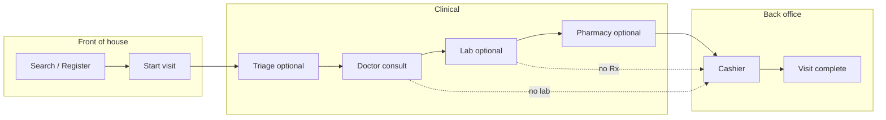
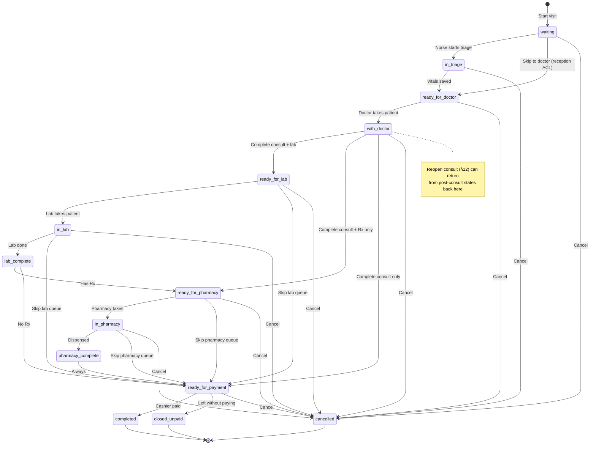
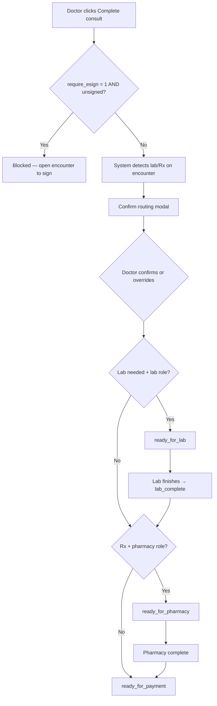
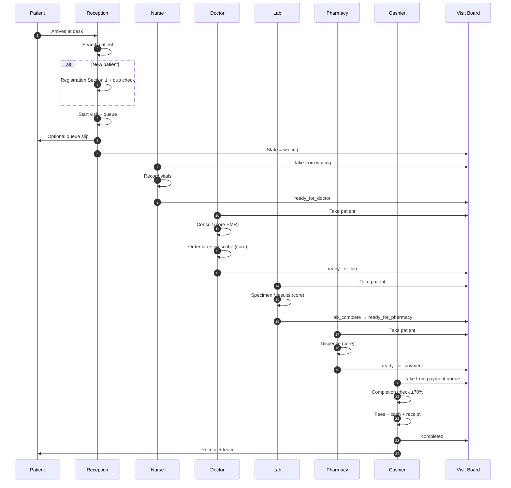
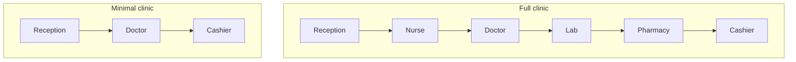
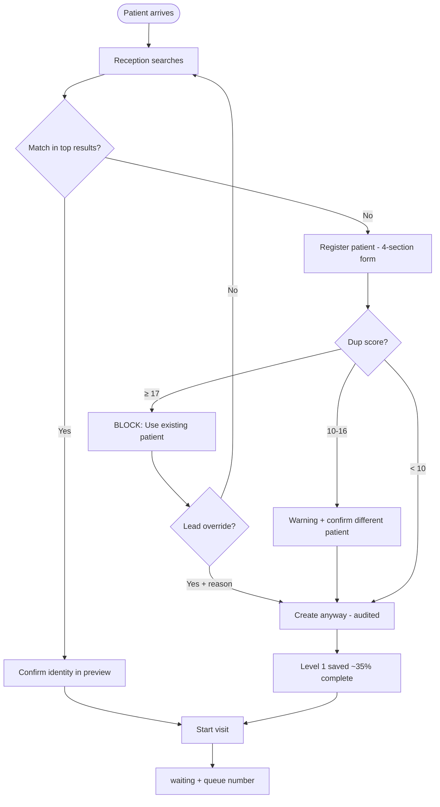
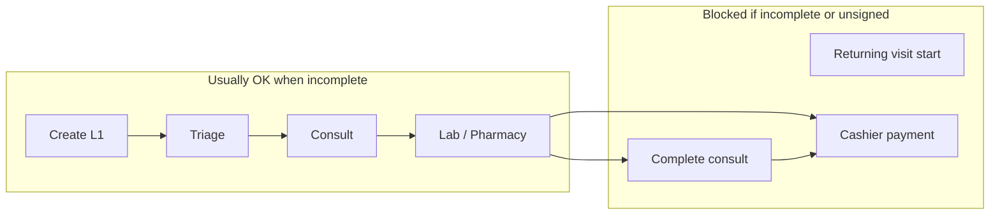
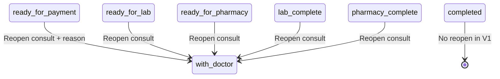
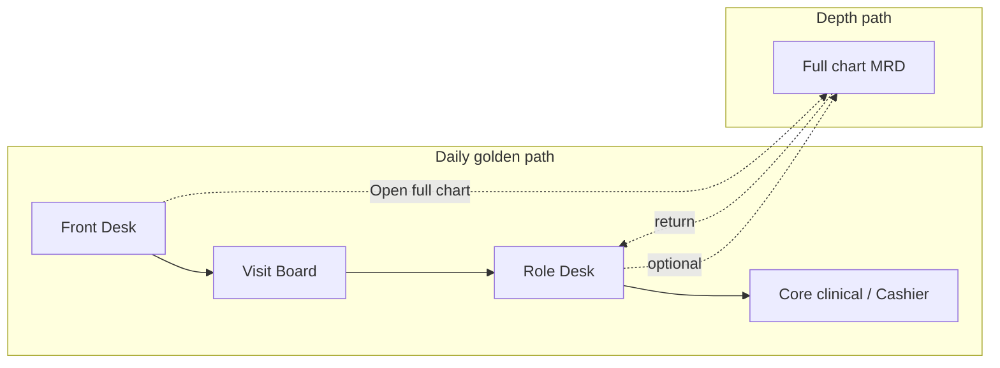

# New Clinic V1 — User Workflows Guide

| Field | Value |
|-------|--------|
| **Document version** | 1.9.50 |
| **Companion to** | [NEW_CLINIC_V1_PRD.md](./NEW_CLINIC_V1_PRD.md) (v1.20.49), [NEW_CLINIC_V1_PAGE_DESIGNS.md](./NEW_CLINIC_V1_PAGE_DESIGNS.md) (v0.6.49), [NEW_CLINIC_V1_PATIENT_REGISTRY_REDESIGN.md](./NEW_CLINIC_V1_PATIENT_REGISTRY_REDESIGN.md) (v0.2.1), [NEW_CLINIC_V1_LEGACY_CHART_CONTEXT_REDESIGN.md](./NEW_CLINIC_V1_LEGACY_CHART_CONTEXT_REDESIGN.md) (v0.1.2), [MEDICAL_RECORD_DASHBOARD_REDESIGN.md](./MEDICAL_RECORD_DASHBOARD_REDESIGN.md) (v0.2.35), [NEW_CLINIC_V1_PATIENT_DASHBOARD_B7_PRIMARY_REDESIGN.md](./NEW_CLINIC_V1_PATIENT_DASHBOARD_B7_PRIMARY_REDESIGN.md) (v0.1.1), [NEW_CLINIC_V1_PATIENT_CHART_DEPTH_REDESIGN.md](./NEW_CLINIC_V1_PATIENT_CHART_DEPTH_REDESIGN.md) (v0.1.15), [NEW_CLINIC_V1_PATIENT_REFERRALS_LETTERS_REDESIGN.md](./NEW_CLINIC_V1_PATIENT_REFERRALS_LETTERS_REDESIGN.md) (v0.1.1), [NEW_CLINIC_V1_LAB_OPERATIONS_REDESIGN.md](./NEW_CLINIC_V1_LAB_OPERATIONS_REDESIGN.md) (v0.1.8), [NEW_CLINIC_V1_PHARMACY_OPERATIONS_REDESIGN.md](./NEW_CLINIC_V1_PHARMACY_OPERATIONS_REDESIGN.md) (v0.1.8), [NEW_CLINIC_V1_BILLING_AR_BACKOFFICE_REDESIGN.md](./NEW_CLINIC_V1_BILLING_AR_BACKOFFICE_REDESIGN.md) (v0.1.3), [NEW_CLINIC_V1_SCHEDULING_REDESIGN.md](./NEW_CLINIC_V1_SCHEDULING_REDESIGN.md) (v0.2.5), [NEW_CLINIC_V1_SCHEDULING_QUEUE_BOUNDARY_REDESIGN.md](./NEW_CLINIC_V1_SCHEDULING_QUEUE_BOUNDARY_REDESIGN.md) (v0.1.2), [NEW_CLINIC_V1_COMMUNICATIONS_HUB_REDESIGN.md](./NEW_CLINIC_V1_COMMUNICATIONS_HUB_REDESIGN.md) (v1.0.3), [NEW_CLINIC_V1_FRONT_DESK_SEARCH_REDESIGN.md](./NEW_CLINIC_V1_FRONT_DESK_SEARCH_REDESIGN.md) (v1.0.7), [NEW_CLINIC_V1_ADMIN_CONFIGURATION_REDESIGN.md](./NEW_CLINIC_V1_ADMIN_CONFIGURATION_REDESIGN.md) (v0.1.3), [NEW_CLINIC_V1_REPORTING_OPERATIONS_REDESIGN.md](./NEW_CLINIC_V1_REPORTING_OPERATIONS_REDESIGN.md) (v0.1.2), [NEW_CLINIC_V1_CLINICAL_DOCUMENTATION_REDESIGN.md](./NEW_CLINIC_V1_CLINICAL_DOCUMENTATION_REDESIGN.md) (v0.1.2) |
| **Audience** | Product, clinical leads, trainers, implementers, QA |
| **Purpose** | Explain **who does what, in what order**, with visual frameworks — without implementation detail |

---

## Table of contents

1. [How to use this guide](#1-how-to-use-this-guide)
2. [The big picture (30 seconds)](#2-the-big-picture-30-seconds)
3. [Frameworks at a glance](#3-frameworks-at-a-glance)
4. [Roles and landing screens](#4-roles-and-landing-screens)
5. [Visit lifecycle — state machine](#5-visit-lifecycle--state-machine)
6. [Swimlane — full clinic day](#6-swimlane--full-clinic-day)
7. [Golden paths (config variants)](#7-golden-paths-config-variants)
8. [Role playbooks (step-by-step)](#8-role-playbooks-step-by-step)
9. [Patient registration & duplicate decision tree](#9-patient-registration--duplicate-decision-tree)
10. [Profile completion framework](#10-profile-completion-framework)
11. [Handoff matrix — who passes the patient to whom](#11-handoff-matrix--who-passes-the-patient-to-whom)
12. [Exceptions & alternate paths](#12-exceptions--alternate-paths) — [12.2 Visit Board ↔ Triage](#122-visit-board--triage-exception-matrix) · [12.2.5 Skip triage doctor](#1225-skip-triage--doctor-desk-first-action-closed)
13. [What each role does *not* do in V1](#13-what-each-role-does-not-do-in-v1)
14. [Manager & admin workflows](#14-manager--admin-workflows) — [14.4 Pilot config worksheet](#144-pilot-config-worksheet-close-q4q9) · [14.8 Day-2 admin workflows](#148-day-2-admin-workflows) · [14.9 Periodic reporting workflows](#149-periodic-reporting-workflows) · [14.10 Clinical documentation workflows](#1410-clinical-documentation-workflows) · [14.11 Queue bridge workflows](#1411-queue-bridge--scheduling-boundary-workflows)
15. [Glossary](#15-glossary)
16. [Quick reference cards](#16-quick-reference-cards)
17. [Full chart — Medical Record Dashboard](#17-full-chart--medical-record-dashboard)

---

## 1. How to use this guide

| If you need… | Go to… |
|--------------|--------|
| Day-2 admin tasks after go-live | [§14.8 Day-2 admin workflows](#148-day-2-admin-workflows) |
| Monthly / quarterly extracts & compliance | [§14.9 Periodic reporting workflows](#149-periodic-reporting-workflows) |
| Encounter documentation & form bundles | [§14.10 Clinical documentation workflows](#1410-clinical-documentation-workflows) |
| Scheduling vs visit queue exceptions | [§14.11 Queue bridge workflows](#1411-queue-bridge--scheduling-boundary-workflows) |
| A one-screen overview for stakeholders | [§2 Big picture](#2-the-big-picture-30-seconds) |
| Training material for reception | [§8.1 Reception](#81-reception--front-desk), [§8.1a Booking](#81a-booking--scheduling--flow-calendar), [§8.1b Recall outreach](#81b-recall-outreach--scheduling--flow-recalls) |
| To understand queue columns on Visit Board | [§5 State machine](#5-visit-lifecycle--state-machine) |
| Skip triage, urgent, auto-start, cancel — Visit Board + Triage | [§12.2 Exception matrix](#122-visit-board--triage-exception-matrix) |
| Per-page UI design (wireframes, components, AJAX) | [NEW_CLINIC_V1_PAGE_DESIGNS.md](./NEW_CLINIC_V1_PAGE_DESIGNS.md) |
| To see how lab/pharmacy can be turned off | [§7 Golden path variants](#7-golden-paths-config-variants) |
| Rules for incomplete patient profiles | [§10 Completion framework](#10-profile-completion-framework) |
| When to open the full patient chart (MRD) | [§17 Full chart](#17-full-chart--medical-record-dashboard) |
| **Standard vocabulary** (Start visit vs Take patient vs Sign) | [§15 Glossary](#15-glossary) |
| **When the encounter starts vs when visit is done** | [§17.0 Encounter lifecycle](#170-encounter-lifecycle--trainer-one-liner) · PRD [§6.1b](./NEW_CLINIC_V1_PRD.md#61b-encounter-lifecycle--anchor) |
| **Why doctor name is blank before Take patient** | [§17.0d Doctor on the encounter](#170d-doctor-on-the-encounter) · PRD [§6.1e](./NEW_CLINIC_V1_PRD.md#61e-doctor-on-the-encounter) |
| **Multiple visits same day** | [§17.0e Same-day visits](#170e-same-day-visits) · PRD [§6.5.0](./NEW_CLINIC_V1_PRD.md#650-same-day-visits) |
| **Complete consult vs E-Sign** | [§17.0f Signing vs handoff](#170f-signing-vs-operational-handoff) · PRD [§6.1.1](./NEW_CLINIC_V1_PRD.md#611-clinical-documentation-attestation-e-sign--non-negotiable) |
| **Signed record amendment** | [§17.0i Amendment terminology](#170i-signed-record--amendment-terminology) · PRD [§6.1l](./NEW_CLINIC_V1_PRD.md#61l-signed-record-amendment) |
| **Chief complaint on banner** | [§17.0g Chief complaint](#170g-chief-complaint) · PRD [§6.1f](./NEW_CLINIC_V1_PRD.md#61f-chief-complaint) |
| **Clinical decision at the desk (30s context)** | [§17.0h Clinical decision at the desk](#170h-clinical-decision-at-the-desk) · PRD [§6.1g](./NEW_CLINIC_V1_PRD.md#61g-clinical-decision-at-the-desk) |
| **Billing back office (post-pilot)** | [§17.0j Billing three-layer trainer](#170j-billing-back-office--trainer-one-liner) · PRD [§5.6.1](./NEW_CLINIC_V1_PRD.md#561-interim-full-chart-pilot-week-1--before-b7-mrd-ships) · [§17.4.7](./NEW_CLINIC_V1_PRD.md#1747-billing-back-office-runbook-v12-bill) |
| **Billing back office (post-pilot)** | [§17.0j Billing back office layer](#170j-billing-back-office-layer) · PRD [§5.6.1](./NEW_CLINIC_V1_PRD.md#561-interim-full-chart-pilot-week-1--before-b7-mrd-ships) · [BILLING_AR](./NEW_CLINIC_V1_BILLING_AR_BACKOFFICE_REDESIGN.md) |
| MRD layout, tabs, and zones (design) | [MEDICAL_RECORD_DASHBOARD_REDESIGN.md](./MEDICAL_RECORD_DASHBOARD_REDESIGN.md) |
| Technical/API detail | [NEW_CLINIC_V1_PRD.md](./NEW_CLINIC_V1_PRD.md) |

**Relationship to the PRD:** This document is **behavioral and visual**. The PRD holds requirements, data model, ACL keys, and OpenEMR integration. When they differ, the PRD wins.

---

## 2. The big picture (30 seconds)

A walk-in patient moves through the clinic in a **single line of work** tracked as one **visit** per day:

```text
FIND or CREATE patient → START VISIT → clinical steps → PAY CASH → DONE
```

- **One visit queue** (`new_visit`) tells every role who is waiting and for what.
- **OpenEMR encounter** is created at **Start visit** — required before vitals, labs, prescriptions, and charges. See [§17.0](#170-encounter-lifecycle--trainer-one-liner).
- **E-Sign before payment is always required** (or logged override). **E-Sign before Complete consult** only when worksheet row 10 = **Yes** (`require_esign_before_complete_consult` = 1). Pilot default row 10 = **No** — see [§17.0f](#170f-signing-vs-operational-handoff) (PRD §6.1.1, D42).
- **Cash only** at checkout; no insurance billing in daily workflows.
- **Profile can start minimal** at registration but must reach **70% completion** before payment (unless a manager overrides with a logged reason).



---

## 3. Frameworks at a glance

We use several **repeatable frameworks** so the same story can be read from different angles.

| Framework | What it answers | Section |
|-----------|-----------------|---------|
| **Role playbook** | “I am a nurse — what do I click?” | [§8](#8-role-playbooks-step-by-step) |
| **Visit state machine** | “What column is this patient in on the board?” | [§5](#5-visit-lifecycle--state-machine) |
| **Swimlane** | “Who acts when in a full clinic?” | [§6](#6-swimlane--full-clinic-day) |
| **Golden path variants** | “Our clinic has no lab — what changes?” | [§7](#7-golden-paths-config-variants) |
| **Decision tree** | “When do I create vs use existing patient?” | [§9](#9-patient-registration--duplicate-decision-tree) |
| **Completion gates** | “When is an incomplete profile allowed to proceed?” | [§10](#10-profile-completion-framework) |
| **Handoff matrix** | “Who officially ‘releases’ the patient to the next role?” | [§11](#11-handoff-matrix--who-passes-the-patient-to-whom) |
| **Exceptions catalog** | “What if they skip triage, leave unpaid, or bypass lab?” | [§12](#12-exceptions--alternate-paths) |
| **RACI (light)** | Who is Responsible vs Accountable per stage | [§11](#11-handoff-matrix--who-passes-the-patient-to-whom) |
| **Sequence diagram** | Message-style flow across roles | [§6](#6-swimlane--full-clinic-day) |

### 3.1 RACI legend (used in §11)

| Code | Meaning |
|------|---------|
| **R** | Responsible — performs the work |
| **A** | Accountable — must ensure it happens (often Doctor for clinical, Manager for cash reconciliation) |
| **C** | Consulted — may be involved (e.g. Lab reads doctor’s order) |
| **I** | Informed — sees queue updates only |

---

## 4. Roles and landing screens

| Role | Persona (PRD) | Primary screen | Also uses |
|------|---------------|----------------|-----------|
| **Reception** | Ama | Front Desk | **Scheduling & Flow** (S1), Visit Board (read), optional queue slip print, **full chart** (secondary) |
| **Nurse** | Akua | Triage | Visit Board (read), full chart (vitals depth) |
| **Doctor** | Dr. Mensah | Doctor Desk | Core encounter, lab order, Rx (deep links), full chart (depth) |
| **Lab** | Labik | Lab Desk; **Lab Operations** (post-pilot) | Core lab results (deep links) or M12 slide-over; full chart (labs tab) |
| **Pharmacy** | Esi | Pharmacy Desk; **Pharmacy Operations** (post-pilot) | Core Rx / dispense or M13 slide-over; full chart (meds tab) |
| **Cashier** | Kofi | Cashier | Receipt print, full chart (completion / balance check) |
| **Clinic admin** | Owner / IT | Clinic Admin | Fees, config, users, reconciliation, full chart |
| **Manager** | Owner | Daily Reports | Same as admin or cashier + reports, full chart |

**Login:** Staff use normal OpenEMR login, then land on their **Clinic app** (e.g. “Clinic — Reception”). Users with multiple roles pick a role each session ([PRD §4.3.1](./NEW_CLINIC_V1_PRD.md)). **Lead groups** (`new_lab_lead`, `new_pharmacy_lead`, etc.) are permission tiers — solo bench staff hold base **+** lead on one login ([PRD §4.2.1](./NEW_CLINIC_V1_PRD.md#421-staff-accounts--lead-groups-d-staff-1)).

**Shared devices:** Every screen shows the **active role** in the top bar (e.g. “Nurse — Akua”). Use **Switch role** or **Logout** before handing the device to a colleague. Payment, override, and queue-bypass actions repeat the role in the confirm dialog.

**Product name shown in UI:** **New Clinic** (menu root: **Clinic**).

---

## 5. Visit lifecycle — state machine

Every active patient visit sits in exactly **one state**. Visit Board columns map to these states (lab/pharmacy columns hidden when disabled).



### 5.1 State → role ownership

| State | Who moves the patient forward | Typical action label |
|-------|------------------------------|----------------------|
| `waiting` | Reception / Nurse | “Start triage” or **Skip to doctor** → `ready_for_doctor` |
| `in_triage` | Nurse | Save vitals → “Send to doctor” |
| `ready_for_doctor` | Doctor | **Take patient** → `with_doctor` (waiting list shows this state only) |
| `with_doctor` | Doctor | Active consult — **Complete consult** (+ confirm routing) |
| `ready_for_lab` / `in_lab` | Lab | “Take” → work → “Lab complete” |
| `ready_for_pharmacy` / `in_pharmacy` | Pharmacy | “Take” → dispense → “Pharmacy complete” |
| `ready_for_payment` | Cashier | Add charges → take cash → receipt **or** mark left unpaid |
| `completed` | — | Terminal |
| `closed_unpaid` | Cashier / manager | Terminal — patient left without paying |
| `cancelled` | Reception / Admin | Cancel with reason |

### 5.2 Doctor routing after “Complete consult”



**V1 rules:**

- **E-Sign before Complete consult** when `require_esign_before_complete_consult` = 1 (worksheet row 10 **Yes**). When **No** (pilot default), handoff allowed unsigned — **cashier payment still blocked** until signed unless override (PRD §6.1.1, D42).
- Lab/Rx flags are set when the doctor completes the consult (system checks orders on the encounter + manual toggles).
- **Confirm routing** modal pre-checks detected lab/Rx; doctor can override before the visit moves.
- System logs whether routing was **auto-detected** or **manually overridden** (for audit and QA).

**Doctor Desk queue:** the waiting list shows **`ready_for_doctor` only**. **`with_doctor`** means the doctor is actively consulting after **Take patient** — never use it for “patient waiting for doctor.”

---

## 6. Swimlane — full clinic day

End-to-end flow when **triage + in-house lab + in-house pharmacy** are all enabled.



### 6.1 Visit Board mental model

Think of Visit Board as a **Kanban wall** for today’s OPD:

| Column (typical) | Meaning for staff |
|------------------|-------------------|
| Waiting | Checked in; not yet with nurse or doctor |
| Triage | With nurse now |
| Doctor | **`ready_for_doctor`** (waiting) or **`with_doctor`** (in consult) |
| Lab | Needs lab work before pharmacy/pay |
| Pharmacy | Needs dispensing before pay |
| Payment | Ready for cashier |
| Done | Paid and closed today |

Refresh: every 30s + manual refresh (no live WebSocket in V1).

---

## 7. Golden paths (config variants)

Clinic Admin toggles reshape the path **without changing the PRD roles**.

| Variant | Config | Simplified flow |
|---------|--------|-----------------|
| **Full clinic** | Triage ON, lab ON, pharmacy ON | [§6 swimlane](#6-swimlane--full-clinic-day) |
| **Minimal** | Skip triage | Reception → `ready_for_doctor` → doctor **Take patient** → cashier |
| **No in-house lab** | `enable_lab_role` = OFF | Doctor may still order labs in EMR; patient skips lab queue → pharmacy or payment |
| **No in-house pharmacy** | `enable_pharmacy_role` = OFF | Doctor prescribes (print/external); skip pharmacy queue → payment |
| **Consult only** | No lab/Rx flags | Doctor complete → payment |
| **Lab only, no Rx** | Lab ON, pharmacy OFF | Lab complete → payment |
| **Lab-direct walk-in (V1.1-ANC)** | `enable_ancillary_services` = 1, `lab_direct` visit type | Reception **Start visit (Lab-only)** → `ready_for_lab` → lab intake → E-Sign → Lab complete → pay (§7.4) |
| **Pharmacy walk-in (V1.1-ANC)** | `enable_ancillary_services` = 1, `pharmacy_walkin` visit type | Reception **Start visit (Pharmacy)** — no OTC/Rx question → pharmacist triage → E-Sign → pay (§7.5) |
| **Pharmacy → OPD same day (V1.1-ANC)** | Pharmacy outcome `rx_required_refer_to_opd` | Close pharmacy visit → reception **Start visit (OPD)** — new encounter; one **unfinished** visit at a time (D35, D40) |



| Path | When to use |
|------|-------------|
| **Returning patient, skip triage** | Known follow-up; reception sends `waiting` → `ready_for_doctor` (needs ACL); doctor **Take patient** |
| **Walk-in urgent** | `is_urgent` flag bumps sort order on queues |
| **External lab** | No lab role; doctor orders in core; patient goes to pay after consult |

### 7.4 Lab-direct walk-in (V1.1-ANC — §6.8.4)

*Requires `enable_ancillary_services` = 1 and visit type with `service_profile = lab_direct`.*

```text
Reception: Search → Start visit (Lab-only) → ready_for_lab
    [Optional: upload referral if patient has one — not required by default (D34)]
Lab: Take patient → enter procedure order (lab lead / authorized clinician)
    → E-Sign lab intake note → Lab complete → Cashier → completed
```

### 7.5 Pharmacy walk-in (V1.1-ANC — §6.8.3)

*Requires `enable_ancillary_services` = 1 and visit type with `service_profile = pharmacy_walkin`.*

Reception starts **Pharmacy walk-in** only — **does not** ask OTC vs prescription (D33, D35).

| Pharmacist finds | Action | Patient next step |
|------------------|--------|-------------------|
| OTC / allowed without Rx | Dispense → E-Sign pharmacy service note → **Pharmacy complete** | Cashier |
| Valid external paper Rx | Scan (optional) → transcribe with **prescriber name**, **registration/ID**, **Rx date** → dispense → E-Sign → complete | Cashier |
| Rx required, no script | Record `rx_required_refer_to_opd` → close visit **without dispense** | **Reception → Start visit (OPD)** |
| Rx required, **no doctor on duty** | Record `rx_required_no_doctor_available` → close visit **without dispense**; advise return when doctor available | Patient leaves; may return later |
| Rx required, patient refuses OPD | Record `rx_required_patient_declined` → close visit | Turn away (no dispense) |

**Training one-liner:** *“Pharmacy desk decides what can be sold; reception only starts the pharmacy visit.”*

---

## 8. Role playbooks (step-by-step)

### 8.1 Reception — Front Desk

**Goal:** Find or create the patient in seconds, start the visit, give them a queue number.

**Search detail:** M1a algorithm, API, and acceptance — [FRONT_DESK_SEARCH_REDESIGN](./NEW_CLINIC_V1_FRONT_DESK_SEARCH_REDESIGN.md).

| Step | Action | System result |
|------|--------|---------------|
| 1 | Open **Front Desk** (search box focused) | — |
| 2 | Type name, phone, NHIS, ID, or pubpid | Live results (≤1.5s target) |
| 3a | **Match found** | Preview panel: allergies, completion %, last visit |
| 3b | **No match** | Click **Register patient** → 4-section registration form |
| 4 | Section 1: name, sex, phone or no-phone, estimated age | Dup check runs live on Section 1 |
| 4a | Dup score ≥ 17 | Blocked — use existing patient OR override (lead only) |
| 4b | Dup 10–16 | Warning — confirm “different patient” + note |
| 5 | Save patient (Section 1 minimum) | `updateDupScore`; completion ~35–45% |
| 6 | Choose **visit type** (OPD / Lab-only / Pharmacy walk-in when ancillary ON) | Encounter created; initial state per `service_profile` (§6.8.1) |
| 6a | Optional **Reason for visit** (≤500 char) | Saves to `new_visit.chief_complaint` — nurse triage may overwrite (M1d-F12, D45) |
| 7 | Click **Start visit** | Queue # assigned; ancillary visits skip triage/doctor when profile says so |
| 8 | Optional **Print queue slip** | Thermal slip with queue # + instructions |
| 9 | Tell patient where to wait | Lab desk / pharmacy desk / waiting area per visit type |

**Returning patient extra gate:** If profile &lt; 70% (or pediatric estimated DOB rule), **Start visit** is blocked until one of:

1. **Complete profile now** — Sections 2–4 on Front Desk registration form
2. **Manager override** — `new_revisit_skip_completion` + reason (audited)
3. **Patient fetches documents** — reception cancels or holds visit with reason “awaiting documents”; patient returns when ready

This is **not** a hard turn-away — staff pick the path that fits the situation.

**Do not:** Use stock OpenEMR patient finder for daily search (module search only).

**Do not (ancillary):** Ask whether pharmacy medicine needs a prescription — that is the pharmacist’s job (D35).

---

### 8.1a Booking — Scheduling & Flow (Calendar)

**Goal:** Book a future or same-day appointment without leaving New Clinic.

| Step | Action | System result |
|------|--------|---------------|
| 1 | Open **Scheduling & Flow** → **Calendar** tab | Shared filter bar: facility, provider, date |
| 2 | Click empty slot or **+ Book** | Booking slide-over opens |
| 3 | Search patient (module search) or pick existing | Patient context loaded |
| 4 | Choose category, duration, provider, notes | Maps to `openemr_postcalendar_events` via `AppointmentService` |
| 5 | **Save appointment** | Event appears on Calendar + Flow Board lens |
| 6 | Optional: print or tell patient date/time | — |

**Rules:** Bookings use S1 — not legacy PostCalendar UI. Reception needs `patients appt` write ACL (PRD §4.2).

---

### 8.1b Recall outreach — Scheduling & Flow (Recalls)

**Goal:** Work due recalls, book follow-up, close the loop when the patient arrives.

| Step | Action | System result |
|------|--------|---------------|
| 1 | Open **Scheduling & Flow** → **Recalls** tab | Worklist: due / overdue / upcoming / completed |
| 2 | Filter or search patient | Safe read from `medex_recalls` (no demographic writes — H1) |
| 3 | Contact patient (phone/SMS — outside system) | Staff logs outcome in recall notes if needed |
| 4 | **Book from recall** | Creates appointment; sets `produced_eid` link (S1-F06) |
| 5 | On arrival day: Front Desk → **Appointment today** chip → **Start visit & check in** | M0-F16: one encounter + `@` Arrived; recall auto-completes when guard passes (S-P5) |
| 6 | Patient joins Visit Board like any walk-in | Clinical flow unchanged (Mode 1) |

**Do not:** Use legacy Message Center Recall Board or `save_recall()` paths (H1).

---

### 8.1c Staff communications — Communications Hub

**Goal:** Triage internal patient messages and dated reminder tasks in one workspace.

**Who:** Any staff with `patients/notes` ACL (doctors, nurses, reception, admin).

| Step | Action | System result |
|------|--------|---------------|
| 1 | Open **Messages** menu or header **envelope** | Communications hub; Messages lens; Active filter |
| 2 | Scan list for unread / urgent items | Split-pane: list left, detail right |
| 3 | Click a message | Thread loads in detail without full page reload |
| 4 | **Reply** or **Mark done** | Thread appended or status → Done; leaves Active filter |
| 5 | **Compose** → pick patient + recipient(s) | One `pnotes` row per recipient |
| 6 | Switch to **Reminders** lens | 30-day due worklist with Overdue / Today / Upcoming labels |
| 7 | **Mark completed** or **Forward** | AJAX update or modal (`dated_reminders_add.php`) |
| 8 | **Create reminder** | Modal; list refreshes on close |

**Admin supervision:** Filter **All users** → open any message **read-only** (banner; no reply/delete on threads you are not party to).

**Deep links (bookmarks):**

| URL | Opens |
|-----|-------|
| `?form_active=1` | Active messages |
| `?task=edit&noteid=N` | Message N selected |
| `?task=addnew` | Compose |
| `?lens=reminders` | Reminders lens |

**Do not:**

- Use legacy **Recalls** tab for recall outreach — use **Scheduling & Flow → Recalls** (§8.1b).
- Expect **Portal Mail** here — use Portal dropdown (`onsite_mail` is separate).
- Use Message Center for cohort searches — use **Patient Registry** (§8.1d).

Full spec: [COMMUNICATIONS_HUB_REDESIGN](./NEW_CLINIC_V1_COMMUNICATIONS_HUB_REDESIGN.md).

---

### 8.1d Cohort search — Patient Registry

**Goal:** Find groups of patients matching clinical/demographic filters (e.g. adolescents with lab-confirmed malaria).

| Step | Action | System result |
|------|--------|---------------|
| 1 | Open **Clinic → Patient Registry** | Cohort filter panel + results grid |
| 2 | Set filters (age at diagnosis, condition, record status, etc.) | AND/OR query via `PatientCohortSearchService` |
| 3 | Run search | Paginated results; export CSV (cap) |
| 4 | Open patient from row | **Open MRD** or **Open full chart** — not Front Desk |

**Do not:** Use Front Desk search or legacy Finder for registry-style queries.

Full spec: [PATIENT_REGISTRY_REDESIGN](./NEW_CLINIC_V1_PATIENT_REGISTRY_REDESIGN.md).

---

### 8.2 Nurse — Triage

**Goal:** Record vitals and release patient to doctor queue.

| Step | Action | System result |
|------|--------|---------------|
| 1 | Open **Triage** queue (`waiting`, `in_triage`) | Ordered list |
| 2 | **Start triage** on patient | State → `in_triage` |
| 3 | Enter vitals (BP, pulse, temp, weight, height, SpO₂, RR, etc.) | Saved to core via encounter; out-of-range shows amber warning on form |
| 3a | Abnormal vitals (thresholds PAGE_DESIGNS §7.3.8) | **Red Vitals abnormal** chip on shared banner after save — informational, does not block Send to doctor (M3-F14) |
| 4 | Optional chief complaint | Stored on `new_visit.chief_complaint`; overwrites reception reason if different |
| 5 | **Send to doctor** | State → `ready_for_doctor` (shared pool — **no doctor selected**) |

**Nurse does not pick a doctor.** Send to doctor releases the patient to the **shared** doctor waiting queue. Any on-duty doctor may **Take patient** (see [§8.3.1](#831-multi-doctor-clinics)).

**Patient search (no visit):** When the queue is empty or a walk-in arrives at triage without reception check-in, nurse searches the patient. If no active visit today, confirm modal: *“No visit started at Front Desk. Start visit now?”* On confirm, system runs **Start visit + Start triage** atomically → `in_triage`; card appears on Visit Board in **Triage** (see [§12.2](#122-visit-board--triage-exception-matrix)).

**Empty-state hint:** If Triage queue is empty but Visit Board **Doctor** column has cards with **Skipped triage** badge, those patients bypassed nurse — not a system error.

**Completion banner:** Shown if profile incomplete — does **not** block vitals.

**Urgent patients:** Sorted to top of Triage queue (`is_urgent`); still require normal triage unless reception also used **Skip to doctor**.

---

### 8.3 Doctor — Doctor Desk

**Goal:** Consult, order labs/Rx in core EMR, optionally **E-Sign documentation** (required before Complete consult only when worksheet row 10 = Yes), complete consult and route to next queue.

| Step | Action | System result |
|------|--------|---------------|
| 1 | Open **Doctor Desk** (`ready_for_doctor`) | Today’s queue |
| 2 | **Take patient** | State → `with_doctor`; session `pid` + `encounter` **bound** to today’s visit (queue claim — encounter already existed from **Start visit**) (M4-F18) |
| 2a | If **Encounter session lost** banner | Tap **Restore encounter session** before core shortcuts (M4-F20) |
| 3 | Open **Encounter** | Pre-flight → same-tab **encounter editor**; **Back** to desk → immediate refresh (§7.4.7b–d) |
| 4 | Optional: **Lab order** | Same-tab **lab order form**; **Back** to desk |
| 5 | Optional: **Prescribe** | Same-tab **prescribing screen**; **Back** to desk |
| 5d | Optional: **Print Rx** (Type A — community pharmacy) | When `enable_rx_print` = 1: PDF in **new tab** (M4-F38); hub and inventory **not** required; paper pad still valid (D-PHARM-4) |
| 5a | Optional: **Open full chart** | **New tab** only — desk stays open (D-M4-NAV-1b) |
| 5c | Optional: **Supervisory consult** | **Supervising provider** searchable combobox on desk → confirm/change → document all advisers in SOAP (§6.1d, M4-F28) |
| 5b | **E-Sign consult documentation** (recommended always; **required before Complete consult** when row 10 = Yes) | In core encounter editor — sign SOAP/consult note; banner chip turns green **Signed** |
| 6 | **Complete consult** | When row 10 = **Yes**: blocked until step 5b. When row 10 = **No** (pilot default): handoff allowed unsigned — **cashier still blocks payment** until signed unless override |
| 6a | Review **Confirm routing** (lab / pharmacy / payment) | Override if detection wrong; logged |
| 6b | If **Results ready** badge on card (lab finished while patient still in clinic) | Review results in core lab screens; **Reopen consult** if needed before patient leaves |

**Routing after confirm:**

- Lab needed + lab role → `ready_for_lab`
- Rx + pharmacy role (and lab done or N/A) → `ready_for_pharmacy`
- Otherwise → `ready_for_payment`

**Skip lab/pharmacy queue:** From lab or pharmacy desk (or doctor if authorized), **Skip to payment** with reason when patient uses external lab, declines Rx today, or queues are overloaded (see §12).

**Reopen consult:** If patient already past consult but needs late lab/Rx → **Reopen consult** (reason required) → back to `with_doctor`. **Signed note stays locked** — use **Order lab** / **Prescribe**; manager unlock in core to edit note text (PRD §6.1l, D60).

**Do not:** Expect Rx save to be blocked on profile completion in V1.

**Do not:** Send patient to **payment** with unsigned documentation — manager override requires ACL + reason (emergency only). Complete consult **may** proceed unsigned when worksheet row 10 = **No**.

**Training one-liner:** *“Sign before pay — always. Sign before handoff — when your clinic chose Yes on worksheet row 10.”*

**Mobile / tablet (≤767px):** One-patient wizard — banner, 2×2 consult shortcuts (48px touch targets), sticky **Complete consult** bar. Core opens fullscreen; queue via sheet (PAGE_DESIGNS §7.4.14, M4-F21).

**Refresh:** Your patient’s summary updates **immediately** when you **Back** to Doctor Desk from core clinical screens. The **waiting list** refreshes every **30 seconds** (or when you take/complete a patient, or tap ⟳) — not on every tab focus (PAGE_DESIGNS §7.4.7c, M4-F22).

**Navigation:** Clinical tools (**encounter editor**, **lab order**, **prescribing**) open in the **same tab** — use **Back** to return. **Open full chart** always opens a **new tab** (D-M4-NAV-1, M4-F23).

---

### 8.3.1 Multi-doctor clinics

**Goal:** Several doctors share one OPD floor without nurse routing or hard assignment.

| Step | Who | Action | Result |
|------|-----|--------|--------|
| 1 | Nurse | **Send to doctor** | Patient joins **shared** `ready_for_doctor` pool — no provider picker |
| 2 | Reception (scheduled) | **Start visit & check in** | `assigned_provider_id` copied from appointment provider (`pc_aid`) as a **hint** only |
| 3 | Walk-in | Start visit at Front Desk | `assigned_provider_id` stays NULL until a doctor takes the patient |
| 4 | Doctor A | Doctor Desk filter **Me** | Sees unassigned walk-ins + visits hinted for Doctor A |
| 5 | Doctor B | Filter **All** | Sees entire waiting pool, including visits hinted for Doctor A |
| 6 | Any doctor | **Take patient** | `ready_for_doctor` → `with_doctor`; provider set on visit + encounter if still NULL |
| 7 | Floor | Visit Board | Optional provider filter dims non-matching Doctor-column cards |

**Rules (PRD §6.5.1, D28):**

- **No hard lock** — Dr. B may take a visit hinted for Dr. A when using filter **All** (shared pool wins).
- **Suggested provider** chip on queue cards is informational, not a reservation.
- **In use by Dr. X** tooltip when another doctor already has `with_doctor`.
- Pilot worksheet Q4 = Yes → enable `enable_multi_doctor_filters` and default Doctor Desk to **Me**.

**V1.1 advisory routing:** See [§8.3.2](#832-advisory-routing-v11).

**V1.2 optional:** [§8.3.3](#833-optional-hard-assignment-v12) hard assignment; [§8.3.4](#834-doctor-ready-notifications-v12) patient-ready notify.

**Still deferred:** per-doctor sub-queues, specialty lanes.

---

### 8.3.2 Advisory routing (V1.1)

**Principle (D29):** Routing **suggests**; **Take patient** **decides**. Shared `ready_for_doctor` pool unchanged.

| Step | Who | Action | Result |
|------|-----|--------|--------|
| 1 | Doctor | Opens Doctor Desk | **Taking patients** defaults ON; appears on on-duty roster |
| 2 | Doctor | Toggles **Taking patients** OFF | Dimmed on roster; excluded from routing math; **still** sees **All** queue and may **Take patient** |
| 3 | System | Patient enters `ready_for_doctor` | Optional: compute `routing_suggested_provider_id` (V1.1b) |
| 4 | Floor | Queue card | Chip **Routing suggests: Dr. Y**; optional **Appt: Dr. X** if appointment hint differs |
| 5 | Doctor A | Filter **Me** | Unassigned + appointment hints + routing suggestions for Doctor A |
| 6 | Doctor B | Takes visit suggested for Doctor A | **Allowed** — `take_mode` = `manual_override`; optional soft confirm if config ON |
| 7 | Reception lead | Reassign suggestion | Changes `routing_suggested_provider_id` while still `ready_for_doctor`; audit logged |

**Exception priority** (tie-break only — never blocks Take patient):

1. Urgent — top of pool for everyone; suggestion uses same fairness rules.
2. Continuity — boost last encounter provider if on-duty.
3. Appointment hint — boost `assigned_provider_id` from `pc_aid`.
4. Walk-in — fair-share among on-duty doctors with **Taking patients** ON.
5. Paused doctor — never suggested while OFF.

**Training one-liner:** *“OFF means don’t suggest patients to me — not that I can’t see the queue.”*

---

### 8.3.3 Optional hard assignment (V1.2)

*Only when `enable_hard_provider_assignment` = 1 (default OFF).*

| Step | Who | Action | Result |
|------|-----|--------|--------|
| 1 | Nurse | **Send to doctor** + **Assign doctor** | `ready_for_doctor` + `hard_assigned_provider_id` set |
| 2 | Reception | **Assign doctor** on visit card / Front Desk | Same (M1d-F08) |
| 3 | Assigned doctor | **Me** filter | Sees hard-assigned visits + unassigned pool |
| 4 | Other doctor | **Take patient** on hard-assigned visit | **Blocked** (409) unless `new_take_assigned_override` + reason |
| 5 | Lead | Reassign doctor | Updates `hard_assigned_provider_id`; audit logged |
| 6 | System | Advisory routing | **Skipped** for hard-assigned visits |

**Training one-liner:** *“Hard assign means this patient is for Dr. X — other doctors need a reason to take over.”*

When config OFF, §8.3.1 behavior is unchanged.

---

### 8.3.4 Doctor ready notifications (V1.2)

*Only when `enable_doctor_ready_notify` = 1 (default OFF).*

| Step | Event | Who gets notified |
|------|-------|-------------------|
| 1 | Patient → `ready_for_doctor` | Doctors with **Taking patients** ON who “own” the visit in **Me** semantics |
| 2 | Hard-assigned visit | **Only** `hard_assigned_provider_id` doctor |
| 3 | Advisory suggestion only | Suggested doctor (+ optional all on-duty if unassigned + config) |
| 4 | Delivery | In-app toast/badge on Doctor Desk refresh (V1.2a); optional browser push (V1.2b) |

**Rules:** One notify per visit per doctor (debounced). No SMS. Notify does **not** block Take patient. Doctors with **Taking patients** OFF receive nothing.

---

### 8.4 Lab — Lab Desk

*Only when `enable_lab_role` = ON.*

| Step | Action | System result |
|------|--------|---------------|
| 1 | Open **Lab Desk** (`ready_for_lab`, `in_lab`) | Queue of patients |
| 2 | **Take patient** | State → `in_lab`; session bound to visit encounter (M8-F03, PAGE_DESIGNS §7.5.6a) |
| 3 | Open core **procedure order / results** *or* **Enter results** (M12 slide-over when `enable_lab_ops` = 1) | Pre-flight + bind for stock path; M12 uses order id + banner |
| 4 | **Lab complete** | → `lab_complete` then auto-route to pharmacy or payment |
| 5 | Optional **Skip to payment** | Bypass lab queue with reason (authorized roles) |

*Pilot (hub OFF):* step 3 uses stock `orders_results.php` only — see PRD §5.6.1.

### 8.4b Lab Operations Hub (V1.1-LAB)

*When `enable_lab_ops` = 1 — clinic-wide bench work, not visit queue.*

| Step | Action | System result |
|------|--------|---------------|
| 1 | Open **Lab Operations** (`lab-ops/index.php`) | Pending / In progress / Send-out tabs |
| 2 | Filter **Today** + **Urgent first** | Worklist sorted per M12-F01 |
| 3 | **Mark collected** on row | `lab_ops.specimen_collect`; optional accession # |
| 4 | **Enter results** → slide-over | Type values; **Save draft** |
| 5 | Lab user with `new_lab_lead` | **Release to doctor** | Doctor Desk **Results ready** chip (M4-F11) |
| 6 | Send-out: **Print requisition** | Patient carries paper to external lab |
| 7 | Optional: **Open in Lab Desk** when patient still in queue | Hand off to M8 for visit FSM |

**Setup (once):** manager runs **Lab setup wizard** — in-house provider + [OPD starter panel CSV](./samples/opd_lab_panel_starter.csv) + fee map in M6. Runbook: [PRD §17.4.4](./NEW_CLINIC_V1_PRD.md#1744-lab-operations-checklist-v11-lab--m12-f01f06).

**Training one-liner:** *Desk for who's at the bench; ops hub for what's pending; chart for history.*

### 8.4c Pharmacy Operations Hub (V1.1-PHARM)

*When `enable_pharm_ops` = 1 — clinic-wide counter work, not visit queue.*

| Step | Action | System result |
|------|--------|---------------|
| 1 | Open **Pharmacy Operations** (`pharm-ops/index.php`) | Pending dispense / Low stock tabs — **prescription rows only** (no OTC) |
| 2 | Filter **Today** + **Urgent first** | Worklist sorted per M13-F01 |
| 3 | **Dispense** → slide-over | Confirm qty + lot; partial when short stock (M13-F14); `pharmacy_ops.dispensed`; fee auto-suggest (D-PHARM-5) |
| 4 | **Sell OTC** (toolbar) — optional | Counter sale via M13-F04; **not** listed on pending tab; reception/pharmacist may **Start visit** first |
| 5 | **Receive stock** (manager) | Purchase lot via §7.23 wizard |
| 6 | **Print Rx** when no in-house stock | Community pharmacy PDF (M13-F10) |
| 7 | Optional: **Open in Pharmacy Desk** when patient still in queue | Hand off to M9 for visit FSM |

**Setup (once):** manager runs **Pharmacy setup wizard** — warehouse + [OPD starter formulary CSV](./samples/opd_formulary_starter.csv) + fee map in M6. Runbook: [PRD §17.4.5](./NEW_CLINIC_V1_PRD.md#1745-pharmacy-operations-checklist-v11-pharm--m13-f01f07).

**Print-only clinics:** leave `enable_pharm_ops` = 0 and `inhouse_pharmacy` = 0; set `enable_rx_print` = 1; train **Print Rx** (M4-F38) and/or **Print patient Rx** (M9-F20) — runbook [PRD §17.4.6](./NEW_CLINIC_V1_PRD.md#1746-print-rx-checklist-v11-print-rx--type-a). Paper pad remains valid.

**Training one-liner:** *Desk for who's at the counter; ops hub for what's pending to dispense; chart for medication history.*

### 8.4a Lab-direct intake (V1.1)

*When visit `service_profile = lab_direct` — patient did not see a doctor in this clinic today.*

| Step | Action | System result |
|------|--------|---------------|
| 1 | Patient arrives from reception with **Direct lab** badge | Visit already in `ready_for_lab` |
| 2 | **Take patient** | State → `in_lab` |
| 3 | Review optional referral upload | **Referral on file** chip when present |
| 4 | Create **procedure order** on encounter (lab lead / authorized clinician) | ACL `new_lab_order_intake` |
| 5 | Complete **lab intake note** → **E-Sign** | Required before Lab complete (§6.8.5) |
| 6 | Process sample / enter results in core | Existing OpenEMR lab screens |
| 7 | **Lab complete** | → `ready_for_payment` → cashier |

---

### 8.5 Pharmacy — Pharmacy Desk

*Only when `enable_pharmacy_role` = ON and typically `inhouse_pharmacy`.*

| Step | Action | System result |
|------|--------|---------------|
| 1 | Open **Pharmacy Desk** | Queue |
| 2 | **Take patient** | State → `in_pharmacy`; session bound before encounter-scoped dispense (M9-F02, §7.6.6a) |
| 3 | Dispense via core **Rx / drug inventory** *or* **Dispense** (M13 slide-over when `enable_pharm_ops` = 1); **Sell OTC** (M13-F04) for counter sales without Rx row | Rx list by pid needs no bind; dispense uses preflight |
| 4 | **Pharmacy complete** | State → `ready_for_payment`; **blocked** when undispensed Rx on in-house encounter (M9-F21) unless override + reason |
| 5 | Optional **Skip to payment** | Bypass pharmacy queue with reason (authorized roles) |

*Pilot (hub OFF):* step 3 uses stock Rx edit / inventory only — see PRD §5.6.1.

### 8.5b OTC counter sale (M13-F04)

*Counter OTC without a doctor prescription — **not** on hub pending worklist.*

| Step | Action | Who | System result |
|------|--------|-----|---------------|
| 1 | **Start visit** (standard OPD or pharmacy counter) | **Reception** or **pharmacist** | `pid` + `encounter` created — ancillary OFF OK |
| 2 | Open **Pharmacy Desk** or **Pharmacy Operations** | Pharmacist | **Sell OTC** toolbar visible |
| 3 | **Sell OTC** → pick product + qty | Pharmacist | `drug_sales` row; **no** `prescriptions` row; **not** on M13-F01 worklist |
| 4 | Document allergies if dispensing (walk-in rules) or route to payment | Pharmacist | Fee line auto-suggested; cashier confirms |

**Distinct from** ancillary **Pharmacy walk-in** (§8.5a) — that path uses `service_profile = pharmacy_walkin` and pharmacist triage panel.

### 8.5a Pharmacy walk-in triage (V1.1)

*When visit `service_profile = pharmacy_walkin` — includes OTC, external Rx, and refer-to-OPD paths (§7.5).*

| Step | Action | System result |
|------|--------|---------------|
| 1 | **Take patient** from `ready_for_pharmacy` | State → `in_pharmacy` |
| 2 | Ask what the patient needs (pharmacist decides Rx vs OTC) | No reception pre-classification |
| 3a | **OTC / allowed** | Dispense → document on pharmacy service note |
| 3b | **External paper Rx** | Optional scan → transcribe with **prescriber name**, **registration/ID**, **Rx date** (all required) → allergy check → dispense; manager override only when fields unverifiable (§6.1k, M9-F15) |
| 3c | **Needs Rx, no script** | Explain; send to **reception for OPD**; close visit with `rx_required_refer_to_opd` |
| 3c2 | **Needs Rx, no doctor on duty** | Document; close with `rx_required_no_doctor_available`; advise return when doctor available |
| 3d | **Needs Rx, patient declines OPD** | Document; close with `rx_required_patient_declined` — turn away |
| 3e | **Before dispense (3a/3b)** | Document allergy or **“None known”** on chart — **Pharmacy complete** blocked until done (§6.8.7b); cross-check chip ack is **not** a substitute |
| 3f | **Allergy cross-check warning** | If chip shows class match → **Acknowledge & continue** with reason ≥10 chars (M9-F14) — still must document allergies before complete |
| 4 | **E-Sign** pharmacy service note | Required before **Pharmacy complete** |
| 5 | **Pharmacy complete** (dispense paths only) | → `ready_for_payment` |

---

### 8.6 Cashier — Cashier

**Goal:** Collect full cash, print receipt, close visit.

| Step | Action | System result |
|------|--------|---------------|
| 1 | Open **Cashier** (`ready_for_payment`) | Payment queue |
| 2 | Select patient | See charges from fee schedule; **suggested lines** pre-populated from visit type when configured (§6.8.11) |
| 3 | **Completion gate** | If score &lt; 70% (or pediatric DOB rule) → block OR manager override + reason |
| 4 | Add fee lines (consult, reg, lab, etc.) | Maps to core billing |
| 5 | Enter cash tendered | Change calculated |
| 6 | **Confirm payment** | Core AR + module receipt; **profile E-Sign** re-check via `assertProfileSigned(visit_id)` (§6.1.1); idempotent retry safe |
| 7 | Print receipt (includes queue # if configured) | Proof for patient |
| 8 | Visit → `completed` | Leaves all queues |
| 9 | **Left without paying** (if patient leaves) | → `closed_unpaid` + reason (lead cashier / manager) |
| 10 | **Close without charge** (courtesy / policy) | → `completed`, “No charge” receipt; no payment posted |

**V1 rules:** Cash only; **no partial payments at checkout** (D-BILL-2) — full visit total in one post; patient leaves owing → **Left without paying** or manager correction (M14 post-pilot); no refunds UI. Close without charge and left-unpaid require ACL + reason (audited).

**Shared device:** Top bar shows your **active role** (e.g. “Cashier”). Confirm modals for payment and overrides repeat the role so the next user knows who acted.

---

### 8.7 Visit Board — all roles (read-mostly)

| Action | Who can do it |
|--------|----------------|
| View all columns | All clinic roles (typical) |
| Move patient / cancel | Reception lead, admin (not drag-drop for nurse/doctor) |
| Click card → jump to role screen | Depends on state |
| See **URGENT** badge | All roles — `is_urgent` set at Start visit (Front Desk) |
| See **Direct lab** / **Pharmacy walk-in** badge | All roles — `service_profile` ancillary visits (§6.8.6) |
| See **Referral on file** badge | When optional referral uploaded at Start visit (D34) |
| See **Skipped triage** badge | All roles — patient sent `waiting` → `ready_for_doctor` by reception |
| Cancel visit (modal + reason) | Reception lead, admin — card leaves active columns; role desks interrupt open forms |

Cards never **silently disappear**: cancelled visits drop from active columns; skipped-triage patients appear in **Doctor**, not **Triage**. See [§12.2](#122-visit-board--triage-exception-matrix).

---

## 9. Patient registration & duplicate decision tree



### 9.1 Section 1 — Basic info (minimum to create)

Normative field list: [FRONT_DESK_REGISTRATION §5](./NEW_CLINIC_V1_FRONT_DESK_REGISTRATION_REDESIGN.md#5-section-1--basic-info).

| Field | Required |
|-------|----------|
| First + last name | Yes |
| Middle name | No |
| Sex (M / F / Unknown) | Yes |
| Phone **or** no-phone reason | Yes (one path) |
| DOB **or** estimated age | One required for create; exact DOB in Section 2 overrides |

Optional at create: national ID (dup check when present).

---

## 10. Profile completion framework

Progressive registration: **fast at the door, complete before money leaves.**

### 10.1 Four levels (weights → 100%)

Aligned with [FRONT_DESK_REGISTRATION](./NEW_CLINIC_V1_FRONT_DESK_REGISTRATION_REDESIGN.md) four-section form.

| Level | When captured | Weight | Examples |
|-------|---------------|--------|----------|
| **L1 — Identity** | Section 1 at create | 35% | Name, sex, phone, DOB/age |
| **L2 — Contact** | Section 2 (before pay) | 30% | Address, **region + district**, ID, emergency contact |
| **L3 — Clinical safety** | Section 3 (encouraged at desk) | 20% | Allergies (**incl. “none known”**), blood group |
| **L4 — Admin** | Section 4 (optional at pay) | 15% | Insurance type (NHIS/Cash), occupation |

**Payment threshold:** **70%** default — roughly L1 + L2 + at least allergies.

### 10.2 Completion banner behavior

| Score | Banner color | At cashier |
|-------|--------------|------------|
| &lt; 40% | Red | Blocked unless override |
| 40–69% | Amber | Blocked unless override |
| ≥ 70% | Green | Can pay |
| 100% | Hidden | — |

**Pediatric rule:** Age &lt; 5 with estimated DOB → exact DOB required before pay/revisit (even if score ≥ 70%).

**Override path:** Manager may use billing/revisit skip ACL with reason **“Caregiver does not know exact DOB — verify on follow-up”** — flagged on pediatric DOB follow-up report (M7).

### 10.3 Chokepoint summary



| Chokepoint | Block? | Override ACL |
|------------|--------|--------------|
| New patient create | No (if L1 valid) | — |
| Start visit (returning) | Yes if &lt; 70% | `new_revisit_skip_completion` |
| Triage / consult / lab / pharmacy | No (profile banner only) | — |
| **Complete consult** | **Yes if `require_esign_before_complete_consult` = 1** and unsigned | When config = 0: allowed unsigned; override ACL when config = 1 blocks |
| **Cashier payment** | **Yes if &lt; 70% OR unsigned documentation** | `new_billing_skip_completion` / `new_esign_skip_complete` + reason |
| Rx save | **No in V1** | — |

---

## 11. Handoff matrix — who passes the patient to whom

### 11.1 Stage handoffs

| From state | To state | Triggered by | Patient physically |
|------------|----------|--------------|-------------------|
| — | `waiting` | Reception: Start visit | Waiting area |
| `waiting` | `in_triage` | Nurse: Start triage | Triage room |
| `in_triage` | `ready_for_doctor` | Nurse: Send to doctor | Waiting for doctor |
| `ready_for_doctor` | `with_doctor` | Doctor: Take | Consult room |
| `with_doctor` | post-consult states | Doctor: Complete consult | Lab / pharmacy / cashier |
| `ready_for_payment` | `completed` | Cashier: Payment | Exit |

### 11.2 RACI by pipeline stage

| Stage | Reception | Nurse | Doctor | Lab | Pharmacy | Cashier | Admin |
|-------|-----------|-------|--------|-----|----------|---------|-------|
| Search / register | **R/A** | I | I | I | I | I | C |
| Start visit | **R/A** | R (auto) | I | I | I | I | C |
| Triage / vitals | C | **R/A** | I | I | I | I | I |
| Consult | I | C | **R/A** | I | I | I | I |
| Lab order | I | I | **R** | **R** | I | I | I |
| Lab work | I | I | C | **R/A** | I | I | I |
| Dispense | I | I | C | I | **R/A** | I | I |
| Payment | C | I | I | I | I | **R/A** | C |
| Cancel visit | **R** | I | I | I | I | I | **A** |
| Daily reconciliation | I | I | I | I | I | C | **R/A** |

---

## 12. Exceptions & alternate paths

| Situation | What happens | Who |
|-----------|--------------|-----|
| **Duplicate patient at create** | Block / warn / override | Reception |
| **Urgent walk-in** | `is_urgent` sorts higher on queues; **does not** skip triage or change state | Reception sets **Urgent** on Start visit |
| **Skip triage** | `waiting` → `ready_for_doctor`; Visit Board **Doctor** column + **Skipped triage** badge; patient never in Triage queue | Reception (ACL `new_skip_triage`); doctor **Take patient** → `with_doctor` |
| **Auto-start at triage** | Nurse confirms modal → visit created + `in_triage`; card on Visit Board **Triage** | Nurse (audited `auto_started_at_triage`) |
| **Confirm routing override** | Doctor changes auto-detected lab/Rx routing | Doctor at complete consult |
| **Skip lab/pharmacy queue** | Lab/pharmacy state → `ready_for_payment` + reason | Doctor, reception lead, admin |
| **Patient leaves without paying** | `ready_for_payment` → `closed_unpaid` | Cashier lead / manager |
| **Close without charge** | Zero fees → `completed` (no AR post) | Cashier lead / manager |
| **Late lab/Rx after consult** | Reopen consult → `with_doctor` | Doctor / admin |
| **Cancel visit** | → `cancelled` + reason; card removed from active columns; open Triage/desk forms show blocking banner | Reception / admin (`new_visit_cancel`) |
| **Completion override at pay** | Pay allowed + audit log | Manager / senior cashier |
| **Connectivity drop at checkout** | Retry same payment — no double charge | Cashier |
| **Two staff take same patient** | Second action fails — refresh | Any role |
| **Paid visit needs more charges** | Core fee sheet / admin — not New Clinic UI | Admin |
| **Completed visit** | Cannot reopen in V1 | — |
| **End-of-day open visits** | Manager EOD dashboard lists stuck visits; cancel, mark unpaid, or finish manually | Manager |
| **Shared device / wrong role** | Top bar shows active role; use **Switch role** before sensitive actions | All staff |
| **Pharmacy walk-in needs Rx** | Pharmacist closes visit → patient to reception → **Start visit (OPD)** — second encounter same day after first visit terminal (D35) | Pharmacy → Reception |
| **No doctor on duty (pharmacy)** | Pharmacist records `rx_required_no_doctor_available`; visit closes without dispense | Pharmacy |
| **Wrong visit type at reception** | While visit still in **`waiting`**: cancel (`wrong_visit_type`) → **Start visit** with correct type (§6.8.3a) | Reception lead |
| **Patient declines OPD after pharmacy** | `rx_required_patient_declined` → terminal; no dispense | Pharmacy |
| **Second visit same day** | **Allowed** (default) after first visit is **finished** — new queue # + new encounter (§6.5.0, D40) | Reception |
| **Scheduled check-in + ancillary** | **Start visit & check in** uses **`full_opd` types only** — lab/pharmacy walk-in via plain **Start visit** (§6.8.10) | Reception |
| **Concurrent second Start visit** | Blocked while first visit still **unfinished** (not terminal) | Reception |

### 12.1 Reopen consult (clinical only)



**Signed note (D60):** Reopen returns patient to doctor queue for **new orders** — consult note body remains **locked** after E-Sign. Text correction → manager **unlock in core** (Administration / stock form workflow).

### 12.4 Paid visit — note or billing correction

| Need | V1 path | Do not |
|------|---------|--------|
| Fix **locked consult note** after payment | Manager **unlock in core** → edit → **re-sign** | **Reopen consult** (blocked from `completed`) |
| Add / reverse **charges** | **Pilot:** core fee sheet / AR via M5-F10 stock link · **V1.2-BILL:** M14-F01 charge correction (when `enable_bill_ops` = 1) — Chart Depth **Add correction** or Billing hub | New Clinic queue reopen |
| New attendance same day | Reception **Start visit** (new encounter) when prior visit terminal (§6.5.0) | Reopen paid visit |

### 12.2 Visit Board ↔ Triage exception matrix

Every exception follows three rules: (1) **`VisitQueueService`** owns the state change + audit; (2) **Visit Board** reflects it with a column move or badge — never a silent disappear; (3) **active role desk** interrupts the user if they have that patient open.

**Shared queue sort** (Triage queue, Doctor Desk, Visit Board column order): `is_urgent DESC` → `queue_number ASC` → `started_at ASC`.

| Situation | Visit Board | Triage desk | Audit / ACL |
|-----------|-------------|-------------|-------------|
| **Skip triage** (returning follow-up) | Card in **Doctor** with **Skipped triage** badge; tooltip: actor, time, optional reason | Patient **not listed**; empty-state hint points to Visit Board → Doctor | `new_skip_triage`; `new_visit.state_changed` with `skip_triage=1` |
| **Urgent walk-in** | **URGENT** badge on card in current column | Same patient **sorted to top** of `waiting` / `in_triage`; normal triage flow unless reception also skips | `is_urgent=1` at Start visit; urgent alone **must not** change state |
| **No visit started** (walk-in to triage room) | No card until nurse confirms auto-start; then **Triage** column | Patient search → confirm modal → atomic **Start visit + Start triage** → `in_triage` | `new_visit.created` with `reason=auto_started_at_triage` |
| **Cancel visit** | Removed from active columns; manager may expand **Cancelled today** (optional) | Patient drops from queue; if nurse had patient open → blocking banner, vitals save disabled | `new_visit_cancel`; `new_visit.cancelled` + `cancel_reason` |
| **Concurrent start** (reception + nurse) | Whichever succeeds first wins | Loser POST → **`taken_elsewhere`** interrupt; highlight-only → poll **`claim_lost`** greys card (M0-F36) | Optimistic lock (`row_version`) / one **unfinished** visit invariant (§6.5.0) |

#### 12.2.1 Skip triage — reception steps

| Step | Action | System result |
|------|--------|---------------|
| 1 | **Start visit** (normal) | State `waiting`; card in **Waiting** |
| 2 | **Skip to doctor** (ACL) — optional reason | State `ready_for_doctor`; card moves to **Doctor** with **Skipped triage** badge |
| 3 | Tell patient to wait for doctor | Nurse Triage queue unchanged (patient absent — expected) |

When `enable_triage = OFF` (clinic config), Start visit may land directly in `ready_for_doctor` — same Visit Board placement as skip triage.

#### 12.2.2 Auto-start at triage — nurse steps

| Step | Action | System result |
|------|--------|---------------|
| 1 | Open **Triage** → **Find patient** (same search as Front Desk) | — |
| 2 | Select patient with no active visit today | Modal: *“No visit started at Front Desk. Start visit now?”* |
| 3 | Confirm | Encounter + `new_visit` created; state `in_triage`; queue # assigned; Visit Board **Triage** |
| 4 | Record vitals → **Send to doctor** | State `ready_for_doctor`; Visit Board **Doctor** |

#### 12.2.3 Cancel during active triage

| Step | Action | System result |
|------|--------|---------------|
| 1 | Reception / admin opens cancel on Visit Board or Front Desk | Reason required (enum + free text) |
| 2 | Confirm cancel | State → `cancelled` |
| 3 | Nurse still on vitals screen | Blocking banner: *“Visit cancelled by [role] — [reason]”*; save disabled; redirect to queue on dismiss |

#### 12.2.4 Acceptance checks (QA)

- [ ] Skip triage: never in Triage queue; on Visit Board **Doctor** with **Skipped triage** badge.
- [ ] Urgent only: top of Triage queue; still `waiting` → `in_triage` → `ready_for_doctor`.
- [ ] Auto-start at triage: Visit Board **Triage** within one refresh; audit `auto_started_at_triage`.
- [ ] Cancel during vitals: Triage form blocked; card gone from active columns.

#### 12.2.5 Skip triage — Doctor Desk first action (closed)

When reception **Skip to doctor** (§12.2.1) or `enable_triage = OFF` places a patient in `ready_for_doctor` **without** nurse vitals, the doctor must still see safety context on the banner (**No vitals today** amber chip) before consult. When **both** skip triage **and** no vitals apply, show full-width **No nurse vitals — record vitals or open chart** row (M4-F31, PAGE_DESIGNS §4.11.5 priority 4).

**Scan order (train):** severe allergies → allergies undocumented → pediatric DOB → no nurse vitals compound → abnormal vitals → no vitals → workflow unsigned (PAGE_DESIGNS §4.11.5).

**Normative primary banner button after Take patient:**

| Skip triage / triage OFF? | Vitals recorded today? | Doctor primary banner button | Secondary |
|---------------------------|------------------------|------------------------------|-----------|
| **Yes** | **No** | **Record vitals** — deep link to core vitals form for today’s encounter | Open encounter |
| **Yes** | Yes | **Open encounter** | Record vitals |
| **No** (normal path) | **No** | **Record vitals** — should be rare; nurse queue still owns `waiting`/`in_triage` | Send patient to triage (reception lead) |
| **No** | **Yes** | **Open encounter** | Order labs, Prescribe (Actions ▾) |

**Rules:**

1. **Record vitals** never blocks **Open encounter** in Actions ▾ — doctor may proceed if clinically appropriate; audit optional reason when vitals missing and skip-triage badge present.
2. Chief complaint may be empty — doctor captures in encounter; banner shows em dash until set.
3. QA: skip-triage card on Visit Board **Doctor** column with **Skipped triage** badge; doctor banner shows **No vitals today** until vitals saved.

### 12.0 Two modes, one clinic day (D17)

V1 builds **two systems**, but staff run **one clinic day**:

| Mode | System | When | Screen |
|------|--------|------|--------|
| **1 — Today** | Walk-in | Every patient being seen | Front Desk → **Visit Board** → desks → Cashier |
| **2 — Schedule** | Planning & arrivals | Booking, follow-up, appointment check-in | **Scheduling & Flow** (Calendar / Flow Board / Recalls) |

```text
Mode 2 (book / recall / check-in)  →  Start visit  →  Mode 1 (Visit Board)
```

**Training one-liner:** *Visit Board runs the floor. Scheduling & Flow is for booking and follow-up; when they arrive, we Start visit and they join the same queue.*

Walk-in-only clinics: admin sets `enable_scheduled_integration` OFF — Mode 2 hidden; Mode 1 unchanged.

### 12.3 Scheduled patient arrives (Calendar & Recalls coexistence)

V1 ships the full **Scheduling & Flow** system (S1 — PRD §5.5, [SCHEDULING_REDESIGN](./NEW_CLINIC_V1_SCHEDULING_REDESIGN.md)). Book on **Calendar**, work **Recalls** on the worklist, watch **appointment arrivals** on Flow Board. At the door, reception uses **Start visit & check in** (one button, one encounter — D19) → same Visit Board as walk-ins. Hidden only if admin sets `enable_scheduled_integration` OFF (walk-in-only profile).

**What reception sees (V1):**

| Cue | Where | Behaviour |
|-----|-------|-----------|
| **Appointment today** chip | Patient search result + Front Desk | Shows if the patient has a non-cancelled appointment today at this facility. Enables **Start visit & check in** (not a separate check-in step). |
| **Recall due** chip | Patient search result | Shows if the patient has a recall due. Click opens **S1 Recall Worklist** filtered to patient. |

**Scheduled arrival (V1 — atomic):**

| Step | Action | System result |
|------|--------|---------------|
| 1 | Reception finds the scheduled patient (chip shows **Appointment today**) | Visit type pre-filled from appointment category (D20); override allowed |
| 2 | Click **Start visit & check in** | M0-F16: encounter + `new_visit` + `@` Arrived in one transaction; recurring bookings skip status write |
| 3 | Patient flows through queues like any walk-in | Appointment status is never read back into visit state |

**Rules staff should know:**

- Flow Board **Check in** / status advance updates **schedule + tracker only** (Mode 2) — it does **not** add the patient to Visit Board. If a locum marks **Arrived** on Flow Board without **Start visit & check in** at Front Desk, the patient is on the schedule but **not in the clinical queue** — primary cause of **EX-01** when Queue Bridge is ON (hub OFF: still train the rule).
- A scheduled patient who never checks in is **not** a New Clinic concern — **no-shows stay on the core Calendar/Flow Board** (status `? No show`). Mark no-show in **Scheduling & Flow** only — never via Queue Bridge (**D-BRIDGE-8**).
- Cancelling on the core Calendar does **not** cancel a New Clinic visit, and vice-versa — the two are tracked separately by design.
- Recalls are created and managed in **S1 Recall Worklist** (safe write path). The chip is navigation only; legacy Recall Board is not used for daily work.

**Recurring appointments (training):** *“Recurring = clinical visit yes, calendar tick maybe — that's normal.”* After **Start visit & check in**, if the toast says the series was not marked arrived, that is expected — update Flow Board manually only if records require it (PRD §6.7.9).

**Wall display:** Waiting-room screens show **Visit Board** only (privacy mode on) — not Flow Board. *“Wall shows the clinical queue; Flow Board is for staff at the desk.”* (D22)

#### 12.3.1 Acceptance checks (QA)

- [ ] With Scheduled integration OFF: no appointment/recall chips; Scheduling & Flow menu hidden.
- [ ] Appointment chip hidden for cancelled (`x`,`%`,`*`) and deleted appointments; shown for `? No show` (patient may still walk in).
- [ ] Recall chip opens S1 Recall Worklist (not legacy Message Center); no demographic/consent writes from chip click.
- [ ] **Start visit & check in** creates exactly one encounter and marks appointment `@` Arrived once; recurring appointment is not auto-marked.
- [ ] Visit type defaults from appointment `pc_catid`; override before confirm works; no auto-charges at Start visit.

---

## 13. What each role does *not* do in V1

| Role | Out of scope |
|------|----------------|
| All | Insurance claims, EDI, ERA, eligibility |
| Reception | Full registration on stock MRD — use Front Desk registration form |
| Nurse | Diagnose or prescribe |
| Doctor | New lab UI or new e-prescribing UI (uses core) |
| Doctor | Post payment with unsigned documentation (unless manager emergency override) |
| Lab | Create lab orders (doctor only) |
| Pharmacy | Create prescriptions (doctor only) |
| Cashier | Partial pay, MoMo API, refunds UI |
| Everyone | Patient portal, telehealth, offline app |
| Clinic roles (daily) | Living on stock MRD as **primary** screen — use role desk + Visit Board instead |
| Reception | Full registration on stock MRD — use Front Desk registration form |
| Cashier | Posting payment from MRD billing widget — use Cashier screen |

---

## 14. Manager & admin workflows

### 14.1 Clinic admin (setup — once)

| Task | Screen |
|------|--------|
| Install module + ACL | Module Manager (OpenEMR) |
| Apply cash clinic profile | Clinic Admin |
| Configure visit types → calendar categories | Clinic Admin |
| Fee schedule + billing code mapping | Clinic Admin |
| Enable lab/pharmacy roles | Clinic Admin |
| Lab setup wizard + panel import (post-pilot) | Lab Operations → Setup (M12) — [PRD §17.4.4](./NEW_CLINIC_V1_PRD.md#1744-lab-operations-checklist-v11-lab--m12-f01f06) |
| Pharmacy setup wizard + formulary import (post-pilot) | Pharmacy Operations → Setup (M13) — [PRD §17.4.5](./NEW_CLINIC_V1_PRD.md#1745-pharmacy-operations-checklist-v11-pharm--m13-f01f07) |
| Queue slip + receipt text | Clinic Admin |
| Assign staff to GACL groups | **M15 People** wizard when `enable_admin_hub` = 1; else core user admin — per [PRD §4.2.1](./NEW_CLINIC_V1_PRD.md#421-staff-accounts--lead-groups-d-staff-1). Day-2+: [§14.8](#148-day-2-admin-workflows) |

See [PRD §17.4](./NEW_CLINIC_V1_PRD.md) for technical runbook.

#### 14.1.1 Staff accounts & ACL groups (D-STAFF-1)

**Principle:** Install creates **lead permission groups**; go-live creates **minimal logins**. Unknown clinic size is normal.

| Step | Who | Action |
|------|-----|--------|
| 1 | IT / admin | Module Manager → **Install ACL** (creates `new_lab_lead`, `new_pharmacy_lead`, etc.) |
| 2 | Admin | Create starter accounts (§4.2.1 table) — **not** empty lead-only logins unless split bench |
| 3 | Admin | **Solo lab/pharm:** assign `lab01` → `new_lab` **+** `new_lab_lead`; `pharm01` → `new_pharmacy` **+** `new_pharmacy_lead` |
| 4 | Admin | **Split bench later:** add `lab_tech` (`new_lab` only), `lab_lead` (`new_lab` + `new_lab_lead`) — same pattern for pharmacy |
| 5 | Trainer | Document which pattern (A/B/C) the clinic uses on training log |

**Do not** share lead and tech passwords on one bench when Pattern B is in use.

### 14.2 Manager (daily)

| Task | Screen |
|------|--------|
| End-of-day cash summary | Daily Reports |
| Visits started / completed / open | Daily Reports |
| Completion quality by user | Data quality report |
| Duplicate prevention stats | Dup events report |
| Override audit (who bypassed 70%) | Completion override report |
| **Unsigned consult documentation** | Unsigned encounters report (M7-F17) |
| AR reconciliation ok/warning | Reconciliation report + M6 |
| **Unpaid visits** (`closed_unpaid`) | M7-F14 — who left without paying at checkout (not AR aging) |
| **Billing back office** (post-pilot) | M14 — corrections, payment search, **Close day** operator tab; M7 cash/reconciliation reports **remain** (D-BILL-3) — [BILLING_AR spec](./NEW_CLINIC_V1_BILLING_AR_BACKOFFICE_REDESIGN.md); runbook PRD **§17.4.7**; acceptance **§21.1u** |
| **Outstanding / credit list** (optional) | M14-F04 when `enable_bill_ops_outstanding` = 1 — distinct from M7-F14 (D-BILL-4) |
| EOD open visits | Stuck non-terminal visits — cancel or resolve; **unsigned cross-cut** rows (`with_doctor` + unsigned, `ready_for_payment` + unsigned) — §6.4e PRD |
| Queues skipped / unpaid / pediatric DOB follow-up | Exception reports (M7-F12–F14) |
| **Ancillary services** | M7 ancillary report: profiles, pharmacy outcomes, lab-direct without referral (M7-F18) |
| **Scheduling & recalls** | M7 **Scheduling** tab: booked, arrivals, no-shows, recall funnel (PRD M7-F16) |

### 14.4 Pilot config worksheet (close Q4–Q9)

**Due 2 weeks before install** — clinical lead + owner sign-off; attach to training log (G6). Full table: [PRD §24.4](./NEW_CLINIC_V1_PRD.md#244-pilot-config-worksheet-due-2-weeks-before-install).

| Must decide | Drives |
|-------------|--------|
| **Clinic currency** | M6 **Clinic** tab — `currency_code`, `currency_symbol`, decimals, position (M6-F27, D-REG-3); cash profile ships launch default; change before go-live if not West Africa |
| In-house lab? (Q8) | `enable_lab_role`, lab desk training, **Results ready** badge |
| In-house pharmacy? (Q9) | `enable_pharmacy_role`, post-consult routing |
| Triage required? (Q5) | `enable_triage` (default **ON**) |
| Multi-doctor? (Q4) | `enable_multi_doctor_filters` = 1; Doctor Desk default **Me**; train shared pool + **All/Me** (§8.3.1). Post-pilot optional: **V1.1-RT** (`enable_doctor_roster` + `enable_advisory_routing`, §8.3.2). **V1.2:** hard assignment + notify (§8.3.3–§8.3.4) — all default **OFF** |
| eRx in pilot? (Q6) | Default **No** unless already licensed |
| Walk-in-only vs full schedule | `enable_scheduled_integration` |
| Floor map + wall screen | **Visit Board** wall only — never Flow Board |
| Ancillary walk-ins? | **V1.1-ANC** post-pilot: `enable_ancillary_services` — requires in-house lab and/or pharmacy |
| High-complexity lab panels need referral? | M6 `referral_required` on listed panels (worksheet row 9) |
| **Require E-Sign before Complete consult?** | Worksheet row 10 → `require_esign_before_complete_consult`. **Default No** for pilot; **Yes** recommended at go-live. Cashier payment gate applies either way unless override |
| **Billing back office post-pilot?** | Worksheet row 11 → `enable_bill_ops` (default **No**); train §17.0j + PRD §17.4.7 when enabled |

**Post-pilot slices (PRD §20.1, D36):** After V1 pilot, features ship as **separate releases** — **V1.1-ANC** (lab/pharmacy walk-in), **V1.1-PRINT-RX** (community-pharmacy Rx PDF), **V1.1-LAB** (lab ops hub), **V1.1-PHARM** (pharmacy ops hub), **V1.1-CD** (chart depth), **V1.1-RT** (doctor roster + routing hints), **V1.2-BILL** (billing back office), **V1.1-OPS** (MoMo label, analytics, etc.). Turning on one **does not** require turning on the others.

**1-hour workshop:** floor map → triage policy → lab/pharmacy in-house vs external → sign worksheet → M6 config snapshot.

### 14.5 Lab operations setup (V1.1-LAB — post-pilot)

**When:** After pilot stabilizes and clinic enables in-house bench beyond queue-only M8.

| Step | Who | Action |
|------|-----|--------|
| 1 | Manager | Set `enable_lab_ops` = 1 in M6 (requires `enable_lab_role` = 1) |
| 2 | Manager / IT | Run [PRD §17.4.4](./NEW_CLINIC_V1_PRD.md#1744-lab-operations-checklist-v11-lab--m12-f01f06) on staging |
| 3 | Manager | M12 **Setup wizard**: In-house or Hybrid → create clinic lab provider |
| 4 | Manager | Import [OPD Basic starter panel](./samples/opd_lab_panel_starter.csv) |
| 5 | Manager | Map each test to clinic-currency fee line in M6 |
| 6 | Lab user (`new_lab` + `new_lab_lead` on solo bench) | Smoke test: order → enter results → release → doctor **Results ready** |
| 7 | Trainer | Deliver §8.4b + 15 min hands-on (PRD §17.2 lab row) |
| 8 | IT (optional V1.2) | DORN + HL7 only after manual path verified 2 weeks |

**Do not** enable `enable_lab_lis` on day one — manual entry and paper send-out first.

**Doctor ordering:** Until **V1.1-LAB-ORD**, doctors keep the standard lab order form; panel quick order ships after the hub is stable (D-LAB-2).

### 14.6 Pharmacy operations setup (V1.1-PHARM — post-pilot)

**When:** After pilot stabilizes and clinic runs in-house dispensary beyond queue-only M9.

| Step | Who | Action |
|------|-----|--------|
| 1 | Manager | Set `enable_pharm_ops` = 1 in M6 (requires `enable_pharmacy_role` = 1 and `inhouse_pharmacy` ≠ 0) |
| 2 | Manager / IT | Run [PRD §17.4.5](./NEW_CLINIC_V1_PRD.md#1745-pharmacy-operations-checklist-v11-pharm--m13-f01f07) on staging |
| 3 | Manager | M13 **Setup wizard**: warehouse + import [OPD starter formulary CSV](./samples/opd_formulary_starter.csv) |
| 4 | Manager | Map each drug template to clinic-currency fee line in M6; set `gbl_min_max_months` OFF (M6-F26) |
| 5 | Pharmacy user (`new_pharmacy` + `new_pharmacy_lead` on solo bench) | Smoke test: Rx → dispense slide-over → `drug_sales` row → cashier fee; **Pharmacy complete** blocked when undispensed (M9-F21) |
| 6 | Pharmacy user | **Sell OTC** from desk — verify not on hub pending tab (M13-F04); reception **Start visit** OK |
| 7 | Pharmacy user (`new_pharmacy_lead` for receive) | Receive test lot — verify QOH increases |
| 8 | Trainer | Deliver §8.4c + §8.5b + 15 min hands-on (PRD §17.2 pharmacy row) |

**Print-only path:** use **§14.7** instead of steps 1–7 below.

**Doctor prescribing:** Until **V1.2-PHARM-RX**, doctors keep standard Rx form; formulary favorites ship after hub stable (D-PHARM-2).

### 14.7 Print Rx setup (V1.1-PRINT-RX — Type A)

**When:** Clinic sends patients to community pharmacy — **no** in-house dispensary. Common regional pattern: doctor uses paper pad; system print is optional.

| Step | Who | Action |
|------|-----|--------|
| 1 | Manager | Confirm `inhouse_pharmacy` = 0 and `enable_pharm_ops` = 0 |
| 2 | Manager | Set `enable_rx_print` = 1 in M6 (cash clinic profile default) |
| 3 | Manager / IT | Run [PRD §17.4.6](./NEW_CLINIC_V1_PRD.md#1746-print-rx-checklist-v11-print-rx--type-a) on staging |
| 4 | Doctor | Document Rx → **Print Rx** (M4-F38) — verify PDF fields |
| 5 | Trainer | Explain: paper pad OK; system print for chart + reprint; patient buys outside |

**If pharmacy role ON (print-only desk):** also train M9 **Print patient Rx** (M9-F20) — same PDF backend.

### 14.8 Day-2 admin workflows

**When:** After pilot go-live — ongoing tasks **not** covered by install runbook [PRD §17.4](./NEW_CLINIC_V1_PRD.md#174-module-manager-runbook) or worksheet [§14.4](./NEW_CLINIC_V1_USER_WORKFLOWS.md#144-pilot-config-worksheet-close-q4q9). Normative index: [PRD §17.4.8](./NEW_CLINIC_V1_PRD.md#1748-day-2-admin-runbook-m15) · [ADMIN_CONFIGURATION §14](./NEW_CLINIC_V1_ADMIN_CONFIGURATION_REDESIGN.md#14-day-2-admin-runbook-operational). In-product: M15 **Runbooks** lens when `enable_admin_hub` = 1; until then use this section as printed runbook.

**Training one-liner:** *Install week = worksheet + §17.4. Day 2+ = this section.*

#### 14.8.1 Day 2 — owner morning checklist (~15 min)

| Step | Who | Action | Screen |
|------|-----|--------|--------|
| 1 | Owner / IT | Confirm backup ran (or run manual backup) | Admin Hub **System** or stock Backup — RB-01 |
| 2 | Owner | Run reconciliation for yesterday; review delta | M6 **Run reconciliation** or M7 Reports — RB-02 |
| 3 | Manager | Review EOD widgets: open visits, unsigned docs | M7 Daily Reports — RB-03 |
| 4 | Manager | Spot-check cash total vs physical drawer (if applicable) | M7 cash summary |

#### 14.8.2 Staff lifecycle (ongoing)

| Task | Runbook | Who | Steps (summary) |
|------|---------|-----|-----------------|
| New receptionist | RB-05 | Owner | People → **Add staff** → Reception template → verify Front Desk login |
| Locum doctor | RB-06 | Owner | Doctor template; add license #; **do not** assign Administrators |
| Staff left | RB-07 | Owner | Deactivate user — never delete |
| Forgot password | RB-08 | Owner | People → Reset password |

Full RB-05 steps: [ADMIN_CONFIGURATION §14.2](./NEW_CLINIC_V1_ADMIN_CONFIGURATION_REDESIGN.md#142-rb-05--add-new-receptionist-canonical).

**Ghana note:** Document Pattern A/B/C from [§14.1.1](./NEW_CLINIC_V1_USER_WORKFLOWS.md#1411-staff-accounts--acl-groups-d-staff-1) on training log when bench staffing changes.

#### 14.8.3 Fees & commercial (monthly / year-end)

| Task | Runbook | Who | Steps |
|------|---------|-----|-------|
| Update consultation price | RB-09 | Owner | M6 **Fees** → edit price → tell front desk before save |
| New service line | RB-10 | Owner | M6 Fees → add row → map `billing_code` for cashier |

**West Africa note:** Announce price changes to reception **before** saving — open visits keep prior quoted amounts.

#### 14.8.4 Clinical & chart corrections (as needed)

| Task | Runbook | Who | Key rule |
|------|---------|-----|----------|
| Fix signed consult note text | RB-11 | Manager | **Reopen consult** does **not** unlock note — use core form unlock |
| Merge duplicate patients | RB-12 | Admin | Stock **Manage Duplicates** — Advanced link |
| Paid visit wrong charge | — | Manager | M14 correction when `enable_bill_ops` = 1; else fee sheet |

Trainer drill: [PRD §17.2.4](./NEW_CLINIC_V1_PRD.md#1724-documentation-integrity-drill-5-min--61l) documentation integrity.

#### 14.8.5 Post-pilot feature enablement

| When ready | Runbook | Checklist |
|------------|---------|-----------|
| Lab bench beyond queue | RB-13 | [PRD §17.4.4](./NEW_CLINIC_V1_PRD.md#1744-lab-operations-checklist-v11-lab--m12-f01f06) + [§14.5](./NEW_CLINIC_V1_USER_WORKFLOWS.md#145-lab-operations-setup-v11-lab--post-pilot) |
| Dispensary beyond queue | RB-14 | [PRD §17.4.5](./NEW_CLINIC_V1_PRD.md#1745-pharmacy-operations-checklist-v11-pharm--m13-f01f07) + [§14.6](./NEW_CLINIC_V1_USER_WORKFLOWS.md#146-pharmacy-operations-setup-v11-pharm--post-pilot) |
| Billing back office | RB-15 | [PRD §17.4.7](./NEW_CLINIC_V1_PRD.md#1747-billing-back-office-runbook-v12-bill) + [§17.0j](./NEW_CLINIC_V1_USER_WORKFLOWS.md#170j-billing-back-office--trainer-one-liner) |

#### 14.8.6 Quarterly governance

| Task | Runbook | Owner |
|------|---------|-------|
| Review who has admin / lead access | RB-17 | Owner |
| Review completion overrides | RB-16 | Manager |
| Optional restore test from backup | RB-01 (extended) | IT |
| Module upgrade | RB-20 | IT — Module Manager **Upgrade SQL** |

#### 14.8.7 Runbook quick-reference table

| ID | Frequency | One-line |
|----|-----------|----------|
| RB-01 | Weekly | Verify backup |
| RB-02 | Daily (manager) | Reconcile yesterday |
| RB-03 | Daily | Review open / unsigned visits |
| RB-05 | As needed | Add staff with template |
| RB-07 | As needed | Deactivate leaver |
| RB-09 | Monthly+ | Update fees |
| RB-11 | Rare | Unlock signed note (manager) |
| RB-16 | Monthly | Audit overrides in M7 |

Full list RB-01–RB-20: [ADMIN_CONFIGURATION §14.1](./NEW_CLINIC_V1_ADMIN_CONFIGURATION_REDESIGN.md#141-runbook-index).

### 14.9 Periodic reporting workflows

**When:** After **M7 P0** for daily close; after **V1.1-REP** (`enable_report_hub` = 1) for monthly/quarterly extracts. Normative spec: [REPORTING_OPERATIONS](./NEW_CLINIC_V1_REPORTING_OPERATIONS_REDESIGN.md) · PRD [§17.4.9](./NEW_CLINIC_V1_PRD.md#1749-day-2-reporting-runbook-m16) · PAGE_DESIGNS [§7.10](./NEW_CLINIC_V1_PAGE_DESIGNS.md#710-reportsphp--daily-reports) + [§7.29](./NEW_CLINIC_V1_PAGE_DESIGNS.md#729-report-hubindexphp--reporting-operations-hub).

**Training one-liner:** *Daily Reports for tonight's close; Reporting Hub for monthly extracts and inspection binders.*

#### 14.9.1 Daily close (every clinic day — M7) — **RR-01**, **RR-02**

| Step | Who | Action | Runbook |
|------|-----|--------|---------|
| 1 | Manager | Open **Daily Reports** — review cash + visit throughput | RR-01 |
| 2 | Manager | **EOD open** tab — resolve stuck visits or document why open | RR-01 |
| 3 | Manager | **Reconciliation** — run if not scheduled; explain any delta | RR-01 |
| 4 | Manager | **Unsigned** tab — chase doctors before next morning (G10) | RR-02 |

Pilot: stock **Reports** menu may still be visible until hub ships — ignore US insurance/CQM entries.

#### 14.9.2 Monthly manager pack (M16 — when hub ON) — **RR-04**–**RR-07**

| Step | Who | Action | Lens | Runbook |
|------|-----|--------|------|---------|
| 1 | Manager | Export immunization list for EPI review | Clinical | RR-04 |
| 2 | Pharmacy lead | Export destroyed / expired drugs log | Pharmacy | RR-05 |
| 3 | Manager | Receipt analytics for month vs M7 daily totals | Financial | RR-06 |
| 4 | Manager | Review override audit sample | Audit → M7-F08 | RR-03 |
| 5 | Clinical lead | OPD attendance template (`ghana_v1` pack) | Public health | RR-07 |

#### 14.9.3 District / inspection visit (Ghana context) — **RR-09**

| Step | Who | Action |
|------|-----|--------|
| 1 | Owner | Print destroyed drugs + immunization exports from hub |
| 2 | Clinical lead | OPD attendance template from Public health lens (pilot-validated `ghana_v1` pack — **D-REP-5**) |
| 3 | Owner | Show M7 reconciliation history as cash integrity evidence |

#### 14.9.4 Enable report hub (post-pilot) — **RR-10**

Follow PRD §17.4.9 checklist: M7 stable → REP-1–REP-8 on staging → `enable_report_hub` = 1 → train RR-04–RR-07.

#### 14.9.5 Large exports — **RR-11**

When export exceeds **5000** rows (**D-REP-4**), confirm background job and wait for **Export ready** notification before downloading.

DHIMS2 electronic submit remains **V2.2** (NG8) — paper exports satisfy most private-clinic inspections in V1.

### 14.10 Clinical documentation workflows

**When:** V1 pilot uses **M4 shortcuts** + stock `encounter_top.php`; after **V1.1-DOC** (`enable_clinical_doc_hub` = 1) doctors use the **Clinical Documentation Hub**. Normative spec: [CLINICAL_DOCUMENTATION](./NEW_CLINIC_V1_CLINICAL_DOCUMENTATION_REDESIGN.md) · PRD [§17.4.10](./NEW_CLINIC_V1_PRD.md#17410-day-2-clinical-documentation-runbook-m17) · PAGE_DESIGNS [§7.30](./NEW_CLINIC_V1_PAGE_DESIGNS.md#730-clinical-docindexphp--clinical-documentation-hub).

**Training one-liner:** *Doctor Desk for who you're seeing; documentation hub for what to write; chart for what was written before.*

#### 14.10.1 Daily consult (doctor — V1 pilot)

| Step | Who | Action |
|------|-----|--------|
| 1 | Doctor | **Take patient** from Doctor Desk |
| 2 | Doctor | **Open encounter** → stock SOAP (or configured `consult_note_formdir`) |
| 3 | Doctor | Document consult; **Order lab** / **Prescribe** via shortcuts as needed |
| 4 | Doctor | **Sign** consult note before patient pays (G10) |
| 5 | Doctor | **Complete consult** → lab / pharmacy / cashier per routing |

#### 14.10.2 Daily consult (doctor — hub ON)

| Step | Who | Action | Runbook |
|------|-----|--------|---------|
| 1 | Doctor | **Take patient** | — |
| 2 | Doctor | **Open encounter** → M17 **This visit** tab (one tap — D-FORM-8) | DR-06 |
| 3 | Doctor | **Consult** lens → **Continue editing** on consult card | — |
| 4 | Doctor | **Orders** lens for lab/Rx; **Nursing** lens to review vitals | — |
| 5 | Doctor | **Sign** from hub header or consult card | DR-03 / RR-02 |
| 6 | Doctor | **Back to Doctor Desk** → **Complete consult** | §12.2 |

#### 14.10.3 Nurse triage + documentation

| Step | Who | Action |
|------|-----|--------|
| 1 | Nurse | Record **vitals** on Triage (M3) — primary path |
| 2 | Nurse | (Hub ON) Open **Nursing** lens for instructions — no billing forms visible |
| 3 | Nurse | Doctor reviews vitals chip on hub **Nursing** lens |

#### 14.10.4 Go-live & post-pilot enablement

| Step | Who | Action | Runbook |
|------|-----|--------|---------|
| 1 | Clinical lead | Confirm consult formdir + E-Sign test encounter | DR-01 |
| 2 | Clinical lead | Optional: import Ghana OPD LBF pack | DR-02 |
| 3 | Manager | After M4 stable ≥2 weeks: run DOC-1–DOC-8 on staging | DR-05 |
| 4 | Owner | Set `enable_clinical_doc_hub` = 1; train staff | DR-05, DR-06 |
| 5 | Manager | Monthly: confirm no `fee_sheet` on consult path | DR-04 |

#### 14.10.5 Signed note correction

Follow **DR-08** / M15 §11.5 — manager unlock via stock encounter admin; **do not** use Reopen consult to rewrite locked note (PRD §6.1l).

### 14.11 Queue bridge & scheduling boundary workflows

**When:** V1 pilot trains on **two boards** (Visit Board + Scheduling & Flow) using **Start visit & check in**; after **V1.1-BRIDGE** (`enable_queue_bridge` = 1) reception lead and manager use the **Queue Bridge Hub** for mismatches. Normative spec: [SCHEDULING_QUEUE_BOUNDARY](./NEW_CLINIC_V1_SCHEDULING_QUEUE_BOUNDARY_REDESIGN.md) · PRD [§17.4.11](./NEW_CLINIC_V1_PRD.md#17411-day-2-queue-bridge-runbook-m18) · PAGE_DESIGNS [§7.31](./NEW_CLINIC_V1_PAGE_DESIGNS.md#731-queue-bridgeindexphp--queue-bridge-hub).

**Training one-liner:** *Schedule for planning; Visit Board for treating; one button connects them — the exception list catches mistakes.*

#### 14.11.1 Reception — scheduled arrival (pilot + hub OFF)

| Step | Who | Action |
|------|-----|--------|
| 1 | Reception | Patient search → **Appointment today** chip visible |
| 2 | Reception | Tap **Start visit & check in** (not plain Start visit) |
| 3 | Reception | Patient appears on **Visit Board** — nurse/doctor can see them |
| 4 | Reception | If recurring toast appears — **expected**; do not panic (§6.7.9) |

#### 14.11.2 Reception — fix mistake (hub ON)

| Step | Who | Action | Runbook |
|------|-----|--------|---------|
| 1 | Reception lead | Open **Queue Bridge** or M7 **View exceptions** | SQ-03 |
| 2 | Reception lead | EX-01 row → **Start visit & check in** | SQ-02 |
| 3 | Reception lead | EX-03 walk-in OK → **Dismiss** with reason (reception_lead ACL) | SQ-03 |
| 4 | Reception lead | EX-07 ancillary dismiss when intentional (reception_lead ACL) | SQ-03 |
| 5 | Manager | EX-04 recurring → **Dismiss** on informational tab (admin ACL) | SQ-04 |
| 6 | Reception lead | Verify patient on Visit Board | — |

#### 14.11.3 Manager — end of day

| Step | Who | Action | Runbook |
|------|-----|--------|---------|
| 1 | Manager | Daily Reports → **Scheduling** tab — review funnel (do not add to visit counts) | SQ-04 |
| 2 | Manager | **View exceptions** — zero **action required** OR each documented | SQ-04, SQ-05 |
| 3 | Manager | Export boundary sweep CSV for log | SQ-05 |
| 4 | Manager | Optional strict: `queue_bridge_eod_block` warns if EX-01 open | SQ-08 |

#### 14.11.4 Go-live enablement (post-pilot)

| Step | Who | Action | Runbook |
|------|-----|--------|---------|
| 1 | Manager | S1-P2 + M0-F16 stable ≥2 weeks on staging | SQ-06 |
| 2 | Manager | Run BRIDGE-1–BRIDGE-7 on staging | SQ-06 |
| 3 | Owner | Set `enable_queue_bridge` = 1; train locum card | SQ-01, SQ-07 |
| 4 | Reception lead | Weekend drill — wrong button → EX-01 → fix | SQ-07 |

### 14.3 Training time (pilot)

| Clinic type | Instruction time |
|-------------|------------------|
| Full (all roles + S1) | ~8h instruction + practice (**≤10h total**) |
| **Two-board boundary drill** (reception + manager when S1 ON) | **10 min** plenary — **Start visit & check in** vs plain Start; locum card (SQ-01) |
| Minimal (no lab/pharmacy) | ~5.75h instruction + practice |
| Walk-in-only (integration OFF) | ~6.5h instruction (no Scheduling & Flow row) |
| **Wrong patient drill (all roles — G12)** | **5 min** plenary + **5 min** per enabled clinical role — [PRD §17.2.2](./NEW_CLINIC_V1_PRD.md#1722-wrong-patient-prevention-drill-5-min--g12) (included in ≤10h budget) |
| **Medication safety drill** (doctor and/or pharmacy enabled) | **5 min** plenary + **5 min** per nurse/doctor/pharmacy station — [PRD §17.2.3](./NEW_CLINIC_V1_PRD.md#1723-medication-safety-drill-5-min--61k) (included in ≤10h budget) |
| **Documentation integrity drill** (doctor enabled) | **5 min** plenary + **5 min** doctor/manager station — [PRD §17.2.4](./NEW_CLINIC_V1_PRD.md#1724-documentation-integrity-drill-5-min--61l) (included in ≤10h budget) |

**Before pilot week 1 live patients:** trainer runs **§17.2.2** drill + [PRD §17.4.3](./NEW_CLINIC_V1_PRD.md#1743-wrong-patient-prevention-checklist-pilot-week-1--g12) manual script **M1–M6** on staging; attach signed **G12 worksheet** to training log. When pharmacy or doctor Prescribe enabled, also run **§17.2.3** and attach **medication safety worksheet**. When doctor shortcuts enabled, run **§17.2.4** and attach **documentation integrity worksheet**.

---

## 15. Glossary

### 15.1 Standard vocabulary (use these words on the floor)

Train staff to use these terms consistently — overloaded words cause most encounter confusion.

| Term | Meaning | Common mistake |
|------|---------|----------------|
| **Start visit** | Reception (or triage auto-start) creates **clinical encounter** + **queue row** | Saying “doctor started the visit” |
| **Take patient** | Doctor/lab/pharmacy **claims** patient in queue — **does not** create encounter | Thinking Take patient opens a new file |
| **Open encounter** | Open core **encounter editor** for today’s visit (after session bind) | Confusing with Start visit |
| **Complete consult** | Doctor **releases** patient to lab / pharmacy / cashier queue — not payment | Saying “visit is done” |
| **E-Sign / Sign documentation** | Provider **attests** consult note in core — separate from Complete consult unless worksheet row 10 ON | Saying “signed = paid” |
| **Signature amendment note** | Optional comment typed **on the sign dialog** — stored in signature log | Calling it “editing the chart” |
| **Clinical correction** | Changing **locked note text** after sign — manager unlock in core | Using **Reopen consult** to rewrite SOAP |
| **Visit is done** | Cashier posted payment (or authorized close) — terminal queue state | Saying Complete consult = done |

**Desk vs chart vs depth vs lab ops vs pharm ops vs billing:** *“Desk answers **what next?** Chart answers **what happened before?** Depth panels answer **money, letters, and exports.** Lab ops answers **what's still pending at the bench?** Pharm ops answers **what's still pending at the counter?** Billing back office answers **what needs correcting or closing after checkout?**”* — [§17.0h](./NEW_CLINIC_V1_USER_WORKFLOWS.md#170h-clinical-decision-at-the-desk) · [§17.0j](./NEW_CLINIC_V1_USER_WORKFLOWS.md#170j-billing-back-office--trainer-one-liner) • [LAB_OPERATIONS](./NEW_CLINIC_V1_LAB_OPERATIONS_REDESIGN.md) • [PHARMACY_OPERATIONS](./NEW_CLINIC_V1_PHARMACY_OPERATIONS_REDESIGN.md) • [BILLING_AR](./NEW_CLINIC_V1_BILLING_AR_BACKOFFICE_REDESIGN.md) • PRD [§5.6.1](./NEW_CLINIC_V1_PRD.md#561-interim-full-chart-pilot-week-1--before-b7-mrd-ships).

**Trainer poster:** [§17.0](#170-encounter-lifecycle--trainer-one-liner) · PRD [§6.1b](./NEW_CLINIC_V1_PRD.md#61b-encounter-lifecycle--anchor).

### 15.2 Full glossary

| Term | Meaning |
|------|---------|
| **Visit** | One OPD attendance today — tracked in `new_visit` (queue + payment state) |
| **Encounter** | OpenEMR clinical record for **this** attendance — created at **Start visit**, before doctor **Take patient** |
| **Take patient** | Doctor, lab, or pharmacy **claims** patient in queue — **does not** create encounter; binds session before core screens (lab/pharmacy/doctor) |
| **Queue number** | Daily ticket # for patient (reception slip + receipt) |
| **Visit Board** | Kanban view of today’s visits by state |
| **Registration form** | Four-section desk capture (M1b) — [FRONT_DESK_REGISTRATION](./NEW_CLINIC_V1_FRONT_DESK_REGISTRATION_REDESIGN.md) |
| **Completion %** | 0–100 profile completeness score |
| **Chokepoint** | Step that blocks if profile too incomplete |
| **Golden path** | Happy-path sequence with no errors |
| **Flow Board** | Core OpenEMR appointment tracker — separate from New Clinic queue |
| **Confirm routing** | Doctor review step after **Complete consult** click — lab / pharmacy / payment; may show unsigned warning when worksheet row 10 = No |
| **E-Sign** | Core provider attestation on profile-appropriate documentation — **always required before payment** (`assertProfileSigned`); before Complete consult **only when** worksheet row 10 = Yes (§6.1.1, D42) |
| **Signature amendment note** | Optional text on E-Sign dialog — audit comment on sign event (`esign_signatures.amendment`) — **not** chart body edit (§6.1l) |
| **Clinical correction** | Edit locked encounter form in core after manager unlock — then re-sign |
| **Reopen consult** | Queue reversal for **late lab/Rx** — does **not** unlock signed note (D60) |
| **`esign_override`** | Manager bypasses **unsigned** documentation gate — **not** proof of chart correction |
| **Closed unpaid** | Terminal visit state — patient left without paying |
| **Skip to payment** | Bypass in-house lab or pharmacy queue with audited reason |
| **Skip to doctor** | Reception action: `waiting` → `ready_for_doctor` without triage (ACL `new_skip_triage`) |
| **Send to doctor** | Nurse action: `in_triage` → shared `ready_for_doctor` pool — **no doctor picker** (§8.3.1) |
| **Chief complaint** | Optional text on **`new_visit.chief_complaint`** — reception at Start visit (M1d-F12) or nurse at triage; banner source; doctor may elaborate in note (§6.1f, D43, D45) |
| **Assigned provider** | Soft hint (`assigned_provider_id`) from appointment or Take patient — not a hard lock in V1 |
| **Shared doctor pool** | All `ready_for_doctor` visits visible to any doctor (filter **All**); **Me** narrows view |
| **Auto-start at triage** | Nurse-initiated visit when reception did not Start visit — confirm modal + audit |
| **Full chart (MRD)** | Redesigned OpenEMR patient summary (`demographics.php`) — depth on demand, not daily driver |
| **Safety strip** | Always-visible allergies / problems / meds / alerts row on full chart |
| **Service profile** | Visit type intent: `full_opd`, `lab_direct`, or `pharmacy_walkin` — sets which stages are skipped (§6.8.1) |
| **Lab-direct** | Walk-in lab path — skips triage and doctor; encounter + E-Sign lab intake still required |
| **Pharmacy walk-in** | Single pharmacy queue; pharmacist decides OTC vs Rx vs refer to OPD (D35) |
| **V1.1-ANC / RT / OPS** | Post-pilot release slices — ancillary, routing, and ops polish ship **independently** (PRD §20.1, D36) |

---

## 16. Quick reference cards

Print-friendly one-liners per role.

### Reception

```text
SEARCH → (Registration form if new) → PICK VISIT TYPE → (optional reason for visit) → START VISIT → PRINT SLIP → tell patient where to wait
(Do not ask OTC vs Rx — pharmacy desk decides)
```

### Nurse

```text
TAKE from waiting → VITALS → SEND TO DOCTOR (shared pool — no doctor pick)
```

### Doctor

```text
FILTER (Me/All) → TAKE → READ BANNER (allergies, vitals, CC) → CONSULT (core) → LAB/RX (core) → COMPLETE → CONFIRM ROUTING
(Open full chart only when banner is not enough)
```

### Lab

```text
TAKE → RESULTS (core) → LAB COMPLETE
```

### Pharmacy

```text
TAKE → TRIAGE (OTC / external Rx / refer OPD) → E-SIGN → PHARMACY COMPLETE
(Walk-in: no Rx from doctor required for OTC path)
```

### Cashier

```text
CHECK 70% → ADD FEES → CASH → RECEIPT → DONE
(or: LEFT UNPAID / NO CHARGE with reason + ACL)
```

---

## 17. Full chart — Medical Record Dashboard

### 17.0 Encounter lifecycle — trainer one-liner

Post this at every role desk and on the trainer slide deck:

```text
Encounter starts at START VISIT (reception).
Take patient only claims the queue — it does NOT open a new encounter.
Complete consult is NOT payment.
Complete consult is NOT the same as signing the chart.
PAID means cashier receipt — visit is done.
```

| Staff phrase | Correct meaning |
|--------------|-----------------|
| “Doctor started the visit” | Doctor **took patient** from the queue — encounter was already open from reception |
| “Encounter is open” | Reception (or triage auto-start) already created it at **Start visit** |
| “Consult is done” | Doctor clicked **Complete consult** — patient may still need lab, pharmacy, or **cashier** |
| “Chart is signed” | Doctor **E-Signed** consult documentation in core — **separate step** from Complete consult unless clinic enabled strict gate (worksheet row 10) |
| “Visit is done” | Cashier posted payment (or authorized close) — leaves all queues |

**Full spec:** PRD [§6.1b](./NEW_CLINIC_V1_PRD.md#61b-encounter-lifecycle--anchor) (timeline) · [Appendix F](./NEW_CLINIC_V1_PRD.md#appendix-f--encounter-requirements-matrix-p0) (developer matrix).

### 17.0b Multi-user — same encounter

Post this on the trainer slide deck (multi-doctor clinics):

```text
The queue decides WHO OWNS THE STAGE.
The chart lets many people write — but ONE DOCTOR completes the consult.
"In use" is a reminder, not a lock. Continue anyway does NOT take the patient.
```

| Staff belief | Train to… |
|--------------|-----------|
| “Only one doctor owns this patient” | **Take patient** claims the queue. Once taken, no second doctor can Take. |
| “Nurse and doctor can both document” | **Yes** — nurse vitals + doctor consult on same encounter. |
| “Two doctors on the same note” | **Avoid** — OpenEMR last save wins; no conflict warning in V1. |
| “Lab can enter results while doctor consults” | **Yes** — after doctor orders labs; lab uses own desk Take + bind. |
| “Continue anyway lets me take over” | **No** — only for opening chart to **read**; FSM blocks second Take. |

**Full spec:** PRD [§6.1c](./NEW_CLINIC_V1_PRD.md#61c-multi-user-same-encounter) · [Appendix G](./NEW_CLINIC_V1_PRD.md#appendix-g--concurrent-access-matrix-p0) · PAGE_DESIGNS §5.5.

### 17.0c Supervisory consult

Post this at Doctor Desk:

```text
Supervisor on the CHART. Consulting doctor on the QUEUE.
Search and set Supervising provider on the desk. List everyone in the note.
Supervisor does NOT Take patient.
```

| Step | Who | Action |
|------|-----|--------|
| 1 | Consulting doctor | **Take patient** — owns consult until Complete |
| 2 | System | May prefill **Supervising provider** from your profile — **search and confirm** for today’s case |
| 3 | Consulting doctor | Use desk **Search doctors…** combobox → pick primary supervisor or **None** |
| 4 | Consulting doctor | Open **Encounter** → document all advisers: *“Discussed with Dr [Name(s)]; plan …”* |
| 5 | Supervising provider | Optional **Open full chart** (new tab) to review — **no Take patient** |
| 6 | Consulting doctor | **E-Sign** (recommended; required before Complete consult when row 10 = Yes) → **Complete consult** |

**Multiple supervisors?** Combobox = **one primary** per visit. Name **everyone** in the SOAP note. Profile default is a shortcut — search any doctor at the clinic.

**Full spec:** PRD [§6.1d](./NEW_CLINIC_V1_PRD.md#61d-supervisory-consult) · [PAGE_DESIGNS §4.12](./NEW_CLINIC_V1_PAGE_DESIGNS.md#412-provider-search-combobox-component-provider-search-combobox) · doctor playbook [§8.3](./NEW_CLINIC_V1_USER_WORKFLOWS.md#83-doctor--doctor-desk) step 5c.

### 17.0d Doctor on the encounter

Post this at reception and nurse stations:

```text
The file opens at START VISIT.
The consulting doctor's name is set at TAKE PATIENT.
Vitals show who the nurse was.
```

| Staff belief | Train to… |
|--------------|-----------|
| “Start visit puts a doctor on the file” | **No** — reception opens the encounter. **Doctor name** on the file is set at **Take patient**. |
| “Nurse vitals means nurse owns the consult” | **No** — nurse owns **vitals**. **Consulting doctor** = who **Take patient**. |
| “Appointment said Dr X, so Dr X is on the file” | **Queue hint yes** — encounter doctor field may show appointment hint until Take **confirms or replaces**. |
| “Report shows no doctor but vitals exist” | **Normal** between vitals and Take patient — not an error. |

**Full spec:** PRD [§6.1e](./NEW_CLINIC_V1_PRD.md#61e-doctor-on-the-encounter) (D41).

### 17.0e Same-day visits

Post this at Front Desk:

```text
Finish visit #1, then Start visit #2 — new number, new file.
Multiple visits same day are normal.
Only one open visit on the queue at a time.
```

| Step | Who | Action |
|------|-----|--------|
| 1 | Reception | Patient completes visit #1 (paid, cancelled, closed unpaid, etc.) |
| 2 | Reception | **Start visit** again — system assigns **new queue #** and **new encounter** |
| 3 | System | Blocks Start visit if visit #1 still on queue (unfinished) — banner links to open visit |

**Typical chain:** Pharmacy walk-in closed → reception **Start visit (OPD)** same afternoon.

**Full spec:** PRD [§6.5.0](./NEW_CLINIC_V1_PRD.md#650-same-day-visits) · [§6.8.2](./NEW_CLINIC_V1_PRD.md#682-same-day-multiple-visits) (D40).

### 17.0f Signing vs operational handoff

Post this at Doctor Desk and in manager EOD training:

```text
COMPLETE CONSULT = operational handoff (queue move).
E-SIGN = clinical attestation on the note.
They are separate steps unless your clinic chose Yes on worksheet row 10.
```

| Staff belief | Train to… |
|--------------|-----------|
| “Complete consult closes the chart” | **No** — it only moves the patient to lab, pharmacy, or **cashier queue**. The note may still be **unsigned**. |
| “Patient at cashier means doctor signed” | **Only if** documentation was E-Signed **or** manager used override. Check EOD **Ready for payment + unsigned** widget. |
| “We can sign tomorrow” | **Risky** — patient may pay today with unsigned note if override culture grows. Manager runs EOD unsigned lists + M7-F17 report. |
| “Pilot default is strict” | **Worksheet row 10 default is No** — Complete consult may proceed unsigned; **cashier still blocks payment** until signed unless override. Choose **Yes** when ready for strict handoff. |

**Manager EOD:** Use **With doctor + unsigned note** and **Ready for payment + unsigned** rows on EOD tab (PRD §6.4e, PAGE_DESIGNS §7.10.6) — queue state counts alone miss documentation gaps.

**Full spec:** PRD [§6.1.1](./NEW_CLINIC_V1_PRD.md#611-clinical-documentation-attestation-e-sign--non-negotiable) (D42) · [§24.4 row 10](./NEW_CLINIC_V1_PRD.md#244-pilot-config-worksheet-due-2-weeks-before-install).

### 17.0i Signed record & amendment terminology

Post at Doctor Desk and in manager training:

```text
REOPEN = more orders, not rewrite the note.
E-SIGN = attestation. AMENDMENT NOTE = comment on sign event. CORRECTION = manager unlock in core.
```

| Staff belief | Train to… |
|--------------|-----------|
| “Reopen lets me fix the SOAP” | **No** — note stays **Locked**; add **Order lab** / **Prescribe**; text fix needs **manager unlock in core** |
| “Amendment box on sign = I can edit later” | **No** — that text is a **signature log comment**, not permission to edit the note body |
| “Override at cashier = chart corrected” | **No** — `esign_override` bypasses **unsigned** gate only |
| “Patient paid — doctor can Reopen” | **No** from `completed` — core unlock for note; **M14-F01** or fee sheet for billing when hub ON/OFF; or **Start visit** for new attendance |
| “Allergies updated after sign — note auto-wrong” | Signature attests note **at sign time**; **`lists`** still govern dispense gates — fix allergies on chart before pharmacy (§6.1k) |

**5-minute drill:** [PRD §17.2.4](./NEW_CLINIC_V1_PRD.md#1724-documentation-integrity-drill-5-min--61l). **Full spec:** PRD [§6.1l](./NEW_CLINIC_V1_PRD.md#61l-signed-record-amendment) (D60) · PAGE_DESIGNS [§4.18](./NEW_CLINIC_V1_PAGE_DESIGNS.md#418-signed-documentation-ux-61l).

### 17.0g Chief complaint

Post this at Front Desk, Triage, and Doctor Desk:

```text
Chief complaint on the BANNER = visit row field (reception or nurse).
Doctor may write more in the encounter note — banner does not auto-update.
```

| Who | Where CC lives | Banner shows |
|-----|----------------|--------------|
| Reception | `new_visit.chief_complaint` at **Start visit** (optional, M1d-F12) | Same field on Tier 1 when set |
| Nurse | `new_visit.chief_complaint` at triage (optional) | Overwrites reception text if nurse enters different CC |
| Doctor | Encounter SOAP (optional detail) | **Visit field only** in V1 |

**Full spec:** PRD [§6.1f](./NEW_CLINIC_V1_PRD.md#61f-chief-complaint) (D43) · [D45](./NEW_CLINIC_V1_PRD.md#241-closed-decisions-at-install) (reason for visit at Start visit).

### 17.0h Clinical decision at the desk

Post on each role desk (replaces generic “desk for queue” where consult context matters):

```text
Desk answers WHAT NEXT?  Chart answers WHAT HAPPENED BEFORE?  Depth panels answer MONEY, LETTERS, EXPORTS.
```

| Situation | Use desk (push banner) | Open full chart (MRD) | Chart Depth (M11) |
|-----------|------------------------|------------------------|-------------------|
| Doctor after Take patient | Identity, allergies (incl. undocumented), pediatric DOB, vitals, **No nurse vitals** when skip triage, CC, top meds — **consult-ready banner** (§6.1g, scroll budget §4.11.6) | Full problem list, lab trends, family/social background, past SOAP — **Clinical** / **Visits → View documentation** (§6.1h) | Referral letter, visit summary PDF — after **V1.1-CD** |
| Reception at search preview | Severe allergies, **undocumented allergies**, **pediatric DOB**, completion %, visit chip — **no scroll @768px** | Complete L2–L4 profile, documents | — |
| Nurse at triage | Tier 1 + required vitals fields **without scroll @768px** | Full allergy history if banner insufficient | — |
| Cashier after payment | Receipt on Cashier desk | Profile completion checklist | **Payment history** / reprint — MRD Profile strip or Cashier **History** (V1.1-CDa) |
| “Find something in old chart” | **Not in V1** — use MRD tabs; V1.1 in-chart search (NG15) | Clinical / Visits tabs | — |

**What V1 does not do (train explicitly):** ED triage scores (ESI), embedded drug reference / CDS APIs, Kaiser-style in-chart search (NG13–NG15).

**Pilot gate:** Doctor **`patient-context-banner`** without scroll at ≥768px after Take patient — mandatory test **38**, goal **G11** (`data-consult-ready="true"`), acceptance **§21.1j**. Alert scan order: PAGE_DESIGNS **§4.11.5** (D46).

**Full spec:** PRD [§6.1g](./NEW_CLINIC_V1_PRD.md#61g-clinical-decision-at-the-desk) (D44) · PAGE_DESIGNS [§4.11.5–§4.11.7](./NEW_CLINIC_V1_PAGE_DESIGNS.md#4115-alert-priority-stack-clinical-vs-workflow) (D46). **Billing layer:** [§17.0j](#170j-billing-back-office--trainer-one-liner).

### 17.0j Billing back office — trainer one-liner

Post where finance lead and managers train (after **V1.2-BILL** — pilot uses M5 + Classic fee sheet only):

```text
M5 CHECKOUT = today's cash at the desk.
M11 CHART DEPTH = read payment history & reprint.
M14 BACK OFFICE = correct charges, search payments, close day.
M7 REPORTS = archive & reconcile — same numbers, manager view.
```

| Situation | Use | Not |
|-----------|-----|-----|
| Patient at desk paying today | **M5 Cashier** — full pay only (D-BILL-2) | M14 for walk-up checkout |
| Reprint receipt / view ledger | **M11** payment history (V1.1-CDa) or M5 History | M14 unless correcting |
| Wrong charge after payment | **M14-F01** when `enable_bill_ops` = 1; else M5-F10 → stock fee sheet | Reopen consult |
| End-of-day cash close | **M14-F03** operator tab when hub ON; **M7** reconciliation report always (D-BILL-3) | Duplicate close in two UIs without training |
| Who left without paying | **M7-F14** `closed_unpaid` | M14-F04 (optional credit list — D-BILL-4) |

**Full spec:** [BILLING_AR spec](./NEW_CLINIC_V1_BILLING_AR_BACKOFFICE_REDESIGN.md) · PRD [§17.4.7](./NEW_CLINIC_V1_PRD.md#1747-billing-back-office-runbook-v12-bill) · acceptance [§21.1u](./NEW_CLINIC_V1_PRD.md#211u-billing-back-office-v12-bill).

The **Medical Record Dashboard (MRD)** is OpenEMR’s full patient chart. In New Clinic V1 it is **redesigned** but remains a **secondary** screen — staff live on role desks and the Visit Board for daily OPD work.

**Design detail:** [MEDICAL_RECORD_DASHBOARD_REDESIGN.md](./MEDICAL_RECORD_DASHBOARD_REDESIGN.md)

### 17.1 When to open full chart

| Situation | Who | Typical entry |
|-----------|-----|---------------|
| Complete L2–L4 profile fields | Reception | Front Desk → **Open full chart** → Profile tab |
| Review full allergy / problem history | Doctor, Nurse | Doctor Desk or search preview → **Open full chart** → **Clinical** (`#clinical-allergies`, `#clinical-problems`) |
| Review family / social background | Doctor, Nurse | **Open full chart** → **Clinical → Background** (`#clinical-background`) |
| Read past consult notes | Doctor | **Visits** tab → past row → **View documentation** (or **Clinical → This visit** when same-day) |
| Check documents / ID photo | Reception | Profile → Documents & ID |
| Verify completion before override | Cashier, Manager | Cashier block → **Open full chart** → Profile checklist |
| Payment history / receipt reprint | Cashier, Manager | MRD Profile → **View payment history** (V1.1-CDa); or Cashier **History** on visit; pilot interim: **⋯ Classic menu → Ledger** (PRD §5.6.1) |
| Referral letter / export PDF | Doctor, Reception lead | MRD Clinical → **Create referral** ([PATIENT_REFERRALS_LETTERS](./NEW_CLINIC_V1_PATIENT_REFERRALS_LETTERS_REDESIGN.md) — V1.1-CDb); Visits → **Export visit summary** ([PATIENT_CLINICAL_EXPORT](./NEW_CLINIC_V1_PATIENT_CLINICAL_EXPORT_REDESIGN.md) — V1.1-CDc); pilot interim: horizontal **Transactions** / **Report** (F11 wrapper) or **⋯ Classic menu** |
| Admin compliance export | Admin | **Export chart** preset or **Full chart** (V1.1-CDc); Custom / Full via `new_chart_depth_export_full` |
| Returning patient — deep history | Any authorized role | Search → Open full chart → **Visits** tab (attendance) + **Clinical** tab (medical picture) |

**Do not** use full chart to: start visit (use Front Desk), take patient from queue (use role desk), post payment (use Cashier), or move patients on Visit Board.

### 17.1a Pilot interim — which chart surface? (before B7)

When **B7 MRD is not yet live** (pilot week 1–4), staff may see **four** chart experiences. Train which is authoritative for each task:

```text
Phase: B0–B5 live, B7 pending (PRD §5.6.1)

Role desk banner     → who you are treating NOW (queue work)
Open full chart      → stock demographics.php (25-card layout) + optional T1-F18 strip
Classic menu (⋯)     → ledger, report, transactions (US layout; pilot truth for money/letters)
T1-F18 legacy strip  → name · MRN · visit chip on stock pages (recommended ON)

After B7 sign-off:
Open full chart      → redesigned MRD (5 tabs, Zone A banner)
Classic menu         → power users only; Chart Depth replaces ledger when V1.1-CD ON
```

| Task | Pilot interim (pre-B7) | After B7 |
|------|------------------------|----------|
| Complete profile | Stock dashboard or **Open full chart** → Profile when B7 partial | MRD **Profile** tab |
| Past notes | Horizontal nav → Report or **Visits** when B7 | MRD **Visits → View documentation** |
| Ledger / receipt | **⋯ Classic menu → Ledger** | MRD Profile strip or M11 (V1.1-CD) |
| Visit / queue context | T1-F18 strip or desk banner | MRD Zone A or desk banner |

**V1.2-CTX note:** T1-F18/T1-F19 slice name is **V1.2-CTX** but may **ship during pilot** — recommended ON for shared PCs; not the same as “wait until post-pilot.”

**Default landing (D-MRD-13):** **Open full chart** opens the redesigned MRD on the **role default tab** ([§17.3](#173-default-tab-by-role) / [MRD §10.1](./MEDICAL_RECORD_DASHBOARD_REDESIGN.md#101-default-tab-on-open)) — **never** the stock 25-card dashboard layout. Before B7 ships, the link still targets stock `demographics.php` (with optional T1-F18 strip); after B7, the same link opens the redesigned five-tab chart at the role default tab.

### 17.2 Layout at a glance (redesigned)

```text
┌─ Sticky banner: identity · completion % · visit state · CC · vitals ─┐
├─ Safety strip: Allergies | Problems | Meds | Alerts (always visible) ─┤
├─ Tabs: [Overview] [Clinical] [Visits] [Profile] [Messages] ──────────┤  ← primary nav (D-MRD-1)
└─ Actions: primary buttons in banner + Actions ▾ (role + visit state) ─┘
```

**Not primary nav:** Overview **activity feed** and Visits **past list** are chronological **sections inside tabs** — not a single full-chart timeline (D-MRD-8, D47).

### 17.3 Default tab by role

| Role | Lands on tab | Why |
|------|--------------|-----|
| Reception | **Profile** | Identity, completion, documents |
| Nurse / Doctor | **Overview** | Today’s encounter, CC, vitals context |
| Lab | **Clinical** (labs) | Orders and results depth |
| Pharmacy | **Clinical** (meds) | Rx and allergy cross-check |
| Cashier | **Profile** | Completion gate + balance when visit ready for payment |
| Admin | **Overview** | Holistic same-day picture |

### 17.3a COM hub vs MRD Messages tab

| Surface | Scope | When to use |
|---------|-------|-------------|
| **Communications Hub (COM)** | Clinic-wide staff inbox — all patients | *“What messages need my attention across the clinic?”* — top menu / envelope |
| **MRD Messages tab** | **This patient only** — chart-scoped `pnotes`, care team, reminders | *“What was said about Akua in her chart?”* — from **Open full chart** |

**Train:** COM for inbox triage; MRD Messages for patient context while reviewing the chart. Full spec: [COMMUNICATIONS_HUB §1](./NEW_CLINIC_V1_COMMUNICATIONS_HUB_REDESIGN.md#1-purpose--positioning).

### 17.4 Visit-aware banner

When the patient has an active `new_visit` today, the banner shows:

- FSM state (e.g. *Ready for doctor*, *Ready for payment*)
- Queue number (if configured)
- Chief complaint (when captured)
- Today’s vitals chips — or amber **No vitals today** if visit active but none recorded

Clicking the visit chip opens **Visit Board** filtered to that patient.

### 17.4b Timelines inside the chart (not primary nav)

**Train:** Tabs first; timelines are for *when*, not *what next* (D-MRD-8).

| Surface | What it shows | How far back | Tap behavior |
|---------|---------------|--------------|--------------|
| **Overview → Activity feed** | Module + clinical ops events (vitals, orders, sign, payment) | **90 days**, **25** rows then Load more | Mostly **expand inline**; orders/Rx → **Clinical tab** (MRD §8.4.4) |
| **Visits tab → Today** | All visits/encounters **today** (queue #s) | All today | Expand inline; **View on Visit Board** |
| **Visits tab → Past** | Finished visits | **20** then Load more | Expand inline (last 5 audit events); **Open encounter** → core |
| **Visit Board** | Card click → **Tier 1 modal** (name · MRN · allergies · CC) | Abbreviated card only | **Open in {role desk}** from modal after reading banner |
| **Visit Board drawer** | Ops audit only (from modal **More details**) | **Last 5** events | **View full history** → MRD Overview (`visit_id` filter) |

**Dedup (train once):** Overview **Action required** (unsigned chart, open lab/Rx on *today’s* visit) lives in Block **B** — it does **not** repeat as feed rows. After sign/complete, those events may appear in the activity feed as history (MRD §8.3.1).

**Do not** train staff to scroll one mega-timeline instead of using **Clinical**, **Profile**, or role desks.

**Full spec:** [MRD §8.3–§8.9](./MEDICAL_RECORD_DASHBOARD_REDESIGN.md#83-overview-tab--layout-t1-f15) · PRD **§6.1h** / **D47** / **D48** · T1-F15 · tests **39–42**.

### 17.5 Role playbooks — full chart only

**Reception — finish profile**

```text
OPEN FULL CHART → Profile tab → complete missing L2 fields → Documents & ID if needed → return to Front Desk
```

**Doctor — depth check (not consult home)**

```text
DOCTOR DESK for queue → CONSULT in core encounter
Optional: OPEN FULL CHART → Overview for ops history · Clinical for problem list · Visits → **View documentation** for old notes
```

**Cashier — completion block**

```text
CASHIER shows block (<70%) → OPEN FULL CHART → Profile checklist → complete OR manager override with reason → return to Cashier
```

**Nurse — vitals already done, allergy check**

```text
SAFETY STRIP on open (no scroll) → if need detail: Clinical tab → return to Triage
```

### 17.6 Full chart vs golden path



### 17.7 Training copy & rollout guardrails

**Tagline (post in each role desk + trainer slide):**

> **Desk answers what next? Chart answers what happened before. Depth panels answer money, letters, and exports.**

**Second tagline (clinical depth):**

> **Background is who they are over time; assessments are what we documented this visit.**

**Third tagline (wrong patient prevention — §6.1i):**

> **Role pill = who I am. Banner = who they are. Visit = which attendance today.**

**Fourth tagline (medication safety — §6.1k):**

> **Warning ≠ documented. Chip ≠ safe to dispense. Fix the chart or log why you proceeded.**

**Fifth tagline (signed record — §6.1l):**

> **Reopen = more orders, not rewrite the note.**

**5-minute drill (G12 — day 1, before live patients):** Full script in [PRD §17.2.2](./NEW_CLINIC_V1_PRD.md#1722-wrong-patient-prevention-drill-5-min--g12). Staging sign-off script **M1–M5:** [PRD §17.4.3](./NEW_CLINIC_V1_PRD.md#1743-wrong-patient-prevention-checklist-pilot-week-1--g12).

**5-minute medication safety drill (§6.1k — same day when pharmacy or Prescribe enabled):** Full script in [PRD §17.2.3](./NEW_CLINIC_V1_PRD.md#1723-medication-safety-drill-5-min--61k).

**5-minute documentation integrity drill (§6.1l — when doctor shortcuts enabled):** Full script in [PRD §17.2.4](./NEW_CLINIC_V1_PRD.md#1724-documentation-integrity-drill-5-min--61l).

| Topic | Train staff to… | Do not… |
|-------|-----------------|---------|
| Reopen vs note edit | **Reopen** for late **lab/Rx** only; note text → manager **unlock in core** | Expect Reopen to unlock SOAP |
| Amendment terminology | Use **signature amendment note** for sign-dialog comment; **clinical correction** for locked-note edit | Say “amendment” when meaning chart rewrite |
| Override vs correction | **`esign_override`** = unsigned gate bypass at payment/handoff | Treat override as chart fix audit |
| Allergies after sign | Update **`lists`** before dispense — gates read **current** chart | Assume signed SOAP allergy line is enough |
| Paid visit correction | Core unlock + re-sign for note; **M14-F01** or fee sheet for charges when hub ON/OFF; **Start visit** for new attendance | **Reopen consult** from `completed` |
| Allergy warning vs documented | Read banner **Allergies undocumented**; add allergy or **None known** before pharmacy complete | Treat cross-check chip dismiss as “allergies done” |
| Cross-check chip | **Acknowledge & continue** with reason when proceeding despite class match | Silently ignore amber chip |
| External paper Rx | Fill prescriber name, reg/ID, Rx date before **Pharmacy complete** | Complete with blank prescriber fields |
| Pediatric estimated DOB at Prescribe | Use **Capture exact DOB** when under 5 with estimated DOB | Prescribe without reading ack modal |
| None known vs empty | **None known** is a deliberate chart row — not the same as never asking | Skip allergy question because patient says “no allergies” without charting |
| Medication safety drill | Complete **§17.2.3** station + initials on worksheet when pharmacy/doctor enabled | Skip drill because allergy gate is “only V1.1” |
| Wrong patient at desk | Read **banner name + MRN** before every save; Cashier confirms **Patient · MRN · Queue # · Total** in payment modal | Rely on queue abbreviation alone; pay from session memory |
| Visit Board at floor | Click visit row → read **banner name + MRN** in Tier 1 modal before **Open in…** | Jump to role desk from card without opening modal |
| Wrong patient drill (G12) | Complete **§17.2.2** station + initials on worksheet; manager re-runs drill after any week-1 wrong-patient incident | Skip staging script because test **43** is not yet in CI |
| Another clinician takes first | Expect **`taken_elsewhere` interrupt** — *“Dr/Nurse {name} took this patient”* — click **Return to queue** | Retry Take / Start triage on same card without reading interrupt |
| Highlight only — no Take yet | Card may stay normal until poll; with **M0-F36**, card greys + tooltip when someone else claims | Assume highlighted card is still yours |
| Stale row vs claim lost | **`stale_row`** = your action outdated (Complete consult, Send to doctor); **`taken_elsewhere`** = someone else **claimed** the visit | Show `taken_elsewhere` for `stale_visit` 409 (see PRD **§16.1.1**) |
| Doctor two patients | **Complete** or **Release** current consult before taking another | Take from queue while active consult open |
| Cashier search | Use search to **find queue row** — picks **`visit_id`**; if two visits today, **Pick visit** modal | Pay from search preview without queue # |
| Registration form / Start visit switch | Confirm when form dirty before switching search result | Silently overwrite half-filled registration |
| Same-day return visit | After first visit paid, banner shows **new** queue # for second visit | Assume first queue # still active |
| Core encounter screen | Check **identity strip** (server-injected) matches desk banner | Save when strip ≠ banner |
| Shared device / many tabs | One patient per desk tab; heed **session warning** (V1.2-CTX) on **module desks** when enabled | Leave multiple patients open on one PC |
| Legacy / Finder paths | When overlay ON: read **mini strip** on stock chart (name · MRN · queue #); if strip ≠ desk banner, stop | Chart from Finder without checking patient; overlay OFF = page title only — enable for pilot (§5.6.1) |
| G12 drill — legacy strip | When `enable_legacy_patient_context_overlay` = 1: trainer opens Finder → Ledger; staff must read strip before scrolling | Skip legacy path in drill when overlay OFF |
| Background vs assessments | Put **stable facts** (allergy, chronic problem) in **lists / Clinical**; put **today’s exam & plan** in **encounter / This visit** | Re-type the same condition every visit in SOAP only, or put visit findings in History & Lifestyle |
| History & Lifestyle | Use **Clinical → Background** for family/social/PMH narrative that **changes rarely** | Store vitals, lab results, or queue state in History |
| Past consult notes | **Visits → View documentation** or **Clinical → This visit** | Scroll Overview activity feed expecting full SOAP text |
| PMH duplication | One **problem list row** beats duplicate free-text in Background | Maintain HTN in both lists and History General without reason |
| Consult-ready at Take patient | Trust **push banner** — allergies, vitals (SpO₂/RR when captured), CC, meds at 768px+ without full chart (§17.0h, G11) | Open full chart for every patient before speaking |
| Daily patient lookup | Use **Front Desk search** (M1a) or role-desk **Find patient** | Use legacy **Finder** (`fin0` / `dynamic_finder.php`) for reception |
| Cohort / research lists | Use **Patient Registry** (M10) when enabled | Confuse Registry with Front Desk search |
| Wall / TV display | Show **Visit Board only** (D22) — queue columns and badges | Expect allergies, vitals, or MRD on the wall |
| Module disabled | See **100% stock OpenEMR** — no partial New Clinic chrome | Assume banner or queue exists when module off |
| Open full chart | Lands on MRD **Overview** tab in **new tab**; pilot week 1–4 may land on stock `demographics.php` + Classic menu until B7 (PRD §5.6.1) | Open chart in same tab during active consult |
| Chart Depth (M11) | Use MRD Profile/Clinical/Visits strips after **V1.1-CD**; pilot: **⋯ Classic menu → Ledger / Transactions / Report** | Hunt stock menus without training on interim path |
| Payment reprint | MRD Profile **View payment history** or Cashier **History** (V1.1-CDa); pilot: Classic **Ledger** (F11 wrapper) — [PATIENT_PAYMENT_HISTORY](./NEW_CLINIC_V1_PATIENT_PAYMENT_HISTORY_REDESIGN.md) | Assume receipt only on Cashier desk forever |
| Payment timeline / lost receipt | **View payment history** → **Reprint receipt** with confirm modal (FIN-3) | Open stock Ledger without wrapper in cash clinic |
| Referral / export | MRD **Create referral** (V1.1-CDb — [PATIENT_REFERRALS_LETTERS](./NEW_CLINIC_V1_PATIENT_REFERRALS_LETTERS_REDESIGN.md)) or Visits **Export visit summary** (V1.1-CDc); pilot: stock **Transactions** / **Report** (F11 wrapper) or Classic menu | Use old LBF transaction editor without wrapper; confuse inbound upload with outbound letter |
| Visit summary PDF | **Export visit summary** on Visits row — confirm **Patient · MRN · Encounter date** before generate (EXP-2) | **Check All** on stock Report — over-prints unsigned notes |
| Employer / school letter | Export preset → **letter composer** when CDb ON (EXP-6); base reception hand off to reception lead (D-REF-11) | Type fitness letters in Word outside EMR |
| Cohort / registry search | **Clinic → Patient Registry** when M10 enabled — structured filters + export | Use legacy **Finder** or Front Desk search for program lists |
| Referral print confirm | Confirm **Patient · MRN · Encounter date** before print/reprint (REF-3, D-REF-8) | Reprint without reading patient name |
| Inbound vs outbound referral | **Referral on file** = scan at Start visit (D34); **Referral issued** = outbound letter today (D-REF-5) | Treat upload chip as “we sent a referral” |
| Full chart export | Admin **Full chart** preset only — audited (D-EXP-9) | Train reception on full chart export |
| Core clinical tools | Same tab → **Back** to desk | Expect core to redirect to Doctor Desk URL |
| Skip triage | Doctor may need **Record vitals** first (§12.2.5) | Assume nurse already captured vitals |

Attach completed [PRD §24.4 pilot worksheet](./NEW_CLINIC_V1_PRD.md#244-pilot-config-worksheet-due-2-weeks-before-install) to the training log — installer applies **derived UI defaults** from worksheet answers.

---

## Document history

| Version | Date | Changes |
|---------|------|---------|
| 1.9.49 | 2026-06-24 | **M10 audit closure** — §8.1d Open MRD row action; PRD v1.20.49 / PATIENT_REGISTRY v0.2.1 / PAGE_DESIGNS §7.32 v0.6.49 |
| 1.9.48 | 2026-06-24 | **Patient Registry redesign** — §17.7 cohort vs Front Desk trainer row; PRD v1.20.48 / PATIENT_REGISTRY v0.2.0 / PAGE_DESIGNS §7.32 |
| 1.9.47 | 2026-06-24 | **Referrals audit closure** — §17.7 employer letter D-REF-11 handoff; print confirm; inbound vs outbound chips; PRD v1.20.47 / PATIENT_REFERRALS_LETTERS v0.1.1 |
| 1.9.46 | 2026-06-24 | **Payment history spec** — §17.7 payment timeline / reprint trainer rows; PATIENT_PAYMENT_HISTORY link; PRD v1.20.44 |
| 1.9.45 | 2026-06-24 | **Export audit closure** — §17.1 export paths + PATIENT_CLINICAL_EXPORT link; §17.7 visit summary / employer letter / full chart trainer rows; PRD v1.20.43 |
| 1.9.44 | 2026-06-24 | **B7 audit closure** — §17.1a pilot interim chart surfaces; D-MRD-13 role-default landing; §17.3a COM vs MRD Messages; PRD v1.20.40 / MRD v0.2.30 / PAGE_DESIGNS v0.6.44 |
| 1.9.43 | 2026-06-22 | **M18 audit closure** — §12.3 Flow Board check-in → EX-01 rule; §14.11.2 dismiss ACL rows; PRD v1.20.39 / SCHEDULING_QUEUE_BOUNDARY v0.1.2 / PAGE_DESIGNS §7.31 |
| 1.9.42 | 2026-06-22 | **T1-F18/F19 (V1.2-CTX)** — §17.7 legacy strip + G12 drill row; PRD v1.20.37 / PAGE_DESIGNS §4.11.8 / LEGACY_CHART_CONTEXT v0.1.1 |
| 1.9.41 | 2026-06-22 | **M18 queue bridge trilogy** — §14.11 boundary workflows + SQ runbooks; two-board training drill; PRD §17.4.11 / SCHEDULING_QUEUE_BOUNDARY v0.1.1 / PAGE_DESIGNS §7.31 |
| 1.9.40 | 2026-06-22 | **M17 clinical doc trilogy** — §14.10 documentation workflows + DR cross-refs; PRD §17.4.10; CLINICAL_DOCUMENTATION v0.1.2 / PAGE_DESIGNS §7.30 |
| 1.9.39 | 2026-06-22 | **RR runbooks** — §14.9 RR-01–RR-11 cross-refs; PRD §17.4.9; REPORTING v0.1.2 |
| 1.9.38 | 2026-06-22 | **M16 reporting audit** — §14.9 periodic reporting workflows; PRD v1.20.33 / REPORTING v0.1.1 / PAGE_DESIGNS §7.10.18–§7.29 |
| 1.9.37 | 2026-06-22 | **M15 audit closure** — PRD v1.20.32 / ADMIN_CONFIGURATION v0.1.3 / D-ADMIN-2–5 |
| 1.9.36 | 2026-06-22 | **M15 audit** — §14.1 staff assignment cross-ref M15 People + §14.8; PRD v1.20.31 |
| 1.9.35 | 2026-06-22 | **M15 day-2 admin** — §14.8 workflows (RB-01–RB-20 trainer index); PRD §17.4.8 / ADMIN_CONFIGURATION v0.1.1 / PAGE_DESIGNS §7.27 |
| 1.9.34 | 2026-06-22 | **Hygiene pass** — §17.0j billing trainer one-liner; §12.4 M14 correction path; §14.4 V1.2-BILL + worksheet row 11; companion sync PRD v1.20.29 |
| 1.9.33 | 2026-06-22 | Medium-gap pass — D-BILL-2 partial pay; M7-F14 vs M14-F04; M7↔M14 close-day; companion sync PRD v1.20.28 |
| 1.9.50 | 2026-06-25 | **Q46** — §8.1 / §9 / §10 registration form; [FRONT_DESK_REGISTRATION](./NEW_CLINIC_V1_FRONT_DESK_REGISTRATION_REDESIGN.md); PRD v1.20.50 |
| 1.9.31 | 2026-06-22 | **D-REG-3** — §14.4 clinic currency row; fee mapping in clinic currency; PRD v1.20.23 |
| 1.9.30 | 2026-06-22 | Pharmacy audit pass — §8.4c reordered after §8.4b; §8.5b OTC counter (M13-F04); §8.5 M9-F21 undispensed gate; PRD v1.20.22 / Pharm v0.1.5 / PAGE_DESIGNS v0.6.30 |
| 1.9.29 | 2026-06-22 | **D-PHARM-4** Type A — §8.3 M4-F38 print; §14.7 print-only setup; §8.4c / §14.6 print path; PRD v1.20.20 / Pharm v0.1.3 |
| 1.9.28 | 2026-06-22 | Pharmacy integration cleanup — §17.0h training one-liner (lab + pharm ops); §14.1 pharmacy setup wizard row; companion Pharm Ops v0.1.2 |
| 1.9.27 | 2026-06-22 | Pharmacy Operations integration — §8.4c ops hub playbook; §14.6 post-pilot pharm setup; §8.5 M13 dispense path; PRD v1.20.19 / PAGE_DESIGNS §7.21–§7.24 / Pharm Ops v0.1.1 |
| 1.9.26 | 2026-06-22 | Lab Operations integration — §8.4b ops hub playbook; §14.5 post-pilot lab setup; §14.1 wizard row; §15.1 lab ops vocabulary; PRD v1.20.16 / PAGE_DESIGNS §7.17–§7.20 |
| 1.9.25 | 2026-06-22 | **G4** Chart Depth training — §17.0h three-layer one-liner; §15.1 desk/chart/depth; §17.1 payment/referral/export paths + pilot interim; §17.7 tagline + M11 trainer rows; PRD v1.20.14 **D61** / M11 |
| 1.9.24 | 2026-06-17 | **§17.0i** amendment terminology; **§12.4** paid-visit correction; §14.3 **§17.2.4** drill; §17.7 signed-record rows; PRD v1.20.12 **D60** / test **44** |
| 1.9.23 | 2026-06-17 | **§14.3** medication safety drill; **§17.7** §6.1k trainer rows + tagline; §8.5a ack/validation; PRD v1.20.11 **D59** / §17.2.3 |
| 1.9.22 | 2026-06-17 | Visit Board Tier 1 modal row; §17.4 timeline table; PRD v1.20.10 **M2-F13** / **D57** |
| 1.9.21 | 2026-06-17 | **§17.7** highlight-only `claim_lost`, stale_row vs taken_elsewhere; §14.3 M1–M6; PRD v1.20.9 **D56** / §16.1.1 |
| 1.9.20 | 2026-06-17 | **§14.3** G12 wrong-patient drill row; **§17.7** drill + §17.4.3 cross-refs; PRD v1.20.8 **G12** / **D55** |
| 1.9.19 | 2026-06-17 | **§17.7** §6.1j extensions — cashier search, Quick Add, same-day, legacy overlay; PRD v1.20.7 D51–D54 |
| 1.9.18 | 2026-06-17 | **§17.7** wrong patient prevention trainer rows + tagline; **`taken_elsewhere`**; PRD v1.20.6 §6.1i D50 / test 43 |
| 1.9.17 | 2026-06-18 | **§17.7** background vs assessments trainer rows; §17.1/§17.5 old-notes path; PRD v1.20.5 §6.1h D49 |
| 1.9.16 | 2026-06-18 | **§17.4b** Block B vs feed dedup; `visit_id` deep link; PRD v1.20.4 D48 / tests 39–41 |
| 1.9.15 | 2026-06-18 | **§17.4b** MRD timeline vs tabs; §17.2 D-MRD-8 note; PRD v1.20.3 D47 / T1-F15 |
| 1.9.14 | 2026-06-18 | Alert priority pass: §12.2.5 compound skip-triage row + scan order; §17.0h banner/ viewport; PRD v1.20.2 D46 |
| 1.9.13 | 2026-06-18 | E-Sign / Complete consult aligned to D42 row 10; §8.2 abnormal vitals chip; §8.3 doctor playbook; §2 big picture; PRD v1.20.1 |
| 1.9.12 | 2026-06-17 | **§17.0h** clinical decision at desk; §15.1 desk vs chart; §17.0g reception CC + D45; §8.1 reason for visit step; §17.7 tagline; PRD v1.20.0 §6.1g + test 38 |
| 1.9.11 | 2026-06-18 | **§15.1** standard vocabulary; §17.0g chief complaint; §8.4/§8.5 session bind steps; PRD v1.19.1 D43 + tests 35–37 |
| 1.9.10 | 2026-06-18 | **§17.0f** Complete consult vs E-Sign; §17.0 one-liner; §14.4 row 10; §14.2 EOD unsigned widgets; PRD v1.19.0 D42 |
| 1.9.9 | 2026-06-18 | **§17.0d** doctor on encounter; **§17.0e** same-day visits; §12 exceptions aligned to §6.5.0; PRD v1.18.9 D40–D41 |
| 1.9.8 | 2026-06-18 | §17.0c + §8.3 step 5c — Supervising provider searchable combobox; PRD v1.18.8 M4-F28 |
| 1.9.7 | 2026-06-18 | §17.0c terminology — consulting doctor; multiple supervisors FAQ; PRD v1.18.7 |
| 1.9.6 | 2026-06-18 | **§17.0c** supervisory consult trainer block; §8.3 step 5c; PRD v1.18.6 §6.1d D39 |
| 1.9.5 | 2026-06-18 | **§17.0b** multi-user same encounter trainer block; PRD v1.18.5 §6.1c + Appendix G |
| 1.9.4 | 2026-06-18 | **§17.0** encounter lifecycle trainer one-liner; glossary Visit vs Encounter vs Take patient; PRD v1.18.4 §6.1b + Appendix F |
| 1.9.3 | 2026-06-18 | Post-pilot release slices V1.1-ANC/RT/OPS (§14.4, §7.4–§7.5); PRD v1.18.3 D36 |
| 1.9.2 | 2026-06-18 | Gap closure: no-doctor pharmacy path §7.5/§8.5a; wrong visit type §12; cashier fee hints §8.6; pilot worksheet row 9 §14.4; M7-F18 §14.2; profile E-Sign glossary; PRD v1.18.2 |
| 1.9.1 | 2026-06-18 | Audit pass: allergy gate §8.5a; external Rx metadata §7.5; scheduled check-in §12; PRD v1.18.1 |
| 1.9.0 | 2026-06-18 | **§6.8 Ancillary:** §7.4–§7.5 golden paths; §8.1 visit type; §8.4a/§8.5a playbooks; §12 exceptions; glossary; quick cards; PRD v1.18.0 D33–D35 |
| 1.8.9 | 2026-06-18 | **E-Sign mandatory:** §5.2 routing gate; §8.3 doctor playbook step 5b; §10.3 chokepoints; glossary; §14.2 M7-F17; PRD v1.17.4 §6.1.1 |
| 1.8.0 | 2026-06-15 | §8.1c Communications Hub playbook; §8.1d Patient Registry; restored §8.2 Nurse — Triage header; COMMUNICATIONS_HUB v1.0.0 |
| 1.8.8 | 2026-06-17 | §8.3 D-M4-NAV-1 navigation (Back vs new-tab chart); PRD v1.17.3 |
| 1.8.7 | 2026-06-17 | §8.3 hybrid refresh note (§7.4.7c); PRD v1.17.2 |
| 1.8.6 | 2026-06-17 | §8.3 encounter session bind + restore + mobile wizard; PRD v1.17.1 |
| 1.8.5 | 2026-06-17 | **§12.2.5** skip-triage doctor first-action table; **§17.7** training copy & rollout guardrails; Open full chart → Overview default; PRD v1.17.0 |
| 1.8.4 | 2026-06-16 | **§8.3.3 Hard assignment** + **§8.3.4 Doctor ready notify** (V1.2); PRD §6.5.3–§6.5.4 D30–D31 |
| 1.8.3 | 2026-06-16 | **§8.3.2 Advisory routing (V1.1)** — Taking patients toggle, roster, suggestions, override; PRD §6.5.2 D29 |
| 1.8.2 | 2026-06-15 | **§8.3.1 Multi-doctor clinics**; §8.2 nurse shared pool; PRD §6.5.1 D28; PAGE_DESIGNS v0.4.3 |
| 1.8.1 | 2026-06-15 | §8.1 links FRONT_DESK_SEARCH v1.0.0; PAGE_DESIGNS v0.4.2 |
| 1.0.0 | 2026-05-24 | Initial workflows guide derived from PRD v1.5.0 |
| 1.1.0 | 2026-06-06 | Aligned with PRD v1.6.0: Doctor Desk = `ready_for_doctor`; confirm routing modal; queue bypass; `closed_unpaid` / no-charge close; EOD dashboard; shared-device role label; revisit three paths; pediatric DOB override |
| 1.2.0 | 2026-06-07 | §17 Full chart (MRD) workflows; role landing table updated; §13 anti-patterns; glossary; companion [MEDICAL_RECORD_DASHBOARD_REDESIGN.md](./MEDICAL_RECORD_DASHBOARD_REDESIGN.md); PRD v1.7.0 |
| 1.7.0 | 2026-06-11 | Pilot ops: §14.4 pilot worksheet; §12.3 recurring + wall display; doctor **Results ready**; PRD v1.13.0 D22–D27 |
| 1.6.0 | 2026-06-11 | **D18–D21:** §8.1a Booking + §8.1b Recall outreach playbooks; §12.3 atomic **Start visit & check in**; §14.3 ~10h training; PRD v1.12.0 |
| 1.5.0 | 2026-06-11 | §12.0 Two modes one clinic day (D17); §12.3 updated for full S1 build; PRD v1.11.0 dual-track plan |
| 1.3.0 | 2026-06-08 | §12.2 Visit Board ↔ Triage exception matrix; split skip triage vs urgent in §5 state diagram; expanded §8.2 Nurse, §8.7 Visit Board; PRD v1.8.0 |
| 1.4.0 | 2026-06-10 | §12.3 Scheduled patient arrives (Calendar & Recalls coexistence): read-only appointment/recall chips, recall deep-link only, V1.1 check-in bridge, no-show stays core; QA checks; aligns with PRD §6.7 (v1.9.2) |

---

*For requirements, data model, ACL keys, and OpenEMR integration, see [NEW_CLINIC_V1_PRD.md](./NEW_CLINIC_V1_PRD.md). For MRD zones, tabs, and acceptance criteria, see [MEDICAL_RECORD_DASHBOARD_REDESIGN.md](./MEDICAL_RECORD_DASHBOARD_REDESIGN.md).*
