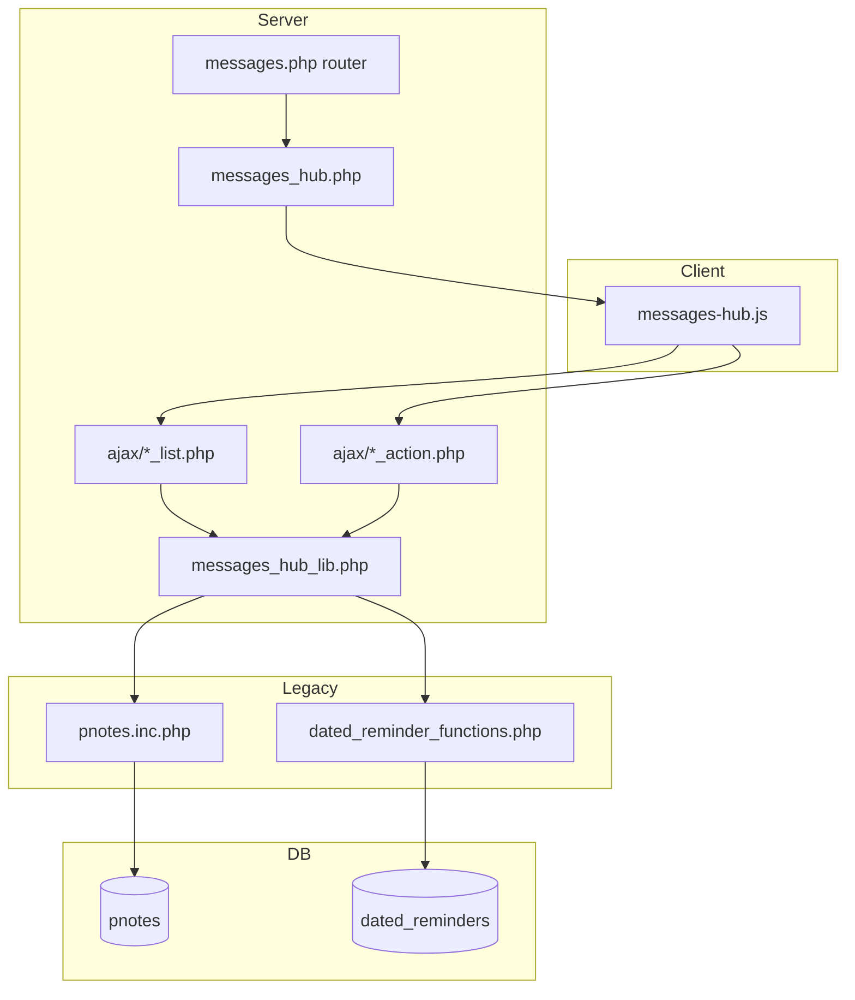

# Communications Hub — Redesign Specification (Staff Messages & Dated Reminders)

| Field | Value |
|-------|--------|
| **Document version** | 1.0.3 |
| **Status** | **Approved for Phase 1 implementation** — design complete; audit gaps A1–A13 addressed; PRD **COM-F***, PAGE_DESIGNS §7.12, USER_WORKFLOWS §8.1c trace here |
| **Companion to** | [NEW_CLINIC_V1_PRD.md](../NEW_CLINIC_V1_PRD.md) (v1.20.14), [NEW_CLINIC_V1_PAGE_DESIGNS.md](../NEW_CLINIC_V1_PAGE_DESIGNS.md) (v0.6.25), [NEW_CLINIC_V1_SCHEDULING_REDESIGN.md](./NEW_CLINIC_V1_SCHEDULING_REDESIGN.md) (v0.2.3), [NEW_CLINIC_V1_USER_WORKFLOWS.md](../NEW_CLINIC_V1_USER_WORKFLOWS.md) (v1.9.25) |
| **Audience** | Product, design, frontend engineers, QA |
| **Scope** | Staff **Messages** (`pnotes`) and **Dated Reminders** — unified split-pane hub |
| **Implementation** | Design spec for Phase 1 build; no code in this document |
| **Replaces** | Legacy tabbed Message Center UI in `interface/main/messages/messages.php` (Messages + Reminders tabs only) |

---

## Table of contents

1. [Purpose & positioning](#1-purpose--positioning)
2. [Current-state snapshot](#2-current-state-snapshot)
3. [Why redesign now](#3-why-redesign-now)
4. [Design goals & principles](#4-design-goals--principles)
5. [Scope & non-goals](#5-scope--non-goals)
6. [Unified Communications Hub shell](#6-unified-communications-hub-shell)
7. [Lens: Messages (Inbox)](#7-lens-messages-inbox)
8. [Lens: Reminders](#8-lens-reminders)
9. [Shared components](#9-shared-components)
10. [Data model & backend](#10-data-model--backend)
11. [AJAX API contracts](#11-ajax-api-contracts)
12. [Navigation, badges & entry points](#12-navigation-badges--entry-points)
13. [Security, ACL & audit](#13-security-acl--audit)
14. [Accessibility & mobile](#14-accessibility--mobile)
15. [Visual design system](#15-visual-design-system)
16. [File plan & architecture](#16-file-plan--architecture)
17. [Backward compatibility & migration](#17-backward-compatibility--migration)
18. [Relationship to recalls, portal & MedEx](#18-relationship-to-recalls-portal--medex)
19. [Phasing](#19-phasing)
20. [Acceptance criteria](#20-acceptance-criteria)
21. [Open questions](#21-open-questions)
22. [PRD Module COM — functional requirements](#22-prd-module-com--functional-requirements)
23. [Implementation roadmap](#23-implementation-roadmap)
24. [Configuration, globals & feature flag](#24-configuration-globals--feature-flag)
25. [Menu & navigation cutover](#25-menu--navigation-cutover)
26. [Help file content (draft)](#26-help-file-content-draft)
27. [Automated test plan](#27-automated-test-plan)
28. [Sign-off checklist & design completeness](#28-sign-off-checklist--design-completeness)
29. [Document history](#29-document-history)
30. [Appendix C — User stories](#appendix-c--user-stories)
31. [Appendix D — Test scenarios](#appendix-d--test-scenarios)
32. [Appendix E — Audit gap resolution index](#appendix-e--audit-gap-resolution-index)
33. [Appendix F — Traceability matrix](#appendix-f--traceability-matrix)

---

## 1. Purpose & positioning

OpenEMR's legacy **Message Center** (`interface/main/messages/messages.php`) bundles staff messaging, dated reminders, MedEx recalls, and SMS into a single ~1,100-line PHP page with Bootstrap pill tabs. It predates the New Clinic product direction and does not match the UX patterns defined in [NEW_CLINIC_V1_PAGE_DESIGNS.md](../NEW_CLINIC_V1_PAGE_DESIGNS.md).

This document specifies a **Communications Hub** — a focused staff workspace for:

| Lens | Question it answers | System of record |
|------|---------------------|------------------|
| **Messages** | "What internal patient-related messages need my attention?" | `pnotes` |
| **Reminders** | "What dated tasks are due, today, or overdue?" | `dated_reminders` + `dated_reminders_link` |

**Positioning vs other communication surfaces:**

| Surface | Status in this redesign |
|---------|-------------------------|
| Staff `pnotes` messages | **In scope** — primary Messages lens |
| Dated reminders | **In scope** — primary Reminders lens |
| MedEx Recall Board | **Out of scope** — owned by [S1 Scheduling & Flow](./NEW_CLINIC_V1_SCHEDULING_REDESIGN.md) |
| MedEx SMS Zone | **Out of scope** — tab removed; **Send SMS** link-out from overflow menu (§6.5, §18) |
| Portal secure mail (`onsite_mail`) | **Out of scope** — remains separate Angular app |
| PHI Direct (trusted messages) | **Preserved** — actions in Messages overflow, existing popups |
| Patient chart notes (`pnotes.php`) | **Unchanged** — chart depth view stays separate |
| **MRD Messages tab** | **Complementary** — patient-scoped notes/reminders inside full chart ([MRD §8](../MEDICAL_RECORD_DASHBOARD_REDESIGN.md#8-zone-c--workspace-tabs-5-tabs)); use COM for clinic-wide inbox, MRD Messages for *this patient* ([USER_WORKFLOWS §17.3a](../NEW_CLINIC_V1_USER_WORKFLOWS.md#173a-com-hub-vs-mrd-messages-tab)) |

**Design-only for this file.** Wireframes are ASCII; components reference Bootstrap 4.6, Font Awesome, OpenEMR CSS variables, Twig partials, and `xl()`/`xlt()`/`xla()`.

---

## 2. Current-state snapshot

Grounded in code as of the exploration pass that produced this document.

### 2.1 Entry points

| Entry | Path / behavior |
|-------|-----------------|
| Top menu **Messages** | `messages.php?form_active=1` — ACL `patients` + `notes` |
| Header **envelope** icon | Opens tab `msg`; badge from `library/ajax/dated_reminders_counter.php` |
| Top menu **Recalls** | `messages.php?go=Recalls` — separate from tabs (being retired per PRD) |
| Portal dropdown **Portal Mail** | `/portal/messaging/messages.php` — different system |

### 2.2 Legacy UI structure

```text
Message Center (OemrUI heading)
├── [MedEx navigation bar]              (if medex_enable && !disable_rcb)
├── Pill tabs
│   ├── Messages                        → table list OR jumbotron compose form
│   ├── Reminders                       → PHP include dated_reminders.php
│   ├── Recalls                         → two buttons → full-page MedEx board
│   └── SMS Zone                        → Select2 + popup (if MedEx logged in)
└── ~300 lines inline jQuery in messages.php
```

### 2.3 Staff messages (`pnotes`)

**List columns:** checkbox, From, Patient, Type, Date/Due date, Status.

**Filters:** Show All / Active / Inactive; admin toggle My Messages ↔ All Messages.

**Compose:** Full-page jumbotron form — type (`note_type` list), status (`message_status` list), patient multi-picker popup, user multi-assign dropdown, append-only thread body.

**Threading model:** Replies prepend formatted lines to `body`:

```text
YYYY-MM-DD HH:MM (sender to recipient) message text
```

**Pagination:** 25 rows per page; sortable columns via full page reload.

**Key files:**

| File | Role |
|------|------|
| `interface/main/messages/messages.php` | Monolithic UI + POST handler |
| `library/pnotes.inc.php` | `getPnotesByUser`, `addPnote`, `updatePnote`, `checkPnotesNoteId` |
| `src/Services/MessageService.php` | REST-only CRUD — **not used by UI today** |

### 2.4 Dated reminders

**Included via:** `require` of `interface/main/dated_reminders/dated_reminders.php` inside Reminders tab.

**Display:** Scrollable list of `<p>` blocks with icon-only overdue/today/upcoming indicators, inline Forward / Set As Completed buttons, patient name link.

**Actions:**

| Action | Mechanism |
|--------|-----------|
| Mark completed | AJAX POST `drR={id}` → returns refreshed HTML fragment |
| Forward | `dlgopen()` → `dated_reminders_add.php?mID={id}` |
| Create new | `dlgopen()` → `dated_reminders_add.php` |
| View log | `dlgopen()` → `dated_reminders_log.php` |
| Auto-refresh | `setTimeout` every 60s (from global `dated_reminders_max_alerts_to_show` context) |

**Query window:** 30 days forward; limited by `dated_reminders_max_alerts_to_show`.

**Key files:**

| File | Role |
|------|------|
| `library/dated_reminder_functions.php` | `RemindersArray`, `getRemindersHTML`, `setReminderAsProcessed` |
| `interface/main/dated_reminders/dated_reminders_add.php` | Create/forward modal form |
| `interface/main/dated_reminders/dated_reminders_log.php` | Past/future log viewer |

### 2.5 Header badge semantics

`dated_reminders_counter.php` returns:

```text
reminderText = GetDueReminderCount(5) + getPnotesByUser("1", "no", authUser, true)
```

The envelope badge combines **reminders + active messages** into one number. Portal mail uses a separate dropdown count.

### 2.6 Pain points

| # | Issue |
|---|-------|
| P1 | God file — UI, business logic, MedEx routing, inline JS in one PHP page |
| P2 | Full page reload for list sort, filter, pagination, compose |
| P3 | Messages list and compose are mutually exclusive views — no split-pane |
| P4 | Reminders tab is a separate visual language (tiny fonts, `<p>` soup, icon-heavy) |
| P5 | Recalls tab is a dead-end — two buttons that navigate away |
| P6 | Envelope badge merges two unrelated counts |
| P7 | Staff message forms lack CSRF tokens (reminders have CSRF) |
| P8 | `MessageService` REST layer unused by UI — duplicate formatting paths |
| P9 | Append-only `body` threading — hard to render, regex display hacks |
| P10 | Accessibility — row click via `role="button"`, color-only reminder urgency |
| P11 | MedEx nav bar consumes vertical space when enabled |
| P12 | Misaligned with New Clinic T1 shell, filter bar, and card patterns |

---

## 3. Why redesign now

1. **New Clinic coherence** — Front Desk, Visit Board, and S1 Scheduling follow shared layout patterns; Message Center is the largest remaining legacy island in daily staff navigation.
2. **PRD recall migration** — Recalls leave Message Center for S1; the hub should shrink to what staff actually use daily: messages + reminders.
3. **Incremental modernization** — Per `FRONTEND_2026_MODERNIZATION_PLAN.md`, V1 avoids new frameworks; this redesign extracts JS/CSS and adds JSON endpoints without changing schema.
4. **Clinical safety** — Messages are part of the medical record; the UI must make status, patient context, and thread history unambiguous.

---

## 4. Design goals & principles

| ID | Goal |
|----|------|
| G1 | **One product feel** — Messages and Reminders share a split-pane shell, filter bar, and card/list row components |
| G2 | **Fewer full reloads** — List, read, and actions via AJAX; compose updates list in place |
| G3 | **Patient context always visible** — Patient name links to chart; unassigned Direct messages clearly flagged |
| G4 | **Accessible by default** — WCAG 2.1 AA: labeled buttons, focus rings, no color-only status |
| G5 | **Respect medical record** — No silent deletes; confirm destructive actions; audit via existing `EventAuditLogger` where applicable |
| G6 | **No schema changes in Phase 1** — Reuse `pnotes`, `dated_reminders`, existing library functions |
| G7 | **Backward compatible URLs** — `messages.php?form_active=1` and deep links continue to work |
| G8 | **Align with New Clinic envelope** — Prepare for T1 shell integration when `oe-module-new-clinic` lands |

**Principles borrowed from PAGE_DESIGNS §4:**

- Server-rendered shell first byte (no AJAX flash for page chrome)
- Standard JSON AJAX envelope (§11 below)
- Role-agnostic hub — any user with `patients/notes` ACL
- Empty states with role-appropriate guidance

---

## 5. Scope & non-goals

### 5.1 Phase 1 — in scope (this document)

| Item | Included |
|------|----------|
| Split-pane **Messages** lens | List + read/compose in one view |
| Split-pane **Reminders** lens | List + detail/actions in one view |
| Unified lens switcher (Messages / Reminders) | With live counts |
| AJAX JSON list + action endpoints | See §11 |
| Extracted `messages-hub.css` + `messages-hub.js` | No inline PHP-generated JS loops |
| Twig partials for list rows, detail pane, compose | |
| CSRF on all mutating staff message actions | |
| Preserve PHI Direct + fax attachment flows | Overflow actions |
| `OemrUI` page wrapper | Until T1 shell exists |

### 5.2 Phase 1 — explicitly out of scope

| Item | Deferred to |
|------|-------------|
| Recall Board UI | S1 Scheduling & Flow |
| SMS Zone tab | Removed; overflow **Send SMS** → `SMS_bot` popup (§6.5) |
| Portal mail unification | Separate product decision |
| Restructuring `pnotes.body` threading | Phase 3+ |
| REST GET `/api/patient/{pid}/message` | Phase 3 |
| T1 shell wrapper | `oe-module-new-clinic` Phase 4 |
| Split envelope badge (messages vs reminders) | Phase 2 (optional) |
| Replacing `dated_reminders_add.php` modal | Phase 2 — reuse modal in Phase 1 |

### 5.3 Non-goals (all phases)

- Replacing MedEx as messaging provider
- Merging `pnotes` and `onsite_mail` tables
- Patient-facing messaging changes
- New PHP framework or React/Vue SPA
- **Per-doctor message routing or doctor-picker on compose** — multi-doctor clinics use a shared `ready_for_doctor` visit pool (PRD §6.5.1); the hub does not assign internal messages to a specific clinician in V1

### 5.4 Multi-doctor clinics (cross-reference)

The Communications Hub is **role-agnostic** — any user with `patients` + `notes` ACL sees the same Messages and Reminders lenses. Multi-doctor queue behavior lives in the visit FSM, not in staff messaging.

| Surface | Multi-doctor V1 behavior |
|---------|-------------------------|
| Message list patient link | Opens chart — unchanged |
| Active visit context (optional Phase 2 chip) | When patient has `new_visit` today, detail pane may show state + routing/appt/**assigned** chips per §6.5.2–§6.5.3 — links to Doctor Desk; **no** message routing |
| Reminders | Unchanged — assigned user on reminder row is existing `dated_reminders` semantics, not visit queue assignment |
| Envelope badge | Unchanged — not split per doctor |

See [PRD §6.5.1](../NEW_CLINIC_V1_PRD.md#651-multi-doctor-clinic-model-v1) through [§6.5.4](../NEW_CLINIC_V1_PRD.md#654-doctor-ready-notifications-v12), [USER_WORKFLOWS §8.3.1](../NEW_CLINIC_V1_USER_WORKFLOWS.md#831-multi-doctor-clinics)–[§8.3.4](../NEW_CLINIC_V1_USER_WORKFLOWS.md#834-doctor-ready-notifications-v12).

---

## 6. Unified Communications Hub shell

### 6.1 Page metadata

| Property | Value |
|----------|-------|
| **URL** | `/interface/main/messages/messages.php` (default) |
| **Title** | `Communications` (OemrUI heading). Menu label remains **Messages** (COM-1). |
| **Help file** | `Documentation/help_files/message_center_help.php` (update copy in Phase 1) |
| **Wrapper** | `OemrUI` container (migrate to T1 later) |
| **Default lens** | Messages — Active |
| **Deep link** | `?lens=reminders` opens Reminders lens |

### 6.2 Layout wireframe

```text
┌─ OemrUI heading: Communications ─────────────────────────────────────────┐
│ [?] help                                                                  │
├───────────────────────────────────────────────────────────────────────────┤
│ [ Messages (n) ] [ Reminders (n) ]          🔍 Search…    [Filters ▾] [↻] │
├──────────────────────────────┬────────────────────────────────────────────┤
│ LIST PANE (38–42% width)   │ DETAIL PANE (58–62% width)                 │
│ ┌────────────────────────┐ │                                            │
│ │ ● row                  │ │  [Detail / Compose / Empty state]          │
│ │   row                  │ │                                            │
│ │   row                  │ │                                            │
│ │   …                    │ │                                            │
│ └────────────────────────┘ │                                            │
│ « 1–25 of 142 »            │                                            │
├──────────────────────────────┴────────────────────────────────────────────┤
│ [ Compose ]  [ Delete ]  [ ⋯ More ]                                       │
└───────────────────────────────────────────────────────────────────────────┘
```

On viewports **&lt; 768px**, list pane is full width; selecting a row slides detail pane over list (single-pane mobile pattern per PAGE_DESIGNS §8).

### 6.3 Lens switcher

| Tab | Badge source | Default sort |
|-----|--------------|--------------|
| **Messages** | Active `pnotes` count for current user (`getPnotesByUser("1", "no", authUser, true)`) | Date descending |
| **Reminders** | Unprocessed reminders due within **30 days** (same window as `RemindersArray`) | Due date ascending |

**Count semantics (do not unify across surfaces):**

| Surface | Definition |
|---------|------------|
| Header envelope badge | Unchanged legacy: `GetDueReminderCount(5) + active pnotes` |
| Reminders lens tab badge | 30-day unprocessed window (may differ from envelope reminder portion) |
| `hub_counts.php` | Returns both `reminders_in_window` (30d) and `reminders_due_5d` (header parity) |

Switching lens preserves filter/sort state via `prevSetting()` (§17.3). Ephemeral selection (selected row id, scroll offset) uses `sessionStorage` for the current browser tab only.

### 6.4 Global toolbar

| Control | Behavior |
|---------|----------|
| **Search** | Debounced 300ms; searches current lens fields (see §7.5, §8.4) |
| **Filters** | Lens-specific filter dropdown (see each lens section) |
| **Refresh** | Re-fetches list + selected detail; shows subtle spinner |
| **Compose** | Messages lens: opens compose in detail pane. Reminders lens: opens existing `dated_reminders_add.php` modal |

### 6.5 Footer action bar

Context-sensitive by lens and selection:

| Lens | Primary | Secondary | Overflow ⋯ |
|------|---------|-----------|------------|
| Messages (none selected) | Compose | — | Trusted Direct, Check Trusted, Send SMS (if MedEx), Print (disabled) |
| Messages (row selected) | Reply | Mark done | Delete, Print, Open chart, Assign patient (if `pid=0`), Send SMS (if MedEx + patient) |
| Messages (multi-select) | — | Delete | — |
| Messages (supervisory read) | — | — | Open chart only; Reply/Delete hidden |
| Reminders (row selected) | Mark completed | Forward | Open chart, View log |
| Reminders (none selected) | Create reminder | View log | — |

**Send SMS (overflow):** Shown when `$GLOBALS['medex_enable'] == '1'` and MedEx session is logged in. If detail pane has a patient, opens `messages.php?go=SMS_bot&pid={pid}` via `dlgopen()`. If no patient, prompts patient search first (same flow as legacy SMS Zone).

---

## 7. Lens: Messages (Inbox)

### 7.1 List row component (`message-row`)

```text
┌────────────────────────────────────────────┐
│ [□]  ● NEW   Dr. Smith, Jane               │
│      Lab results review — Akua Mensah      │
│      Unassigned · 2h ago                   │
└────────────────────────────────────────────┘
```

| Element | Source / rule |
|---------|---------------|
| Checkbox | Bulk delete only |
| Status pill | `message_status` from `list_options.message_status` — **text + color**, not color alone |
| From | Sender `users` join — `lname, fname` |
| Subject line | First line of latest thread segment or `title` (note type) |
| Patient | `patient_data` name; `* Patient must be set manually *` styled as warning chip if `pid=0` |
| Meta | Relative time (`2h ago`) with absolute tooltip |
| Unread indicator | `message_status = 'New'` → bold row + dot |
| Selected row | `var(--gray200)` background + left border accent `var(--primary)` |

### 7.2 Detail pane — read mode

```text
┌─ Detail ────────────────────────────────────────────────────────────────┐
│ From: Dr. Smith, Jane          To: You                                    │
│ Patient: Akua Mensah  [Open chart]     Type: Lab                            │
│ Status: [ New ▾ ]     Due: 15 Jun 2026 14:00  (if messages_due_date)      │
├───────────────────────────────────────────────────────────────────────────┤
│ THREAD (scrollable, monospace-friendly)                                   │
│ ┌─────────────────────────────────────────────────────────────────────┐   │
│ │ 2026-06-14 09:00 (jsmith to nurse1) Please review CBC results.    │   │
│ │ 2026-06-14 11:30 (nurse1 to jsmith) Will follow up with patient.    │   │
│ └─────────────────────────────────────────────────────────────────────┘   │
├───────────────────────────────────────────────────────────────────────────┤
│ Linked documents / procedure orders (if any — from gprelations)           │
├───────────────────────────────────────────────────────────────────────────┤
│ [ Reply ]  [ Mark done ]  [ Print ]  [ Delete ]                           │
└───────────────────────────────────────────────────────────────────────────┘
```

**Thread rendering:** Two-tier strategy in `messages_hub_lib.php`:

| Tier | Condition | Output |
|------|-----------|--------|
| **Parsed** | Lines match `^\d{4}-\d{2}-\d{2}` thread pattern | Stacked **thread-bubble** blocks (sender, timestamp, text) |
| **Fallback** | No parseable segments | Single `<pre class="msg-thread-raw">` with `oeFormatPatientNote()` + `nl2br(text())` — never empty detail |

Reuse `pnoteConvertLinks` server-side; return sanitized HTML in JSON.

**Supervisory read (admin):** When user has `admin` + `super` and scope is All users, detail may load messages they are not party to. Show banner: *"Viewing as administrator (read only)"*. `can_reply` and `can_delete` are false unless `checkPnotesNoteId()` passes.

**Status change:** Dropdown triggers AJAX `message_action.php` `action=set_status` without full reload.

**Print:** Client-only — clone detail metadata + `thread_html` into `window.open()` printable view; `@media print` rules in `messages-hub.css`. No server endpoint.

### 7.3 Detail pane — compose mode

Triggered by **Compose**, **Reply**, or `?task=addnew` deep link.

| Field | Control | Validation |
|-------|---------|------------|
| Type | `note_type` select | Required |
| Status | `message_status` select | Default `New` |
| Patient | Read-only input + picker popup | Optional for new; required context for replies |
| To | Multi-user picker (existing dropdown + chips) | At least one recipient |
| Due date | Datetime picker | Only if `$GLOBALS['messages_due_date']` |
| Body | Textarea min 2 rows | Required, min 2 chars |

**Send** → AJAX `action=send` → appends or creates via `addPnote` / `updatePnote`; refreshes list; selects new/updated row.

**Cancel** → returns to previous selection or empty state.

### 7.4 Filters (Messages)

| Filter | Values | Maps to |
|--------|--------|---------|
| Scope | My messages / All users' messages | `show_all=no|yes` — admin/super only for All users |
| Activity | Active / Inactive / All activity | `activity=1|0|all` |
| Status | Multi-select from `message_status` list | Optional Phase 1 — default all active statuses |
| Type | `note_type` list | Optional Phase 1 |

Admin **All users** scope moves to filter bar (not a cryptic fa-users icon).

### 7.5 Search (Messages)

Server-side `LIKE` on:

- Patient last/first name
- Sender last/first name
- `title` (type)
- Latest body segment (best-effort; full-text search deferred)

### 7.6 Pagination & sort

| Property | Value |
|----------|-------|
| Page size | 25 (unchanged) |
| Sort columns | Date, From, Patient, Type, Status |
| Sort direction | Toggle asc/desc via column header click |
| Pagination | AJAX — footer `« prev | next »` |

### 7.7 Empty states

| Condition | Message |
|-----------|---------|
| No active messages | "No active messages. Compose a message to assign a task to a colleague." + [Compose] |
| No inactive messages | "No completed messages in this view." |
| Search no results | "No messages match your search. Try patient name or sender." |
| ACL denied detail | "You do not have access to this message." |
| Supervisory read | Banner shown; Reply/Delete disabled |

### 7.8 Legacy message flows (parity)

Phase 1 must not drop these legacy paths.

| Flow | UI / API | Backend |
|------|----------|---------|
| **Orphan Direct (`pid=0`)** | Warning chip in list; detail shows **Assign patient** + patient picker | `message_action.php` `action=assign_patient` → `updatePnotePatient()` |
| **Fax deep link** | `?task=addnew` with `jobId` / attachment params → compose with hidden `attachment_id`, `attachment_type` | On send: `setGpRelation(type, id, 6, note_id)` |
| **Multi-recipient create** | Semicolon-separated `assigned_to` chips | One `addPnote()` per recipient (same body, same `pid`) |
| **Reply** | Single-thread reply on existing `noteid` | `updatePnote()` — does not fan out to new recipients in Phase 1 |
| **Portal assignee (`portal-user`)** | Detail label "Portal message" | Delete per `deletePnote()` rules — hide if not allowed |
| **`-patient-` assignee** | Server supports in `send` action for API parity | No dedicated Phase 1 UI unless portal workflow requires it |

### 7.9 Client error & session handling

| API response | Client UX |
|--------------|-----------|
| `401 unauthorized` | Toast + redirect to login |
| `403 forbidden` | Inline detail empty state with access message |
| `validation` | Field-level errors on compose form |
| Network failure | Error on list pane with **Retry** button |

---

## 8. Lens: Reminders

### 8.1 List row component (`reminder-row`)

```text
┌────────────────────────────────────────────┐
│ OVERDUE   12 Jun 2026                      │
│ Follow up on culture — Akua Mensah         │
│ From: Dr. Smith · Priority: High           │
└────────────────────────────────────────────┘
```

| Element | Source / rule |
|---------|---------------|
| Urgency chip | `OVERDUE` (red), `TODAY` (amber), `UPCOMING` (green) — **text label always shown** |
| Due date | `dr_message_due_date` formatted per locale |
| Message | `dr_message_text` (max 160 chars in DB) |
| Patient | Name from `patient_data` if `pid > 0`; else "No patient linked" |
| From | `users` join on `dr_from_ID` |
| Priority | `message_priority` 1=High, 2=Medium, 3=Low — text badge |

### 8.2 Detail pane — read mode

```text
┌─ Reminder detail ─────────────────────────────────────────────────────────┐
│ Status: OVERDUE — due 12 Jun 2026                                         │
│ From: Dr. Smith, Jane                                                     │
│ Patient: Akua Mensah  [Open chart]                                          │
│ Priority: High                                                            │
├───────────────────────────────────────────────────────────────────────────┤
│ Follow up on culture results and call patient with instructions.            │
├───────────────────────────────────────────────────────────────────────────┤
│ [ Mark completed ]  [ Forward ]  [ Open chart ]                           │
└───────────────────────────────────────────────────────────────────────────┘
```

### 8.3 Actions

| Action | Phase 1 implementation |
|--------|--------------------------|
| Mark completed | AJAX → `setReminderAsProcessed` — remove row, select next |
| Forward | `dlgopen('dated_reminders_add.php?mID=…')` — keep existing modal |
| Create | `dlgopen('dated_reminders_add.php')` |
| View log | `dlgopen('dated_reminders_log.php')` |
| Open chart | `top.RTop.location = demographics.php?set_pid=` |

**Auto-refresh:** Poll list every 60s when Reminders lens is active and tab is visible (`document.visibilityState`). Pause when Messages lens active or tab hidden.

**Modal refresh contract:** When `dated_reminders_add.php` or `dated_reminders_log.php` closes (save or cancel), hub calls `refreshRemindersList()` and `fetchHubCounts()` via `dlgopen()` `onClose` callback.

### 8.4 Filters (Reminders)

| Filter | Values |
|--------|--------|
| Urgency | All / Overdue / Today / Upcoming |
| Priority | All / High / Medium / Low |
| Patient | Text search (name) |

Default: all unprocessed within 30-day window (existing `RemindersArray` behavior).

### 8.5 Empty states

| Condition | Message |
|-----------|---------|
| No reminders | "No reminders in the next 30 days. Create a dated reminder for a follow-up task." + [Create] |
| All completed | "You're all caught up." |
| Overdue filter empty | "No overdue reminders." |

---

## 9. Shared components

### 9.1 `split-pane` layout

| Breakpoint | Behavior |
|------------|----------|
| ≥ 1024px | Side-by-side 40/60 |
| 768–1023px | Side-by-side 45/55 |
| &lt; 768px | List full width; detail as overlay panel with back button |

### 9.2 `filter-bar`

Reuses visual language from PAGE_DESIGNS §4 — horizontal chip filters + search input.

### 9.3 `status-pill`

Maps `list_options` colors where available; always includes text label.

### 9.4 `patient-link`

Click → `goPid(pid)` with `top.restoreSession()` — same as legacy.

### 9.5 `empty-state`

Centered illustration placeholder (Font Awesome `fa-inbox` / `fa-bell`), heading, body, primary CTA.

### 9.6 `loading-skeleton`

Shimmer rows while AJAX list loads — 3 placeholder rows.

---

## 10. Data model & backend

### 10.1 No schema changes (Phase 1)

All persistence through existing tables and library functions.

### 10.2 `pnotes` (messages)

| Field | UI use |
|-------|--------|
| `id` | Row key |
| `user` | From |
| `assigned_to` | To (semicolon-separated for multi-recipient creates) |
| `pid` | Patient link |
| `title` | Type |
| `message_status` | Status pill |
| `body` | Thread |
| `date` | Sort / display |
| `activity` | Active vs inactive filter |
| `deleted` | Soft delete (excluded from list) |

**Authorization:** `checkPnotesNoteId($id, $authUser)` before any read/write.

**Mutations:**

| Operation | Function |
|-----------|----------|
| Create | `addPnote()` |
| Reply | `updatePnote()` |
| Status only | `updatePnoteMessageStatus()` |
| Assign patient | `updatePnotePatient()` |
| Delete | `deletePnote()` (soft) |

### 10.3 `dated_reminders` + `dated_reminders_link`

| Field | UI use |
|-------|--------|
| `dr_id` | Row key |
| `dr_message_text` | Body |
| `dr_message_due_date` | Due date + urgency |
| `message_priority` | Priority badge |
| `message_processed` | Excluded when = 1 |
| `pid` | Patient |
| `dr_from_ID` | Sender |
| `dated_reminders_link.to_id` | Recipient filter |

**Mutations:**

| Operation | Function |
|-----------|----------|
| Mark completed | `setReminderAsProcessed()` |
| Create / forward | Existing `dated_reminders_add.php` POST logic (unchanged) |

### 10.4 Service layer (Phase 1)

New thin PHP includes — **not** new `src/Services` classes yet:

| File | Responsibility |
|------|----------------|
| `messages_hub_lib.php` | Format thread HTML, build list DTOs, authorize |
| Reuse `pnotes.inc.php` | All pnotes mutations |
| Reuse `dated_reminder_functions.php` | Reminder queries |

Phase 3 may consolidate into `OpenEMR\Services\CommunicationsHubService`.

---

## 11. AJAX API contracts

Follow [PAGE_DESIGNS §6](../NEW_CLINIC_V1_PAGE_DESIGNS.md#6-ajax-response-envelope) envelope for all new endpoints.

### 11.1 Common rules

- `Content-Type: application/json`
- **All endpoints** require active session + `AclMain::aclCheckCore('patients', 'notes')` at script top
- Per-resource checks on detail/actions: `checkPnotesNoteId()`, reminder recipient linkage
- CSRF: `csrf_token_form` in POST body — `CsrfUtils::verifyCsrfToken()`
- GET list/detail: session cookie sufficient; no CSRF on GET
- Session: `top.restoreSession()` on client before each request
- `skip_timeout_reset: "1"` on poll endpoints
- Errors return `{ success: false, error: { code, message, details? } }`

### 11.2 `GET messages_list.php`

**Query params:**

| Param | Type | Description |
|-------|------|-------------|
| `activity` | `1\|0\|all` | Active filter |
| `show_all` | `yes\|no` | Admin all-users |
| `sortby` | string | `date\|from\|patient\|type\|status` |
| `sortorder` | `asc\|desc` | |
| `begin` | int | Offset |
| `limit` | int | Default 25 |
| `q` | string | Search |

**Success `data`:**

```json
{
  "rows": [
    {
      "id": 42,
      "from_name": "Smith, Jane",
      "patient_name": "Mensah, Akua",
      "pid": 123,
      "patient_unassigned": false,
      "type": "Lab",
      "status": "New",
      "status_title": "New",
      "date": "2026-06-14T09:00:00",
      "date_display": "14 Jun 2026 09:00",
      "preview": "Please review CBC results.",
      "is_unread": true
    }
  ],
  "total": 142,
  "begin": 0,
  "limit": 25
}
```

### 11.3 `GET message_detail.php`

**Query:** `id={noteid}`

**Success `data`:**

```json
{
  "id": 42,
  "from_name": "Smith, Jane",
  "assigned_to": "nurse1",
  "patient_name": "Mensah, Akua",
  "pid": 123,
  "type": "Lab",
  "status": "New",
  "date": "2026-06-14T09:00:00",
  "thread_html": "<div class=\"msg-thread\">…</div>",
  "linked_documents": [],
  "linked_orders": [],
  "can_reply": true,
  "can_delete": true,
  "is_supervisory_read": false,
  "supervisory_banner": null
}
```

When `is_supervisory_read` is true, `can_reply` and `can_delete` are false and `supervisory_banner` contains the read-only administrator message.

### 11.4 `POST message_action.php`

| `action` | Body fields | Backend |
|----------|-------------|---------|
| `send` | `noteid?`, `note`, `form_note_type`, `form_message_status`, `assigned_to` (semicolon-separated), `reply_to`, `form_datetime?`, `attachment_id?`, `attachment_type?` | New: one `addPnote()` per recipient in `assigned_to` list. Reply: `updatePnote()` on existing `noteid`. Fax: `setGpRelation()` after create |
| `set_status` | `noteid`, `form_message_status` | `updatePnoteMessageStatus` |
| `delete` | `delete_id[]` | `deletePnote` per id + `EventAuditLogger` |
| `assign_patient` | `noteid`, `pid` | `updatePnotePatient` |

### 11.5 `GET reminders_list.php`

**Query params:** `urgency`, `priority`, `q`

**Success `data`:**

```json
{
  "rows": [
    {
      "id": 7,
      "due_date": "2026-06-12",
      "urgency": "overdue",
      "message": "Follow up on culture",
      "patient_name": "Mensah, Akua",
      "pid": 123,
      "from_name": "Smith, Jane",
      "priority": 1,
      "priority_label": "High"
    }
  ],
  "total": 3
}
```

### 11.6 `POST reminder_action.php`

| `action` | Body | Backend |
|----------|------|---------|
| `complete` | `dr_id` | `setReminderAsProcessed` |

### 11.7 `GET hub_counts.php`

Returns badge counts for lens switcher and debugging:

```json
{
  "messages_active": 12,
  "reminders_in_window": 5,
  "reminders_due_5d": 3
}
```

| Field | Definition |
|-------|------------|
| `messages_active` | `getPnotesByUser("1", "no", authUser, true)` |
| `reminders_in_window` | Unprocessed reminders in 30-day `RemindersArray` window — **lens tab badge** |
| `reminders_due_5d` | `GetDueReminderCount(5)` — **header envelope reminder portion** |

Used on load and after mutations. Header envelope combined badge remains `reminders_due_5d + messages_active` (Phase 1 unchanged).

### 11.8 Standard error codes

| Code | HTTP | When |
|------|------|------|
| `csrf_invalid` | 400 | CSRF failure |
| `unauthorized` | 401 | Session expired |
| `forbidden` | 403 | ACL / `checkPnotesNoteId` failure |
| `not_found` | 404 | Message/reminder not found |
| `validation` | 400 | Field errors in `details.errors` |

---

## 12. Navigation, badges & entry points

### 12.1 Menu label

| Element | Phase 1 (resolved COM-1) |
|---------|--------------------------|
| Menu item | **Messages** (unchanged in `standard.json`, etc.) |
| Page title / OemrUI heading | **Communications** |

URL remains `messages.php?form_active=1`.

### 12.2 Tab shell

`viewMessages()` continues to open tab id `msg` — no change to `user_data_view_model.js` URL.

### 12.3 Header envelope

**Phase 1:** Keep combined count: `GetDueReminderCount(5) + active pnotes` (regression). Lens Reminders tab may show a higher count (30-day window) — this is intentional (§6.3).

**Phase 2 (optional):** Split tooltip: "5 messages, 3 reminders" while showing combined badge.

### 12.4 Deep links

| Legacy URL | Hub mapping |
|------------|-------------|
| `messages.php?form_active=1` | Hub, Messages lens, activity=Active, scope=My |
| `messages.php?form_inactive=1` | Hub, Messages lens, activity=Inactive, scope=My |
| `messages.php?show_all=yes` (non-admin) | activity=All, scope=My |
| `messages.php?show_all=yes` (admin) | activity=All, scope=All users |
| `messages.php?task=edit&noteid=N` | Hub, select message N in detail |
| `messages.php?task=addnew` | Hub, compose mode |
| `messages.php?lens=reminders` | Hub, Reminders lens |
| `messages.php?go=Recalls` | **Unchanged** — legacy MedEx board (until S1) |
| `messages.php?go=addRecall` | **Unchanged** |
| `messages.php?SMS_bot&pid=` | **Unchanged** |
| `messages.php?task=addnew&jobId=` | Hub compose with fax attachment fields |

**UI copy:** Use **All activity** and **All users** — never bare "Show All" (avoids legacy ambiguity, audit A11).

### 12.5 Recalls menu item

Per PRD §19 Phase C: hide when S1 Recall Worklist at parity. Phase 1 hub **removes Recalls tab**; top-level Recalls menu entry remains for admins until S1 ships.

---

## 13. Security, ACL & audit

| Check | Rule |
|-------|------|
| Page access | Menu ACL `patients` + `notes` (unchanged) |
| All endpoints | Session + `patients/notes` at top of each `ajax/*.php` |
| All messages list | `AclMain::aclCheckCore('admin', 'super')` for `show_all=yes` |
| Message read/write | `checkPnotesNoteId()` for mutations and normal read |
| **Admin supervisory read** | When `admin` + `super` and scope=All users: `message_detail.php` allows read without `checkPnotesNoteId`; `can_reply`/`can_delete` false unless user is party to message |
| Reminder complete | Recipient must match `dated_reminders_link.to_id` for session user |
| CSRF | All POST AJAX endpoints |
| XSS | `text()` / `attr()` on output; thread HTML from trusted server formatter only |
| Audit | `EventAuditLogger` on delete (parity with legacy `task=delete`) |

**Gap closed:** Staff message POST forms gain CSRF tokens in Phase 1.

---

## 14. Accessibility & mobile

Aligned with PAGE_DESIGNS §9 and healthcare UI/UX Pro Max checklist.

| Requirement | Implementation |
|-------------|----------------|
| Focus management | Moving selection updates `aria-selected`; detail pane receives focus |
| Keyboard | ↑/↓ list navigation, Enter open, Esc close mobile detail |
| Status | Text + icon for reminder urgency; status pills include words |
| Touch targets | Min 44×44px for row actions |
| Live region | `aria-live="polite"` on list container for refresh announcements |
| Reduced motion | No blink; respect `prefers-reduced-motion` |
| Screen readers | List rows: `role="option"` in `role="listbox"` |
| Color contrast | 4.5:1 minimum on pills and text |
| Skip link | "Skip to message detail" (first focusable) |
| RTL | Chevron pagination follows `$_SESSION['language_direction']`; split-pane order respects `[dir=rtl]`; prefer server `date_display` over client-relative time in Phase 1 |

---

## 15. Visual design system

Derived from UI/UX Pro Max healthcare recommendation (OpenEMR Message Center project).

| Token | Value | Use |
|-------|-------|-----|
| Primary | `#0891B2` | Accents, selected border, links |
| Secondary | `#22D3EE` | Hover states |
| Success / CTA | `#059669` | Mark done, send |
| Background | `#ECFEFF` or `var(--light)` | Page background tint (subtle) |
| Text | `#164E63` or `var(--body)` | Body text |
| Danger | `var(--danger)` | Delete, overdue |
| Warning | `var(--orange)` | Today reminders, unassigned patient |
| Typography | Figtree / Noto Sans | **Optional** — only if global OpenEMR theme allows; default to system stack in Phase 1 |
| Icons | Font Awesome (existing) | No emoji icons |
| Radius | `0.25rem` | Match Bootstrap 4 cards |
| Transitions | 150–200ms | Hover, selection |

**Anti-patterns to avoid:** neon gradients, icon-only actions without `aria-label`, AI purple styling, motion-heavy animations.

All styles scoped under `.communications-hub` in `messages-hub.css` to avoid global bleed.

---

## 16. File plan & architecture

### 16.1 New files

```
interface/main/messages/
├── messages.php                    # Slim router — delegates to hub; keeps ?go= MedEx paths
├── messages_hub.php                # Hub shell (Twig render)
├── messages_hub_lib.php            # DTO formatters, authorization helpers
├── ajax/
│   ├── messages_list.php
│   ├── message_detail.php
│   ├── message_action.php
│   ├── reminders_list.php
│   ├── reminder_action.php
│   └── hub_counts.php
├── templates/
│   ├── hub_shell.twig
│   ├── messages_list.twig
│   ├── message_detail.twig
│   ├── message_compose.twig
│   ├── reminders_list.twig
│   ├── reminder_detail.twig
│   └── partials/
│       ├── empty_state.twig
│       ├── filter_bar.twig
│       └── status_pill.twig
├── css/
│   └── messages-hub.css
└── js/
    └── messages-hub.js
```

### 16.2 Modified files

| File | Change |
|------|--------|
| `interface/main/messages/messages.php` | Extract hub; retain MedEx `?go=` handlers at top |
| `interface/main/tabs/menu/menus/*.json` | Label → Communications (optional) |
| `Documentation/help_files/message_center_help.php` | Update screenshots/copy |
| `CLAUDE.md` | Link to this doc |

### 16.3 Preserved unchanged (Phase 1)

| File | Reason |
|------|--------|
| `library/pnotes.inc.php` | Core CRUD |
| `library/dated_reminder_functions.php` | Reminder queries |
| `dated_reminders_add.php` | Create/forward modal |
| `dated_reminders_log.php` | Log viewer |
| `trusted-messages.php` | PHI Direct |
| `save.php` | MedEx/recall AJAX |
| `portal/messaging/*` | Portal mail |

### 16.4 Architecture diagram



---

## 17. Backward compatibility & migration

### 17.1 Rollout strategy

1. Ship hub behind global `$GLOBALS['communications_hub_enable']` default **off** in first commit; enable for testing.
2. When acceptance passes, flip default **on**.
3. Legacy table UI code removed only after one release with hub enabled.

### 17.2 Feature flag

```php
// globals or settings table
$GLOBALS['communications_hub_enable'] = '1';
```

When off, `messages.php` renders existing tabbed UI unchanged.

### 17.3 User settings

Persist filters and sort via `prevSetting()` with `$uspfx = 'interface/main/messages/messages.php.'`:

| Key | Values |
|-----|--------|
| `comm_hub_lens` | `messages` \| `reminders` |
| `comm_hub_activity` | `1` \| `0` \| `all` |
| `comm_hub_scope` | `my` \| `all_users` |
| `comm_hub_sort` | JSON `{ sortby, sortorder }` |

**Ephemeral only (sessionStorage):** selected row id, list scroll position — not persisted across browser sessions.

---

## 18. Relationship to recalls, portal & MedEx

```text
┌─────────────────────────────────────────────────────────────────┐
│                     STAFF DAILY WORK                             │
├─────────────────────────────────────────────────────────────────┤
│  Communications Hub (this doc)     │  S1 Scheduling & Flow       │
│  • pnotes messages                 │  • Calendar                 │
│  • dated reminders                 │  • Flow Board               │
│                                    │  • Recall Worklist (S1)     │
├────────────────────────────────────┼─────────────────────────────┤
│  Portal Mail (separate)            │  MedEx SMS (link-out)       │
│  • onsite_mail                     │  • SMS_bot popup            │
└─────────────────────────────────────────────────────────────────┘
```

| Integration | Rule |
|-------------|------|
| Recall chip on patient search | Opens S1 Recall Worklist — **never** legacy Recall Board (PRD H1) |
| MedEx nav bar | **Hidden** in hub; MedEx setup/preferences remain at `?go=setup` |
| PHI Direct | Overflow actions in Messages lens |
| Fax attachments | Existing `oe-module-faxsms` deep links preserved (§7.8) |
| **Send SMS** | Overflow menu when MedEx enabled + logged in → `dlgopen(messages.php?go=SMS_bot&pid=…)`; patient search if no pid (§6.5) |

---

## 19. Phasing

| Phase | Deliverable | This doc |
|-------|-------------|----------|
| **1** | Messages + Reminders split-pane hub, AJAX endpoints, extracted assets | **§5–§20** |
| **2** | Inline reminder create (replace modal), split header badge, Sent lens for messages | Future doc |
| **3** | REST GET list, `CommunicationsHubService`, structured threading | Future doc |
| **4** | T1 shell wrap via `oe-module-new-clinic` | PAGE_DESIGNS §2 |
| **5** | Optional portal mail tab (iframe) | Product decision |

---

## 20. Acceptance criteria

### 20.1 Messages lens

- [ ] List loads via AJAX in &lt; 1s for 500 messages on XAMPP dev hardware
- [ ] Selecting a row shows thread in detail pane without full page reload
- [ ] Compose sends to multiple recipients (semicolon list) — one `pnotes` row per recipient
- [ ] Reply appends to thread with correct `(from to to)` format on same note
- [ ] Mark done sets `message_status=Done` and `activity=0`; row moves to Inactive filter
- [ ] Admin can filter All users' messages and **open read-only detail** with supervisory banner
- [ ] Admin cannot reply/delete messages they are not party to (unless `checkPnotesNoteId` passes)
- [ ] Soft delete removes from active list; audit logged
- [ ] `?task=edit&noteid=N` deep link opens correct message
- [ ] `?task=addnew&jobId=` fax deep link preserves attachment on send
- [ ] Assign patient on `pid=0` message via detail pane
- [ ] Malformed thread body renders fallback plain block (not empty detail)
- [ ] PHI Direct and Check Trusted buttons work from overflow
- [ ] Print opens browser print dialog on thread view
- [ ] Send SMS overflow opens `SMS_bot` when MedEx enabled
- [ ] Linked documents and procedure orders display when present
- [ ] CSRF enforced on all POST actions
- [ ] `checkPnotesNoteId` blocks unauthorized detail for non-admin users

### 20.2 Reminders lens

- [ ] List shows overdue/today/upcoming with text labels (not color alone)
- [ ] Lens tab badge uses 30-day window count
- [ ] Mark completed removes row via AJAX
- [ ] Forward opens existing `dated_reminders_add.php` modal; list refreshes on modal close
- [ ] Create opens existing add modal; list refreshes on modal close
- [ ] View log opens existing log modal
- [ ] Patient name opens chart
- [ ] Auto-refresh every 60s when lens active and tab visible (pauses when hidden)
- [ ] Empty state when no reminders in window

### 20.3 Shell & cross-cutting

- [ ] Lens switcher shows live counts (`messages_active`, `reminders_in_window`)
- [ ] `hub_counts.php` returns `reminders_due_5d` matching header envelope reminder portion
- [ ] Mobile: list → detail overlay with back navigation
- [ ] Keyboard navigation works for list
- [ ] Client handles 401/403/validation/network errors per §7.9
- [ ] Feature flag off renders legacy UI unchanged
- [ ] `?go=Recalls` and other MedEx paths still work
- [ ] Help file updated
- [ ] No PHP errors in Apache log during smoke test
- [ ] `xl()`/`xlt()` on all user-visible strings
- [ ] Filter labels use "All activity" / "All users" (not ambiguous "Show All")

### 20.4 Regression

- [ ] Envelope badge count unchanged from legacy (`reminders_due_5d + messages_active`)
- [ ] Menu/tab `viewMessages()` opens hub
- [ ] Lab auto-messages (`lab_results_messages.php`) still create pnotes correctly
- [ ] REST `MessageRestController` unaffected

---

## 21. Open questions

| ID | Question | Owner | Resolution (v0.2.0) |
|----|----------|-------|---------------------|
| COM-1 | Menu label vs page title | Product | **Resolved:** menu **Messages**, page title **Communications** |
| COM-2 | Feature-flag rollout | Engineering | **Resolved:** default off → 2 weeks QA → default on |
| COM-3 | Sent lens | Product | **Deferred** Phase 2 |
| COM-4 | Inline reminder compose | Design | **Resolved:** reuse modals Phase 1 |
| COM-5 | Split envelope badge | Product | **Deferred** Phase 2 |
| COM-6 | MessageService vs pnotes.inc | Engineering | **Resolved:** `pnotes.inc.php` Phase 1 |
| COM-7 | design-system/MASTER.md | Design | **Resolved:** CSS variables only |

*No blocking open questions for Phase 1 implementation.*

---

## 22. PRD Module COM — functional requirements

Normative PRD copy lives in [NEW_CLINIC_V1_PRD.md](../NEW_CLINIC_V1_PRD.md) **Module COM**. This section is the design-side mirror for traceability.

**Purpose:** Unified staff workspace for internal patient-related messages (`pnotes`) and dated reminders — split-pane hub replacing legacy Message Center tabs (Messages + Reminders only).

**Type:** Core interface redesign in `interface/main/messages/` (not `oe-module-new-clinic` until Phase 4 T1 wrap).

**ACL:** `patients` → `notes` (same as legacy Message Center).

### 22.1 User stories (summary)

Full list: [Appendix C](#appendix-c--user-stories). Epic mapping:

| Epic | IDs | Theme |
|------|-----|-------|
| Access & navigation | COM-US-001–006 | Menu, envelope, deep links |
| Messages lens | COM-US-010–025 | Inbox, compose, admin supervision |
| Reminders lens | COM-US-030–037 | Due worklist, complete, forward |
| Shell & regression | COM-US-040–061 | Counts, flag, security, MedEx paths |

### 22.2 Functional requirements

| ID | Requirement | Priority | Spec section |
|----|-------------|----------|--------------|
| COM-F01 | Split-pane **Messages** lens: AJAX list + detail/compose without full page reload | P0 | §7 |
| COM-F02 | Split-pane **Reminders** lens: list + detail/actions | P0 | §8 |
| COM-F03 | Lens switcher with live counts (`hub_counts.php`: `messages_active`, `reminders_in_window`) | P0 | §6.3, §11.7 |
| COM-F04 | AJAX JSON endpoints per §11 (`messages_list`, `message_detail`, `message_action`, `reminders_list`, `reminder_action`, `hub_counts`) | P0 | §11 |
| COM-F05 | Admin **All users** filter: supervisory read-only detail with banner; no reply/delete on third-party threads | P0 | §7.2, §11.3, §13 |
| COM-F06 | Preserve legacy flows: PHI Direct overflow, fax `jobId` deep link, multi-recipient `addPnote` fan-out, `pid=0` assign patient | P0 | §7.8 |
| COM-F07 | Feature flag `communications_hub_enable`; when off, legacy tabbed UI unchanged | P0 | §17, §24 |
| COM-F08 | Header envelope badge parity: `reminders_due_5d + messages_active` (lens Reminders tab may show higher 30d count — intentional) | P0 | §6.3, §12.3 |
| COM-F09 | Hub shell hides Recalls and SMS Zone tabs; **Send SMS** via overflow → `SMS_bot`; `?go=Recalls` still works | P0 | §5.2, §18 |
| COM-F10 | Help file updated; all user-visible strings via `xl()` / `xlt()` / `xla()` | P1 | §26 |
| COM-F11 | CSRF on all mutating POST; `checkPnotesNoteId` on detail GET for non-admin | P0 | §11, §13 |
| COM-F12 | Filter/sort persistence via `prevSetting()` keys `comm_hub_*`; ephemeral selection in `sessionStorage` | P1 | §17.3 |
| COM-F13 | Mobile list → detail overlay with back navigation; keyboard list navigation | P1 | §14 |
| COM-F14 | Client print thread (no server endpoint) | P2 | §7.2 |

### 22.3 Integration

| System | Rule |
|--------|------|
| `pnotes` / `pnotes.inc.php` | System of record Phase 1 — not `MessageService` REST |
| `dated_reminders` | Reuse `dated_reminder_functions.php`; modals unchanged Phase 1 |
| MedEx recalls | **Out of hub** — S1 Recall Worklist (PRD H1) |
| Portal mail (`onsite_mail`) | Separate app — no merge |
| Lab auto-messages | Continue creating `pnotes`; appear in hub list |
| REST `MessageRestController` | Unchanged — hub does not call it Phase 1 |

### 22.4 Explicitly deferred (not Phase 1 COM-F)

| Item | Phase | Doc |
|------|-------|-----|
| Sent lens | 2 | §19 |
| Split envelope badge tooltip | 2 | §12.3 |
| Inline reminder compose (replace modal) | 2 | §5.2 |
| `CommunicationsHubService` + structured threading | 3 | §19 |
| REST GET message list | 3 | §19 |
| T1 shell via `oe-module-new-clinic` | 4 | §19 |

---

## 23. Implementation roadmap

Build order for Phase 1 (**0% → 100% shipped**). Each week ends with demoable vertical slice.

### 23.1 Week 1 — Foundation

| Task | Deliverable |
|------|-------------|
| Feature flag branch in `messages.php` | `communications_hub_enable=0` → legacy UI |
| `messages_hub_lib.php` | Auth helpers, DTO formatters, thread parser + malformed fallback |
| `messages_hub.php` + `hub_shell.twig` | OemrUI shell, lens switcher chrome |
| `hub_counts.php` | Three count fields per §11.7 |
| `messages-hub.css` | `.communications-hub` scoped split-pane layout |

**Exit:** Hub shell loads empty; counts API returns JSON; flag toggles legacy vs hub.

### 23.2 Week 2 — Messages lens

| Task | Deliverable |
|------|-------------|
| `messages_list.php` + `messages_list.twig` | Paginated AJAX list, filters, sort |
| `message_detail.php` + `message_detail.twig` | Thread view, supervisory banner |
| `message_action.php` | Reply, done, delete, assign patient |
| `message_compose.twig` | Multi-recipient send |
| `messages-hub.js` | Selection, filters, `prevSetting`, error handling §7.9 |

**Exit:** Full Messages workflow without full page reload; TS-2.* and TS-3.* P0 pass.

### 23.3 Week 3 — Reminders lens

| Task | Deliverable |
|------|-------------|
| `reminders_list.php` + `reminders_list.twig` | Urgency labels, 30d window |
| `reminder_action.php` | Mark completed |
| Modal `onClose` hooks | Refresh list after `dated_reminders_add.php` / log |
| 60s poll | Active when Reminders lens visible; pauses when tab hidden |

**Exit:** TS-6.* P0 pass; lens badge uses `reminders_in_window`.

### 23.4 Week 4 — Hardening & cutover

| Task | Deliverable |
|------|-------------|
| Legacy flows | Direct, fax `jobId`, overflow SMS |
| §20 acceptance | All P0 checkboxes |
| Appendix D smoke | TS-1.1–1.3, 2.1–2.2, 3.1–3.5, 4.1–4.6, 6.1–6.6, 7.1–7.2, 1.8–1.9, 10.1–10.3 |
| Help file | §26 content shipped |
| Default flag | `communications_hub_enable` default **on** after QA sign-off |
| Cleanup (release N+1) | Remove dead tab UI from `messages.php` |

**Exit:** Product sign-off on §28 checklist.

---

## 24. Configuration, globals & feature flag

### 24.1 Global definition

Register in installer SQL / globals table (same pattern as other OpenEMR feature toggles):

| Global | Type | Default (first ship) | Default (after QA) | Description |
|--------|------|----------------------|--------------------|-------------|
| `communications_hub_enable` | bool | `0` | `1` | When on, `messages.php` renders Communications Hub; when off, legacy tabbed Message Center |

**Suggested SQL migration** (module or core patch):

```sql
INSERT INTO `globals` (`gl_name`, `gl_index`, `gl_value`)
SELECT 'communications_hub_enable', 0, '0'
FROM DUAL
WHERE NOT EXISTS (
  SELECT 1 FROM `globals` WHERE `gl_name` = 'communications_hub_enable'
);
```

**Admin UI:** Surface under **Administration → Globals → Appearance** or **Connectors** group with label *"Enable Communications Hub (Messages + Reminders redesign)"* and help text pointing to this doc.

### 24.2 Runtime check (normative)

```php
// interface/main/messages/messages.php (top of render path)
if (!empty($GLOBALS['communications_hub_enable'])) {
    require_once __DIR__ . '/messages_hub.php';
    return;
}
// … existing legacy tabbed UI …
```

### 24.3 Related globals (unchanged)

| Global | Used by |
|--------|---------|
| `dated_reminders_max_alerts_to_show` | Reminders list limit |
| `medex_enable` | SMS overflow visibility |
| `disable_rcb` | MedEx recall board suppression (orthogonal to hub) |

### 24.4 User settings (`prevSetting`)

Prefix: `interface/main/messages/messages.php.`

| Key | Values | Default |
|-----|--------|---------|
| `comm_hub_lens` | `messages` \| `reminders` | `messages` |
| `comm_hub_activity` | `1` \| `0` \| `all` | `1` (Active) |
| `comm_hub_scope` | `my` \| `all_users` | `my` |
| `comm_hub_sort` | JSON `{ "sortby", "sortorder" }` | legacy defaults |

---

## 25. Menu & navigation cutover

### 25.1 Menu JSON — Phase 1 (no label change)

**COM-1 resolved:** Menu label stays **Messages**; page title is **Communications**.

| File | Entry | Change Phase 1 |
|------|-------|----------------|
| `interface/main/tabs/menu/menus/standard.json` | `label: "Messages"`, `url: ".../messages.php?form_active=1"` | **No change** |
| `interface/main/tabs/menu/menus/front_office.json` | Same Messages entry | **No change** |
| `interface/main/tabs/menu/menus/answering_service.json` | Same | **No change** |

### 25.2 Recalls menu entries (unchanged Phase 1)

Legacy **Recalls** submenu items pointing to `messages.php?go=Recalls` remain until S1 Recall Worklist parity (PRD §19 Phase C). Hub does not expose Recalls tab when flag is on.

### 25.3 Header envelope

| File | Behavior |
|------|----------|
| `library/ajax/dated_reminders_counter.php` | **No change** Phase 1 — combined count |
| `interface/main/tabs/js/user_data_view_model.js` | `viewMessages()` → `messages.php?form_active=1` — **no change** |

### 25.4 Phase C cutover (future — not COM-F)

When S1 at parity, `MENU_RESTRICT` / installer hides:

- Top-level **Recalls** → `messages.php?go=Recalls`
- Message Center **Recalls** tab (already hidden in hub)

Staff use **Clinic → Scheduling & Flow → Recalls** instead.

---

## 26. Help file content (draft)

**File:** `Documentation/help_files/message_center_help.php`

Ship with Phase 1 implementation. Replace legacy three-tab + Recalls-centric copy.

### 26.1 Suggested structure

| Section | Content |
|---------|---------|
| **Title** | Communications — Messages & Reminders |
| **Overview** | Split-pane hub for staff internal messages about patients and dated reminder tasks |
| **Messages lens** | Active/Inactive/All activity filters; compose; reply; mark done; patient chart link |
| **Reminders lens** | Overdue / today / upcoming; mark completed; forward; create (modal) |
| **Admin supervision** | All users filter is read-only for messages you are not party to |
| **What's not here** | Recalls → Scheduling & Flow; Portal mail → Portal dropdown; SMS → overflow menu when MedEx enabled |
| **Screenshots** | Desktop split-pane; mobile detail overlay (capture at QA) |

### 26.2 Strings to retire

Remove or rewrite references to:

- "three sections — Messages, Reminders and Recalls" as the default daily UI
- Recalls tab as primary recall workflow (point to S1 when enabled)

### 26.3 Link from hub

OemrUI help button continues to open `message_center_help.php` (§6.1).

---

## 27. Automated test plan

### 27.1 Manual smoke (required for sign-off)

Minimum P0 set documented in [Appendix D](#appendix-d--test-scenarios):

`TS-1.1–1.3`, `TS-1.8–1.9`, `TS-2.1–2.2`, `TS-3.1–3.5`, `TS-4.4–4.6`, `TS-6.1–6.6`, `TS-7.1–7.2`, `TS-10.1–10.3`

### 27.2 PHPUnit (recommended Phase 1)

| File | Covers |
|------|--------|
| `tests/Tests/Unit/MessagesHub/ThreadParserTest.php` | Thread body parse + malformed fallback (§7.2, A9) |
| `tests/Tests/Unit/MessagesHub/HubCountsTest.php` | Count field definitions mock `getPnotesByUser` / `RemindersArray` |
| `tests/Tests/Unit/MessagesHub/AuthorizationTest.php` | `checkPnotesNoteId`, admin supervisory `can_reply=false` |
| `tests/Tests/Unit/MessagesHub/CsrfEnforcementTest.php` | POST without token → 400 |

Run on XAMPP host per `CLAUDE.md`: `composer unit-test` or project PHPUnit target.

### 27.3 E2E (optional V1.1)

| Scenario | Tool |
|----------|------|
| Login → Messages menu → open thread → reply | Playwright in `tests/Tests/E2e/` |
| Flag off → legacy tabs visible | Same |

Not blocking Phase 1 sign-off if manual Appendix D passes.

---

## 28. Sign-off checklist & design completeness

### 28.1 Design completeness (this document → 100%)

| # | Item | Status |
|---|------|--------|
| D1 | Core spec §1–§21 | Done v1.0.0 |
| D2 | Audit gaps A1–A13 | Done (Appendix E) |
| D3 | PRD Module COM (COM-F01–F14) | Done §22; mirrored in PRD |
| D4 | PAGE_DESIGNS §7.12 | Done (companion doc) |
| D5 | USER_WORKFLOWS §8.1c | Done (companion doc) |
| D6 | Traceability matrix | Done (Appendix F) |
| D7 | Globals / menu / help draft | Done §24–§26 |
| D8 | Implementation roadmap | Done §23 |
| D9 | Test plan | Done §27 |

### 28.2 Phase 1 implementation sign-off (build → 100%)

| Owner | Gate |
|-------|------|
| **Engineering** | All §20 P0 acceptance criteria checked; no PHP errors in Apache log during smoke |
| **QA** | Appendix D P0 smoke pass on XAMPP; TS-1.8 flag-off regression |
| **Product** | COM-US P0 stories verified; help file reviewed |
| **Clinical ops** | Envelope badge habit unchanged; reminders modal workflow acceptable |

### 28.3 Rollout sign-off

| Step | Action |
|------|--------|
| 1 | Ship with `communications_hub_enable=0` |
| 2 | Enable on staging; 2 weeks parallel QA (COM-2) |
| 3 | Flip default to `1` |
| 4 | Next release: delete legacy tab markup from `messages.php` |

---

## 29. Document history

| Version | Date | Author | Changes |
|---------|------|--------|---------|
| 1.0.3 | 2026-06-16 | PRD §6.5.3–§6.5.4 cross-refs |
| 1.0.2 | 2026-06-16 | §5.4 PRD §6.5.2 chip wording; Appendix B |
| 1.0.1 | 2026-06-15 | Project team | **Multi-doctor (PRD §6.5.1):** §5.4 cross-reference; non-goal for per-doctor message routing; Appendix B |
| 1.0.0 | 2026-06-15 | Project team | **Design 100%:** §22 PRD Module COM (COM-F01–F14), §23 implementation roadmap, §24 globals, §25 menu cutover, §26 help draft, §27 test plan, §28 sign-off; Appendix F traceability; status approved for Phase 1 |
| 0.2.0 | 2026-06-15 | Project team | Audit gap fixes A1–A13; appendices C–D; resolved COM-* |
| 0.1.0 | 2026-06-15 | Project team | Initial spec — Phase 1 Messages + Reminders unified hub |

---

## Appendix A — Legacy file reference

| File | Lines (approx) | Notes |
|------|----------------|-------|
| `interface/main/messages/messages.php` | 1,138 | God file target for decomposition |
| `library/pnotes.inc.php` | 600+ | Core message CRUD |
| `library/dated_reminder_functions.php` | 520+ | Reminder HTML generation |
| `interface/main/dated_reminders/dated_reminders.php` | 185 | Tab include + AJAX mark read |
| `src/Services/MessageService.php` | 120 | REST only |
| `library/MedEx/API.php` | 2,000+ | Recalls/SMS — out of hub scope |

## Appendix B — Related PRD constraints

| Rule | Implication for hub |
|------|---------------------|
| H1 | No recall writes from Communications Hub |
| §6.5.2 advisory routing | Hub does not route messages to doctors; optional visit-state chip in message detail only (§5.4) |
| FRONTEND_2026 | New Clinic hub/desk UI is **React islands** (Bootstrap 4 shell chrome only); stock OpenEMR pages remain legacy |
| PRD §19 Phase C | Hide legacy Recalls menu when S1 at parity |

---

## Appendix C — User stories

Format: `COM-US-###`. Priority: P0 = Phase 1 sign-off, P1 = should have, P2 = nice to have.

### Epic 1 — Access & navigation

| ID | As a… | I want to… | So that… | Pri |
|----|-------|------------|----------|-----|
| COM-US-001 | Staff with `patients/notes` | Open Communications from Messages menu | I reach my inbox | P0 |
| COM-US-002 | Staff user | Click header envelope | Hub opens in tab `msg` | P0 |
| COM-US-003 | Staff user | Use bookmark `?form_active=1` | Active messages lens loads | P0 |
| COM-US-004 | Staff user | Open `?task=edit&noteid=N` | Message N selected in detail | P0 |
| COM-US-005 | Staff user | Open `?lens=reminders` | Reminders lens active | P1 |
| COM-US-006 | Staff user | Open `?task=addnew` | Compose in detail pane | P1 |

### Epic 2 — Messages lens

| ID | As a… | I want to… | So that… | Pri |
|----|-------|------------|----------|-----|
| COM-US-010 | Recipient | See active messages with unread marked | I can triage quickly | P0 |
| COM-US-011 | Recipient | Read thread in detail without losing list | Split-pane workflow works | P0 |
| COM-US-012 | Recipient | Reply from detail pane | Thread updates in medical record | P0 |
| COM-US-013 | Sender | Compose to multiple colleagues about a patient | Work is assigned | P0 |
| COM-US-014 | User | Mark message Done | It leaves Active view | P0 |
| COM-US-015 | User | Delete with confirmation | No silent data loss | P0 |
| COM-US-016 | User | Sort/paginate without full reload | Large inboxes are manageable | P0 |
| COM-US-017 | User | Search by patient/sender | I find messages fast | P1 |
| COM-US-018 | User | Filter Active / Inactive / All activity | Legacy parity | P0 |
| COM-US-019 | Admin | Filter All users' messages and read any (read-only) | I can supervise | P0 |
| COM-US-020 | User | Open patient chart from message | Clinical context one click | P0 |
| COM-US-021 | User | See linked docs/orders | Related artifacts accessible | P1 |
| COM-US-022 | User | Print message thread | Paper handoff | P2 |
| COM-US-024 | User | Assign patient to orphan Direct message | `pid=0` resolved | P1 |
| COM-US-025 | User | Compose from fax deep link | Fax linked to pnote | P1 |

### Epic 3 — Reminders lens

| ID | As a… | I want to… | So that… | Pri |
|----|-------|------------|----------|-----|
| COM-US-030 | Recipient | See overdue/today/upcoming with text labels | Urgency is clear | P0 |
| COM-US-032 | Recipient | Mark reminder completed | Worklist stays current | P0 |
| COM-US-033 | Recipient | Forward reminder | Delegation works | P0 |
| COM-US-034 | User | Create dated reminder | Follow-ups scheduled | P0 |
| COM-US-037 | User | Auto-refresh on Reminders lens | New items appear | P1 |

### Epic 4 — Shell & regression

| ID | As a… | I want to… | So that… | Pri |
|----|-------|------------|----------|-----|
| COM-US-040 | User | Switch Messages/Reminders with counts | One hub for both | P0 |
| COM-US-045 | User | PHI Direct from overflow | Secure messaging preserved | P1 |
| COM-US-046 | Admin | Disable feature flag | Legacy UI returns | P0 |
| COM-US-050 | System | Enforce CSRF on POST | Mutations protected | P0 |
| COM-US-051 | User | Be blocked from others' messages | PHI protected | P0 |
| COM-US-060 | User | Open `?go=Recalls` | MedEx board until S1 | P0 |
| COM-US-061 | User | Same envelope badge count | Daily habit preserved | P0 |

---

## Appendix D — Test scenarios

Minimum P0 smoke: **TS-1.1–1.3, TS-2.1–2.2, TS-3.1–3.5, TS-4.1–4.6, TS-6.1–6.6, TS-7.1–7.2, TS-1.8–1.9**.

### TS-1 — Entry & navigation

| ID | Steps | Expected |
|----|-------|----------|
| TS-1.1 | Login → Messages menu | Hub; Messages lens; split-pane |
| TS-1.2 | Click envelope | Tab `msg`; badge unchanged |
| TS-1.3 | `?form_active=1` | Active list via AJAX |
| TS-1.5 | `?task=edit&noteid={id}` | Row selected; thread in detail |
| TS-1.7 | `?lens=reminders` | Reminders lens active |
| TS-1.8 | `communications_hub_enable=0` | Legacy tabbed UI |
| TS-1.9 | Flag on | Hub; no Recalls tab |
| TS-1.10 | `?go=Recalls` | Legacy recall board |

### TS-2 — Messages list

| ID | Steps | Expected |
|----|-------|----------|
| TS-2.1 | User with 3 active messages | 3 rows; badge `Messages (3)` |
| TS-2.2 | Click row | Detail loads; row highlighted |
| TS-2.5 | Filter Inactive | Done messages only |
| TS-2.6 | Admin → All users | Multiple assignees visible |
| TS-2.11 | Message `pid=0` | Warning chip shown |

### TS-3 — Messages detail & compose

| ID | Steps | Expected |
|----|-------|----------|
| TS-3.1 | Open threaded message | Bubbles or fallback block |
| TS-3.2 | Malformed body | Plain fallback; no JS error |
| TS-3.3 | Reply → Send | New segment in thread |
| TS-3.4 | Compose → 2 recipients | 2 pnotes created |
| TS-3.5 | Mark Done | Leaves Active filter |
| TS-3.13 | Print | Print dialog opens |
| TS-3.15 | Assign patient on `pid=0` | Patient updated |

### TS-4 — Security

| ID | Steps | Expected |
|----|-------|----------|
| TS-4.4 | POST without CSRF | `csrf_invalid` 400 |
| TS-4.5 | User A opens User B message | `403` for non-admin |
| TS-4.6 | Admin All users → open third-party message | Read-only detail + banner |
| TS-4.7 | Session expired → Send | `401` |

### TS-5 — PHI Direct & fax

| ID | Steps | Expected |
|----|-------|----------|
| TS-5.1 | Overflow → Trusted Direct | `trusted-messages.php` opens |
| TS-5.3 | Fax `jobId` deep link | Attachment linked on send |

### TS-6 — Reminders

| ID | Steps | Expected |
|----|-------|----------|
| TS-6.1 | Switch to Reminders | List loads; independent filters |
| TS-6.2–6.4 | Overdue / today / upcoming rows | Correct text labels |
| TS-6.6 | Mark completed | Row removed |
| TS-6.8 | Forward modal → close | List refreshed |
| TS-6.14 | Wait 60s on lens | Poll updates list |
| TS-6.16 | Tab hidden | Polling paused |

### TS-7 — Counts

| ID | Steps | Expected |
|----|-------|----------|
| TS-7.1 | 5 messages, 2 reminders (30d) | Lens tabs match `hub_counts` |
| TS-7.2 | Compare header envelope | `reminders_due_5d + messages_active` |

### TS-8 — Accessibility & mobile

| ID | Steps | Expected |
|----|-------|----------|
| TS-8.1 | 375px width → select message | Detail overlay; back works |
| TS-8.2 | Keyboard ↓↓ Enter | Selection + detail open |

### TS-10 — Regression

| ID | Steps | Expected |
|----|-------|----------|
| TS-10.1 | Portal → Portal Mail | Separate Angular app |
| TS-10.2 | Lab auto-message | Appears in hub |
| TS-10.3 | REST POST message | Unaffected |

---

## Appendix E — Audit gap resolution index

| Gap | Section | Resolution summary |
|-----|---------|-------------------|
| A1 | §7.2, §11.3, §13 | Admin supervisory read-only detail |
| A2 | §6.3, §11.7, §12.3 | Three explicit count definitions |
| A3 | §7.8 | Legacy Direct/fax/multi-recipient flows |
| A4 | §6.5, §18 | SMS overflow menu |
| A5 | §7.2 | Client print |
| A6 | §8.3 | Modal `onClose` refresh |
| A7 | §7.8, §11.4 | Multi-recipient `addPnote` fan-out |
| A8 | §11.1 | ACL on all endpoints |
| A9 | §7.2 | Thread parse fallback |
| A10 | §6.3, §17.3 | prevSetting + sessionStorage split |
| A11 | §7.4, §12.4 | All activity / All users labels |
| A12 | §14 | RTL row |
| A13 | §21 | COM-* resolved |

---

## Appendix F — Traceability matrix

Maps **COM-F** (PRD) → **COM-US** (user stories) → **TS** (test scenarios) → **spec section**.

| COM-F | Requirement (short) | COM-US | TS (P0) | Spec |
|-------|---------------------|--------|---------|------|
| COM-F01 | Messages split-pane | 010–012, 016 | TS-2.1–2.2, TS-3.1–3.3 | §7 |
| COM-F02 | Reminders split-pane | 030–034 | TS-6.1–6.6 | §8 |
| COM-F03 | Lens counts | 040 | TS-7.1 | §6.3, §11.7 |
| COM-F04 | AJAX endpoints | 016 | TS-2.2, TS-3.3 | §11 |
| COM-F05 | Admin read-only | 019 | TS-2.6, TS-4.6 | §7.2, §13 |
| COM-F06 | Legacy flows | 013, 024–025, 045 | TS-5.1, TS-5.3, TS-3.4 | §7.8 |
| COM-F07 | Feature flag | 046 | TS-1.8–1.9 | §17, §24 |
| COM-F08 | Envelope badge | 061 | TS-7.2, TS-1.2 | §12.3 |
| COM-F09 | No Recalls/SMS tabs | 060 | TS-1.9–1.10 | §18 |
| COM-F10 | Help + i18n | — | — | §26, §20.3 |
| COM-F11 | CSRF + ACL | 050–051 | TS-4.4–4.5 | §13 |
| COM-F12 | Filter persistence | 018 | TS-2.5 | §17.3 |
| COM-F13 | Mobile + a11y | 011 | TS-8.1–8.2 | §14 |
| COM-F14 | Print | 022 | TS-3.13 | §7.2 |

**Coverage rule:** Every COM-F01–F11 must have at least one P0 COM-US and one P0 TS before Phase 1 sign-off. COM-F12–F14 are P1/P2 — may sign off with manual verification only.
