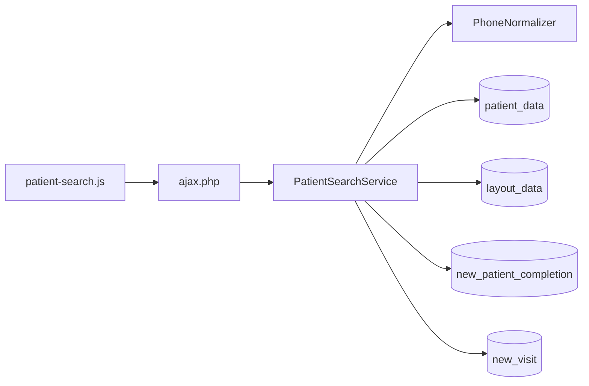

# Front Desk Search — Redesign Specification (M1a Patient Search)

| Field | Value |
|-------|--------|
| **Document version** | 1.0.10 |
| **Status** | **Approved for Phase 1 implementation** — design complete; PRD **M1a-F***, PAGE_DESIGNS §4.1, USER_WORKFLOWS §8.1 trace here |
| **Companion to** | [NEW_CLINIC_V1_PRD.md](./NEW_CLINIC_V1_PRD.md) (v1.20.48), [NEW_CLINIC_V1_PAGE_DESIGNS.md](../NEW_CLINIC_V1_PAGE_DESIGNS.md) (v0.6.48), [NEW_CLINIC_V1_USER_WORKFLOWS.md](../NEW_CLINIC_V1_USER_WORKFLOWS.md) (v1.9.48), [NEW_CLINIC_V1_PATIENT_REGISTRY_REDESIGN.md](./NEW_CLINIC_V1_PATIENT_REGISTRY_REDESIGN.md) (v0.2.2) |
| **Audience** | Product, design, backend engineers, frontend engineers, QA |
| **Scope** | **M1a** — unified patient search component + `PatientSearchService` + AJAX API |
| **Implementation** | Design spec; no code in this document |
| **Replaces** | Daily use of legacy **Finder** (`dynamic_finder.php`, `fin0`) and global `#anySearchBox` for reception workflows |
| **Does not replace** | [Patient Registry](./NEW_CLINIC_V1_PATIENT_REGISTRY_REDESIGN.md) (M10 cohort search) |

---

## Table of contents

1. [Purpose & positioning](#1-purpose--positioning)
2. [Current-state snapshot](#2-current-state-snapshot)
3. [Design goals](#3-design-goals)
4. [Scope & non-goals](#4-scope--non-goals)
5. [Resolved constants & contracts](#5-resolved-constants--contracts)
6. [Ranking algorithm](#6-ranking-algorithm)
7. [Phone normalization](#7-phone-normalization)
8. [Facility scope](#8-facility-scope)
9. [UI component `patient-search`](#9-ui-component-patient-search)
10. [Embed contexts by role](#10-embed-contexts-by-role)
11. [Backend: `PatientSearchService`](#11-backend-patientsearchservice)
12. [AJAX API contracts](#12-ajax-api-contracts)
13. [Security, ACL & rate limiting](#13-security-acl--rate-limiting)
14. [Performance & G7 telemetry](#14-performance--g7-telemetry)
15. [File plan & architecture](#15-file-plan--architecture)
16. [Implementation roadmap](#16-implementation-roadmap)
17. [Acceptance criteria](#17-acceptance-criteria)
18. [Open questions](#18-open-questions)
19. [Document history](#19-document-history)
20. [Appendix A — User stories](#appendix-a--user-stories)
21. [Appendix B — Test scenarios](#appendix-b--test-scenarios)
22. [Appendix C — Traceability matrix](#appendix-c--traceability-matrix)

---

## 1. Purpose & positioning

Reception’s default state is **search first** — not a blank registration form. Staff type a partial name, phone, MRN, NHIS number, or National ID and see forgiving matches in under 1.5 seconds.

This document is the **authoritative spec for M1a search only**. Registration form (M1b), profile completion (M1c), and start visit (M1d) are specified in [FRONT_DESK_REGISTRATION](./NEW_CLINIC_V1_FRONT_DESK_REGISTRATION_REDESIGN.md), PRD Module M1, and PAGE_DESIGNS §7.2; they **consume** search output (`pid`) but are out of scope here.

| Tool | Question | User |
|------|----------|------|
| **Front Desk search (this doc)** | “Which patient is this?” | Reception (primary), Nurse, Cashier, Admin |
| **Patient Registry (M10)** | “Who matches these cohort filters?” | Clinical leads, registry staff |
| **Legacy Finder** | Browse all patients in a DataTables grid | Hidden from daily menus **for reception roles only** (unconditional since the 2026-07-18 registry flag retirement); **clinical roles retain** the Finder until B7 MRD is habitual; break-glass URL remains (M10-F07, **D-COHORT-5** / **D-CTX-10**) |

---

## 2. Current-state snapshot

| Surface | Path | Problem |
|---------|------|---------|
| Finder menu | `interface/main/finder/dynamic_finder.php` | Column filters; exact-match bias; not search-first |
| Global search box | `#anySearchBox` → Finder | Same grid; wrong UX for queue pressure |
| Core `PatientService::getAll` | REST / services | Not tuned for SOUNDEX + regional phone formats |
| `manage_dup_patients.php` | Post-hoc dup tool | Dup logic exists in `getDupScoreSQL()` but not at search time |

**Module status:** `oe-module-new-clinic` not built. No `PatientSearchService` or `patient-search` component yet.

---

## 3. Design goals

1. **Forgiving match** — SOUNDEX on surname, normalized phone, tokenized name; no exact-only fallback.
2. **Fast** — P95 ≤ 1.5s on 10k patients (G7); correct patient in top 5 ≥ 95% of scripted attempts.
3. **One component, many hosts** — Same `patient-search` partial on Front Desk, Triage, Cashier, Admin with role-specific primary action.
4. **Facility-safe** — Respect `login_into_facility` and user facility assignments (M1a-F12).
5. **No PHI in URLs** — Search terms in POST body only (SEC04).
6. **Module search only** — Never call `dynamic_finder.php` from New Clinic pages (PRD §5.2).

---

## 4. Scope & non-goals

### 4.1 Phase 1 — in scope

| Item | Included |
|------|----------|
| `PatientSearchService::search()` | Ranking SQL + facility filter |
| `phone_normalized` column + triggers | Per PRD §12.3 |
| `PhoneNormalizer` utility | Shared with dup check |
| AJAX `patients.search` | Session auth + rate limit |
| AJAX `patients.preview` | Preview pane payload |
| Twig `patient-search` + `patient-search.js` | Debounce, keyboard, preview hook |
| Embed on `front-desk.php` | Auto-focus primary host |
| Embed on `triage.php` | Find patient / auto-start path |
| Unit + api tests | Phone parity (#5), facility IDOR (#10) |

### 4.2 Phase 1 — out of scope

| Item | Owner |
|------|-------|
| Registration form (4 sections) | M1b — [FRONT_DESK_REGISTRATION](./NEW_CLINIC_V1_FRONT_DESK_REGISTRATION_REDESIGN.md) · PAGE_DESIGNS §4.1.3 |
| Start visit transaction | M1d |
| Recent patients shortcut (M1a-F10) | Phase 1.1 (P2) |
| OAuth REST search | V1.1 |
| Patient Registry cohort filters | M10 |
| Barcode / wedge scanner on search field | PAGE_DESIGNS O-PD-2 (V1.1) |

---

## 5. Resolved constants & contracts

These resolve prior inconsistencies across PRD, PAGE_DESIGNS, and G7.

| Constant | Value | Where used |
|----------|-------|------------|
| **UI result limit** | **8** rows displayed | `patient-search` dropdown; PAGE_DESIGNS §4.1 |
| **Server score pool** | **25** candidates scored and sorted | `PatientSearchService`; implements M1a-F02 “max 25” |
| **G7 accuracy window** | **Top 5** | Pilot metric: known patient found in first 5 rows |
| **Min query length** | **2** characters | Client + server validation |
| **Debounce** | **250** ms | Client |
| **API transport** | `public/ajax.php?action=patients.search` (POST) | PRD §13.1 — **not** `/api/new/patients/search` |
| **Preview action** | `public/ajax.php?action=patients.preview` (POST) | This doc §12.2 |

**Rule:** Server always scores up to 25, returns top `min(limit, 8)` unless caller passes explicit `limit` ≤ 25 (Admin may request 25).

---

## 6. Ranking algorithm

Normative scoring for `PatientSearchService::search($q, $limit, $actor)`. Query `$q` is trimmed; empty or &lt; 2 chars returns validation error.

### 6.1 Query parsing

| Input pattern | Treatment |
|---------------|-----------|
| Mostly digits (`≥ 70%` digits) | Treat as **phone/ID mode**: normalize phone; also test `pubpid` exact if alphanumeric mix |
| Alphanumeric with spaces | **Name mode**: tokenize on whitespace; ignore tokens &lt; 2 chars |
| Single token | Name + `pubpid` startswith + layout ID fields |

### 6.2 Score weights (per patient row)

```text
score = 0
+ 100  if phone_normalized exact match (query normalized == column)
+  90  if pubpid exact match (case-insensitive)
+  85  if NHIS layout field exact match (stripped spaces)
+  85  if National ID layout field exact match
+  60  if pubpid startswith query
+  50  if NHIS or National ID startswith query
+  40  if SOUNDEX(lname) = SOUNDEX(query_token) AND fname startswith first token
+  35  if lname startswith any query token
+  30  if fname startswith any query token
+  20  if CONCAT(lname, ' ', fname) contains all tokens (order-independent)
+  10  if SOUNDEX(lname) = SOUNDEX(any query token) alone
```

Only rows with `score > 0` are returned.

### 6.3 Sort order

```text
ORDER BY score DESC,
         last_visit_date DESC NULLS LAST,
         lname ASC,
         fname ASC,
         pid ASC
LIMIT 25
```

`last_visit_date` = max `form_encounter.date` for patient (cached subquery or denormalized in search view Phase 1.1).

### 6.4 Post-processing

1. Apply facility scope filter (§8) **before** limit.
2. Trim to `limit` (default 8).
3. Attach display DTO: masked phone, completion %, active visit chip, scheduled chips (§9.4).

**Tuning:** Weights may be adjusted during pilot week 0 baseline if G7 top-5 rate &lt; 95%; changes require doc version bump.

---

## 7. Phone normalization

Shared utility: `OpenEMR\Modules\NewClinic\Services\PhoneNormalizer::normalize($raw, $countryCode = null)`.

| Step | Rule |
|------|------|
| 1 | Strip all non-digits |
| 2 | If starts with `country_code` (default `233` from `new_clinic_config.country_code`), strip it |
| 3 | If result does not start with `0` and length ≥ 9, prefix `0` (regional local default) |
| 4 | Store in `patient_data.phone_normalized` via triggers on INSERT/UPDATE of `phone_cell` (primary) and `phone_home` |

**Parity requirement (mandatory test #5):** `+233244001122`, `233244001122`, `0244 001 122` → canonical `0244001122`.

**Search:** User query normalized with same function before SQL compare.

---

## 8. Facility scope

Implements M1a-F12.

| Condition | Filter |
|-----------|--------|
| `login_into_facility` OFF | No facility filter (all patients user may see per core ACL) |
| `login_into_facility` ON | Patient must be linked to `$_SESSION['facilityId']` via `patient_facility` or equivalent core pattern used by patient list |
| User has multiple facilities | Union of `users_facility` / `facility_user_ids` |
| Break-glass | User with core `admin` or `super` **and** `new_clinic_config.search_all_facilities_for_admin = 1` (default **1**) searches all facilities |

Cross-facility patient access for non-admin returns **404** on preview/start (SEC03), not 403.

---

## 9. UI component `patient-search`

Canonical wireframe: PAGE_DESIGNS §4.1. This section adds search-specific behavior.

### 9.1 States

| State | UI |
|-------|-----|
| Idle | Placeholder: “Search by name, phone, NHIS, National ID, MRN” |
| Loading | Spinner in results panel; input stays enabled |
| Results | Up to 8 rows + optional preview pane |
| Empty | “No match. Try phone or NHIS, or [ + Add new patient ]” (host page supplies CTA) |
| Error | Inline banner from `error.message`; retry on next keystroke |

### 9.2 Keyboard

| Key | Action |
|-----|--------|
| `/` (Front Desk only) | Focus search |
| ↑ / ↓ | Move selection in results |
| Enter | Select row → update preview; double-Enter or host binding → primary action |
| Esc | Clear query and results |

### 9.3 Result row fields (M1a-F05)

| Field | Source |
|-------|--------|
| Full name | `lname`, `fname`, `mname` |
| Sex / age | `sex`, DOB; **estimated** badge if `new_patient_meta.dob_estimated=1` |
| Phone | Masked `0244 *** 9921`; full on hover if `patients` demo ACL |
| MRN | `pubpid` |
| Completion | `new_patient_completion.completion_score` + color ring |
| Last visit | Latest encounter date, relative if &lt; 30d |
| Active visit chip | Today’s `new_visit` if exists — `visit-chip` component |
| Scheduled chips | §9.4 — gated |

### 9.4 Scheduled chips (gated)

Only when `enable_scheduled_integration` ON and `disable_calendar` OFF (PAGE_DESIGNS §4.1.4).

| Chip | Click |
|------|-------|
| Appointment today | Enables **Start visit & check in** in host preview (M1d); shows **Suggested: Dr. {name}** when appointment `pc_aid` present (soft hint — PRD §6.5.1) |
| Recall due | Opens S1 Recall Worklist filtered to `pid` — read-only deep link (H1) |

### 9.5 Identifier field mapping

NHIS and National ID are stored in **layout_data** (regional demographics profile). Config keys in `new_clinic_config`:

| Key | Default `field_id` | Search |
|-----|-------------------|--------|
| `search_layout_nhis` | `nhis_no` | Exact / startswith on stripped value |
| `search_layout_national_id` | `national_id` | Exact / startswith |

M6 installer seeds layout field IDs for launch-region pilot; other regions update config without code change.

### 9.6 Pinned preview (V1.1-OPS — M1a-F13)

When `enable_pinned_reception_preview` = 1:

- Selected patient preview (`patient-context-banner` Tier 1) **remains visible** when user opens Registration form or Start visit panel.
- Preview collapses only when user clears selection, starts visit, or selects another patient.
- Normative host behavior: PAGE_DESIGNS §7.2.4.

### 9.7 Search selection switch (M1a-F14 — P0)

When user picks a **different** search result while Start visit panel has unsaved edits (visit type, urgent, CC, assign doctor):

| Step | Behavior |
|------|----------|
| 1 | Confirm modal: *“Discard changes and switch to {name} · MRN {id}?”* |
| 2 | **Cancel** — keep current selection |
| 3 | **Switch** — fire `patients.preview` for new `pid`; reset Start visit panel |

When Start visit panel is pristine: switch immediately. Preview always renders `patient-context-banner` Tier 1. Normative: PAGE_DESIGNS §7.2.6b, PRD §6.1i.

### 9.7b Registration form selection switch (M1a-F14b — P0)

When Registration form has unsaved fields (any section), selecting another result → confirm modal (same copy as §9.7). On **Switch**: discard form; load new preview. Normative: PAGE_DESIGNS §7.2.6c · [FRONT_DESK_REGISTRATION §3](./NEW_CLINIC_V1_FRONT_DESK_REGISTRATION_REDESIGN.md#3-registration-flow).

### 9.8 Cashier embed — visit_id resolution (M1a-F15 — P0)

On `cashier.php`, search is **lookup only**:

| API | Behavior |
|-----|----------|
| `cashier.resolve_search { pid }` | Returns `PatientPreviewDto` + `ready_for_payment_visits[]` |
| 0 visits in array | Preview + inline message — no `select_visit` |
| 1 visit | Client calls `select_visit { visit_id }` |
| >1 visits | **Pick visit** modal — user must choose `visit_id` |

**Never** call `take_payment` with `pid` only. Normative: PRD §6.1j, PAGE_DESIGNS §7.7.4b.

---

## 10. Embed contexts by role

| Host page | Role | Auto-focus | Primary action on row | Preview pane | Notes |
|-----------|------|------------|----------------------|--------------|-------|
| `front-desk.php` | Reception | **Yes** | Start visit (row CTA + preview) | Full §7.2.5 | Main host |
| `triage.php` | Nurse | On “Find patient” click | Start triage / auto-start modal | Safety + active visit | M3-F09 |
| `cashier.php` | Cashier | On click | Resolve **`visit_id`** then queue row | Identity + balance hint | M1a-F15 — lookup only |
| `admin.php` | Admin | On click | Open patient admin panel | Completion + dup flags | May pass `limit: 25` |

### 10.1 Multi-doctor clinics (PRD §6.5.1)

Front Desk search does **not** route patients to a specific doctor. Reception only identifies the patient and starts the visit.

| Action | Multi-doctor behavior |
|--------|----------------------|
| **Start visit** (walk-in) | `new_visit.assigned_provider_id` = NULL — any doctor may **Take patient** later |
| **Start visit & check in** (appointment today) | M0-F16 copies appointment **`pc_aid` → `assigned_provider_id`** as a **soft hint** only; visit still enters shared triage/doctor pool |
| Preview pane | When `appointment_today` chip active, show **Suggested provider** line (informational; not a reservation) |
| Active visit chip | Shows FSM state only — no doctor picker on search UI |

Nurse **Send to doctor** and Doctor Desk **All / Me** filter are specified in [USER_WORKFLOWS §8.3.1](../NEW_CLINIC_V1_USER_WORKFLOWS.md#831-multi-doctor-clinics), [§8.3.2](../NEW_CLINIC_V1_USER_WORKFLOWS.md#832-advisory-routing-v11), and [SCHEDULING §9.1a](./NEW_CLINIC_V1_SCHEDULING_REDESIGN.md#91a-front-desk-arrival-bridge-multi-doctor).

When `enable_advisory_routing` = 1, `routing_suggested_provider_id` is computed after triage — **not** at Front Desk search time.

When `enable_hard_provider_assignment` = 1, reception may **Assign doctor** on visit card (M1d-F08, PRD §6.5.3) — separate from appointment hint.

**Component props (Twig):**

```text
patient-search({
  host: 'front-desk' | 'triage' | 'cashier' | 'admin',
  show_preview: true | false,
  primary_action: 'start_visit' | 'start_triage' | 'open_payment' | 'open_admin',
  autofocus: boolean
})
```

---

## 11. Backend: `PatientSearchService`

**Class:** `OpenEMR\Modules\NewClinic\Services\PatientSearchService`

| Method | Description |
|--------|-------------|
| `search(string $q, int $limit = 8, ?int $facilityId = null): SearchResultDto` | Main entry; applies scope, scoring, DTO mapping |
| `preview(int $pid, int $actorUserId): PatientPreviewDto` | Full preview pane via `PatientContextService` (M0-F20); ACL + facility check; rendered by [`patient-context-banner` Tier 1](../NEW_CLINIC_V1_PAGE_DESIGNS.md#411-patient-context-banner-component-patient-context-banner) |
| `normalizeQuery(string $q): string` | Trim, collapse whitespace |

**Dependencies:** `PhoneNormalizer`, `PatientCompletionService` (score), `VisitQueryService` (active visit), optional `ScheduledIntegrationService` (chips).

**Does not use:** `dynamic_finder.php`, `patient_finder_exact_search` global.

**May use:** Patterns from `library/dupscore.inc.php` for SOUNDEX SQL fragments only — not the dup score itself for ranking.

### 11.1 SQL strategy

Phase 1: single parameterized query with computed score column (no Elasticsearch). Indexes per PRD §12.3: `lname`, `fname`, `phone_normalized`, `pubpid`, `DOB`.

Phase 1.1 (optional): materialized `new_patient_search_cache` with `last_visit_date` if profiling shows sort cost &gt; 200ms.

---

## 12. AJAX API contracts

Transport: PRD §13.1 envelope (PAGE_DESIGNS §6).

### 12.1 `POST patients.search`

**ACL:** `new_clinic` with any of `reception`, `triage`, `doctor`, `cashier`, `new_admin` (search is shared).

**Body:**

```json
{
  "q": "mensah 0244",
  "limit": 8,
  "csrf_token_form": "…"
}
```

**Success `data`:**

```json
{
  "patients": [
    {
      "pid": 123,
      "display_name": "Mensah, Akua",
      "sex": "Female",
      "age_years": 34,
      "dob_estimated": false,
      "phone_masked": "0244 *** 9921",
      "pubpid": "00123",
      "completion_score": 90,
      "completion_status": "complete",
      "last_visit_date": "2026-04-12",
      "last_visit_label": "12 Apr",
      "match_score": 100,
      "active_visit": {
        "visit_id": 456,
        "state": "waiting",
        "queue_number": 14,
        "visit_type_label": "OPD General"
      },
      "chips": {
        "appointment_today": true,
        "recall_due": false
      }
    }
  ],
  "total_scored": 3,
  "server_timing_ms": 142
}
```

**Errors:**

| Code | When |
|------|------|
| `validation` | `q` &lt; 2 chars |
| `rate_limited` | SEC06 exceeded |
| `forbidden` | ACL fail |
| `unauthorized` | Session expired |

### 12.2 `POST patients.preview`

**Returns:** `PatientPreviewDto` serialized (M0-F20) — same field contract as [PAGE_DESIGNS §4.11.1](../NEW_CLINIC_V1_PAGE_DESIGNS.md#4111-field-matrix--tier-1-always-on-banner). Preview pane Twig: `patient-context-banner` with `host: front-desk`.

**Body:** `{ "pid": 123, "csrf_token_form": "…" }`

**Success `data`:**

```json
{
  "identity": {
    "pid": 123,
    "display_name": "Mensah, Akua",
    "sex": "Female",
    "age_years": 34,
    "dob_estimated": false,
    "pubpid": "00123",
    "phone_masked": "0244 *** 9921",
    "photo_url": "/interface/…/document.php?…"
  },
  "safety": {
    "allergies_severe": ["Penicillin"],
    "allergies_undocumented": false,
    "problem_count": 2
  },
  "pediatric_dob_block": false,
  "completion": {
    "score": 90,
    "status": "complete",
    "nearest_missing_field": null
  },
  "active_visit": { "visit_id": 456, "state": "waiting", "queue_number": 14, "chief_complaint": "Headache" },
  "vitals_today": {
    "summary": "BP 120/80 · HR 72 · T 36.8 · SpO₂ 98",
    "vitals_missing_today": false,
    "vitals_abnormal_today": false,
    "vitals_breach_list": [],
    "pain_score": null
  },
  "last_visit": {
    "date": "2026-04-12",
    "provider_name": "Dr. Smith",
    "chief_complaint": "Headache"
  },
  "chips": {
    "appointment_today": true,
    "recall_due": false,
    "suggested_provider_name": "Dr. Mensah",
    "suggested_provider_id": 42
  },
  "actions": {
    "can_start_visit": true,
    "can_open_chart": true,
    "primary_action": "start_visit"
  }
}
```

### 12.3 Rate limiting (SEC06)

| Action | Default limit | Config key |
|--------|---------------|------------|
| `patients.search` | 30 req/min/user | `rate_limit_patients_search` |
| `patients.dup_check` | 60 req/min/user | `rate_limit_dup_check` |

Response: HTTP 429, `error.code = rate_limited`, header `Retry-After`.

---

## 13. Security, ACL & rate limiting

| Rule | Implementation |
|------|----------------|
| SEC04 | `q` only in POST JSON body |
| SEC03 | Facility scope on search + preview; wrong facility → 404 |
| SEC06 | Rate limiter middleware in `ajax.php` router |
| SEC08 | All labels via `xl()` |
| SEC10 | Do not log full `q` in audit; log `{ "len": N, "mode": "phone\|name" }` only |
| CSRF | Required on POST |

Audit event: `new_patient.search` with redacted payload (optional analytics).

---

## 14. Performance & G7 telemetry

| Metric | Target | Measurement |
|--------|--------|-------------|
| P95 latency | ≤ 1.5s @ 10k patients | `server_timing_ms` in response + server histogram |
| P95 @ 50k | ≤ 3s | Load test |
| Top-5 accuracy | ≥ 95% | Script 50 known patients with varied typo/phone formats |
| Dup check (separate) | &lt; 400ms P95 | DUP-F06 |

**G7 script (pilot):** `bin/benchmark-patient-search.php --patients=50 --db=staging`

Log to `new_clinic_config` or file histogram; no PHI in logs.

---

## 15. File plan & architecture

```
interface/modules/custom_modules/oe-module-new-clinic/
├── src/Services/
│   ├── PatientSearchService.php
│   ├── PhoneNormalizer.php
│   └── Dto/SearchResultDto.php, PatientPreviewDto.php
├── public/
│   ├── ajax.php                    # routes patients.search, patients.preview
│   └── assets/js/patient-search.js
├── templates/partials/
│   └── patient-search.twig
└── sql/
    └── install.sql                 # phone_normalized + indexes + config keys
```



---

## 16. Implementation roadmap

### Week 1 — Data layer

| Task | Deliverable |
|------|-------------|
| `install.sql` | `phone_normalized` + triggers + indexes |
| `PhoneNormalizer` | Unit tests for regional formats |
| `bin/phone-backfill.php` | Batched backfill |
| `PatientSearchService::search` | Scoring SQL + facility filter |

### Week 2 — API

| Task | Deliverable |
|------|-------------|
| `ajax.php` handlers | `patients.search`, `patients.preview` |
| Rate limiter | SEC06 |
| Api tests | Auth, validation, rate limit, facility IDOR |

### Week 3 — UI component

| Task | Deliverable |
|------|-------------|
| `patient-search.twig` + JS | Debounce, keyboard, 8-row dropdown |
| Wire `front-desk.php` | Auto-focus host |
| Empty state CTA hook | → Registration form (M1b stub OK) |

### Week 4 — Embed + hardening

| Task | Deliverable |
|------|-------------|
| Triage + Cashier embeds | Role primary actions |
| G7 benchmark script | Document results |
| Appendix B P0 smoke | QA sign-off |

---

## 17. Acceptance criteria

### 17.1 Search core (P0)

- [x] Auto-focus on Front Desk load (M1a-F01)
- [x] Debounced search; 8 rows UI / 25 scored server (M1a-F02)
- [x] SOUNDEX + phone + startswith ranking (M1a-F03)
- [x] Phone format parity (M1a-F04, test #5)
- [x] Row shows F05 fields (name, sex/age, phone, MRN, completion, last visit, active-visit CC)
- [x] Zero results → Add new patient CTA on Front Desk (M1a-F09)
- [ ] P95 ≤ 1.5s @ 10k (M1a-F11) — **open: needs pilot-scale G7 benchmark** (dev DB too small for a meaningful run; only remaining M1a item)
- [x] Facility scope (M1a-F12)
- [x] No `dynamic_finder.php` usage
- [x] POST-only query string (SEC04)
- [x] Rate limit 429 (SEC06) — `RateLimitService` (`rate_limit_patients_search`, default 30/min) + `RateLimitServiceTest`; `AjaxController` maps 429 → `rate_limited` envelope

### 17.2 Preview & embed (P1)

- [x] Preview pane on row select (M1a-F06)
- [x] Start visit on row CTA (M1a-F07)
- [x] Open full chart link (M1a-F08)
- [x] Triage Find patient embed works
- [x] Scheduled chips when integration ON

### 17.3 Regression

- [x] Dup check still independent (`patients.dup_check`)
- [x] Patient Registry not affected
- [x] Core `PatientService::insert` unchanged

---

## 18. Open questions

| ID | Question | Resolution (v1.0.0) |
|----|----------|---------------------|
| FD-S1 | UI 8 vs PRD 25 vs G7 top 5 | **Resolved §5:** score 25, show 8, measure top 5 |
| FD-S2 | API path `/api/new/...` vs ajax.php | **Resolved §5:** `ajax.php?action=patients.search` |
| FD-S3 | NHIS/National ID columns | **Resolved §9.5:** layout_data + config field IDs |
| FD-S4 | Recent patients (M1a-F10) | **Deferred** Phase 1.1 |
| FD-S5 | `last_visit_date` sort cost | **Deferred** — add cache table if profiling &gt; 200ms |

*No blocking open questions for Phase 1 implementation.*

---

## 19. Document history

| Version | Date | Author | Changes |
|---------|------|--------|---------|
| 1.0.10 | 2026-07-09 | **Implementation audit closure** — §17 SEC06 rate-limit ticked (`RateLimitService` + test, 429 → `rate_limited` envelope); M1a-F10 recent patients confirmed shipped (`front_desk.recently_viewed*` actions); sole open item: pilot-scale P95 benchmark (M1a-F11) |
| 1.0.9 | 2026-06-25 | **Q46** — cross-refs to Registration form (M1b); §9.7b Registration switch; replaces Quick Add terminology |
| 1.0.7 | 2026-06-17 | **§9.7b** Quick Add switch; **§9.8** cashier visit_id (M1a-F15); PRD v1.20.7 §6.1j |
| 1.0.6 | 2026-06-17 | **§9.7** search switch guard (M1a-F14); PRD v1.20.6 §6.1i |
| 1.0.5 | 2026-06-18 | Preview DTO vitals + active visit CC; §9.6 pinned preview (M1a-F13); companion refs v1.20.1 |
| 1.0.4 | 2026-06-17 | `PatientPreviewDto` + `PatientContextService` (M0-F20); preview pane uses `patient-context-banner` §4.11; PRD v1.17.0 |
| 1.0.3 | 2026-06-16 | §10.1 hard assignment (M1d-F08) when config ON |
| 1.0.2 | 2026-06-16 | §10.1 cross-ref §6.5.2; routing suggestion timing note |
| 1.0.1 | 2026-06-15 | Project team | **Multi-doctor (PRD §6.5.1):** §9.4 suggested provider chip; §10.1 arrival bridge; preview `chips.suggested_provider_*`; TS-M1a-4.3/4.4 |
| 1.0.0 | 2026-06-15 | Project team | Initial approved spec: ranking, API, embed matrix, roadmap, appendices |

---

## Appendix A — User stories

| ID | As a… | I want to… | So that… | Pri |
|----|-------|------------|----------|-----|
| M1a-US01 | receptionist | type partial name or phone and see matches instantly | I avoid duplicates | P0 |
| M1a-US02 | receptionist | search misspelled names | I find returning patients | P0 |
| M1a-US03 | receptionist | preview before committing | I confirm in one glance | P1 |
| M1a-US04 | receptionist | start visit from a result | the queue moves | P0 |
| M1a-US05 | nurse | find a patient from Triage | I can auto-start when desk was skipped | P1 |
| M1a-US06 | cashier | look up a patient by phone | I match the right payer | P1 |
| M1a-US07 | admin | search across facilities when authorized | I can support multi-site ops | P1 |

---

## Appendix B — Test scenarios

Minimum P0 smoke: **TS-M1a-1.1–1.4, 2.1–2.6, 3.1–3.3, 4.1–4.2**.

### TS-M1a-1 — Entry & UI

| ID | Steps | Expected |
|----|-------|----------|
| TS-M1a-1.1 | Open Front Desk | Search focused; empty illustration |
| TS-M1a-1.2 | Type 1 char | No request sent |
| TS-M1a-1.3 | Type 2+ chars | Results ≤ 1.5s; max 8 rows |
| TS-M1a-1.4 | No results | Add new patient CTA visible |

### TS-M1a-2 — Matching

| ID | Steps | Expected |
|----|-------|----------|
| TS-M1a-2.1 | Search known phone `0244…` | Patient in top row |
| TS-M1a-2.2 | Search `+233` format | Same patient (test #5) |
| TS-M1a-2.3 | Misspell surname (phonetic) | Patient in top 5 |
| TS-M1a-2.4 | Search `pubpid` | Exact match ranks high |
| TS-M1a-2.5 | Search NHIS number | Match when field populated |
| TS-M1a-2.6 | Active visit today | Chip on row |

### TS-M1a-3 — Security

| ID | Steps | Expected |
|----|-------|----------|
| TS-M1a-3.1 | POST without CSRF | 400 `csrf_invalid` |
| TS-M1a-3.2 | User facility A searches facility B patient | 404 on preview |
| TS-M1a-3.3 | 31 searches in 1 min | 429 rate_limited |

### TS-M1a-4 — Embed

| ID | Steps | Expected |
|----|-------|----------|
| TS-M1a-4.1 | Triage → Find patient | Same component; primary = triage |
| TS-M1a-4.2 | `enable_scheduled_integration` ON | Appointment chip on result |
| TS-M1a-4.3 | Appointment today with `pc_aid` set | Preview shows suggested provider; **Start visit & check in** sets `assigned_provider_id` hint (§10.1) |
| TS-M1a-4.4 | Walk-in start visit | `assigned_provider_id` NULL after create |

---

## Appendix C — Traceability matrix

| M1a-F | Requirement | M1a-US | TS (P0) | § |
|-------|-------------|--------|---------|---|
| F01 | Unified input + autofocus | US01 | TS-M1a-1.1 | §9 |
| F02 | Debounce + limits | US01 | TS-M1a-1.3 | §5 |
| F03 | Fuzzy/phonetic | US02 | TS-M1a-2.3 | §6 |
| F04 | Phone normalized | US01 | TS-M1a-2.1–2.2 | §7 |
| F05 | Row fields | US01 | TS-M1a-2.6 | §9.3 |
| F06 | Preview pane | US03 | — | §12.2 |
| F07 | Start visit CTA | US04 | — | §10 |
| F08 | Open chart | US04 | — | §10 |
| F09 | Add new CTA | US01 | TS-M1a-1.4 | §9.1 |
| F11 | Performance | US01 | TS-M1a-1.3 | §14 |
| F12 | Facility scope | US07 | TS-M1a-3.2 | §8 |
| SEC04 | No PHI in URL | — | — | §13 |
| SEC06 | Rate limit | — | TS-M1a-3.3 | §12.3 |
| Test #5 | Phone parity | — | TS-M1a-2.2 | §7 |
| G7 | Top 5 accuracy | US02 | TS-M1a-2.3 | §14 |
