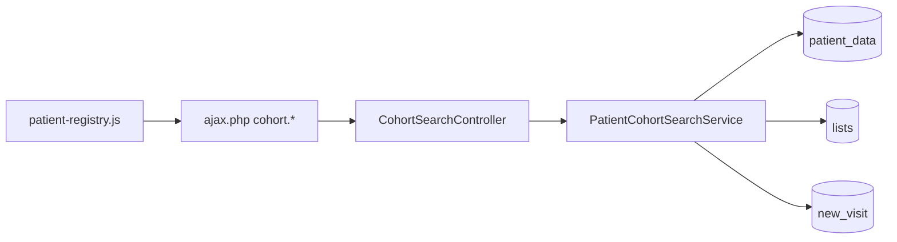

# Patient Registry — Redesign Specification (Cohort Search)

| Field | Value |
|-------|--------|
| **Document version** | 0.2.3 |
| **Status** | **Built + always-on** — **Module M10** / **V1.1-REG**; `enable_patient_registry` **retired 2026-07-18** (PRD §5.6 amendment) — no legacy fallback, reception Finder hide is role-based only; wireframes in [PAGE_DESIGNS §7.32](../NEW_CLINIC_V1_PAGE_DESIGNS.md#732-patient-registryphp--patient-registry) |
| **Companion to** | [NEW_CLINIC_V1_PRD.md](./NEW_CLINIC_V1_PRD.md) (v1.20.49), [NEW_CLINIC_V1_PAGE_DESIGNS.md](../NEW_CLINIC_V1_PAGE_DESIGNS.md) (v0.6.49), [NEW_CLINIC_V1_FRONT_DESK_SEARCH_REDESIGN.md](./NEW_CLINIC_V1_FRONT_DESK_SEARCH_REDESIGN.md) (v1.0.7), [NEW_CLINIC_V1_USER_WORKFLOWS.md](../NEW_CLINIC_V1_USER_WORKFLOWS.md) (v1.9.49), [NEW_CLINIC_V1_REPORTING_OPERATIONS_REDESIGN.md](./NEW_CLINIC_V1_REPORTING_OPERATIONS_REDESIGN.md) (v0.1.3), [NEW_CLINIC_V1_LEGACY_CHART_CONTEXT_REDESIGN.md](./NEW_CLINIC_V1_LEGACY_CHART_CONTEXT_REDESIGN.md) (v0.1.2) |
| **Audience** | Product, design, clinical leads, program managers, frontend engineers, QA |
| **Scope** | Replace legacy **Patient Finder** (`dynamic_finder.php`) with a **Patient Registry** cohort-search experience — structured filters, auditable exports, Ghana-realistic defaults |
| **Primary market** | Private outpatient clinics — **Ghana & West Africa** |
| **Implementation** | Design spec only — no code in this document |

---

## Table of contents

1. [Purpose & positioning](#1-purpose--positioning)
2. [Research — OpenEMR Finder pain points](#2-research--openemr-finder-pain-points)
3. [Research — UI/UX principles for cohort search](#3-research--uiux-principles-for-cohort-search)
4. [Research — how leading EHRs address patient registry](#4-research--how-leading-ehrs-address-patient-registry)
5. [Research — Ghana & West Africa context](#5-research--ghana--west-africa-context)
6. [Comprehensive redesign summary](#6-comprehensive-redesign-summary)
7. [Scope & non-goals](#7-scope--non-goals)
8. [Page layout & wireframes](#8-page-layout--wireframes)
9. [Filter catalog](#9-filter-catalog)
10. [Clinical definitions & query rules](#10-clinical-definitions--query-rules)
11. [Filter logic (AND / OR)](#11-filter-logic-and--or)
12. [Presets & saved filters](#12-presets--saved-filters)
13. [Results table & row actions](#13-results-table--row-actions)
14. [Data model & backend](#14-data-model--backend)
15. [AJAX API contracts](#15-ajax-api-contracts)
16. [Navigation & legacy Finder cutover](#16-navigation--legacy-finder-cutover)
17. [Security, ACL & audit](#17-security-acl--audit)
18. [Accessibility & mobile](#18-accessibility--mobile)
19. [Performance & indexes](#19-performance--indexes)
20. [File plan & architecture](#20-file-plan--architecture)
21. [Phasing & PRD alignment](#21-phasing--prd-alignment)
22. [Acceptance criteria & training](#22-acceptance-criteria--training)
23. [Closed decisions](#23-closed-decisions)
24. [Document history](#24-document-history)
25. [Appendix A — User stories](#appendix-a--user-stories)
26. [Appendix B — Test scenarios](#appendix-b--test-scenarios)
27. [Appendix C — Example query (malaria adolescents)](#appendix-c--example-query-malaria-adolescents)

---

## 1. Purpose & positioning

### 1.1 What this document is for

Clinic leads need to answer *“Which adolescents had lab-confirmed malaria this season?”* or *“Who has incomplete profiles and no visit in six months?”* — not *“Type ‘Mensah’ in column 3.”*

Stock OpenEMR’s **Patient Finder** is a demographics **DataTable** with per-column text boxes. It answers browse-by-column, not **clinical cohort** questions. Reception already gets a modern **Front Desk search** (M1a); doctors still open **Finder** for program work and inherit US-centric grid UX, no age-at-diagnosis semantics, and no audit trail on exports.

This spec defines **M10 — Patient Registry**: a T1-shell cohort search page with structured filters, server-side pagination, explicit confirmation-source semantics, facility scope, and CSV export — **separate** from daily walk-in lookup.

**Trainer one-liner:** *“**Front Desk search** finds **one person** at the door; **Patient Registry** finds **everyone who matches a rule** for outreach, audits, and program reports.”*

### 1.2 Problem statement (Ghana private OPD)

> The nurse incharge must submit a malaria case list to the district coordinator. She opens stock **Finder**, types “malaria” in a problem column that does not exist, exports the whole patient list to Excel, and manually filters ages in a spreadsheet for two hours. Meanwhile reception uses **Front Desk search** for walk-ins — but the clinical lead still bookmarks **Finder** because the menu says so. A deceased patient appears on the outreach SMS list because nobody remembered to filter `deceased_date`. The owner cannot prove who ran the query last Tuesday.

### 1.3 Positioning vs other search surfaces

| Surface | Question | Results | User |
|---------|----------|---------|------|
| **Front Desk `patient-search`** (M1a) | “Who is this person?” | Top 8, one primary action | Reception daily |
| **Patient Registry** (M10) | “Who matches these rules?” | Paginated cohort, export | Doctor, nurse incharge, admin, program lead |
| **`find_patient_popup.php`** | “Pick one patient in a form” | Modal list | Legacy embeds (calendar, messages) |
| **M7 Daily Reports** | “How many / how much **today**?” | Aggregates | Manager |
| **M16 Reporting Hub — Clinical lens** | “Facility-wide immunization / diagnosis **report**?” | Pre-built report + export | Manager, public-health liaison |

```text
Walk-in at desk        →  M1a Front Desk search (fuzzy, fast)
Cohort for outreach    →  M10 Patient Registry (structured, audited)
Clinic-wide MOH report →  M16 Reporting Hub (aggregate, periodic)
Pick patient in form     →  find_patient_popup (legacy — unchanged V1)
```

**Closed (D-COHORT-4):** Do **not** merge Registry into Front Desk or M7.

### 1.4 Product name & menu

| Element | Value |
|---------|-------|
| Menu path | **Clinic → Patient Registry** |
| Page URL | `/interface/modules/custom_modules/oe-module-new-clinic/public/patient-registry.php` |
| Page title | `Patient Registry` |
| Legacy Finder menu (`fin0`) | Hidden for **reception roles** (unconditional since the 2026-07-18 flag retirement); clinical roles retain Finder (**D-COHORT-5**, **D-CTX-10**) |
| Wireframes | [PAGE_DESIGNS §7.32](../NEW_CLINIC_V1_PAGE_DESIGNS.md#732-patient-registryphp--patient-registry) |

---

## 2. Research — OpenEMR Finder pain points

Evidence from stock codebase audit (`interface/main/finder/dynamic_finder.php`, `dynamic_finder_ajax.php`, `standard.json` `fin0`, `tabs/main.php` `#anySearchBox`, `PatientFinderFilterEvent`).

### 2.1 Information architecture

| Pain | Evidence | Ghana OPD impact |
|------|----------|------------------|
| **Wrong mental model** | Page title *Patient Finder*; menu label *Finder* | Staff think “find one patient” — same word as Front Desk |
| **Column filters ≠ cohort rules** | Header row of `<input>` per `ptlistcols` column | Cannot express “age **at malaria diagnosis** 12–19” |
| **Demographics-only core** | AJAX builds SQL on `patient_data` columns | Clinical filters need joins to `lists`, `procedure_result`, `billing` |
| **Global search routes here** | `#anySearchBox` → Finder with `search_any` | Reception bypasses M1a if global box still wired |
| **No record-status control** | Deceased/inactive not a first-class filter | Outreach lists include deceased patients |
| **No export audit** | DataTables export is ad hoc | Compliance cannot answer “who exported this list?” |

### 2.2 `dynamic_finder.php` UX

| Pain | Evidence | Ghana OPD impact |
|------|----------|------------------|
| **DataTables column reorder** | ColReorder plugin; column order ≠ filter semantics | Training nightmare on shared PCs |
| **Per-column “Search by Name”** | `search_init` placeholders on every column | Mobile: unusable filter row |
| **Exact-search toggle** | `patient_finder_exact_search` user setting | “Mensah” vs “Mansa” fails without SOUNDEX (M1a has this; Finder does not) |
| **Date filter ambiguity** | `dateSearch()` partial date parsing (US MDY bias) | DOB / registration filters error-prone |
| **Popup mode** | `?popup=1` for embeds | Different code path — out of M10 scope |
| **No facility scope UI** | Relies on global multi-site config | Multi-facility admin sees unscoped data |

### 2.3 `dynamic_finder_ajax.php` backend

| Pain | Evidence | Ghana OPD impact |
|------|----------|------------------|
| **No CSRF on read** | Comment: cookie SameSite sufficient | Inconsistent with New Clinic `ajax.php` policy |
| **String `LIKE` on all columns** | `sSearch` OR across columns | Slow at 50k+ patients; unpredictable matches |
| **No clinical joins in default path** | Problem/lab filters need extensions | Malaria-by-lab requires custom SQL or Excel |
| **No query explanation** | Returns rows only | Auditor cannot see “lab positive, age 12–19” summary |
| **Extension-only customization** | `PatientFinderFilterEvent` / `ColumnFilter` | Per-site PHP — not teachable presets |

### 2.4 Adjacent stock surfaces (do not conflate)

| Surface | Role vs M10 |
|---------|-------------|
| `find_patient_popup.php` | Single-select modal — keep for calendar/messages |
| `manage_dup_patients.php` | Duplicate scoring — M1a uses at create time |
| `interface/reports/*.php` | Aggregate reports — M16 hub curates these |
| REST `PatientService::getAll` | API pagination — not cohort semantics |

### 2.5 What we keep from stock

| Asset | Use in M10 |
|-------|------------|
| `patient_data`, `lists`, `form_encounter`, `billing` | Read-only cohort joins |
| `procedure_order` / `procedure_result` | Lab confirmation (Phase 3) |
| `new_visit`, `new_patient_completion` | Module visit/completion filters |
| ACL `patients` + `demo` | Baseline read |
| `dynamic_finder.php` direct URL | Break-glass admin bookmark when menu hidden |

---

## 3. Research — UI/UX principles for cohort search

Aligned with T1 shell, M1a search, M16 reporting, and Chart Depth patterns.

| ID | Principle | Registry application |
|----|-----------|-------------------|
| **C1** | **Intent-first filters** | Group filters: Record status → Demographics → Clinical → Visit/schedule — not spreadsheet columns |
| **C2** | **Explicit semantics** | **Confirmation source** dropdown whenever condition/ICD set — user owns cohort definition |
| **C3** | **Safe defaults** | **Active patients only**; **This clinic** facility scope |
| **C4** | **Progressive disclosure** | Phase 1 demographics visible; clinical accordion collapsed until expanded |
| **C5** | **Apply, don’t live-search** | **Apply** button — avoids accidental 50k-row queries on every keystroke |
| **C6** | **Explain the cohort** | Banner: human-readable `filter_summary` + match count + `excluded_missing_dob` |
| **C7** | **Auditable export** | CSV requires confirm modal; `new_registry.export` audit with row count |
| **C8** | **No PHI in URLs** | Filters in POST JSON only (SEC04) |
| **C9** | **Presets over memory** | Built-in chips: *In clinic now*, *Incomplete profiles*, *Malaria lab 90d* |
| **C10** | **Row → action, not drill maze** | ⋯ menu: Open chart, Start visit, Visit Board filter — ≤2 clicks to chart |
| **C11** | **Large-set warning** | Banner when &gt;10,000 matches or export cap approached |
| **C12** | **Accessible status** | Record status and confirmation source: native `<select>` or accessible combobox |
| **C13** | **Mobile-realistic** | Filters accordion; results cards on `sm`; export in overflow |
| **C14** | **Separate from daily search** | No Registry link on Front Desk; training forbids Finder for cohorts |

---

## 4. Research — how leading EHRs address patient registry

Patterns from **Epic SlicerDicer / Cadence cohort tools**, **Cerner PowerChart patient lists**, **athenahealth population groups**, **OpenMRS Cohort Module**, **Bahmni patient lists**, **Helium Health** (West Africa SaaS). Not feature parity — UX pattern library.

| Need | Typical pattern | New Clinic M10 mapping |
|------|-----------------|------------------------|
| **Population vs single patient** | Distinct “Patient Lookup” vs “Patient List Builder” | M1a vs M10 (D-COHORT-4) |
| **Filter groups** | Demographics + diagnosis + meds + labs with AND/OR | §9 groups; AND across, OR within (D-COHORT-6) |
| **Index event date** | “Age at diagnosis” relative to index encounter | §10.2 age at diagnosis |
| **Confirmation / evidence** | Problem list vs lab vs billing diagnosis | §10.1 confirmation source |
| **Saved searches** | Private + shared lists | Phase 3 `new_cohort_saved_filter` |
| **Export with audit** | Who exported what when | `new_registry.export` |
| **Active/deceased toggle** | Default active panel | §9.1 record status (D-COHORT-3) |
| **Facility scope** | Login facility default | §9.3 |
| **Preset program lists** | EPI defaulters, chronic disease panels | §12.1 Ghana seeds |
| **Drill to chart** | Row action → chart | Open MRD / full chart |
| **Defer BI complexity** | No Tableau for 10-bed clinic | CSV + Excel sufficient V1 |

**Regional SaaS pattern:** Vendor runs cohort reports on request. **New Clinic differentiation:** clinic-owned Registry with MOH-friendly exports and optional handoff to **M16** for facility-wide periodic reports.

---

## 5. Research — Ghana & West Africa context

### 5.1 Who uses the Registry

| Actor | Typical cohort tasks |
|-------|---------------------|
| **Nurse incharge / clinical lead** | Malaria / TB case lists, adolescent ANC defaulters, immunization catch-up |
| **Doctor / medical director** | Hypertension/diabetes panel review, lost-to-follow-up |
| **Reception lead** | Incomplete profiles before NHIS audit |
| **Clinic owner** | Active-patient count by registration window, outreach SMS lists |
| **District coordinator (external)** | Receives CSV export — does not log into EMR |

### 5.2 Regional identifiers & demographics

| Field | Registry filter | Notes |
|-------|-----------------|-------|
| **NHIS membership number** | Text filter Phase 1 | Cash clinics still capture for insured subset |
| **Ghana Card / National ID** | Text filter Phase 1 | Registration form Section 2 parity with M1a |
| **Phone (`phone_normalized`)** | Text — normalized | Shared `PhoneNormalizer` with M1a |
| **Estimated DOB** | Badge `~` on age columns | Common for adults without exact DOB |
| **Region / city** | Phase 2 select | Greater Accra, Ashanti, etc. — M6 seed |
| **Tribe / language** | Out of V1 golden path | Optional demographics layout — not cohort default |

### 5.3 Clinical program examples (preset seeds)

| Program | Typical filters | Confirmation |
|---------|-----------------|--------------|
| **Malaria surveillance** | ICD B50–B54, diagnosis date window, age at dx | Lab positive preferred |
| **ANC defaulters** | Condition pregnancy, last visit &gt; 28d | Problem active |
| **Hypertension panel** | ICD I10–I15, age today ≥40 | Problem ever |
| **Incomplete registration** | Completion &lt;70%, active | Demographics only |
| **In clinic now** | `new_visit` active today | Module field |

### 5.4 Connectivity & export realism

| Constraint | Design response |
|------------|-----------------|
| Intermittent 3G | Server-side pagination; no client-side 50k rows |
| Excel workflow | CSV export cap 5,000 — manager refines filters |
| SMS outreach | Phase 3 row action → MedEx when COM enabled |
| DHIMS2 national returns | **M16 / NG8 V2.2** — not M10 per-patient cohort |
| Shared clinic PC | Apply button + audit — no accidental scroll export |

### 5.5 Training pitfalls (Ghana pilots)

| Pitfall | Prevention |
|---------|------------|
| Reception uses Registry for walk-ins | M1a on desk; Finder menu hidden; §17.7 trainer row |
| Confuse with Message Center search | USER_WORKFLOWS §8.1d |
| Export deceased for SMS | Default **Active patients only** |
| “Malaria” without lab vs problem | Force confirmation source when condition set |

---

## 6. Comprehensive redesign summary

| Layer | Delivers |
|-------|----------|
| **T1 shell page** | `patient-registry.php` — filter rail + results grid |
| **`PatientCohortSearchService`** | Parameterized SQL; no `dynamic_finder_ajax` extension |
| **Filter panel** | Record status, demographics, clinical (P2), visit/module, presets |
| **Results table** | Server pagination; sort; masked phone; condition summary |
| **Row actions** | Open chart, Visit Board deep-link, Start visit (P2) |
| **AJAX `cohort.*`** | `cohort.search`, `cohort.export`, `cohort.presets` — §15 |
| **Menu cutover** | Hide `fin0`; optional global search redirect to M1a |
| **Audit** | `new_registry.search`, `new_registry.export` |

**Phasing:** PR-1 demographics + status; PR-2 clinical + presets + CSV; PR-3 labs + saved filters.

Normative wireframes and per-control acceptance: [PAGE_DESIGNS §7.32](../NEW_CLINIC_V1_PAGE_DESIGNS.md#732-patient-registryphp--patient-registry).

---

## 7. Scope & non-goals

### 7.1 In scope

| Phase | Deliverable |
|-------|-------------|
| **PR-1** | Filter panel (demographics, patient status, facility, completion, visits); paginated results; open chart |
| **PR-2** | Condition filters (problem list, ICD, confirmation source); scheduling/recall filters; export CSV |
| **PR-3** | Lab confirmation filters; saved named filters; admin shared presets |

### 7.2 Out of scope

- Replacing `find_patient_popup.php` (Phase 4+ optional `PatientPickerDialog`)
- Insurance / EDI cohorts (cash clinic profile)
- Real-time dashboard widgets (M7 reports stay separate)
- Patient-facing portal search
- ML / natural-language query
- Forking `patient_data` or parallel patient index

---

## 8. Page layout & wireframes

**Normative build spec:** [PAGE_DESIGNS §7.32](../NEW_CLINIC_V1_PAGE_DESIGNS.md#732-patient-registryphp--patient-registry) — URL, ACL, AJAX, acceptance.

### 8.1 Desktop layout (summary)

```text
┌─ T1 shell ───────────────────────────────────────────────────────────────────┐
│ Page heading: Patient Registry                    [ ⟳ Refresh ] [ Export ]  │
├─────────────────────────────────────────────────────────────────────────────┤
│ FILTERS (collapsible left rail 320px, or top accordion on tablet)           │
│ ┌─ Patient status ──────────────────────────────────────────────────────┐   │
│ │ Record status: [ Active patients only ▾ ]                              │   │
│ └──────────────────────────────────────────────────────────────────────┘   │
│ ┌─ Demographics ────────────────────────────────────────────────────────┐   │
│ │ Age at diagnosis: [12] to [19]   Sex: [ Any ▾ ]                       │   │
│ │ Registration: [from] [to]    Facility: [ This clinic ▾ ]              │   │
│ └──────────────────────────────────────────────────────────────────────┘   │
│ ┌─ Clinical (PR-2) ───────────────────────────────────────────────────┐   │
│ │ Condition: [ Malaria ▾ ]  Confirmation: [ Lab positive ▾ ]            │   │
│ │ Diagnosis date: [from] [to]                                           │   │
│ └──────────────────────────────────────────────────────────────────────┘   │
│ [ Apply ]  [ Clear ]  [ Save filter… ]     Presets: [ Adolescents ▾ ]       │
├─────────────────────────────────────────────────────────────────────────────┤
│ 847 patients match · sorted by last name          🔍 Filter results…        │
│ ┌───────────────────────────────────────────────────────────────────────┐   │
│ │ Name          Age@Dx  Sex  MRN    Condition      Last visit  Actions  │   │
│ │ Akua Mensah   14      F    00123  Malaria (lab+) 12 Apr 2026  [⋯]    │   │
│ └───────────────────────────────────────────────────────────────────────┘   │
│ « 1–25 of 847 »                                                             │
└─────────────────────────────────────────────────────────────────────────────┘
```

### 8.2 Empty & error states

| State | Message |
|-------|---------|
| No filters applied | “Set filters and click **Apply** to search the registry.” |
| Zero results | “No patients match these filters. Try widening age range or confirmation source.” |
| &gt; 10,000 matches | Warning: “Large result set — refine filters or export may be capped.” |
| ACL denied | “You do not have permission to run registry searches.” |
| Query timeout | “Search took too long — narrow date range or add more filters.” |

---

## 9. Filter catalog

All filters available in UI; **Phase** column indicates when implemented.

### 9.1 Patient record status (always visible, top of panel)

| Filter | Control | Options | Default | Phase |
|--------|---------|---------|---------|-------|
| **Record status** | Dropdown | See §9.1.1 | **Active patients only** | **PR-1** |

#### 9.1.1 Record status options

| Option | SQL semantics |
|--------|----------------|
| **Active patients only** | `deceased_date` IS NULL OR empty; exclude inactive per site config |
| **Include inactive** | No inactive exclusion; still exclude deceased unless All |
| **Deceased only** | `deceased_date` IS NOT NULL |
| **All patients** | No deceased/inactive filter |

### 9.2 Demographics & identity

| Filter | Control | Phase |
|--------|---------|-------|
| Age at diagnosis (from / to) | Number 0–120 | PR-2 (hidden until clinical group used) |
| Age today (from / to) | Number | PR-1 |
| Sex | Any / M / F / O | PR-1 |
| Date of birth (range) | Date from – to | PR-1 |
| Estimated DOB | Any / estimated only / exact only | PR-2 |
| Name contains | Text | PR-1 |
| MRN (`pubpid`) | Text | PR-1 |
| Phone | Text (normalized) | PR-1 |
| NHIS number | Text | PR-1 |
| National ID | Text | PR-1 |
| City / region | Text or select | PR-2 |
| Registration date | Date from – to | PR-1 |

### 9.3 Facility & provider

| Filter | Control | Phase |
|--------|---------|-------|
| Facility scope | This clinic / selected / all (admin) | PR-1 |
| Primary provider | User select — `patient_data.providerID` | PR-2 |
| Visit assigned provider | `new_visit.assigned_provider_id` | PR-2 |
| Hard-assigned provider | `new_visit.hard_assigned_provider_id` (V1.2) | PR-2 |
| Routing suggested provider | `new_visit.routing_suggested_provider_id` (advisory) | PR-2 |

### 9.4 New Clinic module fields

| Filter | Control | Phase |
|--------|---------|-------|
| Profile completion % | Min – max slider | PR-1 |
| Completion bucket | &lt;40 / 40–69 / ≥70 / 100% | PR-1 |
| Active visit today | Yes / No / Any | PR-1 |
| Visit state | Multi-select | PR-2 |
| Visit type | Select | PR-2 |
| Visit date range | Date from – to | PR-2 |
| Payment status | Paid / outstanding / any | PR-2 |

### 9.5 Clinical — conditions & diagnoses (PR-2)

| Filter | Control |
|--------|---------|
| Condition (friendly) | Autocomplete (`new_condition_map`) |
| ICD-10 code | Code picker; `B50.*` wildcard |
| Problem title contains | Text |
| **Confirmation source** | Dropdown — §10.1 |
| Problem list status | Active / resolved / any |
| Diagnosis date (index event) | Date from – to |
| Linked to encounter | Yes / No / Any |
| Allergy present | Substance search (PR-3) |
| Medication present | Drug search (PR-3) |

### 9.6 Clinical — labs (PR-3)

| Filter | Control |
|--------|---------|
| Lab test | Test name / LOINC / local code |
| Lab result | Positive / negative / any |
| Lab result date | Date from – to |

### 9.7 Scheduling & recalls (PR-2)

| Filter | Control |
|--------|---------|
| Appointment today | Yes / No / Any |
| Appointment date range | Date from – to |
| Recall due | Overdue / due soon / any |
| Recall date range | Date from – to |
| Last visit (any encounter) | Date from – to / never |

### 9.8 Communications (PR-3)

| Filter | Control |
|--------|---------|
| Unread staff message | Yes / No |
| Open dated reminder | Yes / No |

---

## 10. Clinical definitions & query rules

### 10.1 Confirmation source (user-selectable)

When **condition** or **ICD** filter is set, user must choose **Confirmation source**:

| Value | Label | Match rule |
|-------|-------|------------|
| `problem_active` | Problem list — active | `lists.type='medical_problem'`, `activity=1`, active date window |
| `problem_ever` | Problem list — ever recorded | Any matching `lists` row |
| `lab_positive` | Lab — positive result | Matching `procedure_result` abnormal/positive (PR-3) |
| `encounter_diagnosis` | Encounter billing diagnosis | `billing` diag on encounter (PR-3) |
| `any_source` | Any source (union) | OR across problem + lab + billing |

**Default when condition set:** `problem_active`.

UI copy: *“Confirmation source determines how ‘malaria’ is verified. Choose **Lab — positive result** for strongest confirmation.”*

### 10.2 Age at diagnosis date

```text
age_at_diagnosis_years = floor( months_between(DOB, index_diagnosis_date) / 12 )
```

| Rule | Definition |
|------|------------|
| **Index diagnosis date** | Problem: `lists.begdate`. Lab: `procedure_report.date_collected`. Encounter: `form_encounter.date` with matching billing diag. |
| **Multiple matches** | **Earliest** matching index within diagnosis window (PR-3 toggle: Earliest vs Latest) |
| **Missing DOB** | Exclude; meta `excluded_missing_dob` count |
| **Estimated DOB** | Include with `~` badge |

### 10.3 Condition matching

| Match type | Rule |
|------------|------|
| ICD-10 | `lists.diagnosis` LIKE `ICD10:B50%` OR billing fields |
| Friendly condition | `new_condition_map` ICD prefixes + title LIKE |
| Problem active | Standard OpenEMR active problem window |

### 10.4 Malaria preset mapping

| Confirmation source | Data |
|--------------------|------|
| Problem active | `lists` medical_problem, ICD10 B50–B54 or title %malaria% |
| Lab positive | Local malaria RDT / smear codes (M6 lab config) |

---

## 11. Filter logic (AND / OR)

| Level | Rule |
|-------|------|
| **Across groups** | **AND** |
| **Within multi-select** | **OR** |
| **`any_source`** | **OR** inside clinical group only |
| **Empty filter** | Ignored |

PR-3 advanced: toggle **Match all clinical sources (AND)** vs **Any (OR)**.

---

## 12. Presets & saved filters

### 12.1 Built-in presets (PR-1)

| Preset ID | Filters applied |
|-----------|-----------------|
| `incomplete_profiles` | Completion &lt;70%, Active |
| `in_clinic_now` | Active visit today |

### 12.1b Built-in presets (PR-2)

| Preset ID | Filters applied |
|-----------|-----------------|
| `adolescents` | Age at diagnosis 12–19, Active |
| `malaria_active` | Malaria, `problem_active` |
| `malaria_lab` | Malaria, `lab_positive`, lab date last 90d |
| `recall_overdue` | Recall overdue, Active |
| `ready_for_doctor_today` | Visit state = `ready_for_doctor` |
| `my_patients_in_clinic` | Active visit + provider fields match current user |
| `lost_to_followup` | Last visit &gt;180 days, Active |

### 12.2 Saved filters (PR-3)

| Property | Rule |
|----------|------|
| Storage | `new_cohort_saved_filter` |
| Scope | Private; **Clinic shared** with `new_cohort_share_filter` |
| Payload | JSON filter form state |

---

## 13. Results table & row actions

### 13.1 Default columns

| Column | Phase | Notes |
|--------|-------|-------|
| Name | PR-1 | Link to MRD |
| Age at diagnosis | PR-2 | When index date used |
| Sex | PR-1 | |
| MRN | PR-1 | |
| Primary phone (masked) | PR-1 | `0244 *** 9921` |
| Condition summary | PR-2 | e.g. “Malaria (lab+)” |
| Index diagnosis date | PR-2 | |
| Completion % | PR-1 | Ring + % |
| Last visit | PR-2 | |
| Facility | PR-2 | When scope = all |
| Actions | PR-1 | ⋯ menu |

### 13.2 Row actions (⋯)

| Action | ACL | Phase |
|--------|-----|-------|
| Open full chart | `patients` demo | PR-1 |
| Open MRD Overview | demo | PR-1 |
| Start visit | `new_reception` / configured | PR-2 |
| Open Visit Board (patient) | `new_visit_board` | PR-2 |
| Open recall worklist | scheduling | PR-2 |
| Send SMS | MedEx + phone | PR-3 |

### 13.3 Sort & pagination

- Server-side: 25 / 50 / 100 per page
- Sort: name, age, last visit, completion, index diagnosis date
- Max export: **5,000 rows**

---

## 14. Data model & backend

### 14.1 Core tables (read-only)

`patient_data`, `lists`, `issue_encounter`, `form_encounter`, `billing`, `procedure_order` / `procedure_result`, `medex_recalls`, `openemr_postcalendar_events`, `new_visit`, `new_patient_completion`.

### 14.2 New module tables

```sql
CREATE TABLE new_cohort_saved_filter (
  id BIGINT AUTO_INCREMENT PRIMARY KEY,
  user_id BIGINT NOT NULL,
  name VARCHAR(80) NOT NULL,
  filter_json JSON NOT NULL,
  is_shared TINYINT(1) DEFAULT 0,
  created_at DATETIME DEFAULT CURRENT_TIMESTAMP,
  updated_at DATETIME ON UPDATE CURRENT_TIMESTAMP
);

CREATE TABLE new_condition_map (
  id BIGINT AUTO_INCREMENT PRIMARY KEY,
  condition_key VARCHAR(64) NOT NULL UNIQUE,
  display_name VARCHAR(128) NOT NULL,
  icd10_patterns VARCHAR(255) NOT NULL,
  title_patterns VARCHAR(255) NULL
);
```

Seed: `malaria`, `hypertension`, `diabetes`, `pregnancy`, etc.

### 14.3 Service layer

`OpenEMR\Modules\NewClinic\Services\PatientCohortSearchService`

| Method | Responsibility |
|--------|----------------|
| `search(CohortSearchCriteria, SearchQueryConfig)` | Paginated DTOs |
| `count(CohortSearchCriteria)` | Total matches |
| `export(CohortSearchCriteria, int $limit)` | CSV stream |
| `explainCriteria(CohortSearchCriteria)` | `filter_summary` for audit |

**Do not** extend `dynamic_finder_ajax.php`.

---

## 15. AJAX API contracts

Namespace: `cohort.*` on `public/ajax.php`. Envelope per PAGE_DESIGNS §6. Normative detail: [PAGE_DESIGNS §7.32.7](../NEW_CLINIC_V1_PAGE_DESIGNS.md#7327-ajax-endpoints).

### 15.1 `cohort.search` (POST)

**Body:** `page`, `page_size`, `sort`, `filters` (see §7.32.7 example).

**Success `data`:** `rows[]`, `total`, `page`, `page_size`, `meta.filter_summary`, `meta.excluded_missing_dob`, `meta.query_ms`.

### 15.2 `cohort.export` (POST)

Same `filters`; confirm modal required. Returns CSV download or async job id (PR-3).

### 15.3 `cohort.presets` (GET)

Built-in presets + user saved filters.

### 15.3b `cohort.saved_filter` (POST)

Save, update, or delete named filter in `new_cohort_saved_filter`. Clinic scope requires ACL `new_cohort_share_filter`.

### 15.4 Error codes

| Code | When |
|------|------|
| `validation` | Invalid filter combination |
| `forbidden` | ACL failure |
| `export_limit` | &gt;5000 rows without admin override |
| `timeout` | Query &gt;30s |

---

## 16. Navigation & legacy Finder cutover

Normative menu table: PRD **§19.8**. Summary:

| Item | Behavior (always in effect since the 2026-07-18 flag retirement) |
|------|----------------------------------|
| **Clinic → Patient Registry** | `MenuEvent::MENU_UPDATE` for clinical + admin roles |
| **Finder (`fin0`)** | `MENU_RESTRICT` for **reception roles only** — clinical Finder retained (**D-CTX-10**) |
| **`#anySearchBox`** | Reception: redirect to Front Desk `?q=` when `registry_redirect_global_search=1` (M6) |
| **Legacy URL** | `dynamic_finder.php` direct URL break-glass for all roles |

Config: `registry_redirect_global_search` (§12.4) only — `enable_patient_registry` was retired 2026-07-18 (PRD §5.6 amendment).

---

## 17. Security, ACL & audit

| Check | Rule |
|-------|------|
| Page access | `new_clinic` → `new_registry` or `new_admin` |
| Core read | `patients` + `demo` |
| Clinical filters | `patients` + `med` or `new_registry_clinical` |
| Lab filters | `patients` + `lab` |
| Export | `new_registry_export` |
| Share saved filter | `new_cohort_share_filter` |
| Facility | Non-admin limited to `$_SESSION['facilityId']` |

### Audit events

| Event | When |
|-------|------|
| `new_registry.search` | Each Apply — `filter_summary`, `total`, `user_id`; optional summary row in `new_registry_search_log` |
| `new_registry.export` | CSV — row count |
| `new_registry.saved_filter` | CRUD saved filter |

---

## 18. Accessibility & mobile

- Labels on all filters; `aria-sort` on table headers
- Live region announces match count on Apply
- Touch targets ≥44px
- Filter accordion keyboard-operable
- See [PAGE_DESIGNS §7.32.9](../NEW_CLINIC_V1_PAGE_DESIGNS.md#7329-mobile-and-tablet)

---

## 19. Performance & indexes

```sql
ALTER TABLE patient_data ADD INDEX idx_dob (DOB);
ALTER TABLE lists ADD INDEX idx_lists_pid_type_activity (pid, type, activity);
ALTER TABLE lists ADD INDEX idx_lists_begdate (begdate);
```

| Target | P95 |
|--------|-----|
| PR-1 demographics only | &lt;1.5s @ 10k patients |
| PR-2 + problem join | &lt;3s @ 50k patients |
| Export 5000 rows | &lt;30s |

---

## 20. File plan & architecture

```
oe-module-new-clinic/
├── public/patient-registry.php
├── public/assets/js/patient-registry.js
├── public/assets/css/patient-registry.css
├── templates/patient_registry_shell.twig
├── templates/partials/filter_panel.twig
├── templates/partials/results_table.twig
├── src/Services/PatientCohortSearchService.php
├── src/Services/CohortSearchCriteria.php
└── src/Controllers/CohortSearchController.php
```



---

## 21. Phasing & PRD alignment

**Module M10** — [PRD §8 Module M10](./NEW_CLINIC_V1_PRD.md#module-m10--patient-registry) (M10-F01–F13).

| Phase | When | Deliverables |
|-------|------|--------------|
| **PR-1** | After M1 Front Desk live | Demographics, record status, results, open chart |
| **PR-2** | M7 reporting track | Clinical filters, age at diagnosis, presets, CSV |
| **PR-3** | Post-pilot | Lab confirmation, saved filters |

**V1.1-REG** slice: shipped; the flag was retired 2026-07-18 — the Registry is always on (PRD §5.6 amendment).

---

## 22. Acceptance criteria & training

Maps to PRD **§21.1ae** tests **REG-1–REG-8** (`@new-clinic-v11-registry`; PR-1 subset `@new-clinic-v11-registry-pr1`).

### PR-1

- [x] Page loads in T1 shell — [PAGE_DESIGNS §7.32](../NEW_CLINIC_V1_PAGE_DESIGNS.md#732-patient-registryphp--patient-registry) (REG-1) — `smoke-patient-registry-http.php` (`registry_island=yes`)
- [x] Record status default **Active patients only** (REG-2) — `registry-signoff-smoke.php`
- [x] Demographics filters + pagination correct (REG-3) — `PatientRegistryPr2Test` + signoff smoke
- [x] Facility scope defaults to current facility (REG-3) — signoff smoke
- [x] Open chart from row (REG-4) — `registryRowActions.test.ts` (link targets); browser MANUAL rows in `registry-signoff-smoke.php` for pilot UAT
- [x] Finder menu hidden for **reception** (unconditional since 2026-07-18); clinical Finder remains (REG-5) — signoff `REG-5-reception` / `REG-5-clinical` PASS
- [x] Audit on each search (REG-6) — `RegistryAuditServiceTest`

### PR-2

- [x] Confirmation source + age at diagnosis semantics (REG-3) — `PatientRegistryPr2Test`
- [x] Malaria preset UAT seed (REG-3) — `cohort.presets` builtins include malaria preset
- [x] CSV export cap + audit (REG-7) — `PatientRegistryPr2Test` + `RegistryAuditServiceTest`
- [x] `excluded_missing_dob` in meta — `PatientRegistryPr2Test`

### PR-3

- [x] Lab positive confirmation — `PatientRegistryPr3Test`
- [x] Save/load named filters + share ACL — `CohortSavedFilterServiceTest`

**Training:** USER_WORKFLOWS §8.1d, §17.7 cohort row — do not use Finder for outreach.

---

## 23. Closed decisions

| ID | Decision |
|----|----------|
| **D-COHORT-1** | **Confirmation source (closed):** user-selectable dropdown when condition/ICD set — §10.1 |
| **D-COHORT-2** | **Age filter (closed):** **age at diagnosis** relative to index event; optional age today in PR-1 |
| **D-COHORT-3** | **Record status (closed):** four options; default **Active patients only** |
| **D-COHORT-4** | **vs Front Desk (closed):** separate tools — M1a daily, M10 cohort |
| **D-COHORT-5** | **vs legacy Finder (closed):** hide `fin0` for **reception roles only**; clinical Finder retained (**D-CTX-10**); Registry menu for cohorts; break-glass URL remains |
| **D-COHORT-6** | **Filter logic (closed):** AND across groups; OR within multi-select; **Apply** button |
| **D-COHORT-7** | **Service layer (closed):** `PatientCohortSearchService` — do not extend `dynamic_finder_ajax` |
| **D-COHORT-8** | **AJAX namespace (closed):** `cohort.search` / `cohort.export` / `cohort.presets` / `cohort.saved_filter` |
| **D-COHORT-9** | **PAGE_DESIGNS (closed):** normative wireframes §7.32 |
| **D-COHORT-10** | **vs M16 (closed):** M10 interactive cohort builder; M16 aggregate `patient_list` reports may **link** to M10 — not a second engine |

> **Note:** PRD **D-REG-3** is **clinic currency** (M6-F27) — unrelated to cohort search.

---

## 24. Document history

| Version | Date | Changes |
|---------|------|---------|
| 0.2.3 | 2026-07-18 | **Flag retirement (PRD §5.6 amendment)** — `enable_patient_registry` removed from code; Registry always on, no stock-Finder fallback redirect; §16 cutover table + config note + PR phasing + REG-5 wording updated |
| 0.2.2 | 2026-07-09 | **Implementation audit closure** — §22 PR-1/PR-2/PR-3 acceptance ticked with evidence (`composer registry-signoff` PASS, `PatientRegistryPr2/Pr3/Pr4Test`, `CohortSavedFilterServiceTest`, `RegistryAuditServiceTest`); REG-4 browser MANUAL rows remain in signoff smoke for pilot UAT |
| 0.2.1 | 2026-06-24 | **Audit closure** — D-COHORT-5 reception-only `fin0` hide; preset phasing PR-1/PR-2; `cohort.saved_filter`; audit events + `new_registry_search_log`; §19.8 cross-ref; REG-8; PRD v1.20.49 |
| 0.2.0 | 2026-06-24 | **Comprehensive redesign** — OpenEMR pain points, UI/UX, EHR patterns, Ghana context; PAGE_DESIGNS §7.32; `cohort.*` AJAX; D-COHORT-1–10; REG-1–7 acceptance; PRD v1.20.48 |
| 0.1.4 | 2026-06-16 | PRD Module M10; M10-F01–F13 traceability |
| 0.1.0 | 2026-06-15 | Initial comprehensive spec |

---

## Appendix A — User stories

| ID | As a… | I want to… | So that… |
|----|-------|------------|----------|
| REG-US-01 | Program lead | Filter adolescents by age at malaria diagnosis | I can run outreach |
| REG-US-02 | Doctor | Choose lab vs problem list confirmation | I trust the cohort definition |
| REG-US-03 | Admin | Exclude deceased by default | Lists are clinically actionable |
| REG-US-04 | Admin | Include all patients when needed | Audits and research are possible |
| REG-US-05 | Reception | Not use Registry for walk-in lookup | Front Desk stays fast |
| REG-US-06 | Manager | Export matching patients to CSV | I can share with MOH reporting |
| REG-US-07 | Nurse | Use preset “in clinic now” | I see who is on site |
| REG-US-08 | Auditor | See who ran cohort searches | Compliance is met |

---

## Appendix B — Test scenarios

| ID | Steps | Expected |
|----|-------|----------|
| REG-TS-01 | Default load | Record status = Active; empty state |
| REG-TS-02 | Age at dx 12–19 + malaria lab + Apply | Lab-positive only; age from index date |
| REG-TS-03 | Record status = Deceased only | Only deceased |
| REG-TS-04 | Confirmation problem_active vs lab_positive | Different row counts |
| REG-TS-05 | Patient missing DOB | Excluded; meta count |
| REG-TS-06 | Export 100 rows | CSV + audit |
| REG-TS-07 | Non-admin facility scope | Cannot search all facilities |
| REG-TS-08 | Finder menu hidden | `fin0` not visible |
| REG-TS-09 | Open chart from row | MRD correct pid |

---

## Appendix C — Example query (malaria adolescents)

**Intent:** Active patients aged 12–19 **at malaria diagnosis**, **lab-confirmed**, diagnosed 2024–2026.

| Filter | Value |
|--------|-------|
| Record status | Active patients only |
| Facility | This clinic |
| Condition | Malaria |
| Confirmation source | Lab — positive result |
| Diagnosis date | 2024-01-01 – 2026-12-31 |
| Age at diagnosis | 12 – 19 |

**Result:** `condition_summary = "Malaria (lab positive)"`, `age_at_diagnosis = 14`.

---

*Normative wireframes: [PAGE_DESIGNS §7.32](../NEW_CLINIC_V1_PAGE_DESIGNS.md#732-patient-registryphp--patient-registry) · Front Desk boundary: [FRONT_DESK_SEARCH](./NEW_CLINIC_V1_FRONT_DESK_SEARCH_REDESIGN.md) · Workflows: [USER_WORKFLOWS §8.1d](../NEW_CLINIC_V1_USER_WORKFLOWS.md#81d-cohort-search--patient-registry) · PRD M10: [§8 Module M10](./NEW_CLINIC_V1_PRD.md#module-m10--patient-registry)*
