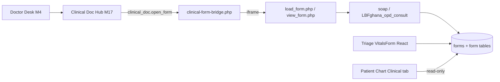

# Encounter Form — High-Level Facility Redesign Specification

| Field | Value |
|-------|--------|
| **Document version** | 0.1.0 |
| **Status** | Draft for review — analysis + external research + target design |
| **Companion to** | [NEW_CLINIC_V1_CLINICAL_DOCUMENTATION_REDESIGN.md](../done/NEW_CLINIC_V1_CLINICAL_DOCUMENTATION_REDESIGN.md) (M17), [NEW_CLINIC_V1_PRD.md](../NEW_CLINIC_V1_PRD.md), [NEW_CLINIC_V1_PAGE_DESIGNS.md](../NEW_CLINIC_V1_PAGE_DESIGNS.md), [MEDICAL_RECORD_DASHBOARD_REDESIGN.md](../done/MEDICAL_RECORD_DASHBOARD_REDESIGN.md) |
| **Audience** | Product, clinical leads, subspecialty chiefs, design, engineering, QA |
| **Scope** | The **primary consult / encounter note** and its surrounding documentation UX — not lab ops, billing, or full M17 hub IA (those remain in the clinical documentation spec) |
| **Implementation** | Design spec — phased engineering below |

---

## Table of contents

1. [Executive summary](#1-executive-summary)
2. [What “high-level facility” means here](#2-what-high-level-facility-means-here)
3. [Current-state analysis](#3-current-state-analysis)
4. [External research synthesis](#4-external-research-synthesis)
5. [Gap analysis vs target](#5-gap-analysis-vs-target)
6. [Target encounter form model](#6-target-encounter-form-model)
7. [Information architecture & UX redesign](#7-information-architecture--ux-redesign)
8. [Visual & interaction design](#8-visual--interaction-design)
9. [Integration with New Clinic surfaces](#9-integration-with-new-clinic-surfaces)
10. [Data model, APIs & storage strategy](#10-data-model-apis--storage-strategy)
11. [Phasing & PRD alignment](#11-phasing--prd-alignment)
12. [Acceptance criteria](#12-acceptance-criteria)
13. [Appendix A — Field dictionary](#appendix-a--field-dictionary)
14. [Appendix B — Visit-type variants](#appendix-b--visit-type-variants)
15. [Appendix C — Competitive & standards reference](#appendix-c--competitive--standards-reference)

---

## 1. Executive summary

Today, New Clinic encounter documentation is **correct for Ghana private OPD pilot** but **underserves a high-level facility** (multi-specialty outpatient, referral consultations, subspecialty clinics, trainee supervision, medicolegal audit expectations).

| Layer today | What it is | Limit for high-level facilities |
|-------------|------------|----------------------------------|
| **Default SOAP** | Four free-text textareas (`interface/forms/soap/`) | No structure for ROS, problem list, referral question, data reviewed, or numbered recommendations |
| **Ghana OPD LBF** | Nine textarea/select fields in 4 groups (`LBFghana_opd_consult`) | Built for 3–8 minute general OPD; no consult header, differential, or supervisor attestation |
| **Clinical Doc Hub (M17)** | React **launcher** → iframe legacy form | Authoring UX still feels like 2010 stock OpenEMR |
| **Triage vitals** | Modern React (`VitalsForm.tsx`) | Not unified with consult note; doctor re-enters summary manually |

**Recommendation:** Adopt a **tiered documentation strategy**:

1. **Keep NG5** for ancillary forms (labs, Rx, screening instruments) — stock PHP forms via bridge.
2. **Replace the primary consult note** at high-level facilities with a **native React encounter form** (`encounter-consult` island) that writes to a **structured LBF + narrative export** (or dedicated table) while preserving E-Sign and `forms` row semantics.
3. **Introduce bundle `referral_hospital_v1`** — visit-type-aware templates, specialty overlays, and stricter required-field / sign gates.

**Training one-liner:** *The hub tells you which document to open; the encounter form is where clinical reasoning lives — structured enough for audit, fast enough for clinic flow.*

---

## 2. What “high-level facility” means here

| Dimension | Ghana OPD pilot (current default) | High-level facility (this spec) |
|-----------|-------------------------------------|----------------------------------|
| **Setting** | Single-building private OPD | Multi-department hospital or referral center |
| **Visit mix** | URTI, malaria, HTN follow-up | Referral consults, pre-op, chronic subspecialty, same-day procedures |
| **Documentation time** | 3–8 minutes | 10–25 minutes for new consult; 5–12 for follow-up |
| **Medicolegal bar** | Signed SOAP sufficient | Independent assessment, explicit referral answer, problem-linked plan |
| **Staff model** | Solo doctor or small team | Consultants, registrars, nurses, supervisors |
| **Quality reporting** | Optional / off | May need extractable structured fields (BP, PHQ-9, ICD-linked problems) |
| **Referrals** | Informal | Formal consult requests with requesting service + clinical question |

**Personas**

| Persona | Need from encounter form |
|---------|--------------------------|
| **Consultant** | Fast structured sections, prefilled vitals/allergies, clear sign + attestation |
| **Registrar / trainee** | Same form + **supervisor attestation** before sign |
| **Referring clinician (read-only)** | Consult note that **answers the question** in Assessment + numbered Plan |
| **Nurse** | Does not author consult — vitals/instructions separate (unchanged) |
| **Medical records / QA** | Completeness rules by visit type; extractable problem list |

---

## 3. Current-state analysis

### 3.1 Architecture (as implemented)



**Key files**

| Area | Path |
|------|------|
| Hub launcher | `frontend/src/islands/clinical-doc/` |
| Form bridge | `oe-module-new-clinic/public/clinical-form-bridge.php` |
| Ghana LBF pack | `ClinicalDocLbfWizardService.php` — 9 fields, 4 groups |
| Catalog / bundles | `ClinicalDocCatalogService.php` — `ghana_opd_v1`, `referral_hospital_v1` |
| Referral hospital LBF pack | `ClinicalDocReferralHospitalLbfWizardService.php` — 19 fields, 8 groups |
| Stock SOAP | `interface/forms/soap/` |
| MRD read-back | `PatientChartClinicalService.php` → `ClinicalTab.tsx` **This visit** |

### 3.2 Ghana OPD LBF — current field model

| Group | Field | Type | Required |
|-------|-------|------|----------|
| Presenting complaint & history | Presenting complaint | Textarea | Yes |
| | History of presenting complaint | Textarea | Optional |
| | Past medical / surgical history | Textarea | Optional |
| Examination | Physical examination | Textarea | Yes |
| | Vitals summary (from triage) | Textarea | Optional — **manual paste** |
| Assessment & plan | Assessment / diagnosis | Textarea | Yes |
| | Plan | Textarea | Yes |
| Follow-up & quick codes | Follow-up instructions | Textarea | Optional |
| | Malaria quick code | Select | Optional |
| | HTN quick code | Select | Optional |

**Strengths:** Mirrors paper OPD flow; malaria/HTN quick codes fit local epidemiology; installable via M6 wizard without coding.

**Weaknesses for high-level facilities:** No referral header, ROS, problem list, ICD linkage, data reviewed, differential, supervisor attestation, or auto-prefill from triage/chart.

### 3.3 Stock SOAP — current field model

Four narrative textareas: **Subjective, Objective, Assessment, Plan** — no validation, no structure, no visit-type awareness.

### 3.4 UX pain points (encounter-specific)

| Pain | Impact at high-level facility |
|------|-------------------------------|
| iframe legacy UI | Breaks visual continuity with Doctor Desk / patient chart polish |
| No section navigation | Long consult notes require excessive scrolling in tiny iframe |
| Vitals re-entry | Error-prone; abnormal values not highlighted in note |
| No problem-oriented plan | Audit failures when Plan does not map to Assessment diagnoses |
| No referral consult template | Referring doctors cannot find the answer to their question |
| Sign/E-Sign inside iframe | Doctors lose hub sign overview context |
| Single bundle | Eye, cardio, ortho forms mixed or hidden — no department mode |

---

## 4. External research synthesis

Sources: [NCBI StatPearls SOAP](https://www.ncbi.nlm.nih.gov/books/NBK482263/), [Tandem Health SOAP guide](https://tandemhealth.ai/en/resources/knowledge/soap-format-clinical-documentation-practical-guide), [HL7 C-CDA Consultation Note V3](https://ccda.online/pdfs/2.16.840.1.113883.10.20.22.1.4.pdf), consultation note templates (specialist referral structure), EHR template best practices (visit-type + specialty templates, structured capture for quality reporting).

### 4.1 Enduring standards

| Standard | Requirement for encounter form |
|----------|-------------------------------|
| **SOAP** | Maintain S/O/A/P boundaries — do not mix patient report with exam findings |
| **Consultation note (referral)** | Explicit **reason for referral / clinical question**; independent HPI and exam; **numbered recommendations** |
| **H&P (new patient / pre-admission)** | Broader ROS and full exam documentation |
| **Problem-oriented record** | Each active problem has Assessment entry **and** Plan actions |
| **HL7 Consultation Note** | HPI required; optional ROS, PE, meds, results; Assessment and Plan sections |

### 4.2 Modern EHR UX patterns (2025)

| Pattern | Application |
|---------|-------------|
| **Visit-type templates** | New consult vs follow-up vs referral vs pre-op — show only relevant sections |
| **Specialty templates** | Cardiology consult ≠ general OPD — overlay PE shortcuts |
| **Structured + narrative hybrid** | Pick-lists for ROS/PE; free text for HPI and clinical reasoning |
| **Upstream intake** | Prefill subjective from reception/triage chief complaint and questionnaires |
| **Progressive disclosure** | Core sections expanded; screening/social detail collapsed until needed |
| **Actionable Plan** | Every diagnosis links to orders, Rx, referrals, follow-up — not prose-only |
| **Contemporaneous documentation** | Auto-save draft; explicit Sign; avoid copy-forward without review |
| **Mobile-safe** | Single column, ≥44px targets, sticky Save/Sign (align with M4 wizard) |

### 4.3 Anti-patterns to avoid

| Anti-pattern | Why it fails at high level |
|--------------|----------------------------|
| One giant free-text box | Not auditable; not extractable for quality reporting |
| Template sprawl (50 variants) | Inconsistent documentation; training burden |
| Copy-forward prior visit | Compliance risk; outdated problems persist |
| Billing fields in consult path | Already solved — keep fee_sheet off consult (M5/M14) |
| US-only widgets in default path | Already solved — cash clinic profile hides AMC |

---

## 5. Gap analysis vs target

| Capability | Ghana OPD today | High-level target | Priority |
|------------|-----------------|-------------------|----------|
| Referral consult header | ✗ | Requesting MD, service, clinical question, urgency | P0 |
| Structured HPI (OLDCARTS prompts) | Partial (free text) | Guided sub-prompts + narrative | P0 |
| Pertinent ROS | ✗ (stock `ros` hidden) | System checklist + “pertinent negatives” | P1 |
| Structured PE | Free text only | System sections + “normal” macros | P1 |
| Vitals auto-prefill | Manual textarea | Read-only from triage + abnormal flags | P0 |
| Allergies / meds context | Banner only | Acknowledgment strip in note | P0 |
| Problem list with ICD | ✗ | Primary + secondary diagnoses coded | P0 |
| Differential diagnosis | ✗ | Optional field for referral consults | P1 |
| Data reviewed | ✗ | Labs/imaging reviewed this visit | P1 |
| Numbered Plan | ✗ | Plan items linked to problems | P0 |
| Supervisor attestation | Doctor Desk combobox only | In-note attestation before sign | P1 |
| Native React authoring | ✗ (iframe) | Full-width modern form | P0 |
| Visit-type variants | ✗ | new / follow-up / referral / specialty | P0 |
| E-Sign / payment gates | ✓ (legacy) | Preserve — hub shows status | P0 |

---

## 6. Target encounter form model

### 6.1 Document types (visit-type driven)

| Visit type key | Form variant | Sections emphasized |
|----------------|--------------|-------------------|
| `general_opd` | Standard OPD | CC, HPI, brief ROS, focused PE, A&P |
| `new_consult` | Full consult | Full ROS option, complete PE, problem list |
| `referral_consult` | **Referral consult** | Referral header, independent HPI/PE, differential, numbered recommendations |
| `follow_up` | Interval visit | Interval history, targeted exam, problem status |
| `pre_procedure` | Pre-op / pre-procedure | Focused HPI, clearance assessment, plan |
| `specialty_*` | Specialty overlay | Adds specialty PE blocks (cardio, eye, ortho, etc.) |

Visit type comes from **`new_visit` + visit type admin (M6)** — not user-selected ad hoc.

### 6.2 Section map (referral consult — superset)

| # | Section ID | Label | Content | Prefill / source |
|---|------------|-------|---------|------------------|
| 0 | `header` | Consult identification | Date/time, location, consulting service, consultant name | Session |
| 1 | `referral` | Reason for consultation | Requesting clinician, service, **clinical question**, urgency | Optional referral module (M11) |
| 2 | `source` | Source of information | Patient interview, chart review, family, interpreter | User |
| 3 | `cc` | Chief complaint | One line | `new_visit.chief_complaint` |
| 4 | `hpi` | History of present illness | OLDCARTS prompts + narrative | User |
| 5 | `ros` | Review of systems | Pertinent systems checklist + negatives | Template by visit type |
| 6 | `background` | Background summary | PMH, PSH, meds, allergies, social, family | **Read** from Background HIS + link to edit |
| 7 | `vitals` | Vitals | BP, HR, RR, Temp, SpO₂, weight, pain | **Read-only** from triage vitals |
| 8 | `pe` | Physical examination | General + system blocks | User + macros |
| 9 | `data_reviewed` | Data reviewed | Labs, imaging, outside records | Pull recent results list |
| 10 | `assessment` | Assessment | Problem list + clinical impression + differential | User + ICD search |
| 11 | `plan` | Plan | Numbered actions **per problem** | Linked orders/Rx optional |
| 12 | `follow_up` | Follow-up & communication | Return visit, who calls whom, availability for questions | User |
| 13 | `attestation` | Attestation | Author role, supervisor (if trainee), sign timestamp | ACL + `SupervisorCombobox` |

**General OPD variant** collapses sections: omit `referral`, shorten `ros`, merge `data_reviewed` into `hpi` when empty.

### 6.3 Problem-oriented Assessment & Plan

Each **problem row**:

| Field | Type | Notes |
|-------|------|-------|
| `problem_label` | Text | Display name |
| `icd10_code` | Code search | Required at high-level facility for billable consults |
| `status` | Enum | New / stable / worsening / resolved |
| `assessment_narrative` | Textarea | Clinical reasoning |
| `differential` | Textarea | Optional — required for `referral_consult` |
| `plan_items[]` | List | `{ type: order|rx|referral|education|follow_up, text, linked_id? }` |

**Rule:** Plan tab shows validation error if any active problem has zero plan items.

### 6.4 Ghana + high-level coexistence

| Facility tier | Primary consult form | Bundle key |
|---------------|---------------------|------------|
| Private OPD (Ghana pilot) | `LBFghana_opd_consult` or SOAP | `ghana_opd_v1` |
| Multi-specialty hospital | Native **`EncounterConsultForm`** | `referral_hospital_v1` |
| Hybrid site | Config per visit type | Both — visit type picks variant |

---

## 7. Information architecture & UX redesign

### 7.1 Entry paths (unchanged routing, new primary form)

| Entry | Behavior |
|-------|----------|
| Doctor Desk → Open documentation | Hub → **Consult note** card → native form (when bundle = `referral_hospital_v1`) |
| Hub Consult lens | Primary card: “Consultation note” — status chip (draft / unsigned / signed) |
| MRD Clinical → This visit | Row opens same native form in edit mode |
| Advanced escape | Stock `forms.php` still available for admins |

### 7.2 Layout — desktop (≥1024px)

```
┌─────────────────────────────────────────────────────────────────────────────┐
│ T1 Patient context banner (queue #, CC, allergies, vitals abnormal)         │
├──────────────┬──────────────────────────────────────────────────────────────┤
│ Section nav  │  Active section content                                      │
│ (sticky)     │  ┌─────────────────────────────────────────────────────────┐ │
│ ● Referral   │  │ Section header + completion indicator                   │ │
│ ○ HPI        │  │ Structured fields + narrative                           │ │
│ ○ ROS        │  │                                                         │ │
│ ○ Vitals     │  │ [Prefilled read-only vitals card]                       │ │
│ ○ Exam       │  │                                                         │ │
│ ○ Assessment │  └─────────────────────────────────────────────────────────┘ │
│ ○ Plan       │  Footer: Save draft · Validate · Sign · Back to hub        │
└──────────────┴──────────────────────────────────────────────────────────────┘
```

### 7.3 Layout — mobile (≤767px)

- Vertical **stepper** (collapsible sections)
- Sticky bottom bar: **Save** | **Sign**
- Section nav becomes horizontal chip scroll

### 7.4 Interaction flows

| Flow | Steps |
|------|-------|
| **Draft** | Auto-save every 30s + manual Save; no E-Sign |
| **Validate** | Client checks required fields + problem-plan linkage |
| **Sign** | Calls stock E-Sign API; locks note; updates hub sign overview |
| **Return** | `closeTab` equivalent → hub or Doctor Desk per `return_to` |
| **Supervisor** | Trainee Sign disabled until supervisor selected + attestation checkbox |

### 7.5 Hub card changes (M17)

| Card field | Today | Target |
|------------|-------|--------|
| Preview | Last saved metadata only | First line of CC + problem count + unsigned problems |
| Actions | Open form | **Continue** (draft) / **Review & sign** (complete draft) / Open (legacy) |
| Primary badge | Required | **Required · Referral consult** when visit type = referral |

---

## 8. Visual & interaction design

Align with New Clinic tokens (`--oe-nc-*`, Figtree + Noto Sans) and admin/chart shell patterns (`ChartSection`-style cards).

| Element | Specification |
|---------|---------------|
| **Density** | Comfortable — 16px base; more whitespace than legacy iframe |
| **Section card** | Rounded-xl border, icon header, subtle enter animation (match patient chart) |
| **Vitals block** | Metric tiles; abnormal values use danger border (reuse `ChartMetricTile` pattern) |
| **Problem list** | Table with drag reorder; add problem opens ICD search modal |
| **Plan items** | Numbered list grouped under problem heading |
| **Validation** | Inline errors + section nav dot turns warning color |
| **Reduced motion** | Respect `prefers-reduced-motion` |
| **Accessibility** | Section nav as `<nav aria-label="Consult note sections">`; all fields labeled |

**Do not use** legacy Bootstrap inside the native form — shadcn primitives only.

---

## 9. Integration with New Clinic surfaces

| Surface | Integration |
|---------|-------------|
| **M4 Doctor Desk** | Documentation chip shows unsigned required consult; shortcut opens native form when configured |
| **M3 Triage** | Vitals API feeds `vitals` section — no duplicate entry |
| **MRD / Patient chart** | `ClinicalTab` **This visit** renders problem list summary + link to native form |
| **M5 Cashier** | Existing E-Sign gate unchanged — reads sign status from `forms` row |
| **M6 / M15 Admin** | New bundle `referral_hospital_v1`; wizard to enable native form; visit-type → variant mapping |
| **M11 Chart depth** | Referral header prefills from referral record when present |
| **Activity feed** | New event `encounter_note_signed` with problem count (V1.1-OPS) |

---

## 10. Data model, APIs & storage strategy

### 10.1 Storage options (decision)

| Option | Pros | Cons | Recommendation |
|--------|------|------|----------------|
| **A. Extended LBF** | NG5-friendly; stock E-Sign | Complex layout for problem list | Fallback / export target |
| **B. JSON column + `forms` row** | Flexible problem-plan model | Custom read paths in MRD | **Primary for native form** |
| **C. New table `nc_encounter_note`** | Clean schema | Migration + sync with `forms` | V2.1 if JSON insufficient |

**Closed decision D-ENC-1 (proposed):** Native form persists to **`forms` + JSON payload table** keyed by `form_id`; nightly or on-save export to LBF layout for stock reporting tools if needed.

### 10.2 Proposed AJAX actions

| Action | Purpose |
|--------|---------|
| `encounter_note.get` | Load draft/signed note for visit + variant |
| `encounter_note.save` | Upsert draft (partial sections allowed) |
| `encounter_note.validate` | Server-side completeness check |
| `encounter_note.sign` | E-Sign wrapper |
| `encounter_note.prefill` | CC, vitals, background, allergies, recent labs |

### 10.3 Config keys (M6)

| Key | Default | Purpose |
|-----|---------|---------|
| `encounter_note_engine` | `legacy` | `legacy` \| `native` |
| `encounter_note_variant_map` | JSON | Visit type → variant id |
| `encounter_note_require_icd` | `0` | Force ICD on problems when native |
| `encounter_note_supervisor_required` | `0` | Trainee attestation gate |
| `encounter_note_lbf_export_on_save` | `0` | Mirror native note into LBF layout on each save (stock reporting) |
| `encounter_note_lbf_export_formdir` | *(empty)* | Target LBF form id; empty = derive from `clinical_doc_bundle` |

---

## 11. Phasing & PRD alignment

| Phase | PRD slice | Deliverable |
|-------|-----------|-------------|
| **V1.2-DOC-HLF-1** | M17 extension | Bundle `referral_hospital_v1`; extended LBF pack `LBFreferral_opd_consult` (bridge-only interim) |
| **V1.2-DOC-HLF-2** | M17 + new island | `frontend/src/islands/encounter-consult/` — native form core sections (CC, HPI, vitals prefill, A&P) |
| **V1.2-DOC-HLF-3** | M17 | Referral header + problem-plan linkage + validate/sign |
| **V1.2-DOC-HLF-4** | M4 + MRD | Hub card preview + Clinical tab summary — **shipped** |
| **V2-DOC-HLF-5** | M17 specialty | Specialty PE overlays + ROS/background/data reviewed sections — **shipped** |
| **V2-DOC-HLF-6** | M11 | Referral prefill + export packet includes consult note — **shipped** |

**NG5 evolution:** Native form **does not** replace LBF runtime for all forms — only **primary consult**. Lab, Rx, screening remain stock.

---

## 12. Acceptance criteria

| ID | Criterion |
|----|-----------|
| ENC-HLF-1 | When `encounter_note_engine=native`, Consult card opens full-width React form — not iframe |
| ENC-HLF-2 | Vitals section prefills from triage; abnormal values visually flagged; not editable in note |
| ENC-HLF-3 | Chief complaint prefills from `new_visit.chief_complaint` |
| ENC-HLF-4 | Referral variant shows referral header; validation blocks sign if clinical question empty |
| ENC-HLF-5 | Assessment requires ≥1 problem; each problem requires ≥1 plan item before sign |
| ENC-HLF-6 | Sign creates stock E-Sign state; hub sign overview updates within one poll |
| ENC-HLF-7 | Payment / complete consult gates unchanged — unsigned native note blocks same as SOAP |
| ENC-HLF-8 | Ghana OPD sites with `ghana_opd_v1` unchanged — no regression |
| ENC-HLF-9 | Mobile 375px: all sections reachable; sticky Save visible |
| ENC-HLF-10 | Auto-save recovers draft after browser refresh |

### 12.1 Variant map (native engine)

| Variant id | Typical visit type | Visible sections (summary) |
|------------|-------------------|----------------------------|
| `general_opd` | Default OPD | CC, HPI, ROS, background, vitals, PE, problems, follow-up |
| `follow_up` | Return visit | CC, HPI, background, vitals, PE, problems, follow-up |
| `referral_consult` | Referral hospital | Referral header, source, CC, HPI, ROS, background, vitals, PE, data reviewed, problems, follow-up, attestation |

Visit type → variant mapping is configured via `encounter_note_variant_map` (JSON object keyed by `visit_type_id`).

### 12.2 Manual acceptance checklist (pilot)

Use after enabling `encounter_note_engine=native` on a test facility:

1. Hub Consult card opens full-width React form (not iframe) — ENC-HLF-1
2. Vitals prefill from triage; abnormal values flagged; vitals not editable in note — ENC-HLF-2
3. Chief complaint prefills from visit — ENC-HLF-3
4. Referral variant blocks sign when clinical question empty — ENC-HLF-4
5. Validate requires ≥1 problem with ≥1 plan item — ENC-HLF-5
6. Sign creates E-Sign lock; hub sign overview updates on poll — ENC-HLF-6
7. Unsigned native note blocks payment and complete consult (signed vitals alone does not pass) — ENC-HLF-7
8. Ghana OPD bundle sites with `encounter_note_engine=legacy` unchanged — ENC-HLF-8
9. Mobile 375px: section stepper + sticky Save/Sign bar — ENC-HLF-9
10. Refresh restores draft from `nc_encounter_note` — ENC-HLF-10
11. *(Optional)* With `encounter_note_lbf_export_on_save=1`, save mirrors fields into installed LBF layout for stock reports

---

## Appendix A — Field dictionary

*(Referral consult superset — implement subset per variant)*

| Field key | Section | Required (referral) | Widget |
|-----------|---------|---------------------|--------|
| `requesting_clinician` | referral | Yes | Text |
| `requesting_service` | referral | Yes | Text |
| `clinical_question` | referral | Yes | Textarea |
| `urgency` | referral | No | Select: routine / urgent / emergent |
| `source_of_information` | source | Yes | Multi-select + text |
| `chief_complaint` | cc | Yes | Text (500 char) |
| `hpi_narrative` | hpi | Yes | Rich textarea |
| `hpi_onset` | hpi | No | Date/duration |
| `ros_*` | ros | Pertinent | Checkbox group per system |
| `pe_general` | pe | Yes | Textarea |
| `pe_*` | pe | Specialty | Textarea per system |
| `labs_reviewed` | data_reviewed | No | Multi-select recent results |
| `imaging_reviewed` | data_reviewed | No | Text + attachment link |
| `problems[]` | assessment | Yes | Problem table |
| `plan_items[]` | plan | Yes | Linked list |
| `follow_up_instructions` | follow_up | Yes | Textarea |
| `supervisor_user_id` | attestation | When trainee | User select |
| `attestation_text` | attestation | When trainee | Checkbox + label |

---

## Appendix B — Visit-type variants

| Variant | Sections omitted | Extra validation |
|---------|------------------|------------------|
| `general_opd` | referral, data_reviewed, differential | CC + assessment + plan |
| `referral_consult` | — (full) | clinical_question + numbered plan |
| `follow_up` | ros (collapsed), source | interval HPI required |
| `pre_procedure` | referral | clearance statement in plan |

---

## Appendix C — Competitive & standards reference

| Source | Takeaway for this design |
|--------|--------------------------|
| [StatPearls SOAP](https://www.ncbi.nlm.nih.gov/books/NBK482263/) | S/O/A/P cognitive framework — preserve in section nav labels |
| [Tandem Health SOAP guide](https://tandemhealth.ai/en/resources/knowledge/soap-format-clinical-documentation-practical-guide) | Actionable Plan; clear Assessment; section boundaries |
| [HL7 C-CDA Consultation Note](https://ccda.online/pdfs/2.16.840.1.113883.10.20.22.1.4.pdf) | HPI required; structured optional sections map to our section IDs |
| Specialist consultation templates | Referral header + independent assessment + numbered recommendations |
| EHR template best practices (2025) | Visit-type + specialty templates; structured fields for quality; intake prefill |

---

## Document history

| Version | Date | Changes |
|---------|------|---------|
| 0.1.0 | 2026-07-06 | Initial draft — current-state analysis, external research, high-level facility target model, UX/data phasing |
| 0.1.1 | 2026-07-06 | V1.2-DOC-HLF-2 implemented — native `encounter-consult` island, `nc_encounter_note` storage, vitals prefill API |
| 0.1.2 | 2026-07-06 | V1.2-DOC-HLF-1 implemented — `referral_hospital_v1` bundle, `LBFreferral_opd_consult` LBF wizard + admin import |
| 0.1.3 | 2026-07-06 | V1.2-DOC-HLF-3 implemented — referral/source sections, problem-plan model, variant validation, supervisor attestation, admin config keys |
| 0.1.4 | 2026-07-06 | V1.2-DOC-HLF-4/5 implemented — hub/MRD integration; ROS, background, data reviewed, specialty PE overlays |
| 0.1.6 | 2026-07-06 | ENC-HLF-7 — profile-aware documentation gates; UX polish (mobile stepper, follow-up section, signed attestation banner) |
| 0.1.7 | 2026-07-06 | Optional on-save LBF export (`EncounterNoteLbfExportService`, default OFF); `formdir_keys` for `nc_encounter_consult`; acceptance checklist appendix |

---

**Next engineering step:** ~~HLF-1 through HLF-6 shipped~~. UX polish shipped. ~~ENC-HLF-7 gate regression shipped~~. ~~Optional on-save LBF export shipped~~. ~~E2E: `encounter-consult-native.spec.js`~~ (hub → native form → save → validate → sign → sign overview). Remaining: CI verification on XAMPP/Docker with native engine prep script.
